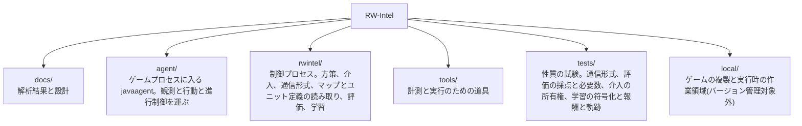

# RW-Intel

Rusted Warfare を機械学習でプレイするシステム。生産、アップグレード、攻撃目標の選定といった大局的な判断を担うモデルと、個々のユニットの戦闘機動を担うモデルを分け、両者を実時間で協調させることを目指す。

## 現状

ゲームへの接続方式を決定し、ゲーム内部の解析と性能実測を終え、モデルの設計を決め、**観測と行動の経路、五層のスクリプト方策、指揮系統の外から命令する介入の経路とスクリプト乱入者、方策どうしを比べる評価の仕組み、そして学習環境までを実装した段階**である。制御プロセスからゲームを動かして試合を回し、二つの方策を同一条件で交互に走らせ、その差を主張するのに何エピソード要るかまで報告する。二つのゲームプロセスを一つのロックステップ試合に入れることもでき、その試合の中でユニットを生成しても同期が壊れないことを確認した。戦術層を鍛える交戦アリーナは、交戦を組んでは戦わせ、掃討してまた組む形で実際に走っている。**方策を学習させた実行はいくつもあるが、手書きの層を上回ったと示された方策はまだ無い。** 手書き層の決定を教師として写した方策と、そこから強化学習を進めた三つの設定と、その一つを二度延長したものと、行動空間を 7 逸脱に広げて学習したものと、歩幅を上げて三本続けた鎖と、乱数から始めたものを、いずれも手書き戦術層と交戦させて採点した。**上回って見えたものが二つあり、どちらも選択に使っていない乱数種で測り直すと消えた。** **変わったのは位置である。** 7 逸脱の方策は交戦 1700 件規模で同じ交戦ごとに対にすると**手書き層より下にあった**(種 31337、-0.0313、2 標準誤差 0.0229)が、**いまの候補は下にない。** 候補を選ぶのに一度も使っていない**三つの種**で対にすると、残り体力で採る読みで種 20260723 が交戦 1550 件の **+0.0105 ± 0.0187**、種 20260724 が 1007 件の **+0.0078 ± 0.0245**、種 20260725 が 1059 件の **-0.0040 ± 0.0224** であり、三つを合わせて **+0.0054 ± 0.0124** である。**いずれも区間が 0 を含み、三つ目は符号が逆である。すなわち互角で、上回ったとは言えない。** この効果量で改善を主張するにはおよそ 4 倍の交戦が要り、**候補を選んだ種を確かめの種と合わせて読むことはしない。** 同時に分かったのは、**それまでのアリーナが方策とは別のものを測っていた**ことである。相手側が内蔵 AI として自分の試合をしていたこと、両軍が射程の外で向かい合って止まっていたこと、一つの用務に終端が繰り返し発火していたこと、組んだ交戦の 3 割が現れないまま捨てられていたこと、エピソード最初の交戦に自陣の司令部が紛れ込んでいたこと、その直しの残りかすとして自陣の建設機が同じ場所に紛れ込み続けていたこと、部隊の健全度がその部隊番号のエピソード中の最大戦力で割られていたこと、そして**エピソードごとに同じ交戦を引き直していて標本の数が 30 倍から 50 倍水増しされていたこと**の八つで、八つとも直して測り直してある。**いま試合を打つ方策はすべて手書きである。**

**環境ではなく学習信号の側にも、黙って信号を失っていた点が三つと、採点そのものの穴が一つ見つかり、四つとも直した。** アリーナの用務は交戦 1 件ぶん・平均 113 決定なのに割引 0.99 と GAE の trace 0.95 で刈られており、終端が届いていたのは交戦の最後の 3 秒半だけだったこと。一つのインスタンスがエピソードを終えるたびに、他の 11 インスタンスが戦っている最中の交戦の軌跡までまとめて切られていたこと。交戦の開始ポテンシャルが前の交戦の撃破を数えたまま取られていたこと。そして、交戦のおよそ 4 分の 3 はどちらも全滅しないまま終わるのに、生き残りを値段まるごとで数える採点ではその全部が両側ちょうど 0 点だったことである。**アリーナの用務は割り引かなくなり、採点は「撃破で採る」と「残り体力で割り引いて採る」の二通りになって、どちらの読みでも必ず両方を報告する。****ただし、四つのどれかが成績を動かしたという測定はまだ無い。** 直した根拠は、コードが文書の書いていることと違うことをしていたという一点である。

決定した方式は、ゲーム本体のプロセスに `-javaagent` で入り込み、エンジンの内部状態を直接読んでコマンドを直接発行するというものである。ネットワークプロトコルを解析して独自クライアントを作る案は、マルチプレイが決定論的ロックステップであり状態が一切通信されないため、シミュレーションの完全な再実装を伴うことになり退けた。判断の詳細は [docs/project/01-approach.md](docs/project/01-approach.md) にある。

プロセス内から次を行えることを実行時に確認済みである。

- ユニットの識別子、座標、体力、所属、種別、およびプレイヤーの資金と戦績の読み取り
- 登録済みの全ユニット種別の一覧と、その価格・技術レベル・移動タイプの読み取り
- ユニットへの命令の発行。移動を命じて実際に移動することを確認した
- システム命令によるユニットの生成。戦術層の学習環境がこれに依存する
- スキルミッシュの自動開始、勝敗の検出、次のエピソードへのリセット
- 内蔵 AI 同士を戦わせ、多数のエピソードの結果を集めること
- 実時間の 10 倍速での進行。8 並列で合計 80 倍。アリーナの学習実行では 12 並列で 1 インスタンス 9.3 倍、合計 112 倍、毎実時間秒 309 決定まで測ってある
- 五層(戦略・作戦・戦術・内政・編成)を契約で結んだスクリプト方策の実行
- 方策を交互に走らせた比較と、必要エピソード数の算出
- 指揮系統の外から部隊を取り上げ、契約を書き換え、編成を組み替えること。人間の行入力とスクリプト乱入者が同じ経路を通り、記録先を指定すれば介入はそのとき見ていた盤面と対にして残る
- 二つのゲームプロセスを一つのロックステップ試合に入れること。その中でシステム命令により 18 体を生成しても、両者のチェックサムは一致し desync も出なかった
- 交戦アリーナ。こちらが生成した以外に動くもののない盤面に両軍を生成し、戦わせ、掃討して次の交戦を組む
- アリーナのエピソードで部屋の内蔵 AI を停止し、相手側のユニットを制御プロセスだけが動かす状態にすること。停止する前は、相手側が自分の経済と自分の攻撃隊を持ってこちらの 2 倍勝っていた
- アリーナが左右どちらにも有利でないことを測ること。エピソードごとに交戦を引き直すようにしたアリーナで、両側を手書き層にした交戦 1380 件の平均は +0.0194、2 標準誤差 0.031 で 0 を含む。**引き直す前の測定は独立に引かれた交戦を 40 倍ほど多く数えており、そのころ「アリーナが傾いている」と読んでいた数字は一つも成立していなかった**
- 方策のアームと基準線のアームを同じ実行の中で交互に回し、**同じ交戦ごとに対にして差を取ること**。抽選の散らばりが丸ごと消えるので区間は半分になる。別々の実行で取った生値を引き算する読み方は、実際に三度誤った読みを生んだ
- 行動空間が動かせる幅をアブレーションで測ること。引き直すアリーナで対にすると、逸脱を一つも使わない方策(常に hold、エンジンの `attackMove` だけで戦う)は二つの乱数種で -0.0555 と -0.0423(区間 ±0.03)であり、**手書き層(定義により 0)より下にある**。何も学習していない乱数のままの網は -0.125 である。**すなわち逸脱の選び方が取り合っている幅は下へ 0.05 ほどである**
- 接敵したら必ず離れるだけの方策(常に withdraw)がどこにいるかは、**種によって答えが違う**。種 4242 で -0.0043 ± 0.029(手書き層と区別が付かない)、種 31337 で -0.0349 ± 0.0263(手書き層より下)である。**同じ種 31337 で、7 逸脱で学習した方策は -0.0313 ± 0.0229 であり、この一行の規則と区別が付かない**
- 成績から戦力の抽選ぶんを引く補正を入れ、自己検査で否決して外すこと。両側手書き層が 0 でなければならないところで交戦 901 件の -0.070 を出し、組まれる部隊のシェアが 53.1 対 50.0 に偏っていたことが原因だった。補正なしの同じ 901 件は -0.003 である
- 交戦を最後まで戦わせる設定と、もっと偏った戦力比を引く設定を、引き直すアリーナで測り直すこと。**どちらも基準線を動かさない**(対にした差は最大でも -0.022 ± 0.031)。決着する交戦は増えるが、同じ実時間で得られる交戦が 3 分の 2 に落ち、散らばりが広がる。**以前「打ち切りを外すと公平にできない」と読んでいた測定は、区間が支えていなかった**
- 手書き戦術層の決定を教師として集めること。12 並列でゲーム内 1200 秒、実時間 124 秒で 41,194 決定。選ばれた行動は hold 62.7 パーセント、withdraw 33.4 パーセントで、この層が実際に答えている問いは引くかどうかである
- その教師に 8,326 パラメータの網を当てはめること。検証に取り分けた 1 割で 99.9 パーセント再現し、行動分布は教師と 0.1 パーセント以内で一致する。**この 8,326 は逸脱が 5 つだったころの網の大きさである。逸脱が 7 つになったいまの戦術網は 8,456 パラメータ、幅 128 なら 25,096 である**
- 学習した方策と手書き層を交戦させ、交戦ごとの成績と、その平均を主張するのに何交戦要るかを報告すること
- 交戦を二通りに採点し、**どちらの読みでも全アームと全対差を報告すること**。生き残りを値段まるごとで数える読みと、残り体力の割合で割り引いて数える読みである。片方全滅で終わった交戦では二つは一致する。同じ交戦 2992 件で散らばりは体力の読みが 0.4839、値段まるごとの読みが 0.5501 であり、**同じ主張に要る交戦は 4 分の 1 ほど少ない**。二つのアームを比べるときに実際に効く「対にした差の散らばり」も測ってあり、**体力の読みで 0.34 から 0.41、値段まるごとの読みで 0.43 から 0.51、要る交戦は 5 分の 1 から 4 分の 1 少ない**。**体力の読みで幅そのものを測り直してはいない**
- アリーナの用務を割り引かずに学習させること。交戦 1 件は平均 113 決定の有限な用務なので、割引と GAE の trace をともに 1 に置く。**そうすると決定の優位は「この交戦は、ここから見込まれていたよりどれだけ良く転んだか」ちょうどになる**。**ただし、この算術で回した実行が前の算術より良い成績を出したという測定はまだ無い**
- 部隊を「新しく現れたもの」ではなく**実際に出した注文に照らして組むこと**。以前は、出撃地点を持つプレイヤーが最初から持つ建設機がエピソード最初の交戦の自軍部隊に紛れ込んでいた。学習実行のエピソード 1140 本のうち **793 本(70 パーセント)**が、自軍側だけ発注額のちょうど 500 クレジット上で組まれ、その交戦の成績は残りより **+0.1124(2 標準誤差 0.0379)高く、自軍は 176 勝 0 敗**だった。基地に停めた建設機は死なないので**構造上負けようがなかった**のである。種別ごとに発注数を超えた分を取らないようにして直した
- 部隊の健全度を**その交戦で組んだ価値で割ること**。ゲーム側はこの分母を下げない最大値として持っており、アリーナは部隊番号を二つしか持たないので、エピソードが進むほど分母が育っていた。**交戦のおよそ 63 パーセントが、部隊が満員のまま健全度を満たない値で始まっていた。足りない量の平均は 0.415 で、この特徴の値域は 0 から 1 である**
- 歩幅を上げた三本の学習実行を継いで、方策を実際に動かすこと。学習率 3e-4 では手書き層との一致が 100 から 97.7 パーセントへしか動かなかったが、1e-3 と 5e-4 で継ぐと **88.0 パーセント**まで、エントロピーは 0.252 から 0.507 まで動いた。**出てきた候補は、候補選びに使っていない三つの種で手書き層と互角である**(体力の読みで +0.0105・+0.0078・-0.0040、合わせて +0.0054 ± 0.0124)。**上回ったとは言えない**
- 方策を**確率最大の行動で打つか、自分の分布から抽選するか**の差を測ること。同じ基準線に対して同じ交戦の上で引くと、体力の読みで **+0.0208 / +0.0065 / +0.0196 / +0.0369 / +0.0119 / +0.0231** の六つが同じ符号に並ぶ。**逸脱の選び方が取り合っている帯が 0.05 ほどしかないところに対して、1 点の 40 分の 1 から 25 分の 1 である。運用時に方策がするのは抽選の側であり、これを払わずに済ませる道はまだ何も測っていない**

## 文書

内容は二つに分かれている。詳細な目次は [docs/README.md](docs/README.md) にある。

| 区分 | 内容 |
| --- | --- |
| [docs/game/](docs/game/) | Rusted Warfare の仕様と内部構造。逆アセンブルと実測の結果であり、このプロジェクトの都合とは無関係に成り立つ |
| [docs/project/](docs/project/) | RW-Intel の方針、実行基盤、モデル設計 |

はじめに読むなら [docs/project/01-approach.md](docs/project/01-approach.md)、モデルの設計に関わるなら [docs/project/04-model-design.md](docs/project/04-model-design.md)、実装に手を付けるなら [docs/project/05-interface.md](docs/project/05-interface.md) から入る。

## 構成



`local/` はバージョン管理から除外している。ゲーム本体の複製を含むためである。

## 準備

Rusted Warfare 1.15 build #28 が必要である。ゲームには OpenJDK 13 の完全な JDK が同梱されているため、JDK を別途導入する必要はない。

インストール先を `local/rw` に複製する。32bit 版 JVM とログ類は不要である。

```powershell
robocopy "<ゲームのインストール先>" local\rw /E /XD jvm cache /XF "hs_err_pid*.log" lastrun.log crashes.txt preferences.ini
```

計測エージェントをビルドし、実行用のディレクトリを作り、動作を確認する。

```powershell
.\tools\probe-agent\build.ps1
.\tools\New-RwInstance.ps1 -Count 8
.\tools\Start-RwProbe.ps1 -Count 1 -Speed 10 -Seconds 60
```

速度が 10 倍前後で報告されれば、ゲームをプロセス内から制御できている。実際のスキルミッシュを自動で回すには `-Map Lake` を加える。

マップとユニット定義を読むだけの道具はゲームを起動せずに動く。Python 3 以外の依存はない。

```powershell
python .\tools\Show-MapRegions.py
python .\tools\Show-UnitCatalog.py
```

## 動かす

制御プロセスを先に起動し、そこへゲームを接続する。エージェントは接続できるまで待つ。

```powershell
.\agent\build.ps1
python -m rwintel.control --instances 2 --episodes 2 --map Lake --max-seconds 300
.\tools\Start-RwAgents.ps1 -Count 2 -Speed 10
```

エピソードごとに勝敗と、決着しなかった場合の軍事価値差が報告される。詳細は [docs/project/05-interface.md](docs/project/05-interface.md) と [docs/project/02-runtime.md](docs/project/02-runtime.md) にある。

二つの方策を比べるときは評価の側を使う。方策はインスタンスの中で交互に走り、差とそれを主張するのに必要なエピソード数が出る。

```powershell
python -m rwintel.eval --instances 4 --episodes 3 --arm script --arm arm --map Lake --max-seconds 300
.\tools\Start-RwAgents.ps1 -Count 4 -Speed 10
```

手順の根拠は [docs/project/07-evaluation.md](docs/project/07-evaluation.md) にある。

試合の最中に人間が指揮を引き取るには、介入コンソールを開く。打った操作は指揮系統が出すのと同一形式の契約になり、`--interventions` を付けるとそのときの盤面と対にして書き出される。`--intrude` はスクリプト乱入者を入れる指定で、設計の頻度で干渉する相手を入れたまま計測するためのものである。

```powershell
python -m rwintel.control --instances 1 --map Lake --max-seconds 900 --console --interventions local\interventions.jsonl
python -m rwintel.control --instances 4 --episodes 4 --map Lake --max-seconds 300 --intrude
```

二つのゲームプロセスを一つのロックステップ試合に入れるには `--paired` を使う。どちらがホストでどちらが参加するかは制御プロセスが決める。`--spawn-probe` は試合中に生成を投入する回数で、エピソードの終わりにチェックサムの照合回数と一致の有無が報告される。

```powershell
python -m rwintel.control --instances 2 --paired --opponents 0 --map Lake --max-seconds 180 --spawn-probe 6
.\tools\Start-RwPairedMatch.ps1 -Speed 10
```

学習の実行である。`python -m rwintel.learn` は最初の語で実行の種類を選び、`tactics` `operations` `collect` `clone` `duel` の五つがある。戦術層は試合を回さず交戦アリーナの中で学習させ、作戦層は通常のスキルミッシュで乱入者を入れて回す。`collect` は決定器を渡さずに走らせて、スクリプトの決定を教師データとして書き出す。

```powershell
python -m rwintel.learn tactics --instances 4 --save local\tactics.pt
python -m rwintel.learn operations --instances 4 --episodes 6 --map Lake --max-seconds 300 --intruder --save local\operations.pt
python -m rwintel.learn collect --layer tactics --instances 4 --record local\teacher.jsonl
.\tools\Start-RwAgents.ps1 -Count 4 -Speed 10
```

**アリーナの実行に `--max-seconds` を渡す必要はない。** 省略時の既定はアリーナの 240 秒(`operations` だけ 300 秒)であり、**これを伸ばすのは throughput のつまみではなく測定を壊す操作である**。交戦は片付けられないので、1 本のエピソードの中の交戦は生き残りが溜まっていく同じ盤面を共有し、**件数のわりに標本が痩せる**。交戦を増やしたいなら `--episodes` を増やす。

`clone` は書き出した教師データに網を当てはめて、乱数ではなくスクリプトの真似から強化学習を始められるようにする。**これだけはゲームに触れない**ので、制御プロセスもゲームも起動しない。写した重みから学習を始めるときは `--warmup` を付けて、乱数のままの価値ヘッドを先に合わせ、模倣の狭さを溶かさないよう `--entropy` を小さいまま使う(既定がその値である)。

```powershell
python -m rwintel.learn clone --layer tactics --teacher local\teacher.jsonl --save local\tactics-bc.pt
python -m rwintel.learn tactics --instances 8 --load local\tactics-bc.pt --warmup 5 --save local\tactics.pt
```

`duel` は学習せずに測る実行で、こちら側に読み込んだ網、相手側にスクリプト戦術層を置いて交戦の成績を取る。**`--load` を渡した決闘は、両側スクリプトの基準線アームを既定で同時に取る。** 二つのアームは同じ交戦を戦うので、報告は交戦ごとに対にした差も出す。**成績は反対称なので基準線の平均は 0 でなければならず、0 から離れていればアリーナがその乱数種で盤面の片側に有利ということになる。** アリーナがどちらへ傾くかは種の性質なので、**同じ種の基準線を引かずに方策の生値を読んではならない。**

```powershell
python -m rwintel.learn duel --load local\tactics.pt --instances 8 --episodes 4
python -m rwintel.learn duel --instances 8 --episodes 4
.\tools\Start-RwAgents.ps1 -Count 8 -Speed 10
```

主な引数である。数値を省略した場合は [docs/project/08-learning.md](docs/project/08-learning.md) の定数表の値がそのまま使われ、模倣の実行についてはそれが最初の行に出る。

| 引数 | 実行 | 意味 |
| --- | --- | --- |
| `--instances` / `--episodes` | `clone` 以外 | 接続するゲームの数と、1 インスタンスあたりのエピソード数 |
| `--load` | `tactics` `operations` `clone` `duel` | 開始時に読むパラメータ。**`duel` だけは読み先が無ければ異常終了する**。学習の実行は新しい方策から始める |
| `--save` | `tactics` `operations` `clone` | 終了時に書くパラメータ |
| `--layer` | `collect` `clone` | どちらの層を記録するか、写すか |
| `--teacher` / `--smoothing` / `--epochs` / `--patience` / `--keep-tainted` | `clone` | 教師データと、その当てはめ方 |
| `--script` / `--script-opponent` | `tactics` | アリーナの両側をスクリプトにする / 相手だけをスクリプトに固定する |
| `--greedy` | `duel` | 方策 1 本につき「確率最大の行動で打つアーム」を**足す**。抽選のアームは運用時と同じものなので消えない。二つは同じ交戦を戦うので、抽選が課している税だけを切り出せる |
| `--intruder` | `operations` | スクリプト乱入者を注入する。設計が学習と評価の両方で要求している |
| `--record` / `--record-episodes` | `clone` 以外 | エピソード記録の書き出し先。`collect` だけは `--record` が決定列を指し、エピソード記録は `--record-episodes` に出る |
| `--device` | `collect` 以外 | torch のデバイス。既定は CPU で、この大きさの網ではカードより 3 倍から 7 倍速い |
| `--width` | `tactics` `clone` `duel` | 戦術網の 1 層あたりの隠れユニット数 |
| `--entropy` / `--learning-rate` | `tactics` `operations` | 方策をどれだけ一様さへ押すか、と最適化器の学習率 |
| `--outcome-weight` | `tactics` | アリーナで交戦の成績を終端としてどれだけの重みで払うか |
| `--score` | アリーナを使う実行 | 交戦の成績のどちらの読みを終端として払うか(`health` / `kills`)。既定は `health`。**決めるのは払う側だけで、報告はどちらの設定でも両方の読みで出る** |
| `--discount` / `--trace` | `tactics` | 1 決定あたりどれだけ先を割り引くか、と GAE がどれだけバイアスと分散を交換するか。既定はどちらも 1.0、すなわち交戦 1 件を割り引かない。`operations` は 0.99 と 0.95 に固定である |
| `--batch` | `tactics` `operations` `clone` | 1 回の勾配の一歩に載せる行数 |

torch を要求するのは学習側だけであり、スクリプト方策だけを走らせる実行はその費用を払わない。環境の設計と定数、そしてこれまでに取った測定は [docs/project/08-learning.md](docs/project/08-learning.md) にある。**手書きの戦術層を上回ったと示された方策はまだ無い。** 引き直すアリーナで対にして測ると、逸脱を一つも使わない方策が -0.0555 と -0.0423、乱数のままの網が -0.125 なので、**逸脱の選び方が取り合っている幅は下へ 0.05 ほどである。** 主張する価値のある改善は数百分の数であり、それを見るには片側で数千交戦が要る。**歩幅を上げて三本続けると方策は動き、出てきた候補は手書き層と互角になった。互角までである**([docs/project/08-learning.md](docs/project/08-learning.md) の「次に試すこと」)。
