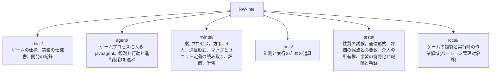

# RW-Intel

Rusted Warfare を機械学習でプレイするシステム。生産、アップグレード、攻撃目標の選定といった大局的な判断を担うモデルと、個々のユニットの戦闘機動を担うモデルを分け、両者を実時間で協調させることを目指す。

## 現状

ゲームへの接続方式を決定し、ゲーム内部の解析と性能実測を終え、モデルの設計を決め、**観測と行動の経路、五層のスクリプト方策、指揮系統の外から命令する介入の経路とスクリプト乱入者、方策どうしを比べる評価の仕組み、そして学習環境までを実装した段階**である。戦術層を鍛える交戦アリーナと、作戦層を鍛える構築作戦アリーナが、どちらも実際に走って測定を出している。

**いま試合を打つ方策はすべて手書きである。**

**戦術層。手書きの梯子を上回ったと示された方策は、まだ一つも無い。** 模倣、三つの設定の強化、その延長、行動空間を広げたもの、歩幅を上げた三本の鎖、macOS で独立に学習し直したものを、いずれも手書き戦術層と交戦させて採点した。**上回って見えたものが二つあり、どちらも選択に使っていない乱数種で測り直すと消えた。** いまの候補は候補選びに使っていない三つの種で **+0.0054 ± 0.0124** と互角である。**そして測定そのものの床を測った。同じ重みの複製を二つのアームとして同じ実行に入れても対にした差が ±0.02 出るので、単一の実行の数字で 0.02 未満の改善を主張してはならない。** この床は、これまでに出したどの候補よりも大きい。

**作戦層。フル試合では、作戦層の選択そのものが測れない。** 相手・地図・長さ・難易度を六通り変えて、梯子・模倣・強化のどれもが互いに 0.02 の内側に並んだ。選択が試合を動かす幅は点推定でおよそ 0.04 あるが、経済と AI の数が作る散らばりに埋もれる。**そこで経済を構成で取り除いた構築作戦アリーナを組み、そこでは分解できた。学習信号の誤りを直して鍛え直した層が、手書きの梯子を区間つきで初めて上回っている(+0.0470 ± 0.0284、学習にも選択にも使っていない種)。この計画で学習した層が梯子を上回ったのは、これが唯一である。** **ただし学んだのは「持っている地面を手放さないこと」であり、全部隊を一点へ送るだけの集中アームが示す +0.117 の上限には遠い。**

**この計画では、測定そのものの欠陥が結論を繰り返し書き換えている。** アリーナが方策とは別のものを測っていたことが八つ、学習信号を黙って失っていたことが四つ見つかり、いずれも直して測り直してある。**とくに、エピソードごとに同じ交戦を引き直していたために標本の数が 30 倍から 50 倍水増しされており、それより前に「アリーナが傾いている」と読んでいた測定は一つも成立していなかった。** 経緯と数字は [docs/record/](docs/record/) にある。

決定した方式は、ゲーム本体のプロセスに `-javaagent` で入り込み、エンジンの内部状態を直接読んでコマンドを直接発行するというものである。ネットワークプロトコルを解析して独自クライアントを作る案は、マルチプレイが決定論的ロックステップであり状態が一切通信されないため、シミュレーションの完全な再実装を伴うことになり退けた。判断の詳細は [docs/record/01-approach.md](docs/record/01-approach.md) にある。

プロセス内から次を行えることを実行時に確認済みである。

- ユニットの識別子、座標、体力、所属、種別、およびプレイヤーの資金と戦績の読み取り
- 登録済みの全ユニット種別の一覧と、その価格・技術レベル・移動タイプの読み取り
- ユニットへの命令の発行。移動を命じて実際に移動することを確認した
- システム命令によるユニットの生成。二つのアリーナがこれに依存する
- スキルミッシュの自動開始、勝敗の検出、次のエピソードへのリセット
- 内蔵 AI 同士を戦わせ、多数のエピソードの結果を集めること
- 実時間の 10 倍速での進行。8 並列で合計 80 倍。学習の実負荷では 12 並列で毎実時間秒 309 決定(Windows)から 363 決定(macOS)まで測ってある
- 五層(戦略・作戦・戦術・内政・編成)を契約で結んだスクリプト方策の実行
- 方策を交互に走らせた比較と、必要エピソード数の算出
- 指揮系統の外から部隊を取り上げ、契約を書き換え、編成を組み替えること。人間の行入力とスクリプト乱入者が同じ経路を通り、記録先を指定すれば介入はそのとき見ていた盤面と対にして残る
- 二つのゲームプロセスを一つのロックステップ試合に入れること。その中でシステム命令により 18 体を生成しても、両者のチェックサムは一致し desync も出なかった
- **交戦アリーナ。** こちらが生成した以外に動くもののない盤面に両軍を生成し、戦わせ、掃討して次の交戦を組む。部屋の内蔵 AI は停止させ、相手側も制御プロセスだけが動かす
- **構築作戦アリーナ。** 経済を構成で取り除いた盤面に、一つの中心について点反射で対称な配置を組み、両側へ鏡像で等しい部隊と守備を配り、地平まで両側の作戦→戦術の鎖を回して、各交戦点まわりの固定半径の体力加重 catchment から領域支配を反対称に採る
- **どちらのアリーナも、両側を手書き層にした自己対戦の平均が 0 であることを関門にしている。** 交戦アリーナは既定の設定で +0.0194 ± 0.031、構築作戦アリーナは Hills で -0.0034 ± 0.0049 である
- **複数のアームを 1 回の実行に入れ、同じ交戦・同じ盤面の上で交互に回して対にした差を読むこと。** 抽選の散らばりが消えるので区間は半分になる。**別々の実行で取った生値を引き算する読み方は、実際に三度誤った読みを生んだ**
- 交戦を二通りに採点し、どちらの読みでも全アームと全対差を報告すること。生き残りを値段まるごとで数える読みと、残り体力の割合で割り引いて数える読みである
- 手書き層の決定を教師として集め、網に写して、そこから強化学習を始めること

## 文書

内容は三つに分かれている。詳細な目次は [docs/README.md](docs/README.md) にある。

| 区分 | 内容 |
| --- | --- |
| [docs/game/](docs/game/) | Rusted Warfare の仕様と内部構造。逆アセンブルと実測の結果であり、このプロジェクトの都合とは無関係に成り立つ |
| [docs/system/](docs/system/) | 現状の実装が実際に何をするかの仕様書。コードと一対一で対応する |
| [docs/record/](docs/record/) | 進捗と開発の記録。何を決め、何を測り、何を測り直して取り下げたか |

はじめに読むなら [docs/record/01-approach.md](docs/record/01-approach.md)、システムの骨格を知るなら [docs/system/01-architecture.md](docs/system/01-architecture.md)、実装に手を付けるなら [docs/system/02-interface.md](docs/system/02-interface.md)、学習の数字を読むなら [docs/record/03-tactics.md](docs/record/03-tactics.md) から入る。

## 構成



`local/` はバージョン管理から除外している。ゲーム本体の複製を含むためである。

## 準備

Rusted Warfare 1.15 build #28 が必要である。ゲームには OpenJDK 13 の完全な JDK が同梱されているため、JDK を別途導入する必要はない。

インストール先を `local/rw` に複製する。32bit 版 JVM とログ類は不要である。

```powershell
robocopy "<ゲームのインストール先>" local\rw /E /XD jvm cache /XF "hs_err_pid*.log" lastrun.log crashes.txt preferences.ini
```

計測エージェントをビルドし、実行用のディレクトリを作り、動作を確認する。

```powershell
.\tools\probe-agent\build.ps1
.\tools\windows\New-RwInstance.ps1 -Count 8
.\tools\windows\Start-RwProbe.ps1 -Count 1 -Speed 10 -Seconds 60
```

macOS(Apple Silicon)では、ゲームをネイティブに走らせられないため、amd64 Linux ディストリビューションを Docker コンテナに入れて Rosetta で駆動し、制御プロセスだけをホストにネイティブで置く。ゲーム本体は `local/RustedWarfare_Linux`(`jvm-linux` と `.so` ネイティブを持つ Linux 版)を置く。構成と道具の詳細は [docs/system/06-runtime.md](docs/system/06-runtime.md) にある。

```bash
tools/macos/build-image.sh
tools/probe-agent/build.sh
tools/macos/start-probe.sh -Count 1 -Speed 10 -Seconds 60
```

速度が 10 倍前後で報告されれば、ゲームをプロセス内から制御できている。実際のスキルミッシュを自動で回すには `-Map Lake` を加える。

マップとユニット定義を読むだけの道具はゲームを起動せずに動く。Python 3 以外の依存はない。

```powershell
python .\tools\Show-MapRegions.py
python .\tools\Show-UnitCatalog.py
```

## 動かす

制御プロセスを先に起動し、そこへゲームを接続する。エージェントは接続できるまで待つ。

```powershell
.\agent\build.ps1
python -m rwintel.control --instances 2 --episodes 2 --map Lake --max-seconds 300
.\tools\windows\Start-RwAgents.ps1 -Count 2 -Speed 10
```

macOS では、コンテナがホストを別ホストとして見るので、制御プロセスは `127.0.0.1` ではなく `0.0.0.0` で待ち受けさせる。コンテナ側は `host.docker.internal` でホストへ達する。以降の `python -m rwintel.control` と `python -m rwintel.learn` のすべての例で `--host 0.0.0.0` を足し、`Start-RwAgents.ps1` を `tools/macos/start-agents.sh` に読み替える。

```bash
agent/build.sh
python -m rwintel.control --host 0.0.0.0 --instances 2 --episodes 2 --map Lake --max-seconds 300
tools/macos/start-agents.sh -Count 2 -Speed 10
```

エピソードごとに勝敗と、決着しなかった場合の軍事価値差が報告される。詳細は [docs/system/02-interface.md](docs/system/02-interface.md) と [docs/system/06-runtime.md](docs/system/06-runtime.md) にある。

二つの方策を比べるときは評価の側を使う。方策はインスタンスの中で交互に走り、差とそれを主張するのに必要なエピソード数が出る。

```powershell
python -m rwintel.eval --instances 4 --episodes 3 --arm script --arm arm --map Lake --max-seconds 300
.\tools\windows\Start-RwAgents.ps1 -Count 4 -Speed 10
```

手順の根拠は [docs/system/05-evaluation.md](docs/system/05-evaluation.md) にある。

試合の最中に人間が指揮を引き取るには、介入コンソールを開く。打った操作は指揮系統が出すのと同一形式の契約になり、`--interventions` を付けるとそのときの盤面と対にして書き出される。`--intrude` はスクリプト乱入者を入れる指定で、設計の頻度で干渉する相手を入れたまま計測するためのものである。

```powershell
python -m rwintel.control --instances 1 --map Lake --max-seconds 900 --console --interventions local\interventions.jsonl
python -m rwintel.control --instances 4 --episodes 4 --map Lake --max-seconds 300 --intrude
```

二つのゲームプロセスを一つのロックステップ試合に入れるには `--paired` を使う。どちらがホストでどちらが参加するかは制御プロセスが決める。`--spawn-probe` は試合中に生成を投入する回数で、エピソードの終わりにチェックサムの照合回数と一致の有無が報告される。

```powershell
python -m rwintel.control --instances 2 --paired --opponents 0 --map Lake --max-seconds 180 --spawn-probe 6
.\tools\windows\Start-RwPairedMatch.ps1 -Speed 10
```

学習の実行である。`python -m rwintel.learn` は最初の語で実行の種類を選び、`tactics` `operations` `collect` `clone` `duel` の五つがある。戦術層は試合を回さず交戦アリーナの中で学習させ、作戦層は通常のスキルミッシュで乱入者を入れて回す。`collect` は決定器を渡さずに走らせて、スクリプトの決定を教師データとして書き出す。

```powershell
python -m rwintel.learn tactics --instances 4 --save local\tactics.pt
python -m rwintel.learn operations --instances 4 --episodes 6 --map Lake --max-seconds 300 --intruder --save local\operations.pt
python -m rwintel.learn collect --layer tactics --instances 4 --record local\teacher.jsonl
.\tools\windows\Start-RwAgents.ps1 -Count 4 -Speed 10
```

macOS では、ホストの学習コマンドとコンテナのゲームを同時に生かして寿命を結ぶ `tools/macos/learn-run.sh` を使う。`--` の後にホストのコマンドをそのまま与えると、それを起動し、コンテナをその相手として立ち上げ、エピソードが終われば取り残さずコンテナを止める。

```bash
tools/macos/learn-run.sh --count 4 --speed 10 -- \
    python -m rwintel.learn tactics --host 0.0.0.0 --instances 4 --save local/tactics.pt
```

**アリーナの実行に `--max-seconds` を渡す必要はない。** 省略時の既定はアリーナの 240 秒(`operations` だけ 300 秒)であり、**これを伸ばすのは throughput のつまみではなく測定を壊す操作である**。交戦は片付けられないので、1 本のエピソードの中の交戦は生き残りが溜まっていく同じ盤面を共有し、**件数のわりに標本が痩せる**。交戦を増やしたいなら `--episodes` を増やす。

`clone` は書き出した教師データに網を当てはめて、乱数ではなくスクリプトの真似から強化学習を始められるようにする。**これだけはゲームに触れない**ので、制御プロセスもゲームも起動しない。写した重みから学習を始めるときは `--warmup` を付けて、乱数のままの価値ヘッドを先に合わせ、模倣の狭さを溶かさないよう `--entropy` を小さいまま使う(既定がその値である)。

```powershell
python -m rwintel.learn clone --layer tactics --teacher local\teacher.jsonl --save local\tactics-bc.pt
python -m rwintel.learn tactics --instances 8 --load local\tactics-bc.pt --warmup 5 --save local\tactics.pt
```

`duel` は学習せずに測る実行で、こちら側に読み込んだ網、相手側にスクリプト戦術層を置いて交戦の成績を取る。**`--load` を渡した決闘は、両側スクリプトの基準線アームを既定で同時に取る。** 二つのアームは同じ交戦を戦うので、報告は交戦ごとに対にした差も出す。**成績は反対称なので基準線の平均は 0 でなければならず、0 から離れていればアリーナがその乱数種で盤面の片側に有利ということになる。** アリーナがどちらへ傾くかは種の性質なので、**同じ種の基準線を引かずに方策の生値を読んではならない。**

```powershell
python -m rwintel.learn duel --load local\tactics.pt --instances 8 --episodes 4
python -m rwintel.learn duel --instances 8 --episodes 4
.\tools\windows\Start-RwAgents.ps1 -Count 8 -Speed 10
```

**構築作戦アリーナの実行は、`rwintel.learn` のサブコマンドではなく独立した三つのモジュールである。** 場を測る `ops_run`、その上で作戦層を学習させる `ops_train`、書かれた journal を盤面ごとに突き合わせる `ops_compare` である。**前の二つは他の実行と同じく先に起動してからゲームを繋ぎ、三つ目はゲームを起動しない。** `ops_run --our` は繰り返せる指定で、渡した数だけアームが立ち、**盤面は全アームが打ち終わるまで進まないので、1 回の実行がそのまま対にした比較になる。**

`ops_run` と `ops_train` の `--tactics` は、訓練済みの戦術層を**盤面の両側の下に凍結して置く**指定である。層は確率最大の行動で読まれ、rollout を渡さないので何も記録しない。**これがアーキテクチャの学習順序の後半、すなわち戦術層を先に定めて凍結し、作戦層だけを動かす一巡である。** 渡さなければ両側とも手書きの戦術層で、これまでの測定はすべてそちらで取ったものであり、何も変わらない。**渡した実行は別の計器であり、episode 記録に置いた層の名前(パラメータ本体の SHA-256)が入るので、`ops_compare` は異なる戦術層どうしを対にしない。**

```powershell
python -m rwintel.learn.ops_run --instances 8 --episodes 10 --map Hills --our script --our pin --our concentrate
python -m rwintel.learn.ops_train --instances 8 --episodes 40 --map Hills --load local\operations-bc.pt --warmup 5 --save local\ops-arena.pt
python -m rwintel.learn.ops_train --instances 8 --episodes 40 --map Hills --tactics local\tactics.pt --load local\operations-bc.pt --warmup 5 --save local\ops-under-tactics.pt
python -m rwintel.learn.ops_compare local\ops-eval-learnt.jsonl local\ops-eval-pin.jsonl
```

主な引数である。数値を省略した場合は [docs/system/04-learning.md](docs/system/04-learning.md) の定数表の値がそのまま使われ、模倣の実行についてはそれが最初の行に出る。

| 引数 | 実行 | 意味 |
| --- | --- | --- |
| `--instances` / `--episodes` | `clone` 以外 | 接続するゲームの数と、1 インスタンスあたりのエピソード数 |
| `--load` | `tactics` `operations` `clone` `duel` | 開始時に読むパラメータ。**`duel` だけは読み先が無ければ異常終了する**。学習の実行は新しい方策から始める |
| `--save` | `tactics` `operations` `clone` | 終了時に書くパラメータ |
| `--layer` | `collect` `clone` | どちらの層を記録するか、写すか |
| `--teacher` / `--smoothing` / `--epochs` / `--patience` / `--keep-tainted` | `clone` | 教師データと、その当てはめ方 |
| `--script` / `--script-opponent` | `tactics` | アリーナの両側をスクリプトにする / 相手だけをスクリプトに固定する |
| `--greedy` | `duel` | 方策 1 本につき「確率最大の行動で打つアーム」を**足す**。抽選のアームは運用時と同じものなので消えない。二つは同じ交戦を戦うので、抽選が課している税だけを切り出せる |
| `--intruder` | `operations` | スクリプト乱入者を注入する。設計が学習と評価の両方で要求している |
| `--record` / `--record-episodes` | `clone` 以外 | エピソード記録の書き出し先。`collect` だけは `--record` が決定列を指し、エピソード記録は `--record-episodes` に出る |
| `--device` | `collect` 以外 | torch のデバイス。既定は CPU で、この大きさの網ではカードより 3 倍から 7 倍速い |
| `--width` | `tactics` `clone` `duel` | 戦術網の 1 層あたりの隠れユニット数 |
| `--entropy` / `--learning-rate` | `tactics` `operations` | 方策をどれだけ一様さへ押すか、と最適化器の学習率 |
| `--outcome-weight` | `tactics` | アリーナで交戦の成績を終端としてどれだけの重みで払うか |
| `--score` | アリーナを使う実行 | 交戦の成績のどちらの読みを終端として払うか(`health` / `kills`)。既定は `health`。**決めるのは払う側だけで、報告はどちらの設定でも両方の読みで出る** |
| `--discount` / `--trace` | `tactics` | 1 決定あたりどれだけ先を割り引くか、と GAE がどれだけバイアスと分散を交換するか。既定はどちらも 1.0、すなわち交戦 1 件を割り引かない。`operations` は 0.99 と 0.95 に固定である |
| `--batch` | `tactics` `operations` `clone` | 1 回の勾配の一歩に載せる行数 |

torch を要求するのは学習側だけであり、スクリプト方策だけを走らせる実行はその費用を払わない。環境の設計と定数は [docs/system/04-learning.md](docs/system/04-learning.md)、これまでに取った測定は [docs/record/03-tactics.md](docs/record/03-tactics.md) と [docs/record/04-operations.md](docs/record/04-operations.md) にある。**手書きの戦術層を上回ったと示された方策はまだ無い。** 引き直すアリーナで対にして測ると、逸脱を一つも使わない方策が -0.0555 と -0.0423、乱数のままの網が -0.125 なので、**逸脱の選び方が取り合っている幅は下へ 0.05 ほどである。** 主張する価値のある改善は数百分の数であり、それを見るには片側で数千交戦が要る。**そのうえ、同じ重みを二度測っても ±0.02 出る**([測定の床](docs/record/03-tactics.md))。
