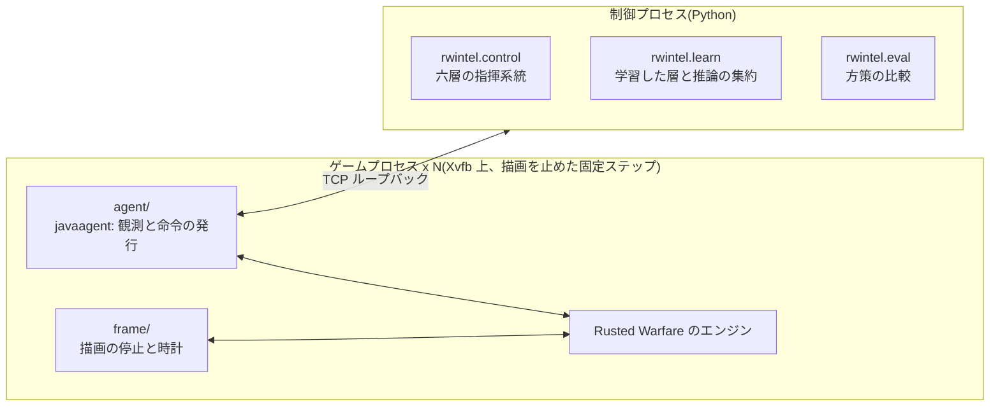
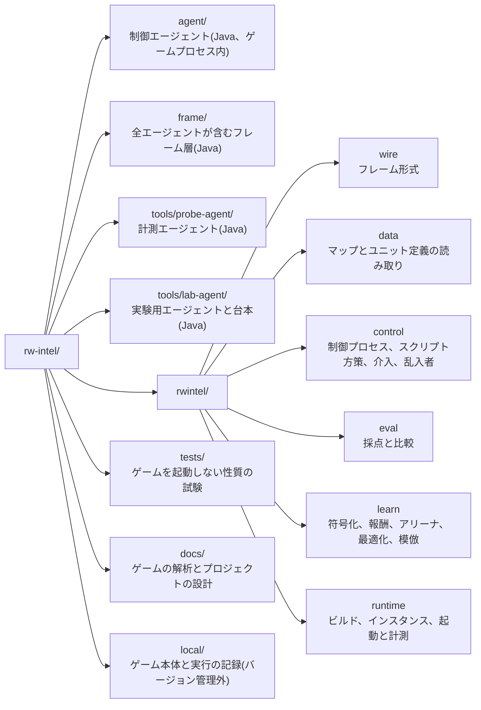

# RW-Intel

RW-Intel は、RTS ゲーム Rusted Warfare を機械学習でプレイするためのシステムである。ゲームのプロセスに javaagent として入り込んでエンジンの状態を直接読み、正規のコマンド経路で命令を出す。その外側の Python の制御プロセスが、層に分けた指揮系統で判断を下す。

## 何をするものか

- **ゲームに寄生して観測と行動を取り出す。** ロックステップのゲームでは状態がネットワーク上に流れないので、プロセスの内側から読むしかない([docs/project/01-approach.md](docs/project/01-approach.md))。javaagent `agent/` がゲームスレッド上で観測を組み立て、TCP で制御プロセスへ送り、返ってきた決定をコマンドとして発行する。
- **指揮を層に分け、層の間を意味の固定された契約で結ぶ。** 戦略・作戦・戦術の指揮の階梯と、内政・編成・移送の戦力供給の六層である。全層をスクリプト方策として先に書いてあり、それが常に動くシステムであると同時に、学習の教師と評価の基準を兼ねる([docs/project/04-model-design.md](docs/project/04-model-design.md))。
- **学習させるのは内政・作戦・戦術の 3 層だけである。** 戦術層は試合を回さずに、交戦を組んでは戦わせる交戦アリーナで学習する。内政層と作戦層は試合を回して学習する。学習環境、評価の手順、スクリプトの模倣からの初期化まで実装してある([docs/project/08-learning.md](docs/project/08-learning.md))。
- **人間が層と部隊の単位で指揮を引き取れる。** 介入は指揮系統と同じ契約の形で行い、そのときの盤面と対にして記録できる。

**現状**: 観測と行動の経路、六層のスクリプト方策、介入の経路、評価、学習環境は実装済みである。学習した戦術層で、手書きの戦術層を上回ったと示されたものはまだ無い。作戦層は、スクリプトと規則のアブレーションと学習した網を同じ試合の条件で比べられ、スクリプトや規則からの模倣と、試合を回す強化学習が動く。スクリプト作戦層を写して試合の採点に揃えた報酬で学習を進めた作戦層は、手段を選ぶ前の頭でスクリプト作戦層を小さく上回った。歩くか運ばれるかも選ぶ今の頭の網は、まだスクリプト作戦層と区別が付かない。内政層は、スクリプトの判断器を写した網と、試合を回す強化学習が動く。学習した内政層がスクリプト内政層を上回るかどうかは、まだ測っていない。



## リポジトリの構成



## 必要なもの

- x86_64 の Linux。表示装置は要らない(仮想ディスプレイ Xvfb を使う)
- Rusted Warfare 1.15(build #28)の Linux 版。ゲーム本体はこのリポジトリに含まれない
- エージェントのビルド用の JDK 9 以降。ゲームが同梱するのは `javac` の無い Java 8 の JRE である
- Python 3.10 以降。`torch` を使うのは `rwintel.learn` だけである
- 記録から学習する機材(`python -m rwintel.learn offline`、学習器と行動器を同じ機材で回す `online`)では、CUDA 版の `torch` を入れるとグラフィックスカードで学習する(`pip install --force-reinstall --index-url https://download.pytorch.org/whl/cu130 torch`)。ゲームを動かすだけの機材は CPU 版でよい([docs/project/02-runtime.md](docs/project/02-runtime.md))

Ubuntu では次で揃う。

```bash
sudo apt-get install -y openjdk-17-jdk-headless xvfb x11-xserver-utils libgl1-mesa-dri libglx-mesa0 libxrandr2 libxcursor1 libxxf86vm1 libxi6 libxtst6 python3-venv
python3 -m venv .venv
.venv/bin/pip install -r requirements.txt
```

ゲームの配布物を `local/` に展開する。別の場所に置く場合は環境変数 `RWINTEL_GAME` でそのディレクトリを指す。

```bash
unzip local/RustedWarfare_Linux.zip -d local/
```

詳細は [docs/project/02-runtime.md](docs/project/02-runtime.md) にある。

## 使い方

以下は venv を有効にした状態で書く。

性質の試験はゲームを起動せずに走る。

```bash
python -m pytest tests
```

ゲームが動くことと、その速度を確かめる。エージェントのビルド、インスタンスディレクトリの作成、仮想ディスプレイの起動は、ゲームを起動する道具が必要に応じて自動で行う。ゲームは既定で描画を止め、1 フレーム 25 ミリ秒の固定ステップで CPU の許す限り速く回る(`--clock wall` でゲーム自身の時計、`--draw` で描画、`--speed` で速さの上限)。

```bash
python -m rwintel.runtime probe --count 4 --seconds 90
```

スクリプト方策で試合を回す。`run` は `--` の後ろに書いた制御プロセスを起動し、そこへ `--count` 個のゲームを接続させ、制御プロセスが終わるとゲームを止める。

```bash
python -m rwintel.runtime run --count 2 -- control --episodes 2 --map Lake --max-seconds 300 --record
```

評価と学習も同じ形で回す。制御プロセスを別の端末で動かす形(`python -m rwintel.runtime agents`)もある([docs/project/02-runtime.md](docs/project/02-runtime.md))。

```bash
python -m rwintel.runtime run --count 4 -- eval --episodes 3 --arm script --arm arm
python -m rwintel.runtime run --count 4 -- learn tactics --save local/models/tactics.pt
python -m rwintel.runtime run --count 13 -- learn operations --load local/models/ops-bc.pt --save local/models/ops-rl.pt --warmup 3 --batch 1024 --learning-rate 1e-4 --anchor 0.5 --checkpoint-every 3 --difficulty -1 --intruder
python -m rwintel.runtime run --count 13 -- eval --episodes 4 --arm script --arm ops-random --arm operations:local/models/ops-rl.pt --intrude --difficulty -1 --max-seconds 900
python -m rwintel.runtime run --count 12 -- learn collect --layer economy --episodes 2 --difficulty 0
python -m rwintel.learn clone --layer economy --dataset local/datasets/economy/collect-<日時> --save local/models/eco-bc.pt
python -m rwintel.runtime run --count 12 -- learn collect --layer economy --student local/models/eco-bc.pt --explore 0.1 --episodes 2 --difficulty 0
python -m rwintel.learn clone --layer economy --dataset local/datasets/economy/collect-<日時> --dataset local/datasets/economy/collect-<日時> --save local/models/eco-bc2.pt
python -m rwintel.runtime run --count 12 -- learn economy --load local/models/eco-bc2.pt --save local/models/eco-rl.pt --warmup 2 --anchor 0.5 --checkpoint-every 2 --difficulty 0
python -m rwintel.runtime run --count 12 -- eval --episodes 4 --arm script --arm economy:local/models/eco-rl.pt --difficulty 0 --max-seconds 900
```

人間が自分のゲームクライアントから参加して、AI と対戦することもできる。`run` が試合をホストし、参加先のアドレスを表示する。クライアントは同じ版(1.15 build #28)を mod 無しで動かしている必要がある([docs/project/02-runtime.md](docs/project/02-runtime.md) の人間と対戦する)。

```bash
python -m rwintel.runtime run --count 1 -- control --versus
python -m rwintel.runtime run --count 1 -- control --versus --policy operations:local/models/ops-rl.pt --record
```

試合はリプレイに記録され、`--versus` の実行は終わりにそれを `local/replays/` に残す。リプレイはゲームを起動せずに読め、再生すれば記録した試合がそのまま再現されるので、盤面を取り直しながら解析し、人間の命令から作戦層の決定を推定して教師にできる([docs/project/09-replays.md](docs/project/09-replays.md))。

```bash
python -m rwintel.replay inspect "local/replays/<名前>.replay"
python -m rwintel.runtime run --count 2 -- replay play local/replays/*.replay --journal local/episodes/control-<日時>.jsonl --imitate
python -m rwintel.learn clone --layer operations --dataset local/datasets/operations/collect-<日時> --dataset local/datasets/operations/replay-<日時>:0.2 --save local/models/ops-bc.pt
```

層の決定を打つ実行は、その決定を `local/datasets/<層>/<実行>/` に記録する。記録は符号化の版を持ち、状態を作った材料から今の符号化で作り直せる([docs/project/08-learning.md](docs/project/08-learning.md) の記録)。

```bash
python -m rwintel.learn dataset inspect local/datasets/tactics/collect-<日時> --verify
```

記録だけを読む学習(`offline`)と、学習器と行動器のゲームを一つのコマンドで回すループ(`online`)は、グラフィックスカードで回す。CUDA 版の `torch` を入れ、スクリプトの決定を記録し、それを集合の網に写し、その網から始めてループを回し、出来た網を決闘でスクリプト戦術層と比べる。各段の意味は [docs/project/08-learning.md](docs/project/08-learning.md) のグラフィックスカードで強化学習を回す にある。

```bash
pip install --force-reinstall --index-url https://download.pytorch.org/whl/cu130 torch
python -m rwintel.runtime run --count 8 -- learn collect --layer tactics --both-sides --explore 0.1 --episodes 10
python -m rwintel.learn offline --layer tactics --dataset local/datasets/tactics/collect-<日時> --method bc --net set --save local/models/tactics-set.pt
python -m rwintel.learn online --layer tactics --dataset local/datasets/tactics/collect-<日時> --load local/models/tactics-set.pt --save local/models/tactics-actor.pt --count 8 --episodes 20 --shard-decisions 2000
python -m rwintel.runtime run --count 8 -- learn duel --load local/models/tactics-actor.pt --episodes 30
```

主な入口は次のとおりである。`--help` でそれぞれの引数が出る。

| コマンド | 用途 |
| --- | --- |
| `python -m rwintel.control` | 方策で試合を回す(`--policy` で選び、既定はスクリプト方策)。`--versus` で人間の相手をホストし、`--console` で人間が介入し、`--intrude` でスクリプト乱入者を入れる |
| `python -m rwintel.eval` | 方策を比較し、差とそれを主張するのに要るエピソード数を報告する。作戦層を学習した網や規則に差し替えたアーム、内政層を学習した網に差し替えたアームも取れる。`--map` を繰り返すと地図を順に回す |
| `python -m rwintel.eval.search` | スクリプトの規則の初期値を successive halving で探し、選んだ設定を別の乱数種で測り直す |
| `python -m rwintel.learn` | 決定の収集(`collect`、`--student` / `--rule` / `--pin` で打つものを替え、`--explore` で探索を混ぜ、判断器がラベルを付ける)、模倣(`clone`)、学習(`tactics` / `operations` / `economy`)、戦術層の評価(`duel`、`--from` で終わった決闘を読み直す)、種別どうしの相性の測定(`matchups`)、記録の点検と符号化し直し(`dataset`)、記録からの学習(`offline`、`--follow` で行動器の記録を追い続ける)、学習器と行動器のゲームを一つのコマンドで回すループ(`online`)、推論の費用の測定(`bench`) |
| `python -m rwintel.runtime` | 制御プロセスとゲームの一括起動(`run`)、エージェントのビルド、インスタンスの作成、ゲームの起動と計測 |
| `python -m rwintel.data` | マップの領域の切り出し(`regions`)、ユニット一覧(`units`)、地形と陸塊の報告と描画(`terrain`)。ゲームを起動しない |
| `python -m rwintel.replay` | リプレイの読み取り(`inspect`)、解読の照合(`verify`)、観測しながらの再生と人間のプレイからの決定の推定(`play`) |

実行が書き出すものはすべて `local/` の下に入る。ゲームプロセスの出力は `local/logs/<道具>/<日時>/`、制御プロセスのログは `local/logs/control/` などに、エピソード記録は `local/episodes/` に、学習したパラメータは `local/models/` に、残したリプレイと再生の書き出しは `local/replays/` に残る。

## 文書

文書の目次は [docs/README.md](docs/README.md) にある。`docs/game/` がゲームそのものの解析結果(内部構造、観測と命令の対応、試合の制御、マルチプレイ、内蔵 AI)、`docs/project/` がこのプロジェクトの設計(方式、実行基盤、速度、モデルの骨格、インタフェース、スクリプト方策、評価、学習)である。

初めて読む場合は [docs/project/01-approach.md](docs/project/01-approach.md) から、動かす場合は [docs/project/02-runtime.md](docs/project/02-runtime.md) から読むとよい。
