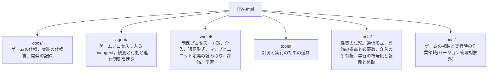

# RW-Intel

Rusted Warfare を機械学習でプレイするシステム。生産、アップグレード、攻撃目標の選定といった大局的な判断を担うモデルと、個々のユニットの戦闘機動を担うモデルを分け、両者を実時間で協調させることを目指す。

## 現状

ゲームへの接続方式を決定し、ゲーム内部の解析と性能実測を終え、モデルの設計を決め、**観測と行動の経路、五層のスクリプト方策、指揮系統の外から命令する介入の経路とスクリプト乱入者、方策どうしを比べる評価の仕組み、そして学習環境までを実装した段階**である。戦術層を鍛える交戦アリーナと、作戦層を鍛える構築作戦アリーナが、どちらも実際に走って測定を出している。

**いま試合を打つ方策はすべて手書きである。**

**この場が報いる技能はフル試合へ乗る。** 構築作戦アリーナで手書きの梯子を上回る集中アームは、**フル試合でも梯子を +0.065 上回る**(96 試合ずつ、必要 91 対で分解)。経済成分も -0.369 から -0.315 へ動く——**地面を取ることは収入の上流である。** 同じ実行で、梯子と「何も選ばない固定配備」は区別が付かない(-0.004、必要 19,441 対)。**すなわち梯子の丁寧な選択が試合を動かしている証拠は無く、動かしているのは一点へ集めることである。** 構築した場が測ったものが試合で再現したという、この計画で初めての確認である。

**三つの層の「選択の幅」を初めて測り切った。** 戦術の逸脱は全体で 0.013 から 0.026(**測定の床と同じ**)、作戦は 0.065 から 0.095、戦略の姿勢は **0.11** である。**そして幅の中で手書き層がどこにいるかは層ごとに違う**——戦略は既に上端(最良の固定姿勢との差は +0.018、必要 986 対)で学習に残る余地はおよそ 0.02、作戦は下端で集中との差が 0.065 ある。**「学習時間を伸ばせば強くなる」が成り立たない理由は層ごとに別である。**

**学習させる層は指揮の階梯の三段すべてである。** 戦術層と作戦層に加えて、**戦略層(10 秒に一度の姿勢)の学習経路も通した**——29 個の集計特徴、姿勢 5 つの頭、そして**試合の採点そのものを終端に受け取る**形である。設計上、試合の結果を見る層はここだけであり、**この層には構築した場が無い**:戦略層が決めているのは試合そのものの使い方なので、経済を取り除いた場を組むとその決定が残らない。**鍛えた戦略層はまだ無く、したがって梯子と比べた数字も無い。** 併せて、**訓練済みの層を学習中の層の下に凍結して置く配線**(`--frozen tactics:<パス>`)を通した。設計は最初から「他層は必ず凍結する」を要求していたが、試合の中でそれを行う口はどこにも無かった。

**戦術層。手書きの梯子を上回ったと示された方策は、まだ一つも無い。** 模倣、三つの設定の強化、その延長、行動空間を広げたもの、歩幅を上げた三本の鎖、macOS で独立に学習し直したものを、いずれも手書き戦術層と交戦させて採点した。**上回って見えたものが二つあり、どちらも選択に使っていない乱数種で測り直すと消えた。** いまの候補は候補選びに使っていない三つの種で **+0.0054 ± 0.0124** と互角である。**そして測定そのものの床を測った。同じ重みの複製を二つのアームとして同じ実行に入れても対にした差が ±0.02 出るので、単一の実行の数字で 0.02 未満の改善を主張してはならない。** この床は、これまでに出したどの候補よりも大きい。**訓練の相手を梯子に固定するか自分自身にするかで、決闘の成績は 0.031 動く。既定の自己対戦で鍛えた層は梯子より 0.040 下にあり(-0.0402 ± 0.0214)、これはこの計画で学習した戦術方策が梯子と区間つきで分離した最初の例で、向きは下である。** **そして符号化が地図そのものの枠を運んでいたことが分かり、取り除いた。58 個の戦術特徴のうち盤面の点反射で符号が変わるのは目標への単位方向ベクトルの 2 つだけで、残り 56 個は二つの側でビット一致していた。脅威の重心から見た目標の方位に置き換え、網が盤面とその点反射に同じ答えを返すことをゲーム不要の試験で固定してある。** **これは作戦アリーナの計器の欠陥を一つ取り除いたものであって、戦術層を強くしたものではない——その符号化で鍛え直した層は梯子に対して -0.0398 ± 0.0228 と 0 を外して下回り、旧符号化の同条件(-0.0042 ± 0.0224)は互角だった。方位を脅威から測る以上、何にも撃たれていない部隊——係争点へ行軍している部隊がまさにそれ——は方向を持たない。不変性は情報と引き換えに買っている。** **その情報は買い戻した。基準を各側の自陣から外へ向かう向きに取る形で、点反射が自陣と敵陣を入れ替えるので不変性は保たれ、撃たれていなくても常に定義される。基準点は側ごとに置く必要があり、交戦アリーナは各側の出撃地点を、作戦アリーナは各側の staging point を入れる。同じ設定で鍛え直した層は +0.0036 ± 0.0226 で 0 を含み、0.0398 の下がりは無くなった——ただし梯子を上回ってもいない。選択に使っていない種で凍結して決闘に出しても、確率最大で +0.0057 ± 0.0213、抽選で -0.0085 ± 0.0219 と、どちらも梯子と区別が付かない。**

**作戦層。フル試合では、作戦層の選択そのものが測れない。** 相手・地図・長さ・難易度を六通り変えて、梯子・模倣・強化のどれもが互いに 0.02 の内側に並んだ。選択が試合を動かす幅は点推定でおよそ 0.04 あるが、経済と AI の数が作る散らばりに埋もれる。**そこで経済を構成で取り除いた構築作戦アリーナを組み、そこでは分解できた。学習信号の誤りを三つ直したうえで、訓練済みの戦術層を両側の下に凍結して 150 エピソード鍛えた層が、同じ実行に立てた手書きの梯子を上回った。** **ただし同じ測定を計器を直しながら三度取っており、上回りは直すごとに縮んだ。** `script` − `learnt` は、枠を運ぶ計器で -0.1111 ± 0.0318 と -0.1122 ± 0.0409、戦術の方位を各側の自陣基準にした計器で -0.1045 ± 0.0443 と -0.1142 ± 0.0347、**作戦の切り出しまで鏡像合同にすると -0.0132 ± 0.0346(種 80001、0 を含む)と -0.0632 ± 0.0356(種 90001)である。いまは二つの測定種のうち一つでしか区間つきに言えない。** **この計画で学習した層が手書きの層を上回ったのは、それでもこれが唯一である。**

**そして取り下げたものが二つある。「集中アームも上回った」は二度反転した。** 全部隊を一点へ送る集中アームに対して、`concentrate` − `learnt` は傾いた計器で -0.0508 と -0.0487(学習層が上)、戦術の方位を直すと -0.0186 と -0.0113(区別が付かない)、**作戦の切り出しまで直すと +0.0637 ± 0.0399 と +0.0395 ± 0.0376 で、二つの種とも集中アームが上である。** **もう一つは「枠を取り除けば良くなる」である。** 地図の番号で並んだ領域行は一つの固定マップの上では「どの場所か」を名指ししており、自陣中心の並びはその同一性を捨てて汎用性と引き換えにする。**戦術の方位で払った代償と同じ形で、不変性は情報と引き換えである。** **そのぶん計器はこれまでで最も締まった**——`script` アームの自己対戦ゼロが -0.0008 ± 0.0093 と -0.0010 ± 0.0139 で、三世代で最も 0 に近い。

**その原因の一つは取り除かれ、取り直した三つの種では関門を通るようになった。** 欠陥は視界ではなく戦術の符号化にあった。**方位の基準を脅威の重心に取った符号化で鍛え直した層を凍結して三つの種で取り直すと、+0.0107 が -0.0020(種 80001、49 盤面)、+0.0297 が +0.0047(90001、52 盤面)、+0.0267 が +0.0200(93001、49 盤面)になり、さらに基準を各側の自陣へ移してアリーナが側ごとの基準点を渡すようにすると -0.0046 ± 0.0141・-0.0047 ± 0.0198・+0.0020 ± 0.0183 と三つとも 0 を含んだ。二つの符号化で外し続けていた種 93001 を含む。変えたのは下で戦う網が読む特徴 2 つとその基準点だけである。** **ここは四つを同じ場所に読まなければならない。第一に取り直したのは三つの種で、旧い系統性は五つの種の八つの読みの上のものだった——三つの読みで五つの種の系統性を否定することはできず、種 91001・92001 はどちらの新しい符号化でも取っていない。第二に上の作戦層の数字は二世代前の計器の上で取られたままで、一つも測り直していない——変わったのは限界の原因の一つが分かって取り除かれたことであって、測定が取り直されたことではない。第三に戦術層が強くなったのでもない。脅威基準で梯子より測れるだけ悪かった層は、自陣基準で互角に戻っただけである。第四に、残った傾きに立っている符号化とは別の候補——出撃地点の反射が合同な行軍を与えないこと——は消えていない。脅威基準で三点が揃っていた「より近くまで届いた側が正の側」は自陣基準では再現しなかったが、行軍の非合同は基準点とは別のものである。** **作戦の切り出しも鏡像合同にした**——領域行を自陣から外へ向かう並びに、部隊行をその側の最初の部隊番号ぶんずらす並びに、裏返せなかった接敵の記録を両側同じ規則に、の三つである。**手書きの梯子はこの符号化を通らないので `script` アームの関門はこの欠陥を原理的に見つけられず、通るのは学習した作戦層だけだった。符号化が動いたので、これより前の作戦層のパラメータと教師は刻印で拒まれる。直した切り出しの上で鍛え直した実行はまだ無い。**

**直した三つは、終端を disc の開始所有から読むこと、周期ごとに終端へ畳み込まれる信用を払うこと、エントロピー賞与を既定の 10 分の 1 の 0.0002 に置くことである。** その三つで梯子を上回って集中アームと並ぶところまで来た。**下に凍結した戦術層が要ることは、傾いていた計器の上で測ってある**——同じ設定を手書きの戦術層の下で 150 エピソード鍛えると、集中アームが学習層を二つの測定種で区間つきで上回り(`concentrate` − `learnt` = +0.0587 ± 0.0443 と +0.0660 ± 0.0492)、取りに行くべき disc も 50 エピソードの 11 本と 10 本から 6 本と 10 本へ落ちる。**手書きの層の下では長く鍛えるほど悪くなり、凍結した層の下では長さが効く。骨格が置いた学習の順序——戦術を先に固め、凍結したそれに対して作戦を学習させる——は、これで仮定ではなく測定になった。ただしこの対照は直した計器では取り直していない。** **賞与が何を通じて効いたのかも分かっていない。測ったエントロピーは下がっておらず、既定で回した実行と同じ帯にいる。** **そして方策はいまも一つの配置に落ち着いていない——22 決定ごとに行き先を変え、梯子と集中は 130 から 145 決定続ける。それが成績を損ねていないことは、その方策の点数が梯子も集中も越えて初めて分かった。** **決定周期を 2000 ミリ秒から 10000 ミリ秒へ粗くする道は外れた**(更新回数が半分になる交絡込み)。

**この計画では、測定そのものの欠陥が結論を繰り返し書き換えている。** アリーナが方策とは別のものを測っていたことが八つ、学習信号を黙って失っていたことが四つ見つかり、いずれも直して測り直してある。**とくに、エピソードごとに同じ交戦を引き直していたために標本の数が 30 倍から 50 倍水増しされており、それより前に「アリーナが傾いている」と読んでいた測定は一つも成立していなかった。** 経緯と数字は [docs/record/](docs/record/) にある。

決定した方式は、ゲーム本体のプロセスに `-javaagent` で入り込み、エンジンの内部状態を直接読んでコマンドを直接発行するというものである。ネットワークプロトコルを解析して独自クライアントを作る案は、マルチプレイが決定論的ロックステップであり状態が一切通信されないため、シミュレーションの完全な再実装を伴うことになり退けた。判断の詳細は [docs/record/01-approach.md](docs/record/01-approach.md) にある。

プロセス内から次を行えることを実行時に確認済みである。

- ユニットの識別子、座標、体力、所属、種別、およびプレイヤーの資金と戦績の読み取り
- 登録済みの全ユニット種別の一覧と、その価格・技術レベル・移動タイプの読み取り
- ユニットへの命令の発行。移動を命じて実際に移動することを確認した
- システム命令によるユニットの生成。二つのアリーナがこれに依存する
- スキルミッシュの自動開始、勝敗の検出、次のエピソードへのリセット
- 内蔵 AI 同士を戦わせ、多数のエピソードの結果を集めること
- 実時間の 10 倍速での進行。8 並列で合計 80 倍。学習の実負荷では 12 並列で毎実時間秒 309 決定(Windows)から 363 決定(macOS)まで測ってある
- 五層(戦略・作戦・戦術・内政・編成)を契約で結んだスクリプト方策の実行
- 方策を交互に走らせた比較と、必要エピソード数の算出
- 指揮系統の外から部隊を取り上げ、契約を書き換え、編成を組み替えること。人間の行入力とスクリプト乱入者が同じ経路を通り、記録先を指定すれば介入はそのとき見ていた盤面と対にして残る
- 二つのゲームプロセスを一つのロックステップ試合に入れること。その中でシステム命令により 18 体を生成しても、両者のチェックサムは一致し desync も出なかった
- **交戦アリーナ。** こちらが生成した以外に動くもののない盤面に両軍を生成し、戦わせ、掃討して次の交戦を組む。部屋の内蔵 AI は停止させ、相手側も制御プロセスだけが動かす
- **構築作戦アリーナ。** 経済を構成で取り除いた盤面に、一つの中心について点反射で対称な配置を組み、両側へ鏡像で等しい部隊と守備を配り、地平まで両側の作戦→戦術の鎖を回して、各交戦点まわりの固定半径の体力加重 catchment から領域支配を反対称に採る
- **どちらのアリーナも、両側を手書き層にした自己対戦の平均が 0 であることを関門にしている。** 交戦アリーナは既定の設定で +0.0194 ± 0.031、構築作戦アリーナは Hills で -0.0034 ± 0.0049(種 70001 の 51 盤面)であり、種 80001 の 49 盤面を回した七つの実行でも -0.0127 から -0.0034 の間に収まって毎回 0 を含む。**下で戦う戦術層を訓練済みの網に差し替えた実行は別の計器なので関門を取り直す。旧符号化で取り直した八つの読みは五つの種にまたがり、六つが通って種 90001(+0.0297 ± 0.0182)と種 93001(+0.0267 ± 0.0193)が通らない。八つとも正で五つの種も五つとも正なので、この計器は系統的に正へ傾いていた。同じ種を手書きの戦術層の下で回すと -0.0058 ± 0.0183 で通るので、傾きを作っていたのは下に置いた網である。符号化を鏡像不変に直して鍛え直した層で三つの種を取り直すと、-0.0020 ± 0.0100(80001)・+0.0047 ± 0.0205(90001)・+0.0200 ± 0.0158(93001)で偏りは小さくなり、さらに方位の基準を各側の自陣へ移した層では -0.0046 ± 0.0141・-0.0047 ± 0.0198・+0.0020 ± 0.0183 と三つとも通る。主結果を取り直した実行の `script` アームも +0.0004 ± 0.0119(80001)と -0.0025 ± 0.0108(90001)で通っている**
- **学習した層を、同じ盤面の上で何世代でも並べること。** 「長く鍛えたほうが強いのか」は二世代の対であり、別々の実行で測るとこの場の散らばりを二度払う。**アームは読んだファイルの語幹で名乗り、正体はパラメータの digest で記録される**ので、一つのアーム名の下に二つの方策が混ざった比較は拒否される
- **訓練済みの層を、学習中の層の下に凍結して置くこと。** 設計は最初から他層の凍結を要求していたが、試合の中でそれを行う口が無かった
- **複数のアームを 1 回の実行に入れ、同じ交戦・同じ盤面の上で交互に回して対にした差を読むこと。** 抽選の散らばりが消えるので区間は半分になる。**別々の実行で取った生値を引き算する読み方は、実際に三度誤った読みを生んだ**
- 交戦を二通りに採点し、どちらの読みでも全アームと全対差を報告すること。生き残りを値段まるごとで数える読みと、残り体力の割合で割り引いて数える読みである
- 手書き層の決定を教師として集め、網に写して、そこから強化学習を始めること

## 文書

内容は三つに分かれている。詳細な目次は [docs/README.md](docs/README.md) にある。

| 区分 | 内容 |
| --- | --- |
| [docs/game/](docs/game/) | Rusted Warfare の仕様と内部構造。逆アセンブルと実測の結果であり、このプロジェクトの都合とは無関係に成り立つ |
| [docs/system/](docs/system/) | 現状の実装が実際に何をするかの仕様書。コードと一対一で対応する |
| [docs/record/](docs/record/) | 進捗と開発の記録。何を決め、何を測り、何を測り直して取り下げたか |

はじめに読むなら [docs/record/01-approach.md](docs/record/01-approach.md)、システムの骨格を知るなら [docs/system/01-architecture.md](docs/system/01-architecture.md)、実装に手を付けるなら [docs/system/02-interface.md](docs/system/02-interface.md)、学習の数字を読むなら [docs/record/03-tactics.md](docs/record/03-tactics.md) から入る。

## 構成



`local/` はバージョン管理から除外している。ゲーム本体の複製を含むためである。

## 準備

Rusted Warfare 1.15 build #28 が必要である。ゲームには OpenJDK 13 の完全な JDK が同梱されているため、JDK を別途導入する必要はない。

インストール先を `local/rw` に複製する。32bit 版 JVM とログ類は不要である。

```powershell
robocopy "<ゲームのインストール先>" local\rw /E /XD jvm cache /XF "hs_err_pid*.log" lastrun.log crashes.txt preferences.ini
```

計測エージェントをビルドし、実行用のディレクトリを作り、動作を確認する。

```powershell
.\tools\probe-agent\build.ps1
.\tools\windows\New-RwInstance.ps1 -Count 8
.\tools\windows\Start-RwProbe.ps1 -Count 1 -Speed 10 -Seconds 60
```

macOS(Apple Silicon)では、ゲームをネイティブに走らせられないため、amd64 Linux ディストリビューションを Docker コンテナに入れて Rosetta で駆動し、制御プロセスだけをホストにネイティブで置く。ゲーム本体は `local/RustedWarfare_Linux`(`jvm-linux` と `.so` ネイティブを持つ Linux 版)を置く。構成と道具の詳細は [docs/system/06-runtime.md](docs/system/06-runtime.md) にある。

```bash
tools/macos/build-image.sh
tools/probe-agent/build.sh
tools/macos/start-probe.sh -Count 1 -Speed 10 -Seconds 60
```

速度が 10 倍前後で報告されれば、ゲームをプロセス内から制御できている。実際のスキルミッシュを自動で回すには `-Map Lake` を加える。

マップとユニット定義を読むだけの道具はゲームを起動せずに動く。Python 3 以外の依存はない。

```powershell
python .\tools\Show-MapRegions.py
python .\tools\Show-UnitCatalog.py
```

## 動かす

制御プロセスを先に起動し、そこへゲームを接続する。エージェントは接続できるまで待つ。

```powershell
.\agent\build.ps1
python -m rwintel.control --instances 2 --episodes 2 --map Lake --max-seconds 300
.\tools\windows\Start-RwAgents.ps1 -Count 2 -Speed 10
```

macOS では、コンテナがホストを別ホストとして見るので、制御プロセスは `127.0.0.1` ではなく `0.0.0.0` で待ち受けさせる。コンテナ側は `host.docker.internal` でホストへ達する。以降の `python -m rwintel.control` と `python -m rwintel.learn` のすべての例で `--host 0.0.0.0` を足し、`Start-RwAgents.ps1` を `tools/macos/start-agents.sh` に読み替える。

```bash
agent/build.sh
python -m rwintel.control --host 0.0.0.0 --instances 2 --episodes 2 --map Lake --max-seconds 300
tools/macos/start-agents.sh -Count 2 -Speed 10
```

エピソードごとに勝敗と、決着しなかった場合の軍事価値差が報告される。詳細は [docs/system/02-interface.md](docs/system/02-interface.md) と [docs/system/06-runtime.md](docs/system/06-runtime.md) にある。

二つの方策を比べるときは評価の側を使う。方策はインスタンスの中で交互に走り、差とそれを主張するのに必要なエピソード数が出る。

```powershell
python -m rwintel.eval --instances 4 --episodes 3 --arm script --arm arm --map Lake --max-seconds 300
.\tools\windows\Start-RwAgents.ps1 -Count 4 -Speed 10
```

手順の根拠は [docs/system/05-evaluation.md](docs/system/05-evaluation.md) にある。

試合の最中に人間が指揮を引き取るには、介入コンソールを開く。打った操作は指揮系統が出すのと同一形式の契約になり、`--interventions` を付けるとそのときの盤面と対にして書き出される。`--intrude` はスクリプト乱入者を入れる指定で、設計の頻度で干渉する相手を入れたまま計測するためのものである。

```powershell
python -m rwintel.control --instances 1 --map Lake --max-seconds 900 --console --interventions local\interventions.jsonl
python -m rwintel.control --instances 4 --episodes 4 --map Lake --max-seconds 300 --intrude
```

二つのゲームプロセスを一つのロックステップ試合に入れるには `--paired` を使う。どちらがホストでどちらが参加するかは制御プロセスが決める。`--spawn-probe` は試合中に生成を投入する回数で、エピソードの終わりにチェックサムの照合回数と一致の有無が報告される。

```powershell
python -m rwintel.control --instances 2 --paired --opponents 0 --map Lake --max-seconds 180 --spawn-probe 6
.\tools\windows\Start-RwPairedMatch.ps1 -Speed 10
```

学習の実行である。`python -m rwintel.learn` は最初の語で実行の種類を選び、`tactics` `operations` `strategy` `collect` `clone` `choices` `duel` `avow` の八つがある。**三層すべてが学習できる。** 戦術層は試合を回さず交戦アリーナの中で学習させ、作戦層と戦略層は通常のスキルミッシュで乱入者を入れて回す。`collect` は決定器を渡さずに走らせて、スクリプトの決定を教師データとして書き出す。**`choices` と `clone` と `avow` はゲームに触れない。** `choices` は、書き出された盤面の上で複数のパラメータに確率最大で答えさせ、どの行動をどれだけ選ぶかを教師の分布と並べて出す——**成績は「実行が動いたか」を言い、これは「方策が動いたか」を言う。二つは別の問いである。** `avow` は、名乗るべきものを名乗っていないパラメータの一式に、どの符号化に当てたものかという人間の言い分を理由の文ごと書き込む——刻印の無い古いファイルを使う唯一の道であり、以後どの読み込み口も「これは当てはめの記録ではなく人の言葉である」と毎回言う。**足せるだけで、上書きはできない。**

```powershell
python -m rwintel.learn tactics --instances 4 --save local\tactics.pt
python -m rwintel.learn operations --instances 4 --episodes 6 --map Lake --max-seconds 300 --intruder --save local\operations.pt
python -m rwintel.learn collect --layer tactics --instances 4 --record local\teacher.jsonl
.\tools\windows\Start-RwAgents.ps1 -Count 4 -Speed 10
```

macOS では、ホストの学習コマンドとコンテナのゲームを同時に生かして寿命を結ぶ `tools/macos/learn-run.sh` を使う。`--` の後にホストのコマンドをそのまま与えると、それを起動し、コンテナをその相手として立ち上げ、エピソードが終われば取り残さずコンテナを止める。

```bash
tools/macos/learn-run.sh --count 4 --speed 10 -- \
    python -m rwintel.learn tactics --host 0.0.0.0 --instances 4 --save local/tactics.pt
```

**アリーナの実行に `--max-seconds` を渡す必要はない。** 省略時の既定はアリーナの 240 秒(`operations` だけ 300 秒)であり、**これを伸ばすのは throughput のつまみではなく測定を壊す操作である**。交戦は片付けられないので、1 本のエピソードの中の交戦は生き残りが溜まっていく同じ盤面を共有し、**件数のわりに標本が痩せる**。交戦を増やしたいなら `--episodes` を増やす。

`clone` は書き出した教師データに網を当てはめて、乱数ではなくスクリプトの真似から強化学習を始められるようにする。**これだけはゲームに触れない**ので、制御プロセスもゲームも起動しない。写した重みから学習を始めるときは `--warmup` を付けて、乱数のままの価値ヘッドを先に合わせ、模倣の狭さを溶かさないよう `--entropy` を小さいまま使う(既定がその値である)。

```powershell
python -m rwintel.learn clone --layer tactics --teacher local\teacher.jsonl --save local\tactics-bc.pt
python -m rwintel.learn tactics --instances 8 --load local\tactics-bc.pt --warmup 5 --save local\tactics.pt
python -m rwintel.learn choices --layer tactics --teacher local\teacher.jsonl --load local\tactics-bc.pt,local\tactics.pt
```

`duel` は学習せずに測る実行で、こちら側に読み込んだ網、相手側にスクリプト戦術層を置いて交戦の成績を取る。**`--load` を渡した決闘は、両側スクリプトの基準線アームを既定で同時に取る。** 二つのアームは同じ交戦を戦うので、報告は交戦ごとに対にした差も出す。**成績は反対称なので基準線の平均は 0 でなければならず、0 から離れていればアリーナがその乱数種で盤面の片側に有利ということになる。** アリーナがどちらへ傾くかは種の性質なので、**同じ種の基準線を引かずに方策の生値を読んではならない。**

```powershell
python -m rwintel.learn duel --load local\tactics.pt --instances 8 --episodes 4
python -m rwintel.learn duel --instances 8 --episodes 4
.\tools\windows\Start-RwAgents.ps1 -Count 8 -Speed 10
```

**構築作戦アリーナの実行は、`rwintel.learn` のサブコマンドではなく独立した三つのモジュールである。** 場を測る `ops_run`、その上で作戦層を学習させる `ops_train`、書かれた journal を盤面ごとに突き合わせる `ops_compare` である。**前の二つは他の実行と同じく先に起動してからゲームを繋ぎ、三つ目はゲームを起動しない。** `ops_run --our` は繰り返せる指定で、渡した数だけアームが立ち、**盤面は全アームが打ち終わるまで進まないので、1 回の実行がそのまま対にした比較になる。**

`ops_run` と `ops_train` の `--tactics` は、訓練済みの戦術層を**盤面の両側の下に凍結して置く**指定である。層は確率最大の行動で読まれ、rollout を渡さないので何も記録しない。**これがアーキテクチャの学習順序の後半、すなわち戦術層を先に定めて凍結し、作戦層だけを動かす一巡であり、この場の最良の作戦層はその下で鍛えたものである。その順序が効いていることは、同じ設定を同じ長さだけ手書きの戦術層の下で鍛えた対照で確かめてある。** 渡さなければ両側とも手書きの戦術層で、何も変わらない。**渡した実行は別の計器であり、episode 記録に置いた層の名前(パラメータ本体の SHA-256)が入るので、`ops_compare` は異なる戦術層どうしを対にしない。両側なのは、片側だけを訓練済みにすると二つの側が交換可能でなくなり、`script` アームの平均が 0 でなければならない理由そのものが消えるからである。その代わり、この経路で戦術層どうしを成績で比べることはできない。**

```powershell
python -m rwintel.learn.ops_run --instances 8 --episodes 10 --map Hills --our script --our pin --our concentrate
python -m rwintel.learn.ops_train --instances 8 --episodes 40 --map Hills --load local\operations-bc.pt --warmup 5 --save local\ops-arena.pt
python -m rwintel.learn.ops_train --instances 8 --episodes 40 --map Hills --tactics local\tactics.pt --load local\operations-bc.pt --warmup 5 --save local\ops-under-tactics.pt
python -m rwintel.learn.ops_compare local\ops-eval-learnt.jsonl local\ops-eval-pin.jsonl
```

主な引数である。数値を省略した場合は [docs/system/04-learning.md](docs/system/04-learning.md) の定数表の値がそのまま使われ、模倣の実行についてはそれが最初の行に出る。

| 引数 | 実行 | 意味 |
| --- | --- | --- |
| `--instances` / `--episodes` | `clone` 以外 | 接続するゲームの数と、1 インスタンスあたりのエピソード数 |
| `--load` | `tactics` `operations` `strategy` `clone` `choices` `duel` `avow` | 開始時に読むパラメータ。**`duel` と `choices` は読み先が無ければ異常終了する**。学習の実行は新しい方策から始める。**`duel` `choices` `avow` はコンマで並べれば複数を一度に扱う。** どの読み込み口も、名乗る特徴の並びと、その並びを埋めたコードの digest が今のものでないファイルを拒む |
| `--save` | `tactics` `operations` `strategy` `clone` | 終了時に書くパラメータ |
| `--layer` | `collect` `clone` `choices` `avow` | どの層を記録するか、写すか、読むか、言い分を書き込むか。**`avow` だけは既定を持たず、言わなければ拒む**——既定があれば、黙っているだけで違う層の特徴の並びが書き込まれうる |
| `--because` | `avow` | それだと信じる理由。**必須である。** その一文が、書き込まれた言い分を信じてよい唯一の証拠だからである |
| `--teacher` | `clone` `choices` | 教師データ。`choices` はそこに書かれた盤面を、方策どうしを比べる共通の物差しとして使う |
| `--smoothing` / `--epochs` / `--patience` / `--keep-tainted` | `clone` | 教師データの当てはめ方 |
| `--script` / `--script-opponent` | `tactics` | アリーナの両側をスクリプトにする / 相手だけをスクリプトに固定する |
| `--greedy` | `duel` | 方策 1 本につき「確率最大の行動で打つアーム」を**足す**。抽選のアームは運用時と同じものなので消えない。二つは同じ交戦を戦うので、抽選が課している税だけを切り出せる |
| `--intruder` | `operations` | スクリプト乱入者を注入する。設計が学習と評価の両方で要求している |
| `--record` / `--record-episodes` | `clone` 以外 | エピソード記録の書き出し先。`collect` だけは `--record` が決定列を指し、エピソード記録は `--record-episodes` に出る |
| `--device` | `collect` 以外 | torch のデバイス。既定は CPU で、この大きさの網ではカードより 3 倍から 7 倍速い |
| `--width` | `tactics` `clone` `choices` `duel` | 戦術網および戦略網の 1 層あたりの隠れユニット数 |
| `--pin` | `duel` | 逸脱を一つに固定したアームを足す。コンマで並べれば並べただけ立つ。**帯——決定が動かせる幅——はこれでしか読めない** |
| `--without` | `duel` | 手書きの梯子からその枝を取り上げたアームを足す。**固定とは別の問いで、「その逸脱を定数として使うといくらか」ではなく「梯子の中でその逸脱がいくらか」を訊く** |
| `--separation` / `--stall-seconds` / `--imbalance-floor` | アリーナを使う実行 | 交戦の抽選の三つの設定。**コンマで並べればアームとして走り、それぞれが自分の基準線を持つ。** 学習の実行は最初の一つだけを使う——アームごとに違えば、一つの方策を二つのアリーナで訓練して一つの数字を報告することになる |
| `--entropy` / `--learning-rate` | `tactics` `operations` `ops_train` | 方策をどれだけ一様さへ押すか、と最適化器の学習率。**構築作戦アリーナで最も良い層は `--entropy 0.0002`、すなわち既定の 10 分の 1 で、凍結した戦術層の下で 150 エピソード鍛えたものである** |
| `--outcome-weight` | `tactics` | アリーナで交戦の成績を終端としてどれだけの重みで払うか |
| `--score` | アリーナを使う実行 | 交戦の成績のどちらの読みを終端として払うか(`health` / `kills`)。既定は `health`。**決めるのは払う側だけで、報告はどちらの設定でも両方の読みで出る** |
| `--discount` / `--trace` | `tactics` | 1 決定あたりどれだけ先を割り引くか、と GAE がどれだけバイアスと分散を交換するか。既定はどちらも 1.0、すなわち交戦 1 件を割り引かない。`operations` は 0.99 と 0.95 に固定である |
| `--batch` | `tactics` `operations` `clone` | 1 回の勾配の一歩に載せる行数 |
| `--tactics` | `ops_run` `ops_train` | 訓練済み戦術層を盤面の**両側の下**に凍結して置く。**渡した実行は別の計器であり、journal がその層を名乗る** |
| `--opening` | `ops_train` | 終端をどこから読むか。1(既定)が送られた disc の開始所有、0 が中立の半分 |
| `--credit` | `ops_train` | 一部隊の終端の読み。`region`(既定)/ `marginal` |

torch を要求するのは学習側だけであり、スクリプト方策だけを走らせる実行はその費用を払わない。環境の設計と定数は [docs/system/04-learning.md](docs/system/04-learning.md)、これまでに取った測定は [docs/record/03-tactics.md](docs/record/03-tactics.md) と [docs/record/04-operations.md](docs/record/04-operations.md) にある。**手書きの戦術層を上回ったと示された方策はまだ無い。** 引き直すアリーナで対にして測ると、逸脱を一つも使わない方策が -0.0555 と -0.0423、乱数のままの網が -0.125 なので、**逸脱の選び方が取り合っている幅は下へ 0.05 ほどである。** 主張する価値のある改善は数百分の数であり、それを見るには片側で数千交戦が要る。**そのうえ、同じ重みを二度測っても ±0.02 出る**([測定の床](docs/record/03-tactics.md))。
