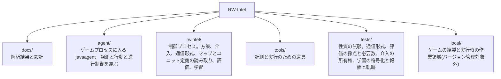

# RW-Intel

Rusted Warfare を機械学習でプレイするシステム。生産、アップグレード、攻撃目標の選定といった大局的な判断を担うモデルと、個々のユニットの戦闘機動を担うモデルを分け、両者を実時間で協調させることを目指す。

## 現状

ゲームへの接続方式を決定し、ゲーム内部の解析と性能実測を終え、モデルの設計を決め、**観測と行動の経路、五層のスクリプト方策、指揮系統の外から命令する介入の経路とスクリプト乱入者、方策どうしを比べる評価の仕組み、そして学習環境までを実装した段階**である。制御プロセスからゲームを動かして試合を回し、二つの方策を同一条件で交互に走らせ、その差を主張するのに何エピソード要るかまで報告する。二つのゲームプロセスを一つのロックステップ試合に入れることもでき、その試合の中でユニットを生成しても同期が壊れないことを確認した。戦術層を鍛える交戦アリーナは、交戦を組んでは戦わせ、掃討してまた組む形で実際に走っている。**方策を学習させた実行はいくつもあるが、手書きの層を上回った方策はまだ無い。** 手書き層の決定を教師として写した方策と、そこから強化学習を進めた三つの設定と、その一つを二度延長したものと、乱数から始めたものを、いずれも手書き戦術層と交戦させて採点した。**上回って見えたものが二つあり、どちらも選択に使っていない乱数種で測り直すと消えた。** 二度目は、種を変えて交戦 1107 件で +0.026、同じ種の基準線が交戦 1141 件で +0.016、差は +0.010 で区間が ±0.047 である。同時に分かったのは、**それまでのアリーナが方策とは別のものを測っていた**ことである。相手側が内蔵 AI として自分の試合をしていたこと、両軍が射程の外で向かい合って止まっていたこと、一つの用務に終端が繰り返し発火していたこと、組んだ交戦の 3 割が現れないまま捨てられていたこと、長いエピソードが盤面の片側を有利にしていたことの五つで、五つとも直して測り直してある。**いま試合を打つ方策はすべて手書きである。**

決定した方式は、ゲーム本体のプロセスに `-javaagent` で入り込み、エンジンの内部状態を直接読んでコマンドを直接発行するというものである。ネットワークプロトコルを解析して独自クライアントを作る案は、マルチプレイが決定論的ロックステップであり状態が一切通信されないため、シミュレーションの完全な再実装を伴うことになり退けた。判断の詳細は [docs/project/01-approach.md](docs/project/01-approach.md) にある。

プロセス内から次を行えることを実行時に確認済みである。

- ユニットの識別子、座標、体力、所属、種別、およびプレイヤーの資金と戦績の読み取り
- 登録済みの全ユニット種別の一覧と、その価格・技術レベル・移動タイプの読み取り
- ユニットへの命令の発行。移動を命じて実際に移動することを確認した
- システム命令によるユニットの生成。戦術層の学習環境がこれに依存する
- スキルミッシュの自動開始、勝敗の検出、次のエピソードへのリセット
- 内蔵 AI 同士を戦わせ、多数のエピソードの結果を集めること
- 実時間の 10 倍速での進行。8 並列で合計 80 倍。アリーナの学習実行では 12 並列で 1 インスタンス 9.3 倍、合計 112 倍、毎実時間秒 309 決定まで測ってある
- 五層(戦略・作戦・戦術・内政・編成)を契約で結んだスクリプト方策の実行
- 方策を交互に走らせた比較と、必要エピソード数の算出
- 指揮系統の外から部隊を取り上げ、契約を書き換え、編成を組み替えること。人間の行入力とスクリプト乱入者が同じ経路を通り、記録先を指定すれば介入はそのとき見ていた盤面と対にして残る
- 二つのゲームプロセスを一つのロックステップ試合に入れること。その中でシステム命令により 18 体を生成しても、両者のチェックサムは一致し desync も出なかった
- 交戦アリーナ。こちらが生成した以外に動くもののない盤面に両軍を生成し、戦わせ、掃討して次の交戦を組む
- アリーナのエピソードで部屋の内蔵 AI を停止し、相手側のユニットを制御プロセスだけが動かす状態にすること。停止する前は、相手側が自分の経済と自分の攻撃隊を持ってこちらの 2 倍勝っていた
- アリーナが左右どちらにも有利でないことを測ること。両側を手書き層にした 240 秒エピソードの交戦 338 件で成績の平均は +0.019、区間は 0 を含む。別の乱数種で取り直した交戦 901 件で -0.003、交戦 1141 件で +0.016 であり、いずれも区間が 0 を含む。同じ測定を 1200 秒エピソードで取ると、交戦 480 件の平均が +0.134、標準誤差の 4.2 倍に偏る
- 5 つの逸脱が動かせる幅を上下から挟むこと。逸脱を一つも使わない方策(エンジンの `attackMove` だけで戦う方策)は交戦 1056 件で -0.049、何も学習していない乱数のままの網は交戦 856 件で -0.125 である。手書き層は定義により 0 なので、**この行動空間が動かせる全幅は 8 分の 1 ほどしかない**
- 成績から戦力の抽選ぶんを引く補正を入れ、自己検査で否決して外すこと。両側手書き層が 0 でなければならないところで交戦 901 件の -0.070 を出し、組まれる部隊のシェアが 53.1 対 50.0 に偏っていたことが原因だった。補正なしの同じ 901 件は -0.003 である
- 打ち切りを外したアリーナ(交戦を最後まで戦わせる)を公平にできるかを測り、できないと分かること。基準線は交戦 1330 件で +0.153。生成の投入順を交互にしても動かず、投入順は主因ではなかった。偏りの一つは最初の交戦で自陣の司令部が部隊に紛れ込むことで、開始盤面が落ち着くまで待って直し基準線は +0.0945 に下がる(最初の交戦 +0.287 → +0.012)。残りは生存者の汚染で、勝った側の消せない生存者が溜まって後続の交戦を汚す(エピソード終了時の立ちユニットは自軍 17.9 対 敵 10.4)。エンジンに削除命令が無いことに根ざす構造問題なので、方策の天井は打ち切りありの公平なレジームで測る
- 手書き戦術層の決定を教師として集めること。12 並列でゲーム内 1200 秒、実時間 124 秒で 41,194 決定。選ばれた行動は hold 62.7 パーセント、withdraw 33.4 パーセントで、この層が実際に答えている問いは引くかどうかである
- その教師に 8,326 パラメータの網を当てはめること。検証に取り分けた 1 割で 99.9 パーセント再現し、行動分布は教師と 0.1 パーセント以内で一致する
- 学習した方策と手書き層を交戦させ、交戦ごとの成績と、その平均を主張するのに何交戦要るかを報告すること

## 文書

内容は二つに分かれている。詳細な目次は [docs/README.md](docs/README.md) にある。

| 区分 | 内容 |
| --- | --- |
| [docs/game/](docs/game/) | Rusted Warfare の仕様と内部構造。逆アセンブルと実測の結果であり、このプロジェクトの都合とは無関係に成り立つ |
| [docs/project/](docs/project/) | RW-Intel の方針、実行基盤、モデル設計 |

はじめに読むなら [docs/project/01-approach.md](docs/project/01-approach.md)、モデルの設計に関わるなら [docs/project/04-model-design.md](docs/project/04-model-design.md)、実装に手を付けるなら [docs/project/05-interface.md](docs/project/05-interface.md) から入る。

## 構成



`local/` はバージョン管理から除外している。ゲーム本体の複製を含むためである。

## 準備

Rusted Warfare 1.15 build #28 が必要である。ゲームには OpenJDK 13 の完全な JDK が同梱されているため、JDK を別途導入する必要はない。

インストール先を `local/rw` に複製する。32bit 版 JVM とログ類は不要である。

```powershell
robocopy "<ゲームのインストール先>" local\rw /E /XD jvm cache /XF "hs_err_pid*.log" lastrun.log crashes.txt preferences.ini
```

計測エージェントをビルドし、実行用のディレクトリを作り、動作を確認する。

```powershell
.\tools\probe-agent\build.ps1
.\tools\New-RwInstance.ps1 -Count 8
.\tools\Start-RwProbe.ps1 -Count 1 -Speed 10 -Seconds 60
```

速度が 10 倍前後で報告されれば、ゲームをプロセス内から制御できている。実際のスキルミッシュを自動で回すには `-Map Lake` を加える。

マップとユニット定義を読むだけの道具はゲームを起動せずに動く。Python 3 以外の依存はない。

```powershell
python .\tools\Show-MapRegions.py
python .\tools\Show-UnitCatalog.py
```

## 動かす

制御プロセスを先に起動し、そこへゲームを接続する。エージェントは接続できるまで待つ。

```powershell
.\agent\build.ps1
python -m rwintel.control --instances 2 --episodes 2 --map Lake --max-seconds 300
.\tools\Start-RwAgents.ps1 -Count 2 -Speed 10
```

エピソードごとに勝敗と、決着しなかった場合の軍事価値差が報告される。詳細は [docs/project/05-interface.md](docs/project/05-interface.md) と [docs/project/02-runtime.md](docs/project/02-runtime.md) にある。

二つの方策を比べるときは評価の側を使う。方策はインスタンスの中で交互に走り、差とそれを主張するのに必要なエピソード数が出る。

```powershell
python -m rwintel.eval --instances 4 --episodes 3 --arm script --arm arm --map Lake --max-seconds 300
.\tools\Start-RwAgents.ps1 -Count 4 -Speed 10
```

手順の根拠は [docs/project/07-evaluation.md](docs/project/07-evaluation.md) にある。

試合の最中に人間が指揮を引き取るには、介入コンソールを開く。打った操作は指揮系統が出すのと同一形式の契約になり、`--interventions` を付けるとそのときの盤面と対にして書き出される。`--intrude` はスクリプト乱入者を入れる指定で、設計の頻度で干渉する相手を入れたまま計測するためのものである。

```powershell
python -m rwintel.control --instances 1 --map Lake --max-seconds 900 --console --interventions local\interventions.jsonl
python -m rwintel.control --instances 4 --episodes 4 --map Lake --max-seconds 300 --intrude
```

二つのゲームプロセスを一つのロックステップ試合に入れるには `--paired` を使う。どちらがホストでどちらが参加するかは制御プロセスが決める。`--spawn-probe` は試合中に生成を投入する回数で、エピソードの終わりにチェックサムの照合回数と一致の有無が報告される。

```powershell
python -m rwintel.control --instances 2 --paired --opponents 0 --map Lake --max-seconds 180 --spawn-probe 6
.\tools\Start-RwPairedMatch.ps1 -Speed 10
```

学習の実行である。`python -m rwintel.learn` は最初の語で実行の種類を選び、`tactics` `operations` `collect` `clone` `duel` の五つがある。戦術層は試合を回さず交戦アリーナの中で学習させ、作戦層は通常のスキルミッシュで乱入者を入れて回す。`collect` は決定器を渡さずに走らせて、スクリプトの決定を教師データとして書き出す。

```powershell
python -m rwintel.learn tactics --instances 4 --save local\tactics.pt
python -m rwintel.learn operations --instances 4 --episodes 6 --map Lake --max-seconds 300 --intruder --save local\operations.pt
python -m rwintel.learn collect --layer tactics --instances 4 --record local\teacher.jsonl
.\tools\Start-RwAgents.ps1 -Count 4 -Speed 10
```

**アリーナの実行に `--max-seconds` を渡す必要はない。** 省略時の既定はアリーナの 240 秒(`operations` だけ 300 秒)であり、**これを伸ばすのは throughput のつまみではなく測定を壊す操作である**。交戦は片付けられないので、生き残りが溜まった盤面の上で組まれた交戦は左右が公平でなくなる。交戦を増やしたいなら `--episodes` を増やす。

`clone` は書き出した教師データに網を当てはめて、乱数ではなくスクリプトの真似から強化学習を始められるようにする。**これだけはゲームに触れない**ので、制御プロセスもゲームも起動しない。写した重みから学習を始めるときは `--warmup` を付けて、乱数のままの価値ヘッドを先に合わせ、模倣の狭さを溶かさないよう `--entropy` を小さいまま使う(既定がその値である)。

```powershell
python -m rwintel.learn clone --layer tactics --teacher local\teacher.jsonl --save local\tactics-bc.pt
python -m rwintel.learn tactics --instances 8 --load local\tactics-bc.pt --warmup 5 --save local\tactics.pt
```

`duel` は学習せずに測る実行で、こちら側に読み込んだ網、相手側にスクリプト戦術層を置いて交戦の成績を取る。`--load` を省くと両側がスクリプトになり、それが基準線である。**成績は反対称なので基準線の平均は 0 でなければならず、0 から離れていればアリーナが盤面の片側に有利ということになる。** 比較のたびに走らせる。

```powershell
python -m rwintel.learn duel --load local\tactics.pt --instances 8 --episodes 4
python -m rwintel.learn duel --instances 8 --episodes 4
.\tools\Start-RwAgents.ps1 -Count 8 -Speed 10
```

主な引数である。数値を省略した場合は [docs/project/08-learning.md](docs/project/08-learning.md) の定数表の値がそのまま使われ、模倣の実行についてはそれが最初の行に出る。

| 引数 | 実行 | 意味 |
| --- | --- | --- |
| `--instances` / `--episodes` | `clone` 以外 | 接続するゲームの数と、1 インスタンスあたりのエピソード数 |
| `--load` | `tactics` `operations` `clone` `duel` | 開始時に読むパラメータ。**`duel` だけは読み先が無ければ異常終了する**。学習の実行は新しい方策から始める |
| `--save` | `tactics` `operations` `clone` | 終了時に書くパラメータ |
| `--layer` | `collect` `clone` | どちらの層を記録するか、写すか |
| `--teacher` / `--smoothing` / `--epochs` / `--patience` / `--keep-tainted` | `clone` | 教師データと、その当てはめ方 |
| `--script` / `--script-opponent` | `tactics` | アリーナの両側をスクリプトにする / 相手だけをスクリプトに固定する |
| `--greedy` | `duel` | 確率最大の行動に固定する。既定は運用時と同じ抽選 |
| `--intruder` | `operations` | スクリプト乱入者を注入する。設計が学習と評価の両方で要求している |
| `--record` / `--record-episodes` | `clone` 以外 | エピソード記録の書き出し先。`collect` だけは `--record` が決定列を指し、エピソード記録は `--record-episodes` に出る |
| `--device` | `collect` 以外 | torch のデバイス。既定は CPU で、この大きさの網ではカードより 3 倍から 7 倍速い |
| `--width` | `tactics` `clone` `duel` | 戦術網の 1 層あたりの隠れユニット数 |
| `--entropy` / `--learning-rate` | `tactics` `operations` | 方策をどれだけ一様さへ押すか、と最適化器の学習率 |
| `--outcome-weight` | `tactics` | アリーナで交戦の成績を終端としてどれだけの重みで払うか |
| `--batch` | `tactics` `operations` `clone` | 1 回の勾配の一歩に載せる行数 |

torch を要求するのは学習側だけであり、スクリプト方策だけを走らせる実行はその費用を払わない。環境の設計と定数、そして今夜取った測定は [docs/project/08-learning.md](docs/project/08-learning.md) にある。**手書きの戦術層を上回った方策はまだ無い。** 逸脱を一つも使わない方策が -0.049、乱数のままの網が -0.125 なので、5 つの逸脱の選び方で動く幅は全部で 8 分の 1 ほどしかなく、手書きの梯子は既にその上端にいる。**したがって主張する価値のある改善は数百分の数であり、それを見るには片側で数千交戦が要る。** 次に何を試すかもこの一点から決まる([docs/project/08-learning.md](docs/project/08-learning.md) の「次に試すこと」)。
