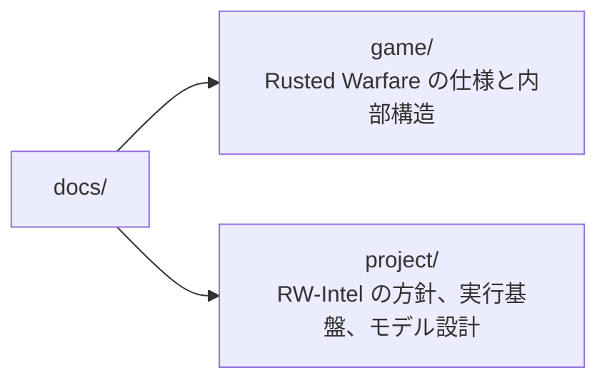

# 文書の構成

内容を二つに分けている。**`game/` は Rusted Warfare そのものの性質**であり、このプロジェクトの都合とは無関係に成り立つ。**`project/` は RW-Intel の判断と設計**であり、こちらは方針が変われば変わる。



実装と文書の対応は次のとおりである。

| 実装 | 文書 |
| --- | --- |
| `rwintel/runtime`(ビルド、インスタンス、起動と計測)、`rwintel/paths.py`(`local/` の構成) | [project/02-runtime.md](project/02-runtime.md) |
| `agent/`、`rwintel/wire` | [project/05-interface.md](project/05-interface.md) |
| `rwintel/data` | [game/06-content.md](game/06-content.md) (地形と陸のつながりを含む)、[project/05-interface.md](project/05-interface.md) の領域の切り出し |
| `rwintel/control/policy/` | [project/06-script-policy.md](project/06-script-policy.md) |
| `rwintel/control/intervention.py`(唯一の介入経路)、`rwintel/control/console.py`(人間が打つ行入力) | [project/04-model-design.md](project/04-model-design.md) の[人間の介入](project/04-model-design.md#人間の介入) |
| `rwintel/control/intruder.py`(設計の頻度で干渉するスクリプト乱入者) | [project/06-script-policy.md](project/06-script-policy.md) の[乱入への頑健性](project/06-script-policy.md#乱入への頑健性) |
| `rwintel/control/pairing.py`(2 プロセスを 1 つのロックステップ試合に入れる) | [game/07-multiplayer.md](game/07-multiplayer.md)、[project/05-interface.md](project/05-interface.md) の[二プロセスでの対戦](project/05-interface.md#二プロセスでの対戦) |
| `rwintel/eval` | [project/07-evaluation.md](project/07-evaluation.md) |
| `rwintel/learn` | [project/08-learning.md](project/08-learning.md) |
| `rwintel/replay`(リプレイの読み取り、観測しながらの再生、人間のプレイからの決定の推定) | [project/09-replays.md](project/09-replays.md)、[game/05-match-control.md](game/05-match-control.md) の[リプレイ](game/05-match-control.md#リプレイ) |
| `tools/probe-agent/` | [project/02-runtime.md](project/02-runtime.md) の[計測エージェント](project/02-runtime.md#計測エージェント) |
| `tools/lab-agent/`、`rwintel/runtime/lablog.py` | [project/02-runtime.md](project/02-runtime.md) の[実験用エージェント](project/02-runtime.md#実験用エージェント)、確かめた挙動は [game/04-actions.md](game/04-actions.md) と [game/06-content.md](game/06-content.md) |

性質の試験は `tests/` にあり、ゲームを起動せずに走る。

```bash
python -m pytest tests
```

## `game/`: ゲームの仕様と内部構造

Rusted Warfare 1.15 build #28 を逆アセンブルし、実行時に確かめた結果である。クラス名とフィールド名は難読化されているため、各項目には **実行時確認 / 逆アセンブル確認 / 推定** の別を付けてある。このうち [game/07-multiplayer.md](game/07-multiplayer.md) と [game/08-builtin-ai.md](game/08-builtin-ai.md) は大半が逆アセンブル確認である。

| 文書 | 内容 |
| --- | --- |
| [01-internals.md](game/01-internals.md) | 起動経路、ゲームループの構造、時間の進み方、クラス対応表 |
| [02-launch.md](game/02-launch.md) | 同梱 JVM、コマンドライン引数、ヘッドレスの可否、描画の費用、速度と忠実度の制御、固定ステップ |
| [03-observation.md](game/03-observation.md) | 読み取れる状態のフィールド対応表。ユニット、種別、プレイヤー、マップ、視界 |
| [04-actions.md](game/04-actions.md) | 命令の発行方法。種別、対象指定、生産とアップグレード、システム命令 |
| [05-match-control.md](game/05-match-control.md) | 試合の開始、設定、終了検出、リセット、決定性、リプレイのファイル形式と再生 |
| [06-content.md](game/06-content.md) | ユニット種別の一覧と価格、マップの資源配置と出撃地点 |
| [07-multiplayer.md](game/07-multiplayer.md) | 対戦セッションの開設と参加、ロックステップ、同期検査、パケット形式 |
| [08-builtin-ai.md](game/08-builtin-ai.md) | 内蔵 AI の構造。思考の周期、発行する命令、難易度、打ち回しを学習に使えるか、AI の命令を作戦層の教師のために読む経路 |

## `project/`: このプロジェクトの設計

| 文書 | 内容 |
| --- | --- |
| [01-approach.md](project/01-approach.md) | 接続方式の選定とその根拠 |
| [02-runtime.md](project/02-runtime.md) | 前提パッケージ、ゲームの配置、`local/` の構成、インスタンス、道具、エージェントのビルド |
| [03-throughput.md](project/03-throughput.md) | 速度と並列数、その測り方。学習のサンプル収集予算。学習器をグラフィックスカードに分けたときの律速と推論の費用 |
| [04-model-design.md](project/04-model-design.md) | 機械学習モデルの骨格。層の構成、制約、報酬、人間の介入。**具体の形式と値は 05 から 08 にある** |
| [05-interface.md](project/05-interface.md) | 観測と行動の外部化。通信、形式、周期、領域の切り出し |
| [06-script-policy.md](project/06-script-policy.md) | 契約の項目と値域、部隊管理、スクリプト方策、スクリプト乱入者 |
| [07-evaluation.md](project/07-evaluation.md) | 方策の比較手順と必要なエピソード数 |
| [08-learning.md](project/08-learning.md) | 符号化、行動空間、報酬、交戦アリーナ、推論の集約、軌跡の収集、最適化、模倣と教師の出どころ、オフライン学習と集合の網、行動器と学習器のループ、グラフィックスカードで回す手順。**学習した方策で手書き層を上回ったものはまだ無い** |
| [09-replays.md](project/09-replays.md) | リプレイの利用。ゲームを起動しない解析、観測しながらの再生、人間のプレイから作戦層の決定(移送の手段を含む)を推定して教師にすること。内蔵 AI の教師も同じ推定を使う |

05 から 09 に書いた形式と方策は、いずれも実装済みである。

## 読む順序

初めて読む場合は [project/01-approach.md](project/01-approach.md) から入るとよい。なぜゲームのプロセスに寄生する方式を選んだのかが分かり、そこから `game/` の各文書が何のためにあるかが見える。

動かす場合は [project/02-runtime.md](project/02-runtime.md) を先に読む。必要なパッケージ、ゲームの置き場所、道具の使い方がそこにある。

実装に手を付ける場合は [game/01-internals.md](game/01-internals.md) と [project/02-runtime.md](project/02-runtime.md) を先に読む。前者がゲームの構造、後者が実際に動かす手順である。そのうえで [project/05-interface.md](project/05-interface.md) が最初に書くものを決めている。

モデルの設計に関わる場合は [project/03-throughput.md](project/03-throughput.md) を先に読む。ここに書かれたサンプル収集の予算が、[project/04-model-design.md](project/04-model-design.md) の選択肢をほとんど決めている。骨格は 04 にあり、具体の形式と値は 05 から 08 にある。
