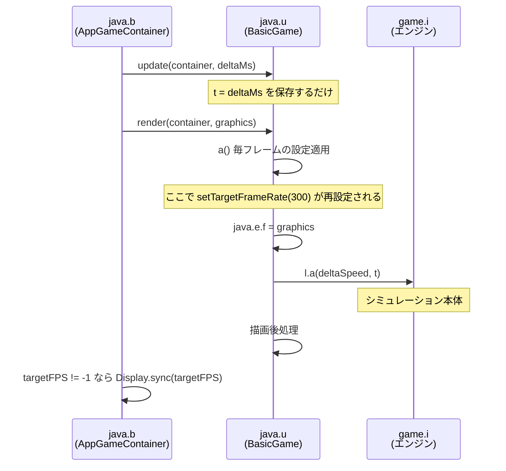

# ゲーム内部構造

Rusted Warfare 1.15 build #28 (Game Code 176) の内部構造のうち、プロセス内から観測と行動を行うために必要な部分を記録する。クラス名とフィールド名は難読化されており、以下は逆アセンブル(`javap -p -c`)で確認した結果である。

確認の度合いを次のように区別して記す。

- **実行時確認** — 実際にプロセス内から読み書きして期待どおりに動作した
- **逆アセンブル確認** — バイトコードから意味が確定した
- **推定** — 命名や文脈からの推測であり未確定

## 起動経路

ゲームの起動口は `com.corrodinggames.rts.java.Main` の一つだけである。マニフェストの `Main-Class` もこれを指す。公式のヘッドレス実行経路や専用サーバのクラスは存在しない。`SteamGameServer` というクラスは含まれるが Steamworks のラッパであり無関係である。

`Main` は次の順に組み立てる。

1. コマンドライン引数を解析する。詳細は [02-launch.md](02-launch.md)。
2. `com.corrodinggames.rts.java.u`(Slick の `BasicGame` を継承)を生成し、`Main.j` に保持する。
3. `com.corrodinggames.rts.java.b`(Slick の `AppGameContainer` を継承)を生成し、`Main.k` に保持する。
4. 別スレッドでコンテナを起動する。

`Main.m` は自身への静的参照である。可視性はパッケージプライベートだが、リフレクションで到達できる。ここが**プロセス内からゲーム全体へ入る唯一の入口**である。

| 経路 | 得られるもの |
| --- | --- |
| `Main.m` | `Main` インスタンス(静的) |
| `Main.m.k` | `java.b` = Slick コンテナ。フレームレート制御 |
| `Main.m.j` | `java.u` = Slick ゲーム。描画とループ本体 |
| `gameFramework.l.B()` | エンジンのシングルトン(静的メソッド) |

いずれも実行時確認済みである。

## ループ構造

**Slick の `update()` は何も更新しない。** `java.u.update(GameContainer, int)` の中身は 3 命令しかなく、経過ミリ秒をフィールド `t` に保存して戻るだけである。

```
0: aload_0
1: iload_2
2: putfield  #215   // Field t:I
5: return
```

シミュレーションは `render()` の中で回っている。したがって Slick の層における update と render の分離は名前だけであり、実体がない。描画だけを止めるという単純な最適化は、この層では成立しない。

`render()` は次を行う。描画コンテキストは引数ではなくフィールド経由で渡される点に注意する。Slick の `Graphics` を `java.e` のフィールドに差し込み、その `java.e` がエンジンの `l.bO` に入っている。エンジン側のシミュレーションメソッドがグラフィクス引数を取らないのはこのためであり、更新と描画が分離しているからではない。



## 時間の進み方

エンジンは固定ステップではなく **delta 駆動**である。`game.i.a(float)`(デバッグ文字列から `updateAllGame1` と判明)が 1 ステップの本体であり、次のように時間を進める。

```
by += (int)(delta * 16.666666f)   // ゲーム内時間(ミリ秒)
bx += 1                            // フレーム数
```

`delta` の単位は 1/60 秒である。値は実経過時間から算出され、途中で 2 つの係数が掛かる。

```
delta = 実経過時間 * bt * H
```

- `bt` はゲーム側の速度設定。ネットワーク対戦中は適用されない条件分岐がある。
- `H` は無条件に適用される倍率で、初期値は 1.0 である。

この構造から重要な帰結が出る。**delta が実経過時間に比例する以上、フレームレートを上げてもゲームは速くならない**。1 秒あたりに進むゲーム内時間は `H` 倍で決まり、フレームレートはそのゲーム内時間を何回に分割するか(1 ステップの粗さ)を決めるだけである。速度と忠実度は直交する 2 つのつまみになる。

## クラス対応表

### エンジンとループ

| クラス | 役割 | 確認 |
| --- | --- | --- |
| `com.corrodinggames.rts.java.Main` | 起動。静的 `m` が自己参照、`j` が Slick ゲーム、`k` がコンテナ | 実行時確認 |
| `com.corrodinggames.rts.java.u` | Slick の `BasicGame`。`update` は空、`render` が本体。`t` が経過ミリ秒、`i` が `-nodisplay` フラグ | 逆アセンブル確認 |
| `com.corrodinggames.rts.java.b` | Slick の `AppGameContainer`。`updateAndRender` の末尾で `Display.sync(targetFPS)` | 逆アセンブル確認 |
| `com.corrodinggames.rts.java.e` | グラフィクス実装。`l.bO` に入り、フィールド `f` に Slick の `Graphics` を持つ | 逆アセンブル確認 |
| `com.corrodinggames.rts.gameFramework.l` | エンジン基底クラス。静的 `B()` でシングルトンを取得 | 実行時確認 |
| `com.corrodinggames.rts.game.i` | `l` を継承した実体クラス | 実行時確認 |

### エンジンの主要フィールド

| フィールド | 型 | 意味 | 確認 |
| --- | --- | --- | --- |
| `l.bx` | `int` | フレーム数 | 実行時確認 |
| `l.by` | `int` | ゲーム内時間(ミリ秒) | 実行時確認 |
| `game.i.H` | `float` | 速度倍率。初期値 1.0 | 実行時確認 |
| `l.bt` | `float` | ゲーム側の速度設定 | 逆アセンブル確認 |
| `l.bO` | `m.y` | 描画先 | 逆アセンブル確認 |
| `l.bX` | `j.ad` | ネットワークとルームのエンジン | 逆アセンブル確認 |
| `l.bQ` | `SettingsEngine` | 設定。難読化されていない唯一のクラス名 | 逆アセンブル確認 |
| `l.cf` | `gameFramework.c` | コマンドオブジェクトのプール | 逆アセンブル確認 |
| `l.aB` | `boolean` | 起動フラグ `-noresources` に対応 | 逆アセンブル確認 |
| `game.i.k` | `ConcurrentLinkedQueue` | ゲームスレッドで実行する処理の投入口 | 実行時確認 |
| `l.dq` / `l.dt` | `boolean` | ローカルプレイヤー視点の勝利と敗北 | 実行時確認 |

`game.i.k` は外部から安全にゲームへ介入するための唯一の入口である。シミュレーション本体の直前に、毎フレーム、中身が空になるまで `Runnable` が取り出されて実行される。ゲームへの介入がここを通らなければならない理由は二つある。コマンドのプールが同期化されていないこと([04-actions.md](04-actions.md))と、マップの読み込みが OpenGL コンテキストを要求すること([05-match-control.md](05-match-control.md))である。

### 自分自身を再投入する処理はゲームを止める

**「空になるまで」は文字どおりである。** 実行された `Runnable` が自分自身をこのキューへ入れ直すと、同じフレームの排出でそれがまた取り出される。排出は終わらず、シミュレーションにも描画にも到達しない。

毎フレームのフックが欲しくてこれを試したところ、**ゲームが完全に停止した**。ログの出力もそこで途切れる。毎フレームの処理が必要な場合は、別スレッドから 1 個ずつ投入し、実行が終わってから次を投入する。

### 早すぎるクラス参照はゲームごと壊す

Java はクラスを最初に参照した時点で静的初期化子を走らせる。**プレイヤークラス `game.n` の静的初期化子はユニットを構築する**ため、ゲーム自身がそこへ到達する前に外部から `Class.forName("com.corrodinggames.rts.game.n")` を呼ぶと、その中で `NullPointerException` になる。

```
Caused by: java.lang.NullPointerException
	at com.corrodinggames.rts.game.units.am.<init>(SourceFile:965)
	...
	at com.corrodinggames.rts.game.n.<clinit>(SourceFile:750)
```

問題は失敗そのものではなく、**静的初期化子が失敗したクラスはプロセスが終わるまで壊れたままになる**ことである。以降そのクラスへ触れるものはすべて `NoClassDefFoundError` を受け取り、ゲーム本体のループがこれで落ちる。

```
java.lang.NoClassDefFoundError: Could not initialize class com.corrodinggames.rts.game.n
	at com.corrodinggames.rts.game.i.a(SourceFile:627)
	...
	at com.corrodinggames.rts.java.b.gameLoop(SourceFile:146)
```

**したがって外部からクラスを解決する前に、ゲームループが動き出すのを待つ必要がある。** 待つ間に触ってよいのは `gameFramework.l` だけである。フレーム数 `l.bx` はそのクラスだけで読めるので、これが一定数を超えるまで待てばよい。`agent/RwAgent.java` は 300 フレームを閾値にしている。

### シミュレーションの対象

| クラス | 役割 | 確認 |
| --- | --- | --- |
| `com.corrodinggames.rts.gameFramework.w` | ゲームオブジェクトの基底。静的 `dK()` が全オブジェクトのコレクションを返す | 実行時確認 |
| `com.corrodinggames.rts.game.units.am` | ユニットの基底 | 逆アセンブル確認 |
| `com.corrodinggames.rts.game.units.y` | 武装ユニット。`am` の派生 | 逆アセンブル確認 |
| `com.corrodinggames.rts.game.units.as` | ユニット種別 | 逆アセンブル確認 |
| `com.corrodinggames.rts.game.n` | プレイヤー | 逆アセンブル確認 |
| `com.corrodinggames.rts.gameFramework.e` | コマンド。`l.cf` から取得する | 逆アセンブル確認 |

フィールド単位の詳細は観測側を [03-observation.md](03-observation.md)、行動側を [04-actions.md](04-actions.md) に分けて記す。

`w.dK()` は実行時に呼び出してオブジェクト数を取得できることを確認済みである。メニュー背景の戦闘で 130 から 890 個まで推移した。

## 注意点

- ユニット系のパッケージは 642 クラスある。これが自作シミュレーションを非現実的にしている主因である。
- デスクトップ版も内部に Android 互換層を抱えており、`android.graphics.Paint` などが実クラスとして jar に含まれる。難読化されたクラスの一覧を眺めるときに紛れるので注意する。
- ここに記した対応は 1.15 build #28 に対するものである。ゲームが更新されれば難読化の割り当ては変わりうる。バージョンの検証は起動ログの `Build Number` と `Game Version` で行える。
