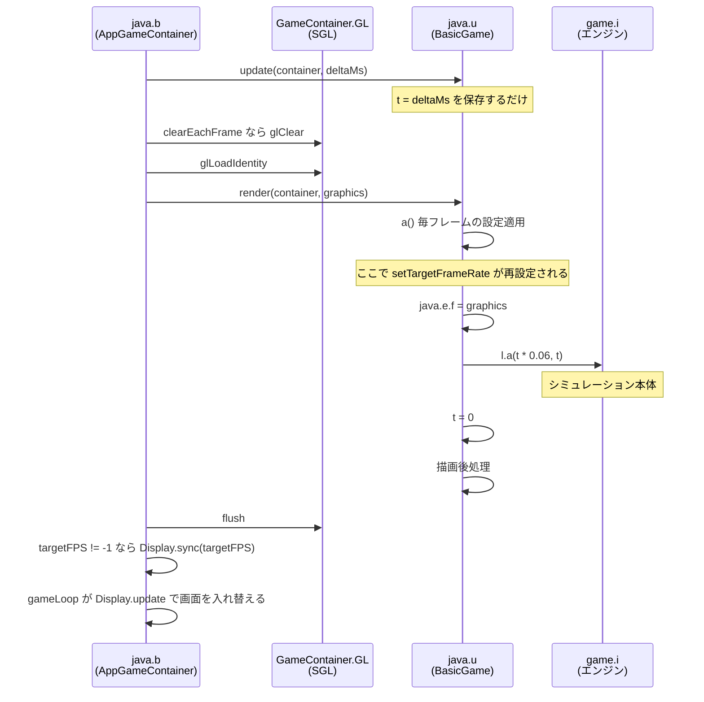

# ゲーム内部構造

Rusted Warfare 1.15 build #28 (Game Code 176) の内部構造のうち、プロセス内から観測と行動を行うために必要な部分を記録する。クラス名とフィールド名は難読化されており、以下は逆アセンブル(`javap -p -c`)で確認した結果である。

確認の度合いを次のように区別して記す。

- **実行時確認**: 実際にプロセス内から読み書きして期待どおりに動作した
- **逆アセンブル確認**: バイトコードから意味が確定した
- **推定**: 命名や文脈からの推測であり未確定

## 起動経路

ゲームの起動口は `com.corrodinggames.rts.java.Main` の一つだけである。マニフェストの `Main-Class` もこれを指す。公式のヘッドレス実行経路や専用サーバのクラスは存在しない。`SteamGameServer` というクラスは含まれるが Steamworks のラッパであり無関係である。

`Main` は次の順に組み立てる。

1. コマンドライン引数を解析する。詳細は [02-launch.md](02-launch.md)。
2. `com.corrodinggames.rts.java.u`(Slick の `BasicGame` を継承)を生成し、`Main.j` に保持する。
3. `com.corrodinggames.rts.java.b`(Slick の `AppGameContainer` を継承)を生成し、`Main.k` に保持する。
4. 別スレッドでコンテナを起動する。

`Main.m` は自身への静的参照である。可視性はパッケージプライベートだが、リフレクションで到達できる。ここが**プロセス内からゲーム全体へ入る唯一の入口**である。

| 経路 | 得られるもの |
| --- | --- |
| `Main.m` | `Main` インスタンス(静的) |
| `Main.m.e` | `String` = ビルド番号。実行時に `#28` を返した |
| `Main.m.k` | `java.b` = Slick コンテナ。フレームレート制御 |
| `Main.m.j` | `java.u` = Slick ゲーム。描画とループ本体 |
| `gameFramework.l.B()` | エンジンのシングルトン(静的メソッド) |

いずれも実行時確認済みである。

## ループ構造

**Slick の `update()` は何も更新しない。** `java.u.update(GameContainer, int)` の中身は 3 命令しかなく、経過ミリ秒をフィールド `t` に保存して戻るだけである。

```
0: aload_0
1: iload_2
2: putfield  #215   // Field t:I
5: return
```

シミュレーションは `render()` の中で回っている。したがって Slick の層における update と render の分離は名前だけであり、実体がない。render を呼ばずに描画だけを止めることはできず、描画を止めるなら一段下の描画層で行う([描画の経路](#描画の経路))。

`render()` は次を行う。描画コンテキストは引数ではなくフィールド経由で渡される点に注意する。Slick の `Graphics` を `java.e` のフィールドに差し込み、その `java.e` がエンジンの `l.bO` に入っている。エンジン側のシミュレーションメソッドがグラフィクス引数を取らないのはこのためであり、更新と描画が分離しているからではない。

コンテナ `java.b` の `updateAndRender` は、render の前後で静的フィールド `GameContainer.GL`(Slick の描画層 `SGL`)を毎フレーム呼ぶ。update と render の間に `glLoadIdentity`、`Display.sync` の直前に `flush` である(逆アセンブル確認)。この 2 点はフレームごとに必ず通り、時計を設定する位置と上限を差し替える位置としてちょうどよい([../project/02-runtime.md](../project/02-runtime.md) のフレーム層がここを使う)。



## 時間の進み方

エンジンは固定ステップではなく **delta 駆動**である。`game.i.a(float)`(デバッグ文字列から `updateAllGame1` と判明)が 1 ステップの本体であり、次のように時間を進める(逆アセンブル確認)。

```
delta = deltaSpeed * bt * H                     // 1/60 秒単位
by = (int)((float)by + delta * 16.666666f)      // ゲーム内時間(ミリ秒)
bx += 1                                         // フレーム数
```

- `deltaSpeed` は `java.u.render` が `l.a(t * 0.06f, t)` で渡す値である。`t` は Slick が update で渡した**整数ミリ秒**の経過時間で、`l.a` の直後に 0 へ戻される。
- `bt` はゲーム側の速度設定で、1 以外のときだけ掛かる。ネットワーク対戦中は適用されない条件分岐がある。
- `H` は無条件に適用される倍率で、初期値は 1.0 である。
- 時計 `by` は float で足してから切り捨てる。float の仮数は 24 ビットなので、2^23 ミリ秒(ゲーム内 2 時間余り)を超えると 1 ステップの増分が 1 ミリ秒単位でぶれる。

この構造から三つの帰結が出る。

- **delta が実経過時間に比例する以上、フレームレートを上げてもゲームは速くならない**。1 秒あたりに進むゲーム内時間は `H` 倍で決まり、フレームレートはそのゲーム内時間を何回に分割するか(1 ステップの粗さ)を決めるだけである。速度と忠実度は直交する 2 つのつまみになる。
- **1 ステップは `H` ミリ秒単位に量子化される**。`t` が整数ミリ秒だからで、300fps でも実際のステップは 1 フレーム 3 ミリ秒か 4 ミリ秒、倍率 10 なら 30 ミリ秒か 40 ミリ秒に割れる。上限を外して 1 ミリ秒を切る速さで回すと、`t` が 0 のフレームが大半になり、そのフレームはゲーム内時間を進めない。
- **`t` を毎フレーム固定すれば、実時間から切り離した固定ステップになる**。update と render の間で `t` と `H` を書けば、そのフレームのステップは `t * 0.06 * H * 16.666666` ミリ秒に決まり、フレームを何秒で回したかに依存しない(実行時確認)。

## 描画の経路

描画はすべて Slick の描画層 `org.newdawn.slick.opengl.renderer.SGL` を通る。実体は `Renderer.get()` が返す 1 つのインスタンスで、各クラスが初期化時に静的フィールドへ取り込んで使う(逆アセンブル確認)。

| 保持している静的フィールド | 用途 |
| --- | --- |
| `Renderer.renderer` | 共有の実体。後から初期化されるクラスはここから取り込む |
| `GameContainer.GL` | コンテナのフレーム処理(`glClear`、`glLoadIdentity`、`flush`) |
| `Graphics.GL`、`Image.GL`、`ShapeRenderer.GL`、`AngelCodeFont.GL` など | Slick の描画 |
| `java.e.W` | エンジンの描画実装 |
| `java.d.a.k` | メニュー UI(libRocket)の描画 |

`SGL` はインターフェースなので、頂点・色・行列・クリア・ディスプレイリストの再生を捨て、テクスチャの生成と bind と問い合わせだけを本物へ渡す実装に差し替えれば、ゲームのバイトコードを変えずに描画を止められる(実行時確認)。マップの読み込みはテクスチャを作るので、生成系の呼び出しは止めてはならない。

エンジンの描画先 `l.bO` の型はインターフェース `m.y` だが、ゲーム内で `java.e` へキャストされる箇所があり、`java.e` は `final` クラスなので差し替えられない(実行時確認、差し替えると `ClassCastException` で落ちる)。

画面の入れ替えは `gameLoop` の `Display.update` が行う。LWJGL はウィンドウが表示中か dirty のときだけ `swapBuffers` を呼び、Linux 版の「表示中」は `LinuxDisplay.minimized` が偽であることである(逆アセンブル確認)。このフィールドは X のイベント処理の中でしか書かれないので、立てておけば入れ替えは省かれる。ただし最小化中はコンテナが render を呼ばなくなるため、`setAlwaysRender(true)` と `setUpdateOnlyWhenVisible(false)` を併せて設定する(いずれも Slick の公開 API)。

## 経路探索

経路は `PathSolver-N` スレッドが別に解くが、**結果が効く時刻はゲーム内時間で決まる**(逆アセンブル確認)。要求ごとにカウントダウン `k.k.t` が 12 から 360 の定数で設定され、1 ステップの本体 `game.i.a(float)` が `k.l.b(delta)` を通して毎ステップ delta だけ減らす。0 以下になった時点でまだ解けていなければ、ゲームスレッドが解けるまで待つ。したがって解くのが遅れても、処理が止まるだけで、経路が効くフレームは変わらない。

## クラッシュレポート

ゲームは捕捉されなかった例外のスタックトレースを開発元のサーバへ送る。送るのは設定 `SettingsEngine.sendReports`(`preferences.ini` の `sendReports`)が真のときで、既定は真である(逆アセンブル確認、実行時に送信を確認)。プロセスあたり 1 回だけで、送った後は `l.dO` が立つ。外部から手を入れた状態のクラッシュもそのまま送られるので、このプロジェクトは常に偽にして起動する([../project/02-runtime.md](../project/02-runtime.md))。

## クラス対応表

### エンジンとループ

| クラス | 役割 | 確認 |
| --- | --- | --- |
| `com.corrodinggames.rts.java.Main` | 起動。静的 `m` が自己参照、`j` が Slick ゲーム、`k` がコンテナ、`e` がビルド番号 | 実行時確認 |
| `com.corrodinggames.rts.java.u` | Slick の `BasicGame`。`update` は空、`render` が本体。`t` が整数ミリ秒の経過時間で render の中で 0 に戻る、`i` が `-nodisplay` フラグ | 逆アセンブル確認 |
| `com.corrodinggames.rts.java.b` | Slick の `AppGameContainer`。`updateAndRender` が `GameContainer.GL` の `glLoadIdentity` と `flush` を毎フレーム呼び、末尾で `Display.sync(targetFPS)` | 逆アセンブル確認 |
| `com.corrodinggames.rts.java.e` | グラフィクス実装。`final` クラス。`l.bO` に入り、フィールド `f` に Slick の `Graphics` を持つ | 逆アセンブル確認 |
| `com.corrodinggames.rts.gameFramework.l` | エンジン基底クラス。静的 `B()` でシングルトンを取得 | 実行時確認 |
| `com.corrodinggames.rts.game.i` | `l` を継承した実体クラス | 実行時確認 |

### エンジンの主要フィールド

| フィールド | 型 | 意味 | 確認 |
| --- | --- | --- | --- |
| `l.bx` | `int` | フレーム数 | 実行時確認 |
| `l.by` | `int` | ゲーム内時間(ミリ秒) | 実行時確認 |
| `game.i.H` | `float` | 速度倍率。初期値 1.0 | 実行時確認 |
| `l.bt` | `float` | ゲーム側の速度設定 | 逆アセンブル確認 |
| `l.bO` | `m.y` | 描画先 | 逆アセンブル確認 |
| `l.bX` | `j.ad` | ネットワークとルームのエンジン | 逆アセンブル確認 |
| `l.bQ` | `SettingsEngine` | 設定。難読化されていない唯一のクラス名。`sendReports` がクラッシュレポートの送信 | 実行時確認 |
| `l.dO` | `boolean` | クラッシュレポートを送った後に立つ | 逆アセンブル確認 |
| `l.cf` | `gameFramework.c` | コマンドオブジェクトのプール | 逆アセンブル確認 |
| `l.aB` | `boolean` | 起動フラグ `-noresources` に対応 | 逆アセンブル確認 |
| `game.i.k` | `ConcurrentLinkedQueue` | ゲームスレッドで実行する処理の投入口 | 実行時確認 |
| `l.dq` / `l.dt` | `boolean` | ローカルプレイヤー視点の勝利と敗北 | 実行時確認 |

`game.i.k` は外部から安全にゲームへ介入するための唯一の入口である。シミュレーション本体の直前に、毎フレーム、中身が空になるまで `Runnable` が取り出されて実行される。ゲームへの介入がここを通らなければならない理由は二つある。コマンドのプールが同期化されていないこと([04-actions.md](04-actions.md))と、マップの読み込みが OpenGL コンテキストを要求すること([05-match-control.md](05-match-control.md))である。

### 自分自身を再投入する処理はゲームを止める

**「空になるまで」は文字どおりである。** 実行された `Runnable` が自分自身をこのキューへ入れ直すと、同じフレームの排出でそれがまた取り出される。排出は終わらず、シミュレーションにも描画にも到達しない。

**ゲームは完全に停止する**(実行時確認)。ログの出力もそこで途切れる。毎フレームの処理が必要な場合は、キューの外から 1 フレームに 1 個ずつ投入する。このプロジェクトは [ループ構造](#ループ構造) の `glLoadIdentity` の位置、すなわち排出より前のゲームスレッドから投入する。

### 早すぎるクラス参照はゲームごと壊す

Java はクラスを最初に参照した時点で静的初期化子を走らせる。**プレイヤークラス `game.n` の静的初期化子はユニットを構築する**ため、ゲーム自身がそこへ到達する前に外部から `Class.forName("com.corrodinggames.rts.game.n")` を呼ぶと、その中で `NullPointerException` になる。

```
Caused by: java.lang.NullPointerException
	at com.corrodinggames.rts.game.units.am.<init>(SourceFile:965)
	...
	at com.corrodinggames.rts.game.n.<clinit>(SourceFile:750)
```

問題は失敗そのものではなく、**静的初期化子が失敗したクラスはプロセスが終わるまで壊れたままになる**ことである。以降そのクラスへ触れるものはすべて `NoClassDefFoundError` を受け取り、ゲーム本体のループがこれで落ちる。

```
java.lang.NoClassDefFoundError: Could not initialize class com.corrodinggames.rts.game.n
	at com.corrodinggames.rts.game.i.a(SourceFile:627)
	...
	at com.corrodinggames.rts.java.b.gameLoop(SourceFile:146)
```

**したがって外部からクラスを解決する前に、ゲームループが動き出すのを待つ必要がある。** 待つ間に触ってよいのは `gameFramework.l` だけである。フレーム数 `l.bx` はそのクラスだけで読めるので、これが一定数を超えるまで待てばよい。`agent/RwAgent.java` は 300 フレームを閾値にしている。

### シミュレーションの対象

| クラス | 役割 | 確認 |
| --- | --- | --- |
| `com.corrodinggames.rts.gameFramework.w` | ゲームオブジェクトの基底。静的 `dK()` が全オブジェクトのコレクションを返す | 実行時確認 |
| `com.corrodinggames.rts.game.units.am` | ユニットの基底 | 逆アセンブル確認 |
| `com.corrodinggames.rts.game.units.y` | 武装ユニット。`am` の派生 | 逆アセンブル確認 |
| `com.corrodinggames.rts.game.units.as` | ユニット種別 | 逆アセンブル確認 |
| `com.corrodinggames.rts.game.n` | プレイヤー | 逆アセンブル確認 |
| `com.corrodinggames.rts.gameFramework.e` | コマンド。`l.cf` から取得する | 逆アセンブル確認 |

フィールド単位の詳細は観測側を [03-observation.md](03-observation.md)、行動側を [04-actions.md](04-actions.md) に分けて記す。

`w.dK()` は全オブジェクトのコレクション(静的フィールド `w.a`)を返す前に、保留中の追加と削除をそこへ反映する(逆アセンブル確認)。つまり書き込みであり、ゲームスレッドの外から呼ぶとゲームスレッドの更新と競合してコレクションが壊れ、`Trying to insert null into array` や `NullPointerException` でゲームが落ちる。ゲームスレッドの外から数だけを知りたい計測エージェントは、`w.a` を直接読んでその `size()` を `objects=` として報告する。この数には、ゲームスレッドがまだ反映していない追加と削除は入らない。

## 注意点

- ユニット系のパッケージは 642 クラスある。これが自作シミュレーションを非現実的にしている主因である。
- デスクトップ版も内部に Android 互換層を抱えており、`android.graphics.Paint` などが実クラスとして jar に含まれる。難読化されたクラスの一覧を眺めるときに紛れるので注意する。
- ここに記した対応は 1.15 build #28 に対するものである。ゲームが更新されれば難読化の割り当ては変わりうる。バージョンの検証は起動ログの `Build Number` と `Game Version`、または実行中のプロセスから `Main.m.e` を読むことで行える。
