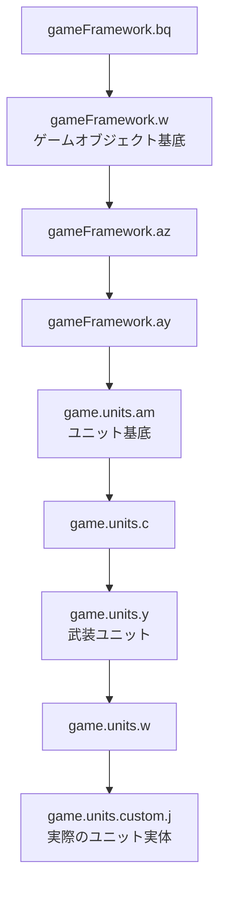

# 観測データモデル

プロセス内から読み取れるゲーム状態を記録する。クラス名とフィールド名は難読化されているため、確認の度合いを明示する。

- **実行時確認** — 実際に値を読み出し、妥当であることを確認した
- **逆アセンブル確認** — バイトコードから意味が確定した
- **推定** — 用法からの推論であり未確定

## 難読化されていない辞書がゲーム内に存在する

解析の決め手になった発見である。`com.corrodinggames.rts.game.units.custom.logicBooleans.LogicBooleanGameFunctions$*` の 215 クラスは **メンバ名が難読化されていない**。これらは mod 作者向けの条件式機能を提供するもので、`getName()` が `"maxHp"` `"Hp"` `"Shield"` `"Ammo"` といった意味のある名前を文字列として返し、`getValue()` が対応する難読化フィールドを直接読む。つまり **「意味のある名前 → 難読化フィールド」の対応表がゲーム自身に埋め込まれている**。

同様に難読化されていない情報源が他にもある。

- `com.corrodinggames.librocket.scripts.Root` — メニュー用スクリプト API。メソッド名が平文で、エンジンの状態フラグの意味を特定できる
- `com.corrodinggames.rts.game.units.custom.ag` — ユニット定義ファイルのパーサ。`.ini` のキー文字列と代入先フィールドが対になっている
- `com.corrodinggames.rts.gameFramework.SettingsEngine` — フィールド名が全て平文
- 各 enum の静的初期化子 — 定数名が文字列として残っている

以降の対応表は、主にこれらを根拠としている。

## クラス階層



定義ファイルから生成されるユニットは `custom.j` として存在する。ただし**組み込みの種別がすべて定義ファイル由来というわけではない**。`commandCenter` や `landFactory` のように、コードの中の enum 実装としてしか存在しない種別がある。内訳は [06-content.md](06-content.md) にある。

**注意**: `game.units.as`(ユニット種別のインタフェース)と `game.units.custom.as`(数値ステータスの構造体)は別のクラスである。名前が同じで紛らわしい。

## ユニットの状態

### 位置と識別

| 項目 | フィールド | 型 | 確認 |
| --- | --- | --- | --- |
| ユニット ID(全オブジェクトで一意) | `w.eh` | `long` | 実行時確認 |
| X 座標 | `w.eo` | `float` | 実行時確認 |
| Y 座標 | `w.ep` | `float` | 実行時確認 |
| 高度 | `w.eq` | `float` | 逆アセンブル確認 |
| 向き(度) | `am.cg` | `float` | 逆アセンブル確認 |
| 速度ベクトル | `am.cc` / `am.cd` | `float` | 逆アセンブル確認 |
| スカラー速度(非車両) | `am.cf` | `float` | 逆アセンブル確認 |
| 移動中か | `am.cK` | `boolean` | 逆アセンブル確認 |
| 後退中か | `am.ci` | `boolean` | 逆アセンブル確認 |
| 死亡フラグ | `am.bV` | `boolean` | 逆アセンブル確認 |
| 所有プレイヤー | `am.bX` | `game.n` | 実行時確認 |
| ユニット種別 | `am.dz` | `game.units.as` | 実行時確認 |

### 体力とリソース

| 項目 | フィールド | 型 | 確認 |
| --- | --- | --- | --- |
| 現在体力 | `am.cu` | `float` | 実行時確認 |
| 最大体力 | `am.cv` | `float` | 実行時確認 |
| シールド現在値 | `am.cx` | `float` | 逆アセンブル確認 |
| シールド最大値 | `am.cA` | `float` | 逆アセンブル確認 |
| エネルギー現在値 | `am.cB` | `float` | 逆アセンブル確認 |
| 弾薬 | `am.cE` | `int` | 逆アセンブル確認 |
| 被弾時刻(ミリ秒) | `am.bs` | `int` | 逆アセンブル確認 |

### 建造と戦績

| 項目 | フィールド/メソッド | 型 | 確認 |
| --- | --- | --- | --- |
| 建造進捗(0 から 1) | `am.cm` | `float` | 逆アセンブル確認 |
| 完成しているか | `am.cm >= 1.0f` | — | 逆アセンブル確認 |
| 撃破数 | `am.cU` | `int` | 逆アセンブル確認 |
| 生成時刻(ミリ秒) | `am.bz` | `int` | 逆アセンブル確認 |
| 価格(クレジット) | `am.cL()` | `int` | 逆アセンブル確認 |

### 目標と命令キュー

| 項目 | メンバ | 型 | 確認 |
| --- | --- | --- | --- |
| 現在の攻撃目標 | `y.ab()` | `am` | 逆アセンブル確認 |
| 攻撃中か | `y.aa()` | `boolean` | 逆アセンブル確認 |
| 命令キュー長 | `y.av()` | `int` | 実行時確認 |
| i 番目の命令 | `y.k(int)` | `au` | 逆アセンブル確認 |
| 現在の命令 | `y.ar()` | `au` | 逆アセンブル確認 |
| 現在の命令の種別 | `y.ar().a` | `game.units.av` | 実行時確認 |
| 命令なしか | `y.aq()` | `boolean` | 逆アセンブル確認 |
| 交戦スタンス | `y.P` | `game.units.a` | 逆アセンブル確認 |

命令キューの実体は容量 30 の配列 `y.g` である。命令オブジェクト `game.units.au` の構造は [04-actions.md](04-actions.md) に記す。

**そのユニットが今どの種類の命令を実行しているかは `au.a` から取れる。** 種別は enum `game.units.av` の定数であり、定数は 17 個ある。観測が運ぶのはこの定数の列挙上の位置である。

交戦スタンス `game.units.a` の定数は順に `outOfRange`、`onlyInRange`、`returnFire`、`holdFire`、`guardArea`、`aggressive`、`mixed` である。

### 輸送と生産

| 項目 | メンバ | 確認 |
| --- | --- | --- |
| 搭乗中の輸送機 | `am.cN` | 逆アセンブル確認 |
| 積載ユニット一覧 | `y.bz()` | 逆アセンブル確認 |
| 積載数 | `y.bB()` | 逆アセンブル確認 |
| 生産キューの中身 | `game.units.d.l.dx()` | 逆アセンブル確認 |
| 生産キュー数 | `game.units.d.l.f(boolean)` | 逆アセンブル確認 |
| 現在の生産ジョブ | `game.units.d.l.dw()` | 逆アセンブル確認 |

工場は `game.units.d.l` インタフェースを実装する。

### 存在しないもの

- **ステルスとクロークの実行時状態は存在しない。** 該当する文字列が jar 全体に一つもない。型定義側に「敵から見えるか」(`custom.as.m`)はあるが、実行時に切り替わる状態ではない。
- **ベテランシーと経験値は存在しない。** 最も近いのは撃破数 `am.cU` である。
- **タレット個別のリロード残時間は特定できなかった。** タレット状態は `custom.j.dT` に配列で入っているが、各フィールドの意味を確定できていない。

## ユニット種別

`game.units.as` はインタフェースで、定義ファイル由来の種別では実装が `custom.l`、それ以外では enum `game.units.ar` 自身である。

| 項目 | メソッド | 確認 |
| --- | --- | --- |
| 内部名 | `as.v()` | 実行時確認 |
| 表示名 | `as.e()` | 実行時確認 |
| クレジット価格 | `as.c()` | 実行時確認 |
| 建造速度 | `as.D()` | 実行時確認 |
| 技術レベル | `as.g()` | 実行時確認 |
| 建物か | `as.j()` | 実行時確認 |
| 建設を行えるユニットか | `as.l()` | 実行時確認 |
| 移動タイプ | `as.o()` | 実行時確認 |

`as.l()` は「建設可能か」ではなく「建設を行えるか」である。実行時に真を返したのは `builder` と `builderShip` だけであった。

移動タイプ `game.units.ao` の定数は順に `NONE`、`LAND`、`BUILDING`、`AIR`、`WATER`、`HOVER`、`OVER_CLIFF`、`OVER_CLIFF_WATER` である。建物は `NONE` を返す。

**登録済みの全種別は静的な `ar.ae` から列挙できる。** 種別ごとの実測値と、名前が二通りある問題は [06-content.md](06-content.md) に記す。

数値ステータスは `custom.as` に集約されている。型のベース値は `custom.l.cL`、個体の実効値は `custom.j.y` にあり、個体が変更されるまで同じオブジェクトを共有する。主なものは最大体力 `c`、最大シールド `g`、装甲 `l`、質量 `b`、視界距離 `n`、移動速度 `j`、旋回速度 `k`、最大攻撃距離 `i` である。

武器はタレット定義 `custom.bn`(連射間隔 `m`、射程 `ab`、エネルギー消費 `u`)と投射体定義 `custom.bh`(直接ダメージ `b`、範囲ダメージ `c`、範囲半径 `i`、速度 `w`)に分かれる。

組み込みのユニット種別は enum `game.units.ar` に定数名が平文で残っている。`extractor`、`landFactory`、`commandCenter`、`builder`、`tank` などである。`crystalResource` もここに登録されているが、**この種別の実体が盤面に置かれることはない**。資源地点はゲームオブジェクトではなくタイルの属性である。マップ側での表現は [06-content.md](06-content.md) に記す。

## プレイヤー

| 項目 | メンバ | 型 | 確認 |
| --- | --- | --- | --- |
| クレジット | `n.o` | `double` | 実行時確認 |
| スロット番号 | `n.k` | `int` | 実行時確認 |
| チーム番号 | `n.r` | `int` | 実行時確認 |
| 名前 | `n.v` | `String` | 実行時確認 |
| AI か | `n.w` | `boolean` | 逆アセンブル確認 |
| AI 難易度 | `n.x` | `int` | 逆アセンブル確認 |
| 敗北 | `n.F` | `boolean` | 逆アセンブル確認 |
| 全滅 | `n.G` | `boolean` | 逆アセンブル確認 |
| 勝利 | `n.H` | `boolean` | 逆アセンブル確認 |
| 降参 | `n.E` | `boolean` | 逆アセンブル確認 |
| 視界マップ | `n.N` | `byte[][]` | 逆アセンブル確認 |
| 収入 | `n.v()` | `int` | 逆アセンブル確認 |
| 購入可能か | `n.a(double)` | `boolean` | 逆アセンブル確認 |
| 敵か / 味方か | `n.c(n)` / `n.d(n)` | `boolean` | 逆アセンブル確認 |

プレイヤーは静的配列 `n.b` から列挙できる。実行時に確認したところ長さ 12 で、通常スロット 10 に加えて中立と特殊枠がある。`n.k(int)` でスロット番号から取得できる。

累積戦績は `l.bY.a(player)` が返す `gameFramework.bo` にあり、撃破ユニット数 `c`、撃破建物数 `d`、喪失ユニット数 `f`、喪失建物数 `g` などが取れる。**報酬の設計にそのまま使える。**

毎フレーム更新される集計は `n.T`(`game.s`)にある。ユニット上限 `a`、建物を除くユニット数 `b`、完成ユニット数 `c`、建造中 `f`、収入合計 `g` などで、個別に走査せず O(1) で読める。

### クレジットの書き換えについて

`n.o` は書き換え可能だが、ゲームの開発者が隣のフィールド `n.l` に次の文字列を残している。

> Note to modifiers: Changing credits will not allow you to cheat in multiplayer games, but it will only break sync

**状態を直接書き換えるとロックステップの同期が壊れる。** シングルプレイでは直接操作しても問題ないが、自己対戦のように複数プロセスを対戦させる構成では、状態は読むだけにして、変更は必ず [04-actions.md](04-actions.md) のコマンド経路を通す必要がある。

## 世界とマップ

| 項目 | メンバ | 確認 |
| --- | --- | --- |
| フレーム数 | `l.bx` | 実行時確認 |
| ゲーム内時間(ミリ秒) | `l.by` | 実行時確認 |
| マップ | `l.bL` | 逆アセンブル確認 |
| ローカル操作プレイヤー | `l.bs` | 逆アセンブル確認 |
| ゲーム内 UI と選択管理 | `l.bS` | 逆アセンブル確認 |
| 選択中ユニット | `l.bS.bZ` | 逆アセンブル確認 |
| ゲーム進行中か | `l.bG && !l.bH` | 逆アセンブル確認 |
| メニュー背景の戦闘か | `l.bH` | 逆アセンブル確認 |
| サンドボックスか | `l.bv` | 逆アセンブル確認 |

マップ `game.b.b` からは、タイル数 `C` と `D`、ワールド寸法 `i()` と `j()`、ワールド座標からタイルへの変換 `c(float,float)` が取れる。

視界は各プレイヤーの `n.N` に `[タイルX][タイルY]` の二次元配列で入っている。値は 5 未満が現在可視、5 以上が探索済みだが現在は不可視、10 が未探索である。判定用の API として、あるプレイヤーからユニットが見えるかを返す `am.d(n)` と、タイルが探索済みかを返す `b.b.a(n,int,int)` がある。**霧を考慮した観測を作る際はこれらを使う。**

### 資源地点はタイルのフラグであり、実行中のプロセスからは取れない

**資源地点はゲームオブジェクトではなく、マップタイルの属性である。** マップ読み込みの `com.corrodinggames.rts.game.b.g` がタイル属性 `res_pool` を読み、タイルオブジェクト `game.b.g` の `boolean` フィールド `i` を立てる。**逆アセンブル確認**である。`res_pool` の文字列は jar 全体でこの 1 クラスにしか現れず、属性の読み出しに続くバイトコードは `putfield ... Field i:Z` である。

**実行時確認**でも裏が取れている。資源地点が 9 個ある組み込みマップ Lake (2p) で、全ゲームオブジェクトのコレクション `w.dK()` が保持していたのはちょうど 24 個、内訳は樹木 `game.units.al` が 20 個と司令部 2 個と建設機 2 個であり、`crystalResource` 種別のオブジェクトは一つもなかった。

したがって**資源地点の位置は実行中のプロセスからは取れず、マップファイルから読むしかない**。制御プロセスが TMX から読んだ位置をゲーム側へ渡し、ゲーム側はその位置と自軍・敵軍の採掘施設を突き合わせて占有を数える。マップ側の表現は [06-content.md](06-content.md)、受け渡しの経路は [../project/05-interface.md](../project/05-interface.md) に記す。

## ユニットの列挙

エンジン自身が使っている方法をそのまま採るのが最も安全である。`game.units.am.bE` が全ユニットのコレクションで、バッキング配列を直接取得できる。

```java
Object[] units = (Object[]) bE.getClass().getMethod("a").invoke(bE);
int count = (Integer) bE.getClass().getMethod("size").invoke(bE);
for (int i = 0; i < count; i++) { ... }
```

配列長ではなく `size()` で必ず制限する。エンジンの `n.e(boolean)`(プレイヤー統計の再計算)がこの形で走査している。

**プレイヤー別のインデックスは存在しない。** エンジン自身も全件走査して `bX` で絞り込んでいる。集計値だけで足りる場合は `n.T` を読めばよい。

投射体やエフェクトを含む全ゲームオブジェクトは `gameFramework.w.dK()` から取れる。ID からの逆引きは `w.a(long, boolean)` である。

## 検証済みの実測例

計測エージェントの `dump` 機能で実際に読み出した値である。上記の対応が実データと一致することを確認した。

```
object[0] = com.corrodinggames.rts.game.units.al
  [am] bX:n=d@48c70c5e   cu:float=100.0  cv:float=100.0  dz:as=ar$20@2542b0a8
  [w]  eh:long=1  eo:float=2130.0  ep:float=470.0
player[0] = com.corrodinggames.rts.game.d
  [n]  k:int=-1  o:double=4000.0  r:int=-2
```

再現するには次を実行する。

```powershell
.\tools\Start-RwProbe.ps1 -Count 1 -Speed 5 -Seconds 60
```

エージェントに `dump=<件数>` を渡すと、種類の異なるゲームオブジェクトと全プレイヤーの全フィールドを一度だけ出力する。
