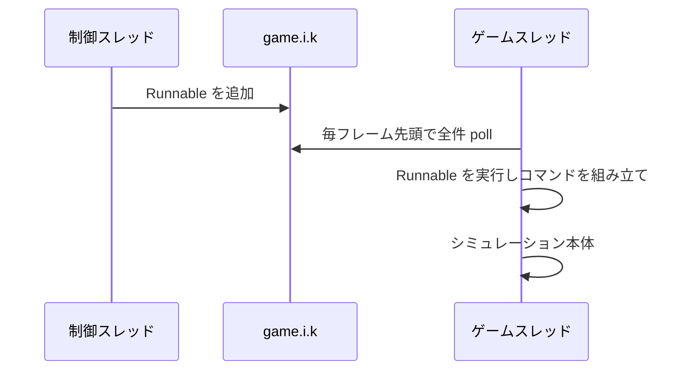

# 行動発行

プロセス内からプレイヤーとして命令を出す方法を記す。実際にユニットを動かして確認してある。

## 発行はゲームスレッドで行う

コマンドを保持するプール `l.cf` は素の `ArrayList` で、同期化されていない。別スレッドからコマンドを組み立てると、それを消費するゲームループと競合する。

ゲームスレッドで処理を実行する手段がエンジンに用意されている。`game.i.k` は `ConcurrentLinkedQueue` で、**シミュレーション本体の直前に、毎フレーム、中身が空になるまで `Runnable` を取り出して実行する**。

```java
Object engine = l.class.getMethod("B").invoke(null);
Field queue = engine.getClass().getField("k");
((ConcurrentLinkedQueue<Runnable>) queue.get(engine)).add(task);
```

外部の制御系からの命令はすべてこの経路に載せる。バイトコード改変は不要である。試合の開始と終了も同じ経路を使う必要がある([05-match-control.md](05-match-control.md))。

**投入した処理が自分自身を再投入するとゲームが止まる。** キューは空になるまで排出されるためである。詳細は [01-internals.md](01-internals.md) に記す。

投入した処理は `java.b.gameLoop` から `java.b.updateAndRender`、`java.u.render`、`game.i.a(float)`、`game.i.b` の順にたどった内側で走る(実行時確認)。描画経路の中でシミュレーションが回っているという [01-internals.md](01-internals.md) の構造と一致する。



## コマンドの取得は発行を兼ねる

`l.cf.b(player)` はコマンドオブジェクトを返すが、**返す時点で既に実行キューに入っている**。したがってフィールドを埋めるだけでよく、送信にあたる呼び出しは存在しない。ゲームの UI も内蔵 AI もこの経路を使う([08-builtin-ai.md](08-builtin-ai.md))。

```java
e command = engine.cf.b(player);   // この時点でキュー済み
command.h = true;                  // 末尾の重複ウェイポイントを除去する。UI と同じ挙動
command.a(unit);                   // 対象ユニット。複数回呼べる
command.a(x, y);                   // 移動先。ここで命令種別が決まる
```

引数なしの `cf.b()` は例外で、キューに入らない。この場合は `l.bX.a(command)` を自分で呼ぶ。システム命令はこちらを使う。

シングルプレイとネットワーク対戦で投入先は変わるが、`cf.b(player)` を使う限りエンジンが振り分けるため呼び出し側は意識しなくてよい。ネットワーク対戦では発行者を示す `command.p` を設定するのが正しい。またネットワーク対戦では実行が数フレーム先に予約されるため、命令は即座には反映されない([07-multiplayer.md](07-multiplayer.md))。

## 命令の種別

命令本体は `game.units.au` に入り、種別は enum `game.units.av` である。定数名は平文で残っている。

| 種別 | `e` のメソッド |
| --- | --- |
| move | `a(float x, float y)` |
| attack | `a(am target)` |
| build | `a(float x, float y, as type, int size)` |
| repair | `b(am target)` |
| loadInto | `e(am target)` |
| reclaim | `d(am target)` |
| attackMove | `b(float x, float y)` |
| loadUp | `f(am target)` |
| patrol | `c(float x, float y)` |
| guard | `c(am target)` |
| stop | `h()` |

`unloadAt` はどこからも参照されていない未使用の定数である。`guardAt`、`touchTarget`、`follow`、`triggerAction`、`triggerActionWhenInRange`、`setPassiveTarget` は enum に存在するが `e` に対応するメソッドがなく、`au` を直接組み立てる必要がある。

コマンドオブジェクトの主なフィールドは次のとおりである。

| フィールド | 意味 |
| --- | --- |
| `i` | 命令を出すプレイヤー。必須 |
| `j` | 命令本体 |
| `v` | 対象ユニットのリスト |
| `e` | 既存のウェイポイントを消さずに追加する。UI の Shift 押下にあたる |
| `h` | 直前と同等のウェイポイントを重複排除する |
| `o` | 停止 |
| `k` | 特殊アクションの識別子。生産とアップグレードで使う |
| `n` | 交戦スタンス |
| `p` | ネットワーク対戦での発行者 |
| `r` / `u` | システム命令のフラグと種別 |

## 対象ユニットの指定

対象は**コマンド側のリストで指定する**。ゲーム内の選択状態とは独立している。

```java
command.a(unit);              // 1体ずつ追加
command.a(unitList);          // まとめて追加
```

ゲーム内の選択状態はユニット側のフラグ `am.cG` であり、UI はそれを走査してコマンドに詰めている。**制御プログラムは選択に触らず、対象を直接指定するのが安全である。**

## 生産とアップグレード

生産は命令ではなく**特殊アクション**として発行する。識別子は文字列をインターンしたハンドルで、命名規則がある。

| 用途 | 識別子 |
| --- | --- |
| 建設ユニットによる建物建設 | `"b_" + 種別の内部名` |
| 工場でのユニット生産とアップグレード | `"u_" + 種別の内部名` |

```java
e command = engine.cf.b(player);
command.a(factoryUnit);
command.a(a.c.a("u_" + type.v()));   // 生産
// command.g = true を足すとキャンセルになる
```

ユニット種別は `game.units.ar.a(String)` で内部名から引ける。**ただし引くときの名前と `as.v()` が返す名前は一致しないことがあり、識別子は `as.v()` の側で組み立てる必要がある。** 詳細は [06-content.md](06-content.md) に記す。

ラリーポイントは `command.a(new PointF(x, y))` で設定する。交戦スタンスは `command.a(stance)` である。

### 段階の強化

建物の段階を上げる強化も特殊アクションだが、**識別子は種別の名前からではなく、建物のクラスごとに決まった番号の文字列である。** 陸上工場の強化は `"110"`、採掘施設の第 2 段階が `"102"`、第 3 段階が `"103"` である。

| 読むもの | 取得元 |
| --- | --- |
| ユニットの現在の段階 | `am.V()`。基底は 1 で、工場と採掘施設が上書きする |
| ユニットがいま出しているアクションの一覧 | `am.N()`(`game.units.a.s` の `ArrayList`)。段階ごとに中身が変わる |
| アクションの識別子のハンドル | `a.s.N()`(`a.c`) |
| アクションの価格 | `a.s.c()` |
| アクションの種類 | `a.s.f()`。`game.units.a.t` の列挙で、強化は `a.t.c`(`upgrade`) |

**建物は一度に高々 1 つの強化を出す。** 次の段階へのものである。したがって一覧から種類が `a.t.c` のものを探せば、番号を知らなくても次の強化を発行できる。発行はハンドルをそのまま `command.a(handle)` に渡す。

```java
e command = engine.cf.b(player);
command.a(building);
command.a(upgrade.N());   // upgrade は building.N() の中で f() が a.t.c のもの
```

**陸上工場を第 2 段階に上げると、生産の一覧が広がる。** 第 1 段階は建設機・戦車・ホバー戦車・砲だけで、第 2 段階で重戦車・重ホバー戦車・レーザー戦車などが加わる。**強化した採掘施設は収入が増え、種別表の上では段階の高い別の種別として報告される。** 種別の段階を工場の段階と取り違えると、工場が作れない種別を注文することになる。

## システム命令

`command.r = true` を立て `command.u` に種別を入れる。これらは引数なしの `cf.b()` で取得し、`l.bX.a(command)` で明示的に投入する。ホスト権限が前提である。

| `u` | 動作 |
| --- | --- |
| 5 | ユニットの即時生成。`build` 命令と種別を併せて指定する |
| 100 | 指定プレイヤーの降参 |
| 200 | 再同期 |

**ユニットを取り除くシステム命令は無い。** 盤面から消す手段は、撃破させること以外に存在しない。

### `u=5` によるユニット生成

命令本体 `command.j` が build 種別で、種別が非 null であることが条件である。満たさない場合はゲームのログに `system command spawn - failed` が出る。成功すると、指定した位置の近くに指定したプレイヤーのユニットが現れ、ゲームのログに `system command spawn` が残る(実行時確認)。

生成されたユニットが名乗る名前は、引くときに使った名前とは限らない。`mammothTank` で引いた種別は `c_mammothTank` を名乗る([06-content.md](06-content.md))。

正規のコマンド経路を通るので、**2 プロセスを 1 つのロックステップの試合に入れた状態でも同期は保たれる**(実行時確認、[07-multiplayer.md](07-multiplayer.md))。

```bash
python -m rwintel.runtime probe --count 1 --speed 10 --seconds 90 --map Lake --agent-options spawn=mammothTank
```

計測エージェントは生成の前後でユニット数と、目標地点に最も近い該当種別のユニットまでの距離を `spawn:` の行で報告する。

## テキストコマンドは使えない

ゲーム内には `-addai` `-credits` `-map` `-startingunits` といった文字列が多数含まれているが、**これらの受信側実装はゲーム本体に存在しない**。外部の専用サーバ向けの送信専用プロトコルであり、素のホストに送っても何も起きない。

実際に動作するのは 9 個だけである。`-pause` `-unpause` `-endgame` `-teamlock` `-roomlock` `-share` `-self_move` `-self_team` `-surrender`。しかもホスト側でしか解釈されず、ネットワークセッションでない単独プレイでは一切解釈されない。

いずれも対応する API を直接呼んだ方が速く確実である。制御チャネルとしては当てにしない。

## 移動命令の追従

内蔵 AI が所有するユニットに移動命令を出すと、ユニットは目標へ向けて実際に移動する(実行時確認)。その後ユニットが引き返すことがあるが、これは所有者である内蔵 AI が自分の命令で上書きするためであり、命令経路の問題ではない。

```bash
python -m rwintel.runtime probe --count 1 --speed 2 --seconds 60 --agent-options act=move
```

計測エージェントは命じた位置と、その後のユニットの位置と目標までの距離とウェイポイント数を `act:` の行で報告する。実装は `tools/probe-agent/RwProbeAgent.java` の `issueMoveTest` にある。

## 積み込みと降ろし

輸送の種別は [06-content.md](06-content.md) の輸送にある。

| 操作 | 発行 | 振る舞い |
| --- | --- | --- |
| 乗客が乗る | 乗客を対象に入れ `loadInto` (`e(am 輸送)`) | 乗客が輸送へ歩いて乗る。積めない乗客 (航空機、艦船、枠の足りないもの、輸送) には命令そのものが立たない。容量が尽きると、着いた乗客の命令は消える |
| 輸送が拾う | 輸送を対象に入れ `loadUp` (`f(am 乗客)`) | 輸送が乗客のところへ行って積む。1 回に 1 体で、同じ周期に 2 つ出すと後の方だけが残る。`e` を立てて待ち行列に積めば順に全部拾う |
| 降ろす | 輸送を対象に入れ、輸送の行動一覧の「Unload」(識別子 `"109"`) を `command.a(handle)` で出す | 「止まったら全員降ろす」印を立てる。止まっている輸送はすぐに、移動中の輸送は到着して止まった時点で降ろす。1 体あたり 0.5 秒ほどで降り、降りたユニットは輸送から少し離れて止まる |
| 降ろしをやめる | 「Cancel」(識別子 `"110"`) | 印を外す |

**降ろすのは陸の上だけである。** 水上で止まった輸送は降ろさず、印を持ち越して、次に陸の上で止まったときに降ろす。ホバークラフト、ドロップシップ、Flying Fortress、`bugPickup` は同じ識別子 109 と 110 の行動を持つ。

**輸送に届かない乗客の `loadInto` は、命令を持ったまま止まり続ける。** 水上の輸送へ乗れと命じた陸の戦車は動かず、輸送が後で陸へ来ても乗らない。積み込みは輸送の側の `loadUp` で行うのが確実である。

**乗っている乗客へ出した命令は、降ろした時点で失われる。** 命令は受け付けて保持されるが、降りた乗客は輸送から離れる移動に置き換わり、建設の命令も消える。降ろした後に命令を出し直す。

**降ろしの印は移動を置き換えない。** 移動を出した次の周期に同じ輸送へ 109 を出すと、輸送は移動を続け、着いて止まったところで降ろす(実行時確認)。本体の移送はこの順で出している([../project/05-interface.md](../project/05-interface.md) の移送)。

### 行動を識別子で出す

ユニットの行動は、識別子の文字列から `a.c.a(String)` で作ったハンドルを、そのユニットの行動一覧 `am.N()` の各行動のハンドル `a.s.N()` と突き合わせて探し、見つかったハンドルを `command.a(handle)` で出す(`Engine.unitAction`)。一覧に無い識別子は出さない。降ろしの 109 はこの経路で出して効く(実行時確認)。

### 護衛

`guard` (`c(am 相手)`) を出したユニットは相手に付いて動き、相手を脅かす敵と戦う(実行時確認)。本体の護衛のタスクはこれを使う。

## 届かない命令

経路探索の格子で届かない地点への命令は、種類によって振る舞いが違う([06-content.md](06-content.md) の地形と通行)。

| 命令 | 振る舞い |
| --- | --- |
| `move` | 行ける所まで進んで止まり、命令は黙って消える |
| `attackMove` | 行ける所まで進んで止まり、命令を持ったまま止まり続ける |
| `build` | 行ける所まで進んで止まり、命令は黙って消える |
| `loadInto` | 輸送に届かなければ動かず、命令を持ったまま止まり続ける |

艦船は岸の手前の水上で止まるが、射程の内に入った陸の敵は撃つ。

## 注意点

- 難読化されたユニット種別は非公開の無名クラスであるため、そのメソッドはリフレクションで直接取得できない。公開インタフェース `game.units.as` 側からメソッドを解決する必要がある。
- 状態を直接書き換える方法(体力やクレジットへの代入)は、単独プレイでは動くがロックステップの同期を壊す。詳細は [03-observation.md](03-observation.md) を参照する。
