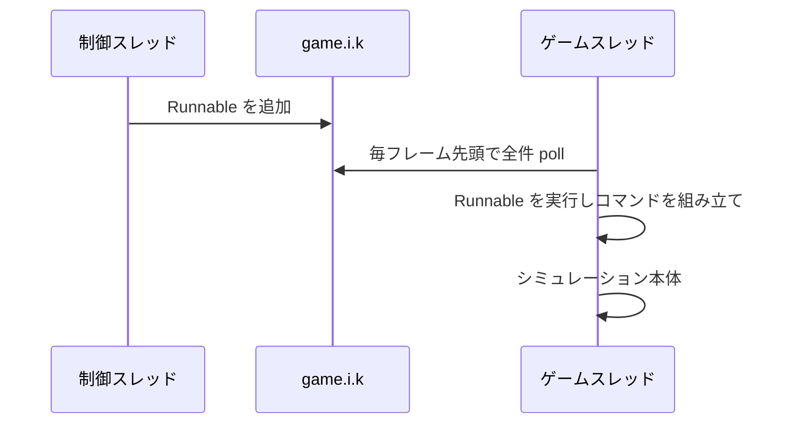

# 行動発行

プロセス内からプレイヤーとして命令を出す方法を記録する。実際にユニットを動かして検証済みである。

## 発行はゲームスレッドで行う

コマンドを保持するプール `l.cf` は素の `ArrayList` で、同期化されていない。別スレッドからコマンドを組み立てると、それを消費するゲームループと競合する。

ゲームスレッドで処理を実行する手段がエンジンに用意されている。`game.i.k` は `ConcurrentLinkedQueue` で、**シミュレーション本体の直前に、毎フレーム、中身が空になるまで `Runnable` を取り出して実行する**。

```java
Object engine = l.class.getMethod("B").invoke(null);
Field queue = engine.getClass().getField("k");
((ConcurrentLinkedQueue<Runnable>) queue.get(engine)).add(task);
```

外部の制御系からの命令はすべてこの経路に載せる。バイトコード改変は不要である。試合の開始と終了も同じ経路を使う必要がある([05-match-control.md](05-match-control.md))。

**投入した処理が自分自身を再投入するとゲームが止まる。** キューは空になるまで排出されるためである。詳細は [01-internals.md](01-internals.md) に記す。

投入した処理が実際にどこで走るかは、意図的に例外を起こしたときのスタックトレースで確認した。描画経路の中でシミュレーションが回っているという [01-internals.md](01-internals.md) の構造とも一致する。

```
at RwProbeAgent$3.run(RwProbeAgent.java:222)
at com.corrodinggames.rts.game.i.b(SourceFile:2271)
at com.corrodinggames.rts.game.i.a(SourceFile:2173)
at com.corrodinggames.rts.java.u.render(SourceFile:1595)
at com.corrodinggames.rts.java.b.updateAndRender(SourceFile:255)
at com.corrodinggames.rts.java.b.gameLoop(SourceFile:146)
```



## コマンドの取得は発行を兼ねる

`l.cf.b(player)` はコマンドオブジェクトを返すが、**返す時点で既に実行キューに入っている**。したがってフィールドを埋めるだけでよく、送信にあたる呼び出しは存在しない。ゲームの UI も内蔵 AI もこの経路を使う。

```java
e command = engine.cf.b(player);   // この時点でキュー済み
command.h = true;                  // 末尾の重複ウェイポイントを除去する。UI と同じ挙動
command.a(unit);                   // 対象ユニット。複数回呼べる
command.a(x, y);                   // 移動先。ここで命令種別が決まる
```

引数なしの `cf.b()` は例外で、キューに入らない。この場合は `l.bX.a(command)` を自分で呼ぶ。システム命令はこちらを使う。

シングルプレイとネットワーク対戦で投入先は変わるが、`cf.b(player)` を使う限りエンジンが振り分けるため呼び出し側は意識しなくてよい。ネットワーク対戦では発行者を示す `command.p` を設定するのが正しい。またネットワーク対戦では実行が数フレーム先に予約されるため、命令は即座には反映されない。

## 命令の種別

命令本体は `game.units.au` に入り、種別は enum `game.units.av` である。定数名は平文で残っていた。

| 種別 | `e` のメソッド |
| --- | --- |
| move | `a(float x, float y)` |
| attack | `a(am target)` |
| build | `a(float x, float y, as type, int size)` |
| repair | `b(am target)` |
| loadInto | `e(am target)` |
| reclaim | `d(am target)` |
| attackMove | `b(float x, float y)` |
| loadUp | `f(am target)` |
| patrol | `c(float x, float y)` |
| guard | `c(am target)` |
| stop | `h()` |

`unloadAt` はどこからも参照されていない未使用の定数である。`guardAt`、`touchTarget`、`follow`、`triggerAction`、`triggerActionWhenInRange`、`setPassiveTarget` は enum に存在するが `e` に対応するメソッドがなく、`au` を直接組み立てる必要がある。

コマンドオブジェクトの主なフィールドは次のとおりである。

| フィールド | 意味 |
| --- | --- |
| `i` | 命令を出すプレイヤー。必須 |
| `j` | 命令本体 |
| `v` | 対象ユニットのリスト |
| `e` | 既存のウェイポイントを消さずに追加する。UI の Shift 押下にあたる |
| `h` | 直前と同等のウェイポイントを重複排除する |
| `o` | 停止 |
| `k` | 特殊アクションの識別子。生産とアップグレードで使う |
| `n` | 交戦スタンス |
| `p` | ネットワーク対戦での発行者 |
| `r` / `u` | システム命令のフラグと種別 |

## 対象ユニットの指定

対象は**コマンド側のリストで指定する**。ゲーム内の選択状態とは独立している。

```java
command.a(unit);              // 1体ずつ追加
command.a(unitList);          // まとめて追加
```

ゲーム内の選択状態はユニット側のフラグ `am.cG` であり、UI はそれを走査してコマンドに詰めている。**制御プログラムは選択に触らず、対象を直接指定するのが安全である。**

## 生産とアップグレード

生産は命令ではなく**特殊アクション**として発行する。識別子は文字列をインターンしたハンドルで、命名規則がある。

| 用途 | 識別子 |
| --- | --- |
| 建設ユニットによる建物建設 | `"b_" + 種別の内部名` |
| 工場でのユニット生産とアップグレード | `"u_" + 種別の内部名` |

```java
e command = engine.cf.b(player);
command.a(factoryUnit);
command.a(a.c.a("u_" + type.v()));   // 生産
// command.g = true を足すとキャンセルになる
```

ユニット種別は `game.units.ar.a(String)` で内部名から引ける。**ただし引くときの名前と `as.v()` が返す名前は一致しないことがあり、識別子は `as.v()` の側で組み立てる必要がある。** 詳細は [06-content.md](06-content.md) に記す。

ラリーポイントは `command.a(new PointF(x, y))` で設定する。交戦スタンスは `command.a(stance)` である。

## システム命令

`command.r = true` を立て `command.u` に種別を入れる。これらは引数なしの `cf.b()` で取得し、`l.bX.a(command)` で明示的に投入する。ホスト権限が前提である。

| `u` | 動作 |
| --- | --- |
| 5 | ユニットの即時生成。`build` 命令と種別を併せて指定する |
| 100 | 指定プレイヤーの降参 |
| 200 | 再同期 |

### `u=5` によるユニット生成は動作を確認した

命令本体 `command.j` が build 種別で、種別が非 null であることが条件である。満たさない場合はゲームのログに `system command spawn - failed` が出る。

```
spawn: resolved 'mammothTank' to com.corrodinggames.rts.game.units.custom.l reporting name 'c_mammothTank'
spawn: submitted mammothTank at (1308,451) for a@355c5eb7, units before=26
spawn: c_mammothTank alive=1 nearestToTarget=230 unitsNow=31 (was 26)
```

生成されたユニットが名乗る名前は、引くときに使った名前とは限らない。ゲーム側のログには `system command spawn` が残る。再現するには次を実行する。

```powershell
.\tools\windows\Start-RwProbe.ps1 -Count 1 -Speed 10 -Seconds 90 -Map Lake -AgentOptions 'spawn=mammothTank'
```

**ただしこれが単独プレイでの確認であることに注意する。** 正規のコマンド経路を通っている以上ロックステップの同期は保たれるはずだが、複数プロセスを接続した状態では未検証である。

## テキストコマンドは使えない

ゲーム内には `-addai` `-credits` `-map` `-startingunits` といった文字列が多数含まれているが、**これらの受信側実装はゲーム本体に存在しない**。外部の専用サーバ向けの送信専用プロトコルであり、素のホストに送っても何も起きない。

実際に動作するのは 9 個だけである。`-pause` `-unpause` `-endgame` `-teamlock` `-roomlock` `-share` `-self_move` `-self_team` `-surrender`。しかもホスト側でしか解釈されず、ネットワークセッションでない単独プレイでは一切解釈されない。

いずれも対応する API を直接呼んだ方が速く確実である。制御チャネルとしては当てにしない。

## 検証結果

内蔵 AI が所有するユニットに移動命令を出し、実際に移動することを確認した。

```
act: ordered com.corrodinggames.rts.game.units.custom.j from (931,2211) to (1531,2811)
act: unit at (1074,2250) distanceToTarget=723 waypoints=1
act: unit at (1292,2292) distanceToTarget=571 waypoints=1
act: unit at (1487,2351) distanceToTarget=462 waypoints=1
```

目標へ向けて確実に移動している。その後ユニットは引き返したが、これは所有者である内蔵 AI が自分の命令で上書きしたためであり、命令経路の問題ではない。

再現するには計測エージェントに `act=move` を渡す。

```powershell
.\tools\windows\Start-RwProbe.ps1 -Count 1 -Speed 2 -Seconds 60
```

実装は `tools/probe-agent/RwProbeAgent.java` の `issueMoveTest` にある。

## 注意点

- 難読化されたユニット種別は非公開の無名クラスであるため、そのメソッドはリフレクションで直接取得できない。公開インタフェース `game.units.as` 側からメソッドを解決する必要がある。
- 状態を直接書き換える方法(体力やクレジットへの代入)は、単独プレイでは動くがロックステップの同期を壊す。詳細は [03-observation.md](03-observation.md) を参照する。
