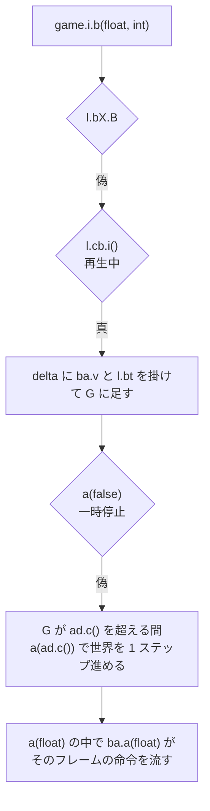

# 試合の進行制御

学習のエピソードとして試合を自動で開始し、設定し、終了を検出し、次を始めるための方法を記す。**実行時に確認してある。** 逆アセンブルから導いた手順のうち二つは実際には機能しないので、その内容も含める。

## できることとできないこと

プロセス内から次を行える。

- 単独プレイヤー用サーバの起動、マップと AI の設定、試合の開始
- 倍率どおりの速度での進行
- 本物の勝敗検出。内蔵 AI が放置したプレイヤーを撃破すると、`l.dt` と生存チームの集計が同じ時点で終了を報告する
- ゲーム内時間の上限による打ち切り
- 次エピソードへのリセット
- 記録したリプレイの再生による、試合のそのままの再現(後述)

次は成り立たない。

- **エンジン自身のバトルルーム復帰は単独サーバでは機能しない**(後述)
- **同一の乱数種で試合は再現しない**(後述)

計測エージェントがこの手順を実装しており、次で動かせる。

```bash
python -m rwintel.runtime probe --count 1 --speed 10 --seconds 200 --map Lake --difficulty 3 --max-seconds 90 --episodes 2
```

`match:` の行が開始・生存チーム・終了・組み直しを、`result:` の行がエピソードごとの結末を報告する。制御エージェント `agent/MatchDriver.java` も同じ手順で試合を組む。

## `-sandbox` の正体

先に紛らわしいものを片付ける。起動引数 `-sandbox` は静的フラグを立てるだけで、参照箇所は一箇所しかない。起動直後にメニュー用スクリプトを一行流し込み、**固定マップ `[z;p10]Crossing Large (10p)` のサンドボックスを開始する**ショートカットである。それ以外の効果はない。

サンドボックスモード自体の実体はエンジンのフラグ `l.bv` で、これが立つと**全プレイヤーの全ユニットを操作できる**ようになり、霧が強制的に無効化される。単独の学習環境としては便利だが、対戦としては成立しない。

## 進行制御はゲームスレッドで行う

**マップの読み込みには OpenGL コンテキストが必要である。** 監視スレッドから呼ぶと次で失敗する。

```
java.lang.RuntimeException: No OpenGL context found in the current thread.
```

したがって試合の開始と終了は、命令の発行と同じく [04-actions.md](04-actions.md) のゲームスレッド投入経路(`game.i.k`)を通す必要がある。監視スレッドは状態を読んで判断するだけにする。

## 試合の開始

経路が二つあり、**学習には後者を使う**。

クイック開始(`appFramework.i.a(...)`)はバトルルームを経由せず即座に試合を始められるが、ネットワークセッションが立っていない状態で開始するとエンジンが**乱数種を引き直し、収入倍率を 1.0 に潰す**。

バトルルーム経由では次の順で行う。

```java
Object net = engine.bX;
net.b("setup");                          // 全切断と状態リセット
n.F();                                   // プレイヤー配列のリセット
engine.bS.g();  engine.L();
synchronized (engine) { engine.dm = null; engine.dl = マップパス; }
engine.a(true, s.b);                     // マップ先読み
net.y = "You";  net.o = true;
net.S();                                 // 単独プレイヤー用サーバ開始。true が返る
```

続いて設定を書き込み、AI を追加し、開始する。

```java
Object config = net.ay;
config.a = ai.a;                         // マップ種別。skirmish
net.az = マップパス;
config.b = ファイル名;
config.c = 0;                            // 開始クレジットの番号。0 は 4000
config.d = 2;                            // 視線による霧
config.e = false;                        // マップを露出しない
config.f = 難易度;
config.g = 1;                            // 開始ユニット。この手順では値によらず司令部 1 と建設機 1 になる
config.h = 1.0f;                         // 収入倍率
for (int i = 0; i < 対戦相手数; i++) net.ap();
net.f();  net.P();  net.L();
config.q = 乱数種;                        // 開始の直前に書く
net.ae();                                // 開始。true が返る
```

### 副作用

2 人用マップを指定しても、**プレイヤー枠は 9 個埋まる**。番号 2 以降は AI として作られ、そのマップには対応する出撃地点がないため直ちに全滅扱いになる。生存チームの集計では除外されるので害はないが、プレイヤー一覧を読むときは想定しておく必要がある。

**枠が埋まる数は `net.ap()` を呼んだ回数では決まらない。** 部屋は空き枠を AI で満たす。したがって対戦の顔ぶれは「必要な数だけ足す」のではなく「余分を外す」ことで決める。

## マップの選択

**インデックスで選ぶ API は存在しない。パス文字列で指定する。** エンジンが報告するマップのパスは `assets/` からの相対で、`maps/skirmish/[p2]Lake (2p).tmx` の形をとる。

| 場所 | 内容 |
| --- | --- |
| `assets/maps/skirmish/` | 組み込みの対戦マップ。48 個 |
| `assets/maps/normal/` | キャンペーン |
| `assets/maps/survival/` | サバイバル |
| `assets/maps/menu_background/` | メニュー背景で動く戦闘 |
| `mods/maps/` | カスタムマップ |
| `saves/` | セーブデータ |

ファイル名の `[pN]` はプレイヤー数を示す。マップ名には空白が含まれるため、`-javaagent` の引数として直接渡すと引数が分割されて起動に失敗する。エージェントは部分一致でファイル名を解決する方式にしてこれを回避している。

## AI の設定

AI の追加はホスト側の `net.ap()` を呼ぶ。空きスロットを探して AI プレイヤーを作り、チームをスロット番号の偶奇で仮に振り分ける。その後の部屋の処理で振り直されるため、**最終的なチーム分けは偶奇とは一致しない**。4 人用マップで枠 1、2、3 がそれぞれチーム 1、2、3 になる。

### AI プレイヤーは別のクラスである

`net.ap()` が作るのは `com.corrodinggames.rts.game.a.a` であり、通常のプレイヤー `game.n` の派生である。AI の思考はこのクラスにある([08-builtin-ai.md](08-builtin-ai.md))。

**したがって既存のプレイヤーの `n.w` を真にしても AI は動かない。** ローカルプレイヤーに `w=true` と難易度を設定しても、資金が使われないまま積み上がるだけである。既存のプレイヤーを AI に差し替えることはできない。

AI 同士を戦わせたい場合は、AI として作られたプレイヤーを残し、**ローカルプレイヤーを含む余分なプレイヤーを観戦者に移す**。観戦者はチーム番号 `-3` であり、生存チームの集計から外れる。ローカルプレイヤーを観戦者にすると `l.dq` と `l.dt` は意味を失うため、終了判定は生存チームの集計だけで行う。

**選んだ対戦相手の枠には出撃地点が要る。** 2 人の対戦者を立てるにはローカルプレイヤーの枠を含めて 3 つ以上、すなわち 4 人用マップが必要である。これを行うのが `python -m rwintel.runtime outcomes` である([../project/07-evaluation.md](../project/07-evaluation.md))。

| 値 | 難易度 |
| --- | --- |
| -2 | Very Easy |
| -1 | Easy |
| 0 | Medium |
| 1 | Hard |
| 2 | Very Hard |
| 3 | Impossible |

**難易度の変更は試合開始後には反映されない。** カリキュラム学習で難易度を上げる場合は、エピソードの切り替え時に設定する。

## 何も起きない盤面を部屋から作る

交戦アリーナ([../project/08-learning.md](../project/08-learning.md))が要求するのは、こちらが交戦を組む以外に何も起きない盤面である。**部屋はそれを提供しない。** 枠は要求した対戦相手の数によらず 9 個埋まり(上記)、開始ユニットの設定でそれを空にすることもできない。設定値によらず、出撃地点を持つプレイヤーは必ず司令部 1 と建設機 1 で始まる。**組み立て直せるのは、部屋に残るプレイヤーが何をするかの方だけである。**

そこで試合の開始手順の最後、部屋が自分で枠を埋め終わったあとに、次を行う。実装は `agent/MatchDriver.java` の `chooseSparringPartner` である。

**相手側の持ち主を 1 枠だけ選ぶ。** 交戦の一方はこちらのプレイヤーのもの、他方はこの枠のものとして生成される。選び方は、**枠を番号の大きい方から見て、空でもローカルでもない最初のもの**である。どの枠が埋まりどれをマップが置けなかったかは部屋の側にしか分からないため、選ぶのもここであり、選んだ番号は開始の事象に載せて制御プロセスへ渡す。**望ましいのは出撃地点を持たないプレイヤーである。** 基地を持たなければ収入も生産手段も無く、そのユニットを動かすものは制御プロセスしかない。2 人用マップでは最後の枠が出撃地点を持つことはない。選んだ枠がローカルと同じチームになっていた場合はチーム番号を 1 つずらして敵側に置く。

**残りのローカルでないプレイヤーは観戦者(チーム -3)へ移す。** 背後で第二の試合が進むのを止めるためである。

**部屋の内蔵 AI は、選んだ枠のものも含めて全て停止する。** 停止は `com.corrodinggames.rts.game.a.a` のフラグ `aX` を真にすることで行う。**このフラグは AI 自身の更新が先頭で読み、立っていれば何もせずに返る**([08-builtin-ai.md](08-builtin-ai.md))。建設も拡張も攻撃隊の編成も止まり、**ユニットにも体力にもクレジットにも一切触れない。** 一度も決めないプレイヤーはコマンドを一度も発行しない。司令部と建設機は立ったまま何もしない。

**枠を選ぶだけでは足りない。** 出撃地点を持たないプレイヤーもプレイヤーであり、考える。手元にあるものから攻撃隊を組み、自分の判断で命令を出し、経済を見つける。停止しなければ相手側は自分で収入を得て軍を増やし、アリーナが生成した分しか持たないこちら側に対して試合として勝ち始める。停止すれば相手側の収入は 0 のままである。

### この書き込みが健全である条件

**フラグへの代入は、本プロジェクトがコマンド経路の外へ書き込む唯一の箇所である。** 許される理由は二つある。

**書く先がシミュレーションではなく、プレイヤーの判断する側であること。** 盤面の状態は一切変わらない。変わるのは、そのプレイヤーが今後コマンドを出すかどうかだけである。

**同じフレームを回している第二のプロセスが存在しないこと。** ロックステップの相手は同じ内蔵 AI を同じフレームにわたって走らせ、同じコマンドに到達する([07-multiplayer.md](07-multiplayer.md))。片側だけを黙らせることは、設計全体が避けている desync そのものである。**したがって停止はアリーナのエピソードに限り、通常の試合は評価の相手である内蔵 AI をそのまま持つ。** アリーナのエピソードが対戦組にならないことは制御プロセスの側の性質であり、この二つを同時に指定しないことでのみ成り立っている。

### アリーナのエピソードは勝敗で終わらない

停止と別に、アリーナのエピソードでは[終了の検出](#終了の検出)を通さない。生存チームの集計も勝敗フラグも「誰が勝っているか」を問うものであり、交戦を組むための盤面にその問いは意味がないからである。エピソードを終わらせるのはゲーム内時間の上限か、セッションの停止か、異常終了だけである。**出撃地点を持たないプレイヤーが最初のステップで敗北扱いになっても、エピソードはそのまま進む。**

## 試合設定

設定は `l.bX.ay` にまとまっている。ホストの場合はこのオブジェクトが実体そのものなので直接書き換えられる。

| フィールド | 既定 | 意味 |
| --- | --- | --- |
| `a` | skirmish | マップ種別 |
| `b` | - | マップ名 |
| `c` | 0 | 開始クレジットの番号 |
| `d` | 2 | 霧。0 が無し、1 が基本、2 が視線 |
| `e` | true | 開始時にマップを露出するか |
| `f` | 1 | AI 難易度 |
| `g` | 1 | 開始ユニット。**この開始手順では効果がない。** どの値でも、出撃地点を持つプレイヤーは司令部 1 と建設機 1 で始まる |
| `h` | 1.0 | 収入倍率 |
| `i` | false | 核の禁止 |
| `l` | false | 操作の共有 |
| `q` | - | 乱数種 |

開始クレジットは番号で指定する。

| 値 | 0 | 1 | 2 | 3 | 4 | 5 | 6 | 7 | 8 |
| --- | --- | --- | --- | --- | --- | --- | --- | --- | --- |
| 金額 | 4000 | 0 | 1000 | 2000 | 5000 | 10000 | 50000 | 100000 | 200000 |

## 終了の検出

プレイヤー単位の状態は約 10 フレームごとに更新される。

| フラグ | 意味 |
| --- | --- |
| `n.F` | 敗北。建設または技術ユニットが一つも無くなった |
| `n.G` | 全滅。ユニットが一つも無くなった |
| `n.H` | 勝利を宣言された |
| `n.E` | 降参した |

**`n.H` は当てにできない。** 勝利宣言の経路は「3 チーム以上かつ各チーム 1 人」つまり全員が個別の対戦のときしか通らない。2 対 2 のようなチーム戦では発火しない。

ローカルプレイヤー視点の勝敗はエンジンのフラグ `l.dq`(勝利)と `l.dt`(敗北)に出る。生存チームの集計と `l.dt` は同じ時点で終了を報告する。両方を見るのが確実である。

生存チームの集計は、そのチームに観戦者でなく敗北も全滅も降参もしていないプレイヤーが一人以上いるかで判定する。生存チームが一つになれば決着である。

**勝敗が付いても試合は自動的に止まらない。** バナーを出すだけで進行は続くため、明示的に終了させる必要がある。

## 次のエピソードへ

### エンジンのバトルルーム復帰は使えない

逆アセンブルからは二つの復帰経路が読み取れるが、**単独プレイヤー用サーバではどちらも機能しない**(実行時確認)。

- `ad.i(接続)` に null を渡す方法は、イベントをクライアントへ**送信するだけ**である。接続しているクライアントがいない単独サーバでは何も起きない。
- `ad.ag()` は復帰タイマーを仕掛ける。ログに `Setting up return to battleroom timer...` が出るところまでは進むが、**カウントダウンは永久に 5.0 のまま止まる**。

原因はカウントダウンの置き場所にある。これを消化する `ad.a(float)` はゲームのループから `ad.B`(ネットワークセッションが有効)が真のときだけ呼ばれる。ところが `ad.B` は、サーバ起動直後は真であるにもかかわらず、**試合の進行中に偽へ落ちる**。実クライアントのいない単独プレイに縮退するためと考えられる。結果としてタイマーは仕掛かったまま誰にも消化されない。

### 採用した方法

**エピソードごとにサーバを組み直す。** 上記の開始手順を最初から実行し直す。これで次が成り立つ。

- ゲーム内時間とフレーム数が毎回ゼロから始まる
- プレイヤー枠が増え続けない
- オブジェクト数が毎回同じ初期値から始まる

マップの再読み込みが入るぶん追加の時間がかかるが、常に既知の状態から始まる利点が大きい。計測エージェントは進行をフレームごとに判定し、走っている試合の終了と打ち切りはゲーム内 1 秒ごとに見る。制御エージェントは制御プロセスの指示で即座に組み直す。どちらも切り替えにかかる実時間は主にマップの読み込みである。

## 決定性はない

**同一の乱数種で同一の設定を与えても、試合は再現しない。** 同じ種で続けて走らせたエピソードでも、ゲーム内の同じ時刻に到達するまでのフレーム数も、その時点の AI の資金も、エピソードごとに違う。

原因の一つは [01-internals.md](01-internals.md) に記した delta 駆動の構造にある。1 フレームが進めるゲーム内時間は実経過時間から決まるため、同じゲーム内時間に到達するまでのフレーム数が実行ごとに変わる。ステップの切り方が変われば、その上で動く挙動も分岐する。

**ただしそれだけではない。** 全フレームを同じゲーム内時間だけ進める固定ステップ([02-launch.md](02-launch.md))にしても、同じ種の試合はゲーム内 30 秒の時点で全オブジェクトの位置がすでに食い違い、やがてオブジェクト数も分かれる(実行時確認)。残る原因は特定していない。

学習と評価への影響は次のとおりである。

- **二つの方策を「同じ試合」で比較することはできない。** 評価は必ず多数のエピソードの平均で行う。
- 不具合の再現も保証されない。ログには乱数種だけでなく実際に起きた事象を残す必要がある。

再現性を取り戻すには、固定ステップの上でなお残る非決定性の出どころを突き止める必要がある。固定ステップ自体はバイトコードを変えずに実現でき、このプロジェクトの既定である([../project/02-runtime.md](../project/02-runtime.md))。

**再現しないのは試合を始め直した場合であり、記録した命令列を流し直した場合ではない。** 試合のリプレイを再生すると、その試合はそのまま再現される([リプレイ](#リプレイ))。したがって分岐の出どころは命令列の外にあると**推定**する。

## リプレイ

ゲームは試合を作業ディレクトリの `replays/` へリプレイとして記録する。このプロジェクトではインスタンスディレクトリの `replays/` になる([../project/02-runtime.md](../project/02-runtime.md))。**リプレイを再生すると、記録した試合がそのまま再現される**(実行時確認)。再生中にエンジンが行うチェックサムの照合はすべて一致し、記録した側が最後に取った世界のチェックサムと同じフレームの値も、終了時の陣営ごとの最終状況も一致する。

### ファイルの形

ファイル全体がエンジン自身の直列化(読み手は `gameFramework.j.k`)で書かれている(逆アセンブル確認)。数値はビッグエンディアン、真偽は 1 バイト、文字列は 2 バイトの長さに続く modified UTF-8 で、Java のデータストリームそのものである。その上にエンジンは名前付きのブロックを重ねる。**ブロックは名前の文字列、4 バイトの長さ、その長さのバイト列**であり、中身はそのバイト列だけから読まれる。長さが分かるので、読み手は要らない部分を読み飛ばしても次のブロックへ正確に着地できる。

先頭は次のとおりである。

| 順 | 型 | 中身 |
| --- | --- | --- |
| 1 | 文字列 | `rustedWarfareReplay` |
| 2 | int | ゲームの版番号(`l.c(true)`)。異なる版の記録は読み込みを拒まれる |
| 3 | int | セーブの版。以降のすべてのブロックはこの版で読まれる |
| 4 | 文字列 | 版の名前(`1.15`) |
| 5 | 真偽 | 読み捨てられる |
| 6 | ブロック `gamesave` | 試合開始時点のセーブ |

`gamesave` の中身は、文字列 `rustedWarfareSave`、int 2 つ、真偽 1 つ、gzip で圧縮したセーブ本体を入れたブロック `saveCompression`、区切りの印(short の 12345)、文字列 `<SAVE END>` である。セーブ本体にはマップのパス(`maps/skirmish/...tmx`)が文字列で入る。

その後ろは記録のブロックの列である。

| 名前 | 中身 |
| --- | --- |
| `rc` | フレーム(int)と、命令のブロック `c` |
| `wait` | フレーム。記録した側がそこで待ったこと |
| `cs` | フレームと、記録した側がそこで取った世界のチェックサム(long) |
| `es` | フレームと、補助のチェックサムの列。バイト列(長さ付き)の中にフラグ 1 バイト、個数(int)、long の列が入る |
| `chat` | フレーム、送り手のスロット(int)、送り手の名前と本文(それぞれ有無の真偽に続く文字列) |
| `resync` | フレームと、記録した側が同期し直したときの完全なセーブ |
| `end` | 記録が正しく閉じられたこと |
| `endReplayMetaData` | 同上 |

**`es` はチェックサムを取るフレームごとに書かれ、中身はエンジンが登録した順の 15 項目である**(`gameFramework.j.ak`)。ユニットの位置・向き・体力・識別子、ウェイポイント、その位置、全体のクレジット、経路、ユニット数、チーム情報、スロット 0・1・2 のプレイヤーのクレジット、司令部の 2 項目の順に並ぶ。**したがって、ゲームを起動しなくてもスロットごとのクレジットの推移が読める。**

**敗北は、記録した側が送り手 -1(システム)のチャット `<名前> was defeated` として書く。** 試合がどこで終わったかは、記録の中ではこれで分かる。

### 命令の形

命令のブロック `c` の中身は、ロックステップの試合でプロセスの間を渡るのと同じ命令オブジェクト(`gameFramework.e`)である。読み手 `e.a(j.k)` が読む順に並び、後から足されたフィールドは、エンジンがストリームの版を確かめてから読む(逆アセンブル確認)。

| 順 | 型 | 中身 | 版 |
| --- | --- | --- | --- |
| 1 | byte | 出したプレイヤーのスロット。-1 はシステム | |
| 2 | 真偽 + 命令 | ウェイポイント(`au`、下表)の有無と中身 | |
| 3 | 真偽 | `e.e` | |
| 4 | 真偽 | `e.g`(stopOrUndo)。特殊行動の取り消し | |
| 5 | int | 特殊行動の番号。9 の名前に置き換えられる | |
| 6 | int | スタンス(`game.units.a` の序数)。-1 は変更なし | |
| 7 | 真偽 + float 2 | 位置の有無と座標 | |
| 8 | 真偽 | `e.o` | |
| 9 | int + long の列 | 対象ユニットの識別子 | |
| 10 | 真偽 + byte | 行動するプレイヤー(`e.p`) | 16 |
| 11 | 真偽 + float 2、long | 2 つ目の位置と、ユニットの参照(`e.l`、`e.m`) | 29 |
| 12 | 文字列 | 特殊行動の名前。`-1` は無し | 33 |
| 13 | 真偽 | `e.f` | 37 |
| 14 | short | `e.q` | 52 |
| 15 | 真偽 + (byte、float、float、int) | システム命令。2 つ目の値がステップ率(0 なら変更なし)、最後の int がシステム命令の番号 | 53 |
| 16 | int + 移動の記録 | 移動の記録(`gameFramework.d`)の列。各記録は long、float 4 つ、int、移動種別の序数、経路の有無の真偽 2 つと、gzip で圧縮した経路のブロック `p` | 53 |
| 17 | 真偽 | `e.h` | 80 |

ウェイポイント(`game.units.au`)は次のとおりである。

| 順 | 型 | 中身 | 版 |
| --- | --- | --- | --- |
| 1 | int | 命令の種別(`game.units.av` の序数)。-1 は無し | |
| 2 | int(+ 文字列) | 建てる種別。-1 は無し、-2 に続けて定義ファイルの種別の名前、それ以外は組み込み種別(`game.units.ar`)の序数 | |
| 3 | float 2 | 座標 | |
| 4 | long | 対象ユニットの識別子。-1 は無し | |
| 5 | byte | | 40 |
| 6 | float 2 | | 46 |
| 7 | 真偽 3 つ | それぞれ版 58、65、79 から | 58 |
| 8 | 真偽 + 文字列 | 命令が名指す行動 | 82 |

- **ユニットの識別子は、観測が報告するユニットの識別子と同じものである**(`w.eh`)。再生中の盤面と記録の命令を突き合わせられるのはこのためである
- 特殊行動の名前は、生産が `u_<種別>`、建物の配置が `b_<種別>`、それ以外は段階の引き上げなどユニットが差し出す行動である。**ゲーム自身のクライアントは、建物を `b_` を付けずに建設のウェイポイントだけで配置する。** 制御エージェントは両方を付ける
- 種別の名前は、エンジンが報告する名前(`as.v()`)である

**ゲーム内時刻は記録に入っていないが、命令列から復元できる。** 世界の 1 ステップはステップ率を 60 分の 1 秒単位で進め、ゲーム内の時計はそれをミリ秒に切り捨てて足す。したがって 1 ステップはステップ率 1 で 16 ms、2 で 33 ms である。試合はステップ率 1 で始まり、システム命令でステップ率が変わる。**変更は、記録されたフレームの次のステップの、さらに次から効く。** 記録にない速度倍率 `H` を 1 とする限り、フレームからゲーム内時刻が正確に求まる([進み方](#進み方))。

### 読み込み

リプレイ機構はエンジンのフィールド `l.cb` にあり、クラスは `com.corrodinggames.rts.gameFramework.ba`、ログでの呼び名は `ReplayEngine` である(逆アセンブル確認)。読み込みはゲームスレッドで `l.cb.c(名前)` を呼ぶ。名前は `replays/` を基準に解決され、ヘッダと版を確かめてから開始時点のセーブを読み込み、真を返す。

**読み込んだだけでは再生は始まらない。** メニュー画面からの読み込み `librocket.scripts.Root.loadReplay` は、`l.cb.c` の後に `resumeNonMenu` でメニューを閉じる。その中身は libRocket の文書管理の `closeActiveDocument()` と `clearHistory()`、それに GUI エンジン `librocket.a.a()` の `a(false)` である。これを行わないと、一時停止の判定 `game.i.a(boolean)` がメニュー文書が開いていること(`dH.b()` から `Main.p.b()`)を理由に真を返し、再生はフレーム 0 のまま止まる(逆アセンブル確認、実行時確認)。描画を止めていても再生できる。

### 進み方

1 フレームの処理 `game.i.b(float, int)` は、ネットワークのセッションが立っていなければ、リプレイ再生中(`l.cb.i()`)の分岐に入る(逆アセンブル確認)。



- 世界の 1 ステップは `a(ad.c())` である。`ad.c()` はステップ率 `ad.bI` を返し、試合中の `changeStepRate` 命令で変わる。この命令もリプレイに記録されており、再生で同じ値になる
- **1 ステップが進めるゲーム内時間は速度倍率 `H` に比例する。** 再生の倍率を元の試合と変えると、ステップの刻みが変わってチェックサムが食い違う(実行時確認)。再生は元の試合と同じ倍率で行う
- **倍率は記録に入っていない。** 速度を上げたロックステップの試合の記録も、等速の試合と同じステップ率を持つ。そうした記録を倍率 1 で再生すると、エンジンの照合が食い違いを報告する(実行時確認)。人が遊ぶ試合は等速なので、倍率 1 で再生できる
- **早送りはリプレイ自身の再生速度 `ba.v`(整数)で行う。** これは 1 フレームあたりのステップ数を増やすだけで、ステップの長さを変えないので、再現は保たれる(実行時確認)。1 フレームに溜められる `G` は 100 で頭打ちになる
- 制御エージェントは、倍率を 1 に留め、毎フレーム同じ経過時間を与える再生用の時計でリプレイを進める([../project/02-runtime.md](../project/02-runtime.md))

### 照合

再生中、エンジンはリプレイに記録されたチェックサムと自分の値を照合し、一致すれば `Replay: checksum: checksums are matching frameNumber:N`、食い違えば `checksums don't match!!` に続けて双方の値をログに出す(逆アセンブル確認、実行時確認)。世界のチェックサムは実戦と同じく `ad.ah` と `ad.am.a` に入る([07-multiplayer.md](07-multiplayer.md))。

### 記録の始まりと終わり

エンジンは、ネットワークの試合が始まると記録を始める(`ba.d(名前)`、ログの `Recording replay to:`)。記録中のファイル名は `ba.t` にある(逆アセンブル確認)。

**記録は試合が決着しても止まらない。** プロセスが動いている限り続き、試合の後の分もファイルに入る。`ba.e()` を呼ぶと、書き込みのスレッドが `end` と `endReplayMetaData` を書いてファイルを閉じる(実行時確認)。制御エージェントはエピソードの終わりにこれを呼び、ファイル名を終了の事象で制御プロセスへ渡す([../project/05-interface.md](../project/05-interface.md))。

リプレイ機構の状態は二つのフラグで決まる。`ba.P` は記録中か再生中であること、`ba.u` は再生であることを表し、`ba.i()` は前者、`ba.j()` は両方、`ba.k()` は記録中(`P` かつ `u` でない)を返す(逆アセンブル確認)。

### 再生の終わり

- **再生は記録の終わりで止まらない。** 試合が終わった後もゲームが記録を続けていれば、その分も再生される。記録した試合の終わりは呼び出し側が決める
- ファイルを読み切ると、エンジンは `updateGameFrame:IOException, read of replay?` をログに出して `ba.s` を立てるが、世界はそのまま進み続ける(実行時確認)。記録の最後の命令の後に命令が無かったのなら、それは記録した試合と同じ進み方である
- 記録した側で出た敗北の判定(`was defeated`)は、再生では同じ時点に現れない。盤面は一致している

### 再生中のプレイヤー

**再生中は、どのプレイヤーも内蔵 AI として扱われない**(`n.w` が偽、実行時確認)。記録した試合で内蔵 AI やこのプロジェクトの方策が動かしていた側も、記録された命令で動くからである。したがって、どの側から盤面を見るかは呼び出し側が名指す。

**視界は、名指したプレイヤーについてそのまま判定できる。** 可視判定 `am.d(n)` にそのプレイヤーを渡すと、自プレイヤー(`l.bs`)でなくても、そのプレイヤーの側から見えるものだけが真になり、照合も食い違わない(実行時確認)。自プレイヤーを差し替える必要はない。

### 分かっていないこと

- 参加した側のクライアントが記録したリプレイ、単独プレイの試合のリプレイが同じく再現するか
- `l.cb.c` に絶対パスを渡せるか
- 記録した側で敗北が判定される条件。再生では現れないので、その出どころ(ホストだけが出すシステム命令か、プレイヤーの状態か)を追っていない
