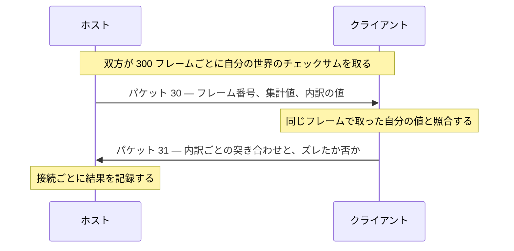

# マルチプレイヤー

Rusted Warfare が自前で持っている対戦セッションの仕組みを記録する。セッションの開設と参加、ロックステップの進み方、エンジン自身による同期検査、そして通信の形式である。

**本文書はほぼ全体が逆アセンブル確認である。** 他の `game/` 文書と同じく、記述ごとに 実行時確認 / 逆アセンブル確認 / 推定 の別を付ける。二つのプロセスを一つの試合に入れた実行は一度行っており、実行時確認 と言えるのはそこで見えた範囲だけである。何をどこまで確かめたかは [二プロセスを繋いだ実行](#二プロセスを繋いだ実行) に書く。計測エージェント側の実装状況もその手前に分けて書く。

対象は他の文書と同じく 1.15 build #28 である。ネットワークセッションの本体はエンジンのフィールド `l.bX`、クラスは `com.corrodinggames.rts.gameFramework.j.ad` である。

## セッションは二種類あり、片方は対戦にならない

**`ad.S()` と `ad.b(boolean)` は別物である。** 前者が [05-match-control.md](05-match-control.md) の試合進行で使っている単独プレイヤー用サーバ、後者が他のプロセスを受け入れる本物のホストであり、両方とも「セッションが立った」ことを示す `ad.B` と「自分がホストである」ことを示す `ad.C` を真にする。以下すべて逆アセンブル確認である。

`ad.S()` はソケットを一つも開かない。`l.bQ.networkPort` を読んで `ad.m` に控えはするが、それを使う相手がいない。加えて `ad.F` を立て、既にセッションが立っていた場合は `ad.b(String)` で畳んでから続行する。**単独サーバではロックステップの機構が一度も動かない。** 比較すべき第二の世界が存在しないので、以下に書くチェックサムの照合はまったく実行されない。

`ad.b(boolean)` は次を順に行う。

- 既にセッションが立っていれば `RuntimeException("networking already started")` を投げる。**畳んでから始め直すのではなく拒否する。** ここが `S()` と正反対である
- セッション状態をリセットし、`ad.B` と `ad.C` を立てる
- `ad.aa()` でサーバ識別子 `l.bQ.networkServerId` を新しい UUID に引き直し、設定ファイルを保存する
- `ad.aA()` で試合設定の乱数種 `ay.q` を 1〜1,000,000,000 の乱数で引き直す。**`S()` は乱数種を引き直さない。** 種を指定して試合を始めるなら、ホストを開いた後に書く必要がある
- `ad.c(boolean)` で自分のプレイヤー枠を用意する。引数が偽なら新しいプレイヤー番号を取り、真なら保存済みのプレイヤー `ad.bk` を引き継ぐ。併せて 100ms 周期の ping タイマを起こす
- `l.bQ.networkPort` を読んで `ad.m` に入れ、**その値で TCP 受理スレッド(デーモン)と UDP 受理スレッドを起こす**
- 失敗すると `Could not open tcp port: <番号>, check this port is not in use or change the port in the game settings` をゲームのメッセージとして出し、`false` を返す

## ポートは引数ではなく設定から読まれる

`l.bQ` は設定オブジェクト `com.corrodinggames.rts.gameFramework.SettingsEngine` で、`networkPort` は難読化を免れた平文の `public int` である。既定は 5123 である(逆アセンブル確認)。

範囲の検査は**設定の読み込み時にしか行われない**。読み込み時に 1024 未満または 65535 超であれば 5123 に戻される。実行中にこのフィールドへ代入した値は検査されないので、範囲は呼び出し側が守る必要がある。

バインドはこのフィールドを読んだその場で行われるため、**同一マシンで二つホストを立てるなら、それぞれのプロセスで先に別の値を書いておく**しかない。ポートを引数に取る経路は存在しない。

## 参加する側

参加は `ad.a(String, boolean, Runnable)` である。これは接続用スレッドを起こしてその管理オブジェクト `com.corrodinggames.rts.gameFramework.j.an` を返すだけで、**接続の完了を待たない**(逆アセンブル確認)。

`an` の見るべきフィールドはいずれも public である。

| フィールド | 内容 |
| --- | --- |
| `e` | 失敗理由。`IOException` のメッセージ、取り消したときは `cancelled` |
| `g` | 接続できた `java.net.Socket` |

成功すると渡した `Runnable` が接続用スレッドの上で呼ばれる。`an.a()` は取り消しであり、既に接続済みならソケットを閉じる。

接続先文字列は `ad.b(String, boolean)` が解釈する。`host:port` の形で、**ポートを省略したときの既定は 5123 のリテラル**であり、設定の `networkPort` ではない。前置の `[TCP]`、末尾の `.relay`(corrodinggames のリレーサーバへ展開される)、`get|` で始まるサーバ一覧経由の文字列も解釈する。第二引数は force tcp であり、真にすると設定の `udpInMultiplayer` に関わらず TCP で繋ぐ。

接続後、`ad.a(Socket)` がそのソケットをセッション本体に引き渡して参加を完了する。ソケットが null なら例外、既にセッションが立っていればそれを畳み、`ad.B` を立て `ad.C` を**偽**にし、接続オブジェクト `j.c` を作って送受信スレッドを起こし、接続一覧 `ad.aM` に加える。

セッションでの名前は `ad.a(String)` で設定する。前後の空白を落として空白を `_` に置換したうえで `ad.y` に入れ、設定の `lastNetworkPlayerName` にも憶える(逆アセンブル確認)。これがホストの判定で相手を名指しするときの名前になる。

**参加したプロセスは試合について何一つ決めない。** マップ、試合設定、乱数種、開始の瞬間はすべてホストから届く。参加側にできるのは、ホストが試合を始めたことを検出することだけである。

## 参加時にホストが行う検査

ホストはクライアントの登録パケット(後述の 110)を処理する時点で次を確かめ、通らなければ蹴る(逆アセンブル確認)。

- クライアントのバージョンが古い、または新しい
- **コアユニットのチェックサムが一致しない。** ホストは `l.z()`(ゲーム自身のログでの呼び名は `game.getAllUnitsChecksum()`)を計算して比べ、食い違えば `Your core units are different to the server's core units. Game can not be synchronized` を返して切断する。両者が同じ内容の導入物で動いている必要があるということである
- 整合性の応答が一致しない。ホストが出した問いに対する答えが違えば `Your 'Rusted Warfare' client is different to the server. Game can not be synchronized.` を返して切断する

これらはいずれもフィールド `ad.v` が真なら飛ばされる。`ad.v` へ `ad` の中で代入するのはコンストラクタの一箇所だけで、そこで偽を入れている。**以後 `ad` はこれを読むだけであり**、真にするものが `ad` の外にあるのか、そもそも今のビルドに無いのかは**推定の域を出ない**。

## ロックステップの進み方

クライアントは自分の判断でフレームを進めない。**進んでよいフレーム番号をホストが配る。**

| フィールド | 意味 | 初期値 |
| --- | --- | --- |
| `ad.X` | ここまで進んでよいというフレーム番号 | 0 |
| `ad.Q` | 一回の tick で `X` を進める量 | 10 |
| `ad.R` | 次の tick を送る余裕 | 0 |
| `ad.Y` | いまフレームを進めてはいけない | 偽 |

`Q` と `R` はセッションのリセット `ad.s()` で設定される。ホストは毎フレームの `ad.a(float)` で `l.bx >= X - R` を見て、満たしていれば `X` に `Q` を足し、そのフレーム向けに溜まっているコマンドを詰めて tick パケット(種別 10)を全員へ送る。**したがって一つの tick パケットが 10 フレーム分の許可である**(逆アセンブル確認)。

クライアントは tick パケットからその番号を読んで自分の `X` に入れ、含まれていたコマンドを実行キューへ積む。ゲームループ側は `ad.a(float, boolean)` を呼んでから `ad.Y` を見て、進んでよいかを決める。`l.bx` が `X` に届くと `Y` が立って止まり、`X` を追い越していた場合は `game frame: N is greater then nest step: M` という例外になる。

クライアントが出した命令は種別 20 でホストへ送られ、ホストが次の tick に載せて全員へ配る。[04-actions.md](04-actions.md) に書いた「ネットワーク対戦では実行が数フレーム先に予約される」の実体はこれであり、**遅れの幅は tick の粒度である 10 フレーム前後と読めるが、計測していない。**

試合の開始は全員が ready になるまで待つ。900 秒待っても揃わなければ `Starting game without all players ready!` を出して押し切る(逆アセンブル確認)。

## 同期はエンジン自身が確かめる

同期の検査は外から足すものではなく、**エンジンに最初から入っている**(以下すべて逆アセンブル確認)。

間隔は `ad.ai` に入っており、`ad.s()` で **300 フレーム**に設定される。両側とも、直前にチェックサムを取ったフレーム `ad.ah` から 300 フレーム過ぎるたびに `ad.d()` を呼び、世界のチェックサムを取り直して `ah` に今のフレーム番号を控える。ホストはさらにその 150 フレーム(`ai/2`)後に、控えたフレーム番号と値をパケット 30 に詰めて送る。半分ずらすのは、クライアントがそのフレームに到達する余裕を取るためと**推定**する。



ホストは接続オブジェクト `j.c` に、クライアントごとの判定をそのまま持つ。

| フィールド | 意味 |
| --- | --- |
| `c.v` | いまズレている |
| `c.w` | 完全にズレた |
| `c.x` | 一致した回数 |
| `c.y` | ズレに入った回数。復帰したものも数える |

クライアント側は自分が一致させた回数を `ad.aq` に持つだけで、相手ごとの記録は持たない。

**名指しで断ずる判定が既製で用意されている。** `ad.x()` は接続を走査し、完全にズレたもの、ズレているもの、一致が一度も無いものについて `RuntimeException` を投げる。文面はそれぞれ `Player:<名前> has complete desync`、`has minor desync`、`has no sync matches` である。一度もチェックサムを送っていない相手も「一致が無い」に該当するため、開始直後に呼ぶと必ず失敗する点には注意が要る。

### チェックサムは一つの数ではない

チェックサムの記録 `j.ak` は、集計値 `a`(long)と、名前付きの内訳のリスト `b` を持つ。内訳の各項目 `j.al` は名前 `a` と値 `b` を持ち、15 項目ある。

| 項目名 |
| --- |
| Unit Pos |
| Unit Dir |
| Unit Hp |
| Unit Id |
| Waypoints |
| Waypoints Pos |
| Team Credits |
| UnitPaths |
| Unit Count |
| Team Info |
| Team 1 Credits |
| Team 2 Credits |
| Team 3 Credits |
| Command center2 |
| Command center3 |

クライアントは集計値を比べたうえで内訳を一つずつ突き合わせ、食い違った項目を `[<フレーム>] check(<項目名>):<自分の値>!=<相手の値>` の形でログに出す。**これがあるおかげで、ズレは検出できるだけでなく原因の所在が分かる。** ユニットの位置がズレたのか、資金がズレたのか、経路探索がズレたのかが区別できる。

### ズレても試合は止まらない

既定では例外は投げられない。ホストは再同期(パケット 35)としてセーブデータを丸ごと送り、クライアントは `ad.w()` でそれを読み込んで世界とフレーム番号ごと差し替える。再同期には時間による頻度制限が掛かっている。フラグ `ad.aj`(ログの文言では pauseOnDesync)が立っていれば代わりに一時停止するが、このフラグも `ad` の中では書かれておらず既定は偽である。

したがって、**ズレたセッションは黙って進み続ける。** 両者は同じ試合を演じているつもりのまま別の試合になる。その後に取った数値は何も説明しないので、エピソードの結果を採用してよいかどうかは、上に挙げた計数を呼び出し側が見て決めるしかない。

## パケットの形

フレーミングは `int 長さ` `int 種別` `本体` である。`DataInputStream.readInt` で読むのでビッグエンディアンである(逆アセンブル確認)。

長さの上限は受信側の立場で決まる。1 万バイト以下は無条件に受ける。それを超える場合、**ホストが受け取れるのは 1 万バイトまで、クライアントがホストから受け取れるのは 5000 万バイトまで**である(この中間にある 100 万という値は、ホスト自身が誰かへ張った接続にだけ効く)。再同期のセーブデータのような大きなものがホストからクライアントへしか流れないのは、この非対称のためである。

種別の番号は二つの分岐に分かれている。試合中のパケットを捌く `ad.a(au)` が扱うのは 5 種類だけで、それ以外の 29 種類は部屋と接続を捌く `ad.c(au)` にある(逆アセンブル確認)。

| 番号 | 内容 | 名前の出所 |
| --- | --- | --- |
| 10 | tick。進んでよいフレーム番号とコマンド | 第三者実装 |
| 20 | 試合中のコマンド | 第三者実装 |
| 30 | 同期検査。ホストからクライアントへ | ゲーム自身のログ |
| 31 | 同期検査の結果。クライアントからホストへ | ゲーム自身のログ |
| 35 | 再同期 | 第三者実装 |
| 105 | サーバ情報の要求 | ゲーム自身のログ |
| 106 | サーバ情報 | 第三者実装 |
| 108 / 109 | 死活確認とその応答 | 第三者実装 |
| 110 | プレイヤーの登録 | ゲーム自身のログ |
| 111 | 切断 | 第三者実装 |
| 112 | 開始の受諾 | 第三者実装 |
| 113 | パスワード誤り | 第三者実装 |
| 115 | チーム一覧 | 第三者実装 |
| 120 | 試合開始 | ゲーム自身のログ |
| 122 | バトルルームへの復帰 | ゲーム自身のログ |
| 140 | クライアントからのチャット | 第三者実装 |
| 141 | サーバからクライアントへのチャット | ゲーム自身のログ |
| 150 | kick | ゲーム自身のログ |
| 160 | 事前登録の要求 | 第三者実装 |
| 161 | 事前登録の応答 | ゲーム自身のログ |

番号そのものは分岐表から確定しており逆アセンブル確認である。名前のうち「ゲーム自身のログ」としたものは、その分岐の中でエンジンが出す文字列(`got REGISTER_CONNECTION`、`error, we are a server but got: PACKET_RETURN_TO_BATTLEROOM` など)から確定した。「第三者実装」としたものは、二つの独立した実装が同じ番号に同じ意味を与えていることによる。

- `local/RW-HPS/Server/src/main/java/com/github/dr/rwserver/util/PacketType.java`
- `local/RWPP/rwpp-core-api/src/main/kotlin/io/github/rwpp/net/InternalPacketType.kt`

この表に載せていない番号(4、116、117、118、151、163、170、172〜176、178)は、リレー経由の中継と転送に関わるものである。同一マシン上の二プロセスには関係しないため追っていない。

## 計測エージェントが持っているもの

`agent/` にホストモード、参加モード、同期の報告を実装した。上のうち使っているのは次である。

- `Engine.hostNetworked` が、設定へポートを書いてから `ad.b(boolean)` を偽で呼ぶ。`MatchDriver.openServer` が、ホストを要求されていなければ従来どおり `ad.S()` を呼び、要求されていればポートの範囲を確かめてこちらを呼ぶ
- `Engine.join` が `ad.a(String, boolean, Runnable)` を force tcp で呼び、渡した `Runnable` が呼ばれるまで待ち、`an.e` に失敗理由が入っていればそれを返し、入っていなければ `an.g` のソケットを `ad.a(Socket)` に渡す。待ち時間を過ぎたら `an.a()` で取り消す
- `Engine.setNetworkName` が `ad.a(String)` で名前を設定する。ホストの判定が相手を名指しするときの名前になるため、既定でインスタンス番号を含む名前を付けている
- `Engine.checksumFrame` / `checksumInterval` / `checksum` / `checksumMatches` が `ad.ah` / `ad.ai` / `ad.am.a` / `ad.aq` を読む
- `Engine.connections` が `ad.aM` を、`peerDesynced` / `peerBroken` / `peerMatches` / `peerDesyncs` が `c.v` / `c.w` / `c.x` / `c.y` を読む
- `Engine.desyncComplaint` が `ad.x()` を呼び、投げられた例外の文面を返す。エンジンの言い回しがほしいときのためのものであり、常用はしない
- `MatchDriver.synchronisation` がこれらを一つの報告にまとめ、`RwAgent` がエピソードの開始・終了イベントに添える。制御側からは `sync` コマンドで随時求められる
- 参加したプロセスは、ホストが試合を始めたことを `ad.aW` で検出する。自分の時計を持たないため、実時間 200ms 周期で見る

ネットワーク関係のフィールドだけは緩く解決してあり、名前が見つからなければ無害な既定値を返す。同期の報告は「このエピソードの結果は信用できない」と伝えるためのものであって、それ自体が実行を止めてよいものではないからである。

## 二プロセスを繋いだ実行

**二つのゲームプロセスを一つのロックステップの試合に入れ、その中で生成のシステム命令を働かせた**(実行時確認)。マップは Lake、片方がポート 5123 でホストし、もう片方がそこへ参加する。双方とも五層のスクリプト方策を回し、速度倍率は 10、打ち切りはゲーム内 180 秒、AI の対戦者は置かない(参加した側が対戦相手である)。試合が走っている間、ホスト側に 20 ゲーム秒おきに 6 回、自分のプレイヤーへ戦車を 3 体ずつ作らせた。**生きた共有セッションの中で、生成のシステム命令を通して 18 体を作ったことになる。**

**どちらのプロセスも、チェックサムの不一致も同期の逸脱も、一度も記録しなかった。** エピソードの終わりにホストはチェックサムの照合を 2 回報告し、いずれも一致、クライアントの接続に対する逸脱の記録は無い。参加した側も同じく 2 回の一致を報告した。

```
instance 0 spawned 3 tank at 990,2040 (1 of 6)
instance 0 episode 1 finished: 180s winner=-1 timeout=True edge=+0.140 standing=[{'team': 0, 'units': 22, 'value': 11400, 'income': 34, 'killed': 1, 'lost': 1}, {'team': 1, 'units': 11, 'value': 8600, 'income': 26, 'killed': 1, 'lost': 1}]
instance 0 episode 1: host, 2 checksum comparison(s) agreed, IN STEP
instance 1 episode 1: client, 2 checksum comparison(s) agreed, IN STEP
```

**両プロセスは独立に同一の最終状況を報告した。** チーム 0 がユニット 22 体・価値 11400・収入 34、チーム 1 がユニット 11 体・価値 8600・収入 26、撃破と喪失は双方 1 体ずつである。二つの世界が分岐していなかったことの、チェックサムとは別筋の言明である。ゲーム側のログにも、参加した側の `Connect to server: 127.0.0.1:5123 (force tcp:true)` と、その後の周期的な `Running checksum` が残っている。

**留保は書き落とさずに置く。** チェックサムの照合はエンジンが 300 フレームに一度しか行わないため([同期はエンジン自身が確かめる](#同期はエンジン自身が確かめる))、180 秒のエピソードから取れる照合は数回に過ぎない。加えてこれは一度の実行であって分布ではない。作らせたユニットはホスト自身のプレイヤーのものであり、参加した側のプレイヤーのものではない。そして働かせたのは通常の生成コマンドであって、アリーナが行う構築と掃除の一巡ではない。

## 分かっていないこと

- **長い試合が最後まで同期し続けるか。** 確かめたのはゲーム内 180 秒、照合 2 回ぶんであり、普段のエピソードの長さでも、繰り返した分布としても見ていない
- 両者に違う速度倍率を与えたときにロックステップがどう振る舞うか。tick は実時間ではなくフレーム番号で刻まれるため同じ速さで走る必要はないはずだが、確かめたのは双方を倍率 10 に揃えた場合だけである([03-throughput.md](../project/03-throughput.md) の速度制御との関係も未確認)
- [05-match-control.md](05-match-control.md) に記した非決定性が、ロックステップの下でどう現れるか。同じコマンド列を与えても分岐するのであれば、それは即座にチェックサムの不一致として出るはずである。180 秒の一試合では出なかったが、この長さで出ないことは出ないことの証明にならない
- アリーナが行う構築と掃除の一巡を共有セッションの中で回したときに同期が保たれるか。確かめたのは通常の生成コマンドまでである
- 参加した側のプレイヤーへユニットを作らせた場合。生成したのはホスト自身のプレイヤーのものだけである
- 命令が実行されるまでの遅延フレーム数の実測値
- UDP 受理スレッドが同一マシン上の二プロセス間で果たす役割。ホストの発見と応答時間の測定と**推定**しているが、追っていない
- 再同期の頻度制限の実効値
- `ad.v` を立てるものが何か
