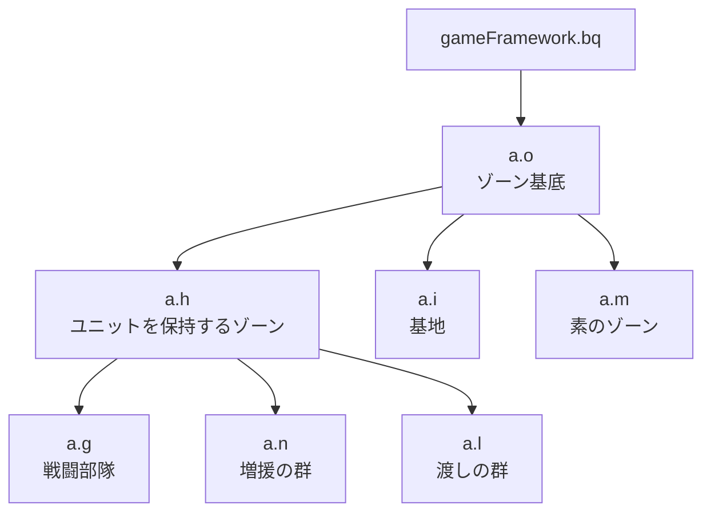

# 内蔵 AI

`com.corrodinggames.rts.game.a` パッケージ、すなわちゲームに同梱された AI プレイヤーの構造を記録する。部屋が `net.ap()` で作るのはこのクラスであり([05-match-control.md](05-match-control.md))、評価の相手も、アリーナで停止させている相手も、これである。

読者がこの文書を開く理由はたいてい一つである。**内蔵 AI の打ち回しを収集して、学習する方策の出発点にできるか。** 答えは「収集は容易であり、模倣はできない」であり、できない理由は観測可能性ではなく、**学習する三層がそもそもユニット命令を出さないこと**にある。先に構造を示し、最後にそれを論じる。

**この文書の記載はすべて逆アセンブル確認である。** 実行中のプロセスから AI の内部を読んだ確認は一つも無い。実行時に確かめてあるのは、部屋が作る AI が `com.corrodinggames.rts.game.a.a` であること、停止フラグ `aX` を立てると建設も攻撃隊の編成も止まること、難易度 3 の AI が放置されたプレイヤーをゲーム内 8 分で撃破することの三つで、いずれも [05-match-control.md](05-match-control.md) に記した別の測定である。

## パッケージの構成

`com.corrodinggames.rts.game.a` に 15 クラス、`a` の内部クラス `a$1` から `a$13`、サブパッケージ `com.corrodinggames.rts.game.a.a` に 7 クラスがある。AI の思考はこれで全部である。

**`a` は `public final class com.corrodinggames.rts.game.a.a extends com.corrodinggames.rts.game.n`、すなわち AI プレイヤー自身である。** クラスファイルは 44,758 バイトで、次に大きい基地クラス `i` の 29,506 バイトと合わせて、パッケージのバイトの 4 分の 3 を二つのクラスが占める。残りは小さい。

| クラス | 役割 |
| --- | --- |
| `a` | AI プレイヤー本体。周期の駆動、ゾーンの生成、ユニットの割り当て |
| `o` | ゾーンの基底。`gameFramework.bq` の派生 |
| `h` | ユニットを保持するゾーンの基底 |
| `i` | 基地。建設と生産の主体 |
| `g` | 戦闘部隊 |
| `n` | 増援を溜めて送り出す群(役割の名前は推定) |
| `l` | 建設地へ渡せない建設機のための群 |
| `m` | フィールドを持たない素のゾーン |
| `d` | ユニット種別の分類と重み付き抽選 |
| `e` | 種別と重みの対 |
| `c` | 周期ごとのユニット数のメモ |
| `f` | 静的補助のみ。フィールドを持たない |
| `j` `k` `b` | enum。後述 |
| `a/a` `a/b` `a/c` `a/d` | 能力モジュール |

### ゾーンの階層

`o` が持つのは `public int Q`(id、静的カウンタ `a.aI` の前置インクリメントで採番)、`protected final a R`(所有者)、`public float S` `public float T`(位置)、`public float U`(半径)、`public boolean V`(除去済み)である。**登録は自動である。** コンストラクタ `o(a)` が `this` を所有者の `R.bm`(`ConcurrentLinkedQueue`)と `R.bn`(`ArrayList`)の両方へ入れ、`o.p()` が両方から外して `V` を立てる。AI の周期はこの `bm` を走査して回っている。

`h` はメンバの `ArrayList F` と `ArrayList G` を持ち、`h.a(y)` が前の群からユニットを外して `F` に入れ `y.aB` に自分を書き、`h.b(y)` が外して `aB` を消す。**ユニット側の `aB` は「今どの群に属しているか」の逆参照である。**

ゾーンの種別 id は保存と復元の両方向で確定している。`a.l(int)` が 1 を `i`、2 を `g`、3 を `n`、4 を `m`、5 を `l` に写し、0 を受け取ったときは `Found zone type 0, loading PlainZone instead` と記録して `m` を作り、それ以外では `Unknown zone type:` を投げる。書き出す側の `a.a(j.as)` は同じ id を instanceof の連鎖で出す。**`m` が PlainZone と呼ばれているという根拠はこのログ行だけである。** `m` にはフィールドも文字列も無い。

`i`(基地)は `o` に 34 個のフィールドを足す。周期が溜める滞留時間 `float a`、状態 `j b`、種別 `k c`、建設の遅延 `e`、ユニットの集合 `p` `q` `r`、直前に試した建物とユニットの記録、建設機の一覧 `N` などである。三つの enum の定数名は `Enum.<init>` に渡る文字列としてそのまま残っており、推定ではない。**`j` は Pre / Prepare / Active、`k` は Main / ResourceOutpost / ForwardOutpost、`b` は include / exclude である。**

`g`(戦闘部隊)のフィールド名は、デバッグ表示の平文ラベルから直接読める。メンバ `F` と目標人数 `A`(`\nUnits:` と `/` で並べて表示される)、直近の行動 `b`(`\nlast action:`)、集結の状態 `q` `r` と時計 `u`、攻撃の遅延 `l`、経過 `o`、海の部隊か `B`、VIP 護衛か `c`、輸送を要するユニット `G`、共通の移動タイプ `E`(`\ncommonMovement:`)である。`h` が真かどうかで守備型と攻撃型が分かれ、表示は `Defensive Type` と `Attack Type` になる。直近の行動の文字列は 11 種あり、`attacking main target`、`attacking target`、`cannot reach main target`、`defending base`、`fighting attacker`、`flight from attacker`、`moving to new base`、`random move`、`random move: bad target`、`random move: no linked base`、`Not staging due to damage` である。**AI が何をしているつもりかは、この 11 種で言い尽くされている。**

**部隊の状態は保存に全部は載らない。** `g.a(j.as)` が書き出すのはメンバ、目標人数、種別、VIP、いくつかのフラグまでで、現在の主目標 `w`、集結のフラグ、各種の時計、連結した基地 `k`、移動タイプ `E`、直近に殴ってきた相手の対は載らない。主目標は周期をまたいで生き残る(`g.e(float)` は `w` が null か、死んでいるか、集結の目標が未定のときにしか引き直さない)が、**保存と読み込みはまたがない**。セーブから AI の意図を復元することはできない、ということである。

`o` には静的な `ArrayList W` がある。`o.e(units.as)` が配置探索の作業用に使う共有の器で、**全 AI プレイヤーで共有されている。** 将来この経路を並行に走らせるなら、ここが最初に壊れる。

### ユニット種別の分類

`a` の 13 個の内部クラスは、いずれも抽象クラス `d` を継承した種別の分類器であり、`a` のコンストラクタで生成されて `br` から `bD` のフィールドに入る。名前は enum ではなく `d` に渡される文字列で、`a$1` から順に `attackingUnitsLand`、`harvesterUnits`、`extractorUnits`、`buildingFactories`、`buildingFactoriesForBuilders`、`attackingUnitsHover`、`attackingUnitsAir`、`attackingUnitsWater`、`buildingUnits`、`transportUnits`、`transportUnitsFlying`、`transportUnitsNonFlying`、`builderUnits` である。

`d` は分類であると同時に**重み付きの抽選器**である。`public abstract boolean a(units.as)` が種別を選り分け、`d.b()` がその述語と重みから `e`(種別と重みの対)の一覧を組み立て直し、`d.a()` が写しを `java.util.Collections.shuffle` で混ぜる。`AI: rebuildUnitMix: no units in unitMix:` と `AI: getRandomUnitType: no units in unitMix:` の 2 本のログがここにある。**内蔵 AI が何を作るかは、この重みの表と、基地 `i` の建設順で決まっている。**

サブパッケージ `a/a` は能力モジュールである。抽象クラス `a/a` が `abstract b a()` と何もしないフック群を持ち、`a/b` は unknown / nuking の 2 定数の enum、`a/c` は条件を満たすユニットの集合を保持し、`a/d` が核の発射装置(`nukeLauncher`、`nuke: launching at:`、`nuke: no target`、`nuke: not ready`、`ai nuke building`)である。**jar に入っている具体のモジュールはこの核の 1 個だけである。** モジュールは `a.bJ` に入る。

デバッグ表示 `a.a.i(float)` は、公開の静的フラグ `a.as` とエンジンの `l.bl` が両方立っているときだけ動き、上記のラベル付きの状態を画面へ描く。**描くだけで、文字列を返す口は無い。** 上に挙げたフィールド名の根拠はほぼすべてこの表示であり、逆に `o` の全フィールド、`h.F` と `h.G`、`g.w` と `g.k` などは呼び出しの文脈からの**推定**である。

## いつ考えるか

入口は `com.corrodinggames.rts.game.a.a.a(float)` で、`com.corrodinggames.rts.game.n.a(float)` の上書きである(先頭で `invokespecial` により親を呼ぶ)。ここへ来る経路は、静的な `game.n.f(float)` がプレイヤー配列 `n.as[]` を走査して各プレイヤーの `a(delta)` を呼び、その `n.f(float)` は jar 全体で `game.i.a(float)` の 1 箇所からしか呼ばれない。**つまり AI の思考はゲームの 1 論理ステップの内側にあり、[01-internals.md](01-internals.md) の delta 駆動の上に乗っている。** 別スレッドは無い。

### 三つの周期

本体は同じ形をした 3 組の累算器である。

| 閾値 | 累算器 | ゲーム内時間 | 何をするか |
| --- | --- | --- | --- |
| 25 | `aP` / `aQ` | 0.417 秒 | 全基地に滞留時間を配り、最も滞留した 2 基までを処理する |
| 80 | `aL` / `aM` | 1.333 秒 | メモの消去、モジュールの `a(float, a)`、群の `h.c(delta)`、境界処理、戦闘部隊の生成 |
| 250 | `aN` / `aO` | 4.167 秒 | メモの消去、モジュールの `b(float, a)`、全ユニットの基地への割り当て、スタンスの発行、前哨の生成、群の `h.b(delta)` |

3 組とも `acc += delta; if (acc > T) { acc -= T; if (acc > T) acc = T; if (acc < -1) acc = -1; 仕事; }` の形である。**引き算であって代入でないので位相が流れない**うえ、繰り越しが 1 周期で頭打ちになるので、**実時間の詰まりが処理の連発に化けない。** 閾値がゲーム内時間であることは AI 自身の補助メソッドから確定する。`j(F)` が `delta / 60 * 1000`(ミリ秒)、`k(F)` が `delta / 60`(秒)であり、`units.h$22` が `a.a.bG / 60` を残り秒数として表示する。

25 の周期は、全基地の `i.a` に経過を足したあと、**ちょうど 2 回**ループして、そのつど `i.a` が最大の基地を選ぶ。ただし処理するのはその値が 50 に達している基地だけで、処理したら `i.a` を 0 に戻す。**基地が 3 つ以上あると、この周期は設計として詰まる。** 最も滞留していない基地が順番を取れないことは起こりうる。

80 の周期と 250 の周期は、どちらもモジュールを回すが**別のメソッドを呼ぶ**。80 が `a(float, a)`、250 が `b(float, a)` で、基底ではどちらも空である。jar にある唯一の具体モジュールである核の発射装置は `b(float, a)` だけを上書きしているので、**核の思考は 1.33 秒の周期ではなく 4.17 秒の周期で動く。**

基地の生成も両方の周期に散っている。250 が構築するのは資源前哨(半径 360)と前線前哨(半径 310)の 2 箇所だけで、**主基地を含む 5 箇所は 80 の周期にある。**

### 五つの早期脱出

`a(float)` は累算器へ進む前に 5 回引き返す。公開の boolean `aX` と `aZ` はそのうちの 2 つにすぎない。

| 条件 | 意味 |
| --- | --- |
| `aX` | 停止。本プロジェクトがアリーナで立てているフラグ |
| `aZ` | 停止 |
| `l.bX.B && !l.bX.C` | ネットワーク側の状態。意味は未確定 |
| `l.cb.j()` | キャンペーン/リプレイ側の状態。意味は未確定 |
| `bG > 0` | 一時停止の時計。`bG -= delta` して戻る |

**`bG` は AI パッケージの外から書かれる。** `appFramework.i` が `Float.MAX_VALUE` を書いて AI を切り、0 を書いて戻す。`units.h` が 0 と 10800(= ゲーム内 180 秒)を往復させる一時停止の操作を持ち、`units.h$22` がその残りを秒で表示する。**「AI がいつ考えているか」を外から論じるものは、この時計を勘定に入れなければならない。** なお 3 つ目の公開 boolean `aY` はこの早期脱出には入っていない。読まれるのは `l(float)` と `a.i.d(float)` で、立っていると基地の処理の一部が飛ぶ。

### プレイヤーごとのずらしはすぐ崩れる

`a.av()` はコンストラクタから 1 回だけ呼ばれ、プレイヤーの枠番号 `k` に応じて位相をずらす。`aL = 100 + 9k`、`aN = 202 + 19k`、`aP = 50 + 2k`、加えて前哨の時計 `aW = 4200 + 5k`、`aT = 3500 + 5k`、`aU = 7500 + 5k` である。**意図は明らかに、全 AI が同じフレームに同じ重い処理をしないようにすることである。**

**ところが 25 の周期のずらしは 2 ティックで消える。** delta が 1 のとき、`aP = 50 + 2k` は最初のティックで発火し、引き算のあと `26 + 2k` になり、繰り越しの頭打ちで**どの `k` でもちょうど 25.0 に潰れる**。次のティックで全員が再び発火し、以降は全 AI が同一のフレームでこの周期を回す。80 の周期のずらしは枠 6 までは生き残り(`aL` が 21、30、…、75 に落ちる)、枠 7 以上では 80 に潰れる。250 のずらしは形を変えて残る。**8 インスタンスの実時間を見積もるときに、AI の負荷が均されているという前提は置けない。**

## 何を発行するか

### 取得が発行である

**AI はコマンドオブジェクトを一度も生成しない。** `com.corrodinggames.rts.game.a` の全 35 クラスとサブパッケージを通して `new com/corrodinggames/rts/gameFramework/e` は 1 つも無い。jar 全体でも `e` が確保されるのは 3 箇所だけで、いずれもフレームワークの内部である。

AI が使う取得の形は `l.B().cf.a(this)` ちょうど 1 種類で、26 箇所に現れる(`a.a` に 9、`a.i` に 7、`a.n` に 7、`a.g` に 3)。引数は必ず AI プレイヤー自身である。そして `gameFramework.c.a(n)` は 2 命令で `c.b(n)` へ委譲するだけであり、**`c.b(n)` は [04-actions.md](04-actions.md) に記した「取得が発行を兼ねる」あの工場そのものである。** 新しい `e` を作り、チームと現在時刻を書き、`e.l()`(失敗すると `Command failed prepareAndCheckOnServer()` を記録する)を呼び、待ち行列へ積む。

**`c.a(n)` を使うのは AI だけである。** jar 全体でこの入口の呼び出し元は `a.a` `a.g` `a.i` `a.n` の 4 つに限られ、それ以外はすべて `c.b(n)` を直接呼ぶ。その中には `l.bS` として保持される操作系 `gameFramework.f.g` が含まれ、そこからは move、attackMove、patrol、guard、attack、build、repair、reclaim、loadInto、loadUp、stop と特殊アクションという、プレイヤーの語彙が丸ごと出る。**つまり内蔵 AI の命令は、プレイヤーの命令と同じ工場で作られ、同じ待ち行列に、同じ形で積まれる。** 後で `c.d()` / `c.e()` がそれをロックステップの層 `l.cb.a(e, tick)` へ渡し、`e.k()` で適用する。その時点で両者は区別できない。

対象ユニットの付け方も 1 種類で、`e.a(units.y)` が 26 箇所、`e.a(java.util.AbstractList)` が 1 箇所である。後者も中身は前者のループにすぎない。

**エンジンは、AI が他人のユニットへ命令することを名指しで計測している。** `e.a(units.y)` は null に対して `unit cannot be null` を投げ、コマンドのチームがそのユニットを所有していないとき `CommandController` のタグで `Warning AI: <n> gave an order to unit with team: <n> type: <name>` を記録する。

### 発行する命令の種類

`e` のどのメソッドを呼んだかは、`units.au` を経て enum `units.av` の定数へ解決できる。定数名は平文で残っている([04-actions.md](04-actions.md))。

| 命令 | AI が呼ぶ `e` のメソッド |
| --- | --- |
| move | `a(float, float)` |
| attackMove | `b(float, float)` と `a(float, float, boolean)` |
| attack | `a(am)` と `a(am, boolean)` |
| build | `a(float, float, as, int)` |
| repair | `b(am)` |
| reclaim | `d(am)` |
| loadInto | `e(am)` |

**`guard`、`guardAt`、`patrol`、`loadUp`、`unloadAt` は一度も出さない。** `e` にはいずれも設定口があるにもかかわらず、である。

命令の種別に還元されない積荷が 3 つある。**特殊アクション**は `e.a(units.a.c)`(5 箇所)と `e.a(units.a.c, PointF, am)`(2 箇所)で、実行時に `y.a(a.c)` が各ユニットについて解決し、見つからなければ `Could not find specialAction:` を記録する。生産と建設はこの経路である([04-actions.md](04-actions.md))。**交戦スタンスの変更**は `e.a(units.a)` が 1 箇所、`a.a.m(float)` すなわち 250 の周期にあり、実行時に `y.P` へ代入される。**停止**は `e.h()` が 2 箇所、どちらも `a.a.n(float)` にあり、対象ユニットの `y.az()` を呼んで `y.R` を消す。

### 部隊は 1 コマンドで動く

**戦闘部隊は、何をするにも部隊全体で 1 個のコマンドしか作らない。** `g` の発行箇所は 3 つで、いずれも「1 回の `l.B().cf.a(this.R)` → メンバの追加 → 行き先か目標を 1 つ指す呼び出し 1 回」という形である。

- `b(float)` の `fighting attacker`: 条件で絞ったメンバを 1 体ずつ追加し、最後に `cmd.a(x, y, false)` を 1 回。
- `c(float)` の `defending base` / `random move` / `moving to new base`: 距離と手空きで絞って 1 体ずつ追加し、最後に `cmd.a(S, T)` か `cmd.b(S, T)` を 1 回。
- `e(float)` の `attacking main target`: 到達可能なメンバを新しい `gameFramework.utility.m` に集めて `cmd.a(AbstractList)` で一度に渡し、8 割の確率で `cmd.a(w.eo, w.ep, true)`、残りで `cmd.a(w, true)`。

**渡しているのは `this.F` そのものではない。** 3 箇所とも絞り込みが入っており、最後の 1 箇所で渡るのは新しく作られた部分集合である。この区別は「AI は部隊をひとまとめに動かす」という結論を変えないが、観測から部隊の構成を読もうとするなら効いてくる。

**ここが後段の議論の要点である。** 部隊についての AI の決定は、1 回の命令で、行き先か目標を 1 つ指すことに尽きる。ユニットごとの操作は無く、隊形も無く、射程差の駆け引きも無い。**そこから先はエンジンの `attackMove` と自動交戦が担っている。**

## コマンド経路の外に何を書くか

「AI の振る舞いはコマンドとしてのみ観測できる」は、正確には成り立たない。**書き込みは存在する。** ただしその中身を見ると、どれも盤面の状態ではない。

`putfield` で AI 以外のオブジェクトに書かれるフィールドは、パッケージ全体でちょうど 4 つである。`units.y.aB`(所属する群、7 箇所)、`units.y.aC`(所属する基地、2 箇所)、`units.y.aD`(3 箇所)、そして `bD`(2 箇所)。**`bD` は `units.am` に宣言されているが、バイトコードの参照は `units/y.bD:Z` である**(javac が式の静的型を出すため)。`units/am.bD` で探しても見つからないので、再検証する人は注意が要る。この 4 つは jar 全体で AI からしか読み書きされない。**位置・体力・命令・クレジット・チームへ書く `putfield` は、AI パッケージに一つも無い。** 498 個の `putfield`/`putstatic` を 218 個の対象について数え、AI 自身のクラスの外に出るのはこの 4 つと `android.graphics.PointF.a` / `.b` の 10 箇所(いずれも新しく確保した局所オブジェクトか AI 自身が持つ `PointF`)だけであり、AI 以外のクラスを対象とする `putstatic` は 0 である。

**むしろ書き込みはエンジンの補助メソッドの側から起きる。** 三つある。

1. `com.corrodinggames.rts.game.b.b.a(int,int)` と `.a(float,float)`(座標変換)を `l.bL` すなわちマップに対して 6 箇所から呼び、そのつどマップの作業用フィールド `T` と `U` が書き換わる。
2. `com.corrodinggames.rts.game.units.d.d.a(as, x, y, team)` を `a.o.e(as)` から呼ぶ。これは静的な `units.am.bF` から**種別ごとの見本ユニット**を取り出し、その位置とチームを書き換えてから設置判定を走らせる。共有の見本が、建設地の探索のたびに書き換えられている。
3. `gameFramework.f.g.a(y, x, y, r1, r2, boolean, ArrayList, am)`、すなわちプレイヤーの操作系が使うのと同じ設置探索を、やはり `a.o.e(as)` から呼ぶ。渡す見本ユニットの位置を候補タイルごとに上書きし、通常の出口で元に戻す。

**どれも見本であって盤面のユニットではないので、実害は無いと考えられる。** ただし「AI はコマンド以外に一切触らない」と書くと literal な監査に耐えない。触るのは**盤面ではなく作業用の器**である、というのが正しい言い方である。

**AI が読み書きするコレクションは全て AI 自身のものである。** 全ユニットの一覧 `units.am.bE` は走査されるだけで、変更されない。

## 難易度

### 二つの述語

難易度は `game.n.C()` から取り、`a(float)` の先頭で `bF` に 1 回だけ写す。**そこから先、AI が難易度を見る口は 2 つの述語しかない。**

- `ac()` は `ag() == 3 || ag() > 300`
- `ad()` は `ag() >= 2`

`ag()` は `bF` を返すだけであり、`ac()` と `ad()` 以外から呼ばれない。`C()` は AI パッケージ全体で上記の 1 箇所からしか呼ばれない。文字列 `aiDifficulty` は AI パッケージに現れない。**したがって難易度の影響は、この 2 つの boolean を通る分がすべてである。**

**難易度は別の戦略も別の状態機械も選ばない。** 呼び出し箇所は 8 つあり(`a.a` に `ac()` が 4 つ、`a.i` に `ac()` が 3 つと `ad()` が 1 つ)、**すべてが数・重み・時計の書き換えである。** 別の分岐へ入るもの、別のゾーン種別を作るもの、別の局面 enum へ移るものは一つも無い。

なお `C()` はプレイヤーごとの上書き(`z`、null 可の `Integer`)を尊重し、元の値と食い違うときにログを出す。**`ag()` が返す値がロビーの設定と同じであるとは限らない。**

同じ場所で読まれる似た述語と取り違えないこと。`ae()`/`af()` は `aJ` のビット 0、`ah()` は `l.bU.A.i > 3000` というユニット数の閾値、`ai()`/`aj()` はそれとマップの連結性 4 つの組み合わせである。`a.i.v()` は `ac()` のすぐ隣で `ah()` `ai()` `aj()` を呼んでいる。

### 難易度が変えるもの

| 場所 | 述語 | 変化 |
| --- | --- | --- |
| `a.a.n(float)` 陸の部隊 | `ac()` | 目標人数 `g.A` が 8 → 10 |
| `a.a.n(float)` 主攻部隊 | `ac()` | 目標人数が 7 → 14。部隊の通し番号 `au` が 25 に達していれば 18 |
| `a.a.n(float)` 海の部隊 | `ac()` | 目標人数が 5 → 10 |
| `a.a.m(float)` | `ac()` | 前哨の時計 `aT` から追加で `4 * delta` を引く。資源前哨の設置が 5 倍速くなる |
| `a.i.v()` | `ac()` | 手空きユニットの上限が 12 と 50 から 16 と 65 へ。**建設試行の上限ではなく、これ以上手空きが居るなら生産を止めるという閾値である**(比較先は AI 自身の未配属ユニット数 `bc` と `ba`) |
| `a.i.d(float)` | `ac()` | 次の建物までの遅延 `e` が `270 + (Q % 15)` から `190 + (Q % 15)` へ。`Q` はゾーン id なので、基地ごとの位相ずらしが別途乗っている |
| `a.i.c(units.as)` | `ac()` | 対空砲台(`units.ar.g`)の重み。通常は数が 3 未満なら `0.3/n`、4 未満なら `0.02/n`。高難易度では 4 未満まで `0.3/n` のまま。**4 基目を 20 分の 1 の優先度ではなく全力で買う** |
| `a.i.c(units.as)` | `ad()` | 実験機工場(`units.ar.G`)の重み。所持クレジットが 15000 超で 0 基なら 0.04、55000 超で 1 基なら 0.03 |

**最も大きいのは攻撃部隊の人数である。** 高難易度の AI は、違う戦い方をするのではなく、**より大きな塊で来る。**

### 最大の効果は AI パッケージの外にある

`game.n.E()` は難易度 `d` から収入の倍率を返す。`d > 0` で `1 + 0.4d`、`d <= 0` で `1 + 0.3d`、さらに `d == 3` のとき 1.5 を足し、下限 0.1 で切る。`game.n.b(float)` が受け取る資源のすべてにこれを掛け、掛けるかどうかを決める `w` は `game.n` のコンストラクタで `this instanceof com.corrodinggames.rts.game.a.a` として設定される。**すなわちこの倍率は AI プレイヤーにしか適用されない。**

| 難易度 | -2 | -1 | 0 | 1 | 2 | 3 |
| --- | --- | --- | --- | --- | --- | --- |
| 倍率 | 0.4 | 0.7 | 1.0 | 1.4 | 1.8 | 3.7 |

**Impossible の AI は 3.7 倍の資源を集めている。** 呼び出し元は採掘系のユニットクラス `units.d.e` `units.d.g` `units.d.h` と `units.custom.d.b` である。試合設定の収入倍率 `config.h`([05-match-control.md](05-match-control.md))は全員に掛かるものなので、これとは別である。

**この一点が、内蔵 AI を基準線として使うときの前提を全部書き換える。** 難易度 0 の AI と難易度 3 の AI は、同じ規則を違う量の資源で走らせた二つであり、後者の建設順の時刻はこちらの経済が再現できるものではない。

## 打ち回しは収集できる

構造の側の話は以上である。ここから問いに答える。

**収集は既にできる。** [../system/02-interface.md](../system/02-interface.md) のユニットブロックは、可視の全ユニットについて**現在の命令の種別**(`y.ar()` の `au.a` を `av` 中の位置で表す)、**待機中の命令数**(`y.av()`)、**攻撃目標の ID**(`y.ab()`)、**交戦スタンス**(`y.P`)を毎戦術周期で運んでいる。内蔵 AI のユニットもこの経路にそのまま乗る。**新しい配管は要らない。要るのは霧を切ることだけである**(可視のときだけ `am.d(n)` を通す一箇所の切り替えであり、全知にすればそのまま出る)。

**足りないものが一つある。命令の目的地である。** 座標は観測に載っていない。命令オブジェクト `game.units.au` のフィールド `e` と `f` がそれで、`au.a(float, float)` が種別と一緒に書き込む。読み出しは `au.g()` / `au.h()` で、**命令が対象ユニットを持つ場合はその対象の現在位置を返し、持たない場合に `e` / `f` を返す**(逆アセンブル確認)。ユニットブロックに 2 欄足せば済む。

**別の経路もある。** AI のコマンドはプレイヤーのものと同じ待ち行列に積まれるので、フレームの中でその一覧を読めば、AI が出した命令そのものが、対象ユニットの一覧も目的地も揃った形で取れる。**これは実装されていない。** 上の 2 欄より情報は多いが、キューの構造に依存する分だけ脆い。

## しかし模倣の出発点にはならない

収集できることと、それを教師にできることは別である。**学習する三層は、そもそもユニット命令を出さない。**

**行動空間が噛み合わない。** 戦術層が選ぶのは部隊ごとに 8 つの逸脱(`hold` `withdraw` `focus` `spread` `kite` `withdraw_far` `focus_threat` `close`)のうち 1 つであり、既定は「契約の目標領域へ、契約のスタンスで `attackMove`」である([../system/03-script-policy.md](../system/03-script-policy.md))。内蔵 AI には**部隊も契約も、逸脱すべき既定も無い。** `g` は部隊のように見えるが、それは上位から降ってきた契約ではなく AI 自身の内部状態であり、目標人数も目標も AI が自分で決めている。したがって AI の打ち回しをこの行動空間で標識するには逆モデルが要る。そして**手で書いた逆モデルは、「何を逸脱と呼ぶか」を決める規則の梯子そのものである。** 出てくるラベルはその梯子の意見であって、AI の意見ではない。**そのうえプロジェクトは、まったく同じ形式のラベルを、正確に、無料で既に得ている。** 決定器を渡さない戦術層は継承したスクリプトの規則に落ち、選んだ逸脱を観測と対にして書き出す([../system/04-learning.md](../system/04-learning.md))。推定を挟まない教師が既にあるところへ、推定を挟む教師を足す理由が無い。

**特徴の半分近くが契約から来る。** 58 次元のうち、任務状況 5 と任務種別 6 の one-hot、予算の消化率、許容損害と現有価値の比、期限までの残り、任務の経過で 15。契約が持つ交戦スタンス 7 と、契約が指す目標領域について測る 5 を含めれば 27 で、**ほぼ半分である。** 内蔵 AI にはこれらが定義されない。当てはめるにはでっち上げるしかなく、**でっち上げた特徴で訓練した方策は、でっち上げの方を学ぶ。**

**盤面も違う。** 戦術層を学習させるのは交戦アリーナであり、そこには経済も開始ユニットも無く、**内蔵 AI は意図して停止させてある**([../system/04-learning.md](../system/04-learning.md)、[05-match-control.md](05-match-control.md))。停止を入れる前に測った数字はすべて、誰も打つつもりのなかった試合についての数字であった。**内蔵 AI が打てる盤面ではない**ということである。

**そして、うまく模倣できたとしたら、それは最悪の結果である。** 上に見たとおり、AI がユニット水準でしていることは、部隊全体へ 1 個の `attackMove` か `attack` を投げ、あとをエンジンに任せることである。**それは戦術層が逸脱する対象である既定そのものである。** 忠実に写した方策は `hold` を選び続ける層になる。[../system/04-learning.md](../system/04-learning.md) が模倣の報告で「教師の行動分布と網の行動分布を並べる」ことにしているのは、まさにこの見分けが付かなくなる事故のためである。

## 内蔵 AI が実際に使えるところ

模倣ではないところに、三つある。

**試合まるごとの固定の相手として。** これは既にそう使っている。留意すべきは二点で、**難易度は試合開始後には反映されない**こと([05-match-control.md](05-match-control.md)、実行時確認)と、**難易度を上げても相手は別の戦い方をしない**ことである。上に見たとおり難易度が変えるのは部隊の大きさ・前哨の速さ・いくつかの重みと時計、そして AI 専用の収入倍率だけである。**カリキュラムとして難易度を上げることは、別の相手を出すことではなく、同じ相手を大きくすることである。**

**実際の試合に現れる編成の分布として。** アリーナは片側の戦力を**価格だけを見て**引いており、その質は測っていない([../system/04-learning.md](../system/04-learning.md) の未検証のもの)。内蔵 AI は試合を通して実際に軍を組む。何を組むかは `d` の重み付き抽選と `i` の建設順で決まり、**その結果は観測の種別番号を数えるだけで取れる。** ここで要るのは「良い編成」ではなく「実際の試合に現れる編成」であって、アリーナが不足しているのはまさにそちらである。**ただし AI の混合は AI の意見であって最適解ではない**し、収入倍率のせいで**難易度ごとに別の分布になる。** 収集するなら難易度を明記して取る。

**経済スクリプトのビルドオーダの時刻の較正として。** [../system/03-script-policy.md](../system/03-script-policy.md) の内政層は順序と条件を決めているが、**時刻を決めていない。** 2 基目の採掘施設、最初の工場、2 基目の工場にゲーム内何分で到達するかは、内蔵 AI を観測すれば基準線が取れる。**取るなら難易度 0 である。** そこだけが `E()` の倍率が 1.0 であり、こちらの経済と同じ足場に乗る。難易度 1 以上の AI の時刻は、こちらが再現できない資源で立てられたものである。

## 未確認のもの

正確に書く。

**この文書は逆アセンブルだけで書かれている。** 実行中のゲームから AI の内部を読み、ここに書いた周期・フラグ・命令が実際にそのとおり動くことを確かめた実行は無い。

**命令種別の 2 つで、照合が割れた。** `e.d(am)` と `e.e(am)` について、一方の照合は `au.f` / `au.g` を経て reclaim と loadInto に解決したと報告し、もう一方は touchTarget と follow であると報告した。**前者を採った。** [04-actions.md](04-actions.md) の対応表(`d(am)` が reclaim、`e(am)` が loadInto、`touchTarget` と `follow` には対応する `e` のメソッドが無い)と一致するためである。実行時には確かめていない。

**`e.a(float, float, boolean)` と `e.a(am, boolean)` の boolean の意味。** `units.au.j` に入り、`gameFramework.ab.a(y, au)` が `ab.f` へ写す。部隊の命令か個別の命令かを示すと読めるが、バイトコードからは確定できなかった。

**`e.h()` と `e.a(units.a)` の消費側。** それぞれコマンドの `o` と `n` に入るところまでは確定しているが、実行時の意味を決める側は AI パッケージの外にあり、追っていない。`a.a.c(y)` がどのスタンスをどんな条件で選ぶかも分かっていない。選ばれた値が `y.P` に着くことだけが確定している。

**早期脱出のうち 2 つのゲートの意味。** `l.bX.B` と `l.bX.C` は `gameFramework.j.ad`(ネットワーク管理)の素の boolean、`l.cb.j()` は `ba.P && ba.u` である。ゲートが存在し、AI の全処理に先立つことは確定しているが、**どのモードで AI が黙るのかは言えない。**

**`n.f(float)` が `a.a.a(float)` への唯一の経路かどうか。** その経路と、`a(float)` が親を呼ぶことは確認したが、`game.n` の参照に対する仮想呼び出しが他に無いことを網羅的には示していない。

**`ac()` の `ag() > 300` が到達可能かどうか。** `C()` はプレイヤーごとの上書きを返しうるので、マップや mod のデータがそのような値を供給する余地はあるが、上書きがどこで埋まるかは追っていない。

**AI の書き込みがロックステップで安全かどうか。** `y.aB` / `aC` / `aD` / `bD` を AI 以外のどこも読まないことは jar 全体で確かめてあるが、**AI 自身が全ピアで同一に走るかどうか**はバイトコードからは決まらない。関連して、AI パッケージには `java.lang.Math.random()` の呼び出しが 6 メソッド 8 箇所(`a.a.ar()`、`a.a.as()`、`a.a.at()`、`a.g.a(am)` の後退点、`a.o.w()`、`a.o.e(as)` の建設地選択 2 箇所)、`a.a.m(float)` に `new java.util.Random()` が 1 箇所、`d.a()` に `java.util.Collections.shuffle` が 1 箇所ある。**共有の乱数発生器 `gameFramework.f` は再種入れの口を持つがこれらは持たない。** 実際に desync を起こすかは実行時に見るしかなく、[05-match-control.md](05-match-control.md) の「同一の種で試合は再現しない」ことを思えば、切り分けは容易ではない。

**`m` が本当に PlainZone と呼ばれているか、`c` の三つの HashMap がそれぞれ何を数えているか、`h.G` が抽象レベルでも輸送を要するユニットを意味するか。** いずれも根拠は 1 本のログ行か命名の一致だけである。

**AI が読み取りに見える呼び出しの奥で何かを書いていないか。** `y.b(as,boolean)`、`y.d(am,boolean)`、`a.s.a(am,boolean)` などをいくつか抜き取りで見て `putfield` が無いことは確かめたが、**AI が呼ぶ述語すべての推移閉包は見ていない。**
