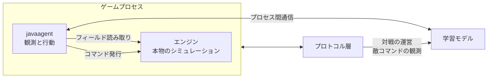

# 方式選定

RW-Intel は Rusted Warfare を機械学習でプレイするシステムである。学習モデル以前に、ゲームの状態をどう観測し、どう命令を出すかを決める必要がある。この文書はその選定結果と根拠を記す。

## 前提: マルチプレイは決定論的ロックステップ

Rusted Warfare のマルチプレイは決定論的ロックステップで動作する。ネットワーク上を流れるのはプレイヤーのコマンドだけであり、ユニットの座標も体力も資金も一切送信されない。全クライアントが同一の入力列から同一の計算を行い、同一の状態に到達するという前提で成立している。

エンジンの全メソッドが `strictfp` で宣言されていることが、この設計を裏付けている。浮動小数点演算の結果を全環境で一致させるための指定であり、決定論を意図的に維持している証拠である。

この帰結は重い。**通信を完璧に解析しても、得られるのは「誰がいつ何を命令したか」だけで、「今どこに誰がいて体力がいくつか」は原理的に得られない**。状態はネットワーク上に存在せず、各クライアントの計算結果としてのみ存在する。

## 検討した 3 方式

### プロセス内寄生

ゲーム本体のプロセスに `-javaagent` で入り込み、エンジンの内部状態を直接読み、コマンドオブジェクトを直接構築して発行する。

観測は完全である。シミュレーションは本物なので乖離が起きない。難点は難読化されたクラスとフィールドを解読する必要があることと、ゲームのバージョン更新で解読結果が無効になることである。

### 通信解析による独自クライアント

ゲームのネットワークプロトコルを解析し、自前のクライアントでホストに接続する。

プロトコル解析自体は難しくない。パケットは 8 バイトのヘッダ(長さと種別)で区切られ、コマンドの構造体は gzip 圧縮もされていない平文である([../game/07-multiplayer.md](../game/07-multiplayer.md))。しかし前述のとおり、ロックステップでは状態が線上に流れない。状態を知るには自分でシミュレートするしかなく、それは次項に帰着する。

### シミュレーションの自作

ゲームの計算部分を自前で再実装する。

ロックステップである以上、本家とビット単位で一致しなければならず、わずかなずれも即座に同期崩れを起こす。ユニット系だけで 642 クラスあり、移動、経路探索、射撃、投射体、爆風、建造、修理、輸送、ステルスの全てを、浮動小数点の演算順序まで含めて再現する必要がある。加えて地形、霧、トリガー、mod の `.ini` によるユニット定義の解釈も要る。実質的にゲームを難読化バイナリから作り直す作業であり、現実的ではない。

## 決定

**プロセス内寄生を主、通信解析を従とする。**

観測と行動はゲームプロセス内部から取る。通信解析は独自クライアントを作るためではなく、次の用途で併用する。

- 対戦の運営チャネル。自己対戦で複数プロセスを戦わせる際、ロビー操作、開始と終了の検知、即時リセット、乱数種の固定をプロトコル越しに行えば、ゲーム内部フックに全てを押し込むより疎結合で壊れにくい。
- 敵の意図の取得。ロックステップの性質上、敵のコマンドも霧を無視して全て自分に届く。反則級の情報だが、学習中の足場(価値関数の補助入力、報酬の整形)としては強力であり、最終的に切ればよい。

この非対称性には根拠がある。プロトコルはゲームのバージョンに紐づき、既知の解析実装は 1.14 世代のものである。一方でゲーム本体の jar は後述のとおりバイト単位で一致しており、内部フック側の解読結果はそのまま使える。壊れやすい側を従に置くのが妥当である。

2 プロセスを 1 つの試合に入れる対戦は、プロトコルを自前で話すのではなく、エンジン自身のホストと参加の経路をプロセス内から呼んで組む([../game/07-multiplayer.md](../game/07-multiplayer.md))。

## 根拠

### ゲーム本体の同一性

`game-lib.jar` は配布形態によらず同一である。Steam 版、Linux 版、そして既存の解析プロジェクト RWPP が解析対象として同梱しているものの MD5 はすべて一致する。

| 対象 | MD5 |
| --- | --- |
| `game-lib.jar`(Steam 版、Linux 版、RWPP 同梱) | `519bf498f5fe3b80acae40835b1e0599` |

バージョンは 1.15 build #28、Game Code 176、クラス数 1699。したがって RWPP が持つ難読化クラスの対応表はそのまま適用でき、プラットフォームを変えても解読結果は変わらない。違うのは同梱の JVM とネイティブライブラリだけである([../game/02-launch.md](../game/02-launch.md))。RWPP 自体は Compose 製の UI を必須とし画面なしでは起動しないため依存はせず、**解読辞書としてのみ参照する**。

### 既存サーバ実装が使えない理由

第三者製サーバ実装 RW-HPS は、当初この用途の候補だった。次の理由で除外した。

- 純粋なロックステップ中継であり、シミュレーションを一切行わない。保持する状態はロビー設定とプレイヤー情報のみで、ユニットの座標も体力も持たない。同期用の保存データは不透明なバイト列として中継するだけで、解析していない。
- 参照した版は古い fork である。

したがって状態を得る手段にはならない。ただしコマンド構造体の解析結果と、合成コマンドを他プレイヤー名義で注入する実例は有用であり、プロトコル層を実装する際の参考資料として扱う。

## 関連文書

この判断を前提として、ゲーム側の解析は [../game/](../game/) に、このプロジェクトの設計は同じ `project/` にまとめてある。全体の目次は [../README.md](../README.md) にある。

- ゲーム内部の構造とクラス対応は [../game/01-internals.md](../game/01-internals.md)
- 起動方法と速度制御は [../game/02-launch.md](../game/02-launch.md)
- この方式で実際に環境を組む手順は [02-runtime.md](02-runtime.md)
- 方式の妥当性を支える速度と並列数は [03-throughput.md](03-throughput.md)
