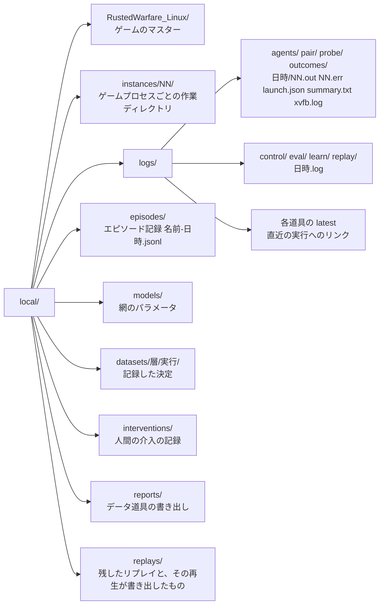
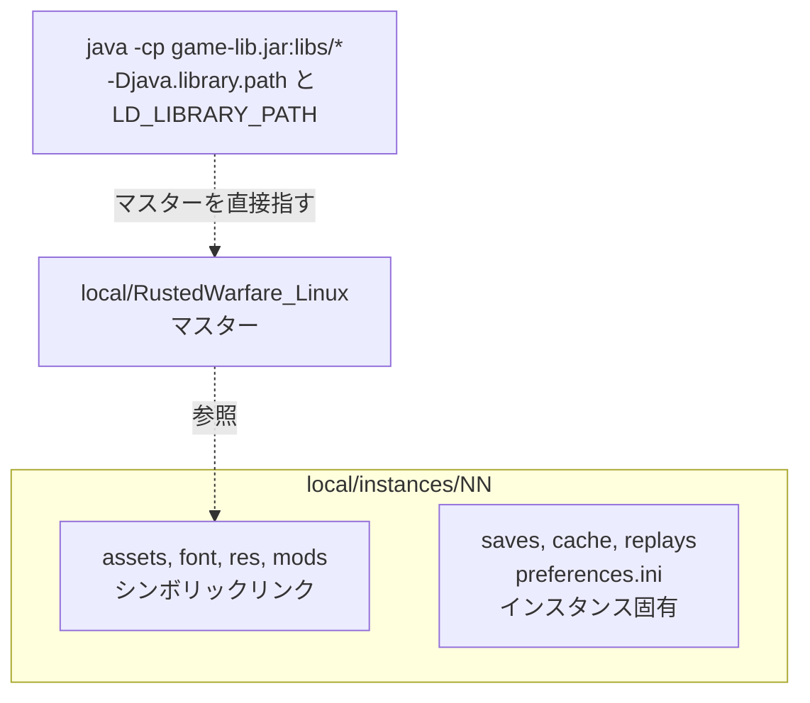

# 実行基盤

学習環境としてゲームを走らせるための構成と道具を記す。ゲーム側の起動引数や速度制御の仕組みそのものは [../game/02-launch.md](../game/02-launch.md) にある。

## 前提

実行環境は x86_64 の Linux である。ゲームの Linux 版は Java 8 の JRE を同梱しているが JDK は含まないので、エージェントのビルドには別途 JDK が要る。表示装置が無い環境でもゲームは OpenGL のウィンドウを要求するため、仮想ディスプレイ Xvfb と Mesa のソフトウェア描画を使う。

| 用途 | Ubuntu のパッケージ |
| --- | --- |
| エージェントのビルド | `openjdk-17-jdk-headless`(`--release 8` を扱える JDK 9 以降なら何でもよい) |
| 仮想ディスプレイ | `xvfb` `x11-xserver-utils` |
| OpenGL と X のライブラリ | `libgl1-mesa-dri` `libglx-mesa0` `libxrandr2` `libxcursor1` `libxxf86vm1` `libxi6` `libxtst6` |
| Python の仮想環境 | `python3-venv` |

```bash
sudo apt-get install -y openjdk-17-jdk-headless xvfb x11-xserver-utils libgl1-mesa-dri libglx-mesa0 libxrandr2 libxcursor1 libxxf86vm1 libxi6 libxtst6 python3-venv
python3 -m venv .venv
.venv/bin/pip install -r requirements.txt
```

`libxtst6` が無いと、同梱 JRE の AWT が読み込めずに LWJGL の初期化で `UnsatisfiedLinkError: libawt_xawt.so: libXtst.so.6` を出して止まる。LWJGL は画面のモードを `xrandr` コマンドの出力から読むので、`x11-xserver-utils` が無いと `LinuxDisplay.getAvailableDisplayModes` の `ArrayIndexOutOfBoundsException` で止まる。Python 側の依存は `requirements.txt` にあり、`torch` を使うのは `rwintel.learn` だけである。それ以外は標準ライブラリだけで動く。GPU の無い機材では、`pip install --index-url https://download.pytorch.org/whl/cpu torch` を先に済ませると、CUDA を含まない小さな `torch` が入る。ゲームを動かす機材(行動器)はこの CPU 版のままでよい。記録を読んで学習する機材(学習器、`python -m rwintel.learn offline`)には CUDA 版を入れる。`requirements.txt` より先なら `pip install --index-url https://download.pytorch.org/whl/cu130 torch` で入り、既に入っている `torch` は `--force-reinstall` を足すと置き換わる(uv では `uv pip install --reinstall-package torch torch --torch-backend cu130`)。`python -c "import torch; print(torch.cuda.is_available())"` が `True` を返せば `offline`、`clone`、`bench` の既定のデバイス(`auto`)がグラフィックスカードになり、ゲームを動かす実行も集合の網のファイルはカードで回す。学習器と行動器を同じ機材で回す `python -m rwintel.learn online` では、その機材に CUDA 版を入れる。CPU 版の機材で集合の網を打たせると CPU で回り、その旨の警告が 1 行出る。CPU 版の行動器には、集合の網から蒸留した平らな網を打たせる([08-learning.md](08-learning.md) の網の大きさ)。

## ゲームの配置

Linux 版の配布物 `RustedWarfare_Linux.zip` を `local/` に展開し、`local/RustedWarfare_Linux/` をマスターとして使う。別の場所に置く場合は環境変数 `RWINTEL_GAME` でそのディレクトリを指す。

```bash
unzip local/RustedWarfare_Linux.zip -d local/
```

マスターは読み取りしかされない。ゲームが書き込むもの(`preferences.ini`、セーブ、キャッシュ)はすべて後述のインスタンスディレクトリに入る。`jvm-linux/bin/java` に実行権限が付いていない展開の仕方をした場合は付け直す。

`local/` はバージョン管理の対象外である。ゲーム本体と、この機材で取った記録を置く場所だからである。

## `local/` の構成

実行が読み書きするものはすべて `local/` の下に入る。配置は `rwintel/paths.py` が一か所で決めており、どのモジュールも作業ディレクトリを基準にパスを解決しない。`RWINTEL_LOCAL` で `local/` 自体を別の場所へ移せる。



**実行ごとに別の名前で残し、上書きしない。** ゲームプロセスを起動する道具は `local/logs/<道具>/<日時>/` を新しく作り、各プロセスの標準出力と標準エラーを `NN.out` と `NN.err` に、起動した引数と環境を `launch.json` に書く。Python の実行ログは標準エラーと同時に `local/logs/<道具>/<日時>.log` へ書かれる。エピソード記録も既定では実行ごとに別のファイルになる。どの道具でも `latest` が直近の実行を指す。

## 並列実行のためのインスタンス

ゲームは作業ディレクトリに対して `preferences.ini` を書き、`saves`、`cache`、`replays` を使う。したがって同時に走るプロセスには別々の作業ディレクトリが要る。

インスタンスディレクトリ `local/instances/NN/` は次の形をとる。

- `assets`、`font`、`res`、`mods` はマスターへのシンボリックリンクである
- `saves`、`cache`、`replays` と `preferences.ini` はインスタンスごとの実体である
- ネイティブライブラリとクラスパスは置かない。起動時にマスターを直接指す



**ネイティブライブラリは `LD_LIBRARY_PATH` で解決させる。** `librocketConnector.so` は `libRocketCore.so.1` などに依存しており、その解決は JVM の `java.library.path` ではなく動的リンカが行う。公式の起動スクリプトが `LD_LIBRARY_PATH=.` を付けて自分のディレクトリから起動するのはこのためで、インスタンスから起動する場合はマスターのディレクトリを `LD_LIBRARY_PATH` の先頭に置く。これでインスタンスの実ディスク消費は設定とセーブの分だけになる。

インスタンスはゲームを起動する道具が必要な数だけ自動で作る。`instances` は明示的に作り直すときに使う。既存のインスタンスが別のマスターを指していれば、リンクを張り替える。

## 道具

| 道具 | 用途 |
| --- | --- |
| `python -m rwintel.runtime build` | エージェント(本体、計測用、実験用)をビルドする |
| `python -m rwintel.runtime instances` | インスタンスディレクトリを作る。`--force` で作り直す |
| `python -m rwintel.runtime run` | 制御プロセスとそこへ接続するインスタンスを一括で起動し、制御プロセスの終了とともにインスタンスを止める |
| `python -m rwintel.runtime agents` | 別に起動した制御プロセスへ接続するインスタンスだけを起動する |
| `python -m rwintel.runtime pair` | 対戦用のポートが空いていることを確かめてから、1 つの試合に入る 2 インスタンスを起動する |
| `python -m rwintel.runtime probe` | 計測エージェントでインスタンスを起動し、速度を集計する |
| `python -m rwintel.runtime outcomes` | 内蔵 AI 同士の対戦を多数のエピソード回し、勝敗と長さと価値差の分布を報告する |
| `python -m rwintel.runtime lab` | 実験用エージェントで、実験の台本ごとに 1 つのゲームを回す |
| `python -m rwintel.runtime timeline` | 実験の出力を、ユニットごとに状態が変わった時点だけに縮めて読む |
| `python -m rwintel.data regions` | マップを領域に切り出し、数と大きさを報告する |
| `python -m rwintel.data units` | 定義ファイル由来のユニット種別を一覧し、価格が戦闘力を代理するかを検査する |
| `python -m rwintel.replay inspect` | リプレイをゲームを起動せずに読み、プレイヤーごとの命令、ビルドオーダ、クレジットの推移をまとめる |
| `python -m rwintel.replay verify` | リプレイの解読を、そのリプレイを再生したゲームのログと命令ごとに突き合わせる |

```bash
.venv/bin/python -m rwintel.runtime build
.venv/bin/python -m rwintel.runtime probe --count 8 --seconds 90
```

以降の例では、venv を有効にして `python` と書く。

ゲームを起動する道具は前景に留まり、ゲームプロセスの面倒を見る。`--seconds` を過ぎたとき、Ctrl-C を受けたとき、SIGTERM を受けたとき、エラーで抜けるときのいずれでも、自分が起動した全プロセスグループに SIGTERM を送り、猶予の後に残ったものへ SIGKILL を送る。`--seconds` を省くと、ゲームが自分で終わるか止められるまで待つ。スクリプトの中でバックグラウンドに置いた道具を止めるときは SIGTERM を送る。非対話のシェルはバックグラウンドのジョブで SIGINT を無視させるので、そこへ送った SIGINT は届かない。起動の直後にすでに終了したプロセスがあれば、その終了コードと標準エラーの最後の行を報告する。既に他のゲームプロセスが走っていれば、計測を歪めるので警告する。

Python の二つのデータ道具はゲームを起動せずに動く。読むのはエンジンが読むのと同じファイルであり、追加の依存は無い。共通の読み取りは `rwintel/data` にある。`--json` を付けると `local/reports/` に書き出す。

## エージェントのビルド

同梱の JRE は Java 8u131 で、`javac` も `jar` も持たない。エージェントはシステムの JDK で `--release 8` を付けてコンパイルする。この指定は Java 8 のクラスファイルを出すだけでなく、Java 8 の API に存在しないものの使用をコンパイルエラーにする。JDK は `JAVA_HOME` があればそこから、無ければ `PATH` から探す。

どのエージェントも自分のソースに加えて `frame/` のフレーム層を含めてビルドする。フレーム層は Slick の描画層のインターフェースを実装するので、ゲームの `libs/slick.jar` をクラスパスに置いてコンパイルする。`build` もゲームの配置を必要とし、`--game` か `RWINTEL_GAME` で別の配置を指せる。

ゲームを起動する道具は、エージェントの jar が無いかソースより古ければ、起動の前に自動でビルドし直す。古いエージェントのまま走り続けることがない。jar は一時ファイルに書いてから置き換えるので、既に走っているゲームプロセスが読んでいる jar は壊れない。

## 仮想ディスプレイ

`-nodisplay` を付けてもゲームは 10x10 の OpenGL ウィンドウを作り、マップの読み込みにはそのコンテキストが要る([../game/02-launch.md](../game/02-launch.md))。ゲームを起動する道具は、実行ごとに専用の Xvfb を `-displayfd` で空いている番号に立て、その実行の全プロセスをそこに載せ、実行の終わりに止める。描画は Mesa のソフトウェア描画(llvmpipe)が担う。

`--display inherit` を渡すと環境の `DISPLAY` をそのまま使い、`--display :0` のように名前を渡すとその表示を使う。`--render-threads N` はソフトウェア描画がプロセスごとに使うスレッド数(`LP_NUM_THREADS`)を制限する。描画は既定で止めてあるので(次節)、ソフトウェア描画が働くのは主にマップの読み込みでテクスチャを作るときである。

## フレーム層

`frame/` はどのエージェントも `premain` で起動する層で、**描画するかどうか、時計の進め方、毎フレームゲームスレッドで走るフック**を受け持つ。ゲームには反射と Slick の公開インターフェースを通してだけ触れ、バイトコードは変えない。仕組みの根拠は [../game/01-internals.md](../game/01-internals.md) のループ構造と描画の経路にある。

| 起動ツールのオプション | エージェントの選択肢 | 既定 | 働き |
| --- | --- | --- | --- |
| `--draw` | `draw` | 描画しない | 描画しないときは、描画層を描画命令だけ捨てるものに差し替え、ウィンドウを最小化扱いにして画面の入れ替えを省く |
| `--clock fixed\|wall\|replay` | `clock` | `fixed`、2 プロセスの試合と人間との試合は `wall`、リプレイの再生は `replay` | 時計の種類 |
| `--step-ms N` | `step` | 25 | 固定時計で 1 フレームが進めるゲーム内時間、再生用の時計で 1 フレームに与える経過時間 |
| `--speed X` | `speed` | fixed と replay は無制限、wall は 10、人間との試合は 1 | fixed と replay ではゲーム内時間を実時間の X 倍までに抑える上限、wall ではエンジンの倍率 `H` |
| `--fps N` | `fps` | 300 | wall 時計のフレームレート上限 |

**固定時計 `fixed` が既定である。** 毎フレーム update と render の間で経過時間と倍率を書き、全フレームをちょうど `step` ミリ秒進め、フレームレートの上限を外す。1 ステップの粗さは負荷に左右されず、1 秒あたりに進むゲーム内時間は CPU が許す限り上がる。`--speed` を与えたときだけ、その倍率を超えないよう実時間で待つ。人間が画面や介入の操作盤で追いたいときはこれで遅くする。

**`wall` はゲーム自身の時計である。** 経過時間は実時間から決まり、倍率 `H` と上限 `fps` だけを設定する。1 ステップは平均 `1000 * H / fps` ミリ秒だが、整数ミリ秒の量子化で割れ、CPU が足りなければ粗くなる。

**2 プロセスのロックステップの試合(`pair`、`run ... --paired`、`run ... --versus`)は wall 時計で走る。** そこでは 1 フレームのステップが経過時間から決まらず、固定時計が効かないためである([../game/07-multiplayer.md](../game/07-multiplayer.md))。`--clock` を省けば wall 時計になり、`--clock fixed` は拒まれる。人間との試合(`--versus`)は、`--speed` を省けば等速で走る。

**リプレイの再生(`run ... -- replay play`)は再生用の時計 `replay` で走り、他の時計は拒まれる。** 再生では世界の 1 ステップがステップ率と倍率 `H` の積で決まるので、倍率を記録した試合と同じ 1 に留めなければ別の試合になる([../game/05-match-control.md](../game/05-match-control.md) のリプレイ)。再生用の時計は倍率を 1 に留め、毎フレーム `step` ミリ秒の経過時間を与え、フレームレートの上限を外す。何ステップ進むかはリプレイの再生速度が決める。この時計は再生以外の制御プロセスとは組ませない。

フックは毎フレーム、時計を設定した直後にゲームスレッドで走る。制御エージェントは戦術周期の頭をここで判定し、計測エージェントは試合の進行をここで判定する。どちらも処理そのものはこれまでどおりエンジンのタスクキューに積む。

エージェントがすることの無い間(制御プロセスの指示待ち、全エピソードの終了後)は、フレーム層がフレームを毎秒 30 に抑える。待っているプロセスが CPU を取らないようにするためである。

**クラッシュレポートは送らない。** ゲームは捕捉されなかった例外を開発元へ送る設定を既定で持つ([../game/01-internals.md](../game/01-internals.md) のクラッシュレポート)。起動ツールは起動のたびに各インスタンスの `preferences.ini` を `sendReports:false` にし、フレーム層も起動後に設定を読んで偽にする。

## 三つのエージェント

**`agent/` が本体、`tools/probe-agent/` が計測用、`tools/lab-agent/` が実験用**である。役割が違うので統合しない。

| | `agent/` | `tools/probe-agent/` | `tools/lab-agent/` |
| --- | --- | --- | --- |
| 目的 | 制御プロセスの指示で観測と行動を運ぶ | ゲームへの介入が成立することを確かめる | ユニットと命令の挙動を、台本どおりに動かして確かめる |
| 相手 | 制御プロセス | ログ | 台本とログ |
| 使う場面 | 学習と評価 | 解析、性能計測、文書に載せた挙動の再現 | 輸送、届かない命令、通行、種別の能力など、エンジンの振る舞いの確認と回帰 |
| 起動する道具 | `run`、`agents`、`pair` | `probe`、`outcomes` | `lab` |

計測エージェントと実験用エージェントは文書中の挙動を再現する手段でもあるため、本体が育っても残す。実験用エージェントは本体の `agent/` のソースも含めてビルドし、エンジンへの反射は本体の `Engine.java` をそのまま使う。

## 制御プロセスとゲームの起動

試合の設定は制御プロセス側にあり、エージェントは自分では何も始めない。エージェントは制御プロセスへ接続できるまで 1 秒ごとに接続を試み、接続してから初めてエピソードが始まる。自分のエピソードを終えたゲームが制御プロセスに接続を閉じられ続ける間は、張り直しの間隔を最長 30 秒まで延ばし、ログにはそのことを 1 行だけ書く([05-interface.md](05-interface.md) の接続が切れたとき)。

### 一括で起動する

`run` は、`--` の後ろに書いた制御プロセス(`control`、`eval`、`learn`、`replay` のいずれかと、その引数)を起動し、それが待ち受けを開いたのを確かめてから、`--count` 個のインスタンスをそこへ接続させる。制御プロセスが終わるとインスタンスを止め、制御プロセスの終了コードで終わる。

```bash
python -m rwintel.runtime run --count 2 -- control --episodes 2 --map Lake --max-seconds 300 --record
python -m rwintel.runtime run --count 4 -- learn tactics --save local/models/tactics.pt
```

- 制御プロセスに `--instances` が無ければ `--count` の値を渡す。書いてあって値が違えば、何も起動せずに拒む。インスタンスは制御プロセスの `--host` と `--port` へ接続する。
- 制御プロセスが使うポートを別のプロセスが既に待ち受けていれば、何も起動せずに拒む。`--paired` があれば、インスタンスが 2 個であることと、`--match-port` が空いていることも確かめる(`pair` と同じ検査)。`--versus` があれば、インスタンスが 1 個であることと、`--match-port` が空いていることを確かめる。`--paired` と `--versus` を両方与えると拒む。
- 固定時計では、`--tactical-ms` と `--operational-ms` が `--step-ms` で割り切れなければ拒む(`agents` と `pair` も同じ)。周期はゲーム内時間がそこに達した最初のフレームで始まるので、割り切れない周期は最大 1 ステップ長くなる。
- `learn clone`、`replay inspect`、`replay verify` のようにゲームに接続しない実行は拒む。それは直接起動する。
- 制御プロセスの出力は端末にそのまま出る。自身のログは従来どおり `local/logs/control/` などに残り、インスタンスの出力は `local/logs/run/<日時>/` に残る。そこの `launch.json` は制御プロセスのコマンドも記録する。
- Ctrl-C か SIGTERM を受けると、まず制御プロセスへ SIGINT を送る。制御プロセスはそれを Ctrl-C と同じに扱い、エピソード記録を閉じ、学習の実行なら最後の更新とパラメータの保存を済ませて終わる。それを待ってからインスタンスを止める。制御プロセスは自分のセッションで動かし、SIGINT を既定の扱いに戻してから起動するので、`run` が非対話のシェルのバックグラウンドで SIGINT を無視する状態で起動されていても、この経路で止まる。猶予を過ぎても終わらなければ SIGTERM、さらに SIGKILL を送る。
- インスタンスが全部終了してしまった場合も、制御プロセスを同じ経路で止める。
- 落ちたゲームは起動し直す。落ちたとみなすのは、プロセスが終了したときと、ゲームが捕捉されなかった例外で止まり、標準出力にエンジンのクラッシュの印 `----------- onGameCrash ----------` を書いたときである。後者ではプロセスが終了せずに残るので、印のほうで見分ける。
  - 落ちたプロセスは止め、同じインスタンス番号と引数で起動し直す。それまでのログは `NN.out.1`、`NN.err.1` のように番号を付けて残す。
  - 起動し直したゲームは制御プロセスへ接続し直し、そのインスタンスに残っているエピソードを続ける。
  - 回数の上限は `--restarts`(既定 3)で、0 にすると起動し直さない。上限を超えたゲームは、そう報告してそのままにする。
  - `--paired`、`--versus`、リプレイの再生では、片側だけを起動し直すと試合が成り立たないので起動し直さない。
  - 試合の途中で落ちた場合、そのエピソードは記録せず、同じ乱数の種でやり直す。学習の実行なら、そのエピソードで集めていた軌跡は試合が打ち切られたときと同じ扱いで閉じる。
- 制御プロセスに `--record` があれば、終わった後に、この実行が書いたエピソードの数、そのゲーム内秒の合計、ゲームを起動してから制御プロセスが終わるまでの実時間、ゲーム内秒/実時間秒を `throughput:` の 1 行で出す。

### 制御プロセスを分ける

制御プロセスは Python の 1 プロセスで全インスタンスに答えるので、CPU に余りがあっても、1 本の速さはそこで頭打ちになる([03-throughput.md](03-throughput.md) の制御プロセスとの関係)。`--controls K` を付けると、測定のゲームを K 本の制御プロセスに分けて回す。

```bash
python -m rwintel.runtime run --count 24 --controls 4 -- eval --arm script --arm operations:local/models/ops.pt --episodes 6 --record local/episodes/ops.jsonl
```

- 分けられるのは、エピソードが互いに独立した測定、つまり `eval`(`--from` を除く)と `learn duel` だけである。それ以外の制御プロセスや `--paired`、`--versus` を分けようとすると、何も起動せずに拒む。K がゲームの数を超える場合も拒む。
- ゲームは K 本に、なるべく均等に、余りを前の本に付けて分ける。本 k は制御プロセスの `--port` に k を足したポートで待ち受け、`--instances` にはその本のゲームの数を受け取る。どの本のポートでも、既に誰かが待ち受けていれば何も起動しない。
- 各ゲームが名乗るインスタンス番号は、分けない同じ実行での番号(0 から `--count` - 1)のままである。インスタンス番号から引く乱数の種(乱入者、交戦アリーナ)の列は、分けない実行と同じになる。インスタンスのディレクトリも分けない実行と同じに、`--offset` から順に使う。
- 本 k は、エピソードを `local/logs/run/<日時>/journal-k.jsonl` に記録する。進み具合はそこで読める。
- 制御プロセスの `--card-share` は K で割って各本に渡し、実行全体で頼んだ割合に収める。`--fit-out` は各本には渡さず、合わせた報告にだけ渡す。
- 本の制御プロセスが終わると、その本のゲームだけを先に止め、CPU を残りの本に回す。止めたゲームは起動し直さない。Ctrl-C と SIGTERM では、すべての本を一括で起動したときと同じ順番で止める。
- すべての本が終わると(中断や失敗の後でも)、次の 3 つを行う。
  - 本の記録を本の順に 1 つの記録へ追記する。追記先は制御プロセスの `--record` で、無ければ `local/episodes/<eval|duel>-<日時>.jsonl` である。
  - 合わせた報告を出す。`eval` では本の記録を `--from` で読み、元の `--arm`、`--reference`、`--weights`、`--lead`、`--fit-out`、`--verbose` を引き継ぐ。決闘では `learn duel --from` で読む。決闘の交戦は記録とインスタンスの組で対にするので、本をまたいで対を取り違えることはない。
  - 全体の速さを `throughput:` の 1 行で出す。
- 終了コードは、0 でなかった最初の本のものである。すべての本が 0 なら、合わせた報告の終了コードになる。

### 人間と対戦する

`run --count 1 -- control --versus` は、1 つのインスタンスに `--match-port`(既定 5123)で試合をホストさせ、人間が自分のゲームクライアントから参加するのを待つ。ゲームを起こした後に、参加先として `localhost:<番号>` とこのマシンの IPv4 アドレスを表示する。ホストは全アドレスで待ち受けるので、同じマシンからは `localhost` で、localhost を転送する環境(WSL2 など)ではその外側からも `localhost` で、他のマシンからはこのマシンのアドレスで入れる。参加者が部屋に入ると、その時点で試合が始まる。

```bash
python -m rwintel.runtime run --count 1 -- control --versus
python -m rwintel.runtime run --count 1 -- control --versus --policy operations:local/models/ops-rl.pt --episodes 3 --record
```

- 対戦する方策は `--policy` で選ぶ。評価のアームと同じ名前を受け付け、既定は `script` である。
- 部屋は誰かが入るまで開けておく。`--peer-wait N` を与えると N 秒で諦め、制御プロセスは誤りを記録して終了コード 1 で終わり、`run` もゲームを止めて同じコードで終わる。
- 打ち切りは既定で無い。`--max-seconds` を与えればそこで打ち切る。
- 参加者が試合から抜けると、ホストはその数秒後にエピソードを終え、記録の `peer_left` を立てる。
- `--episodes N` なら、試合が終わるたびに部屋を開け直す。

参加するクライアントは同じ版のゲームを mod 無しで動かしている必要がある。版やユニット定義が食い違えば、ホストが参加を拒む([../game/07-multiplayer.md](../game/07-multiplayer.md) の参加時にホストが行う検査)。仕組みは [05-interface.md](05-interface.md) の人間との対戦にある。

ホストのゲームは試合をリプレイに記録し、エピソードの終わりに閉じる。エピソード記録の `replay.file` がそのファイル名で、実行の終わりにインスタンスの `replays/` から `local/replays/` へ複製される。インスタンスを作り直すと `replays/` は消えるからである。

### リプレイを再生する

`run --count N -- replay play <リプレイ>...` は、リプレイをインスタンスで再生し、観測を取りながら記録する([09-replays.md](09-replays.md))。インスタンスは待ち行列から順にリプレイを取る。ゲームを起動しない読み取り(`replay inspect`、`replay verify`)は直接起動する。

```bash
python -m rwintel.runtime run --count 2 -- replay play local/replays/*.replay --journal local/episodes/control-<日時>.jsonl
python -m rwintel.runtime run --count 1 -- replay play <リプレイ> --viewpoint 1 --imitate
```

### 別々に起動する

制御プロセスを別の端末や別のマシンで動かすときは、**制御プロセスを先に起動し**、`agents` でインスタンスだけを起動する。

```bash
python -m rwintel.control --instances 2 --episodes 2 --map Lake --max-seconds 300
python -m rwintel.runtime agents --count 2
```

制御プロセスは終わると接続を閉じ、エージェントは次の制御プロセスを待って接続を試み続ける。したがって `agents` を起動したまま、制御プロセスだけを次々に走らせてもよい。

**制御プロセスの待ち受けポートは二重に取れない。** 待ち受けには `SO_REUSEADDR` を立てる。Linux ではこれで、直前の実行の接続が TIME_WAIT に残っていても再起動がすぐに通り、別のプロセスが待ち受けているポートへの二重の bind は拒否される。古い制御プロセスが生き残っていれば、新しい方が起動に失敗して気づける。

`--offset N`(`run` と `agents`)は、既に走っている実行が使っていないインスタンスディレクトリの上に小さな実行を載せるためのものである。制御プロセスは自分のインスタンスを常に 0 から番号付けるので、ずれるのはディレクトリとログの名前だけである。

## 計測エージェント

`tools/probe-agent/RwProbeAgent.java` は `-javaagent` としてゲームプロセスに入り、**リフレクションのみで動作する**。バイトコード改変は行わない。機能は `--agent-options` に渡す選択肢で切り替える。選択肢の一覧はソースの冒頭にある。

| 機能 | 選択肢 | 内容 |
| --- | --- | --- |
| 速度の計測 | `interval` とフレーム層の選択肢 | 時計と描画をフレーム層に設定させ、フレーム数とゲーム内時間から実効速度を報告する |
| 状態のダンプ | `dump=<件数>` | 種類の異なるゲームオブジェクトと全プレイヤーの全フィールドを実値付きで出力する |
| 種別の一覧 | `catalog=true` | 登録済みの全ユニット種別を価格と技術レベル付きで出力する |
| 観測の計測 | `obs=true` | 観測をゲームスレッド上で組み立て、その費用を報告する |
| 命令の発行 | `act=move` | ユニットに移動を命じ、追従したかを報告する |
| ユニットの生成 | `spawn=<種別>` | システム命令でユニットを作り、実際に現れたかを報告する |
| 試合の進行 | `match=<マップ>` | スキルミッシュを開始し、勝敗と打ち切りをゲーム内 1 秒ごとに検出し、次のエピソードへ進む |
| 対戦の顔ぶれ | `contestants=<数>` | 対戦者を指定した数だけ残し、残りを観戦者に移す |

エージェントが依拠する三つの経路は次のとおりで、いずれも実行時に確認してある。

- 入口は `Main.m`(静的な自己参照)と `l.B()`(エンジンのシングルトン)
- ゲームへの介入は `game.i.k` へ `Runnable` を投入する。命令の発行にもマップの読み込みにもこれが必要である
- 命令は `l.cf.b(player)` で取得したコマンドにフィールドを埋めることで発行される

詳細はそれぞれ [../game/01-internals.md](../game/01-internals.md)、[../game/04-actions.md](../game/04-actions.md)、[../game/05-match-control.md](../game/05-match-control.md) にある。

## 実験用エージェント

`tools/lab-agent/RwLab.java` は計測エージェントと同じ手順でスキルミッシュを始め、全 AI を止めてから(`--live-ai` で止めない)、台本の手順を時刻どおりに実行し、追跡するユニットの状態を 1 秒ごとにログへ書く。台本は 1 行 1 手順で `@<秒> <動詞> <引数>` と書き、秒は台本の開始から数える。動詞の一覧はソースの冒頭にある。ユニットの生成、既存のユニットへの名札付け、移動・攻撃移動・積み込み・拾い上げ・行動・建設・生産・強化の命令、生産メニューと行動一覧の書き出し、種別の能力と積める組の書き出し、経路探索の通行の格子の書き出しがある。末尾が `Q` の動詞は命令の待ち行列に追加する。台本の中の `{out}` は実行のログディレクトリに置き換わる。

**本体の指揮のコードもそのまま動かせる。** `regions`(領域表)、`squad`(部隊の編成)、`contract`(戦闘契約)、`lift` と `liftcancel`(移送)、`status` の動詞は、制御プロセスが送るのと同じ行動フレームを組み立てて `agent/` の `Commander` に渡す。これらを一度使うと、以後は戦術周期ごとに `Commander.upkeep` と `World` の走査が回り、部隊の任務状況と移送の段階が変わるたびに、また事象が起きるたびに `chain` の行がログに出る。契約と移送の実機の振る舞いは、制御プロセスなしにこれで確かめる。

```bash
python -m rwintel.runtime lab --map Beach tools/lab-agent/scenarios/hovercraft.txt tools/lab-agent/scenarios/loss.txt
python -m rwintel.runtime timeline local/logs/lab/<日時>/00.out hc1 b1
```

`tools/lab-agent/scenarios/` の台本は、各ファイルの冒頭に地図と期待する結果を書いた回帰の台本である。

| 台本 | 地図 | 確かめること |
| --- | --- | --- |
| `hovercraft.txt` | Beach | ホバークラフトの容量と積める種別、拾い上げの待ち行列、陸での降ろし、水上で降ろしを持ち越すこと、渡った建設機の建設 |
| `dropship.txt` | Beach | ドロップシップの積める種別と、水上で降ろしを持ち越すこと |
| `unreachable.txt` | Beach | 届かない地点への移動、攻撃移動、建設の振る舞い、水を渡れる種別、形を変える種別 |
| `loss.txt` | Beach | 撃沈された輸送の乗客、届かない輸送への乗車、陸の乗客を拾いに来る輸送、艦の岸への射撃 |
| `queue.txt` | Beach | 拾い上げの待ち行列、移動の後の降ろし、建設艇の届く距離 |
| `catalogue.txt` | 任意 | 見本ユニットから読む能力と積める組、開始時の生産者のメニュー |
| `passability.txt` | 任意 | 移動タイプごとの通行の格子(`rwintel/data/terrain.py` との突き合わせ) |
| `factories.txt` | Lake | 工場の段階ごとのメニュー |
| `lift.txt` | Beach | 本体の移送の状態機械で、届かない部隊と建設機を本島へ運び、契約が実行し直され、建設機が建てること |
| `lift-sunk.txt` | Beach | 輸送中の撃沈が移送の失敗(撃沈)として返り、乗客が失われること |
| `contract-unreachable.txt` | Beach | 届かない契約が「届かない」を返して命令を出さないこと、届く構成員だけが動くこと |
| `contract-tasks.txt` | Beach | 包囲・防衛・護衛・襲撃・後退がそれぞれの命令で実行されること |

`timeline` は、追跡の行を、位置と体力以外の状態が変わったときか一定以上動いたときだけ残し、台本の手順の行を間に挟んで出す。

## 再現性のための注意

- **mod は無効化する。** 導入済み mod はユニット定義を書き換えるため、道具は常に `-nomods` を付けて起動する。
- **計測は他の負荷がない状態で行う。** 並列数を上げた計測ほど、他の負荷で大きく歪む。
- **最初の 30 秒程度は実行時コンパイルの影響で値が変動する。** `probe` が各インスタンスの最後のサンプルを集計に使うのはこのためで、計測時間は 60 秒以上取る。
- **同一の設定でも試合そのものは再現しない。** これは環境の作り方ではなくゲームの性質である。[../game/05-match-control.md](../game/05-match-control.md) を参照する。

速度と並列数は [03-throughput.md](03-throughput.md) にある。
