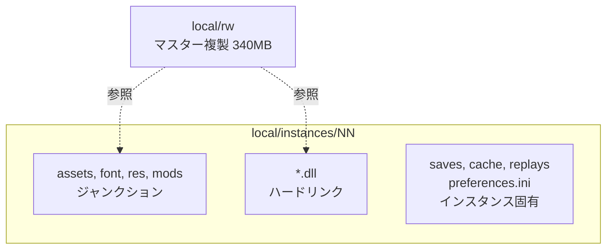

# 実行基盤

学習環境としてゲームを走らせるための構成と道具を記録する。ゲーム側の起動引数や速度制御の仕組みそのものは [../game/02-launch.md](../game/02-launch.md) にある。

## ゲームの複製

インストール先をそのまま使わず、`local/rw` に複製して使う。32bit 版 JVM とログ類は不要である。

```powershell
robocopy "<ゲームのインストール先>" local\rw /E /XD jvm cache /XF "hs_err_pid*.log" lastrun.log crashes.txt preferences.ini
```

複製する理由は二つある。実行するとゲームは作業ディレクトリへ設定やセーブを書き戻すため、元のインストールを汚さないこと。そして並列実行のための構成をそこに組み立てるためである。

`local/` はバージョン管理の対象外である。ゲーム本体を含むためである。

## 並列実行のためのディレクトリ構成

ゲームは作業ディレクトリに対して `preferences.ini` を書き、`saves`、`cache`、`replays` を使う。したがって同時実行するプロセスには別々の作業ディレクトリが要る。

インストール全体を複製すると 1 インスタンスあたり 340MB かかる。代わりに、読み取りしかされないものはマスター複製を参照させる。

- `assets`、`font`、`res`、`mods` は NTFS のジャンクションでマスターを指す
- インストール直下のネイティブ DLL 23 個(55MB)はハードリンクで置く
- `saves`、`cache`、`replays` はインスタンス毎の実体を持つ

結果としてインスタンスの実ディスク消費はほぼゼロになる。



DLL を省略できない理由がある。`-Djava.library.path` で `rocketConnector64.dll` 自体は見つかるが、その従属 DLL は Windows のローダが標準の探索順で解決し、そこに含まれるのは作業ディレクトリである。DLL を置かないと次で起動に失敗する。

```
java.lang.UnsatisfiedLinkError: rocketConnector64.dll: Can't find dependent libraries
```

ディレクトリはファイル単位のジャンクションを作れないためハードリンクを使う。ハードリンクは同一ボリューム内でのみ作成でき、管理者権限は不要である。

## 道具

| 道具 | 用途 |
| --- | --- |
| `tools/windows/New-RwInstance.ps1` | インスタンス用ディレクトリを作成する |
| `agent/build.ps1` | 制御エージェントをビルドする |
| `tools/windows/Start-RwAgents.ps1` | 制御プロセスへ接続するインスタンスを起動する |
| `tools/probe-agent/build.ps1` | 計測エージェントをビルドする |
| `tools/windows/Start-RwProbe.ps1` | 指定数のインスタンスを起動し、速度を集計する |
| `tools/windows/Measure-MatchOutcomes.ps1` | 同一の対戦を多数のエピソード回し、勝敗と長さの分布を報告する |
| `tools/Show-MapRegions.py` | マップを領域に切り出し、数と大きさを報告する |
| `tools/Show-UnitCatalog.py` | 定義ファイル由来のユニット種別を一覧し、価格が戦闘力を代理するかを検査する |

```powershell
.\tools\probe-agent\build.ps1
.\tools\windows\New-RwInstance.ps1 -Count 8
.\tools\windows\Start-RwProbe.ps1 -Count 8 -Speed 10 -Seconds 90
```

Python の二つはゲームを起動せずに動く。読むのはエンジンが読むのと同じファイルであり、追加の依存はない。共通の読み取りは `rwintel/data` にある。

## 二つのエージェント

**`agent/` が本体、`tools/probe-agent/` が計測用**である。役割が違うので統合しない。

| | `agent/` | `tools/probe-agent/` |
| --- | --- | --- |
| 目的 | 制御プロセスの指示で観測と行動を運ぶ | ゲームへの介入が成立することを確かめる |
| 相手 | 制御プロセス | ログ |
| 使う場面 | 学習と評価 | 解析、性能計測、文書に載せた実測の再現 |

計測エージェントは文書中の実測値を再現する手段でもあるため、本体が育っても残す。

## 制御プロセスとの起動順序

**制御プロセスを先に起動する。** エージェントは接続できるまで待ち、接続してから初めてエピソードが始まる。試合の設定は制御プロセス側にあり、エージェントは自分では何も始めない。

```powershell
python -m rwintel.control --instances 2 --episodes 2 --map Lake --max-seconds 300
.\tools\windows\Start-RwAgents.ps1 -Count 2 -Speed 10
```

制御プロセスは待ち受けポートを排他で確保する。**同じポートで二重に起動すると、Windows では後から起動した側も待ち受けに成功してしまい**、どちらが接続を受け取るかが不定になる。古いプロセスが生き残ったまま新しいコードを試していたことに気づかない、という形で現れる。

## 計測エージェント

`tools/probe-agent/RwProbeAgent.java` は `-javaagent` としてゲームプロセスに入り、**リフレクションのみで動作する**。バイトコード改変は行わない。現時点で次を行える。

| 機能 | 内容 |
| --- | --- |
| 速度制御 | 倍率 `H` を設定し、フレーム数とゲーム内時間から実効速度を報告する |
| 状態のダンプ | ゲームオブジェクトとプレイヤーの全フィールドを実値付きで出力する |
| 種別の一覧 | 登録済みの全ユニット種別を価格と技術レベル付きで出力する |
| 観測の計測 | 観測をゲームスレッド上で組み立て、その費用を報告する |
| 命令の発行 | ユニットに移動を命じ、追従したかを報告する |
| ユニットの生成 | システム命令でユニットを作り、実際に現れたかを報告する |
| 試合の進行 | スキルミッシュを開始し、勝敗を検出し、次のエピソードへ進む |
| 対戦の顔ぶれ | 対戦者を指定した数だけ残し、残りを観戦者に移す |

これは学習用の本体ではなく、**ゲームへの介入が成立することを実地で確かめるための道具**である。ここで確かめた経路が、そのまま観測と行動の実装の土台になる。

エージェントが依拠する三つの経路は次のとおりで、いずれも実行時に検証済みである。

- 入口は `Main.m`(静的な自己参照)と `l.B()`(エンジンのシングルトン)
- ゲームへの介入は `game.i.k` へ `Runnable` を投入する。命令の発行にもマップの読み込みにもこれが必要である
- 命令は `l.cf.b(player)` で取得したコマンドにフィールドを埋めることで発行される

詳細はそれぞれ [../game/01-internals.md](../game/01-internals.md)、[../game/04-actions.md](../game/04-actions.md)、[../game/05-match-control.md](../game/05-match-control.md) にある。

## 再現性のための注意

- **mod は無効化する。** 導入済み mod はユニット定義を書き換えるため、`-nomods` を付けないと条件が揃わない。実測環境には利用者が導入した mod が存在した。
- **計測は他の負荷がない状態で行う。** 本作業中、背景で解析処理を走らせたまま取得した計測値は 4 分の 1 以下に歪んだ。
- **最初の 30 秒程度は実行時コンパイルの影響で値が変動する。** フレームレートが 77 から 226 まで上昇する例を観測した。集計には初期のサンプルを含めない。
- **同一の設定でも試合そのものは再現しない。** これは環境の作り方ではなくゲームの性質である。[../game/05-match-control.md](../game/05-match-control.md) を参照する。

実測値は [03-throughput.md](03-throughput.md) にある。
