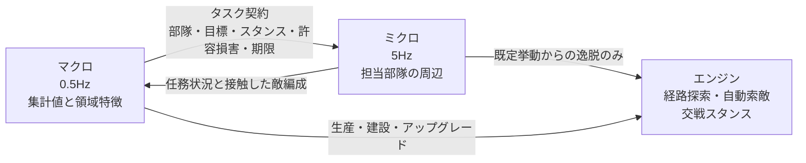

# 機械学習モデルの方針

**この文書は設計方針であり、ここに記すモデルはまだ一つも実装されていない。** 現時点で存在するのは、ゲームへの観測と行動と進行制御が成立することを実地で確かめた計測エージェントだけである([02-runtime.md](02-runtime.md))。

方針を書き留める意味は、[03-throughput.md](03-throughput.md) とゲーム側の解析で判明した制約が、設計の選択肢をかなり絞り込むからである。何を選べるかより先に、**何が選べないか**が分かっている。実際、以下の決定はほとんどが選好ではなく、制約によって選択肢が一つに潰れた結果である。

## 決まっていること

| 項目 | 決定 | 理由 |
| --- | --- | --- |
| 構成 | マクロとミクロの二層に分ける | このプロジェクトの出発点 |
| 自律度 | 完全自律。人間の入力なしで全操作を担う | 副官型は 8 並列ヘッドレス実行と両立しない |
| 学習の立ち上げ | 手書きのスクリプト方策を先に作り、骨格と教師と評価基準に使う | ゼロからの強化学習も人間リプレイからの模倣も成立しない |
| 対戦相手 | 内蔵 AI の 6 段階とスクリプト方策の集団。自己対戦は後 | 自己対戦はサンプル単価が倍で、評価をさらに不安定にする |

二層の担当は次のとおりである。

| 層 | 担当 |
| --- | --- |
| マクロ | ユニットの生産、アップグレード、おおまかな攻撃目標の選定、部隊の割り当て |
| ミクロ | 割り当てられた部隊の戦闘機動 |

両者は状況に応じて実時間で協調し、指揮を執る。協調の具体は [二層の連携](#二層の連携) に記す。

各決定の根拠は、いずれも次節の制約に帰着する。

## 制約が締め出すもの

実測から、次は成立しないと判断できる。設計の骨格はほぼこの一覧で決まっている。

### スクラッチからの強化学習だけで方策を得ること

サンプル収集は 8 並列で実時間の 60 倍から 80 倍が上限である。1 時間の実行でおよそ 200 から 480 試合にしかならない。RTS の強化学習研究が前提にする規模には二桁足りない。

これは機材を増やせば緩む制約だが、緩め方は台数に比例するだけである。設計としては、**学習を一から始めない方向**、つまり既に妥当に動く方策を出発点にする方向へ寄せる必要がある。

### 人間のリプレイからの模倣で立ち上げること

ロックステップのリプレイに記録されているのはコマンド列だけであり、状態は含まれない。模倣学習に必要な「状態と行動の対」を作るには、リプレイを再シミュレートして各コマンド時点の状態を復元する必要がある。

ところが同一の設定でも試合は再現しない([../game/05-match-control.md](../game/05-match-control.md))。**したがって、そのコマンドが条件付けられていた状態を復元できない。** リプレイは再生するたびに別の展開になる。

この選択肢を開くには、フレームの delta を実経過時間から固定値へ差し替えるバイトコード改変を先に行い、かつその状態で再現性が実際に回復することを検証する必要がある。回復するかどうかは未検証である。**当面は閉じた選択肢として扱う。**

### 人間と併走する副官型

副官型は 1 試合ごとに人間の入力を必要とする。これは `-nodisplay` での 8 並列 10 倍速という実行基盤([02-runtime.md](02-runtime.md))と正面から衝突し、サンプル収集の予算がまるごと消える。

好みの問題ではなく、実行基盤の側から閉じている。副官型は**学習済み方策の運用形態**として後から被せるものであり、学習時の形態としては選べない。人間の意図の推定と命令の非上書きは、その段階で初めて必要になる。

### 層間インタフェースを学習させること

マクロがミクロへ渡す情報を潜在ベクトルとして学習させる構成は採らない。この構成では片方を変えるともう片方が無効化されるため、二層をまとめた信用割り当てが必要になる。階層強化学習がしばしば平坦な強化学習よりサンプル効率で劣るのはこのためであり、毎時 300 試合の予算では最初に捨てる構成である。

**層間の受け渡しは、意味の固定された契約とする。** 各層を、凍結した相手に対して独立に学習・評価できることを設計目標に置く。

### 二層を同時に学習させること

マクロの報酬信号はもともと多数エピソードの平均でしか読めない。そこへ非定常なミクロが加わると、観測された差がマクロの改善によるものかミクロの変化によるものか原理的に切り分けられない。**この予算では一度に一つしか変えられない。** 学習は必ず片方を凍結した交互で行う。

### 二つの方策を同じ試合で比較すること

同一の乱数種と設定を与えても試合は再現しない([../game/05-match-control.md](../game/05-match-control.md))。したがって、片方の方策を差し替えて同じ展開で比べる、という評価はできない。

**評価は最初から多数エピソードの平均として設計する。** 差を検出したい効果量に対して何試合必要かを見積もる手順を、評価の仕組みに組み込む。

### 状態を直接書き換える近道

報酬の整形やカリキュラムのために資金や体力を直接操作したくなるが、これはロックステップの同期を壊す([../game/03-observation.md](../game/03-observation.md))。単独プレイでは動いてしまうため、自己対戦を導入した時点で原因不明の分岐として現れる。

**観測層は読み取り専用と決めておく。** 状況の設定が必要なら、試合開始時のルーム設定([../game/05-match-control.md](../game/05-match-control.md))か、正規のコマンド経路を使う。後者を使った状況構築は [学習環境の作り分け](#学習環境の作り分け) に記す。

## 制御の周期と計算量

倍率 10、300fps で 1 ステップは 33 ミリ秒である。これが制御周期の下限を決める。

想定する周期を仮に置くと、必要な推論回数は次のようになる。

| 層 | ゲーム内周期 | 8 並列 10 倍での実時間あたり推論回数 |
| --- | --- | --- |
| ミクロ | 5Hz(6 ステップに 1 回) | 毎秒 400 回 |
| マクロ | 0.5Hz(60 ステップに 1 回) | 毎秒 40 回 |

ミクロの 1 回は、操作対象のユニット数十から数百体をまとめて 1 バッチで処理する。**毎秒 400 バッチという要求は、6GB の GPU では小規模なネットワークしか許さない。** ミクロ側は共有パラメータの軽量なモデルにする、という設計上の制約がここから出る。

この数字を下げる手が二つある。

**推論の対象を絞る。** 毎秒 400 バッチは全ユニットを毎周期推論する前提の値である。ミクロを介入として設計すれば([ミクロは介入として設計する](#ミクロは介入として設計する))、対象は交戦中および交戦近傍のユニットだけでよい。被弾時刻 `am.bs` が安価な起動条件になる。移動中や待機中のユニットはエンジン既定の挙動に任せ、推論に載せない。

**推論をプロセス横断でまとめる。** 8 インスタンスがそれぞれ毎秒 50 回投げると合計 400 回になるが、数ミリ秒の窓で束ねる推論サーバを 1 つ立てれば、GPU の呼び出し回数は 8 分の 1、バッチは 8 倍になる。**推論はインスタンスごとに持たせず、集約する。**

観測の取り出しにも費用がかかる。ユニットの列挙はプレイヤー別の索引が存在せず全件走査になるため([../game/03-observation.md](../game/03-observation.md))、毎回数百オブジェクトを触ることになる。集計値で足りるものは `n.T` から O(1) で読めるので、**マクロ側の観測は極力集計値から組む**。

## 観測の設計

層ごとに見るものを分ける。同じ盤面から別々の抽象度で切り出す。

**マクロ**は全体の集計を見る。自軍のユニット種別ごとの数、資金と収入、ユニット上限に対する余裕、建造中の数、領域ごとの勢力、経過時間。ほとんどが `n.T` と累積戦績 `bo` から直接取れる。

**ミクロ**は担当ユニットの周辺だけを見る。自身の体力と種別と状態、近傍の味方と敵の相対位置、体力、種別、そして現在の命令。

### マクロは敵の編成を自力では観測できない

`n.T` と `bo` から O(1) で取れるのは**自軍側の集計だけ**である。敵の編成を知るには全ユニットを走査し、そのうえで可視判定を通す必要がある。

したがって霧を有効にした時点で、マクロは敵の編成に関する入力を持たない。**盤面に接触しているミクロが唯一のセンサである。** これが [二層の連携](#二層の連携) を双方向にしなければならない理由であり、連携をマクロからミクロへの一方向として設計すると、霧を入れた瞬間にマクロの入力が消える。

### 霧の扱い

**霧を考慮するかは明示的に決める。** ゲームには視界を考慮した可視判定 API があり、あるプレイヤーからユニットが見えるかを `am.d(n)` で、タイルが探索済みかを `b.b.a(n,x,y)` で判定できる。全知の観測で学習させれば速く進むが、そのまま実戦に出すと成立しない。**当面は全知で足場を作り、切り替えられる構造にしておく**のが妥当と考える。

ただし前項のとおり、切り替えを後回しにできるのは観測の**内容**だけである。ミクロからマクロへ敵情を返す**経路**は、全知の段階で通しておく必要がある。全知のうちは同じ値がマクロ側でも直接取れるので、経路が正しく機能しているかを突き合わせで検証できるという利点もある。

観測はゲームスレッド上で組み立てる。監視スレッドから読むとシミュレーションの途中の状態を拾い、ユニットごとに時刻の揃わない断片的な観測になる。ゲームへの介入経路([../game/04-actions.md](../game/04-actions.md))はもともとゲームスレッドを通るので、観測もそこに載せる。

## 行動の設計

**マクロ**の行動は離散で表せる。何を生産するか、何を建設するか、どこへ攻めるか、どの部隊を割り当てるか。生産と建設は特殊アクションとして発行する仕組みが判明している([../game/04-actions.md](../game/04-actions.md))。

**ミクロ**の行動はユニット単位で、移動先か攻撃対象の選択になる。命令はコマンド 1 つに複数ユニットをまとめられるため、同じ命令を出すユニットは束ねて発行の回数を減らせる。

### 領域は座標ではなく離散 ID とする

マクロが指す場所を生の座標にすると、行動空間がマップ寸法に依存し、マップを変えるたびに学習し直しになる。

資源は地形の属性ではなく `crystalResource` 種別のゲームオブジェクトとして配置されている([../game/03-observation.md](../game/03-observation.md))。したがって**資源地点と出撃地点のクラスタリングで、マップごとに領域を機械的に切り出せる**。1 マップあたり 10 から 20 個を想定する。これでマクロの行動空間はマップ非依存の小さな離散集合になり、領域の特徴量(資源数、自軍と敵軍の勢力、距離)だけがマップごとに変わる形になる。

## 二層の連携

設計目標は「二層をうまく協調させること」ではない。**各層を、凍結した相手に対して独立に学習・評価できるようにすることである。** 予算がこれを要求する。以下はその観点から導いた構成である。

### マクロからミクロへ渡すもの: タスク契約

潜在ベクトルではなく、意味の固定された構造体を渡す。

| 項目 | 内容 |
| --- | --- |
| `unit_set` | 割り当てるユニット ID の集合 |
| `task_type` | 攻撃 / 防衛 / 襲撃 / 後退 / 護衛 / 包囲 |
| `target` | 領域 ID |
| `stance` | 交戦スタンス `game.units.a` へ直接写像する |
| `cost_budget` | この任務で失って構わない自軍価値 |
| `deadline` | 完了を期待するゲーム内時刻 |

要点は `cost_budget` である。これは**価値判断を契約に載せる**ための項目であり、「ミクロの局所最適が全体の不利につながる場合をどう扱うか」という問題をここで解く。

交換比を最大化するミクロは、自軍を全滅させてでも敵の経済を潰すべき局面で必ず退く。しかしその判断に必要な情報(経済差、残り時間、代替手段の有無)を持っているのはマクロだけである。ミクロに全体報酬を渡して察してもらうのではなく、マクロが「この任務は自軍価値 X まで払ってよい」と明示的に渡す。**ミクロは理由を知る必要がない。**

### ミクロからマクロへ返すもの

連携は双方向である。[マクロは敵の編成を自力では観測できない](#マクロは敵の編成を自力では観測できない)ため、次を返す経路が必須である。

| 項目 | 内容 |
| --- | --- |
| 任務状況 | 進行中 / 膠着 / losing / 完了 / 期限切れ |
| 接触した敵編成 | 遭遇した敵の種別ごとの数と規模の要約 |
| 実損害 | 契約の `cost_budget` に対して実際に支払った量 |

任務状況はマクロの行動の帰結を短い遅延で返す信号でもあり、マクロの学習が試合終了の勝敗だけに依存しないための素材になる。

### ミクロは介入として設計する

**ミクロをゼロからのユニット操作として設計しない。**

エンジンは既に、経路探索、自動索敵、交戦スタンス、`attackMove` / `patrol` / `guard`、容量 30 のウェイポイントキューを持っている([../game/04-actions.md](../game/04-actions.md))。これは無償で手に入る、そこそこ有能なミクロのベースラインである。

したがってミクロの既定挙動は「割り当てられた目標へ、指定されたスタンスで `attackMove`」とし、学習するのは**そこから逸脱すべき場面の判定と逸脱の内容**だけにする。被弾ユニットの後退、集中砲火、カイト、範囲攻撃に対する散開などである。

この設計には二つの利点がある。学習問題が小さくなること。そして推論の対象が交戦近傍に絞られ、[制御の周期と計算量](#制御の周期と計算量)の要求が緩むことである。

### 報酬の分け方

| 層 | 報酬 | 地平 |
| --- | --- | --- |
| マクロ | 勝敗、および軍事価値差と経済差によるポテンシャル整形 | 試合全体 |
| ミクロ | 任務契約の達成度。目標の確保と維持、`cost_budget` 内に収まったか | 任務単位の 10 秒から 60 秒 |

整形はポテンシャルベースにして最適方策を歪めないようにする。素材は [報酬に使える素材](#報酬に使える素材) で足りる。

**ミクロは全体報酬を一切見ない。** これが層をまたいだ信用割り当てを不要にする。同時に、ミクロの報酬地平が任務境界で閉じることで 10 秒から 60 秒になる。この予算で学習可能な地平はこの長さだけである。

### 学習の順序

**交互に学習させる。相手は必ず凍結する。** 同時学習を採らない理由は [二層を同時に学習させること](#二層を同時に学習させること) に記した。

順序はミクロが先である。理由は決定的で、**ミクロは試合を回さずに学習できる**からである([学習環境の作り分け](#学習環境の作り分け))。マクロの学習は全試合を回す必要があるため単価が高く、凍結対象が安いうちに固めるのが順序として正しい。

マクロは凍結したミクロに対して全試合で学習させる。0.5Hz で 20 分の試合なら 1 試合あたり約 600 回の決定であり、毎時 300 試合なら毎時 18 万回の決定が集まる。行動空間が小さな離散集合で、スクリプト方策から初期化するなら、この規模は現実的である。

### スクリプト方策が契約の定義を兼ねる

手書きのスクリプト方策には、教師と評価基準以上の役割を持たせる。**スクリプトのマクロとミクロを先に書き、その間の受け渡しをそのまま契約の定義とする。**

こうすると、常に動くシステムが最初から存在し、各層を片方ずつ学習方策へ差し替えて多数エピソード平均でスクリプト版と比較でき、契約の粒度が議論ではなく計測で決まる。渡す情報の粒度がそのまま両者の分担を決める以上、机上で詰めるより一度通してから測る方が速い。

## 学習環境の作り分け

マクロとミクロで、必要な環境の形が違う。**ミクロの学習には試合を回す必要がない。**

`04-actions.md` のシステム命令 `u=5`(ユニットの即時生成)は、状態の直接書き換えではなく正規のコマンド経路を通る。これに試合設定の開始クレジット、開始ユニット、収入倍率、霧([../game/05-match-control.md](../game/05-match-control.md))を組み合わせれば、**任意の交戦状況を正規の経路だけで構築できる。**

これが予算に効く。30 秒の交戦を繰り返すのと 15 分の試合を回すのとでは、同じ実時間から取れるミクロのサンプル数が桁で違う。試合単位のサンプル予算([03-throughput.md](03-throughput.md))はマクロの制約であって、**ミクロの制約ではない**。

さらにサンドボックスのフラグ `l.bv` は全プレイヤーのユニットを操作可能にする。1 プロセス内で交戦の両側を動かせるため、ミクロの自己対戦がネットワーク構成なしで組める。霧が強制的に無効化される点は、ミクロの学習を全知から始める方針と整合する。

| 層 | 環境 | エピソード長 |
| --- | --- | --- |
| ミクロ | 構築した交戦状況。サンドボックスで両側を操作 | ゲーム内 10 秒から 60 秒 |
| マクロ | 通常のスキルミッシュ。ミクロは凍結 | ゲーム内 10 分から 20 分 |

**ただし `u=5` がロックステップの同期を壊さないことは未検証である。** コマンド経路を通る以上は安全なはずだが、これは逆アセンブルからの推論であり実行時に確かめていない。シナリオ生成をこれに依存させる前に、複数プロセスを接続した状態で同期が保たれるかを検証する必要がある。

## 報酬に使える素材

ゲーム側から直接取れるものを挙げる。いずれも [../game/03-observation.md](../game/03-observation.md) に対応がある。

| 素材 | 取得元 | 主な用途 |
| --- | --- | --- |
| 撃破したユニット数と建物数 | 累積戦績 `bo.c` `bo.d` | 両層 |
| 失ったユニット数と建物数 | 累積戦績 `bo.f` `bo.g` | 両層。ミクロでは契約の実損害 |
| 資金と収入 | `n.o` と `n.T.g` | マクロの経済差 |
| ユニット数と建造中の数 | `n.T` | マクロの軍事価値差 |
| ユニットの価格 | `am.cL()` | 価値の重み付け |
| 勝敗 | `l.dq` と `l.dt`、および生存チームの集計 | マクロの終端報酬 |

ミクロの報酬は、これらのうち担当ユニットに関わる分の差分を任務の開始時刻と終了時刻で切って求める。累積戦績はプレイヤー単位であるため、任務単位の切り出しには担当ユニットの生死と撃破数 `am.cU` を併用する必要がある。

## まだ決めていないこと

決定の骨格は固まったが、次はスクリプト方策を書く過程で詰める。いずれも実装を止めるものではない。

- タスク契約の各項目の値域と粒度。特に `cost_budget` を絶対値で渡すか自軍総価値に対する比で渡すか。
- 領域のクラスタリング手法と、1 マップあたりの適切な領域数。
- ミクロが逸脱を選べる行動の集合。後退と集中砲火から始め、必要に応じて増やす。
- マクロのポテンシャル整形に使う軍事価値の定義。単純な価格の総和で足りるかどうか。

## 次にやること

順序は次のとおりである。

1. **観測と行動の外部化。** 観測をゲームスレッド上で組み立てて外部へ渡す仕組みと、外部からの命令を受けて発行する仕組みを作る。経路の成立は計測エージェントで確認済みであり、残っているのは形を整えることとプロセス間の通信を決めることである。方針がどうであれ必要になる土台である。
2. **`u=5` の同期安全性の検証。** ミクロの学習環境がこれに依存するため、シナリオ生成を組む前に確かめる。
3. **スクリプト方策の実装。** マクロとミクロを両方書き、その間の受け渡しをタスク契約として定義する。これが骨格であり、教師であり、評価基準になる。
4. **評価の仕組み。** 多数エピソード平均で二つの方策を比較し、必要な試合数を効果量から見積もる手順を組む。以降のすべての判断がこれに依存する。
5. **ミクロの学習。** 構築した交戦状況で、スクリプトのミクロを上回るかを評価の仕組みで確かめる。
6. **マクロの学習。** ミクロを凍結し、通常のスキルミッシュで学習させる。
