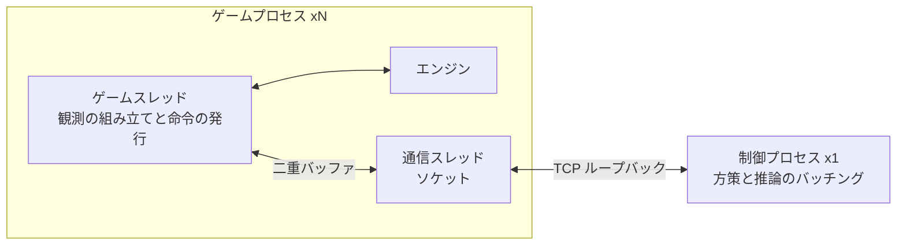
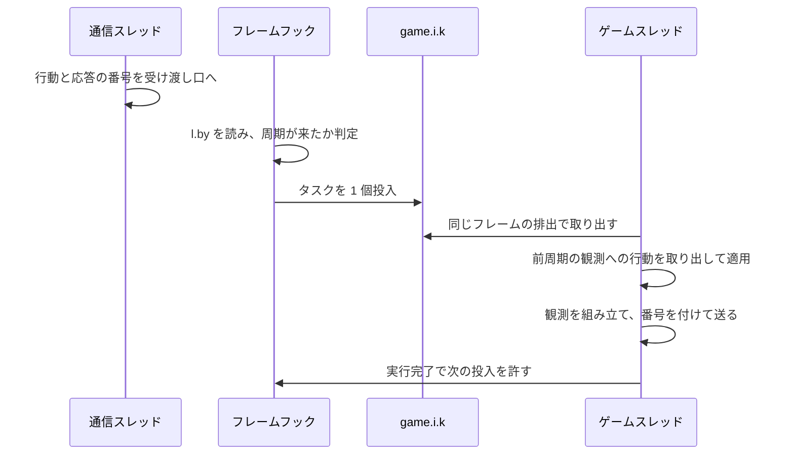
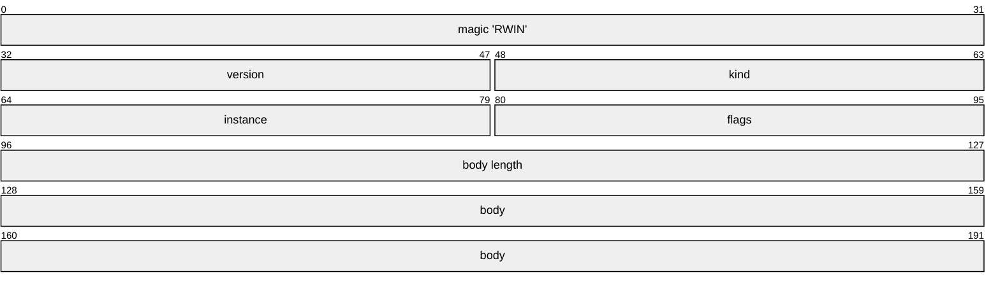
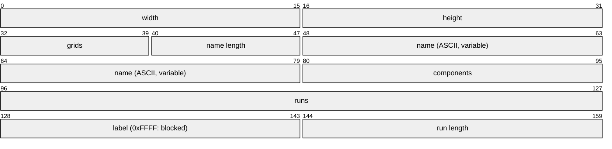
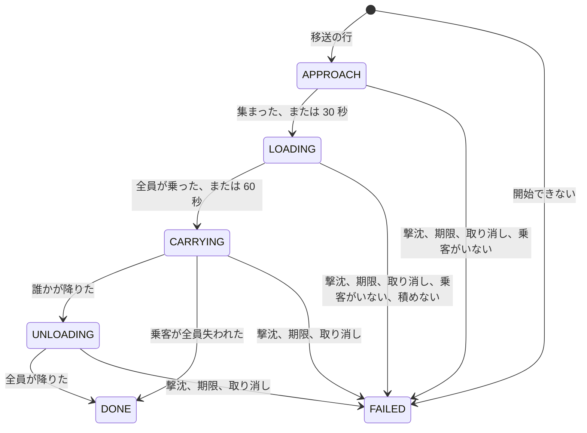
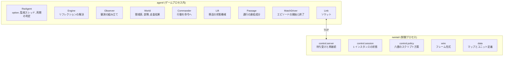

# 観測と行動の外部化

[04-model-design.md](04-model-design.md) の「次にやること」の第一項である。ゲームプロセスの中から観測を組み立てて外へ渡し、外から来た決定を命令として発行する経路を決める。経路が成立すること自体は計測エージェントで確認済みであり([02-runtime.md](02-runtime.md))、ここで決めるのは形である。

**この形式は実装済みである。** 実物は `agent/`(ゲームプロセス内)と `rwintel/`(制御プロセス)にあり、制御プロセス 1 つに複数のインスタンスが接続してエピソードを回す。観測は指定した戦術周期(ゲーム内時間で 5Hz)どおりに届き、エピソードの実時間はシミュレーションと推論の速さで決まる。

## 構成

制御プロセスは 1 つ、ゲームプロセスは機材の並列数だけある([03-throughput.md](03-throughput.md))。推論はインスタンスごとに持たせず集約すると決めてあるため([04-model-design.md](04-model-design.md) の制御の周期と計算量)、この非対称性は設計の前提であって選択ではない。

**接続はゲーム側から張る。** 制御プロセスが待ち受け、各インスタンスがクライアントとして接続する。インスタンスは学習の途中で落ちたり作り直されたりするが、制御プロセスは学習の一巡を通して生き続ける。長命な側を待ち受けにするのが素直である。



### 伝送路は TCP のループバックとする

理由は三つある。**同梱の JVM で使える。** ゲームが同梱する Java 8 には UNIX ドメインソケットの API が無い(Java 16 で入った)ので、追加のネイティブライブラリなしに使える局所的なプロセス間通信は TCP だけである。共有メモリは同期を自前で書くことになる。**両側に標準で存在する。** Java にも Python にも追加の依存が要らない。**後で機材を分けられる。** 合計 fps を上げる本質的な手段はコアを増やすことであり([03-throughput.md](03-throughput.md))、その先には別マシンへ出す形がある。ループバックでの実装がそのまま動く。

帯域は問題にならない。観測はユニット 1 体あたり 44 バイトで、120 体なら 5.3KB である。流れる量は戦術周期の実時間で決まり、固定時計で各インスタンスが実時間の数十倍から数百倍で進んでも、十数インスタンスで毎秒数十 MB に収まる。ループバックの TCP には十分に小さい。

### スレッドの分担

**エンジンの状態に触るのはゲームスレッドだけである。** これは選択ではなく制約で、コマンドのプールが同期化されていないこと([../game/04-actions.md](../game/04-actions.md))と、マップの読み込みが OpenGL コンテキストを要求すること([../game/05-match-control.md](../game/05-match-control.md))から来ている。観測についても同じ理由が別の形で効く。監視スレッドから読むとシミュレーションの途中の状態を拾い、ユニットごとに時刻の揃わない断片的な観測になる。

したがって通信スレッドはソケットだけを持ち、ゲームスレッドとは単一要素の受け渡し口で交換する。観測には通し番号を付けて送り、通信スレッドは受け取った行動をその応答の番号とともに受け渡し口に置き、ゲームスレッドが周期の頭で取り出す。受け渡し口で待つかどうかは時計で決まる([1 周期の遅れを固定する](#1-周期の遅れを固定する))。

**ゲームスレッドの仕事を予約するのは、キューの中の処理自身ではありえない。** エンジンのタスクキューは空になるまで排出されるため、自分自身を再投入する処理は同じフレーム内で再び取り出され、フレームが終わらない([../game/01-internals.md](../game/01-internals.md))。実装ではこれで一度ゲームを完全に停止させた。**周期が来たかどうかは、フレーム層のフックがゲームスレッド上で毎フレーム判断し、来ていればタスクを 1 個だけ投入する**([02-runtime.md](02-runtime.md) のフレーム層)。フックはキューの排出より前に走るので、そこから投入したタスクは同じフレームの排出で実行される。前のタスクが終わるまで次は投入しない。周期はゲーム内時間がそこに達した最初のフレームで始まり、フレームの速さに依らず境界が決まる。



### 観測の組み立ては安い

ユニットを全件走査し、1 体あたり ID・座標・体力・最大体力・建造進捗・種別・所有者を読んで集計する処理は、実行時コンパイルが効いた後は 1 体あたり 1 マイクロ秒に満たない。**ユニットが 500 体まで増えても組み立ては 1 ミリ秒に満たない。** wall 時計の倍率 10 なら戦術周期は実時間 20 ミリ秒で、その数パーセントに収まる。固定時計では周期の実時間がシミュレーションの速さで決まり、描画を止めたシミュレーションは速いので、組み立ての割合はそれより大きくなる。試合の序盤は実行時コンパイルが効く前なので 1 体あたりが数倍遅いが、ユニットも少ない。

この値の意味は、**毎周期の全件走査を避ける工夫が要らない**ということである。差分の送出や領域単位の間引きは、観測の側では設計しない。プレイヤー別の索引が存在せず全件走査になる点([../game/03-observation.md](../game/03-observation.md))は、性能上の問題としては現れない。

計測エージェントで測れる。`obs:` の行が生存ユニット数、組み立て時間の中央値、1 体あたりの時間を報告する。

```bash
python -m rwintel.runtime probe --count 1 --seconds 200 --map Lake --agent-options obs=true
```

## 周期と遅延

### 1 周期の遅れを固定する

**観測は周期 t に送り、そこから計算された行動は周期 t+1 に適用する。** 遅れが負荷によって変わると、推論が間に合った周期では新しい行動が、間に合わなかった周期では前の行動が効くことになり、どちらが起きるかは機材の混み具合で決まる。学習時と運用時で環境そのものが変わり、試合が再現しない環境([../game/05-match-control.md](../game/05-match-control.md))にさらに再現しない要因を足すことになる。固定の 1 周期遅れなら、遅れは環境の性質として学習にも評価にも同じように入り、方策はそれを織り込んで学習する。

**これを守るために、制御プロセスは観測 1 件に必ず行動 1 件で答える。** 変えることが無いときは本体が空の行動を返し、ゲーム側は空の行動を何もしない指示として扱う。行動はヘッダの flags 欄に、答えている観測の番号を載せる([フレーム形式](#フレーム形式))。

**固定時計では、ゲームスレッドは周期 t+1 の頭で周期 t の観測への答えを待つ。** 固定時計の 1 フレームは、実時間でどれだけかかっても同じゲーム内時間しか進まないので、待ってもシミュレーションは歪まない。待つことで、どの周期にも必ず前の周期への答えが効く。接続が切れれば待つのをやめる。

**wall 時計では待たない。** そこでの 1 ステップは実経過時間から決まるため、待った時間はそのまま 1 回の長いステップになる。答えが間に合わなかった周期では前の行動が保持され、遅れは 1 周期に固定されない。wall 時計が既定になるのは、固定時計の効かない 2 プロセスの試合だけである([02-runtime.md](02-runtime.md))。

代償は 1 周期ぶんの陳腐化であり、戦術周期ならゲーム内 200 ミリ秒である。**エンジンの既定挙動が常に動いているため、この間ユニットが無反応になることはない。** 戦術層を介入として設計してあること([04-model-design.md](04-model-design.md))が、ここで効く。

**固定時計と再生用の時計では、どの答えも観測から戦術周期ちょうど 1 つ(既定でゲーム内 200 ミリ秒)後に効き、機材の速さに依らない。** ステップの頭で前の観測への答えを適用し、同じステップで次の観測を作って送る。ゲームスレッドはその答えが来るまで時間切れなしに待ち、制御プロセスは観測を決めてから行動をちょうど 1 件返す。経路探索も内蔵 AI のタイマーもゲーム内時間で数える([../game/01-internals.md](../game/01-internals.md)、[../game/08-builtin-ai.md](../game/08-builtin-ai.md))。

これが保たれていることを確かめるのが決定の遅延の計器である(`rwintel/control/latency.py`)。観測ごとに、そのステップの頭で適用した答えがどの観測へのものかがタイミングブロックで届き([タイミングブロック](#タイミングブロック))、制御プロセスは適用したステップのゲーム内時間と答えた観測のゲーム内時間の差を遅延として数える。エピソードの記録の `latency` に、戦術(全観測)と作戦(領域ブロックを載せた観測。内政も同じ観測で決める)のそれぞれについて、適用された答えの数、適用されなかった答えの数、遅延の平均・95 パーセンタイル・最大をミリ秒と戦術周期で残す。エピソードの最後の観測は後に続くステップが無いので数えない。制御プロセスはエピソードごとに 1 行を書き、答えを待つ時計(HELLO の `steady`)でどれかの遅延が 1 周期と違うか適用されない答えがあれば警告を 1 行書く。

**エピソード中の制御フレームは次の周期の頭で扱う。** エピソードが走っていない間は届いたフレームでステップを取るが、走っている間は周期を待つ。周期の頭のステップは、答えを取る前と、取った後で適用する前の 2 度、届いている制御フレームを扱う。観測を決める間に送られた制御フレーム(アリーナのシナリオ構築など)はリンク上でその答えより前に来るので、ステップが始まる前に届いても答えを待つ間に届いても、その答えと同じステップで答えより先に効く。周期の途中に挟まるステップ(張り替え後の HELLO を送るものなど)は答えを適用せずに戻るので、周期の頭はずれない。

機材の速さで遅延が変わりうる経路は次の三つである。

- 周期の途中で接続が張り替わると、`awaitAction` は答えを返さずに戻り、その答えは適用されない。
- エピソードの最初の観測の前に領域表が実時間の `REGIONS_WAIT_MS` 以内に届かなければ、領域表なしで観測を始める。
- 2 プロセスの試合と人間との試合は wall 時計で動き、間に合わなかった答えは適用されない。

推論はインスタンスをまたいでまとめて行う(`rwintel/learn/inference.py`)。要求は、決定中のスレッド全員がどれかのまとめ役で待ち始めた時点で評価する。そこから先は答えを返すまで新しい要求が来ないからである。決定の外から来た要求だけは、短い窓を上限に待つ。固定時計では答えを待つ間ゲームが止まっているので、来ない相手を窓いっぱい待つことはそのまま処理量の損失になる。

### 周期の刻み

**周期はゲーム内時間で数える。ステップ数でも実時間でも数えない。**

ステップ数で数えてはいけない理由は、1 ステップが担うゲーム内時間が時計の設定で変わる([../game/02-launch.md](../game/02-launch.md))ためである。wall 時計では平均 `1000 * H / fps` ミリ秒で、倍率 10 なら 33 ミリ秒、倍率 1 なら 3.3 ミリ秒であり、同じステップ数が同じゲーム内周期を意味しない。実時間で数えれば倍率を変えるたびにゲーム内周期が変わる。**ゲーム内時間 `l.by` の差分で判定すれば、倍率にも描画速度にも依存しない。**

周期はゲーム内時間がそこに達した最初のフレームで始まるので、周期の長さは 1 ステップ単位に丸め上がる。**固定時計では、周期がステップで割り切れることを起動ツールが求める**。既定の 25 ミリ秒のステップなら、どの周期も名目どおりの長さの、常に同じステップ数になる。

| 層 | 周期 | ゲーム内周期 | 固定時計 25 ミリ秒でのステップ数 |
| --- | --- | --- | --- |
| 戦術 | 5Hz | 200ms | 8 |
| 作戦 | 0.5Hz | 2000ms | 80 |
| 内政 | 0.5Hz | 2000ms | 80 |
| 戦略 | 0.1Hz | 10000ms | 400 |

**フレームは戦術周期ごとに 1 つだけ送る。** 作戦・戦略のブロックは、それぞれの周期に当たるフレームにだけ載せる。どのブロックが載っているかはフレーム内のビットで示し、受け手が周期表を知らなくても読めるようにする。

編成層は事象駆動だが、独立した経路は作らない。生産完了と部隊消耗はフレーム内の事象欄に載せ、制御側が作戦周期の処理の前に消化する。

## フレーム形式

固定長ヘッダと本体である。すべてリトルエンディアンとする。



| kind | 向き | 本体 | 内容 |
| --- | --- | --- | --- |
| `0x01` HELLO | ゲームから制御へ | JSON | ゲームのビルド番号、インスタンス番号、作業ディレクトリ、戦術と作戦の周期、時計が答えを待つか(`steady`)、ユニット種別表、プレイヤー枠、進行中のエピソード |
| `0x02` EPISODE | ゲームから制御へ | JSON | エピソードの開始と終了、マップのパス、勝敗、経過、同期の状態、記録したリプレイ、エピソードの途中の各陣営の最終状況 |
| `0x03` TERRAIN | ゲームから制御へ | 固定レイアウト | 移動タイプごとの通行の連結成分([地形](#地形)) |
| `0x10` OBSERVATION | ゲームから制御へ | 固定レイアウト | 下記 |
| `0x20` ACTION | 制御からゲームへ | 固定レイアウト | 下記 |
| `0x30` CONTROL | 制御からゲームへ | JSON | エピソードの開始と打ち切り、試合設定、領域表、シナリオ構築、同期の問い合わせ |

**頻度の低いものは JSON、毎周期のものは固定レイアウトとする。** 静的表と制御は 1 エピソードに数回しか流れないので、可読性の利益が費用を上回る。観測と行動は戦術周期ごとに流れ、1 インスタンスあたり実時間で毎秒数十回から数百回になるので、割り当てと解析を避けたい。

版番号はヘッダに置き、一致しなければ接続を拒否する。難読化されたフィールドの対応はゲームの更新で無効になりうるため([../game/01-internals.md](../game/01-internals.md))、静かに壊れるより接続を拒否する方がよい。ビルド番号を HELLO に載せるのも同じ理由で、`Main.m.e` から読める([../game/01-internals.md](../game/01-internals.md))。

**現在の版番号は 10 である。** 9 で観測にタイミングブロック([タイミングブロック](#タイミングブロック))を、10 でその後ろに AI の命令ブロック([AI の命令ブロック](#ai-の命令ブロック))を足した。 版番号は、片側だけが新しいときに静かに壊れる変更で上げる。未使用だったヘッダの flags 欄に、OBSERVATION は観測の通し番号の下位 16 ビットを、ACTION は答えている観測の番号を載せる。版番号が無ければ、古い制御側は番号を返さず、変えることの無い観測に答えもしないので、固定時計のゲームは答えを待ったまま止まる。生産メニューブロック([生産メニューブロック](#生産メニューブロック))も同じで、古い制御側はそのビットを読み飛ばし、内政層は定義ファイルからの推定に落ちたまま何も言わない。**壊れ方が静かなときほど版番号が要る**という、この節がもともと述べている規則がそのまま当てはまる場面である。

### 種別表は起動時に完成する

HELLO の種別表は、種別ごとに次を載せる。いずれも種別の実装か、エンジンが種別ごとに持つ見本ユニットから取れる([../game/06-content.md](../game/06-content.md))。ドクトリンによる分類([06-script-policy.md](06-script-policy.md))はこれらを見て行うので、名前による分類にはならない。

| 欄 | 内容 | 取り方 |
| --- | --- | --- |
| `name` `lookup` `price` `tech` | 名乗る名前、引く名前、価格、技術レベル | 種別のインタフェース |
| `building` `builder` `extractor` `movement` | 建物か、建設を行えるか、採掘施設か、移動タイプ | 種別のインタフェースと定義 |
| `canAttack` | 攻撃できるか | 見本の `l()` |
| `range` | 攻撃できる種別なら最大攻撃距離、建設者なら建設の届く距離 | 定義のステータスか見本の `m()` |
| `hitsAir` `hitsLand` | 対空可否、対地可否 | 定義の条件 |
| `speed` | 移動速度(ワールド単位 / 秒) | 見本の `z()` の 60 倍 |
| `hp` | 最大体力 | 見本 |
| `capacity` `slots` | 輸送容量(輸送でなければ -1)、乗るときに占める枠 | 見本の `bZ()` と `cw()` |
| `upgradable` | 段階の強化を出すか | 見本の行動一覧 |
| `menu` | 段階 1 で生産・配置できる種別の、種別表の添字 | 見本の行動一覧 |
| `carries` | 輸送種別だけ、積める種別の添字 | 輸送の見本の `d(乗客の見本, false)` |

**武装しているかは `canAttack` で決め、射程で決めない。** 輸送と建設機は攻撃できないが射程を持つ。

### 地形

**TERRAIN フレームは、マップの読み込まれたエピソードの開始のたびに 1 回、エピソードの途中の HELLO の後にも 1 回送る。** 中身は経路探索の移動タイプごとの格子([../game/06-content.md](../game/06-content.md) の地形と通行)を辺でつないだ連結成分であり、2 つの地点がその移動タイプで行き来できるかは、同じ成分に入っているかで決まる。空(AIR)はどこへでも行けるので送らない。成分は送る時点の格子から求めるので、立っている建物の足元は塞がれている。

**ゲーム側も同じ成分を持つ。** 送るときに求めた成分を `World` が保持し、契約の目標と移送の積む地点・降ろし地点に届くかをそれで確かめる([契約の書き換え](#契約の書き換え)、[移送](#移送))。地点の成分の引き方(塞がれたタイルの上なら、近い環から順に、環の中は上の行から、行の中は左の列から見て、3 タイル以内で最初に見つかる成分)は両側で同じである。



グリッドの数だけ、名前から runs までと、runs 個の (label, length) の組が続く。組は左上から行の順に並べたタイルの列のランレングスである。制御側はこれを `rwintel/wire/terrain.py` の `Passage` に復元し、任意のワールド座標の成分(塞がれたタイルの上なら近くの成分)と、2 地点の行き来を答える。

## 観測の内容

### 指揮下の戦力として定義する

**`n.T` の集計をそのまま自軍戦力として渡さない。** 人間や別の指揮者が部隊を引き取ってもユニットの所有プレイヤーは変わらないため、集計には残り続ける([04-model-design.md](04-model-design.md))。観測層は、集計値から他の指揮者が保持している分を差し引いて渡す。

これは観測の定義そのものであり、介入機能を足すときの後付けではない。後から入れると、介入していない試合では正しく動き、介入した試合だけ静かに劣化する。

### 全体ブロック

毎フレームに載る。

| 項目 | 型 | 出所 |
| --- | --- | --- |
| フレーム数 | `u32` | `l.bx` |
| ゲーム内時間(ミリ秒) | `u32` | `l.by` |
| エピソード番号 | `u32` | 制御側が与えた値 |
| このフレームに載るブロック | `u16` | 周期から決まるビット |
| 自プレイヤーのスロット | `u8` | `l.bs.k` |
| 資金 | `f32` | `n.o` |
| 収入 | `f32` | `n.v()` |
| ユニット数と上限 | `u16` x2 | 指揮下のユニット数と `n.T.a` |
| 建造中の数 | `u16` | `n.T.f` |
| 累積の撃破と喪失 | `u16` x4 | `l.bY.a(player)` の `c` `d` `f` `g` |

### 領域ブロック

作戦周期に載る。**24 スロットの固定長**とし、実在しない領域はマスクする。根拠は [領域の切り出し](#領域の切り出し) にある。

| 項目 | 型 | 意味 |
| --- | --- | --- |
| 有効か | `u8` | マスク |
| 中心座標 | `f32` x2 | ワールド座標 |
| 資源地点の数 | `u8` | 静的 |
| 自軍が押さえている資源地点 | `u8` | 自軍の `extractor` 系が乗っている数 |
| 敵が押さえている資源地点 | `u8` | 可視のもののみ |
| 自軍の戦力価値 | `f32` | 領域内の指揮下ユニットの価格合計 |
| 敵の戦力価値 | `f32` | 可視の敵ユニットの価格合計 |
| 最後に敵を見た時刻 | `u32` | ゲーム内時間 |
| 自拠点からの距離 | `f32` | 最初の自軍建物からの距離。ゲーム側が計算する |

**固定長は「実在する数だけ詰める」より優先する。** スロット番号が周期をまたいで同じ場所を指すことが、方策が決定をまたいで状態を持てる条件である。詰めた並びにすると、領域が一つ増えた瞬間に全ての番号がずれる。部隊ブロックも同じ理由で固定長である。

### 部隊ブロック

戦術周期に載る。**8 スロットの固定長**とする。上限を固定するのは作戦層の行動空間を固定するためであり、編成層はこの上限を守る責任を負う([06-script-policy.md](06-script-policy.md))。

| 項目 | 型 | 意味 |
| --- | --- | --- |
| 有効か | `u8` | マスク |
| 部隊識別子 | `u16` | 生存期間を通じて不変 |
| 指揮者 | `u8` | ビットで持つ。1 が作戦を人間が握っている、2 が戦術を人間が握っている |
| 構成ユニット数 | `u8` | |
| 乗っている数 | `u8` | 輸送に乗っている構成員の数 |
| 通行の区分 | `u8` | 構成員の移動タイプのうち最も狭いもの。1 から順に LAND、OVER_CLIFF、HOVER、WATER、OVER_CLIFF_WATER、AIR、0 は無しか一つに決まらないもの |
| 目標のある領域 | `u8` | 目標が領域ならその領域、部隊かユニットならそれに最も近い領域 |
| 現有価値 | `f32` | 所属ユニットの価格合計 |
| 編成時価値 | `f32` | 消耗の分母。増援で更新されるため、その部隊が持った最大値である |
| 重心座標 | `f32` x2 | |
| 散らばり | `f32` | 重心からの距離の標準偏差 |
| 任務種別 / 交戦スタンス / 目標の種類 / 任務状況 | `u8` x4 | 現在の契約と、その帰結 |
| 許容損害 | `f32` | 契約の `cost_budget` |
| 許容損害の比 | `f32` | 同じ値を指揮下の総価値で割ったもの |
| 期限 / 発行時刻 | `u32` x2 | ゲーム内時刻 |
| 任務開始からの実損害 | `f32` | `cost_budget` との比較用 |
| 目標 | `u32` | 目標の種類に応じて、領域の番号、部隊識別子、ユニット ID |
| 移送 | `u16` | その部隊を運んでいる移送の識別子。無ければ `0xFFFF` |

任務状況は 8 つである。0 進行中、1 膠着、2 損害超過、3 達成、4 期限切れに加え、5 届かない(構成員の誰も目標へ自力で行けず、命令を出していない)、6 移送待ち(運ぶ輸送がまだ向かっている)、7 移送中(積み込み、輸送、降ろしの最中)。移送中の 2 つが最も優先し、届かないがその次、あとは従来の順である。

**`cost_budget` は絶対値と比の両方を載せる。** 契約としての意味は絶対値にあり([06-script-policy.md](06-script-policy.md))、学習に渡す入力としての尺度は比にある。契約の意味と入力の尺度は別の問題なので、変換を受け手に任せず両方を送る。

**指揮者は部隊ごとに層の単位で持つ。** 人間が作戦だけを引き取る形が最も有用であると決めてある([04-model-design.md](04-model-design.md))以上、これは真偽の一つではなく層ごとのビットになる。

### ユニットブロック

戦術周期に載る。**自軍のユニットは、どの部隊が保持していようと全て載せる。** これに可視の敵ユニットが加わる。他の指揮者が保持している分を差し引くのは総計の側であって、このブロックではない([指揮下の戦力として定義する](#指揮下の戦力として定義する))。

| 項目 | 型 | 出所 |
| --- | --- | --- |
| ユニット ID | `u32` | `w.eh` の下位 |
| 所属部隊 | `u16` | 未配属と敵は無効値 |
| 種別番号 | `u16` | 種別表の索引 |
| 座標 | `f32` x2 | `w.eo` `w.ep` |
| 体力と最大体力 | `f32` x2 | `am.cu` `am.cv` |
| 攻撃目標 | `u32` | `y.ab()` の ID。無ければ 0 |
| 被弾からの経過 | `u16` | `l.by - am.bs` を上限で切る |
| 建造進捗 | `u8` | `am.cm` を 0 から 255 に写す |
| 現在の命令 | `u8` | `y.ar()` の種別 `au.a` を `av` 中の位置で表す。命令が無ければ 255 |
| 交戦スタンス | `u8` | `y.P` |
| 敵か | `u8` | |
| 待機中の命令数 | `u8` | `y.av()` を 255 で切る |
| 段階 | `u8` | `am.V()`。自軍の完成した建物だけ。それ以外は 0 |
| 次の段階への強化の価格 | `u16` | その建物がいま出している強化のアクションの価格。強化を出していなければ 0。自軍の完成した建物だけ |
| 積載 | `u8` | 輸送なら埋まっている枠の数 `am.bY()`。輸送でなければ 0 |
| 乗っている輸送 | `u32` | `am.cN` の ID。乗っていなければ 0。乗っているユニットは輸送と同じ位置にある |

**段階と強化の価格は自軍の完成した建物についてだけ読む。** 内政層が工場と採掘施設の強化を決めるための欄であり、強化のアクションはユニットのアクション一覧を走査して見つけるので、対象を建物に絞って費用を抑える([../game/04-actions.md](../game/04-actions.md) の段階の強化)。

**手が空いているかを言うのは命令の種別ではなく待機中の命令数である。** エンジンは命令を終えた後も最後の命令の種別を残すため、種別だけを見ると仕事の無いユニットが働いているように読める。内政層が建設機へ次の設置を任せてよいかは、この数が 0 かどうかで決めている。

**未配属の自軍ユニットも載せる。** 戦術層の観測は担当部隊の周辺に限られるが、部隊に属さない自軍ユニットを外すと、**編成層が部隊を組む材料と、内政層が命令を出す相手が観測から消える**。編成の規則は「未配属ユニットがドクトリンの最小構成を満たしたら部隊を作る」であり([06-script-policy.md](06-script-policy.md))、内政の生産と建設は工場と建設機を ID で指す。

**他の指揮者が保持しているユニットも載せる。** 人間が引き取った部隊も、その人間が見る盤面はこの同じ観測から描かれる以上、行を落としてよいものではない。差し引くのは指揮下のユニット数・指揮下の総価値・領域の自軍戦力価値という**総計の側だけ**であり、ブロックの行そのものではない。

**チーム番号が負のものは載せない。** 樹木などの風景は中立の所有者に属し、チーム番号が負である。「自軍でない = 敵」と読むと盤面の樹木が全て敵ユニットとして報告され、戦術層は試合の間ずっと木を撃つことになる。

### 移送ブロック

戦術周期に載り、ユニットブロックの後に置く。進行中の移送と、前のフレームの後に終わった移送を 1 行ずつ並べる。終わった移送は、それを載せたフレームが送られた後に消える。

| 項目 | 型 | 意味 |
| --- | --- | --- |
| 行の数 | `u16` | |
| 移送の識別子 | `u16` | 行動の移送の節で与えたもの |
| 段階 | `u8` | 0 接近、1 積載、2 輸送、3 降ろし、4 完了、5 失敗 |
| 失敗の理由 | `u8` | 0 無し、1 撃沈、2 積む地点か乗客に届かない、3 降ろし地点に届かない、4 積めない、5 期限切れ、6 取り消し、7 乗客がいない |
| 積んだ数 / 積む数 | `u8` x2 | 積む数は、渡された輸送の容量と積める組に収まった乗客の数 |
| 輸送の数 | `u8` | 乗客を割り当てられた輸送の数 |
| 輸送の体力 | `f32` | その輸送の体力の和 |
| 到着の見込み | `u32` | 降ろし終える見込みのゲーム内時刻。最も遅い輸送の残りの道のりと速度から |
| 部隊 | `u16` | 運んでいる部隊。ユニットの一覧を運ぶなら無効値 |
| 降ろす領域 | `u8` | |

### 事象ブロック

作戦周期に載る。編成層は事象駆動だが独立した経路は作らず、フレームの中に欄を持つ([周期の刻み](#周期の刻み))。制御側は作戦周期の処理の前にこれを消化する。

| 項目 | 型 | 意味 |
| --- | --- | --- |
| 種別 | `u8` | 1 が生産完了、2 が喪失、3 が部隊の消耗、4 が乗車、5 が降車、6 が移送の完了、7 が移送の失敗 |
| 部隊 | `u16` | 関係する部隊。無ければ無効値 |
| ユニット | `u32` | 関係するユニット。移送の事象では移送の識別子 |
| 種別番号 | `u16` | 種別表の索引 |
| 価値 | `f32` | 生産完了、喪失、乗車、降車では価格、消耗では部隊の現有価値、移送の事象では失敗の理由 |

**送出と同時に消す。** 事象は変化の報告であり、二度届く変化は起きなかった変化である。

### 生産メニューブロック

作戦周期に載り、事象ブロックの後に置く。自軍の完成した建物と建設機のうち、何かを生産または設置できるものについて、そのユニットが**いま**出している生産と設置のアクションが作る種別を並べる。行の数は可変である。

| 項目 | 型 | 意味 |
| --- | --- | --- |
| 行の数 | `u16` | 以下の行がいくつ続くか |
| ユニット ID | `u32` | 工場、司令部、建設機など |
| 種別の数 | `u8` | 続く種別番号の数 |
| 種別番号 | `u16` x 種別の数 | 種別表の索引 |

**作れるものはエンジン自身に尋ねる。** ユニットのアクション一覧 `am.N()` のうち、種類が `queueUnit`(`a.t.d`)と `building`(`a.t.e`)のものが生産と設置であり、`a.s.i()` がそれの作る種別を返す([../game/04-actions.md](../game/04-actions.md))。定義ファイルからは確かめられない。作り手を名指さない定義は、エンジンの本体が作る基本ユニットのこともあれば、他のユニットの付属品のこともあり、付属品を工場に注文しても何も生まれない。一覧は建物の段階で変わるので、種別表と一緒に一度だけ送るのではなく、作戦周期ごとに読み直す。

### タイミングブロック

毎フレームに載り、AI の命令ブロックを除く全ブロックの後に置く(ビット `64`)。

| 項目 | 型 | 意味 |
| --- | --- | --- |
| 適用した答えの観測番号 | `i32` | このフレームを作ったステップの頭で適用した行動が答えていた観測の番号(OBSERVATION のヘッダの flags 欄の値)。適用した行動が無ければ -1 |

番号はゲームスレッドだけが触る `Link.takenNumber()` から取る。`awaitAction` と `takeAction` が行動を返したときにその番号を、返さなかったときに -1 を置く。制御プロセスはこれを決定の遅延の計器に渡す([1 周期の遅れを固定する](#1-周期の遅れを固定する))。

### AI の命令ブロック

エピソードが `aiOrders` を求めたとき、作戦周期のフレームに載り、最後に置く(ビット `128`)。前の作戦周期のフレーム以後に内蔵 AI のプレイヤーが出した命令である。読み方は [../game/08-builtin-ai.md](../game/08-builtin-ai.md) の AI の命令を読む節にある。制御プロセスでは `Observation.ai_orders`(`AiOrder` の一覧)になり、ブロックが無ければ空である。

先頭に件数 `u16` を置き、命令ごとに次の 22 バイトと、その後ろにユニット ID を `u32` で並べる。

| 項目 | 型 | 意味 |
| --- | --- | --- |
| 時刻 | `u32` | 命令を出したゲーム内ミリ秒 |
| 発行者 | `u8` | 出したプレイヤーのスロット |
| 種別 | `u8` | `AiOrderKind`。下表 |
| 印 | `u8` | ビット 0 が追加(保持している命令の後ろに足す) |
| 詰め物 | `u8` | 0 |
| x, y | `f32` ×2 | 命令が指す地点。地点を指さなければ NaN |
| 対象 | `u32` | 命令が指すユニットの ID(`loadInto` では輸送、`loadUp` では乗客)。無ければ `0xFFFFFFFF` |
| ユニット数 | `u16` | 続くユニット ID の数 |

| 値 | 種別 |
| --- | --- |
| 0 | 移動 |
| 1 | 攻撃移動 |
| 2 | 攻撃 |
| 3 | それ以外の移動(巡回、護衛、地点の護衛、追従) |
| 4 | `loadInto` |
| 5 | `loadUp` |
| 6 | 降ろし(特殊行動 `"109"`) |
| 7 | 降ろしの取り消し(特殊行動 `"110"`) |
| 8 | 停止 |

### 霧の扱い

**全知と可視の切り替えは観測の内容の問題であって、経路の問題ではない。** 当面は全知で足場を作るが、戦術層から上へ敵情を返す経路は最初から通す([04-model-design.md](04-model-design.md))。

実装上は、可視のときだけ `am.d(n)` の判定を通す一箇所の切り替えとする。全知のうちは同じ値が上位層でも直接取れるので、経路が正しく機能しているかを突き合わせで検証できる。

## 領域の切り出し

上位層が指す場所は生の座標ではなく離散の領域とする([04-model-design.md](04-model-design.md))。その切り出し方をここで決める。

### 決めたこと

**資源地点と出撃地点を種として、ワールド距離 400 で単連結の凝集を行う。ただし出撃地点を含むクラスタ同士は融合しない。**

資源はゲームオブジェクトではなくマップタイルの属性であり、マップファイルでは `res_pool` の属性を持つタイルである([../game/06-content.md](../game/06-content.md))。したがって領域はマップから機械的に切り出せる。

**融合距離 400 はユニットの届く範囲から決めた。** タイルは 20 ワールド単位、視界の既定値は 15 タイルすなわち 300 ワールド単位、戦車の射程は 130 である。400 は 1 個の部隊が覆える広さの内側にあり、採掘施設 1 基の占有範囲よりは十分に大きい。組み込みマップで切り出された領域の半径は、95 パーセント点で 268 に収まる。

**出撃地点同士を融合させないのは、2 人の本拠地を含む領域が「攻める場所」としても「守る場所」としても意味を持たないからである。**

### 領域の数を固定せず、距離を固定する

先に領域の数を決めて、その数になるまで凝集させる方法は**採らない。** 大きなマップでは、数を合わせるために領域が育ち続け、盤面の 3 分の 1 を覆う「領域」ができる。1 個の部隊が押さえられる場所ではない。16 個に固定すると、組み込みマップには最大半径が 161 タイルすなわち 3200 ワールド単位に達するものがある。

距離を固定すると領域の数がマップごとに変わるが、**行動空間はスロット数を固定してマスクすれば固定できる。** 変えてはいけないのは領域の意味であって、数ではない。

### 組み込み 48 マップの領域数

マップファイルから決まる値であり、下の道具で同じ表が出る。

| 融合距離 | 領域数の中央値 | 最小 | 最大 | 半径の 95 パーセント点 | 24 以下に収まるマップ |
| --- | --- | --- | --- | --- | --- |
| 200 | 16.0 | 4 | 59 | 110 | 34/48 |
| 300 | 15.0 | 4 | 55 | 179 | 34/48 |
| **400** | **13.5** | **4** | **39** | **268** | **39/48** |
| 500 | 12.0 | 4 | 37 | 400 | 42/48 |
| 600 | 10.0 | 4 | 31 | 547 | 42/48 |

距離 400 でのプレイヤー数別の内訳である。

| マップの人数 | マップ数 | 領域数の中央値 | 最小 | 最大 |
| --- | --- | --- | --- | --- |
| 2 | 9 | 9 | 4 | 17 |
| 3 | 2 | 6.5 | 6 | 7 |
| 4 | 10 | 9 | 4 | 20 |
| 6 | 3 | 11 | 10 | 12 |
| 8 | 15 | 16 | 11 | 37 |
| 10 | 9 | 27 | 17 | 39 |

**スロット数は 24 とする。** 学習は 1 対 1 から始めるので対象は 2 人用マップであり、最大でも 17 である。4 人用まで含めても 20 に収まる。24 を超えるのは 8 人用と 10 人用の 9 マップだけで、これらは当面の対象外とする。

### 領域の並び順

領域の識別子は中心座標の順で振り、実行ごとに変わらないようにする。**各層に渡すときは自拠点からの距離順に並べ替える。** スロット 0 が常に本拠地で、後ろへ行くほど外側になる。マップが変わっても位置の意味が保たれ、学習した方策が別のマップで読める。

**並べ替えるのは各層へ渡すときであって、線上ではない。** 自拠点は、建物が建つまで分からない。領域表はエピソードの開始時に送るため、その時点では並べ替えられない。加えて、本拠地が広がるたびに線上のスロット番号が振り直されると、**スロットの意味を学習した方策の足場が試合の途中で動く**。したがって線上はマップ由来の番号のままとし、制御プロセスが層へ渡すところで並べ替える。自拠点からの距離は観測の領域ブロックに載っており、ゲーム側が最初の自軍建物の位置から計算する。

### 資源地点の位置は制御プロセスから渡す

資源地点はマップタイルのフラグであり、実行中のプロセスには対応するオブジェクトが存在しない([../game/06-content.md](../game/06-content.md))。採掘施設が建つまで、その位置には何も無い。

したがって**領域表と一緒に資源地点の位置も送る**。各点は座標と所属領域の三つ組であり、ゲーム側はその位置と完成した採掘施設を突き合わせて占有を数える。採掘施設かどうかは種別の `placeOnlyOnResPool` で判定する。**近くにある建物なら何でも数えるのは誤りである。** 資源地点の脇に建てた壁や砲台が占有として数えられ、しかも最初に見つかった一つで打ち切られるため、本物の採掘施設が隠れる。

### 道具

領域の切り出しはゲームを起動せずに行える。マップファイルはエンジンが読むのと同じものである。

```bash
python -m rwintel.data regions
python -m rwintel.data regions --distances 200 300 400 500 600
python -m rwintel.data regions --json
```

プレイヤー数別の内訳は、`--distances` に最初に渡した距離で出る。`--json` はその距離での切り出しを `local/reports/regions.json` に書き出す。

**切り出しは制御プロセス側で行い、結果をゲーム側へ渡す。** ゲーム側は HELLO と EPISODE で現在のマップのパスを報告するだけで、制御プロセスが `rwintel/data` で領域表を作り、CONTROL で送り返す。ゲーム側はそれを使って観測の領域ブロックを埋める。

逆向き、すなわちゲーム側で切り出して HELLO に載せる形は採らない。切り出しを Java でも実装することになり、同じ規則の実装が二つになる。**規則が一つの実装に収まっていれば、ゲームを起動せずに検証できる**という利点も失われる。

## 行動の内容

行動は 6 つの区画からなる。部隊の編成、契約の書き換え、戦術の逸脱、生産と建設、移送、ユニットの行動である。区画ごとに件数を前置し、空の区画は「何も変わらない」を意味する。

### 部隊の編成

編成層が決めた所属である。部隊識別子、指揮者、構成ユニットの一覧を送る。**空の一覧は解散を意味する。** 指揮権の移動もここを通る。

**行には所有者も載せる。** 0 はこのプロセス自身のプレイヤーを意味し、それ以外はそのプレイヤーの枠に 1 を足した値である。通常の対戦では常に 0 で、送り手はこの欄を意識しない。0 以外が要るのは構築した交戦だけである。サンドボックスの旗を立てて 1 プロセスから戦いの両側を動かすとき([シナリオ構築](#シナリオ構築))、命令は**そのユニットを持つプレイヤーの名前でコマンドを取り出さなければならない**。自分のプレイヤーで取り出したコマンドに相手側のユニットを詰めても、それは自分のものでないユニットを指している。

**敵味方の判定もこの欄から決まる。** 観測に付く敵味方はこのプロセスの視点で付いており、それが通常の対戦で持ちうる唯一の視点である。相手側を代行する部隊はこれを逆に読まなければ、自分の側に集中砲火を浴びせることになる。

### 契約の書き換え

作戦周期に載る。部隊ごとに 1 件で、項目は [06-script-policy.md](06-script-policy.md) のタスク契約と同じである。目標は種類(`u8`、0 領域、1 部隊、2 ユニット)と値(`u32`、領域の番号、部隊識別子、ユニット ID)の組で、`cost_budget` は `f32`、`deadline` と `issued_at` はゲーム内時刻の `u32` である。

**同じ契約を送り直さない。** 契約の発行は実損害を測る起点を引き直す。毎周期送り直せば、どれだけ失っても実損害はゼロのまま報告される。ゲーム側は任務種別・スタンス・目標・発行時刻のいずれかが変わったときだけ発行として扱い、制御側も変化がなければ送らない。

**ゲーム側はタスクごとに実行を書き分ける。** 攻撃は目標への攻撃移動、包囲は進入方向の両脇へ二手に分けた攻撃移動、防衛と後退は目標への移動(攻撃移動ではない)を契約のスタンスで、護衛は相手のユニット(部隊なら、その部隊の目標に最も近い構成員)への `guard`、襲撃は目標の周りの敵の採掘施設と建設機のうち最も近いものへの攻撃である。襲撃の標的と護衛の相手は戦術周期ごとに見直し、変わったときだけ出し直す。

**届かない契約は命令を出さない。** 発行のとき、構成員ごとに目標へ自力で行けるかを地形の成分で確かめ([地形](#地形))、行ける構成員だけに命令を出す。誰も行けなければ何も出さず、任務状況を「届かない」にする。届かない地点への攻撃移動は岸で命令を持ったまま止まり続けるので([../game/04-actions.md](../game/04-actions.md) の届かない命令)、出せば黙って膠着になる。**輸送に乗っている構成員にも命令を出さない。** 乗っている間に受けた命令は降ろされた時点で失われるからである。移送で運ばれている部隊は契約を受け取るだけ受け取り、降ろされた時点で実行する。

### 戦術の逸脱

戦術周期に載る。**部隊ごとに 1 つの逸脱を選ぶ。ユニットごとには選ばない。** 推論の回数が部隊数で決まり、ユニット数では決まらなくなる。逸脱の集合は [06-script-policy.md](06-script-policy.md) にある。

**契約とは別の区画に置く。** 周期が違うためである。同じ構造体に同居させると、遅い側の決定が速い側の周期で再送されることになり、上の理由で実損害が測れなくなる。

### 保持者からの決定には印を付ける

**契約の行と逸脱の行は、それぞれ上書きビットを持つ。** 意味は「この決定は、その部隊を保持している者から来た。その決定を本来担当する層から来たのではない」である。

この印が要るのは、ゲーム側が所有の規則を持つからである。**他の指揮者が保持している部隊について、層から来た決定はゲーム側が拒む。** 判定は層ごとで、契約は作戦の保持ビット、逸脱は戦術の保持ビットを見る([部隊ブロック](#部隊ブロック)の指揮者と対になる)。**印を付ける手段が無ければ、部隊を引き取ることは指揮することではなく黙らせることになる。** 引き取った側から出した決定も、同じ規則で一緒に拒まれてしまうからである。

上書きビットは線上で、介入の窓口にいる人間や、それを相手に学習するスクリプトの侵入者と、その決定を本来担当する層とを分ける唯一のものである。**どちらの行も大きさは変わっていない。** ビットは詰め物に入れた。

### 生産と建設

内政周期に載る。生産は特殊アクションとして発行する([../game/04-actions.md](../game/04-actions.md))。識別子は `"u_" + 種別の内部名` だが、**この内部名は種別を引くときの名前とは違うことがある**([../game/06-content.md](../game/06-content.md))。種別表には両方を載せ、行動の側は種別番号で指し、発行の直前にゲーム側で内部名へ直す。

行の種類は三つある。

| 種類 | 値 | 内容 |
| --- | --- | --- |
| ユニットの生産 | 0 | 工場を指し、種別番号のユニットを作らせる |
| 建物の建設 | 1 | 建設機を指し、種別番号の建物を座標に置かせる |
| 段階の強化 | 2 | 建物を指し、その建物がいま出している強化を発行させる。種別番号と座標は読まない |

**強化は種別ではなく建物が決める。** 強化の識別子は種別の名前からではなく建物の種類ごとの番号で決まっており、建物は一度に次の段階への強化を高々 1 つしか出さない。そこでゲーム側が、指された建物のアクション一覧から強化のものを探して発行する。制御プロセスは強化の識別子を知らない。

### 移送

輸送が積み荷を陸の地点へ運ぶ。制御側が決めるのは、どの輸送で、何を、どこへであり、積み込み・移動・降ろしの順序と段階をまたぐ待ちはゲーム側の状態機械(`agent/Lift.java`)が戦術周期ごとに進める。進み具合は観測の[移送ブロック](#移送ブロック)で返る。

| 項目 | 型 | 意味 |
| --- | --- | --- |
| 移送の識別子 | `u16` | 制御側が付ける |
| 積み荷の種類 | `u8` | 0 部隊、1 ユニットの一覧 |
| 旗 | `u8` | 1 保持者から(上書き)、2 取り消し |
| 降ろす領域 | `u8` | |
| 輸送の数 / 積み荷の数 | `u8` / `u16` | 部隊なら積み荷は部隊識別子 1 つ |
| 積む地点 | `f32` x2 | 乗客が集まる地点 |
| 降ろし地点 | `f32` x2 | 陸の上の地点 |
| 期限 | `u32` | ゲーム内時刻。0 なら無し |
| 輸送 | `u32` x 輸送の数 | |
| 積み荷 | `u32` x 積み荷の数 | |

状態機械は次のとおりに進む。

- **開始**: 乗客を大きいものから、積める組(`carries`)と空き枠が足りて乗客に届く輸送のうち空きの多いものへ割り当てる。割り当てに収まらなかった乗客はこの移送では運ばない。生きている輸送が無ければ撃沈、輸送でないものしか無いか誰も積めなければ積めない、輸送が乗客に届かなければ積む地点に届かない、降ろし地点に届かなければ降ろし地点に届かない、乗客がいなければ乗客がいない、として直ちに失敗する。
- **接近**: 輸送と、積む地点へ行ける乗客を積む地点へ動かす。全員が着くか止まれば(遅くとも 30 秒で)積載へ移る。
- **積載**: 各輸送が割り当てられた乗客を `loadUp` で順に拾う。最初の 1 体は直前の命令を置き換え、残りは待ち行列に足す。止まった輸送には 4 秒ごとに出し直す。全員が乗るか、60 秒たって誰かが乗っていれば輸送へ移る。60 秒たって誰も乗っていなければ、積めないとして失敗する。
- **輸送**: 各輸送を降ろし地点の脇へ動かし、次の周期に降ろしの行動(109)を出す。誰かが降りれば降ろしへ移る。
- **降ろし**: 全員が降りれば完了である。輸送中と降ろしの間、乗客を乗せたまま命令なしで 4 秒止まった輸送には、移動と降ろしを出し直す。
- **完了**: 部隊の契約をその場から実行し直す。輸送を発った後に乗客が全員失われたときも完了である。
- **失敗**: 輸送が 1 台でも沈めば撃沈である。沈んだ輸送の乗客はそれと一緒に失われ、他の輸送は乗せている乗客を次に陸で止まったときに降ろす。期限切れ、取り消し、積めないも同じく降ろす印を立ててから失敗とする。接近と積載の間に乗客が全員失われれば、乗客がいないとして失敗する。



移送の積み荷になっているユニットには、部隊の契約の命令も逸脱の命令も出さない。部隊ごと運ぶときも、ユニットの一覧として運ぶときも同じである。移送の外で降ろされた構成員がいれば、ゲーム側は次の周期に部隊の契約を実行し直す。降りたユニットは命令を持たないからである。

**同じ移送を述べ直す行は期限だけを変える。** 輸送・積み荷・降ろし地点が同じなら、状態機械は進んだ段階から続ける。違えば、前の移送を取り消しとして終えて報告してから、同じ識別子で新しい移送を始める。人間が作戦を握っている部隊を運ぶ移送は、述べ直しも取り消しも置き換えも、上書きの旗の付いた行でしか受け付けない。

### ユニットの行動

ユニット ID(`u32`)、待ち行列に足すか(`u8`)、行動の識別子の長さ(`u8`)と ASCII の識別子である。そのユニットの行動一覧にある行動を、識別子で引いて出す。一覧に無い識別子は何も出さない。輸送の降ろし(`"109"`)とその取り消し(`"110"`)が代表である([../game/04-actions.md](../game/04-actions.md))。

### 命令は束ねて発行する

コマンド 1 つに複数のユニットを詰められる([../game/04-actions.md](../game/04-actions.md))。**同じ命令を受け取るユニットは 1 つのコマンドにまとめる。** 部隊単位で逸脱を決める設計とかみ合っており、通常は部隊あたり 1 コマンドに収まる。

## エピソードの制御

制御プロセスがエピソードの境界を決める。ゲーム側は指示を受けて、[../game/05-match-control.md](../game/05-match-control.md) の手順でサーバを組み直す。

| 指示 | 内容 |
| --- | --- |
| `start` | マップ、対戦者の数と難易度、開始クレジット、開始ユニット、収入倍率、霧、乱数種、打ち切り時間、最終状況を送る間隔(`standingMs`)、アリーナ旗、AI の命令を送るか(`aiOrders`)、見る AI(`watch`)、ネットワークセッションのホストと参加先 |
| `regions` | 領域表と資源地点。ゲーム側が報告したマップから制御プロセスが作って返す |
| `abort` | ゲーム内時間の上限などによる打ち切り |
| `speed` | 速さの変更。固定時計では実時間に対する上限(0 で無制限)、wall 時計では倍率 `H` |
| `omniscient` | 全知と可視の切り替え |
| `scenario` | 交戦状況の構築。サンドボックスの切り替えと、生成するユニットの一覧 |
| `sync` | エンジンが把握している同期の状態を問う。答えは EPISODE のフレームで返る |
| `replay` | 試合を始める代わりにリプレイを再生する。ファイル名、見る側、止める時刻、再生速度、全知か。下記の [リプレイの再生](#リプレイの再生) |

**どのエピソードも同じ形で最初の観測を送る。** 制御プロセスは開始のフレーム(EPISODE の `started`)を受けてから `regions` を送るので、試合を始めたステップの中では領域表はまだ届いていない。そこでゲーム側は、エピソードの最初の観測を、ゲーム内時刻が戦術周期 1 つ分進むまで送らず、その時点で領域表が届いていなければゲームスレッドで待ってから送る。待つ間はシミュレーションも止まるので、最初の観測はどの時計でも同じゲーム内時刻に、領域ブロックを載せて出る。最初の観測への答えは、マップを読み込んだステップとエンジン自身の試合開始処理が済んだ後に適用されるので、最初の周期の命令(建設機の配置など)も試合の何番目でも同じように実行される。15 秒(実時間)待っても領域表が届かなければ、そのことをログに書き、領域表無しで観測を始める。

`standingMs` を正の値にすると、ゲーム側は通常のエピソードの間、そのゲーム内ミリ秒ごとに EPISODE のフレームで `progress` を送る。中身は再生中の `progress`([リプレイの再生](#リプレイの再生))と同じで、エピソードとしては数えない。制御プロセスはそれをエピソード記録の `history` に残し、方策には渡さない。0 なら送らない。制御側は既定で 30 秒ごとを求め、アリーナのエピソードでは 0 にする([07-evaluation.md](07-evaluation.md) の重みの決め方)。

最終状況は、観戦者を除くすべてのチームについて、ユニット数 `units`、価値 `value`、収入 `income`、撃破 `killed`、喪失 `lost`、未使用のクレジット `credits` を並べたものである。誰も使っていないスロットのチームも並び、クレジットのほかはすべて 0 になる。

`start` のネットワークの欄は 5 つである。`host` を立てるとセッションのホストになり、`port` がその待ち受け番号になる。`peerWait` はホストが部屋を開けて参加者を待つ秒数で、0 なら誰かが入るまで待つ。省けば 90 秒である。`join` に `host[:port]` を与えた側はホストにはならず、そのアドレスへ繋ぐ。`name` はセッションでの名前で、ホストが同期の乱れをクライアントごとに報告するときの呼び名がこれである。詳細は [二プロセスでの対戦](#二プロセスでの対戦) と [人間との対戦](#人間との対戦) にある。

**制御プロセス側の送り手は表の指示すべてにある。** ネットワークの欄は `--paired` か `--versus` を与えたときに `rwintel/control/pairing.py` の `Pairing` が決め、`Session.start_episode` が `start` に混ぜて送る。ホストになるのは最初のインスタンス 1 つで、その待ち受け番号は `--match-port`、残りのインスタンスは同じアドレスへ `join` する。待ち時間は `--paired` で 90 秒、`--versus` で無期限であり、`--peer-wait` で変えられる。名前はホスト側が `host-<番号>`、参加側が `client-<番号>` である。`sync` の送り手は `Session.ask_for_sync` にあるが、**同期の状態はエピソードの開始と終了のフレームに必ず載って届くため、走っている最中に問い直す必要は普段は無い。** 実際、下記の 2 プロセスの実行でも呼んでいない。

対戦者の指定には注意が要る。**部屋は空き枠を AI で埋めるため、必要な数だけ足すのではなく余分を観戦者へ外す**([../game/05-match-control.md](../game/05-match-control.md))。また既存のプレイヤーを AI に差し替えることはできない。ローカルプレイヤーは観戦者に移っても開始位置を 1 つ占めるので、AI 同士の 2 者の対戦には開始位置が 3 つ以上あるマップが要る。

`aiOrders` を立てると、作戦周期のフレームに AI の命令ブロックが載る。`watch` は、スロット順で何番目の AI プレイヤー(対戦者を残したときは、残した順の対戦者)の側から観測するかであり、-1 なら見ない。見るときは、観測をその AI の側から取り(`observer.viewpoint`)、返ってくる行動は再生と同じく帳簿だけを付けて何も実行しない。制御側では `EpisodeSettings.ai_orders` と `EpisodeSettings.watch`(エピソードの順に巡回する AI の番号の一覧、空なら見ない)である。

### シナリオ構築

戦術層の学習は試合を回さずに交戦状況を構築して行うと決めてある([04-model-design.md](04-model-design.md))。`scenario` はそのための指示であり、生成するユニットを種別・プレイヤー枠・座標・数の四つ組で並べる。生成はシステム命令 `u=5` で行い、**実際にユニットが生成される**(実行時確認)。ゲーム側のログにも `system command spawn` が残り、状態への直接代入ではなく正規のコマンド経路を通っている。再現の手順は [../game/04-actions.md](../game/04-actions.md) にある。

**盤面を消す指示は置かない。** ユニットを取り除くコマンドがゲームに存在しないためである。システム命令は生成・降参・再同期の三つしかなく、体力への代入で消すのはロックステップを壊す近道そのものである([04-model-design.md](04-model-design.md))。消す必要が生じないようにするのが、消す手段を捏造するより正しい。

**ただし、空の盤面は部屋に頼めない。** 開始ユニットの数は `start` の欄として持ち、開始手順の中で `config.g` に書いているが、**この値は効かない**(実行時確認)。何を書いても、開始位置を持つ全プレイヤーにコマンドセンターと建設機が 1 つずつ出る。

したがってアリーナのエピソードは、盤面に何も置かせないのではなく、**対戦相手として、マップが開始位置を持たないプレイヤーだけを残す**。部屋は空き枠を AI で埋めるが、2 人用マップで 3 番目以降の枠に入ったプレイヤーは現れる場所が無く、作られた次の瞬間に全滅として扱われる。基地も収入も無く、考えることも何も無いこのプレイヤーが、アリーナの相手役にはちょうどよい。他のプレイヤーは、2 つ目の基地を持つ枠も含めて観戦者へ外す。裏でもう一つの試合が進むことを防ぐためである。実装は `MatchDriver.chooseSparringPartner` にあり、**開始位置の有無で探すのではなく最後の枠を選ぶ**。開始位置を持つかどうかをエンジンへ直接問う手段が無く、この問いが意味を持つのはアリーナが走る 2 人用マップだけで、そこでは最後の枠が開始位置を持つことはないからである。選んだ枠は EPISODE のフレームで制御プロセスへ返す。構築したユニットをどちらのプレイヤーのものにするかは、それを見て決まる。

**サンドボックスのフラグ `l.bv` を同じ指示で切り替える。** これが立つと全プレイヤーのユニットを操作できるため、1 プロセスで交戦の両側を動かせる([../game/05-match-control.md](../game/05-match-control.md))。両側を動かすには、どの部隊がどのプレイヤーのものかを行動の側で言えなければならない。それが部隊の編成行の所有者である([部隊の編成](#部隊の編成))。

**そうして仕立てた盤面は、そのままでは始まった瞬間に終わる。** 相手役が何も持たない以上、最初のフレームで生き残っている陣営は片方だけであり、通常の終了判定は 1 体も生成しないうちに試合を畳んでしまう。`start` のアリーナ旗はこの判定を止め、**片側しか残っていない状態でもエピソードを開けたままにする**。アリーナのエピソードを終わらせるのは、ゲーム内時間の上限と制御プロセスの `abort`、それにエンジンが試合そのものを進めなくなったときだけである。勝敗を問う判定は一つも通らない。そこは勝つための試合ではなく、状況を並べるための盤だからである。

### 二プロセスでの対戦

シナリオ構築が状態への直接代入を避けているのは、ロックステップを壊さないためである([04-model-design.md](04-model-design.md))。**単独プレイで動くことは、その証明にならない。** 単独プレイのサーバはこのプロセスの中で完結していて、比べる相手の世界が存在しない。エンジンが持つ同期の機構は一度も働かず、したがって何も報告しない。

そのため `start` は、単独プレイのサーバではなく本物のセッションを開けるようにしてある。**開けるのはサーバだけで、エピソードの中身は何も変えない。** マップも部屋も乱数種も同じ手順で決める。唯一の違いは AI の対戦者を足さないことで、2 人用マップの空き枠は繋いでくるプロセスが要るからである。2 プロセスで動かす目的は、普段のエピソードが同期を保つかを知ることであって、別のエピソードを走らせることではない。参加する側は何も決めない。マップも設定も乱数種も開始の時刻もホストから届くので、繋いだ後は試合が始まるのを待つだけである。

**同期の判定はエンジン自身が持っている**(逆アセンブル確認)。ホストは一定のフレーム間隔で世界のチェックサムを取り、各クライアントは自分の値で答え、ホストは接続ごとにその答えを記録する。この記録はエピソードの開始と終了のフレームに載せ、`sync` で随時問うこともできる。結果と一緒に運ぶのは、**同期が外れてもセッションは止まらない**からである。止まらないまま両側が別々の試合を進めるので、外れた後のエピソードから取った数値は何も表していない。後から問い直せばよいというものでもない。その頃には次のエピソードが記録を洗い流している。

**2 つのゲームプロセスを 1 つのロックステップの試合に入れ、その中で生成のシステム命令を働かせても、どちらのプロセスもチェックサムの不一致を報告しない**(実行時確認)。マップは Lake、片方がポート 5123 でホストし片方が参加、双方とも五層のスクリプト方策、倍率 10、打ち切りはゲーム内 180 秒、AI の対戦者は置かない。`--spawn-probe 6` を渡すと、ホスト側が 20 ゲーム秒おきに 6 回、自分のプレイヤーへ戦車を 3 体ずつ作る。制御プロセスはエピソードの終わりに、インスタンスごとに照合が一致した回数と `IN STEP` を報告する。

確かめた範囲は狭い。照合は 300 フレームに一度なので 180 秒では数回しか起きない。作ったのはホスト自身のプレイヤーのユニットであり、参加した側のものではない。働かせたのは通常の生成コマンドであって、アリーナが行う構築と掃除の一巡ではない。詳細は [../game/07-multiplayer.md](../game/07-multiplayer.md) にある。

### 人間との対戦

**人間との対戦は、参加する側がエージェントではなく人間のゲームクライアントである二プロセスの試合である。** 制御プロセスの `--versus` は、1 つのインスタンスに `--match-port` でホストさせ、部屋を無期限に開けておく。ホストは自分以外のプレイヤーが部屋に登録された時点で試合を始めるので、参加するのが人間でもエージェントでも手順は変わらない。AI の対戦者は足さず、2 人用マップのもう一方の枠には参加した人間が入る。参加するクライアントは同じ版のゲームを mod 無しで動かしている必要がある。ホストがコアユニットのチェックサムを照合し、食い違う相手を拒むからである([../game/07-multiplayer.md](../game/07-multiplayer.md))。

対戦する方策は `--policy` で選ぶ。名前は評価のアームと同じ書き方で、`script`、`script:<規則>=<値>`、方針の名前、`operations:<パス>`、`operations-greedy:<パス>`、`ops-*` を受け付ける([07-evaluation.md](07-evaluation.md))。エピソード記録の `arm` にはこの名前が残る。`--versus` では `--max-seconds` の既定が打ち切り無しになる。

**待ちにも試合にも終わりがある。** ホストは次の二つを制御プロセスへ知らせ、黙って止まったままにはならない。

- `peerWait` の秒数のうちに誰も参加しなければ、ホストは部屋を畳んで対戦用のポートを放し、EPISODE のフレームで `failed` を理由とともに送る。エピソードは数えない。制御プロセスはそれを誤りとして記録し、全リンクを閉じて終了コード 1 で終わる。`run` はそれを受けてゲームを止める
- ホストの試合に誰も接続していない状態が 5 秒続くと、エピソードを終える。参加者が抜けてもその陣営は盤面に残るので、通常の終了判定では打ち切りまで試合が続いてしまうからである。このとき終了のフレームの `peerLeft` が立ち、エピソード記録の `peer_left` になる。`peerLeft` は、試合がどの判定で終わったかに関わらず、終わった時点で誰も接続していなければ立つ

制御プロセスは実行の終わりに、人間との試合ごとに勝敗(方策の勝ち、人間の勝ち、打ち切り、途中退出)と、同期の判定を 1 行ずつ出す。

**試合の記録はエピソードの終わりに閉じる。** ネットワークの試合ではエンジンが試合をリプレイに記録し、その記録は決着の後もプロセスが動く限り続く([../game/05-match-control.md](../game/05-match-control.md) の記録の始まりと終わり)。ゲーム側はエピソードを終えるときに記録を閉じ、ファイル名を終了のフレームの `replay` に載せる。エピソード記録では `replay.file` になる。`--versus` の実行は、終わりにそのファイルをインスタンスの `replays/` から `local/replays/` へ複製する。

### リプレイの再生

`replay` の指示を受けたゲーム側は、試合を始める代わりにリプレイを読み込み、エピソードとして観測を送る。制御側の実装は `rwintel/replay/playback.py` の `ReplaySession` で、使い方は [09-replays.md](09-replays.md) にある。

| 欄 | 内容 |
| --- | --- |
| `name` | 作業ディレクトリの `replays/` にあるファイルの名前。制御側がそこへ複製してから送る |
| `viewpoint` | 観測を取るプレイヤーのスロット。-1 なら次の欄で決める |
| `otherThanTeam` | このチームでない唯一の陣営から見る。記録した試合で方策が戦ったチームを渡すと、人間の側になる |
| `untilMs` | このゲーム内時刻で再生を終える。0 なら再生が止まるまで |
| `steps` | リプレイの再生速度 `ba.v`。1 フレームに進むステップ数を増やす |
| `omniscient` | 全知か、見る側に見えるものだけか |

**制御側の答えは何も試合に届かない。** 再生の間、行動は帳簿としてだけ適用する(`Commander.shadow`)。部隊の編成と契約は記録するので、観測は部隊を通常どおり報告し、任務状況も計算されるが、契約の実行も逸脱も生産もエンジンへは出さない。記録された命令が試合の受け取るすべてだからである。

見る側が決まらなければ、エピソードを始めずに `failed` を返す。再生中は戦術周期ごとに、EPISODE のフレームで `progress` を送る。中身はゲーム内時刻、フレーム、全陣営の最終状況、その時点の世界のチェックサムとそのフレームである。一方の側の観測では他の側の集計が分からないからで、エピソードとしては数えない。接続が切れていても溜めずに捨てる。次の周期が新しい値で同じことを言うからである。

終了のフレームには通常の欄に加えて、再生したファイル(`replay`)、エンジンの照合が食い違った回数(`mismatches`)、終わった理由(`ended`、止める時刻に達したなら `until`、再生が止まったなら `stopped`)、ファイルを読み切ったか(`exhausted`)が載る。開始のフレームには見る側のスロット(`viewpoint`)が載る。`team` は見る側のチームである。

HELLO の作業ディレクトリは、リプレイを複製する先を決めるために載せる。インスタンス番号は実行がプロセスを呼ぶ名前であって、ディレクトリではない(`--offset`)。

## 接続が切れたとき

**縮退先を持たせる。** 制御プロセスが落ちても、ゲーム側は最後に受け取った契約を保持し、部隊は割り当てられた目標へ指定されたスタンスで進み続ける。エンジンが経路探索と自動交戦を担うため、これは無操作ではなくそこそこの戦術になる([04-model-design.md](04-model-design.md) の戦術は介入として設計する)。

**ゲーム側は接続を張り直し続ける。** 1 秒ごとに接続を試み、通ったら HELLO からやり直す。その間もエピソードは走り続け、部隊は最後に受け取った契約の上にいる。

**することの無いゲームは静かに張り直す。** 頼んだエピソードをすべて終えたインスタンスの接続を、制御プロセスは HELLO を受けたところで閉じる。制御側から CONTROL も ACTION も 1 つも届かないまま閉じた接続があると、ゲーム側は張り直しの間隔を倍々に延ばして最長 30 秒にし、そのことをログに 1 行だけ書く。その間は接続のたびのログ(再接続と種別表の送信)も書かない。張り直した接続に制御側から何かが届けば、そのことを 1 行書き、間隔を 1 秒に戻す。したがって制御プロセスを先に起動してゲームを後から繋ぐ使い方も、次の実行の制御プロセスにゲームが拾われる使い方も変わらない。後者では拾われるまで最長 30 秒かかる。

**制御プロセスは待ち受けをやめない。** 全インスタンスが接続した後も受け付け続け、届いた接続が新しいインスタンスなのか戻ってきたインスタンスなのかは HELLO の中のインスタンス番号で決める。既に知っている番号なら、それまでの状態を保ったまま接続だけを差し替える。

**エピソードの途中で戻ってきた場合、エピソードを始め直さない。** HELLO はエピソード番号と進行中かどうかを載せており、進行中なら制御側は領域表を送り直して方策を組み直すだけにする。始め直せば、エージェントが独力で進めていた試合を捨てることになる。部隊が契約のフィールドではなく生存期間を持つ実体であること([04-model-design.md](04-model-design.md))が、ここでも効く。

## 実装



| 段階 | 状態 |
| --- | --- |
| フレーム形式と HELLO | 実装済み。版番号が一致しなければ接続を拒否する |
| 観測の送出 | 実装済み。全体・領域・部隊・ユニット・移送・事象・生産メニューの全ブロック |
| 行動の受信 | 実装済み。部隊の編成、契約、逸脱、生産と建設、移送、ユニットの行動の 6 区画 |
| タスクの実行と移送 | 実装済み。タスクごとの実行、届かない契約の検出、乗っている構成員の除外、移送の状態機械。実験用エージェントの台本 `lift.txt` `lift-sunk.txt` `contract-unreachable.txt` `contract-tasks.txt` で実機の振る舞いを確かめられる([02-runtime.md](02-runtime.md)) |
| 保持者からの決定と部隊の所有者 | 実装済み。契約と逸脱の上書きビット、部隊の編成行の所有者 |
| エピソードの制御 | 実装済み。開始、打ち切り、勝敗の報告、次のエピソード |
| シナリオ構築 | 実装済み。サンドボックスの切り替え、`u=5` による生成、終了判定を止めるアリーナ旗 |
| ネットワークセッション | 実装済み。ゲーム側は `start` でホストにも参加する側にもなり、`sync` と各エピソードのフレームで同期の状態を答える。制御プロセスは `--paired` でホストと参加先を割り振って `start` に載せ、返ってきた同期の状態をエピソードの記録に残す。`--versus` では 1 インスタンスが人間のクライアントを相手にホストし、参加が無いときと参加者が抜けたときをそれぞれ報告する |
| 2 プロセスを接続した実行 | 動作する。Lake の 1 試合、倍率 10、ゲーム内 180 秒の間に生成のシステム命令でユニットを作っても、チェックサムの照合は一致し、双方が同一の最終状況を報告する。確かめた範囲は [二プロセスでの対戦](#二プロセスでの対戦) に書いてある |
| 再接続 | 実装済み。ゲーム側は張り直し、制御側はインスタンス番号で元の状態へ戻す。試合中でないと名乗って接続し直したゲームが、制御側ではエピソードの途中だった場合は、ゲームが落ちて起動し直されたものとして扱う。そのエピソードは記録せずに方策を閉じ、次のエピソードを始める |
| 試合の記録 | 実装済み。ゲーム側はエピソードの終わりにエンジンの記録を閉じ、ファイル名を終了のフレームで返す |
| リプレイの再生 | 実装済み。`replay` の指示で読み込み、名指した側から観測し、行動は帳簿としてだけ適用し、戦術周期ごとに全陣営の最終状況を返す。再生した試合は、エンジンの照合、記録した側の最後のチェックサム、最終状況のいずれでも記録と一致する |

形式の両側が食い違わないよう、ブロックの大きさは `tests/test_wire.py` で固定してある。Java 側は手で書き出しているため、片側だけに欄を足してもコンパイルは通ってしまい、ずれた解釈がもっともらしい観測に化ける。

```bash
python -m pytest tests/test_wire.py
python -m rwintel.runtime run --count 2 -- control --episodes 2 --map Lake --max-seconds 300
```

`run` は制御プロセスを起動し、それが待ち受けを開いてからエージェントを起動する。エージェントは接続してから初めてエピソードを始める。制御プロセスのログは `local/logs/control/` に、ゲームプロセスの出力は `local/logs/run/` に残る。`--record` を付けるとエピソード記録を `local/episodes/` に書く。制御プロセスとエージェントを別々に起動する形は [02-runtime.md](02-runtime.md) にある。

2 プロセスを 1 つの試合に入れる実行は次である。ロックステップの試合は固定時計のステップを受け付けないので([../game/07-multiplayer.md](../game/07-multiplayer.md) のロックステップの進み方)、`--paired` の実行はゲーム自身の時計で走り、`--clock fixed` は拒まれる。`run` は `--paired` を見ると、2 つのインスタンスを起こす前に対戦用のポートが TCP と UDP の両方で空いていることを確かめる。ホストが番号を掴めなかったことはゲーム自身のログにしか現れず、そのままでは始まらない試合を両者が待ち続けるからである。対戦用のポートは制御プロセスの `--match-port` で変える。

```bash
python -m rwintel.runtime run --count 2 --speed 10 -- control --episodes 1 --map Lake --max-seconds 180 --paired --spawn-probe 6
```

人間と対戦する実行は次である。`run` は `--versus` を見ると、インスタンスが 1 個であることと対戦用のポートが空いていることを確かめ、ゲーム自身の時計を等速で使い、ゲームを起こした後に参加先のアドレスを表示する。

```bash
python -m rwintel.runtime run --count 1 -- control --versus
python -m rwintel.runtime run --count 1 -- control --versus --policy operations:local/models/ops-rl.pt --episodes 3 --record
```
