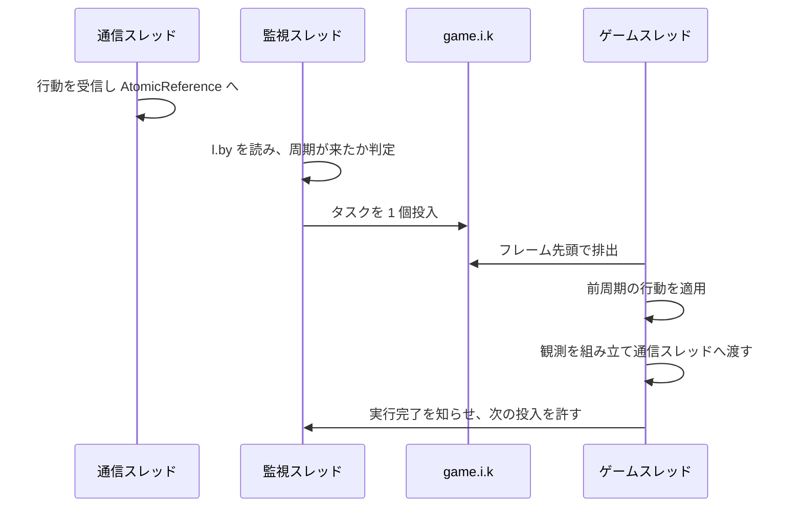
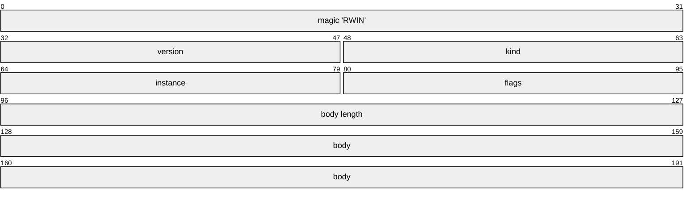
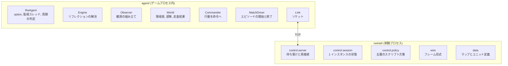

# 観測と行動の外部化

[04-model-design.md](04-model-design.md) の「次にやること」の第一項である。ゲームプロセスの中から観測を組み立てて外へ渡し、外から来た決定を命令として発行する経路を決める。経路が成立すること自体は計測エージェントで確認済みであり([02-runtime.md](02-runtime.md))、ここで決めるのは形である。

**この形式は実装済みである。** 実物は `agent/`(ゲームプロセス内)と `rwintel/`(制御プロセス)にあり、8 インスタンスまで接続してエピソードを回せる。

実行の確認は次のとおりである。2 インスタンス × 2 エピソード、Lake、内蔵 AI の Hard、打ち切りゲーム内 300 秒。

```
instance 0 episode 2 finished: 300s winner=-1 timeout=True edge=-0.228 standing=[{'team': 0, 'units': 30, 'value': 14700}, {'team': 1, 'units': 27, 'value': 23400}]
4 episode(s) over 2 instance(s)
value edge mean -0.270 sd 0.040
instance 0 handled 1461 observations
```

観測は 300 ゲーム秒に 1461 回、すなわち 4.87Hz で届いており、指定した 5Hz と一致する。ゲーム内 300 秒は実時間 26 秒で終わっており、倍率 10 が保たれている。

## 構成

制御プロセスは 1 つ、ゲームプロセスは 8 つである([03-throughput.md](03-throughput.md))。推論はインスタンスごとに持たせず集約すると決めてあるため([04-model-design.md](04-model-design.md) の制御の周期と計算量)、この非対称性は設計の前提であって選択ではない。

**接続はゲーム側から張る。** 制御プロセスが待ち受け、各インスタンスがクライアントとして接続する。インスタンスは学習の途中で落ちたり作り直されたりするが、制御プロセスは学習の一巡を通して生き続ける。長命な側を待ち受けにするのが素直である。


### 伝送路は TCP のループバックとする

理由は三つある。**Windows で使える。** 名前付きパイプは Windows 専用で、共有メモリは同期を自前で書くことになる。**両側に標準で存在する。** Java にも Python にも追加の依存が要らない。**後で機材を分けられる。** 合計 fps を上げる本質的な手段はコアを増やすことであり([03-throughput.md](03-throughput.md))、その先には別マシンへ出す形がある。ループバックでの実装がそのまま動く。

帯域は問題にならない。実測でユニット 120 体の観測は 4.8KB であり、戦術周期 5Hz で 8 インスタンスなら毎秒 190KB にしかならない。終盤にユニットが 500 体まで増えても毎秒 800KB である。

### スレッドの分担

**エンジンの状態に触るのはゲームスレッドだけである。** これは選択ではなく制約で、コマンドのプールが同期化されていないこと([../game/04-actions.md](../game/04-actions.md))と、マップの読み込みが OpenGL コンテキストを要求すること([../game/05-match-control.md](../game/05-match-control.md))から来ている。観測についても同じ理由が別の形で効く。監視スレッドから読むとシミュレーションの途中の状態を拾い、ユニットごとに時刻の揃わない断片的な観測になる。

したがって通信スレッドはソケットだけを持ち、ゲームスレッドとは単一要素の受け渡し口で交換する。通信スレッドが受け取った行動を `AtomicReference` に置き、ゲームスレッドが周期の頭で取り出す。**ゲームスレッドは通信を待たない。**

**ゲームスレッドの仕事を予約するのは、ゲームスレッド自身ではありえない。** エンジンのタスクキューは空になるまで排出されるため、自分自身を再投入する処理は同じフレーム内で再び取り出され、フレームが終わらない([../game/01-internals.md](../game/01-internals.md))。実装ではこれで一度ゲームを完全に停止させた。**周期が来たかどうかは監視スレッドが判断し、来ていればタスクを 1 個だけ投入する。** 前のタスクが終わるまで次は投入しない。

監視スレッドが読んでよいのはゲーム内時間 `l.by` だけである。これは予約の判断にしか使わない。世界の状態を読むのは依然としてゲームスレッドの仕事である。



### 観測の組み立ては安い

実測値である。ユニットを全件走査し、1 体あたり ID・座標・体力・最大体力・建造進捗・種別・所有者を読んで集計する処理を、ゲームスレッド上で 9 回繰り返した中央値を取った。

| 生存ユニット数 | 組み立て時間 | 1 体あたり |
| --- | --- | --- |
| 53 | 0.12ms | 2.19us |
| 68 | 0.04ms | 0.51us |
| 94 | 0.17ms | 1.76us |
| 106 | 0.06ms | 0.59us |
| 120 | 0.05ms | 0.40us |

初回に近いほど遅く、実行時コンパイルが効いた後は 1 体あたり 0.4 から 0.6 マイクロ秒に落ち着く。倍率 10 での 1 ステップは 33 ミリ秒のゲーム内時間、実時間で 3.3 ミリ秒であり、**ユニットが 500 体まで増えても組み立ては 0.3 ミリ秒程度**、戦術周期あたりの予算の 2 パーセントに満たない。

この値の意味は、**毎周期の全件走査を避ける工夫が要らない**ということである。差分の送出や領域単位の間引きは、観測の側では設計しない。プレイヤー別の索引が存在せず全件走査になる点([../game/03-observation.md](../game/03-observation.md))は、性能上の問題としては現れない。

再現するには次を実行する。

```powershell
.\tools\Start-RwProbe.ps1 -Count 1 -Speed 10 -Seconds 200 -Map Lake -AgentOptions 'obs=true'
```

## 周期と遅延

### 1 周期の遅れを固定する

**観測は周期 t に送り、そこから計算された行動は周期 t+1 に適用する。** ゲームスレッドは行動の到着を待たない。

待つ設計を採らない理由が決定的である。**待てば、実時間の負荷によって有効な方策が変わる。** 推論が間に合った周期では新しい行動が適用され、間に合わなかった周期では前の行動が保持される。どちらが起きるかは機材の混み具合で決まるため、学習時と運用時で環境そのものが変わる。試合が再現しない環境([../game/05-match-control.md](../game/05-match-control.md))で、さらに再現しない要因を足すことになる。

固定の 1 周期遅れなら、遅れは環境の性質として学習にも評価にも同じように入る。方策はそれを織り込んで学習する。

代償は 1 周期ぶんの陳腐化であり、戦術周期ならゲーム内 200 ミリ秒である。**エンジンの既定挙動が常に動いているため、この間ユニットが無反応になることはない。** 戦術層を介入として設計してあること([04-model-design.md](04-model-design.md))が、ここで効く。

副産物として、推論サーバは 1 周期をまるごとバッチングに使える。倍率 10 での戦術周期は実時間 20 ミリ秒であり、8 インスタンスの観測がその窓に散らばって届く。

### 周期の刻み

**周期はゲーム内時間で数える。ステップ数でも実時間でも数えない。**

ステップ数で数えてはいけない理由は、1 ステップが担うゲーム内時間が `1000 × H / fps` で決まる([../game/02-launch.md](../game/02-launch.md))ためである。倍率 10 では 33 ミリ秒だが倍率 1 では 3.3 ミリ秒であり、同じステップ数が同じゲーム内周期を意味しない。実時間で数えれば倍率を変えるたびにゲーム内周期が変わる。**ゲーム内時間 `l.by` の差分で判定すれば、倍率にも描画速度にも依存しない。**

| 層 | 周期 | ゲーム内周期 | 倍率 10 での実時間 | 倍率 10、300fps でのステップ数 |
| --- | --- | --- | --- | --- |
| 戦術 | 5Hz | 200ms | 20ms | 約 6 |
| 作戦 | 0.5Hz | 2000ms | 200ms | 約 60 |
| 内政 | 0.5Hz | 2000ms | 200ms | 約 60 |
| 戦略 | 0.1Hz | 10000ms | 1000ms | 約 300 |

**フレームは戦術周期ごとに 1 つだけ送る。** 作戦・戦略のブロックは、それぞれの周期に当たるフレームにだけ載せる。どのブロックが載っているかはフレーム内のビットで示し、受け手が周期表を知らなくても読めるようにする。

編成層は事象駆動だが、独立した経路は作らない。生産完了と部隊消耗はフレーム内の事象欄に載せ、制御側が作戦周期の処理の前に消化する。

## フレーム形式

固定長ヘッダと本体である。すべてリトルエンディアンとする。



| kind | 向き | 本体 | 内容 |
| --- | --- | --- | --- |
| `0x01` HELLO | ゲーム → 制御 | JSON | ゲームのビルド番号、インスタンス番号、ユニット種別表、プレイヤー枠、進行中のエピソード |
| `0x02` EPISODE | ゲーム → 制御 | JSON | エピソードの開始と終了、マップのパス、勝敗、経過 |
| `0x10` OBSERVATION | ゲーム → 制御 | 固定レイアウト | 下記 |
| `0x20` ACTION | 制御 → ゲーム | 固定レイアウト | 下記 |
| `0x30` CONTROL | 制御 → ゲーム | JSON | エピソードの開始と打ち切り、試合設定、領域表、シナリオ構築 |

**頻度の低いものは JSON、毎周期のものは固定レイアウトとする。** 静的表と制御は 1 エピソードに数回しか流れないので、可読性の利益が費用を上回る。観測と行動は毎秒 40 回流れるので、割り当てと解析を避けたい。

版番号はヘッダに置き、一致しなければ接続を拒否する。難読化されたフィールドの対応はゲームの更新で無効になりうるため([../game/01-internals.md](../game/01-internals.md))、静かに壊れるより接続を拒否する方がよい。ビルド番号を HELLO に載せるのも同じ理由で、`Main.m.e` から読める([../game/01-internals.md](../game/01-internals.md))。

### 種別表は起動時に完成する

HELLO の種別表には、価格・技術レベル・建物か・建設を行えるか・移動タイプに加えて、**射程・対空可否・対地可否・採掘施設か**を載せる。いずれも種別の実装から直接取れる([../game/06-content.md](../game/06-content.md))。ドクトリンによる分類([06-script-policy.md](06-script-policy.md))はこれらを見て行うので、名前による分類にはならない。

## 観測の内容

### 指揮下の戦力として定義する

**`n.T` の集計をそのまま自軍戦力として渡さない。** 人間や別の指揮者が部隊を引き取ってもユニットの所有プレイヤーは変わらないため、集計には残り続ける([04-model-design.md](04-model-design.md))。観測層は、集計値から他の指揮者が保持している分を差し引いて渡す。

これは観測の定義そのものであり、介入機能を足すときの後付けではない。後から入れると、介入していない試合では正しく動き、介入した試合だけ静かに劣化する。

### 全体ブロック

毎フレームに載る。

| 項目 | 型 | 出所 |
| --- | --- | --- |
| フレーム数 | `u32` | `l.bx` |
| ゲーム内時間(ミリ秒) | `u32` | `l.by` |
| エピソード番号 | `u32` | 制御側が与えた値 |
| このフレームに載るブロック | `u16` | 周期から決まるビット |
| 自プレイヤーのスロット | `u8` | `l.bs.k` |
| 資金 | `f32` | `n.o` |
| 収入 | `f32` | `n.v()` |
| ユニット数と上限 | `u16` x2 | 指揮下のユニット数と `n.T.a` |
| 建造中の数 | `u16` | `n.T.f` |
| 累積の撃破と喪失 | `u16` x4 | `l.bY.a(player)` の `c` `d` `f` `g` |

### 領域ブロック

作戦周期に載る。**24 スロットの固定長**とし、実在しない領域はマスクする。根拠は [領域の切り出し](#領域の切り出し) にある。

| 項目 | 型 | 意味 |
| --- | --- | --- |
| 有効か | `u8` | マスク |
| 中心座標 | `f32` x2 | ワールド座標 |
| 資源地点の数 | `u8` | 静的 |
| 自軍が押さえている資源地点 | `u8` | 自軍の `extractor` 系が乗っている数 |
| 敵が押さえている資源地点 | `u8` | 可視のもののみ |
| 自軍の戦力価値 | `f32` | 領域内の指揮下ユニットの価格合計 |
| 敵の戦力価値 | `f32` | 可視の敵ユニットの価格合計 |
| 最後に敵を見た時刻 | `u32` | ゲーム内時間 |
| 自拠点からの距離 | `f32` | 最初の自軍建物からの距離。ゲーム側が計算する |

**固定長は「実在する数だけ詰める」より優先する。** スロット番号が周期をまたいで同じ場所を指すことが、方策が決定をまたいで状態を持てる条件である。詰めた並びにすると、領域が一つ増えた瞬間に全ての番号がずれる。部隊ブロックも同じ理由で固定長である。

### 部隊ブロック

戦術周期に載る。**8 スロットの固定長**とする。上限を固定するのは作戦層の行動空間を固定するためであり、編成層はこの上限を守る責任を負う([06-script-policy.md](06-script-policy.md))。

| 項目 | 型 | 意味 |
| --- | --- | --- |
| 有効か | `u8` | マスク |
| 部隊識別子 | `u16` | 生存期間を通じて不変 |
| 指揮者 | `u8` | ビットで持つ。1 が作戦を人間が握っている、2 が戦術を人間が握っている |
| 構成ユニット数 | `u8` | |
| 現有価値 | `f32` | 所属ユニットの価格合計 |
| 編成時価値 | `f32` | 消耗の分母。増援で更新されるため、その部隊が持った最大値である |
| 重心座標 | `f32` x2 | |
| 散らばり | `f32` | 重心からの距離の標準偏差 |
| 任務種別 / 交戦スタンス / 目標領域 / 任務状況 | `u8` x4 | 現在の契約と、その帰結 |
| 許容損害 | `f32` | 契約の `cost_budget` |
| 許容損害の比 | `f32` | 同じ値を指揮下の総価値で割ったもの |
| 期限 / 発行時刻 | `u32` x2 | ゲーム内時刻 |
| 任務開始からの実損害 | `f32` | `cost_budget` との比較用 |

**`cost_budget` は絶対値と比の両方を載せる。** 契約としての意味は絶対値にあり([06-script-policy.md](06-script-policy.md))、学習に渡す入力としての尺度は比にある。契約の意味と入力の尺度は別の問題なので、変換を受け手に任せず両方を送る。

**指揮者は部隊ごとに層の単位で持つ。** 人間が作戦だけを引き取る形が最も有用であると決めてある([04-model-design.md](04-model-design.md))以上、これは真偽の一つではなく層ごとのビットになる。

### ユニットブロック

戦術周期に載る。**指揮下のユニットと、可視の敵ユニットだけ**を載せる。

| 項目 | 型 | 出所 |
| --- | --- | --- |
| ユニット ID | `u32` | `w.eh` の下位 |
| 所属部隊 | `u16` | 未配属と敵は無効値 |
| 種別番号 | `u16` | 種別表の索引 |
| 座標 | `f32` x2 | `w.eo` `w.ep` |
| 体力と最大体力 | `f32` x2 | `am.cu` `am.cv` |
| 攻撃目標 | `u32` | `y.ab()` の ID。無ければ 0 |
| 被弾からの経過 | `u16` | `l.by - am.bs` を上限で切る |
| 建造進捗 | `u8` | `am.cm` を 0 から 255 に写す |
| 現在の命令 | `u8` | `y.ar()` の種別 `au.a` を `av` 中の位置で表す。命令が無ければ 255 |
| 交戦スタンス | `u8` | `y.P` |
| 敵か | `u8` | |

**未配属の自軍ユニットも載せる。** 戦術層の観測は担当部隊の周辺に限られるが、部隊に属さない自軍ユニットを外すと、**編成層が部隊を組む材料と、内政層が命令を出す相手が観測から消える**。編成の規則は「未配属ユニットがドクトリンの最小構成を満たしたら部隊を作る」であり([06-script-policy.md](06-script-policy.md))、内政の生産と建設は工場と建設機を ID で指す。載せないのは**他の指揮者が保持しているユニット**であって、部隊に入っていないユニットではない。

**チーム番号が負のものは載せない。** 樹木などの風景は中立の所有者に属し、チーム番号が負である。「自軍でない = 敵」と読むと盤面の樹木が全て敵ユニットとして報告され、戦術層は試合の間ずっと木を撃つことになる。

### 事象ブロック

作戦周期に載る。編成層は事象駆動だが独立した経路は作らず、フレームの中に欄を持つ([周期の刻み](#周期の刻み))。制御側は作戦周期の処理の前にこれを消化する。

| 項目 | 型 | 意味 |
| --- | --- | --- |
| 種別 | `u8` | 1 が生産完了、2 が喪失、3 が部隊の消耗 |
| 部隊 | `u16` | 関係する部隊。無ければ無効値 |
| ユニット | `u32` | 関係するユニット |
| 種別番号 | `u16` | 種別表の索引 |
| 価値 | `f32` | 生産完了と喪失では価格、消耗では部隊の現有価値 |

**送出と同時に消す。** 事象は変化の報告であり、二度届く変化は起きなかった変化である。

### 霧の扱い

**全知と可視の切り替えは観測の内容の問題であって、経路の問題ではない。** 当面は全知で足場を作るが、戦術層から上へ敵情を返す経路は最初から通す([04-model-design.md](04-model-design.md))。

実装上は、可視のときだけ `am.d(n)` の判定を通す一箇所の切り替えとする。全知のうちは同じ値が上位層でも直接取れるので、経路が正しく機能しているかを突き合わせで検証できる。

## 領域の切り出し

上位層が指す場所は生の座標ではなく離散の領域とする([04-model-design.md](04-model-design.md))。その切り出し方をここで決める。

### 決めたこと

**資源地点と出撃地点を種として、ワールド距離 400 で単連結の凝集を行う。ただし出撃地点を含むクラスタ同士は融合しない。**

資源はゲームオブジェクトではなくマップタイルの属性であり、マップファイルでは `res_pool` の属性を持つタイルである([../game/06-content.md](../game/06-content.md))。したがって領域はマップから機械的に切り出せる。

**融合距離 400 はユニットの届く範囲から決めた。** タイルは 20 ワールド単位、視界の既定値は 15 タイルすなわち 300 ワールド単位、戦車の射程は 130 である。400 は 1 個の部隊が覆える広さの内側にあり、採掘施設 1 基の占有範囲よりは十分に大きい。実測でも、切り出された領域の半径は 95 パーセント点で 268 に収まる。

**出撃地点同士を融合させないのは、2 人の本拠地を含む領域が「攻める場所」としても「守る場所」としても意味を持たないからである。**

### 領域の数を固定せず、距離を固定する

先に領域の数を決めて、その数になるまで凝集させる方法も試した。**採らない。** 大きなマップでは、数を合わせるために領域が育ち続け、盤面の 3 分の 1 を覆う「領域」ができる。1 個の部隊が押さえられる場所ではない。実測では 16 個に固定した場合、最大半径が 161 タイルすなわち 3200 ワールド単位に達したマップがあった。

距離を固定すると領域の数がマップごとに変わるが、**行動空間はスロット数を固定してマスクすれば固定できる。** 変えてはいけないのは領域の意味であって、数ではない。

### 実測: 組み込み 48 マップの領域数

| 融合距離 | 領域数の中央値 | 最小 | 最大 | 半径の 95 パーセント点 | 24 以下に収まるマップ |
| --- | --- | --- | --- | --- | --- |
| 200 | 16.0 | 4 | 59 | 110 | 34/48 |
| 300 | 15.0 | 4 | 55 | 179 | 34/48 |
| **400** | **13.5** | **4** | **39** | **268** | **39/48** |
| 500 | 12.0 | 4 | 37 | 400 | 42/48 |
| 600 | 10.0 | 4 | 31 | 547 | 42/48 |

距離 400 でのプレイヤー数別の内訳である。

| マップの人数 | マップ数 | 領域数の中央値 | 最小 | 最大 |
| --- | --- | --- | --- | --- |
| 2 | 9 | 9 | 4 | 17 |
| 3 | 2 | 6.5 | 6 | 7 |
| 4 | 10 | 9 | 4 | 20 |
| 6 | 3 | 11 | 10 | 12 |
| 8 | 15 | 16 | 11 | 37 |
| 10 | 9 | 27 | 17 | 39 |

**スロット数は 24 とする。** 学習は 1 対 1 から始めるので対象は 2 人用マップであり、最大でも 17 である。4 人用まで含めても 20 に収まる。24 を超えるのは 8 人用と 10 人用の 9 マップだけで、これらは当面の対象外とする。

### 領域の並び順

領域の識別子は中心座標の順で振り、実行ごとに変わらないようにする。**各層に渡すときは自拠点からの距離順に並べ替える。** スロット 0 が常に本拠地で、後ろへ行くほど外側になる。マップが変わっても位置の意味が保たれ、学習した方策が別のマップで読める。

**並べ替えるのは各層へ渡すときであって、線上ではない。** 自拠点は、建物が建つまで分からない。領域表はエピソードの開始時に送るため、その時点では並べ替えられない。加えて、本拠地が広がるたびに線上のスロット番号が振り直されると、**スロットの意味を学習した方策の足場が試合の途中で動く**。したがって線上はマップ由来の番号のままとし、制御プロセスが層へ渡すところで並べ替える。自拠点からの距離は観測の領域ブロックに載っており、ゲーム側が最初の自軍建物の位置から計算する。

### 資源地点の位置は制御プロセスから渡す

資源地点はマップタイルのフラグであり、実行中のプロセスには対応するオブジェクトが存在しない([../game/06-content.md](../game/06-content.md))。採掘施設が建つまで、その位置には何も無い。

したがって**領域表と一緒に資源地点の位置も送る**。各点は座標と所属領域の三つ組であり、ゲーム側はその位置と完成した採掘施設を突き合わせて占有を数える。採掘施設かどうかは種別の `placeOnlyOnResPool` で判定する。**近くにある建物なら何でも数えるのは誤りである。** 資源地点の脇に建てた壁や砲台が占有として数えられ、しかも最初に見つかった一つで打ち切られるため、本物の採掘施設が隠れる。

### 道具

領域の切り出しはゲームを起動せずに行える。マップファイルはエンジンが読むのと同じものである。

```powershell
python tools\Show-MapRegions.py
python tools\Show-MapRegions.py --distances 300 400 500
python tools\Show-MapRegions.py --json local\regions.json
```

**切り出しは制御プロセス側で行い、結果をゲーム側へ渡す。** ゲーム側は HELLO と EPISODE で現在のマップのパスを報告するだけで、制御プロセスが `tools/rwdata` で領域表を作り、CONTROL で送り返す。ゲーム側はそれを使って観測の領域ブロックを埋める。

逆向き、すなわちゲーム側で切り出して HELLO に載せる形は採らない。切り出しを Java でも実装することになり、同じ規則の実装が二つになる。**規則が一つの実装に収まっていれば、ゲームを起動せずに検証できる**という利点も失われる。

## 行動の内容

行動は 4 つの区画からなる。部隊の編成、契約の書き換え、戦術の逸脱、生産と建設である。区画ごとに件数を前置し、空の区画は「何も変わらない」を意味する。

### 部隊の編成

編成層が決めた所属である。部隊識別子、指揮者、構成ユニットの一覧を送る。**空の一覧は解散を意味する。** 指揮権の移動もここを通る。

### 契約の書き換え

作戦周期に載る。部隊ごとに 1 件で、項目は [06-script-policy.md](06-script-policy.md) のタスク契約と同じである。`cost_budget` は `f32`、`deadline` と `issued_at` はゲーム内時刻の `u32` である。

**同じ契約を送り直さない。** 契約の発行は実損害を測る起点を引き直す。毎周期送り直せば、どれだけ失っても実損害はゼロのまま報告される。ゲーム側は任務種別・スタンス・目標領域・発行時刻のいずれかが変わったときだけ発行として扱い、制御側も変化がなければ送らない。

### 戦術の逸脱

戦術周期に載る。**部隊ごとに 1 つの逸脱を選ぶ。ユニットごとには選ばない。** 推論の回数が部隊数で決まり、ユニット数では決まらなくなる。逸脱の集合は [06-script-policy.md](06-script-policy.md) にある。

**契約とは別の区画に置く。** 周期が違うためである。同じ構造体に同居させると、遅い側の決定が速い側の周期で再送されることになり、上の理由で実損害が測れなくなる。

### 生産と建設

内政周期に載る。生産は特殊アクションとして発行する([../game/04-actions.md](../game/04-actions.md))。識別子は `"u_" + 種別の内部名` だが、**この内部名は種別を引くときの名前とは違うことがある**([../game/06-content.md](../game/06-content.md))。種別表には両方を載せ、行動の側は種別番号で指し、発行の直前にゲーム側で内部名へ直す。

### 命令は束ねて発行する

コマンド 1 つに複数のユニットを詰められる([../game/04-actions.md](../game/04-actions.md))。**同じ命令を受け取るユニットは 1 つのコマンドにまとめる。** 部隊単位で逸脱を決める設計とかみ合っており、通常は部隊あたり 1 コマンドに収まる。

## エピソードの制御

制御プロセスがエピソードの境界を決める。ゲーム側は指示を受けて、[../game/05-match-control.md](../game/05-match-control.md) の手順でサーバを組み直す。

| 指示 | 内容 |
| --- | --- |
| `start` | マップ、対戦者の数と難易度、開始クレジット、開始ユニット、収入倍率、霧、乱数種 |
| `regions` | 領域表と資源地点。ゲーム側が報告したマップから制御プロセスが作って返す |
| `abort` | ゲーム内時間の上限などによる打ち切り |
| `speed` | 倍率 `H` の変更 |
| `omniscient` | 全知と可視の切り替え |
| `scenario` | 交戦状況の構築。サンドボックスの切り替えと、生成するユニットの一覧 |

対戦者の指定には注意が要る。**部屋は空き枠を AI で埋めるため、必要な数だけ足すのではなく余分を観戦者へ外す**([../game/05-match-control.md](../game/05-match-control.md))。また既存のプレイヤーを AI に差し替えることはできない。

### シナリオ構築

戦術層の学習は試合を回さずに交戦状況を構築して行うと決めてある([04-model-design.md](04-model-design.md))。`scenario` はそのための指示であり、生成するユニットを種別・プレイヤー枠・座標・数の四つ組で並べる。生成はシステム命令 `u=5` で行い、**実際にユニットが生成されることを実行時に確認した**。

```
spawn: resolved 'mammothTank' to com.corrodinggames.rts.game.units.custom.l reporting name 'c_mammothTank'
spawn: submitted mammothTank at (1308,451) for a@355c5eb7, units before=26
spawn: c_mammothTank alive=1 nearestToTarget=230 unitsNow=31 (was 26)
```

ゲーム側のログにも `system command spawn` が残り、状態への直接代入ではなく正規のコマンド経路を通っている。再現の手順は [../game/04-actions.md](../game/04-actions.md) にある。

**盤面を消す指示は置かない。** ユニットを取り除くコマンドがゲームに存在しないためである。システム命令は生成・降参・再同期の三つしかなく、体力への代入で消すのはロックステップを壊す近道そのものである([04-model-design.md](04-model-design.md))。代わりに、**シナリオのエピソードは開始ユニットを持たない設定で始め**、そこへ必要なものだけを生成する。消す必要が生じないようにするのが、消す手段を捏造するより正しい。

**サンドボックスのフラグ `l.bv` を同じ指示で切り替える。** これが立つと全プレイヤーのユニットを操作できるため、1 プロセスで交戦の両側を動かせる([../game/05-match-control.md](../game/05-match-control.md))。

**ただしロックステップの同期を壊さないことは依然として未検証である。** 単独プレイで動くことと、複数プロセスを接続した状態で同期が保たれることは別である。これはプロセスを 2 つ接続できるようになってから確かめる。

## 接続が切れたとき

**縮退先を持たせる。** 制御プロセスが落ちても、ゲーム側は最後に受け取った契約を保持し、部隊は割り当てられた目標へ指定されたスタンスで進み続ける。エンジンが経路探索と自動交戦を担うため、これは無操作ではなくそこそこの戦術になる([04-model-design.md](04-model-design.md) の戦術は介入として設計する)。

**ゲーム側は接続を張り直し続ける。** 1 秒ごとに接続を試み、通ったら HELLO からやり直す。その間もエピソードは走り続け、部隊は最後に受け取った契約の上にいる。

**制御プロセスは待ち受けをやめない。** 全インスタンスが接続した後も受け付け続け、届いた接続が新しいインスタンスなのか戻ってきたインスタンスなのかは HELLO の中のインスタンス番号で決める。既に知っている番号なら、それまでの状態を保ったまま接続だけを差し替える。

**エピソードの途中で戻ってきた場合、エピソードを始め直さない。** HELLO はエピソード番号と進行中かどうかを載せており、進行中なら制御側は領域表を送り直して方策を組み直すだけにする。始め直せば、エージェントが独力で進めていた試合を捨てることになる。部隊が契約のフィールドではなく生存期間を持つ実体であること([04-model-design.md](04-model-design.md))が、ここでも効く。

## 実装



| 段階 | 状態 |
| --- | --- |
| フレーム形式と HELLO | 実装済み。版番号が一致しなければ接続を拒否する |
| 観測の送出 | 実装済み。全体・領域・部隊・ユニット・事象の全ブロック |
| 行動の受信 | 実装済み。部隊の編成、契約、逸脱、生産と建設の 4 区画 |
| エピソードの制御 | 実装済み。開始、打ち切り、勝敗の報告、次のエピソード |
| シナリオ構築 | 実装済み。サンドボックスの切り替えと `u=5` による生成 |
| 再接続 | 実装済み。ゲーム側は張り直し、制御側はインスタンス番号で元の状態へ戻す |

形式の両側が食い違わないよう、ブロックの大きさは `tests/test_wire.py` で固定してある。Java 側は手で書き出しているため、片側だけに欄を足してもコンパイルは通ってしまい、ずれた解釈がもっともらしい観測に化ける。

```powershell
python tests\test_wire.py
python -m rwintel.control --instances 2 --episodes 2 --map Lake --max-seconds 300
.\tools\Start-RwAgents.ps1 -Count 2 -Speed 10
```

制御プロセスを先に起動する。エージェントは接続できるまで待ち、接続してから初めてエピソードが始まる。
