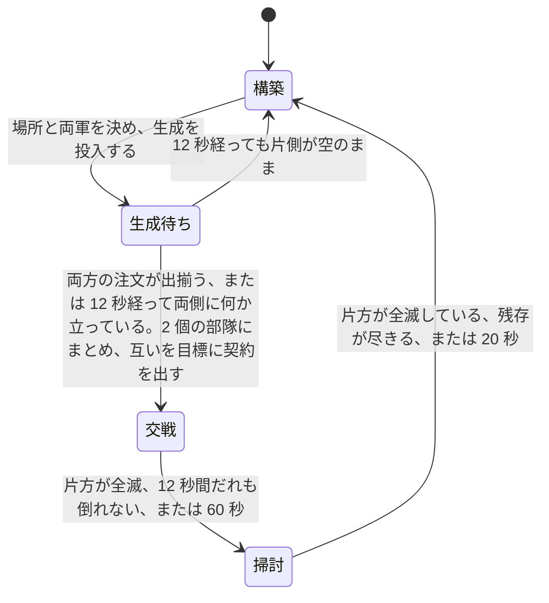

# 学習環境

[04-model-design.md](04-model-design.md) が指す「具体の形式と値」の四つ目である。[05-interface.md](05-interface.md) が観測と行動の運び方を、[06-script-policy.md](06-script-policy.md) が契約と全層のスクリプトを、[07-evaluation.md](07-evaluation.md) が二つの方策の比べ方を決めた。この文書は、**学習させる 2 層を実際に当てはめるために先に存在していなければならなかったもの**を書く。符号化、行動空間、報酬、交戦アリーナ、推論の集約、軌跡の収集、最適化、そしてスクリプトを写して出発点にする仕掛けである。

**環境は実装済みである。** 実物は `rwintel/learn` にあり、`python -m rwintel.learn` で動く。性質は `tests/test_learning.py` で固定してある。

**方策を学習させた実行はいくつもあるが、手書きの層を上回った方策は一つも無い。** 手書き層を模倣しただけの方策、そこから強化学習を進めた三つの設定、そのうち一つを二度続けて延長したもの、乱数から始めたものを、いずれも決闘で手書き戦術層と比べてある。上回って見えたものが二つあり、**どちらも選択に使っていない乱数種で測り直すと消えた**。二度あったことがこの夜の主要な所見である。この文書に方策の強さに関する主張は一つもない。

**そのうえで、動かせる幅そのものを測ってある。** 手書き層と**同じ交戦を戦わせて交戦ごとに対にする**と、契約から一度も逸脱しない方策(常に hold、エンジンの `attackMove` だけが戦いを進める)は **-0.0555 と -0.0423**(二つの乱数種、2 標準誤差 0.025 と 0.028)で、手書き層(定義により 0)より下にある。**逸脱をどう選ぶかという問題が取り合っている幅は、下へ 0.05 ほどである。** そのうえで行動空間を 5 つから 7 つに広げたが、7 つで学習した方策も同じ種の基準線を引くと手書き層を上回らなかった(対にした差 -0.006、区間 ±0.034)。**天井は広げても測れるほど上がらなかった**([次に試すこと](#次に試すこと))。

**そして、その幅のほとんどは一行の規則で取れる。** 接敵したら必ず離れる方策(常に withdraw)を同じやり方で測ると **-0.0043、区間 ±0.029** であり、**手書きの梯子と区別が付かない**([未検証のもの](#未検証のもの))。梯子が確かに上回っているのは「一度も離れない」に対してだけである。**学習した層が上回るべき相手は、実際には規則の梯子ではなく「接敵したら離れる」の一行である。**

**これらは測り直した値である。** 似た数字は前にも出ていたが、そのときの区間は 30 倍から 50 倍狭すぎ、withdraw については符号の判定まで違っていた(-0.0418 で「下にある」と読んでいた)。アリーナがエピソードごとに同じ交戦を引き直していたためで、交戦 2000 件の実行が実際に引いていた交戦はおよそ 50 種類だった([エピソードごとに交戦を引き直す](#エピソードごとに交戦を引き直す))。**直してある。**

**環境の側は六つの点で間違っていたことが測って分かり、六つとも直して測り直してある。** 相手側が内蔵 AI として自分の試合をしていたこと、両軍が射程の外で向かい合って止まっていたこと、一つの用務に終端が繰り返し発火していたこと、組んだ交戦の 3 割が現れないまま捨てられていたこと、エピソード最初の交戦に自陣の司令部が紛れ込んで部隊を発注額の 1.35 倍にしていたこと、そして**エピソードごとに同じ交戦を引き直していたこと**である。最後の一つは他の五つと種類が違う。**盤面が壊れていたのではなく、標本の数が 30 倍から 50 倍水増しされていた。** それまでにアリーナが「左右に傾いている」と告げていた測定は、六つ目を直した目で読むと**一つも成立していない**。数字は [未検証のもの](#未検証のもの) に、何が分かっていないかと並べて正確に書く。

## 学習方策はスクリプト方策の 1 メソッド置換である

先にこの一点を置く。以降のすべてがここに依存する。

学習する層は、スクリプト層を継承し、**決定を下す一つのメソッドだけを差し替えたもの**である。戦術層なら「逸脱のどれか」、作戦層なら「どの領域へ、どのタスクで」だけが置き換わる。任務状況の報告、実損害の切り出し、契約を出し直す条件、期限の付け方、許容損害の見積もりは、いずれも継承したスクリプトのコードがそのまま動く。

こうする理由は [04-model-design.md](04-model-design.md) の「凍結した相手に対して独立に学習・評価できること」である。学習層とスクリプト層が決定以外でも違っていたら、多数エピソード平均でスクリプトを上回ったという結果が「決定が良くなった」ことを意味しない。**再実装ではなく継承にしてあるのは、規則の写しが二つに増えて片方だけ動くことを構造で禁じるためである。**

副産物が一つある。**決定器を渡さない**と、その層は継承した規則にそのまま落ち、選ばれた行動を観測とともに書き出すだけになる。スクリプトがそのまま教師になり、出てくるのは学習層が出すのと同一形式の「状態と行動」の対である。人間のリプレイからは状態を復元できない([04-model-design.md](04-model-design.md))が、スクリプトからは無制限に取れる。

## 観測の符号化

層ごとに別の抽象度で切り出す。戦術層は担当部隊の交戦だけを、作戦層は盤面と領域と部隊だけを見る。規則は二つで、どちらも設計上の要求から来ている。

**すべての特徴は比か、明示した尺度で割った長さである。** 生のクレジット残高も生のワールド座標も一つも入れない。これは学習したい性質ではなく、成立の条件である。座標を入れればマップ寸法に方策が縛られ、クレジットの絶対値を入れれば「序盤の 2000」と「終盤の 2000」を別物として扱えない。**別のマップで読める方策**であることは [04-model-design.md](04-model-design.md) が領域を離散 ID にした理由そのものであり、符号化の側で崩したら意味がない。

**すべてのブロックは有効フラグ付きの固定長で、詰めた並びにしない。** 領域は 24 スロット、部隊は 8 スロットで、実在しないスロットは全ゼロになる。理由は [05-interface.md](05-interface.md) の観測ブロックと同じで、**スロット番号が決定をまたいで同じ場所を指すこと**が、方策が決定をまたいで状態を持てる条件だからである。詰めた並びにすると、部隊が 1 つ死んだ瞬間に残り全部の番号がずれる。

### 尺度

| 量 | 尺度 | 根拠 |
| --- | --- | --- |
| 距離(部隊から目標領域へ) | 2000 | 領域の融合距離が 400、試合の盤面は数千。普通の行軍が 1 の近くに来る |
| 距離(本拠地から) | 4000 | 上の 2 倍。盤面の端まで含める |
| 射程 | 400 | 組み込みの武装可動ユニットの射程の最大値([../game/06-content.md](../game/06-content.md)) |
| 散らばり | 400 | 交戦の近傍を切る半径と同じ(下記の 58 次元)。ゲーム側が散開させる距離は 140 だが、そこへ尺度を合わせると散開しただけの部隊がちょうど 1 に来て頭打ちになり、それより崩れた部隊と区別が付かなくなる |
| 部隊の人数 | 12 | ドクトリンの定数は最大で 10([06-script-policy.md](06-script-policy.md))。満員が 1 の手前に来て、増援で膨らんだ部隊がその上に出る |
| 時間(期限・任務の経過) | 60000ms | 戦術の報酬地平が 10 秒から 60 秒([04-model-design.md](04-model-design.md))、作戦の任務が数分。両方にとって 1 分が自然な単位 |
| 試合時間 | 1200000ms | 「どれだけ遅いか」を言う 1 個の特徴のためだけの尺度 |
| クレジット | 5000 | 開始クレジットが 4000。回っている経済はここから大きく上へは行かない |
| 収入 | 100/秒 | 十分に拡張した側が届くあたり |

二つの戦力を比べる特徴はすべて `自 / (自 + 敵)` の形にしてある。**どちらが上かは言うが、何クレジット上かは言わない。** 両方が 0 のときは 0.5 を返し、盤面が空でも符号化が壊れないようにしてある。アリーナのエピソードは第 1 フレームがまさに空の盤面なので、ここで 0 除算すると最初の交戦を組む前に実行が終わる。

### 戦術の切り出し: 58 次元

継承したスクリプト戦術層が逸脱を選ぶときに手元に持っているものと、**厳密に同じ材料**である。学習層が余分に見ていたら、それはスクリプトの置換ではなく別の層であり、[07-evaluation.md](07-evaluation.md) の比較が「同じ仕事をしている二つ」の比較にならない。

| 区分 | 幅 | 中身 |
| --- | --- | --- |
| 部隊の状態 | 9 | 人数、健全度、散らばり、平均体力、直近 2 秒以内に被弾した割合、予算の消化率、許容損害と現有価値の比、期限までの残り、任務の経過 |
| 任務状況 | 5 | 進行中 / 膠着 / 劣勢 / 完了 / 期限切れ の one-hot |
| 任務種別 | 6 | 攻撃 / 防衛 / 襲撃 / 後退 / 護衛 / 包囲 の one-hot |
| 交戦スタンス | 7 | `game.units.a` の 7 種の one-hot |
| 目標領域 | 5 | 距離、単位方向ベクトル 2、領域内の勢力比、敵価値と自部隊価値の比 |
| 交戦の規模 | 2 | 近傍の敵の数、敵と自軍の価値比 |
| 敵の構成 | 7 | 役割別の価値シェア |
| 自軍の構成 | 7 | 同じ役割別の価値シェア |
| 射程 | 3 | 自軍の最短射程、敵の最長射程、その差 |
| 交戦の形 | 3 | 自軍射程内にいる敵の割合、敵射程内にいる自軍の割合、砲兵の有無 |
| 残り | 4 | 交換比、被弾中か、接敵中か、バイアス項 |

近傍の敵は半径 400 で切られたものが渡ってくる。切るのは継承したスクリプト戦術層であり、符号化はそれを受け取るだけである。役割は装甲・砲・対空・高速・建設・建物・その他の 7 種で、**種別の属性から機械的に分類する**([06-script-policy.md](06-script-policy.md))。名前では分類しない。

**特徴には名前が付けてある。** 数えるだけにしないのは、1 つずれた特徴ベクトルは落ちずに学習し、別のマップで無価値になるからである。落ちるなら気付く。落ちないから名前で固定し、名前の数とベクトルの長さが一致することを試験で押さえている。

### 作戦の切り出し: 400 次元

| ブロック | 1 スロットの幅 | スロット数 | 計 |
| --- | --- | --- | --- |
| 全体 | 16 | 1 | 16 |
| 領域 | 10 | 24 | 240 |
| 部隊 | 18 | 8 | 144 |

全体ブロックは資金、収入、ユニット上限に対する余裕、建造中の数、戦略層の姿勢 5 種の one-hot、攻勢か守勢か、許容総損害と自軍価値の比、軍事価値の優劣、領域支配の優劣、経過時間、部隊数、バイアス項である。

領域ブロックは有効フラグ、資源地点の数、自軍が押さえた数、敵が押さえた数、勢力比、敵価値と自軍総価値の比、本拠地からの距離、直近 60 秒に敵を見たか、戦略層が付けた優先度、出撃地点か。

部隊ブロックは有効フラグ、ドクトリン 4 種の one-hot、自軍全体に対する価値シェア、健全度、散らばり、本拠地からの距離、任務状況 5 種の one-hot、他の指揮者が保持しているか、この層が任務を出せるか、予算の消化率、任務の経過である。

**出撃地点かどうかだけは観測から来ない。** 線上の領域行にその欄がないためで、値はマップファイルから作った領域表([05-interface.md](05-interface.md))を持つ制御プロセス側で埋める。「資源のある場所」と「敵が湧いてきた場所」の違いは他のどの特徴も言わないので、落とせない。

## 行動空間とマスク

**戦術層は逸脱から 1 つを選ぶ。** もとは 5 つ、`hold` `withdraw` `focus` `spread` `kite` で、いまは 2 つ足して 7 つである:完全に離脱する `withdraw_far` と、最弱でなく最も射程の長い在射程敵に集中する `focus_threat`。[06-script-policy.md](06-script-policy.md) が決めた集合であり、足した 2 つは、既にスクリプトが行っていた種類の動きに、規則が決めていたパラメータ(どれだけ引くか・誰に集中するか)を層に渡したものである。部隊単位で 1 つで、ユニット単位では選ばない。

**作戦層は領域 24 とタスク 6 を選ぶ。** 144 通りの積として出さず、二つの頭に分ける。理由は二つある。**問われている質問が別だから**である。どこへ行く価値があるかと、着いたら何をするかは、別の理由で決まる。そして**合法集合が二つの小さなマスクの積だから**である。積空間の上のマスクは疎になり、144 個の出力の大半が常に死んでいる形になる。

マスクは三つあり、出所がそれぞれ違う。

| マスク | 何を落とすか | 出所 |
| --- | --- | --- |
| 領域 | このマップに実在しない領域スロット | 制御プロセスが作った領域表。実在する ID の集合 |
| タスク | そのドクトリンに許されていないタスク | スクリプト方策のドクトリン表。前衛は攻撃と包囲、守備は防衛と護衛、襲撃は襲撃と後退、工作は空 |
| 部隊 | 存在しない、空、他者が保持中、ドクトリンにタスクがない部隊のスロット | 部隊の記録そのもの |

**戦術層にはマスクがない。5 つは常にすべて合法である。** 順調な戦闘から後退するのは悪手であって違法ではなく、「妥当な逸脱」だけを通すマスクを書いたら、それは規則の梯子をマスクの姿で書き直したものになる。判定させたいものを環境の側で先に判定してしまっては、何も学習しない。

**工作ドクトリンのタスク集合が空**なのは、建設機に契約が落ちないようにするためである。落ちると、建物を建てに歩いている最中の建設機が引き剥がされ、建てかけの建物がまるごと損失になる。

部隊マスクは、決定の経路では実際には参照されない。継承した作戦層が決定に入るより前に、ドクトリンにタスクの無い部隊と他者が保持している部隊を落としているためである。マスクの実装は同じ規則を独立に書き下したもので、試験がその一致を押さえている。**将来この層をスクリプトから切り離すときに必要になるものを、先に置いてある。**

マスクの掛け方は、ロジットに大きな負の下駄を履かせる形にしてある。あとから正規化し直す形は採らない。**下駄なら違法な行動に勾配が一切行かず、正規化だと消えかけの勾配が行く。**

## 報酬

一般則は [04-model-design.md](04-model-design.md) が既に述べている。**各層は、上位から受け取った契約の達成度で払われる。試合の勝敗を受け取るのは最上位の戦略層だけである。** これを具体にする。

**下位層は上位層の報酬を一切見ない。** これが層をまたいだ信用割り当てを不要にし、同時に戦術の報酬地平を任務の長さ、すなわち 10 秒から 60 秒に閉じる。この予算で学習できる地平はその長さだけである。

### 周期ごとの連続量はすべてポテンシャル整形に入れる

整形項を `γ × 後のポテンシャル - 前のポテンシャル` の形にすると、**終端状態のポテンシャルを 0 とみなす限り、ポテンシャルが何であっても最適方策が変わらない**。これが決定的な性質である。ポテンシャルの選び方を間違えても、失うのはサンプル効率だけで、正しさは失わない。逆に、この形でない周期ごとの連続報酬を足すと、間違ったときに「最適な方策そのものが変わる」という直しようのない壊れ方をする。

したがって、**周期ごとに動く連続量はすべてポテンシャルに入れ、直接払うのは任務が終わったときの一度きりの支払いだけ**にした。終端の支払いが連続量であっても構わない。整形の議論が禁じているのは各周期に足される連続報酬であって、軌跡に一度だけ乗る終端は報酬関数そのものの定義であり、伸縮する項ではないからである。

**Φ(終端)=0 は規約であって観測ではない。** 整形が無害なのは、1 本の軌跡にわたって和が伸縮して消えるからである。最後の一項が `γ × 0 - Φ(最後の状態)` でなければ和は `Φ(最後の状態)` の残差を残し、残差は最後の状態に依存するので**まさに最適方策を動かす**。終端状態のポテンシャルは定義されていない量なので、0 と決めるのはこちらの仕事である。整形の割引と収益の割引を同じ 0.99 にしてあるのも同じ議論の一部で、**ここがずれると整形が伸縮せず、残差が最適方策を動かす。** ポテンシャル整形を選んだ唯一の理由が消えるので、二箇所に同じ値を置いてある。

**規約は軌跡が閉じるすべての経路で守る。** 契約自身の結末(完了・期限切れ・劣勢・全滅)が発火した周期も、アリーナが交戦を打ち切って外から閉じる周期も、その周期に払う整形項は `0 - 保持していた Φ` であって、実際の `γΦ(s')` ではない。効き方が最も大きいのは完了で、領域を取った盤面はポテンシャルの上端に近いから、`γΦ(s')` を残すと完了が定義より 0.67 ポイントほど高く見え、しかも**予算をどれだけ使ったかによってその上乗せ額が変わる**。終端によって上乗せが変わるというのは、整形が持ってはならない性質そのものである。

ポテンシャルも比で書く。戦車 4 両を巡る任務と 40 両を巡る任務は同じ任務であり、軍の大きさとともに報酬が育つと、同じ振る舞いが試合の後半ほど高く売れることになる。

### 戦術層

ポテンシャルは三つの和である。目標領域に立てているか(重み 0.35)、許容損害をまだ使っていないか(0.15)、そして**契約が出てから壊した価値と失った価値の比**(0.5)である。三つ目が最も重いが、**重いのは重要だからではなく、信用割り当てがそれを要求するからである。**

戦術速度で 1 つの用務はおよそ 125 決定の長さになる(毎秒 5 決定で 25 秒)。割引 0.99 と GAE の trace 0.95 のもとで、交戦の終わりに払われる終端が最初の決定に届く重みは `(0.99 × 0.95)^125 ≒ 4 × 10^-4` である。**交戦の序盤に下した決定を教えるものは、終端ではなく整形項しかない。** したがって整形項は終端の指す向きを指していなければならない。終端は交換そのもの(失った価値の割合の差)なので、密な項の側も交換でなければならない。**これは「交換比が大事だ」という主張ではなく、「交戦の最初の百決定に届く信号がそれしかない」という算術である。**

**古い二項は逆を向いていた。** 確保と未消費だけのポテンシャルでは、密な報酬が出るのは**許容損害を使っていないこと**に対してである。それしか密な信号を持たない層は、あらゆる交戦を最も静かに通り抜ける道を探す。すなわち戦わないことが報われる。**実測では、この二項のまま 200 更新を回してリターンはまったく動かず、方策のエントロピーだけが 0.4 から 0.9 へ登り続けた。** 一貫した勾配を持っていたのはエントロピー項だけであり、方策勾配の側は雑音だったということである。この同じ測定は[エントロピーの重み](#定数-1)も動かしている。

交換比は両辺に 300 クレジットを足してから取る。**何も起きていない交戦が 0.5 と読まれる**ようにするためで、足さないと最初の 1 両で項が端まで振れる。300 は安い 1 両ぶんの値段のあたりであり(アリーナが引ける最安の種別が 200、`tank` が 350)、最初の撃破がこの項の全部ではなく 3 分の 2 ほどを動かす大きさである。

壊した価値を数えているのは継承したスクリプト戦術層で、**1 周期遅れて届く。** 整形は差分なので、前後の両端に同じ遅れが乗って相殺する。

契約が新しく出された周期は何も払わない。ポテンシャルをそこで取り、次の周期から差分を払う。**契約を受け取っただけの一歩に、部隊がたまたま立っていた場所の分を払わない**ためである。

終端は 4 種類ある。

| 結末 | 支払い | 何のためか |
| --- | --- | --- |
| 完了 | +1.0 | 領域を取って居座った。任務の達成そのもの |
| 期限切れ | -0.5 | 失敗ではあるが、特に何かを失ったわけではない |
| 劣勢 | -1.0 | 予算は消え領域は来なかった。`cost_budget` の仕組みが高く付かせたい結末そのもの |
| 全滅 | -1.0 | 契約中に部隊が消えた |

**全滅を劣勢と分けてあるのは、消えた部隊はもう後退できないからである。** 戦術層にはそこに至るまでの全周期、後退という選択肢があった。同じ -1.0 だが別の事象として記録する。

完了には超過の減点が乗る。実損害が許容損害を超えていたら、超過分に比例して最大 0.5 を引く(2 倍で満額)。**発注された値段で取られなかった領域は、発注された値段で取られた領域と同じではない。**

#### 契約が結末に達しないまま終わる交戦がある

4 つはどれも契約の結末である。ところが交戦は、契約がそのどれにも達しないまま終わることがあり、**アリーナで実測するとそれが最多である**。記録済みの交戦 549 件の内訳は次のとおりだった。この測定を取った時点では、契約の側の終端をアリーナでも発火させていた。右の列はそのとき実際に払われていたものである。

| 終わり方 | 件数 | 割合 | 当時、契約の側で発火した終端 |
| --- | --- | --- | --- |
| 片方全滅 | 133 | 24% | 消えた側に全滅 -1.0、相手側に完了 +1.0(自己対戦では相殺して平均 0) |
| 膠着打ち切り(12 秒無死) | 294 | 54% | なし |
| 60 秒到達 | 122 | 22% | 期限切れ -0.5 |

**この内訳は今夜の修正より前のものだが、比率の側は変わっていない。** 直したあとの学習実行では交戦 2197 件のうち 1698 件(77 パーセント)が引き分けで、そのうち 1696 件が膠着打ち切りである([未検証のもの](#未検証のもの))。**半分以上の交戦が、終端を一つも払わずに終わっていた。** そのうえ膠着打ち切りでは軌跡すら閉じず、未清算の決定が次の交戦の最初の周期に持ち越されて、1 本の軌跡が複数の交戦の決定を連結したものになっていた。整形は伸縮して消えるので、方策が受け取る系統的な信号は期限切れの -0.5 だけであり、**膠着したまま何もしないことが報酬上の最善**という、アリーナが教えたいことのちょうど逆の誘因が立っていた。乱数から始めた方策を 8 並列で回した実行では、交戦 45 件のうち 40 件(89 パーセント)が引き分けであった。**この 45 件の実行はエピソード記録を残していないので、出所は `local/` の実行ログである**([未検証のもの](#未検証のもの))。

#### 交戦の成績を五つ目の終端として払う

交戦が終わったとき、**その交戦がどう転んだかを連続量で採点し、それを終端として払う**。定義は失った価値の割合の差である。

```
自分が失った割合 = clamp((開始時の価値 - 終了時の価値) / 開始時の価値, 0, 1)
自分の戦力シェア = 開始時の自分の価値 / 両側の開始時の価値の和
成績 = 相手が失った割合 - 自分が失った割合 - STRENGTH_SLOPE × (自分の戦力シェア - 0.5)
```

`STRENGTH_SLOPE` は現在 0 である。三項目を試して測って外した経緯は下に書く([戦力シェアの補正は測って外した](#戦力シェアの補正は測って外した))。**この文書の成績の数字はすべて三項目のない値である。**

値域はおおむね `[-1, +1]` で、分母が 0 のときは該当する割合を 0、シェアを 0.5 とする。重みは 1.0、すなわち**無傷で相手を全滅させることが、契約の完了と同じ +1.0 になる大きさ**に置いてある。これ以上にすると、与えられた任務を果たすより敵を殲滅する方が高く売れることになる。

**開始時の価値は、生成を注文した分ではなく実際に盤面に現れて部隊になった分であり、その数字は両側の部隊を組んだ瞬間に取る。** 生成はユニットごとに位置を指定して置くので、エンジンが受け付けない地面に当たった分だけが現れないということが起こる。注文した額を分母にすると、現れなかったユニットが最初から失われていたことになり、**誰も被っていない損害を払う**。注文した額は別の欄として記録に残してあり、交戦が薄いのか小さいのかはそれで区別する。終了時の価値はゲーム側が毎周期報告する部隊の現有価値そのものなので、分子の両端が同じ足場に乗る([両軍が揃うまで部隊を組まない](#両軍が揃うまで部隊を組まない))。

**割合で書くのは、戦力比の抽選を成績に混ぜないためである。** アリーナは弱い側を強い側の 0.5 から 1.0 で引く([交戦の作り方](#交戦の作り方))。絶対の価値差で採点すると、強い側を引いたこと自体が得点になり、方策は一度も戦い方を変えずにその点数を改善できる。

**割合で書いても抽選は完全には消えない。** 強い側は失うクレジットが少ないだけでなく、自分の**割合**も小さく失う。実測すると、交戦 900 件から 1100 件の実行で成績と自側の戦力シェアの相関は 0.59 から 0.65 ある。三項目はその分を引くために足したものであり、**測った結果として外してある**。

**反対称であることがこの定義の要点である。** 相手側にはちょうど符号を反転した値を払う。したがって自己対戦の平均はぴたり 0 でなければならず、スクリプト相手の平均が正であることは「スクリプトを上回った」ことと同値になる。**学習信号と評価指標が同一の量になる**ので、決闘([手順](#手順))が測るものと訓練が最大化するものの間に翻訳が要らない。**この性質は補正項の可否を判定する道具でもある。** 下の三項目は、まさにこの自己対戦の平均によって否決された。

**一つの用務に払われる終端は、必ず一つだけである。** 用務は契約が出された時刻で覚えてあり、終端を払った時点で「払い済み」の印が付く。印の付いた用務についてその後に下された決定は、どの用務にも属さないものとして何も払わない。外から交戦の終わりを告げられたときも、印が付いていれば未清算の決定は清算せずに切る(切るとは、終端ではなく最後の値推定でブートストラップすることである)。**印を付けずに用務を忘れる方式は取らない。** 終端の条件は盤面から読むもので、盤面がそのままなら次の周期も同じ条件が成立するから、忘れた用務は次の周期に作り直されて同じ終端をもう一度払う。実測では、劣勢と報告された部隊が交戦の終わりまで一周期おきに -1.0 を払い続けており、交戦 440 件の実行で劣勢の終端が 4349 回発火していた。**印を付けたあとの実行は、交戦 2197 件に対して終端がちょうど 2197 回である**([未検証のもの](#未検証のもの))。

**アリーナでは、契約自身の結末を終端にしない。** 試合では作戦層が契約を出し直すので、契約の条件が用務の境界であり、それが用務を終わらせるのが正しい。アリーナでは 1 つの契約が交戦の全体を表し、それを出し直すものが無いので、契約の条件で用務を終わらせると、部隊が同じ契約の下で戦い続ける残りの数十秒がまるごと「誰にも払われない決定」になる。したがって**アリーナで発火する終端は、交戦の打ち切りただ一つ**であり、完了・期限切れ・劣勢は層が読んで行動するための特徴として残る。**全滅も例外にしない。** 部隊が消えれば用務が終わっているのは確かだが、それがどれだけの失敗であったかは**どれだけ道連れにしたか**で決まり、その数字を持っているのは外から手渡される交戦の成績だけである。層を組み立てるときの切り替えが、その二つの場のどちらであるかを指定する。**離散の 4 つは契約の意味を表すものとしてそのまま残し、連続量はそれらの隙間を埋めるものとして足してある。**

終端は理由の名前とともに数えられ、エピソード記録に内訳が出る。名前は契約の結末が `complete` `expired` `losing` `wiped` の 4 つ、交戦の打ち切りが `called` である。**アリーナの記録に出るのは `called` だけ**で、残りの 4 つは試合の中で戦術層を動かしたときに出る。**この計測が入っていること自体が目的の一つである。** 終端が発火しているかどうかを、コードを読んで推測するしかない状態が上の 549 件を生んだ。

#### 戦力シェアの補正は測って外した

**三項目は、試して、測って、0 にしてある。** 削除ではなく 0 にしてあるのは、それを試そうとする次の者にとって、この測定こそが要るものだからである。定数は `rwintel/learn/arena.py` の `STRENGTH_SLOPE` で、同じ経緯が定数の傍らに書いてある。

入れた理由はこうであった。成績は自側の戦力シェアと 0.6 近い相関を持ち、そのシェアは**両側の層が何かを決めるより前に**抽選で決まっている。だからシェアの固定倍率を引くのは、方策と無関係な分散をただで落とす操作に見えた。倍率が何であっても平均は動かない(抽選は play と独立である)し、片側のシェアは他方のシェアを 1 から引いたものなので**反対称も保たれる**、というのがその論拠である。交戦 1000 件に当てはめた倍率 2.2 で、実際に分散は 3 分の 1 落ちた。

**自己対戦の自己検査がそれを否決した。** 手書き層どうし・240 秒エピソードの交戦 901 件で、平均が **-0.070**(2 標準誤差の区間 -0.099 から -0.042)になった。反対称な量なのだから、ここは 0 でなければならない。

**原因はシェアが左右対称でなかったことである。** この 901 件で、実際に組まれた部隊はこちら側が全戦力の **53.1 パーセント**を持ち、注文された額でのシェアは **50.0 パーセント**であった。3.1 ポイントの非対称に倍率 2.2 を掛けると 0.068 であり、現れた -0.070 はちょうどこれである。同じ 901 件を三項目なしで採り直すと **-0.003** であり、**割合で書くこと自体が抽選の効果の大半を既に吸っている**ことが分かる。

**この 3.1 ポイントの正体は、後になって測って分かった。** 当初はこれを生成注文の投入順(片側の注文を先に全部投入すること)のせいと見て、両側の注文をユニット単位で交互に投入する形に直した(`rwintel/learn/arena.py` の `_interleave`)。**しかし測ると、それでは基準線は動かなかった**([生成命令の投入を左右で交互にする](#生成命令の投入を左右で交互にする))。**シェアの偏りの正体は投入順ではなく、エピソードの最初の交戦で自陣の司令部と建設機が組まれた部隊に紛れ込むことだった**([開始盤面が落ち着くまで待つ](#開始盤面が落ち着くまで待つ))。開始盤面が落ち着くまで最初の交戦を待つようにすると、組まれる部隊は発注どおりになる。

**したがってこの項を取り戻す道は、非対称を補正することではなく、シェアを対称にすることである。** 交互投入は投入順を左右対称にする正しい整えとして残してあり、司令部の紛れ込みは待つことで直した。分散が 3 分の 1 落ちる利益は本物なので、**司令部の紛れ込みを直した盤面で改めて自己検査に通り、シェアが 50 対 50 で基準線が 0 になることが確かめられたら、そのときに項をまた足せばよい。それはまだ取っていない**([未検証のもの](#未検証のもの))。

### 作戦層

ポテンシャルは三つの和である。戦略層が価値ありと言った領域をどれだけ押さえているか(重み 0.5)、軍事価値でどれだけ前に出ているか(0.4)、許容総損害をどれだけ使ったか(0.1)。

**試合の勝敗は入っていない。** 04 が終端の勝敗を戦略層だけのものと決めており、それを見られる層は「命令を遂行すること」ではなく「勝つこと」を学ぶ。一見改善に見えるが、戦略層を差し替えた瞬間にその下が全部学習し直しになる。ここに入れてあるのは戦略層自身の要求の記述、すなわちどの領域を価値ありと言ったか、である。

**1 周期の 1 つの数字が、その周期のすべての決定を払う。** 戦略層の要求は盤面全体についての言明であって、どの部隊についての言明でもない。部隊ごとに切り分けるには観測が支えていない帰属推定が要り、でっち上げれば計測が支えられる以上のことを主張することになる。

### 定数

| 定数 | 値 |
| --- | --- |
| 戦術ポテンシャル: 確保 / 未消費 / 交換 の重み | 0.35 / 0.15 / 0.5 |
| 交換比の両辺に足す事前値 | 300 クレジット |
| 戦術終端: 完了 / 期限切れ / 劣勢 / 全滅 | +1.0 / -0.5 / -1.0 / -1.0 |
| 交戦の成績の重み(打ち切られた交戦の終端、`--outcome-weight`) | 1.0 |
| 成績から引く戦力シェアの倍率(`STRENGTH_SLOPE`) | 0.0 |
| 超過の減点(許容損害の 2 倍で満額) | 0.5 |
| 作戦ポテンシャル: 優先度 / 軍事価値差 / 許容損害 | 0.5 / 0.4 / 0.1 |
| 割引(整形と収益で共通) | 0.99 |

**いずれも初期値である。** 戦力シェアの倍率だけは計測で選ばれ、そして計測で 0 に戻された値である([戦力シェアの補正は測って外した](#戦力シェアの補正は測って外した))。ポテンシャルの重みは最適方策を動かさないので、外して測る価値が最も低い数値でもある。**ただし「動かさない」のは最適方策であって学習の進み方ではなく、上の 200 更新はまさにその差で潰れている。** 終端の比は最適方策そのものを動かすため、調整するならそちらから始める。

## 交戦アリーナ

**戦術層は試合の中で学習させない。** 任務は 10 秒から 60 秒、試合は 15 分である。試合の中で戦術層を学習させると、実時間の圧倒的大部分が、その決定と何の関係もない経済・ビルドオーダ・行軍のシミュレーションに消える。[04-model-design.md](04-model-design.md) が「戦術の学習には試合を回す必要がない」と書いたのはこのことで、これはその実装である。

材料は既に揃っていた。ユニットの即時生成が正規のコマンド経路を通ること(**実行時確認**、[../game/04-actions.md](../game/04-actions.md))、試合設定で開始ユニットを持たない盤面から始められること([../game/05-match-control.md](../game/05-match-control.md))、サンドボックスのフラグ `l.bv` が立つと全プレイヤーのユニットを操作できること(**逆アセンブル確認**、[../game/05-match-control.md](../game/05-match-control.md))である。三つを合わせると、**交戦を組んでは戦わせ、片付けてはまた組む、1 本の長いエピソード**になる。

### 消す命令がないので、片付けるのではなく終わらせる

**ユニットを取り除くコマンドはゲームに存在しない。** システム命令は生成・降参・再同期の三つしかない(**逆アセンブル確認**、[../game/04-actions.md](../game/04-actions.md))。体力への代入で消すのはロックステップを壊す近道そのものであり、[04-model-design.md](04-model-design.md) が最初に締め出したものである。

したがって交戦は**片付けられない。終わらせる**。制限時間が来たら、両軍の生き残りを互いにぶつけ直し、居なくなるまで待つ。削除するより遅く、**すべての変更をコマンド経路に載せたままにする唯一の方法**である。この性質は方式全体が依存しているもので、速度と引き換えにできるものではない。

盤面が完全に空にならないことは前提にしてある。次の交戦の場所は、**領域の中心と資源地点をあわせた候補**から、立っているものからの距離が最も遠いものの 9 割以上あるものを無作為に引く。前の交戦の残りが次の交戦に紛れ込むと、層が払われている戦闘が層に与えられた戦闘でなくなる。

**資源地点も候補に入れるのは、領域の中心が水や崖の上に落ちうるからである。** 領域の中心はそれを構成した地点の平均であって、地面である保証がない。エンジンはそこへの生成を拒み、交戦は組んだ瞬間に死産になる。資源地点は何かを建てられる地面であることが定義から分かっているので、ユニットを置ける地面でもある。領域の中心だけで回していたときは、8 並列の 1 インスタンスが 22 交戦のうち 14 を死産で失った。**生成が一度も現れなかった地点は候補から外す。** 地面がユニットを受け付けるかどうかはこちら側から問い合わせられないので、試して覚える以外に方法がない。

### 一つのエピソードの流れ



生成に待ちが要るのは、生成もコマンドキューを通るため即時ではないからである。

### 両軍が揃うまで部隊を組まない

待つのは**両方の注文の全部**についてであって、片側に 1 体ずつ現れた時点ではない。注文は数周期にわたって届く。両側の注文はユニット単位で交互に投入してあり([生成命令の投入を左右で交互にする](#生成命令の投入を左右で交互にする))どちらも相手より先には出ないが、それでもある瞬間には片側が 1 体だけ先んじていることはあり、**両側に誰かが立った瞬間に部隊を組むと、まだ届いていない分が部隊の外へ取り残される。** 取り残されたユニットは盤面に立って戦闘には加わるのに、部隊がいくらだったかにも、いくら残ったかにも数えられない。出てくるのは、どちらの方策とも関係のない理由で盤面の片側に偏った成績である。**成績が反対称であることに寄りかかっている以上、左右の非対称は方策の差と区別が付かない。**

待ち切れなかったときは、現れた分だけで戦わせる。それは正直な処理である。交互投入が両側を同じ深さで切っているうえ、**成績が割る二つの数字は、そのとき組んだ部隊そのものから取る**ので、遅れて現れなかったユニットは分母にも分子にも入らない。

### 生成命令の投入を左右で交互にする

生成はコマンドキューを通り、キューは積まれた順に流れる。片側の注文を全部投入してから相手側を投入すると、先に積んだ側の方が、待ちが尽きた時点でより多く盤面に立ちうる。遅れて届く分がキューの前方に居るからである。**そこで両側の注文をユニット単位で交互に投入する。** 自軍 1 体・敵軍 1 体と交互に積むので、キューはどの深さでも左右がほぼ揃い、待ちが尽きても両側が同じ深さで切られる。ペアの中でどちらが半歩先んじるかはペアごとに入れ替えるので、その半歩は force 全体で左右に等しく散る。片側の注文が長いときはその余りが末尾に続くが、余りが付くのは多く抽選された側であって固定の側ではない([交戦の作り方](#交戦の作り方))。

**ただし、測ると基準線は動かなかった。** 交互投入を入れた状態で、打ち切りを外し(交戦を最後まで戦わせて)両側手書き層を回すと、基準線は交戦 1330 件で +0.153 で、投入順を直す前の +0.155 と変わらなかった([未検証のもの](#未検証のもの))。**当初、組まれる部隊のシェアが 53.1 対 50.0 に偏るのを投入順のせいと見ていた**([戦力シェアの補正は測って外した](#戦力シェアの補正は測って外した))**が、その帰属は誤りだった。** シェアの偏りの正体は投入順ではなく、エピソードの最初の交戦で自陣の司令部と建設機が部隊に紛れ込むことだった([開始盤面が落ち着くまで待つ](#開始盤面が落ち着くまで待つ))。交互投入は投入順そのものを左右対称にする正しい整えではあり残してあるが、**基準線に効く量は測った限りでは無い。**

### 開始盤面が落ち着くまで待つ

打ち切りを外して両側手書き層を回すと、基準線は交戦 1330 件で +0.153 になる。0 でなければならないところで片側に大きく偏っている。**測って分けると、偏りはエピソードの最初の交戦にほぼ全部あった。** 最初の交戦だけ、組まれた自軍部隊が発注額の 1.35 倍の価値を持ち(敵軍はちょうど 1.00 倍)、その差ぶんの価値は 2500 から 3400 に密集していた。これは司令部一つ分である。最初の交戦の成績は +0.287、二番目以降は +0.105 であった([未検証のもの](#未検証のもの))。

**原因は、開始時のユニットを「既に立っていたもの」の記録が取りこぼすことである。** 出撃地点を持つプレイヤーは司令部と建設機で始まり([アリーナのエピソードは空の盤面ではない](#アリーナのエピソードは空の盤面ではない))、エンジンに削除命令が無いので消せない。それらは盤面が最初に読まれる瞬間には出そろっておらず、一歩あとに現れる。ところが「既に立っていたもの」の記録は最初の交戦を組む直前に取られるので、最初の交戦ではその記録が司令部たちを取りこぼし、部隊を組むときに新しく現れた自軍のユニットとして司令部を数えて部隊に入れてしまう。敵側は基地を持たないスロットなので、これは決して起きない。最初の交戦だけで起き二番目以降は起きないのは、二番目以降では記録を取り直す時点で司令部が既に立っているからである。

**そこで、盤面のユニットの集合が一周期のあいだ変わらなくなるまで最初の交戦を待つ。** 待つあいだ記録を毎周期取り直すので、遅れて現れた司令部たちも記録に入り、部隊に紛れ込まなくなる。待つのは一度だけ、エピソードの頭でだけである。これを入れると、最初の交戦の自軍部隊は発注どおり(1.00 倍)になり、最初の交戦の成績は +0.287 から +0.012 に落ち、基準線は +0.153 から +0.0945 に下がった([未検証のもの](#未検証のもの))。**距離で切る方式も測ったが、正当な戦闘ユニットまで削って別の非対称を作ったので採らない。** 盤面が落ち着くのを待つ方は何も削らない。

**この直しが正しいことは、成績ではなく組成が言っている。** 上の成績の数字は、当時のアリーナがエピソードごとに同じ交戦を引き直していたので区間が狭すぎる([エピソードごとに交戦を引き直す](#エピソードごとに交戦を引き直す))。**しかし「最初の交戦の自軍部隊が発注額の 1.35 倍あり、待つと 1.00 倍になる」のは統計ではなく組成の事実であり、司令部一つ分という差の大きさまで一致している。** 直す理由はそちらにある。

### 生存者は溜まるが、盤面を傾けてはいなかった

交戦に勝った側の生存者は消せないので盤面に溜まる。次の交戦は立っているものから離して組むが([交戦の作り方](#交戦の作り方))、溜まった生存者は古い命令で動き、後続の交戦の敵を、組まれた部隊が接敵する前に撃ちうる。**これは仕掛けとして本当にある**([消す命令がないので片付けるのではなく終わらせる](#消す命令がないので片付けるのではなく終わらせる))。打ち切りを外すと殲滅が増えるので、生存者もそのぶん増える。実測でも、打ち切りを外したエピソードの終わりに立っているユニットは自軍が平均 17.9、敵軍が 10.4 であった。

**そこから「打ち切りを外した盤面は公平でない」と結論していたが、それは成立していなかった。** 根拠は、司令部の紛れ込みを直したあとに残った基準線 +0.0945(交戦 1475 件)と、それがエピソードの中で後の交戦ほど大きいという内訳(+0.01、+0.10、後半 +0.36)だった。**しかしその実行はエピソードごとに同じ交戦を引き直しており、引かれた交戦は 35 種類しかない。** その数で割った 2 標準誤差は **±0.195** で、+0.0945 はその内側である([エピソードごとに交戦を引き直す](#エピソードごとに交戦を引き直す))。位置ごとの内訳も、位置ごとに別の交戦を 40 回ずつ繰り返した値であって、位置の効果と抽選の効果が分かれていない。

**引き直すようにしてから測り直すと、打ち切りの有無は基準線を動かさない。** 種 4242・12 並列・216 エピソードずつで、無死 12 秒で打ち切る側が交戦 1380 件の +0.0194、打ち切らない側が交戦 894 件の +0.0555 であり、**同じ抽選の上で対にした差は -0.022、2 標準誤差 0.031 で 0 を含む。** 生存者は確かに溜まるが、**溜まったことが成績の左右を動かしているという測定は無い。**

**打ち切りは残す。** 理由は公平さではなく throughput である。決着する交戦は 20 秒から 30 秒で終わり、決着しない交戦は 1 分をほぼ無傷で使い切るので、打ち切りを外すと同じ実時間で得られる交戦が 3 分の 2 になる(上の実行で 1380 対 894)。**その代わりに得られるものは測ってある:片側全滅で終わる交戦が 31 パーセントから 49 パーセントに増え、成績の散らばりは 0.569 から 0.643 に広がる。** 決着が増えることと散らばりが広がることのどちらが勝つかは、[方策の差がどれだけ濃くなるか](#次に試すこと)で決まる。

### エピソードごとに交戦を引き直す

**アリーナはエピソードごとに作り直される。** その乱数種を**インスタンス番号だけ**から作っていたので、あるインスタンスの 2 本目のエピソードは 1 本目とまったく同じ列を引いていた。同じ場所、同じ二つの予算、同じ戦力比、同じ角度、同じ二つの編成が、同じ順序で出てくる。**50 エピソードの実行は交戦 2000 件ではなく、およそ 50 種類の交戦を 40 回ずつ戦ったものだった。**

**記録から測れる。** エピソード記録の交戦ごとの行には両側の発注額が入っている。(インスタンス, エピソード内の何件目) で束ねると、**束の中の発注額の組は 50 エピソードにわたって 1.2 から 1.7 種類しかない。** 1 件目はどの実行でも例外なく 1 種類である。エピソードの頭では盤面が毎回同じ(自陣の司令部と建設機だけ)なので場所の選び方まで一致し、後の交戦だけが盤面の食い違いでわずかに散る。

**これが効くのは標本の大きさである。** 平均の 2 標準誤差を交戦の件数で割って出していたが、独立に引かれていたのは束の方だから、正しい割り算は束の数で行う。同じ記録で両方を計算すると、**交戦の件数で割ると ±0.02 から ±0.03、束で割ると ±0.10 から ±0.20** になる。**30 倍から 50 倍である。**

| 実行 | 交戦 | 平均 | 交戦で割った 2 標準誤差 | 束(=引かれた交戦)で割った 2 標準誤差 |
| --- | --- | --- | --- | --- |
| 基準線(打ち切りあり、種 20260722) | 2247 | -0.0168 | 0.024 | 0.135 |
| 基準線(打ち切りあり、種 4242) | 2180 | +0.0601 | 0.024 | 0.136 |
| 基準線(戦力比の下限 0.3、種 20260722) | 2394 | -0.0732 | 0.026 | 0.155 |
| 基準線(打ち切りなし、種 20260722) | 1475 | +0.0944 | 0.034 | 0.195 |
| 常に hold | 2519 | -0.0555 | 0.025 | 0.156 |
| 常に withdraw | 2248 | -0.0418 | 0.019 | 0.106 |
| 乱数のままの網 | 856 | -0.1253 | 0.031 | 0.124 |

**この一覧のどの平均も、正しい方の区間の内側にある。** すなわち、**アリーナが左右に傾いているという測定は一つも成立していなかった。** 種によって傾きの向きが変わるという所見も、**50 個の抽選が種ごとに違うというだけのこと**である。実際、傾きはエピソードの 1 件目に集中しており(種 4242 で 1 件目が +0.3045、2 件目以降が +0.0134)、その 1 件目こそがインスタンスあたり 1 種類しかない交戦を 50 回繰り返したものだった。

**直し方は、種にエピソードを織り込むことである。** ただし**アームの周回数で織り込む**。比較の二つのアームは同じ周回で同じ種を受け取るので、**方策のアームと基準線のアームは同じ交戦を戦い**、エピソードが進むごとに双方が新しい交戦へ移る。対にして差を取れることは、この織り込み方の帰結である([手順](#手順))。

**直したあとに測り直した。** 種 4242・12 並列・216 エピソード、既定の設定(戦力比の下限 0.5、無死 12 秒で打ち切り)で、**基準線は交戦 1380 件の +0.0194、2 標準誤差 0.031 で 0 を含む。** 同じ種の同じ設定は、引き直す前は交戦 2180 件の +0.0601 だった。**束ねごとの引かれた交戦は 18 エピソードにわたって 13.8 種類**、すなわちほぼ全部が別の交戦であり、エピソードで束ねた区間(±0.029)と件数で割った区間(±0.031)がほぼ一致する。**件数がそのまま標本の大きさになったということである。**

**疑われていた「決定の左右順」は、原因ではなかった。** 1 周期の中で自軍の逸脱を先に決めて先に送っていることが、左右で対称でない唯一の点として残っていたので、順序を入れ替えたアームと入れ替えないアームを同じ実行の中で回した(`--decision-order ours,theirs`)。順序が原因なら、傾きは符号ごと反転しなければならない。**戦力比の下限 0.3・種 20260722・7 並列・交戦 3819 件で、自軍先が -0.0581(1913 件)、敵軍先が -0.0557(1906 件)である。** 二つのアームはどちらも同じ側へ同じだけ傾いており、**同じ抽選の上で交戦ごとに対にした差は -0.0012、2 標準誤差 0.020 で 0 を含む。** 傾き自体が -0.058 あるのに、順序を反転しても ±0.02 の内側でしか動かない。**順序は関係がない。** `alternate`(周期ごとに先手を入れ替える)は残してある。順序が原因であった場合の直し方であって、いま既定にする理由は無い。

### 両側とも同じプロセスから動かす

サンドボックスのフラグが立っているので、1 プロセスで交戦の両側を操作できる。**相手側は同じ戦術層に、左右を入れ替えた盤面を読ませて動かす。**

入れ替えは敵味方のフラグを反転するだけで済む。位置、体力、射程、誰が誰を撃っているかは、いずれも元から対称だからである。観測に敵味方が入っているのはこのプロセスから見た記録という一点だけであり、そこを反転すれば相手側から見た同じフレームになる。**元のフレームは書き換えない。** 同じ周期に両側がそれを読むためである。

これで自己対戦がネットワーク構成なしで組める。既定では学習中の方策どうしを戦わせ、`--script-opponent` を渡すと相手をスクリプト戦術層に固定できる。**測りたいのはスクリプトが同じ仕事をしたときとの差**([07-evaluation.md](07-evaluation.md))なので、固定できることが要る。

### アリーナのエピソードは空の盤面ではない

上の「両側」は誰のものでもない駒ではない。**生成したユニットには持ち主が要る。** アリーナは相手側の部隊にその持ち主を明示して渡し、ゲーム側はそれを見て誰の名前で命令を出すかを決める。そして部屋は、要求した対戦相手の数によらず**枠を 9 個埋める**([../game/05-match-control.md](../game/05-match-control.md))。開始ユニットの設定でそれを空にすることもできない。設定値を変えて実測したとおり、出撃地点を持つプレイヤーは必ず司令部 1 と建設機 1 で始まる([06-script-policy.md](06-script-policy.md))。**アリーナのエピソードは、こちらが交戦を組む盤面であると同時に、誰かがふつうに試合をしている盤面でもありうる。**

ゲーム側が試合を組み立てるときに次を行う。詳細は [../game/05-match-control.md](../game/05-match-control.md) にある。

- 相手側の持ち主(**スパーリング枠**)を 1 つ選ぶ。選び方は、枠を番号の大きい方から見て、空でもローカルでもない最初のものである。どの枠が埋まりどれをマップが置けなかったかはゲーム側にしか分からないので、選ぶのもゲーム側であり、番号は開始の事象に載せて制御プロセスへ渡される。
- それ以外のローカルでないプレイヤーを**観戦者(チーム -3)へ移す**。背後で第二の試合が進むのを止めるためである。
- スパーリング枠を含む**部屋の全ての内蔵 AI を停止する**。停止はそのプレイヤー自身の更新が先頭で読むフラグを立てることで行い、ユニットにも体力にもクレジットにも触れない。

**枠を選ぶだけでは足りない、というのがここで計測が教えたことである。** 出撃地点を持たないプレイヤーもプレイヤーであり、考える。手元にあるものから攻撃隊を組み、自分の判断で命令を出し、経済を見つける。停止を入れる前に 8 並列・ゲーム内 10 分で測ると、相手側は**毎秒 116 クレジットの収入と 47,000 クレジットぶんのユニット**を持って終わり、アリーナが生成した分しか与えられていないこちら側に対して、**同じ開始戦力から 2 倍の頻度で勝った**。それまでにアリーナが出したすべての数字は、誰も打つつもりのなかった試合についての数字だったということである。停止を入れたあとは、相手側は収入ゼロで終わり、立っている価値は平均 14,256 とこちらの 15,850 に対して 10.06 パーセントの差まで縮み、両側を手書き層にしたときの勝敗数が揃った。

**このフラグへの代入は、本リポジトリでコマンド経路の外に書き込む唯一の箇所である。** それが許されるのは、書く先がシミュレーションではなくプレイヤーの判断する側であること、そして**同じフレームを回している第二のプロセスが存在しないこと**の二つによる。ロックステップの相手は同じ内蔵 AI を同じフレームにわたって走らせて同じコマンドに到達するので、片側だけを黙らせることは設計全体が避けている desync そのものである([../game/07-multiplayer.md](../game/07-multiplayer.md))。**したがって停止はアリーナのエピソードに限る。** アリーナのエピソードが対戦組にならないのは制御プロセス側の性質で、`rwintel.learn` はアリーナのエピソードに対を組ませない。通常の試合は、評価の相手である内蔵 AI をそのまま持つ。

### 交戦の作り方

| 項目 | 値 |
| --- | --- |
| 片側の予算 | 1200 から 5000 クレジットの一様分布 |
| 片側の許容損害 | 部隊の現有価値の 0.3 倍から 1.2 倍の一様分布(下限 200 クレジット)。両側で独立に引く |
| 戦力比(弱い側の強い側に対する比) | 0.5 から 1.0 の一様分布 |
| 片側の最大ユニット数 | 14 |
| 片側の最小編成数 | 3。その種別 3 両で片側の予算に収まらない種別は抽選から外す |
| 両軍の間隔 | 250 |
| 交戦の制限時間 | ゲーム内 60 秒 |
| 膠着とみなす無死時間 | ゲーム内 12 秒 |
| 掃討の制限時間 | ゲーム内 20 秒 |
| 生成待ち | ゲーム内 12 秒 |
| エピソードの既定の長さ | ゲーム内 240 秒 |

**間隔 250 は計測で決めた。** 当初は 700 で、「どちらも相手の射程の内側から始めない」ためとしていた。実際に測ると、両軍は中央値 163 まで近づいてそこで止まり、4 分の 3 の交戦がほとんど死者を出さないまま制限時間を使い切っていた。**この中央値を出した実行はエピソード記録を残していないので、163 の出所は `local/` の実行ログである。** 距離の欄を持つ最も古いエピソード記録で取り直すと交戦 446 件の中央値が 156 であり、4 分の 3 の側は同じ記録の交戦 549 件のうち片方全滅に至らなかった 416 件、75.8 パーセントとして確かめられる。原因はエンジンの `attackMove` にある。ユニットは索敵範囲で対象を捕捉すると停止するが、射程は索敵範囲より短いので、歩み寄る二つの戦力は「見えるが届かない」隙間で向かい合って止まる。**その隙間の内側から始めることが、交戦を交戦にする。** 250 は戦車の射程 130 の外であり、アリーナが引ける種別のうち最も遠くまで届く砲(`artillery`、射程 290)の内であるから、どちらが先に撃てるかは依然として層の選択が左右する。

**膠着したら打ち切る。** 決着する交戦は 20 秒から 30 秒で終わり、決着しない交戦は 1 分をほぼ無傷のまま使う。互いに損害を与えなくなった戦力が再び戦い始めることはないので、12 秒だれも倒れなければ交戦を終える。これでアリーナの時間の 3 分の 1 が戻る。**外したときに何が変わるかは測ってある**([生存者は溜まるが、盤面を傾けてはいなかった](#生存者は溜まるが盤面を傾けてはいなかった)):同じ実時間で得られる交戦が 3 分の 2 になり、片側全滅で終わる交戦が 31 から 49 パーセントに増え、散らばりが 0.569 から 0.643 に広がる。基準線は動かない。

**交戦の終わりは、どう終わったかによらず軌跡の終わりでもある。** 打ち切られた交戦にも成績が付き、両側の層はそれを終端として受け取って未清算の決定を清算する([契約が結末に達しないまま終わる交戦がある](#契約が結末に達しないまま終わる交戦がある))。**ここが境界になっていなければ、部隊番号はアリーナでは 0 と 1 しかないので、未清算の決定はそのまま次の交戦の最初の周期に繰り越される。** そうなると 1 本の軌跡が複数の交戦の決定を連結したものになり、優位推定が交戦 N+1 の結果を交戦 N の決定へ逆流させる。層が払われている戦闘を層に与えられた戦闘に一致させるのは、[場所を離すこと](#消す命令がないので片付けるのではなく終わらせる)だけでは足りない。

**掃討は片方が全滅していれば行わない。** 掃討は生存者を互いにぶつける仕掛けであり、片方しかいなければぶつける相手がいない。それでも 20 秒待っていたのがアリーナの最大の浪費で、勝った側が何もせず立っている間、次の交戦(どのみち別の場所に組まれる)が何も測っていない時計を待っていた。

**生成待ち 12 秒も計測で決めた。** 4 秒では、8 並列のときに組んだ交戦の 57 パーセントが「現れなかった」として捨てられていた。地形のせいではなく待ち足りないためで、12 秒にすると 20 パーセントに落ち、同じ時間でより多くの交戦が成立した。**この二つを出した実行はどちらもエピソード記録を残していないので、出所は `local/` の実行ログである**([未検証のもの](#未検証のもの))。

**エピソードを 240 秒と短くしてあるのも計測に由来する。** 直感に反する設定である。アリーナが避けようとしている費用は試合を起動する費用なのだから、エピソードは長いほど得に見える。見落としているのは、**交戦は片付けられない**ことである。生き残りは盤面に溜まり続け、n 番目の交戦は n が大きいほど混んだ盤面の上で組まれ、しかも溜まった生き残りは動く。両側手書き層で 1200 秒のエピソードを測ると、**交戦 480 件の平均が +0.134** で、当時はこれを「標準誤差の 4.2 倍」と読んだ。**偏りはエピソードの中で単調に見えた。** そのエピソードで既に何件目かで区切ると、0 件目から 5 件目が -0.164、5 から 10 が -0.022、10 から 20 が +0.138、20 から 40 が +0.153、40 より後が +0.407 である。

**ただし、その「4.2 倍」は交戦 480 件を独立と数えた値であり、その実行はエピソード 12 本(1 インスタンス 1 本)しか回していない。** 1 本のエピソードの中の 30 件は、まさに生き残りが溜まっていく同じ盤面の上の 30 件であって、独立ではない。エピソードで割り直すと 2 標準誤差は **±0.28** であり、+0.134 はその内側である([エピソードごとに交戦を引き直す](#エピソードごとに交戦を引き直す) と同じ数え方の誤りである)。**内訳の単調さは残るが、区間は主張を支えていない。**

**それでも 240 秒のままにしてある。** 理由は公平さの測定ではなく、**エピソードの中で交戦が同じ盤面を共有すること自体**である。溜まった生き残りが後続の交戦に紛れ込む仕掛けは実在し([生存者は溜まるが、盤面を傾けてはいなかった](#生存者は溜まるが盤面を傾けてはいなかった))、長いエピソードほど 1 件の独立な観測に含まれる交戦が増えて、**件数のわりに標本が痩せる。** 240 秒なら 1 エピソードが 5 件から 8 件で、交戦ごとの行も欠けない。試合を組み直す回数が増える分 throughput は 2 割ほど落ち、それがアリーナを買い戻す代金である。**1200 秒が公平かどうかは、引き直すようにしたアリーナでは測り直していない。**

**戦力比を 1 に固定しない**のは、五分の戦いしか見たことのない層は「引くべき戦いがある」ことを学べないためである。`withdraw` は逸脱の 1 つであり、それが正解になる盤面が訓練に無ければ、選ばれる理由もない。

**許容損害も同じ理由で抽選する。** 当初は部隊の現有価値そのものを契約の許容損害に置いていた。そうすると、劣勢の報告(実損害が許容損害の 7 割)が全滅寸前と同義になり、事実上一度も間に合わない。アリーナで劣勢は終端ではないが、**許容損害と現有価値の比は戦術の 58 特徴の 1 つであり、任務状況の one-hot もそうである**。固定すると、層はその二つが動く盤面を訓練中に一度も見ないことになり、劣勢の報告を受けて引くという判断が正解になる盤面そのものが訓練に存在しないことになる。しかも**試合の作戦層は部隊の全価値よりはるかに絞った予算を出し、試合では劣勢が契約の結末の 1 つでもある**ので、アリーナで `比 ≒ 1.0` しか見なかった層は、試合に出た瞬間その特徴が未知の領域に入る。0.3 から 1.2 は、予算が先に尽きる交戦と最後まで持つ交戦の両方が出る幅として置いた初期値であって、計測で選んだ値ではない。

編成する種別は、地上を動いて地上を撃てるものに限ってある。航空機と対空できないユニットの組み合わせは戦闘にならず、**届かない相手との交戦から層が学ぶのは「何をしても関係ない」だけ**である。加えて、**その種別だけで最低 3 両を組めない種別は抽選から外す**。種別表は 300 クレジットの戦車から、その数百倍する実験機までを含んでいる。予算が尽きるまで買い足すだけの規則では、実験機 1 両と戦車十数両が向かい合う盤面が「交戦」として出てくる。逸脱が答えようとしている問題は編成どうしの戦闘であって、それではない。

## 推論の集約

**推論はインスタンスごとに持たせず、1 個のサーバに集約する。** [04-model-design.md](04-model-design.md) が制御の周期と計算量の節で決めてあり、[05-interface.md](05-interface.md) が制御プロセス 1・ゲームプロセス 8 の非対称をその帰結として置いている。

数の見当はこうである。倍率 10 では戦術周期は実時間 20 ミリ秒であり、8 インスタンスで毎秒 400 の「インスタンスと周期の組」になる。04 の毎秒 400 回はこの数え方の値である。**実装は部隊ごとに要求を出す**ので、生の要求数は部隊数の分だけこれより多い。どちらにせよ、1 回ずつ答えれば大半が起動のオーバヘッドになる。予算に収まるだけ小さくした網ほど、この比率は悪くなる。

集約が無償で成立するのは、[05-interface.md](05-interface.md) が**決定の遅延を 1 周期に固定してある**からである。周期の内側で誰も答えを待っていないので、数ミリ秒のうちに届いた要求はまとめて 1 回で答えてよい。インスタンスから見えるものは何も変わらない。

**窓は 4 ミリ秒である。周期の 20 ミリ秒に対して 5 分の 1 に置いてある。**

短くしてあるのは意図的で、これは待ち行列の深さでも throughput のつまみでもない。**窓が周期に近づいた瞬間、答えはそれが対象としていた周期より後に届くようになり、決定の遅延が「1 周期」であることをやめて「機材の混み具合」になる。** それは 05 が正面から拒否したものである。待つ設計を採らないのは、実時間の負荷によって有効な方策が変わり、学習時と運用時で環境そのものが変わるからである。窓を伸ばすのは、その拒否した設計へ裏口から戻る操作にあたる。

上限は 1 回 64 件である。インスタンス数を超えて束ねても得るものがなく、上限があれば一度の詰まりが際限なく大きな呼び出しに化けない。

**待つのは制御プロセスのインスタンス別スレッドだけである。** ゲームスレッドは決定を待たない([05-interface.md](05-interface.md))。ここで待つのは、既に読み終えた観測と、まだ送っていない行動の間である。

サーバは呼び出し回数と処理件数を数えており、平均バッチ長を実行の最後に報告する。**束ねが効いている窓と、単に遅延を足しているだけの窓は、それでしか区別できない。**

## 軌跡の収集

**1 本の軌跡は 1 つの任務であり、1 エピソードではない。** [04-model-design.md](04-model-design.md) の報酬地平の規則を具体にすると、こうなる。

戦術層では、部隊に新しい契約が出た時点で前の軌跡が切れ、新しい軌跡が始まる。試合はまだ終わっていない。部隊が全滅したらそこで 1 本閉じる。他の部隊は続いている。**境界を引くのが別の層の決定であることは、解くべき問題ではなく取り決めそのものである。** 契約が仕事の単位である以上、契約が支払いの単位になる。

**契約の切り替わりでは、閉じるのではなく切る。** 差し替えられた用務は失敗も完了もしておらず、観測されなくなっただけなので、最後の決定はその値推定でブートストラップする([打ち切られた軌跡は終端ではない](#打ち切られた軌跡は終端ではない))。その決定に払う報酬は 0 である。二つの契約のポテンシャルは別の地面と別の予算に対して測ったものであり、その差は整形項ではないからである。切らずに 1 本のまま伸ばすと、新しい用務が稼いだ優位が古い用務の決定へ逆流する。

アリーナではこれに**交戦の終わりが加わる**。契約がどの結末にも達しないまま交戦が打ち切られることがあり、そのときは外から軌跡を閉じる。**閉じる側は、未清算の決定に交戦の成績と最後の整形項を払い、それを軌跡の終端として積む。** その用務が既に終端を払い済みなら、未清算の決定は払わずに切る。一つの用務に二つの終端を払わないためである。**部隊が消えていて未清算の決定が無い場合は、既に積んである最後の決定に終端を足してそこで閉じる。** 部隊が消えた周期には決定を下す部隊がもう無いので待っている決定も無く、そのまま切ると「用務は観測されなくなっただけ」と主張することになって、全滅が層にとって何も高く付かなくなる。

作戦層では、部隊ごとに 1 本を、その部隊が盤面から消えるか試合が打ち切られるまで伸ばす。

### 打ち切られた軌跡は終端ではない

試合が打ち切られたときに走っていた任務は、**失敗していない。観測されなくなっただけである。** これを終端として扱うと、方策は「試合を終わらせること」に価値があると学ぶ。したがって打ち切られた軌跡は最後の状態の値推定でブートストラップし、自力で終わった軌跡だけを終端 0 で閉じる。二つの場合の違いはその一点だけであり、それを試験で固定してある。

値推定は層が明示的に渡すのではなく、渡されなければ**その軌跡の最後の決定に付いていた値ヘッドの推定**が使われる。方策が答えるたびに保存されている値であり、次の状態の推定の代わりとしては十分に近い。0 で代用すると「観測されなくなった時点から先は無価値である」と主張することになり、それはまさに教えたくないことである。スクリプトを教師として記録するときだけは値ヘッドが無いので実効値が 0 になるが、そこでは勾配を取らないので影響しない。

### 乱入された部隊の決定は、後から印を付けて落とす

[04-model-design.md](04-model-design.md) の規則である。指揮系統が制御していない部隊の戦果で褒めたり罰したりすると、間違ったことを教える。

**印付けは遅い。乱入が判明するのが遅いからである。** 人が部隊からユニットを抜くのは、その部隊についての決定が下されてから数周期あとかもしれない。しかも任務の途中の介入は、**その後の決定だけでなく前の決定も無効にする**。任務全体の帰結で払っている以上、その帰結はもうこの層が選んだことの帰結ではない。

したがって、決定は収集の時点では落とさず全部貯め、エピソードの終わりに、乱入者が触った部隊の一覧を受け取ってから、開いている軌跡と閉じた軌跡の両方に遡って印を付ける。取り出すときに印の付いたものを外す。**遅く印を付けて最後に濾すのが、成立する唯一の順序である。**

`collect` の実行では印を残したまま書き出す。教師データとして使うときに何を落とすかは、そちらの判断だからである。

### 報酬は 1 周期遅れて着く

決定は、盤面がその下で動くまで払えない。したがって各周期は、届いた盤面から前の周期の決定を払い、それから新しい決定を下す。これは行動について [05-interface.md](05-interface.md) が既に持っている 1 周期の構造と同じものであり、揃えてあるので**バッファの 1 ステップがちょうど 1 周期のゲーム内時間を覆う**。

## 最適化

**環境は止められない。** ゲームは自分のプロセスで倍率 10 で走っており、こちらが更新を計算している間も止まらない。差し止められる step 関数が存在しない。教科書の方策勾配が前提にする「固定パラメータで集める、更新する、また集める」という交替が、ここでは組めない。

したがって収集は連続で、更新は十分に溜まった時点で別スレッドが行う。**バッチは常に、その収集中に既に動いているパラメータの下で集められる。**

これが耐えられるのは理由が一つあるからで、それがこの方法をクリップ比のものにしている理由でもある。**各ステップは、その行動を実際に取った方策が割り当てた対数確率を持ち歩いている。** 目的関数はそれに対する比であり、クリップされている。行動したパラメータと更新されるパラメータの間の小さな遅れは、重要度比がそのために存在する状況そのものである。耐えられないのは大きな遅れなので、**バッチは実時間で 1 分を大きく下回って集まる大きさに保ち、更新は短く保つ。**

重みは、こちらが書いている間に他のスレッドの推論経路が読む。両者は同じロックを取る。推論は既に毎秒数回から数十回の呼び出しに束ねてあり、更新は数ミリ秒なので、競合は避ける価値がない。**避ける価値があるのは重み行列の途中読みの方で**、それは「たまに何でもないような振る舞いをする方策」として現れる。

### 網の大きさ

[04-model-design.md](04-model-design.md) は「戦術側は共有パラメータの軽量なモデルにする」という制約を、毎秒 400 という要求と 6GB の GPU から先に導いてあった。その具体である。

| 層 | 入力 | 隠れ層 | 出力 | パラメータ数 |
| --- | --- | --- | --- | --- |
| 戦術 | 58 | 64 × 2 | 逸脱 5 + 価値 1 | 8,326 |
| 作戦 | 400 + 部隊スロット 8 | 192 × 2 | 領域 24 + タスク 6 + 価値 1 | 121,567 |

単精度で戦術が約 33KB、作戦が約 487KB である。**この大きさは好みではなく、毎秒 400 という要求の帰結である。** 作戦層は 10 分の 1 の頻度で盤面全体を読むので広くしてよいが、深くはしない。

**ただしその要求の当て先は GPU ではなかった。** この大きさでは 1 回の呼び出しが演算ではなく呼び出しの手間で決まる。実測(RTX 4050、6GB)では戦術 64 件の束ねが CPU 2.4 ミリ秒に対しカード 8.1 ミリ秒、1 件が 1.0 に対し 7.0、1024 ステップの更新が 186 に対し 352 で、**どの条件でも CPU が 3 倍から 7 倍速い。** 既定を CPU にしてある。網が桁で大きくなるまでカードは費用に見合わない。[04-model-design.md](04-model-design.md) が「6GB の GPU では小規模な網しか許さない」と書いた制約は正しかったが、その帰結として小さくした網は、もはやカードに載せる理由が無い。

**同じことが幅そのものにも言える。** 大きさを決めたのは throughput の要求であり、その要求が当てていたのはカードだった。実際に測ると推論は 1 コアの数パーセントしか使わず、**律速はシミュレーションであって方策ではない**([未検証のもの](#未検証のもの))。したがって戦術網の幅を 64 に留める費用側の理由はもう無く、`--width` で上げられるようにしてある。**上げた方が良いという計測は無い。** あるのは「上げてはならない理由がもう無い」ことだけであり、**手書き層の模倣では幅 128 が幅 64 と同じ正解率で止まる**([未検証のもの](#未検証のもの))。

どちらも actor-critic を 1 本の胴体と 2 つの頭にしてある。胴体を共有すると価値推定が追加費用なしで手に入り、この頻度ではそれが効く。**価値ヘッドが存在するのは優位推定がそれを要るからで、他に読むものはない。**

作戦層には、どの部隊についての決定かを one-hot のスロットとして盤面と一緒に渡す。部隊行だけを別に渡す形は採らない。**部隊 3 をどこへやるかは、部隊 1 と 2 をどこへやったかに依存する。** 他を見られない網は、独立でない 8 個の問題を独立に解くことになる。

### 定数

| 定数 | 値 | 役割 |
| --- | --- | --- |
| クリップ | 0.2 | 1 回の更新が行動確率を動かせる幅。上の遅れに対する安全弁そのもの |
| 価値損失の重み | 0.5 | 胴体を共有した価値ヘッドの誤差の効き |
| エントロピー(`--entropy`) | 0.002 | 小さいが 0 ではない。最初の数百ステップで 1 つの行動に潰れた方策は、それを覆す証拠を出すのをやめるので二度と戻らない |
| 勾配ノルム上限 | 0.5 | 部隊が全滅した 1 エピソードが 1 時間を消す一歩を作らないため |
| 学習率(`--learning-rate`) | 3e-4 | |
| エポック | 4 | 1 回では比の仕組みが割に合わず、この大きさのバッチで多すぎると過適合する |
| ミニバッチ | 256 | |
| 更新するバッチ | 1024 ステップ(`--batch`) | 実時間で 1 分を大きく下回って集まる大きさ |
| GAE の trace | 0.95 | 常套の出発点。ここを動かすべきという計測はまだ無い |

**エントロピーを 0.01 から 0.002 へ下げたのは、[戦術層](#戦術層) の 200 更新と同じ測定による。** 想定している出発点は手書き層の模倣([模倣からの初期化](#模倣からの初期化))であり、**その方策は意図して狭い。** 規則の梯子を写したものなので 9 割方は自分の答えを確信しており、エントロピーは一様な方策の 4 分の 1 ほどしかない。0.01 はその狭さを保存する大きさではなく、取り除く大きさだった。実測では 200 更新でエントロピーが 0.4 から 0.9 へ上がり、その間リターンは一度も動かなかった。**方策は改善されていたのではなく、溶かされていた。** 残した 0.002 は、行動を完全に閉ざさせないだけの量であって、出発点を書き換えるには足りない量である。**0.002 が良い値であるという測定はない。** 0.01 が悪いことの測定があるだけである。

優位は取り出す時点で中心化・正規化する。しないと、勾配の一歩の大きさが「そのバッチのエピソードがたまたまどれだけ波乱含みだったか」で決まり、一度うまくいった学習率が次のバッチで方策と無関係な理由で壊れる。

**最適化器は 1 本で両層を賄う。** 作戦層は 2 つを同時に選ぶので対数確率が 2 つの和、エントロピーも 2 つの和になる。それ以外、比・クリップ・価値の目標・勾配クリップは同一であり、二度書けば揃え続ける対象が 2 つに増えるだけである。

実行を止めるときは、残っている軌跡を切って最後の半端なバッチも消化する。**捨てる方が惜しい。** 実行中で最も新しく最も関係のある経験だからである。

## 模倣からの初期化

乱数から始めた方策は、規則の梯子が最初から知っていることを数万の決定をかけて見つけ直す。しかも見つけ直す元手は、大半が伸縮して消える整形項である。**その分を飛ばす材料はこの文書の冒頭の副産物として既にある。** 決定器を渡さない層はスクリプトの規則に落ち、見た状態と選んだ行動を対にして書き出す。当てはめは教師あり学習のごく普通の形であり、費用はファイル 1 本に対する数分の演算で、出てくるのは**最初から測る価値のある方策**である。

損失は交差エントロピーで、作戦層は頭が二つなので両方の和を取る。**価値ヘッドはここでは学習しない。** 教師にリターンが無い、すなわちスクリプトの決定には「その任務がいくらの価値だったか」の見積もりが付いていないからである。それは次の準備運動が受け持つ。

**ラベル平滑化を既定 0.05 で入れる。これは飾りではない。** スクリプトは分布ではなく関数であり、同じ盤面に必ず同じ答えを返す。平滑化なしの当てはめは数エポックでほぼ one-hot に達し、そうして強化学習に入った方策はエントロピーを持たない。**一つの行動に潰れた方策は、それを覆す証拠を出すことをやめるので二度と戻らない**([定数](#定数-1) のエントロピー項と同じ議論である)。

**平滑化で分ける質量は、合法な行動にだけ配る。** マスクは大きな負の下駄で掛けてある([行動空間とマスク](#行動空間とマスク))。24 領域の大半はその盤面に実在せずロジットは潰されているので、そこへラベルの一部を置くことは、次の前進でまた潰されるロジットを上げ続けろと要求することにあたり、損失はどんな学習率でも収まらないところへ行く。

**状態ベクトルの長さが現在の符号化と一致しない行が一つでもあれば、その場で異常終了する。** 書き出された 1 行には符号化の版が入っていない。特徴を 1 つ足す前に集めた教師データは、何の文句も出さずに読み込まれ、何の文句も出さずに当てはまり、**全特徴が 1 つずれた網**を出す。長さの不一致は、その事故を検出できる唯一の証拠である。該当行だけ落として続ける方式を採らないのは、落とすということはその教師が現在の符号化で書かれていないと認めることであり、残りの行も同じ理由で信用できないからである。

教師は 9:1 に分け、検証損失が 5 エポック改善しなければ止めて、**最後のエポックではなく最良のエポックのパラメータを残す**。最後に、学習集合と検証集合それぞれの正解率・エントロピーと、**教師の行動分布と網の行動分布を並べて**報告する。並べるのは、何を見せても同じ答えを返す網(当てはめの失敗)と、何を見ても同じ答えを返す教師(規則の梯子の性質であり、`hold` がまさにそれである)が、網の分布だけを見ても区別できないからである。

| 定数 | 値 | 役割 |
| --- | --- | --- |
| ラベル平滑化 | 0.05 | 合法な行動に配る質量。強化学習に入る方策にエントロピーを残すため。**実際の教師に当てはめた実行はここに 0.1 を渡している**([未検証のもの](#未検証のもの)) |
| エポック上限 | 50 | 検証損失が先に止まらなかった場合の打ち切り |
| 打ち切りまでの猶予 | 5 エポック | 網は教師をかなり暗記できる大きさなので、学習集合だけが良くなり始める点を見る |
| ミニバッチ | 256(`--batch`) | |
| 学習率 | 1e-3 | 強化学習の 3e-4 の 3 倍強。固定したラベルへの当てはめは、方策とともに動く目標に対する方策勾配よりはるかに条件が良い |
| 検証の取り分 | 0.1 | |

### 価値ヘッドの準備運動

模倣は方策だけを写す。価値ヘッドは乱数のままなので、そのまま強化学習を始めると**最初の数千歩の優位推定が壊滅的に雑になり、写したばかりの方策をその雑音で壊す**。

`--warmup N` は、最初の N 回の更新で価値損失だけを計上し、**胴体と方策ヘッドの勾配を止める**。その間の方策損失とエントロピー項は 0 として記録し、ログにその印が出る。0 が並ぶログを「方策が動かなくなった」と読み違えないためである。

**胴体を止めるのが要点であって、方策ヘッドを止めるのはその帰結にすぎない。** 胴体は共有されている([網の大きさ](#網の大きさ))ので、止めなければ価値損失が胴体を動かし、方策ヘッドが読む特徴がその下で変わる。**方策が自分の批評家の当てはめによって解体される**ことになり、それは準備運動が防ごうとしているものそのものである。準備運動が終わったら凍結は戻す。更新が例外で終わった場合も戻す。凍結したまま走り続ける実行は、集め続け、報告し続け、二度と方策を動かさない。

既定は 0 である。乱数から始める実行では方策も価値ヘッドも同じだけ的外れなので、片方を先に合わせる理由がない。

## 手順

制御プロセスを先に起動し、そこへゲームを接続するのは他の実行と同じである([05-interface.md](05-interface.md))。

戦術層の学習である。アリーナのエピソードは開始ユニット 0 を要求し、霧を無効に固定し、部屋の内蔵 AI を停止させる。**開始ユニット 0 は実際には効かない**ので、出撃地点を持つプレイヤーの司令部と建設機は盤面に立つ。それが害にならないのは、交戦が立っているものから離れた場所に組まれ、その持ち主が何も考えないからである([アリーナのエピソードは空の盤面ではない](#アリーナのエピソードは空の盤面ではない))。

```powershell
python -m rwintel.learn tactics --instances 4 --save local\tactics.pt
.\tools\Start-RwAgents.ps1 -Count 4 -Speed 10
```

作戦層の学習である。通常のスキルミッシュであり、`--intruder` でスクリプト乱入者を注入する。**[04-model-design.md](04-model-design.md) が学習と評価の両方に乱入を要求している**ので、これを付けないのは既定ではなく手抜きである。

```powershell
python -m rwintel.learn operations --instances 4 --episodes 6 --map Lake --max-seconds 300 --intruder --save local\operations.pt
```

スクリプトの決定を教師データとして書き出す実行である。決定器を渡さない層が継承した規則に落ち、選んだ行動を観測とともに記録する。

```powershell
python -m rwintel.learn collect --layer tactics --instances 4 --record local\teacher.jsonl
python -m rwintel.learn collect --layer operations --instances 4 --episodes 4 --record local\teacher-ops.jsonl
```

模倣の実行である。**これだけはゲームに触れない。** 教師はファイルであり、制御プロセスもゲームプロセスも起動しない。

```powershell
python -m rwintel.learn clone --layer tactics --teacher local\teacher.jsonl --save local\tactics-bc.pt
```

写した重みから強化学習を始めるときは、価値ヘッドの準備運動を付ける。付けないと、乱数のままの価値ヘッドが出す優位推定が、写したばかりの方策を最初の数回の更新で壊す。

```powershell
python -m rwintel.learn tactics --instances 8 --load local\tactics-bc.pt --warmup 5 --save local\tactics.pt
```

決闘、すなわち評価の実行である。**学習はしない。** 最適化器も rollout も作らず、層には記録先を渡さないので決定は一つも書き出されない。こちら側に読み込んだ網、相手側にスクリプト戦術層を固定して、交戦の成績だけを取る。

```powershell
python -m rwintel.learn duel --load local\tactics.pt --instances 12 --episodes 30 --seed 4242
python -m rwintel.learn duel --instances 12 --episodes 30 --seed 4242
```

**1 行目は基準線を同時に取る。** `--load` を渡した決闘は既定で二つのアームを組み、方策のアーム(`duel`)と両側手書き層のアーム(`duel-baseline`)をインスタンスの中で交互に回す。`--episodes` はアーム 1 本あたりの本数なので、実時間は 2 倍になる。**別々の実行にしない理由は測ってある。** アリーナがどちらへ傾くかは種の性質であって、同じ種の基準線を引かずに方策の生値を読むのは今夜三度間違えたやり方である。2 行目は基準線だけの実行で、アリーナ自身を測るとき(あるいは `--no-baseline` を付けて方策だけを測るとき)に使う。

**二つのアームは同じ交戦を戦う。** アリーナの乱数種は「インスタンス番号とアームの周回数」から作られるので、方策のアームの k 回目のエピソードと基準線のアームの k 回目は、同じ場所・同じ予算・同じ戦力比・同じ編成を引く([エピソードごとに交戦を引き直す](#エピソードごとに交戦を引き直す))。だから決闘は**交戦ごとに対にして差を取る**ことができ、報告はその対の差と 2 標準誤差を出す。**対にすると、成績が散らばる最大の原因である「どう引かれたか」が消え、残るのは「どう戦ったか」だけになる。** 対にしない差も並べて出すが、狭いのは対にした方である。

**基準線は比較のたびに走らせる。** 成績は反対称なので、両側が同じスクリプトなら平均は 0 でなければならない。0 から有意に離れていたら**アリーナが盤面の片側に有利**ということであり、そのアリーナで測った二つの方策の差は方策の差ではない。決闘の報告は、アームごとの成績の平均・標準偏差・件数に加えて、[07-evaluation.md](07-evaluation.md) の必要数の計算をその標準偏差に当てて「その平均を主張するのに何交戦要り、何交戦戦ったか」を出す。基準線のアームはそれを「0 と区別が付かないと言えるだけ戦ったか」の判定に使う。**散らばりが測れていない実行は、その判定に達したことにしない。** 交戦 1 件の実行や全交戦が同じ成績になった実行の標準偏差は 0 であり、必要数の式に 0 を入れれば必要な交戦数も 0 になるので、放っておくと**交戦 1 件でアリーナが偏っていると宣言する**ことになる。

基準線は別の名前で記録される。エピソード記録の `arm` 欄が `duel` と `duel-baseline` に分かれており、**方策の成績と基準線は違う量であって、片方がたまたま 0 に出た実行ではない。** 一つの名前で journal に混ぜることが、その二つを取り違える最も手近な方法である。

**アブレーションは実装であってファイルではない。** 逸脱を一つに固定した層は `--pin hold` のように決闘のアームとして足す。以前は手で作ったパラメータファイル(最終層の重みを 0 に、選ぶ逸脱のバイアスを +20 に置いたもの)で同じことをしていたが、**行動空間が 5 逸脱から 7 逸脱になった日に読めなくなった。** この文書が引用している測定が、そういう壊れ方をしてはならない。

```powershell
python -m rwintel.learn duel --pin hold,withdraw --instances 12 --episodes 20 --seed 20260722
```

**学習の実行も、自分が採点した交戦を報告する。** 訓練中のアリーナは決闘とまったく同じように全交戦に成績を付けており、その件数は同じ方策を測った決闘の数倍ある。実行の最後に、全体と**後半だけ**の平均・散らばり・必要数が出る。凍結した方策の測定ではない(パラメータは動き続けていた)ので、**改善していた実行では全体が下限、後半がそれより現在に近い値**という読み方をする。相手が学習中の方策自身であるとき、成績は定義により反対称なので平均は方策について何も言わず、**アリーナが公平かどうかの自己検査**になる。どちらであるかは報告の側が名指しする。

戦術層についての四つの実行は、この順で 1 本の作業をなす。`collect` がスクリプトを決定の列に変え、`clone` がそれに網を当てはめ、`tactics` が価値ヘッドを温めてからアリーナで改善し、`duel` が出てきたものを出発点だったスクリプトと比べる。**どれも他のどれかを要求はしない**(乱数から学習して測ることもできる)が、最初の二つを飛ばすことは、既に書き下してある規則の梯子を実行の序盤で見つけ直させることを意味する。

主な引数である。`--max-seconds` を省いた場合の既定は、`operations` が 300 秒、それ以外がアリーナの 240 秒になる。**アリーナのエピソードを長くするのは、throughput のつまみではなく測定を壊す操作である**([交戦の作り方](#交戦の作り方))。

| 引数 | 意味 |
| --- | --- |
| `--instances` / `--episodes` | 接続するゲームの数と、1 インスタンスあたりのエピソード数 |
| `--load` / `--save` | 開始時に読むパラメータと、終了時に書くパラメータ。読み先が無ければ新しい方策から始める。**決闘だけはカンマ区切りで複数渡せ、それぞれが一つのアームになる**(同じ基準線に対して、同じ交戦の上で比べられる) |
| `--pin` | 決闘で、層を一つの逸脱に固定したアームを足す(`hold` `withdraw` など、カンマ区切り可)。**逸脱の選び方が取り合っている幅を測るアブレーションであり、手作りのパラメータファイルではなく実装として持つ**([逸脱を一つも選ばない方策が何を失うか](#未検証のもの)) |
| `--device` | torch のデバイス。既定は CPU で、この大きさの網ではカードより速い |
| `--batch` | 1 回の勾配の一歩に載せる行数。学習の実行では 1 回の更新に使うステップ数、`clone` では 1 ミニバッチの教師の決定数。省略すると、それぞれの節の定数表の値が使われる |
| `--width` | 戦術網の 1 層あたりの隠れユニット数。**推論の費用がこれを縛っていないことは計測済みだが、上げて良くなるという計測は無い**([網の大きさ](#網の大きさ)) |
| `--entropy` | 目的関数が方策をどれだけ一様さへ押すか。**模倣から始める実行は、乱数から始める実行よりはるかに小さい値を要る**([定数](#定数-1)) |
| `--learning-rate` | 最適化器の学習率 |
| `--outcome-weight` | アリーナで交戦の成績を終端としてどれだけの重みで払うか。省略すると 1.0、すなわち無傷で相手を全滅させることが契約の完了と同じ大きさになる |
| `--warmup` | 最初の何回の更新を価値ヘッドだけに使うか。既定 0。`--load` で模倣の重みを読んだときに使う |
| `--intruder` | スクリプト乱入者を注入する |
| `--script` | アリーナの両側をスクリプトにする。アリーナ自体を測るための設定 |
| `--script-opponent` | アリーナの相手を、学習中の方策ではなくスクリプト戦術層に固定する |
| `--no-baseline` | 決闘で基準線のアームを取らない。既定は取る |
| `--stall-seconds` | 無死のまま交戦を続けてよいゲーム内秒数。伸ばすと交戦は決着まで戦い、決着する割合と散らばりがともに上がり、同じ実時間で得られる交戦は減る([生存者は溜まるが、盤面を傾けてはいなかった](#生存者は溜まるが盤面を傾けてはいなかった))。カンマ区切りで複数渡すとアームになる |
| `--imbalance-floor` | 弱い側の強い側に対する比の下限。カンマ区切りで複数渡すと、それぞれをアームにして一度に比べる |
| `--decision-order` | 1 周期の中でどちらの側の逸脱を先に決めて先に送るか(`ours` / `theirs` / `alternate`)。カンマ区切りで複数渡すとアームになる |
| `--layer` | `collect` でどちらの層を記録するか、`clone` でどちらの層を写すか |
| `--teacher` | `clone` が読む教師データ。既定は `local/teacher.jsonl` |
| `--smoothing` / `--epochs` / `--patience` | 模倣のラベル平滑化、エポック上限、検証損失が改善しないまま許す猶予 |
| `--keep-tainted` | 乱入者が触った部隊についての決定も教師として使う |
| `--greedy` | 決闘で確率最大の行動に固定する。既定は運用時と同じ抽選 |
| `--record` | 学習実行と決闘ではエピソード記録の書き出し先、`collect` では決定列の書き出し先 |
| `--record-episodes` | `collect` でのエピソード記録の書き出し先 |

**`--record` の意味が実行の種類で変わる**点だけ注意が要る。学習実行と決闘にはエピソード記録しか出るものがなく、`collect` には両方あるためである。

**`--smoothing` `--epochs` `--patience` `--batch` の四つは、`--help` に既定値を書いていない。** 数値を助けの文面に写せば、[模倣からの初期化](#模倣からの初期化) と [最適化](#最適化) の定数表と二箇所で同じ値を保守することになり、片方が古びる。省略されたものはそれを所有する側の定数がそのまま使われ、**模倣の三つについては何が使われたかが実行の最初の行に出る。** `--batch` が二つの節の定数表を指すのは、1 回の勾配の一歩に載せる行数という同じ意味の量が、強化学習と当てはめとで別の値だからである。

**`--load` の扱いは決闘だけ違い、読み先が無ければ異常終了する。** 学習の実行が新しい方策から始めるのと同じ振る舞いをすると、誰も頼んでいない初期化直後の方策について、まったくもっともらしい数字が出てくるからである。

性質の試験はゲームを起動せずに走る。

```powershell
python tests\test_learning.py
```

## 実行を何で判定するか

**学習の実行を判定するのは決闘の成績ただ一つである。** リターン・エントロピー・損失・クリップ率は、実行が壊れていないことしか言わない。壊れを見せることはある([戦術層](#戦術層) の 200 更新がそれである)が、**リターンが動いた実行が強い方策を出したという対応は一度も観測されていない**。成績は反対称なので、手書き層を相手にした平均が 0 から上に離れていることは「手書き層を上回った」ことと同じ言明であり、翻訳が要らない([交戦の成績を五つ目の終端として払う](#交戦の成績を五つ目の終端として払う))。**基準線は毎回並べて取る。** 両側を手書き層にした実行の平均が 0 でなければ、同じアリーナで取った方策の数字も読めない。

判定の単位は交戦 1 件であってエピソードではない。差 δ を散らばり σ の量の上で **2 標準誤差**、すなわち平均の区間が 0 を含まなくなるところまで示すには、片側で `n = (2σ/δ)²` 交戦が要る。

**ただし n に入れてよいのは、独立に引かれた交戦だけである。** アリーナがエピソードごとに同じ列を引き直していた間、この式に入れていた件数は引かれた交戦の 40 倍ほどであり、出てくる区間は 30 倍から 50 倍狭かった([エピソードごとに交戦を引き直す](#エピソードごとに交戦を引き直す))。**この文書が「区間が 0 を含まない」と書いていた測定のうち、アリーナの傾きに関するものは一つも成立していなかった。** 種を織り込んで引き直すようにしたので以降の実行では件数がそのまま使えるが、**過去の数字を読むときは、その実行が何種類の交戦を引いたかを先に見る。**

**そして、対にできるなら対にする。** 二つのアームは同じ交戦を引くので、交戦ごとに差を取れば「どう引かれたか」の散らばりが丸ごと消える。実測では、同じ実行の二つのアームの差の区間は、対にすると対にしないときの半分になる(決定の左右順の比較で ±0.041 が ±0.020)。**成績の散らばり 0.55 の大半は方策ではなく抽選であり、対にするとはそれを引き算することである。**

σ は補正なしの成績で測ってある。240 秒エピソードの基準線 338 件で 0.480、交戦 1100 件規模の二つの実行で 0.547 と 0.556、引き直すようにしたあとの基準線で 0.570 である([未検証のもの](#未検証のもの))。**大きい方を計画に使う。ただし対にした差の散らばりは 0.49 で、そちらが二つのアームを比べるときに実際に効く値である。**

| 示したい差 | 交戦数(σ = 0.48) | 交戦数(σ = 0.55) | 対にした交戦数(σ = 0.49) |
| --- | --- | --- | --- |
| 0.02 | 2304 | 3025 | 2401 |
| 0.03 | 1024 | 1344 | 1068 |
| 0.05 | 369 | 484 | 385 |
| 0.10 | 92 | 121 | 97 |

**2 標準誤差は、[07-evaluation.md](07-evaluation.md) が試合の比較に使っている基準より緩い。** あちらは有意水準 5 パーセント・検出力 80 パーセントの二標本の式 `7.85 × 2σ² / δ²` であり、同じ σ と δ に対して 3.9 倍を要求する(σ = 0.55、δ = 0.03 なら片側 5277 交戦)。決闘が報告する必要数はその厳しい方であり、上の表は「区間が 0 を含まなくなる大きさ」、すなわち**それを下回っていたら何も言えない下限**として読む。

**この見積もりが実際に必要になる大きさは 0.03 のあたりである。** 逸脱を一つも使わない方策が手書き層より 0.055 下、乱数のままの網が 0.15 下であり([未検証のもの](#未検証のもの))、**逸脱の選び方で動く幅はその内側である。** 主張したい改善は数百分の数であり、片側で数千交戦が要る。幸い交戦は安い。240 秒のエピソードが平均 5.5 交戦を生み、1 エピソードが実時間 25 秒ほどなので、**12 並列で 30 分の実行 1 本が、対にした交戦を 1500 件、区間 ±0.025 を出す。** これは天井の 0.055 の半分を分解できる大きさである。**交戦数が足りないことは、引き直すようにしたいま、この環境では言い訳にならない。**

## 未検証のもの

正確に書く。二つに分ける。**測ってあるもの**と、**まだ分かっていないもの**である。

**手書きの戦術層を上回った方策は一つも無い。** 手書き層を模倣しただけの方策、そこから強化学習を進めた三つの設定、その一つを二度続けて延長したもの、7 逸脱で学習したもの、そして乱数のままの網を決闘にかけ、**乱数のままの網を除いてどれも、手書き層に対する成績の区間が 0 を含んだ。****上回って見えたものが二つあり、どちらも再現しなかった。** 一方で、**アリーナ自身については六つの欠陥が測って見つかり、六つとも直って測り直してある。** 直す前のアリーナが出していた数字は方策についての数字ではなかったので、この二つは別種の結果である。**六つ目は他の五つと種類が違い、盤面ではなく標本の数え方の誤りであって、それより前に取ったすべての区間を 30 倍から 50 倍狭く見せていた**([エピソードごとに交戦を引き直す](#エピソードごとに交戦を引き直す))。**以下、区間が引き直す前のものか後のものかを行ごとに書く。**

**以下の数字はすべて、成績に戦力シェアの項を入れない値である**([戦力シェアの補正は測って外した](#戦力シェアの補正は測って外した))。その項を入れて取った実行が三つあるが、いずれも項を外して採り直した値を載せてある。散らばりはこの補正なしの尺度のもので、基準線の交戦 338 件が 0.480、交戦 1100 件規模の二つの実行が 0.547 と 0.556 である。

**どの数字がどの乱数種で取られたかを併記する。** 種を固定しても試合は再現しない([../game/05-match-control.md](../game/05-match-control.md))ので、種は再現のための情報ではない。**選択に使った標本と確かめに使う標本が別であることを言うための情報である**([07-evaluation.md](07-evaluation.md))。今夜、選択に使った種の上で 0 から離れて見えた数字が二つあり、どちらも別の種の上で 0 に戻った。**どの種で取られたかを書かない数字は、そのどちらであるかを読者が判定できない。**

測ってあるのは次である。エピソード記録は `local/episodes/` に 1 行 1 エピソードで残っており、`statistics` が件数・終わり方の内訳・終端の内訳・成績の平均と散らばりを**そのエピソードの全交戦にわたって**持つので、下の数字の大半はそこから計算し直せる。

**ただし、既に取ってある記録では交戦ごとの行が完全ではない。** `statistics.history` は今は全件を残すが、下の数字を出した実行の時点ではエピソード 1 本につき**最後の 32 件だけ**を残していた。既定の 240 秒エピソードは 1 本で 5 件から 8 件しか生まないので下の決闘の表は当時の記録でも行まで完全だが、1200 秒エピソードの実行はそうでない。長さを比べた実行は交戦 480 件を戦って 384 行、教師データを集めた実行は 440 件を戦って 383 行、模倣の層で回した実行は 861 件を戦って 384 行しか残していない。**これが効く数字は一つで、1200 秒エピソードの中で偏りが単調だと言う区間ごとの内訳である**([交戦の作り方](#交戦の作り方))。件数・平均・散らばり・終端の内訳は `statistics` の側にあり、当時の記録でも行の欠落の影響を受けない。

**エピソード記録から計算し直せない数字が三つある。** それを出した実行がエピソード記録を書いていないためで、出所は `local/` の実行ログである。生成待ち 4 秒で交戦の 57 パーセントが捨てられたこと、12 秒で 20 パーセントに落ちたこと、そして乱数から始めた方策の交戦 45 件のうち 40 件が引き分けだったことの三つである。**測定であることは変わらないが、再現できるものとして読んではならない。** 交戦の間隔を決めた中央値 163 も同じ立場にあり、そちらはエピソード記録の側で取り直した値を併記してある([交戦の作り方](#交戦の作り方))。

- **アリーナがエピソードごとに同じ交戦を引き直していたこと、そしてそれが標本の大きさに効いていたこと。** 記録された全実行で、(インスタンス, エピソード内の何件目) ごとの発注額の組は 50 エピソードにわたって **1.2 から 1.7 種類**しかない。したがって交戦 2000 件の実行が引いた交戦はおよそ 50 種類であり、件数で割った 2 標準誤差(±0.02 から ±0.03)は引かれた交戦で割った値(±0.10 から ±0.20)より 30 倍から 50 倍狭い([エピソードごとに交戦を引き直す](#エピソードごとに交戦を引き直す))。**この一点で、下の「公平でない」という測定はすべて成立しなくなる。** 種を織り込んで直したあと、同じ (インスタンス, 何件目) の束は 18 エピソードで 13.8 種類、すなわちほぼ全部が別の交戦になり、エピソードで束ねた区間と件数で割った区間が一致する。
- **直したあとのアリーナは、既定の設定では左右が公平である。** 種 4242・12 並列・216 エピソード・戦力比の下限 0.5・無死 12 秒で打ち切り、**交戦 1380 件の +0.0194、散らばり 0.5685、2 標準誤差 0.031 で 0 を含む。** **同じ種・同じ設定は、引き直す前は交戦 2180 件の +0.0601 だった。** 直す前の 240 秒エピソードの基準線は、種 777 で交戦 338 件の +0.019、種 20260722 で交戦 2247 件の -0.0168 と 2243 件の -0.0245、種 4242 で 1141 件の +0.016 と 2180 件の +0.0601 である。**種ごとに符号も大きさも動いていたものが、引き直す前の測定の正体だった。**
- **決定の左右順は、傾きの原因ではない。** 1 周期の中でどちらの側の逸脱を先に決めて先に送るかを入れ替えたアームと入れ替えないアームを、同じ実行の中で回した(戦力比の下限 0.3、種 20260722、7 並列、交戦 3819 件)。**自軍先が -0.0581、敵軍先が -0.0557、同じ抽選の上で対にした差は -0.0012、2 標準誤差 0.020 である。** 傾きが -0.058 あるのに順序の入れ替えでは動かないので、順序は原因ではない([エピソードごとに交戦を引き直す](#エピソードごとに交戦を引き直す))。
- **エピソードを伸ばしたときの偏りは、区間で支えられていなかった。** 両側手書き層を 1200 秒エピソードで回すと交戦 480 件の平均が +0.134 であり、当時はこれを「標準誤差の 4.2 倍」と読んだ。**しかしその実行はエピソード 12 本(1 インスタンスにつき 1 本)であり、1 本の中の 30 件は生き残りが溜まっていく同じ盤面の上の 30 件で独立ではない。** エピソードで割り直すと 2 標準誤差は ±0.28 で、+0.134 はその内側である。エピソードの中で偏りが単調である内訳(0 から 5 件目 -0.164、5 から 10 が -0.022、10 から 20 が +0.138、20 から 40 が +0.153、40 より後が +0.407)は残るが、**その内訳は当時の記録が残した 384 行の上の値で、480 件の上の値ではない**([交戦の作り方](#交戦の作り方))。240 秒を既定にしている理由は、いまは公平さの測定ではなく、1 件の独立な観測に含まれる交戦を少なくすることである。
- **死産、すなわち組んだのにユニットが現れなかった交戦の割合。** 両側手書き層で今夜の修正より前は 0 パーセント、学習した層を置くと 31 パーセントであった。部隊を後退させる二つの逸脱に接敵の条件と距離の上限を入れて 15 パーセント、交戦を組むのを**両側の生成注文が全部届くまで**待たせて 1 から 2 パーセントになった。
- **打ち切りを外しても、戦力比の下限を下げても、基準線は動かない。** 種 4242・12 並列・216 エピソードずつの 4 アームで測った。**対にした差はどの組み合わせでも 0 を含み**(最大でも打ち切りの有無の -0.022 ± 0.031)、生値も既定の設定では 0 を含む。**下限 0.3 の二つのアームだけは +0.047 でわずかに 0 を外れるが、別の種(20260722)で下限だけを 2 アームにした実行では +0.0023 ± 0.031 であり、そちらの基準線は下限 0.5 で +0.0132 ± 0.029(交戦 1549)、対にした差は +0.015 ± 0.037 である。** 二つの種で符号が揃わないので、下限による差ではない。

  | 設定 | 交戦 | 成績 | 2 標準誤差 | 散らばり | 片側全滅で終わった割合 |
  | --- | --- | --- | --- | --- | --- |
  | 下限 0.5、無死 12 秒で打ち切り(既定) | 1380 | +0.0194 | 0.031 | 0.569 | 31.2% |
  | 下限 0.5、打ち切らない | 894 | +0.0555 | 0.043 | 0.643 | 49.3% |
  | 下限 0.3、無死 12 秒で打ち切り | 1514 | +0.0469 | 0.032 | 0.626 | 36.9% |
  | 下限 0.3、打ち切らない | 959 | +0.0468 | 0.045 | 0.700 | 51.7% |

  **引き直す前は、この二つの設定こそが「公平でない」ことの証拠とされていた。** 打ち切りなしの基準線 +0.153(交戦 1330 件)と +0.0945(1475 件)、下限 0.3 の -0.0732(2394 件)である。前二つは引かれた交戦 35 種類の上の値で 2 標準誤差 ±0.195、最後は 55 種類の上の値で ±0.155 であり、**いずれも 0 を含んでいた。** さらに下限 0.3 の符号は種 20260722 で負、種 4242 で正であって、固定した左右の傾きの形をしていない。**「同じ戦力での戦闘に残る小さな左右非対称」という所見は、取り下げる。**
- **戦力シェアの補正(`STRENGTH_SLOPE`)は 0 のままである。** 開始盤面の待ちで組成が清浄になった後、組まれる部隊のシェアは対称であり(平均 share-0.5 が +0.004、発注シェア 0.504)、補正の対象になる非対称は残っていない。**分散を 3 分の 1 に落とすという利益は本物なので、引き直すようにしたアリーナで自己検査に通せば取り戻せる可能性はある。まだ取っていない**([戦力シェアの補正は測って外した](#戦力シェアの補正は測って外した))。
- **行動空間を 7 逸脱に広げても、学習した方策は手書き層を上回らなかった。** 7 逸脱の手書き層をアリーナで収集すると、決定 262,754 件の内訳は hold 56.5、withdraw 20.1、**`withdraw_far` 18.0**、kite 2.6、focus 1.8、spread 1.1、**`focus_threat` 0.01** パーセントである(種 20260722、7 並列)。**`focus_threat` がほぼ死んでいるのは、砲が戦車の射程内にまず入らないためで、このアリーナの地上戦では「誰に集中するか」の選択はほとんど生じない。** その教師を正解率 1.00 で模倣し、warmup 5・エントロピー 0.002 で 7 並列 50 エピソード強化し、種 4242 で決闘すると生値 +0.0551 だが、**同じ種の両側手書き基準線が +0.0601 で、差は -0.005(区間 ±0.033)、手書き層を上回らない。** 生値が 0 から分離して見えたのはアリーナの種依存の傾きであって方策ではない。**同じ種の基準線を引かずに生値を読んではならないことの三度目の例である。**
- **「傾きが種によって変わる」ように見えたものの正体。** 開始盤面の待ちを入れた両側手書き基準線は、種 20260722 で -0.0245(交戦 2243)、種 4242 で +0.0601(交戦 2180)であり、当時は後者が 2 標準誤差で 0 から離れると読んだ。**どちらの実行も引いた交戦は 50 種類ほどで、その数で割った 2 標準誤差は ±0.14 である。** 種によって変わっていたのは戦闘の非対称ではなく、**その種が引き当てた 50 種類の交戦そのもの**だった。傾きはエピソードの 1 件目に集中しており(種 4242 で 1 件目 +0.3045・2 件目以降 +0.0134)、その 1 件目こそインスタンスあたり 1 種類しかない交戦を 50 回繰り返したものである。**引き直すようにした種 4242 の同じ設定は +0.0194 ± 0.031 である。**
- **終端が一つの用務に一つだけ発火すること。** 印を付ける前は交戦 440 件の実行で劣勢の終端が 4349 回発火しており、同じ実行の完了は 1853 回、全滅は 38 回、交戦の打ち切りは 360 回であった。印を付けたあとの実行は交戦 2197 件に対して終端がちょうど 2197 回で、すべてが交戦の打ち切り `called` である。
- **交戦がどう終わるか。** 直したあとの学習実行の交戦 2197 件で、勝ち 236、負け 263、引き分け 1698。引き分けの内訳は膠着打ち切りが 1696、60 秒到達が 2 である。**77 パーセントは、互いを傷つけるのをやめた二つの戦力で終わる。** 交戦の成績を終端として払う仕掛けは、この 77 パーセントに 0 でない点を付けるためのものである。**後の実行でも比率は同じ側にある。** L1 の訓練実行は交戦 3693 件で勝ち 558・負け 370・引き分け 2765(75 パーセント、うち膠着 2763)、L1 の決闘は交戦 1107 件で勝ち 195・負け 142・引き分け 770(70 パーセント)である。**この 7 割から 8 割が、成績の差を薄めている側でもある**([次に試すこと](#次に試すこと))。
- **測り直した方策(L1)がどこから来たか。** 模倣から始めて三つの実行を継いだものである。エントロピー 0.002 で 6 並列 40 エピソード(B)、同じ並列で 60 エピソード(F)、12 並列で 50 エピソード(L1)であり、エピソード数はいずれも 1 インスタンスあたりである。**三つ合わせて交戦 7316 件、決定 819,967 である。** 最後の実行だけで交戦 3693 件、決定 419,404 を占める。その最後の実行で、**方策の側は 558 勝 370 敗**であった。同じ数え方で最初の実行(B)は 90 勝 179 敗だったので、**訓練は勝ち負けの数を確かに動かしている。** 訓練中の交戦 3693 件の成績の平均は、その実行がまだ戦力シェアの補正を入れていたため実行自身の報告では +0.013、補正を外して採り直すと +0.078 である。**どちらも訓練時の数字であって、凍結した方策を基準線と並べて測った数字ではない。** 並べて測ると上の表のとおり +0.026 対 +0.016 になる。
- **並列数ごとの throughput(アリーナ、600 秒エピソード)。** 12 を運用点にしてある。16 が悪いのは倍率が落ちるからだけではなく、**16 個目のインスタンスが取る CPU を制御プロセスと最適化器が要る**からである。

  | インスタンス数 | 1 インスタンスの倍率 | 合計倍率 | 毎実時間秒の決定数 |
  | --- | --- | --- | --- |
  | 8 | 9.7 | 77 | 248 |
  | 12 | 9.3 | 112 | 309 |
  | 16 | 8.9 | 142 | 319 |

- **教師データの収集。** 決定器を渡さない戦術層を 12 並列でゲーム内 1200 秒走らせ、実時間 124 秒で 41,194 決定を得た。選ばれた行動は hold 62.7、withdraw 33.4、focus 1.8、spread 1.4、kite 0.6 パーセントである。**何かが接敵しているか部隊が被弾している決定(全体の 84.4 パーセント)に限ると hold 55.8、withdraw 39.6 になる。** 規則の梯子が実際に答えている問いは、5 つから 1 つを選ぶことではなく**引くかどうか**である。
- **模倣が実際の教師で効くこと。** 上の 41,194 決定に幅 64(8,326 パラメータ)の網をラベル平滑化 0.1 で当てはめると、学習集合で 99.8 パーセント、検証に取り分けた 1 割で 99.9 パーセント再現し、網の行動分布は教師のそれに 0.1 パーセント以内で一致した。エントロピーは 0.383 で、一様な方策の 1.609 に対して 4 分の 1 である([定数](#定数-1) が模倣の狭さについて置いていた前提は、これで測った値になった)。幅 128(24,838 パラメータ)でも 99.9 パーセントであり、**大きくして得るものは無い。**
- **手書き層を相手にした成績。** すべて 240 秒エピソード、相手は手書き戦術層、こちら側は方策からの抽選(運用時と同じ)である。区間は 2 標準誤差、成績は戦力シェアの補正なしである。**乱数種の欄は、その数字が候補を選ぶのに使った標本の上のものか、選択に使っていない標本の上のものかを言うためにある。** 種 777 が候補を並べるのに使った種であり、20260722 と 4242 は候補選びに一度も使っていない種である。**二つのアブレーション行は、開始盤面の待ちを入れた訂正後のアリーナで測り直した値である**([開始盤面が落ち着くまで待つ](#開始盤面が落ち着くまで待つ))。**残りの行は待ちを入れる前の値で、最初の交戦への司令部の紛れ込みが自軍側を押し上げている分だけ上振れしており、同じ種の手書き層の行を引いて読む。** とくに withdraw の行は、待ちを入れる前は +0.024 で手書き層と並んで見えたが、訂正すると -0.0418 で下にある。

  **この表の区間は、すべて交戦の件数で割ったものであり、狭すぎる。** どの実行もエピソードごとに同じ交戦を引き直していたので、独立に引かれていたのは 40 前後の交戦だけである([エピソードごとに交戦を引き直す](#エピソードごとに交戦を引き直す))。**表はそのまま残す。当時そう読まれた数字だからである。** 正しい読み方は下の対にした表であり、そちらでは**同じ種の実行どうしを、引かれた交戦ごとに突き合わせて差を取っている。**

  | 方策 | 乱数種 | 交戦 | 成績 | 区間 |
  | --- | --- | --- | --- | --- |
  | 手書き層(0 でなければならない) | 777 | 338 | +0.019 | -0.033 から +0.071 |
  | 手書き層(同上) | 20260722 | 901 | -0.003 | -0.038 から +0.032 |
  | 手書き層(同上) | 4242 | 1141 | +0.016 | -0.017 から +0.049 |
  | 逸脱を一つも使わない方策(常に hold、訂正後) | 20260722 | 2519 | -0.0555 | -0.081 から -0.030 |
  | 接敵したら必ず離れる方策(常に withdraw、訂正後) | 20260722 | 2248 | -0.0418 | -0.061 から -0.023 |
  | 乱数のままの網 | 20260722 | 856 | -0.125 | -0.156 から -0.095 |
  | 模倣のみ | 777 | 644 | +0.031 | -0.013 から +0.075 |
  | A: エントロピー 0.01、交換の項を入れないポテンシャル | 777 | 686 | -0.009 | -0.046 から +0.027 |
  | B: エントロピー 0.002、交換の項あり | 777 | 333 | +0.076 | +0.023 から +0.129 |
  | B を、選択に使っていない種で回し直したもの | 20260722 | 1065 | +0.005 | -0.026 から +0.036 |
  | C: エントロピー 0.0002、交換の項あり | 777 | 338 | +0.029 | -0.022 から +0.081 |
  | F: B をさらに 1 インスタンスあたり 60 エピソード続けたもの | 777 | 422 | +0.038 | -0.007 から +0.083 |
  | L1: F をさらに 12 並列で 1 インスタンスあたり 50 エピソード続けたもの | 777 | 551 | +0.061 | +0.016 から +0.106 |
  | L1 を、選択に使っていない種で測り直したもの | 4242 | 1107 | +0.026 | -0.007 から +0.059 |
  | L1 を、抽選ではなく確率最大の行動で打たせたもの | 4242 | 1083 | +0.039 | +0.005 から +0.073 |

- **同じ種の実行どうしを、引かれた交戦ごとに対にして読み直したもの。** 上の表のどの行も、同じ種で走らせた基準線と**同じ約 50 種類の交戦**を戦っている。そこで (インスタンス, エピソード内の何件目) ごとに両方の平均を取り、その差を取ると、抽選の違いが消えて残るのは戦い方の違いだけになる。区間はその差の 2 標準誤差である。

  | 対 | 種 | 引かれた交戦 | 対にした差 | 区間 |
  | --- | --- | --- | --- | --- |
  | 別の実行の手書き層 − 手書き層(健全性の確認) | 20260722 | 51 | -0.011 | ±0.025 |
  | 常に hold − 手書き層 | 20260722 | 51 | -0.042 | ±0.078 |
  | 常に withdraw − 手書き層 | 20260722 | 49 | -0.019 | ±0.096 |
  | 乱数のままの網 − 手書き層 | 20260722 | 37 | -0.147 | ±0.105 |
  | L1 − 手書き層 | 4242 | 45 | +0.031 | ±0.062 |
  | L1(確率最大)− 手書き層 | 4242 | 43 | +0.040 | ±0.058 |
  | 7 逸脱の方策 − 手書き層 | 4242 | 51 | -0.006 | ±0.034 |

  **0 から離れているのは乱数のままの網の行だけである。** 何も学習していない網が手書き層より 0.15 下にあることは言えるが、**単一の逸脱に固定した二つの方策が手書き層より下にあることは、この読み方では言えない。** 上の表の -0.0555 と -0.0418 が「0 から離れている」と読めたのは、区間を交戦の件数で割っていたからである。
- **単一の逸脱に固定した方策が何を失うか、引き直すアリーナで二つの種で測り直した。** 方策のアームと基準線のアームを同じ実行の中で交互に回し、**同じ抽選の上で交戦ごとに対にして**差を取る(`--pin`)。12 並列、アームごとに 240 エピソードである。

  | 固定した逸脱 | 種 | 対にした交戦 | 対にした差 | 2 標準誤差 |
  | --- | --- | --- | --- | --- |
  | 常に `hold` | 20260722 | 1519 | -0.0555 | 0.025 |
  | 常に `hold`(同じ実行、戦力比の下限 0.3) | 20260722 | 1629 | -0.0600 | 0.024 |
  | 常に `hold` | 4242 | 1466 | -0.0423 | 0.028 |
  | 常に `withdraw` | 4242 | 1406 | -0.0043 | 0.029 |

  **逸脱を一つも選ばない方策(常に `hold`、エンジンの `attackMove` だけが戦いを進める)は、二つの種で 0 から離れている。** それが「梯子を全部取り上げたときにいくら落ちるか」であり、**0.042 から 0.060 である。** 対にした差の散らばりは 0.49 から 0.51 で、対にしない成績の 0.56 より狭い。両実行の基準線は +0.0132 ± 0.029(交戦 1549)と +0.0106(1499)で 0 を含む。

  **一方、接敵したら必ず離れる方策(常に `withdraw`)は、手書き層と区別が付かない。** -0.0043、区間 ±0.029 である。**引き直す前の値は -0.0418 で、手書き層より下にあると読んでいた。** すなわち**梯子が「常に離れる」より上だという主張は、測り直すと成立しない。** 梯子が確かに上回っているのは「一度も離れない」に対してだけである。この方策の成績は散らばりも小さく(0.439 対 0.561)、**離れ続ける層は決着を避けるので、勝ちも負けも薄い**。
- **`hold` と `withdraw` の差そのもの。** 同じ実行で対にすると -0.0387 ± 0.032 であり、**離れることと離れないことの差は、梯子と `hold` の差とほぼ同じ大きさである。** [教師データの内訳](#未検証のもの) が言っていたこと(規則の梯子が実際に答えている問いは引くかどうかである)と符合する。
- **L1 は、選択に一度も使っていない種の上で 0 と区別が付かない。** 種 4242 で方策が交戦 1107 件の +0.026、同じ種で走らせた両側手書き層の基準線が交戦 1141 件の +0.016 であり、**件数で割った差は +0.010、対にすると +0.031 ± 0.062 で、どちらの読み方でも 0 を含む。** **基準線を引く前の +0.026 だけを読んではならない。** その種ではアリーナ自身が +0.016 側に出ているので、方策の数字の半分以上は方策のものではない。同じ L1 は、候補を選ぶのに使った種 777 の上では交戦 551 件で +0.061、区間が 0 を含まなかった。**選択に使った種で 0 から離れて見えた数字が新しい種で消えたのは、今夜これで二度目である**([07-evaluation.md](07-evaluation.md))。
- **戦力シェアの補正が自己検査で否決されたこと。** 三項目を倍率 2.2 で入れた状態で両側手書き層を回すと、交戦 901 件で平均 -0.070(区間 -0.099 から -0.042)であり、反対称な量が 0 から離れた。同じ 901 件で、組まれた部隊が持つ戦力のシェアはこちら側が 53.1 パーセント、注文された額でのシェアは 50.0 パーセントである。3.1 ポイント × 2.2 = 0.068 が現れた偏りの正体で、三項目を外して採り直すと -0.003 になる([戦力シェアの補正は測って外した](#戦力シェアの補正は測って外した))。
- **訓練実行が既に採点している交戦。** 学習の実行はアリーナの全交戦に成績を付けており、その件数は同じ方策を測った決闘の 3 倍ある。実行の最後にそれを報告するようにした。L1 を作った最後の訓練実行の記録に当てると、**全体で交戦 3693 件・平均 +0.013、後半 1868 件で +0.016** である(この実行の記録は戦力シェアの補正が入っていた時期のもので、当時の報告値そのものである)。**凍結した方策の測定ではない。** パラメータは動き続けていたので、改善していた実行では全体が下限、後半がそれより現在に近い値になる。**相手が学習中の方策自身であれば、この平均は方策について何も言わない**(反対称なので 0 が期待値である)ので、報告はどちらであったかを名指しする。
- **訓練が方策を実際に動かしていること。** 教師の盤面を網に読ませて手書きの梯子と突き合わせると、A は 45.8 パーセントでしか一致せず、hold を 19,747 件 focus に変えていた。B は 92.7、F は 90.3 パーセント一致である。**L1 では 83.2 パーセントまで落ちる。** 変わり方は主に hold から focus と hold から withdraw で、梯子が focus を選ぶのは盤面の 1.8 パーセントであるのに対し L1 は 12.2 パーセントである。**訓練は方策を遠くまで動かす。** 動かした先が強いことは、まだ一度も示せていない。

配管について確かめてあるのは次である。

- **全モジュールが読み込める。** `rwintel.learn` を読み込むだけではテンソル library が読み込まれないことも含む。符号化・報酬・軌跡はそれ無しで有用であり、スクリプトだけを走らせる制御プロセスがその費用を払わない。
- **符号化と報酬が、試験の言うとおりに振る舞う。** 特徴名とベクトル長の一致、全特徴が `-1` から `+1` に収まること、空の盤面でも符号化できること、領域ブロックがマップによらず 24 行であること、マスクが実在する領域とドクトリンの許すタスクだけを通すこと、整形が伸縮すること、完了が `+1.0 - 保持していた Φ` ちょうどで払われること(Φ(終端)=0 の規約)、劣勢・全滅がそれぞれの符号で払われること、打ち切られた軌跡と終わった軌跡が別に採点されること、印の付いた決定が取り出しから外れること、鏡像が敵味方だけを入れ替えること。
- **交戦の成績と、軌跡の境界が、試験の言うとおりに振る舞う。** 両側から読んだ成績の和が 0 になること(反対称性)、片方全滅で他方無傷なら `+1` / `-1` になること、交戦の打ち切りが未清算の決定を `終端 - 保持していた Φ` で払って軌跡を閉じること、閉じたあとの同じ部隊番号の決定が**別の軌跡**になること、新しい契約が出た時点で前の軌跡が切れて次の決定が別の軌跡に入ることの 5 件である。後ろの 2 件は、1 本の軌跡が複数の交戦・複数の契約をまたいで連結されていた状態への回帰試験である。
- **両側の生成命令が、片方に偏らずに交互で投入されること。** 自軍と敵軍の spawn 行を 1 ユニットずつ交互に並べ、両方に置くユニットが残っている間はキューのどの深さでも左右の数の差が 1 以下であること、片方が尽きたあとの余りが尽きなかった側に付くこと、先頭に立つ側がペアごとに入れ替わること、全行が順序を保って一度ずつ現れることを確かめる。左右非対称を成績に持ち込む出所を構造で塞ぐ回帰試験であり、テンソル library は要らない。
- **模倣と準備運動が、試験の言うとおりに振る舞う。** 状態から行動が一意に決まる人工の教師を正解率 0.9 超で写すこと(実際には 1.0 で、エントロピーは 0 より上に残る)、長さの違う状態ベクトルを渡されたら当てはめずに拒むこと、準備運動中の更新が動かすパラメータが価値ヘッドの重みとバイアスちょうどその 2 個であり、次の更新では全パラメータが動くことの 3 件である。ゲームは起動しないが、**この 3 件のために試験ファイル全体がテンソル library を要求するようになった。** 上二つの項目はそれ無しでも成り立つ性質であり、要求しているのは書き方であって性質ではない。
- 以上を合わせて `tests/test_learning.py` は 26 件が通る。
- **最適化の一歩が走る。** 合成したステップから、戦術網と作戦網の両方について更新が 1 回完走することを確認した。**これは形の確認であって、学習が進むことの確認ではない。**
- **推論の集約。** 8 並列で 1 呼び出しあたり 4.2 から 4.7 件を束ねる(1 並列では 1.0)。推論そのものは 1 コアの数パーセントであり、**律速はシミュレーションであって方策ではない。** 網の幅を要求から導いた議論([網の大きさ](#網の大きさ))は、その要求の当て先を間違えていたことになる。
- **古いポテンシャルの下では、更新が方策を改善していなかったこと。** 確保と未消費だけの二項で 200 更新を回すと、リターンはまったく動かず、方策のエントロピーだけが 0.4 から 0.9 へ登り続けた。交換の項を足したことと、エントロピーの重みを 0.01 から 0.002 へ下げたことは、どちらもこの一つの測定から出ている([戦術層](#戦術層))。**これは新しい設定が良いことの測定ではない。** 古い設定では方策勾配が雑音であり、一貫した勾配を持っていたのはエントロピー項だけであった、という測定である。
- **アリーナの相手側が、内蔵 AI として自分の試合をしていたこと。** 内蔵 AI を停止する前に 8 並列・ゲーム内 10 分で測ると、相手側は毎秒 116 クレジットの収入と 47,000 クレジットぶんのユニットを持って終わり、**同じ開始戦力から 2 倍の頻度で勝った**。停止を入れたあとは、収入ゼロで終わり、立っている価値は平均 14,256 とこちらの 15,850 に対して 10.06 パーセントの差まで縮み、両側を手書き層にしたときの勝敗数が揃った([アリーナのエピソードは空の盤面ではない](#アリーナのエピソードは空の盤面ではない))。

分かっていないのは次である。

- **手書きの層より強い方策が作れるのかどうか。** 上の表で区間が 0 から上に離れている行は、選択に使った種の上の二行だけである。**選択に使っていない種の上では、模倣も、三つの設定も、それを二度延長したものも、手書きの戦術層を上回ったことにはならない。** これが今夜の主要な結果であり、この文書はそれ以上のことを主張しない。
- **上回って見えた二つは、どちらも再現しなかった。** 一つ目は B で、三つの設定のうち最も良く、交戦 333 件で +0.076、区間が 0 を含まなかった。**しかしそれは三つから選んだ最良、すなわち選択に使った標本の上での最良である。** 選択に一度も使っていない乱数種で回し直すと、交戦 1065 件で +0.005 になった。二つ目は L1 で、種 777 の交戦 551 件で +0.061、やはり区間が 0 を含まなかった。**選択に使っていない種 4242 で測ると +0.026 になり、同じ種の基準線 +0.016 を引くと差は +0.010、区間は ±0.047 である。** 二度とも、区間が 0 を含まなかったことは差があったことを意味しなかった([07-evaluation.md](07-evaluation.md))。**繰り返されたこと自体が所見である。**
- **そもそも動かせる幅が小さい。これは測ってある方に入った。** 逸脱を一つも選ばない方策の代償は、引き直すアリーナで対にして **-0.0555 ± 0.025** である。乱数のままの網は引き直す前の値で対にして -0.147 ± 0.105。**すなわち逸脱の選び方が取り合っている幅は下へ 0.055 ほどで、その内側で主張したい改善は数百分の数である。** 分かっていないのは幅の一方の端で、**常に離れる方策の代償は引き直す前の -0.0418 しかなく、対にして読むと 0 を含む**([実行を何で判定するか](#実行を何で判定するか))。
- **訓練が成績を動かせるのかどうか。** 方策が動いていることは測ってある(梯子との一致は A が 45.8、B が 92.7、F が 90.3、L1 が 83.2 パーセント)が、動いた先の成績はどれも 0 と区別が付かない。**「学習していない」のではなく「学習した先が強いと言えない」のが現状である。**
- **膠着が大半であることが、直せるものなのかどうか。** 交戦の成績を終端として払うようにしても、訓練した方策の交戦の 7 割から 8 割は膠着打ち切りである。これがアリーナの組み方の性質なのか、この編成規模での戦闘の性質なのか、方策がまだ下手なだけなのかは区別できていない。**ただし「決着しない交戦が多いほど差が薄まる」という見立ては、少なくとも抽選を偏らせる形では当たらなかった**([次に試すこと](#次に試すこと)):下限 0.3 は決着を 31 から 37 パーセントに増やすが、逸脱を固定した方策の代償は -0.0555 から -0.0600 にしか動かず、対にした散らばりは同じ 0.49 のままである。
- **戦力シェアの補正項(`STRENGTH_SLOPE`)を取り戻せるかどうか。** 分散が 3 分の 1 落ちる利益は本物で、組まれる部隊のシェアはもう対称である。**引き直すようにしたアリーナで倍率を当て直し、両側手書き層の自己検査に通せばよい。まだ取っていない**([戦力シェアの補正は測って外した](#戦力シェアの補正は測って外した))。
- **作戦層について何も測っていない。** 今夜の測定はすべて戦術層とアリーナのものである。作戦層は配管の確認しか通っていない。
- **準備運動の回数。** 模倣が実際の教師で効くことは測ったが、写した方策が強化学習の最初の更新を生き延びるのに準備運動 5 回で足りるかは測っていない。**そこを変えて比べた実行が無い。**
- **戦力の抽選の質。** 価格だけを見ており、相性も地形も見ていない。同じ予算で編成がどれだけ偏るかは測っていない。
- **死産が 0 でないこと。** 掃討は片方が全滅した交戦の生存者を消せない。エンジンにユニットを取り除く命令が無く、味方どうしは撃ち合えないためである。決着しない交戦が続くと生存者が溜まり、地点が塞がって生成が失敗し始める。1 から 2 パーセントまで落ちたが 0 ではなく、**方策が弱いほどアリーナが劣化するという性質そのものは変わっていない。**
- **既定と違う条件のアリーナ。** 240 秒より長いエピソード、別のマップは、引き直すようにしたアリーナでは測っていない。**1200 秒については、公平でないという以前の測定が区間で支えられていなかったことだけが分かっている**([交戦の作り方](#交戦の作り方))。
- **すべての定数。** 報酬の重み、終端の比、交戦の成績の重み、アリーナの予算・許容損害の抽選幅・戦力比、模倣と最適化の各値は、いずれも根拠のある初期値であって計測で選ばれた値ではない。アリーナの間隔・膠着・生成待ち・エピソード長の四つは計測で決め、成績から引く戦力シェアの倍率は計測で入れて計測で 0 に戻した。エントロピーの重みは 0.01・0.002・0.0002 の三つを回したが、**出てきた成績はどれも互いに区別が付かない。**
- **凍結して交互に学習させる一巡。** [04-model-design.md](04-model-design.md) の学習の順序は、戦術を先に固めてから作戦を凍結した戦術に対して学習させる、である。片方だけを動かす仕掛けは実装にあるが、一巡は回していない。
## 次に試すこと

**好みではなく、上の測定から順に導く。**

**前にここへ並べていた四つは、実際に走らせて片が付いた。** 天井を上げる三つ(交戦を決着させる・もっと偏った交戦を引く・逸脱が言えることを広げる)と、標本率を上げる一つである。**片が付き方は、三つが「やってみたが天井は測れるほど上がらない」で、四つ目が「標本の数え方そのものが間違っていた」である。** 四つ目が他の三つより桁違いに大きく、**それを直した目で三つを測り直したことが、この節の中身である。**

### 標本率を上げる — 三つ入れた

- **交戦をエピソードごとに引き直す。** これが本体である。アリーナの乱数種をインスタンス番号だけから作っていたので、あるインスタンスの全エピソードが同じ交戦の列を引いていた。**交戦 2000 件の実行が引いていた交戦はおよそ 50 種類で、標本の大きさは 30 倍から 50 倍水増しされていた**([エピソードごとに交戦を引き直す](#エピソードごとに交戦を引き直す))。種にエピソードを織り込むと、束ねごとの引かれた交戦は 18 エピソードで 13.8 種類、すなわちほぼ全部が別物になり、件数がそのまま標本の大きさになる。**「標本率を上げる」という項目に対して、これ以上の答えは無い。**
- **基準線を同じ実行の中で同時に取り、交戦ごとに対にする。** `--load` を渡した決闘は既定で方策のアームと基準線のアームを組み、両者は同じ周回に同じアリーナ種を受け取るので**同じ交戦を戦う**([手順](#手順))。差を交戦ごとに取ると、成績が散らばる最大の原因である「どう引かれたか」が消える。**実測で、同じ実行の二つのアームの差の区間は対にすると半分になる**(決定の左右順の比較で ±0.041 が ±0.020、アブレーションで対にした散らばりが 0.49 対 0.57)。**別々の実行で取った生値を引き算する読み方は、今夜三度間違えたやり方である。**
- **訓練実行が既に採点している交戦を読む。** 学習の実行は全交戦に成績を付けており、件数は同じ方策を測った決闘の 3 倍ある。実行の最後に、全体と後半それぞれの平均・散らばり・必要数を報告するようにした。**凍結した方策の測定ではない**ので、改善していた実行では全体が下限、後半がそれより現在に近い値という読み方になる。相手が学習中の方策自身なら反対称なので、報告はそれを方策の成績としてではなく**アリーナの自己検査**として名指しする。L1 の最後の訓練実行の記録に当てると全体 3693 件の +0.013、後半 1868 件の +0.016 であり、引き直すようにしたあとの実行(12 並列、1 インスタンス 4 エピソード、`--script-opponent`)では全体 298 件の +0.004、後半 158 件の +0.044 が出る。

### 天井を上げる三つ — 全部測った

- **交戦を決着させる(打ち切りを外す)。採らない理由が入れ替わった。** 以前は「打ち切りを外すと盤面が公平でなくなり、公平にできない」ことを理由にしていたが、**その公平でないという測定自体が成立していなかった**(引かれた交戦 35 種類の上の +0.0945、正しい区間は ±0.195)。引き直すアリーナで測り直すと、**打ち切りの有無は基準線を動かさない**(対にした差 -0.022、2 標準誤差 0.031)。**残る理由は費用である。** 打ち切りを外すと片側全滅で終わる交戦が 31 から 49 パーセントに増える代わりに、同じ実時間で得られる交戦が 1380 件から 894 件へ落ち、散らばりが 0.569 から 0.643 に広がる。**決着が濃くする分より、件数と散らばりで失う分が大きい。** 打ち切りは残す。
- **もっと偏った交戦を引く(戦力比の下限 0.5 → 0.3)。塞いでいた理由は取り下げ、そのうえで採らない。** 塞いでいたのは「同じ戦力での戦闘に残る小さな左右非対称」であり、その根拠だった -0.0732 は引かれた交戦 55 種類の上の値で区間は ±0.155、しかも符号が種によって反転していた。**決める測定として指定されていた「決定の左右順を入れ替えて符号が反転するか」も走らせた。反転しない**(自軍先 -0.0581 対 敵軍先 -0.0557、対にした差 -0.0012 ± 0.020)。**非対称は無かった。** そのうえで下限 0.3 を引き直すアリーナで二つの種で測ると、**基準線は下限 0.5 と区別が付かない**(対にした差が種 4242 で -0.021 ± 0.038、種 20260722 で +0.015 ± 0.037。下限 0.3 の生値は +0.0469 ± 0.032 と +0.0023 ± 0.031 で、片方はわずかに 0 を外れる)。**狙いどおり決着は増える**(片側全滅が 31 から 37 パーセント)。**しかし測定は鋭くならない。** 逸脱を一つも選ばない方策の代償を同じ実行の中で両方の下限について取ると、**下限 0.5 で -0.0555 ± 0.025、下限 0.3 で -0.0600 ± 0.024** であり、**対にした散らばりはどちらも 0.49 で同じ、必要な交戦数も同じである。** 下限を下げて増えるのは対にしない側の散らばり(0.57 → 0.63)だけなので、**下限は 0.5 のままにする。** 「決着しない交戦が成績を薄めている」という見立ては、少なくとも**抽選を偏らせる形では**当たっていなかった。
- **逸脱が言えることを広げる(5 逸脱 → 7 逸脱)。試して、測って、天井は上がらなかった。** どこへ引くか・誰に集中するかを離散の逸脱として足し、手書き層で教師を集めて模倣し、7 逸脱のアリーナで強化して決闘させた。**`withdraw_far` は決定の 18 パーセントとよく発火したが、`focus_threat` はほぼ死んでいた(0.01 パーセント)** — 砲は射程が長く、戦車の射程の内側にほとんど入らない。**同じ種の基準線を引いた差は、対にして -0.006 ± 0.034 である。** 広げた行動空間は残してある(足した二つは契約の意味の内側にあり、手書き層が既に持っている規則で教師を作れる)が、**天井が上がったという測定は無い。**

### したがって、次はここである

**測定が言っていることは、いまや一つに絞られる。上回るべき相手は、規則の梯子ではなく一行の規則である。**

引き直すアリーナで対にして測ると、**逸脱を一つも選ばない方策は手書き層より 0.042 から 0.056 下にある(二つの種、区間 ±0.03)。** これが「エンジンの `attackMove` だけで戦った場合との差」であり、逸脱の選び方が取り合っている幅の実測値である。**ところが、接敵したら必ず離れるだけの方策は -0.0043 ± 0.029 で、梯子と区別が付かない。** すなわち**その幅のほとんどは、盤面を読まない一行の規則で取れてしまう。** 梯子の 58 特徴と 5 段の判定が、その一行に対して何かを足しているという測定は無い。**これまでに訓練したどの方策も、選択に使っていない種の上では梯子と区別が付かない**のだから、**次に測るべき基準は梯子ではなく `withdraw` 固定である。**

- **方策の表を、引き直すアリーナで対にして測り直す。** [手書き層を相手にした成績](#未検証のもの) の表は、どの行も引かれた交戦 50 種類の上の値である。**7 逸脱の方策と、その出発点になった模倣だけの方策を、基準線および `--pin withdraw` と同じ実行の中で回して測り直す。** いまなら 1 本の実行で対にした交戦 1500 件、区間 ±0.028 が取れる。**これは天井の 0.05 の半分を分解できる大きさであり、「訓練が成績を動かしたか」という問いに初めて答えが出る規模である。**
- **梯子が `withdraw` 固定に対して何を足しているのかを見る。** 二つは決定の 6 割で一致しない(教師の内訳では、接敵中の決定で hold 55.8 対 withdraw 39.6)のに成績が同じである。**どの盤面で梯子が hold を選び、それが得だったのか損だったのかは、交戦ごとの成績と決定の記録を突き合わせれば出る。** これは新しい実行を要さない。
- **戦力シェアの補正(`STRENGTH_SLOPE`)を取り戻す。** 分散が 3 分の 1 落ちる利益は本物で、組まれる部隊のシェアはもう対称である。引き直すアリーナで倍率を当て直し、両側手書き層の自己検査に通れば戻せる。**対にした測定と重ねれば、区間はさらに狭くなる。**
- **作戦層を測る。** 今夜も含めて、測定はすべて戦術層とアリーナのものである。作戦層は配管の確認しか通っていない([未検証のもの](#未検証のもの))。**戦術層の天井が 0.055 だと分かったいま、同じ労力を作戦層に向ける方が期待値が高い可能性がある。** そちらは領域とタスクの選択であり、逸脱 7 つよりはるかに広い。

**最適化器は、まだ触るべきではない。** エントロピーは三つ、ポテンシャルは二つ、初期化は二つ試してあり、出てきた成績はどれも互いに区別が付かない。**ただしその「区別が付かない」は、どれも 50 種類の交戦の上で測られていた。** 引き直して対にした測定で同じことを確かめるまでは、**定数について何かが分かったとは言えない。**

**網の大きさは、もう制約ではない。** [04-model-design.md](04-model-design.md) が幅を絞った理由は毎秒 400 決定という要求であり、**その要求が当てていたのは GPU だった。** 実測では推論は 1 コアの数パーセントしか使わず、律速はシミュレーションである([網の大きさ](#網の大きさ))。**幅 64 に留める費用側の理由は無い。** 上げて良くなるという計測も無いので、これは「次に試すこと」ではなく「上を試すときに、幅を理由に諦めなくてよい」という但し書きである。
