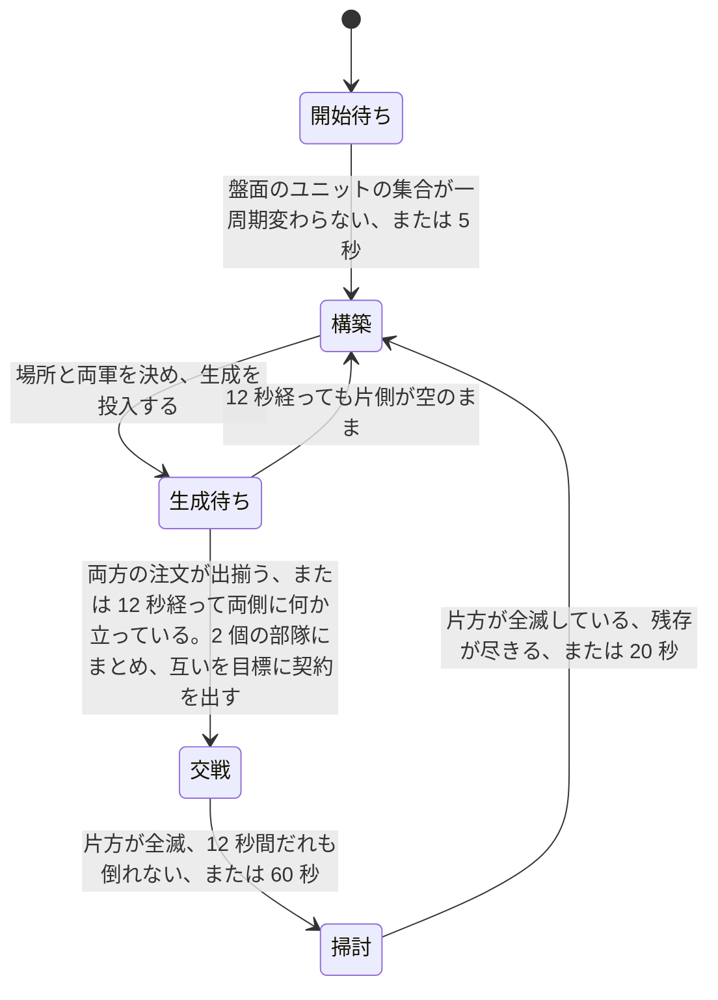
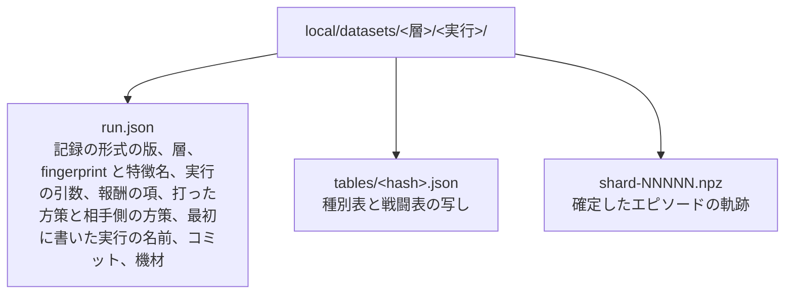
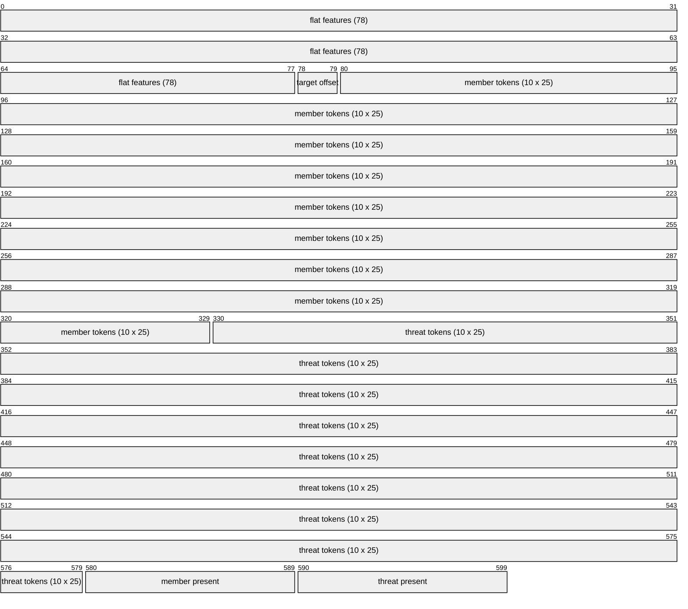
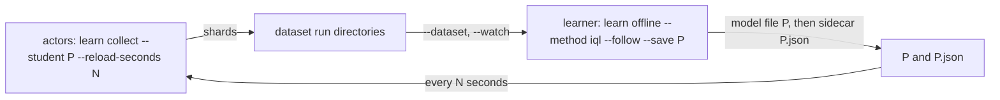

# 学習環境

[04-model-design.md](04-model-design.md) が指す「具体の形式と値」の四つ目である。[05-interface.md](05-interface.md) が観測と行動の運び方を、[06-script-policy.md](06-script-policy.md) が契約と全層のスクリプトを、[07-evaluation.md](07-evaluation.md) が二つの方策の比べ方を決めた。この文書は、**学習させる 3 層を実際に当てはめるために先に存在していなければならなかったもの**を書く。符号化、行動空間、報酬、交戦アリーナ、推論の集約、軌跡の収集、最適化、そしてスクリプトを写して出発点にする仕掛けである。

**環境は実装済みである。** 実物は `rwintel/learn` にあり、`python -m rwintel.learn` で動く。性質は `tests/test_learning.py` で固定してある。

**手書きの戦術層を上回ったと示された方策は一つも無い。** 手書き層の模倣から強化学習を進めた方策は、決闘で手書き層と互角か、下にある。選択に使った乱数種で手書き層より上に見えた候補は、選択に使っていない種で測り直すと 0 と区別が付かなくなる。**そのうえ、同じ重みを二つのアームとして同じ実行に入れても対にした差は +/-0.02 ほど揺れる**([同じ重みを二つのアームに入れても 0.02 ほど揺れる](#同じ重みを二つのアームに入れても-002-ほど揺れる))。逸脱の選び方が取り合っている幅そのものが下へ 0.05 ほどしかなく([動かせる幅](#動かせる幅))、主張したい改善はこの揺れと同じ大きさである。

## 学習方策はスクリプト方策の 1 メソッド置換である

先にこの一点を置く。以降のすべてがここに依存する。

学習する層は、スクリプト層を継承し、**決定を下す一つのメソッドだけを差し替えたもの**である。戦術層なら「逸脱のどれか」、作戦層なら「どの領域へ、どのタスクで、歩くか運ばれるか」、内政層なら「次にどの投資を取るか」だけが置き換わる。内政層では、いま取れる投資の列挙、置き場所と建設機の選び方、猶予の記憶、帳簿が継承したコードのまま動く。任務状況の報告、実損害の切り出し、契約を出し直す条件、期限の付け方、許容損害の見積もりは、いずれも継承したスクリプトのコードがそのまま動く。

こうする理由は [04-model-design.md](04-model-design.md) の「凍結した相手に対して独立に学習・評価できること」である。学習層とスクリプト層が決定以外でも違っていたら、多数エピソード平均でスクリプトを上回ったという結果が「決定が良くなった」ことを意味しない。**再実装ではなく継承にしてあるのは、規則の写しが二つに増えて片方だけ動くことを構造で禁じるためである。**

副産物が一つある。**決定器を渡さない**と、その層は継承した規則にそのまま落ち、選ばれた行動を観測とともに記録するだけになる。スクリプトがそのまま教師になり、出てくるのは学習層が出すのと同一形式の「状態と行動」の対である。人間のリプレイから取れる対は人間が遊んだ分に限られ、行動も契約の形に推定し直す必要がある([04-model-design.md](04-model-design.md))が、スクリプトからは契約の形のまま無制限に取れる。

**スクリプトの内政層・作戦層・戦術層は、符号化した状態だけを読んで決める**(`rwintel/control/policy/judgement.py`)。規則は網が読むのと同じ数字の関数として書いてあり、規則が要るのに符号化に無かった量は、脇で盤面を読むのではなく符号化に足してある。教師が生徒に見えないものを読んで決めると、生徒はその教師を途中までしか写せず、写せなかった分は生徒が指揮を引き取った瞬間に失われる。符号化で閉じた教師なら、写し切れるかどうかは網の大きさと教師の量だけで決まる。

**判断器はどの行動にも点を付け、最も高いものを選ぶ。** 決定を記録するときは、打った方策が何であっても同じ盤面を判断器にも問い、その答え(`label`、作戦層は計画の `second_label` も)と、その点を温度付きで softmax した分布(`soft`、`second_soft`)を、打った行動の脇に書く([記録](#記録))。内政層の判断器の段の分け方は [06-script-policy.md](06-script-policy.md) の内政層の判断にある。1 つのラベルとは違い、分布はどの代案が近かったかを言う。温度は `learn collect --temperature` で変えられる。

## 観測の符号化

層ごとに別の抽象度で切り出す。戦術層は担当部隊の交戦だけを、作戦層は盤面と領域と部隊だけを見る。規則は二つで、どちらも設計上の要求から来ている。

**すべての特徴は比か、明示した尺度で割った長さである。** 生のクレジット残高も生のワールド座標も一つも入れない。座標を入れればマップ寸法に方策が縛られ、クレジットの絶対値を入れれば「序盤の 2000」と「終盤の 2000」を別物として扱えない。**別のマップで読める方策**であることは [04-model-design.md](04-model-design.md) が領域を離散 ID にした理由そのものであり、符号化の側で崩したら意味がない。

**すべてのブロックは有効フラグ付きの固定長で、詰めた並びにしない。** 領域は 24 スロット、部隊は 8 スロットで、実在しないスロットは全ゼロになる。理由は [05-interface.md](05-interface.md) の観測ブロックと同じで、**スロット番号が決定をまたいで同じ場所を指すこと**が、方策が決定をまたいで状態を持てる条件だからである。

### 尺度

定数は `rwintel/control/policy/encoding.py` にある。スクリプトの作戦層と戦術層も同じ符号化を読んで決めるので、学習の側ではなく方策の側に置いてある。

| 量 | 尺度 | 根拠 |
| --- | --- | --- |
| 距離(部隊から目標領域へ) | 2000 | 領域の融合距離が 400、試合の盤面は数千。普通の行軍が 1 の近くに来る |
| 距離(本拠地から) | 4000 | 上の 2 倍。盤面の端まで含める |
| 射程 | 400 | 組み込みの武装可動ユニットの射程の最大値([../game/06-content.md](../game/06-content.md)) |
| 散らばり | 400 | 交戦の近傍を切る半径と同じ。ゲーム側が散開させる距離は 140 だが、そこへ尺度を合わせると散開しただけの部隊がちょうど 1 に来て頭打ちになり、それより崩れた部隊と区別が付かなくなる |
| 部隊の人数 | 12 | ドクトリンの定数は最大で 10([06-script-policy.md](06-script-policy.md))。満員が 1 の手前に来て、増援で膨らんだ部隊がその上に出る |
| 時間(期限・任務の経過) | 60000ms | 戦術の報酬地平が 10 秒から 60 秒、作戦の任務が数分。両方にとって 1 分が自然な単位 |
| 試合時間 | 1200000ms | 「どれだけ遅いか」を言う 1 個の特徴のためだけの尺度 |
| クレジット | 5000 | 開始クレジットが 4000。回っている経済はここから大きく上へは行かない |
| 収入 | 100/秒 | 十分に拡張した側が届くあたり |

二つの戦力を比べる特徴はすべて `自 / (自 + 敵)` の形にしてある。**どちらが上かは言うが、何クレジット上かは言わない。** 両方が 0 のときは 0.5 を返し、盤面が空でも符号化が壊れないようにしてある。アリーナのエピソードは第 1 フレームがまさに空の盤面なので、ここで 0 除算すると最初の交戦を組む前に実行が終わる。

### 戦術の切り出し: 78 次元

スクリプト戦術層が逸脱を選ぶ材料そのものである。学習層が余分に見ていたら、それはスクリプトの置換ではなく別の層であり、[07-evaluation.md](07-evaluation.md) の比較が「同じ仕事をしている二つ」の比較にならない。

| 区分 | 幅 | 中身 |
| --- | --- | --- |
| 部隊の状態 | 9 | 人数、健全度、散らばり、平均体力、直近 2 秒以内に被弾した割合、予算の消化率、許容損害と現有価値の比、期限までの残り、任務の経過 |
| 任務状況 | 8 | 進行中 / 膠着 / 劣勢 / 完了 / 期限切れ / 届かない / 移送待ち / 移送中 の one-hot |
| 任務種別 | 6 | 攻撃 / 防衛 / 襲撃 / 後退 / 護衛 / 包囲 の one-hot |
| 交戦スタンス | 7 | `game.units.a` の 7 種の one-hot |
| 目標領域 | 5 | 距離、単位方向ベクトル 2、領域内の勢力比、敵価値と自部隊価値の比 |
| 交戦の規模 | 2 | 近傍の敵の数、敵と自軍の価値比 |
| 敵の構成 | 8 | 役割別の価値シェア |
| 自軍の構成 | 8 | 同じ役割別の価値シェア |
| 敵の領域 | 5 | 地上 / 水陸両用 / 艦船 / 航空 / 建物 の領域別の価値シェア |
| 自軍の領域 | 5 | 同じ領域別の価値シェア |
| 射程 | 3 | 自軍の最短射程、敵の最長射程、その差 |
| 交戦の形 | 3 | 自軍射程内にいる敵の割合、敵射程内にいる自軍の割合、砲兵の有無 |
| 交換 | 3 | 交換比、被弾中か、接敵中か |
| 規則の材料 | 5 | 任務の実損害(2000 クレジットあたり)、武装した構成員の数、武装した構成員の重心から最短射程内に敵がいるか、それが砲か、戦闘表が予測する交戦の結果 |
| バイアス | 1 | |

近傍の敵は半径 400 で切られたものが渡ってくる。切るのは継承したスクリプト戦術層であり、符号化はそれを受け取るだけである。役割は装甲・砲・対空・高速・建設・建物・輸送・その他の 8 種で、**種別の能力から機械的に分類する**([06-script-policy.md](06-script-policy.md))。名前では分類しない。役割は領域をまたいで共有されるので(艦船の装甲も地上の装甲も装甲である)、何の上を動く戦力か、つまり何が追えて何が撃てるかは、領域別のシェアとして別に置く。

**特徴には名前が付けてある。** 数えるだけにしないのは、1 つずれた特徴ベクトルは落ちずに学習し、別のマップで無価値になるからである。名前の数とベクトルの長さが一致することを試験で押さえている。

### 作戦の切り出し: 840 次元

| ブロック | 1 スロットの幅 | スロット数 | 計 |
| --- | --- | --- | --- |
| 全体 | 16 | 1 | 16 |
| 領域 | 21 | 24 | 504 |
| 部隊 | 36 | 8 | 288 |
| 輸送 | 8 | 4 | 32 |

**状態は決める部隊ごとに作る。** 領域ブロックの一部がその部隊から見た量だからである。

全体ブロックは資金、収入、ユニット上限に対する余裕、建造中の数、戦略層の姿勢 5 種の one-hot、攻勢か守勢か、許容総損害と自軍価値の比、軍事価値の優劣、領域支配の優劣、経過時間、部隊数、バイアス項である。

領域ブロックは有効フラグ、資源地点の数、自軍が押さえた数、敵が押さえた数、勢力比、敵価値と自軍総価値の比、本拠地からの距離、直近 60 秒に敵を見たか、戦略層が付けた優先度、出撃地点か、自軍総価値に対する領域内の自軍戦力に続けて、決める部隊から見た量を置く。部隊からの距離、その部隊がいま向かっている領域か、他の部隊がそこへ向かっている価値の割合、その部隊と向かっている部隊と領域内の自軍が領域内の敵の戦闘ユニットと武装した建物と戦ったときに戦闘表が予測する結果(-1 から +1)、敵の武装した建物の価値、拡張の計画での順位(先頭が 1)である。最後に、その部隊がそこへどう行けるかを置く。歩いて行けるか、輸送の枠のどれかで運べるか、沿岸か、領域の中心から 600 以内の敵の艦船と航空機の価値と自軍総価値の比(海路と降ろし地点への脅威)である。

部隊ブロックは有効フラグ、ドクトリン 6 種の one-hot、自軍全体に対する価値シェア、健全度、散らばり、本拠地からの距離、任務状況 8 種の one-hot、他の指揮者が保持しているか、この層が任務を出せるか、予算の消化率、任務の経過、持っている契約のタスク 6 種の one-hot(契約が無ければすべて 0)、拡張の計画の先頭の領域までの距離、部隊の領域 5 種の one-hot、構成員のうち輸送に乗っている割合である。拡張の計画の先頭までの距離は、手の空いた守備隊のうちどれが計画の先頭を守りに行くかを、どの守備隊について決めるときにも同じ答えにするためにある。

輸送ブロックは移送の層の枠([06-script-policy.md](06-script-policy.md) の移送の層)ごとに 1 行で、輸送が立っているか、空いているか(他の部隊の移送に貸し出し中か、同じ周期に他の部隊に渡したなら空いていない)、決める部隊をいま運んでいるか、決める部隊からの距離、積んでいる割合、水陸を進むか、飛ぶか、決める部隊の全員を積めるかである。**どの領域へどの枠で運べるかは、領域の行とマスクが言う。** 輸送の行が言うのは、どの枠を使うのが近くて空いているかである。

**出撃地点かどうかだけは観測から来ない。** 線上の領域行にその欄がないためで、値はマップファイルから作った領域表([05-interface.md](05-interface.md))を持つ制御プロセス側で埋める。「資源のある場所」と「敵が湧いてきた場所」の違いは他のどの特徴も言わないので、落とせない。

### 内政の切り出し: 1707 次元

| ブロック | 1 行の幅 | 行数 | 計 |
| --- | --- | --- | --- |
| 文脈 | 43 | 1 | 43 |
| 候補 | 52 | 32 | 1664 |

**状態は 1 回の選択ごとに作る。** 同じ周期の 2 つ目の選択は、1 つ目が使った手元と、取り置いた額と、使った工場と建設機を差し引いた盤面を読む。

文脈の行は、手元のクレジット、取り置きを差し引いた予算、取り置いた額、収入、ユニット上限に対する余裕と上限に近いか・達したか、工場の数と置いている最中か、空いた工場の数、工場を強化している最中か、建設機の数と目標数に対する不足、空いた建設機の数、採掘施設の数、本拠地と拡張の計画の空き地点の数、戦略層の姿勢 5 種の one-hot と配分比 3 つ、技術投資の上限と積立と段階、軍備の目標構成 4 役割、自軍が立てている価値の優劣と軍どうしの優劣と押さえた資源地点の優劣、敵の軍のうち飛ぶものの割合、工場を失って建て直す盤面か、立っている輸送と注文中の輸送の数、移送の層に輸送の不足があるか、水上の戦いがあるか、この周期にいくつ選んだか、経過時間、バイアス項である。クレジットの尺度は 10000 で、作戦の切り出しより広い。溜まった手元をどう使うかを決めるのが内政層であり、溜まった手元がどれも同じ値に読まれては困るからである。

候補の行は、有効フラグ、候補の種類 7 種の one-hot、価格、今払えるか、貯めれば手が届くか、予算に対する価格の比に続けて、種類ごとの量を置く。生産なら、敵の編成に対するクレジットあたりと 1 体あたりの強さ(並んだ生産の候補のうち最も強いものに対する比)、戦えるか、役割 8 種の one-hot、飛ぶか、空と地上を撃てるか、射程、段階、自軍の軍に占めるその種別の割合、部隊が足りないと言う役割の割合、目標構成が求める役割の順位、その役割で最も安いか、その役割で予算に収まる最も高いものか、輸送か、艦船か。採掘施設なら、本拠地か、敵が立っているか、地点の安全さの順位、計画での順位、本拠地からの距離、空き地点の数、建設機を運ぶ必要があるか、置ける建設機がすでにその領域にいるか。工場なら、基幹の工場か、第 1 段階で作れる最も強い種別の強さ(工場の候補のうち最も強いものに対する比)、その種類の立っている数。強化なら、段階 3 種の one-hot、次の段階で作れるものが今よりどれだけ強いか、技術の積立から払うか。砲台なら、敵と接触した地面か。

**候補の行には、候補どうしを比べた量を入れる。** 最も強い種別に対する比、役割で最も安いか、といった量は、並んだ候補の全体から符号化の側で計算する。判断器と網が同じ比べ方を読むためである。


## 行動空間とマスク

**戦術層は 7 つの逸脱から 1 つを選ぶ。** `hold` `withdraw` `withdraw_far` `focus` `focus_threat` `spread` `kite` で、[06-script-policy.md](06-script-policy.md) が決めた集合である。部隊単位で 1 つで、ユニット単位では選ばない。

**作戦層は領域 24 と計画 30 を選ぶ。** 計画はタスク 6 と手段 5(歩く、輸送の枠 0 から 3 のどれかに運ばれる)の組で、番号は `タスク x 5 + (枠 + 1)`、歩きが各タスクの先頭である。720 通りの積として出さず、二つの頭に分ける。理由は二つある。**問われている質問が別だから**である。どこへ行く価値があるかと、そこで何をしてどう行くかは、別の理由で決まる。そして**合法な計画が領域ごとの小さなマスクだから**である。積空間の上のマスクは疎になり、720 個の出力の大半が常に死んでいる形になる。

マスクは三つあり、出所がそれぞれ違う。

| マスク | 何を落とすか | 出所 |
| --- | --- | --- |
| 領域 | このマップに実在しない領域スロット、決める部隊がどの手段でも行けない領域 | 制御プロセスが作った領域表と、計画のマスク |
| 計画 | 領域ごとに、そのドクトリンに許されていないタスク、その領域へ歩いて行けないときの歩き、歩いて行ける領域での輸送の枠と、その領域へ部隊を運べない輸送の枠 | スクリプト方策のドクトリン表(前衛は攻撃と包囲、守備は防衛と護衛、襲撃は襲撃と後退、艦隊は攻撃と防衛と護衛、航空隊は攻撃と襲撃と護衛、工作は空)と、作戦層の到達性([06-script-policy.md](06-script-policy.md)) |
| 部隊 | 存在しない、空、他者が保持中、ドクトリンにタスクがない部隊のスロット | 部隊の記録そのもの |

**計画のマスクは領域ごとに 1 行の 24 x 30 である。** 歩いて行ける領域では歩きだけが手段として開く。歩いて行けるとは、ゲーム側が契約の目標を確かめるのと同じ規則で、構成員の全員が領域の中心へ行けることである([06-script-policy.md](06-script-policy.md) の作戦層)。輸送の枠 k が開くのは、歩いて行けない領域で、その輸送が部隊の全員を積めて、積む地点と降ろし地点の両方へ行け、降ろされた全員がそこから中心へ歩いて行け、空いているか同じ部隊をそこへ運んでいる最中のときだけである。同じ周期に他の部隊に渡した枠は開かない。領域のマスクは計画のマスクから導く。どれかの計画が開いている領域だけが開く。

**戦術層にはマスクがない。7 つは常にすべて合法である。** 順調な戦闘から後退するのは悪手であって違法ではなく、「妥当な逸脱」だけを通すマスクを書いたら、それは規則の梯子をマスクの姿で書き直したものになる。判定させたいものを環境の側で先に判定してしまっては、何も学習しない。

**工作ドクトリンのタスク集合が空**なのは、建設機に契約が落ちないようにするためである。落ちると、建物を建てに歩いている最中の建設機が引き剥がされ、建てかけの建物がまるごと損失になる。

部隊マスクは、決定の経路では実際には参照されない。継承した作戦層が決定に入るより前に、ドクトリンにタスクの無い部隊と他者が保持している部隊を落としているためである。マスクの実装は同じ規則を独立に書き下したもので、試験がその一致を押さえている。**将来この層をスクリプトから切り離すときに必要になるものを、先に置いてある。**

マスクの掛け方は、ロジットに大きな負の下駄を履かせる形にしてある。あとから正規化し直す形は採らない。**下駄なら違法な行動に勾配が一切行かず、正規化だと消えかけの勾配が行く。**

**内政層は 32 スロットから 1 つを選ぶ。** スロットの割り当ては [06-script-policy.md](06-script-policy.md) の内政層の判断の表のとおりで、止めるが先頭にある。マスクは候補が入っているスロットであり、止めるは常に合法である。**今払えない候補もマスクで落とさない。** それを選ぶことが貯めて待つことを意味するからである。何を待つ価値があるかは層が決めることであって、環境の側で先に決めるものではない。

内政のスロットは、作戦の領域スロットと違い、盤面をまたいで同じものを指さない。どの工場が空いていて、そのメニューに何があるかで、生産の候補は周期ごとに入れ替わる。スロットの中の並びは種別や領域の番号順に固定してあるが、それはあくまで表記の都合である。網のほうは、スロットの位置に意味を持たせないように作ってある([網の大きさ](#網の大きさ))。

## 報酬

一般則は [04-model-design.md](04-model-design.md) が既に述べている。**戦術層は、上位から受け取った契約の達成度で払われる。作戦層と内政層は、試合の採点で払われる。** 定数は `rwintel/learn/reward.py`、`rwintel/learn/predictor.py`、`rwintel/learn/arena.py` にある。

**戦術層は上位層の報酬を一切見ない。** これが戦術の報酬地平を任務の長さ、すなわち 10 秒から 60 秒に閉じる。作戦層と内政層は、評価が読むのと同じ採点を試合の終わりに受け取るので、決定の収益は評価の量そのものになる([作戦層と内政層は試合の採点で払う](#作戦層と内政層は試合の採点で払う))。

### 周期ごとの連続量はすべてポテンシャル整形に入れる

整形項を `gamma * 後のポテンシャル - 前のポテンシャル` の形にすると、**終端状態のポテンシャルを 0 とみなす限り、ポテンシャルが何であっても最適方策が変わらない**。ポテンシャルの選び方を間違えても、失うのはサンプル効率だけで、正しさは失わない。逆に、この形でない周期ごとの連続報酬を足すと、間違ったときに「最適な方策そのものが変わる」という直しようのない壊れ方をする。

したがって、**周期ごとに動く連続量はすべてポテンシャルに入れ、直接払うのは軌跡が終わったときの一度きりの支払いだけ**にした。戦術層では任務の終わり、作戦層と内政層では試合の終わりである。終端の支払いが連続量であっても構わない。整形の議論が禁じているのは各周期に足される連続報酬であって、軌跡に一度だけ乗る終端は報酬関数そのものの定義だからである。作戦層と内政層の `--reward flows` は、比較のためにこの規則から外れたフローを払う。

**Phi(終端) = 0 は規約であって観測ではない。** 整形が無害なのは、1 本の軌跡にわたって和が伸縮して消えるからである。最後の一項が `gamma * 0 - Phi(最後の状態)` でなければ和は `Phi(最後の状態)` の残差を残し、残差は最後の状態に依存するので**まさに最適方策を動かす**。整形の割引と収益の割引が同じ値でなければならないのも同じ議論の一部で、**ここがずれると整形が伸縮しない。** したがって**二つを別々の定数に置かず、実行が 1 個の数字を決めて整形と収益の両方へ渡す**([アリーナの用務は割り引かない](#アリーナの用務は割り引かない))。試験は、渡された割引が何であっても整形が伸縮することを 0.99 と 1.0 の両方で押さえている。

**規約は軌跡が閉じるすべての経路で守る。** 契約自身の結末(完了・期限切れ・劣勢・全滅)が発火した周期も、アリーナが交戦を打ち切って外から閉じる周期も、その周期に払う整形項は `0 - 保持していた Phi` であって、実際の `gamma * Phi(s')` ではない。効き方が最も大きいのは完了で、領域を取った盤面はポテンシャルの上端に近いから、`gamma * Phi(s')` を残すと完了が定義より高く見え、しかも**予算をどれだけ使ったかによってその上乗せ額が変わる**。終端によって上乗せが変わるというのは、整形が持ってはならない性質そのものである。

ポテンシャルも比で書く。戦車 4 両を巡る任務と 40 両を巡る任務は同じ任務であり、軍の大きさとともに報酬が育つと、同じ振る舞いが試合の後半ほど高く売れることになる。

### アリーナの用務は割り引かない

**用務がどれだけ長いかは、それが試合の断片であるかアリーナの交戦 1 件であるかで違う。** 割引はその長さに対して選ぶものなので、定数ではなく引数にしてある。層を組み立てる側が場を知っているので、層を組み立てる側が整形の割引と収益の割引の両方を持つ。

**算術で決まる。** 決定は毎秒 5 回下るので、アリーナの 1 用務は百前後の決定、制限時間まで戦えば 300 決定になる。終端は n 歩前の決定へ `(割引 * trace)^n` で届くので、割引 0.99・trace 0.95 のもとで優位推定が届く距離は `1/(1 - 0.99 * 0.95)`、すなわち 17 決定ほど、交戦の最後の 3 秒半でしかない。それより前の決定を教えるのは整形項だけになり、整形項は定義により、どの方策が最適かを変えられない唯一の部分である。

**割引を 1 にするだけでは足りず、trace も 1 にする。** 割引を 1 にしても trace が 1 未満なら、打ち切りが割引から trace へ移るだけである。trace を 1 未満にして買えるもの、すなわち批評家を通した分散削減は、ここではほとんど買うものが無い。交戦の途中の報酬はすべて整形の差分であり、整形はそれを学んだ批評家に対して相殺するからである。

**割引と trace をともに 1 に置くと、決定の収益はその交戦の成績からその決定で保持していたポテンシャルを引いたものちょうどになり、優位はさらに批評家の見積もりを引いたものになる。** すなわち「この交戦は、ここから見込まれていたよりどれだけ良く転んだか」である。交戦は有限で、本物の終端を持って終わるので、割り引かずに済ませられる。整形はどの割引でも伸縮し、1 でも伸縮する。

既定は、アリーナの学習実行が割引 1.0・trace 1.0、それ以外が 0.99・0.95 である。前者は `--discount` と `--trace` で動かせる。**1.0 にしたことが成績を良くしたという測定は無い。** ここにあるのは算術だけである。

### 戦術層

ポテンシャルは三つの和である。目標領域に立てているか(重み 0.35)、許容損害をまだ使っていないか(0.15)、そして**契約が出てから壊した価値と失った価値の比**(0.5)である。三つ目が最も重いのは、試合の断片として割引 0.99 で回す場では、交戦の序盤に下した決定へ届く信号が整形項しかなく、終端は交換そのもの(失った価値の割合の差)なので、密な項の側も交換でなければならないからである。**アリーナでは割引も trace も 1 なので、この理由は成り立たない。** 交換の項を外して比べた実行は無い。

**確保と未消費だけのポテンシャルは逆を向く。** その二項だけでは、密な報酬が出るのは**許容損害を使っていないこと**に対してであり、それしか密な信号を持たない層は、あらゆる交戦を最も静かに通り抜ける道を探す。すなわち戦わないことが報われる。その形で更新を重ねると、リターンは動かず方策のエントロピーだけが登り続ける。

交換比は両辺に 300 クレジットを足してから取る。**何も起きていない交戦が 0.5 と読まれる**ようにするためで、足さないと最初の 1 両で項が端まで振れる。300 は安い 1 両ぶんの値段のあたりであり(アリーナが引ける最安の種別が 200、`tank` が 350)、最初の撃破がこの項の全部ではなく 3 分の 2 ほどを動かす大きさである。

壊した価値を数えているのは継承したスクリプト戦術層で、**1 周期遅れて届く。** 整形は差分なので、前後の両端に同じ遅れが乗って相殺する。

契約が新しく出された周期は何も払わない。ポテンシャルをそこで取り、次の周期から差分を払う。**契約を受け取っただけの一歩に、部隊がたまたま立っていた場所の分を払わない**ためである。

終端は 4 種類ある。

| 結末 | 支払い | 何のためか |
| --- | --- | --- |
| 完了 | +1.0 | 領域を取って居座った。任務の達成そのもの |
| 期限切れ | -0.5 | 失敗ではあるが、特に何かを失ったわけではない |
| 劣勢 | -1.0 | 予算は消え領域は来なかった。`cost_budget` の仕組みが高く付かせたい結末そのもの |
| 全滅 | -1.0 | 契約中に部隊が消えた |

**全滅を劣勢と分けてあるのは、消えた部隊はもう後退できないからである。** 戦術層にはそこに至るまでの全周期、後退という選択肢があった。同じ -1.0 だが別の事象として記録する。

完了には超過の減点が乗る。実損害が許容損害を超えていたら、超過分に比例して最大 0.5 を引く(2 倍で満額)。**発注された値段で取られなかった領域は、発注された値段で取られた領域と同じではない。**

#### 開始ポテンシャルはその契約の撃破だけで取る

**壊した価値の集計は、それがどの契約の下で取られたものかを見てから使う。** 継承したスクリプト戦術層は契約が出るたびに集計を取り直すが、それを行うのは 1 周期の処理の後半であり、報酬を払うのは前半である。したがって契約が新しく出た周期には、集計はまだ前の契約ぶんを読んでいる。アリーナでは部隊番号が 0 と 1 しかなく交戦ごとに再利用されるので、これは毎交戦に起きる。

**集計がどの契約の下で始められたかを見て、手元の契約と一致しなければ壊した価値を 0 として読む。** 一致しない周期はまさに契約が出たばかりの周期であり、そこでその契約の下に壊した価値は定義上まだ 0 だからである。

#### 契約が結末に達しないまま終わる交戦がある

4 つはどれも契約の結末である。ところが交戦は、契約がそのどれにも達しないまま終わることがあり、**アリーナではそれが最多である。** 交戦の 6 割から 7 割は、片方も全滅せず制限時間にも達しないまま、互いを傷つけるのをやめた二つの戦力として膠着打ち切りで終わる。契約の結末だけを払う方式では、その全部が終端を一つも払わずに終わり、**膠着したまま何もしないことが報酬上の最善**という、アリーナが教えたいことのちょうど逆の誘因が立つ。

#### 交戦の成績を五つ目の終端として払う

交戦が終わったとき、**その交戦がどう転んだかを連続量で採点し、それを終端として払う**。定義は失った価値の割合の差である。

```
自分が失った割合 = clamp((開始時の価値 - 終了時の価値) / 開始時の価値, 0, 1)
自分の戦力シェア = 開始時の自分の価値 / 両側の開始時の価値の和
成績 = 相手が失った割合 - 自分が失った割合 - STRENGTH_SLOPE * (自分の戦力シェア - 0.5)
```

`STRENGTH_SLOPE` は 0 である([戦力シェアの補正は 0 にしてある](#戦力シェアの補正は-0-にしてある))。

値域はおおむね `[-1, +1]` で、分母が 0 のときは該当する割合を 0、シェアを 0.5 とする。重みは 1.0(`--outcome-weight`)、すなわち**無傷で相手を全滅させることが、契約の完了と同じ +1.0 になる大きさ**に置いてある。これ以上にすると、与えられた任務を果たすより敵を殲滅する方が高く売れることになる。

**開始時の価値は、生成を注文した分ではなく実際に盤面に現れて部隊になった分であり、その数字は両側の部隊を組んだ瞬間に取る。** 生成はユニットごとに位置を指定して置くので、エンジンが受け付けない地面に当たった分だけが現れないということが起こる。注文した額を分母にすると、現れなかったユニットが最初から失われていたことになり、**誰も被っていない損害を払う**。注文した額は別の欄として記録に残してあり、交戦が薄いのか小さいのかはそれで区別する。

**割合で書くのは、戦力比の抽選を成績に混ぜないためである。** アリーナは弱い側を強い側の 0.5 から 1.0 で引く([交戦の作り方](#交戦の作り方))。絶対の価値差で採点すると、強い側を引いたこと自体が得点になり、方策は一度も戦い方を変えずにその点数を改善できる。割合で書いても抽選は完全には消えず、成績は自側の戦力シェアと 0.6 前後の相関を持つ。

**反対称であることがこの定義の要点である。** 相手側にはちょうど符号を反転した値を払う。したがって自己対戦の平均はぴたり 0 でなければならず、スクリプト相手の平均が正であることは「スクリプトを上回った」ことと同値になる。**学習信号と評価指標が同一の量になる**ので、決闘([手順](#手順))が測るものと訓練が最大化するものの間に翻訳が要らない。**この性質は補正項の可否を判定する道具でもある。**

**一つの用務に払われる終端は、必ず一つだけである。** 用務は契約が出された時刻で覚えてあり、終端を払った時点で「払い済み」の印が付く。印の付いた用務についてその後に下された決定は、どの用務にも属さないものとして何も払わない。外から交戦の終わりを告げられたときも、印が付いていれば未清算の決定は清算せずに切る(切るとは、終端ではなく最後の値推定でブートストラップすることである)。**印を付けずに用務を忘れる方式は取らない。** 終端の条件は盤面から読むもので、盤面がそのままなら次の周期も同じ条件が成立するから、忘れた用務は次の周期に作り直されて同じ終端をもう一度払う。

**アリーナでは、契約自身の結末を終端にしない。** 試合では作戦層が契約を出し直すので、契約の条件が用務の境界であり、それが用務を終わらせるのが正しい。アリーナでは 1 つの契約が交戦の全体を表し、それを出し直すものが無いので、契約の条件で用務を終わらせると、部隊が同じ契約の下で戦い続ける残りの数十秒がまるごと「誰にも払われない決定」になる。したがって**アリーナで発火する終端は、交戦の打ち切りただ一つ**であり、完了・期限切れ・劣勢は層が読んで行動するための特徴として残る。**全滅も例外にしない。** 部隊が消えれば用務が終わっているのは確かだが、それがどれだけの失敗であったかは**どれだけ道連れにしたか**で決まり、その数字を持っているのは外から手渡される交戦の成績だけである。

終端は理由の名前とともに数えられ、エピソード記録に内訳が出る。名前は契約の結末が `complete` `expired` `losing` `wiped` の 4 つ、交戦の打ち切りが `called` である。**アリーナの記録に出るのは `called` だけ**で、残りの 4 つは試合の中で戦術層を動かしたときに出る。

#### 交戦の成績は二通りに読める

**上の式の「終了時の価値」には二つの読み方があり、実装は両方を持ち、両方を必ず報告する。**

| 読み | 生き残り 1 体をいくらと数えるか | 定数 | `--score` |
| --- | --- | --- | --- |
| 疎な読み(撃破で採る) | 死ぬまで値段まるごと、死んだら 0 | `BY_KILLS` | `kills` |
| 体力の読み | 値段 x 残り体力 / 最大体力 | `BY_HEALTH` | `health`(既定) |

**体力の読みがあるのは、疎な読みが交戦の大半で 0 になるからである。** 膠着打ち切りで終わる交戦(上記)では、疎な読みでは両側にとってちょうど 0 点である。片方が無傷でもう片方が 1 割まで削られていても 0 点であり、両方が無傷でも 0 点であって、二つは区別されない。**この量は訓練の終端であると同時に評価指標でもある**ので、層が払われる額と実行が判定される数字の両方が、交戦の大半で 0 になる。体力の読みは、同じ交戦で散らばりが小さく(0.48 から 0.52 に対して疎な読みは 0.55 から 0.58)、同じ大きさの主張に要る交戦は 2 割から 4 分の 1 ほど少ない。

**片方全滅で終わった交戦では、二つの読みは同じ値になる。** 死んだユニットはどちらの読みでも 0 だからである。**反対称性はどちらの読みでも保たれる。** 両側手書き層の平均が 0 でなければならないという自己検査は、どちらの読みでも同じように効く。

**体力での価値は部隊ブロックではなくユニット行から取る。** 部隊ブロックは立っているものの値段しか持たず、そのうちどれだけが残っているかを持たないためである。数えるのはその部隊の在籍であり、かつ盤面がまだ報告しているユニットだけである。**最大体力が記録されていない種別は値段まるごとで数える。** 疎な読みがその種別について言うことと同じであり、二つの読みが交戦と関係のない理由で食い違わない唯一の答えだからである。

**`--score` が決めるのは、どちらを終端として払うかだけである。** 二つはどちらの設定でも交戦が終わるたびに計算され、どちらもエピソード記録の交戦ごとの行(`outcome` と `outcome_health`)と統計欄(`outcome_mean` / `outcome_sd` と `health_outcome_mean` / `health_outcome_sd`)に入り、決闘も学習実行も**全アームと全対差を二つの読みの両方で報告する**。**名前を知らない値を渡された場合は異常終了する。** 綴りを取りこぼすと、報告は両方出るのに払われていたのは頼んだ側でない読み、という実行になり、ログのどこにもそれと分かるものが出ないためである。

#### 戦力シェアの補正は 0 にしてある

成績から戦力シェアの固定倍率を引けば、抽選で決まる分の分散が落ちる。抽選は play と独立なので倍率が何であっても平均は動かず、片側のシェアは他方のシェアを 1 から引いたものなので反対称も保たれる、というのがその論拠である。**しかしこれは、組まれた部隊のシェアが左右で対称であるときに限る。** 組成に左右の偏りがあると、補正はその偏りを倍率倍して成績に流し込み、両側手書き層の自己検査を 0 から外す。

**したがって `STRENGTH_SLOPE` は 0 に置いてある。** 組成を対称にする直し([開始盤面が落ち着くまで待つ](#開始盤面が落ち着くまで待つ)、[部隊は、現れたものではなく発注したもので組む](#部隊は現れたものではなく発注したもので組む))を入れたアリーナで倍率を当て直し、両側手書き層の自己検査を通れば取り戻せる。まだ取っていない。

### 作戦層と内政層は試合の採点で払う

**試合が終わったら、その採点を払う。** 採点は評価が読むのと同じ関数(`rwintel.eval.scoring.score`)の値で、決着した試合なら勝敗の +1 か -1、時間切れの試合なら打ち切り時の盤面の採点である。制御プロセスは試合の終わりの通知からこれを計算し、学習層の `close` に渡す。学習層は、そのとき立っている決定にこれを払い、軌跡をそこで終える(ブートストラップしない)。作戦層は部隊ごとに軌跡を持つので、立っている決定のすべてが同じ採点を受け取る。

**採点が無い終わり方では、従来どおり打ち切る。** 実行を止めた、接続が切れた、試合を部屋の全員が抜けた、アリーナのエピソードである、のいずれかなら採点は渡されず、軌跡は最後の決定の価値でブートストラップする。人間のリプレイの再生も、録画か指定区間が終わった所で止まるだけで試合として採点されないので、採点を渡さない。

**整形は、その盤面から見込まれる採点である(`predicted`)。** ポテンシャルは

```
Phi(s) = clamp(a(r) * (2v - 1) + b(r) * (2g - 1), -1, 1)
```

で、`v` は双方が盤面に立てている価値(ユニットも建物も)の和に対する自軍の比、`g` は双方が押さえた資源地点の和に対する自軍の比、`r` は試合の残りのゲーム内秒数である。`a` と `b` は残り時間の節点ごとの係数で、節点の間は線形に補い、端の外は端の値を使う(`rwintel/learn/predictor.py`)。残り時間は `EpisodeSettings.max_seconds` とゲーム内時刻から求め、上限を持たないセッションでは分からないものとして最後の節点の係数を使う。切片は置かない。採点と同じく、互角の盤面は誰が相手でも 0 と読む。係数が無いうちは `a = 1, b = 0`、すなわち時間切れの試合の採点が読む価値の差そのものである。

**割引は 1 にする。** 決定は立っていた間の `Phi` の変化を受け取り、試合の終わりは `採点 - Phi(最後の盤面)` を払う。1 試合の支払いの総和は `採点 - Phi(最初の盤面)` にちょうど等しいので、**決定の収益は「この試合は、ここから見込まれていたよりどれだけ良く転んだか」になる。** アリーナの戦術層を割り引かない理由と同じ算術である([アリーナの用務は割り引かない](#アリーナの用務は割り引かない))。trace は 1 周期あたり 0.95 で、批評家を通して密な信号を短い地平に返す部分を受け持つ。

**係数は記録から当てはめる。** `learn predictor` は、作戦層か内政層の記録のうち採点を持つ試合の各周期の盤面と、その試合の最終の採点から、節点ごとに最も近い盤面で切片の無いリッジ最小二乗を解く。試合ごとに分けた交差検証で、節点ごとの検証側の決定係数と、記録した実行と地図の組ごとに平均を引いたうえでの決定係数を報告する。盤面の少ない節点は初期の係数のまま残る。採用するときは `--save rwintel/learn/predictor.json` で書き、以後の実行の既定になる(`--predictor` で別のファイルを渡せる)。使った係数は実行の項として `run.json` に書かれるので、記録は後から別の係数で値付けし直せる。

**序盤の盤面は最終の採点をほとんど予測しない。** 予測は試合の終わりに近いほど当たり、序盤の決定に整形が返す信号は弱い。序盤の決定を教えるのは、終端の採点が trace と批評家を通って届く分である。

**`--reward flows` は比較のための組である。** 作戦層には価値の比のフロー 0.05 と自分の部隊の交換 0.1 を、内政層には価値の比 0.05 と資源地点の比 0.02 のフローを毎周期払い、価値の比を重み 0.4 でポテンシャルにする。割引と trace は作戦層が 0.95 と 0.9、内政層が 0.99 と 0.95 で、試合の終わりの採点はこちらでも払う。フローは毎周期足される連続報酬なので、最適な方策そのものを試合の採点から動かしうる。

### 作戦層

**戦略層の要求の達成度は、既定では払わない。** 達成度は、戦略層が付けた優先度で重み付けた各領域の支配度の平均であり、-1(全部が敵のもの)から +1(全部が自軍のもの)をとる。領域の支配度は、そこに立つ戦力の差を両者の和に 300 クレジットを足したもので割ったものに、採掘施設の差を資源地点の数で割って 0.5 倍したものを足し、-1 から +1 に切ったものである。`--achievement-weight` を渡すと、これに 0.05 を掛けたものをその倍率で毎周期払い、損害が許容総損害を超えた分を許容総損害で割ったものに 0.05 を掛けて差し引く。達成度は払わなくても毎周期計算され、エピソード記録の統計(`achievement`)に残る。

**達成度を外すのは、それが試合の採点を動かさないからである。** 戦略層の要求の達成度で学習しても採点は上がらず、試合ごとの達成度と採点はほとんど相関しない([作戦層](#作戦層-1) の分かっていること)。作戦層が最大化する量を評価の量に揃えておけば、戦略層の要求の書き方が変わっても作戦層の目標は変わらない。

**価値の比は両側を同じ切り方で数える。** 自軍も敵も、盤面に立っているユニットと建物のすべてである。片側だけ戦闘ユニットに絞ると、自軍の採掘施設を失っても比が下がらない。

**1 周期の 1 つの数字が、その周期に立っているすべての決定を払う。** 盤面は試合全体についての量であって、どの部隊についての量でもない。部隊ごとに切り分けるには観測が支えていない帰属推定が要る。`--local-exchange` を渡したときだけ、各決定にその部隊自身の交換(撃破した価値から失った価値を引いたもの、1000 クレジットあたり)も払う。

#### 決定は見直しの契機があるときだけ下す

**学習した作戦層は、毎周期すべての部隊について決め直さない。** 決めるのは、部隊が契約を持たないとき、任務状況が膠着・劣勢・完了・期限切れのいずれかになったとき、そして前の決定から 30 秒(`REVIEW_MS`、`--review-seconds`)が過ぎたときだけである。それ以外の周期では部隊は持っている任務を続け、決定もステップも作らない。

スクリプト作戦層も同じ理由で任務を続けさせる。毎周期決め直す層は、確率的な方策である限り考えが変わるたびに契約を出し直し、そのたびに任務の損害の起点がリセットされるので、劣勢の報告がいつまでも出ない。

**防衛と護衛の完了は、任務を続けている状態である。** 守備部隊の完了とは、自分の領域に居座って誰にも争われていないことであり、任務が終わったことではない。スクリプト作戦層もこれを完了として扱わず、別の領域へ送らない(`operations.running`)。

**1 つの決定は、それが立っていた周期の支払いを割り引いて足し合わせたものを受け取り、立っていた周期数 k を持って軌跡に入る。** 次の決定の価値は `gamma^k` で、trace は `(gamma * lambda)^k` で割り引く。戦術層のステップは k = 1 であり、推定は従来と変わらない。

**教師として記録するのは、スクリプトが実際に発行した答えである。** スクリプトと学習層は同じ契機で決める。決定器を渡さない層は、見直しの契機で判断器の答えを求め、それを記録する。一度も決めたことの無い部隊は、他から渡された任務を持っていても決め直す。

#### 盤面が報告する任務状況は、手元の契約についてのものだけを読む

**契約を出した直後の 1 周期、ゲーム側はまだ前の契約について報告している。** 行動は 1 周期遅れて効くためである。その報告の任務状況と損害は、差し替えられた任務のものである。編成層は、報告の発行時刻が手元の契約より古ければ、その任務状況を進行中、損害を 0 として読む。これを読まないと、新しい契約が前の任務の膠着や完了を引き継ぎ、層は毎周期決め直すことになる。

### 内政層

**内政層は、作戦層と同じく試合の採点で払われ、見込まれる採点で整形される**([作戦層と内政層は試合の採点で払う](#作戦層と内政層は試合の採点で払う))。予測が読む二つの比のうち、価値の比は試合の採点が読む量そのものであり、資源地点の比は、後のすべての買い物の元手である収入の代わりに置いてある。敵の収入は観測に載っていないが、敵が押さえた地点は載っている。

**戦略層の配分比に従ったかどうかでは払わない。** 配分比は姿勢から表で引いたスクリプトの重み付けであり、それに従ったかで払えば、層はスクリプト自身の重み付けを学び直すだけになる([04-model-design.md](04-model-design.md) の報酬の分け方)。作戦層で、戦略層の要求の達成度で払う報酬が試合の採点を上げず、採点に揃えた報酬が上げたこと([作戦層](#作戦層-1))も、同じ向きを指している。

**1 周期に選ぶ投資は、それぞれが 1 つの決定である。** 同じ周期の中で次の選択が続く決定は、間にゲーム内時間が無いので 0 周期として軌跡に入り、後に続くものを割り引かない。周期の最後の決定は、次の周期の最初の決定まで立ち続け、その間の周期の支払いを割り引いて足し合わせたものを受け取る。これは作戦層の決定が立っていた周期の支払いを受け取るのと同じ形である。止めるしか選べない周期は、決定を作らない。

割引と trace は、作戦層と同じく 1 周期あたり 1.0 と 0.95 であり、実行が 1 個の値を整形と収益の両方へ渡す。

### 定数

| 定数 | 値 |
| --- | --- |
| 戦術ポテンシャル: 確保 / 未消費 / 交換 の重み | 0.35 / 0.15 / 0.5 |
| 交換比の両辺に足す事前値 | 300 クレジット |
| 戦術終端: 完了 / 期限切れ / 劣勢 / 全滅 | +1.0 / -0.5 / -1.0 / -1.0 |
| 交戦の成績の重み(打ち切られた交戦の終端、`--outcome-weight`) | 1.0 |
| 交戦の成績のうち終端として払う読み(`--score`) | 体力の読み(`health`)。疎な読み(`kills`)も常に併せて報告する |
| 成績から引く戦力シェアの倍率(`STRENGTH_SLOPE`) | 0.0 |
| 超過の減点(許容損害の 2 倍で満額) | 0.5 |
| 作戦と内政: 試合の終わりに払う採点の重み(`--terminal-weight`) | 1.0 |
| 作戦と内政: ポテンシャル | 見込まれる採点。係数の節点は残り 0, 60, 120, 180, 240, 300, 420, 540, 660, 780, 900 秒、係数が無いうちは価値の差そのもの |
| 作戦と内政: 予測を当てはめる節点の最少の盤面 / リッジの強さ / 交差検証の分割 | 50 / 盤面あたり 0.001 / 5 |
| 作戦の達成度フロー(1 周期あたり、`--achievement-weight` 倍) | 0.05、既定の倍率 0 |
| 作戦の支配度: 両辺に足す事前値 / 採掘施設の重み | 300 クレジット / 0.5 |
| 作戦の許容総損害の超過(1 周期、超過 1 倍あたり、`--achievement-weight` 倍) | 0.05 |
| 作戦の見直し間隔(`--review-seconds`) | ゲーム内 30 秒 |
| `--reward flows` の作戦層: 価値の比のフロー / 自分の部隊の交換 / 価値の比のポテンシャル / 割引 / trace | 0.05 / 0.1 / 0.4 / 0.95 / 0.9 |
| `--reward flows` の内政層: 価値の比のフロー / 資源地点の比のフロー / 価値の比のポテンシャル / 割引 / trace | 0.05 / 0.02 / 0.4 / 0.99 / 0.95 |
| 割引(整形と収益で共通、`--discount`) | アリーナの交戦で 1.0、試合の断片である戦術の用務で 0.99、作戦層と内政層で 1 周期あたり 1.0 |

**いずれも初期値である。** 割引の 1.0 は好みでも計測でもなく**算術で決まった値**である([アリーナの用務は割り引かない](#アリーナの用務は割り引かない)、[作戦層と内政層は試合の採点で払う](#作戦層と内政層は試合の採点で払う))。予測の係数は定数ではなく、記録から当てはめて `rwintel/learn/predictor.json` に置く。ポテンシャルの重みは最適方策を動かさないので、外して測る価値が最も低い数値でもある。**ただし「動かさない」のは最適方策であって学習の進み方ではない**([戦術層](#戦術層) の二項のポテンシャル)。終端の比は最適方策そのものを動かすため、調整するならそちらから始める。

## 交戦アリーナ

**戦術層は試合の中で学習させない。** 任務は 10 秒から 60 秒、試合は 15 分である。試合の中で戦術層を学習させると、実時間の圧倒的大部分が、その決定と何の関係もない経済・ビルドオーダ・行軍のシミュレーションに消える。[04-model-design.md](04-model-design.md) が「戦術の学習には試合を回す必要がない」と書いたのはこのことで、これはその実装である(`rwintel/learn/arena.py`)。

材料は既に揃っていた。ユニットの即時生成が正規のコマンド経路を通ること(実行時確認、[../game/04-actions.md](../game/04-actions.md))、試合設定で相手の持ち主を出撃地点の無いプレイヤーにできること([../game/05-match-control.md](../game/05-match-control.md))、サンドボックスのフラグ `l.bv` が立つと全プレイヤーのユニットを操作できること([../game/05-match-control.md](../game/05-match-control.md))である。三つを合わせると、**交戦を組んでは戦わせ、終わらせてはまた組む、1 本のエピソード**になる。

### 消す命令がないので、片付けるのではなく終わらせる

**ユニットを取り除くコマンドはゲームに存在しない。** システム命令は生成・降参・再同期の三つしかない([../game/04-actions.md](../game/04-actions.md))。体力への代入で消すのはロックステップを壊す近道そのものであり、[04-model-design.md](04-model-design.md) が最初に締め出したものである。

したがって交戦は**片付けられない。終わらせる**。制限時間が来たら、両軍の生き残りを互いにぶつけ直し、居なくなるまで待つ。削除するより遅く、**すべての変更をコマンド経路に載せたままにする唯一の方法**である。

盤面が完全に空にならないことは前提にしてある。次の交戦の場所は、**領域の中心と資源地点をあわせた候補**から、立っているものからの距離が最も遠いものの 9 割以上あるものを無作為に引く。前の交戦の残りが次の交戦に紛れ込むと、層が払われている戦闘が層に与えられた戦闘でなくなる。

**資源地点も候補に入れるのは、領域の中心が水や崖の上に落ちうるからである。** 領域の中心はそれを構成した地点の平均であって、地面である保証がない。エンジンはそこへの生成を拒み、交戦は組んだ瞬間に死産になる。資源地点は何かを建てられる地面であることが定義から分かっているので、ユニットを置ける地面でもある。**生成が一度も現れなかった地点は候補から外す。** 地面がユニットを受け付けるかどうかはこちら側から問い合わせられないので、試して覚える以外に方法がない。

### 一つのエピソードの流れ



生成に待ちが要るのは、生成もコマンドキューを通るため即時ではないからである。

### 開始盤面が落ち着くまで待つ

出撃地点を持つプレイヤーは司令部と建設機で始まり([アリーナのエピソードは空の盤面ではない](#アリーナのエピソードは空の盤面ではない))、エンジンに削除命令が無いので消せない。それらは盤面が最初に読まれる瞬間には出そろっておらず、一歩か二歩あとに現れる。交戦の部隊は「既に立っていたもの」の記録と照らして組むので、最初の交戦をすぐに組むと、記録が司令部を取りこぼし、部隊を組むときに司令部を新しく現れた自軍のユニットとして数えてしまう。相手側は基地を持たないスロットなので、これは片側にしか起きず、成績が左右に偏る。

**そこで、盤面のユニットの集合が一周期のあいだ変わらなくなるまで最初の交戦を待つ**(最長 5 秒、`SETTLE_MS`)。待つあいだ記録を毎周期取り直すので、遅れて現れた司令部も記録に入る。待つのはエピソードの頭で一度だけである。

### 部隊は、現れたものではなく発注したもので組む

**待ちだけでは足りない。** 待ちは立っているものの集合が一周期変わらなければ通り、司令部と建設機は一歩か二歩ずれて現れるので、その隙間で待ちが通って建設機だけが記録から漏れることがある。漏れた建設機を部隊に入れると、その部隊は基地に停めたままの死なないユニットを抱え、負けようがなくなり、重心が基地へ引かれ、役割別の価値シェアに本来アリーナの部隊に現れない建設の役割が立つ。

**したがって部隊は、実際に出した注文に照らして組む。** 種別ごとに数え、その種別について頼んだ数を超えた分は取らない(`Arena._commissioned` と `Engagement.our_wanted` / `their_wanted`)。**これは建設機と同時に、もう一つの部外者も締め出す。** 死産として捨てた交戦の生成命令は取り消されないので、そのユニットは後から盤面に現れ、次の交戦を組んでいる最中の窓に紛れ込む。どちらも発注されていない。**交戦とは発注したものどうしの戦いである。**

### 両軍が揃うまで部隊を組まない

待つのは**両方の注文の全部**についてであって、片側に 1 体ずつ現れた時点ではない。注文は数周期にわたって届く。**両側に誰かが立った瞬間に部隊を組むと、まだ届いていない分が部隊の外へ取り残される。** 取り残されたユニットは盤面に立って戦闘には加わるのに、部隊がいくらだったかにも、いくら残ったかにも数えられない。出てくるのは、どちらの方策とも関係のない理由で盤面の片側に偏った成績である。**成績が反対称であることに寄りかかっている以上、左右の非対称は方策の差と区別が付かない。**

待ち切れなかったときは、現れた分だけで戦わせる。**成績が割る二つの数字は、そのとき組んだ部隊そのものから取る**ので、遅れて現れなかったユニットは分母にも分子にも入らない。

### 生成命令の投入を左右で交互にする

生成はコマンドキューを通り、キューは積まれた順に流れる。片側の注文を全部投入してから相手側を投入すると、先に積んだ側の方が、待ちが尽きた時点でより多く盤面に立ちうる。**そこで両側の注文をユニット単位で交互に投入する**(`Arena._interleave`)。自軍 1 体・敵軍 1 体と交互に積むので、キューはどの深さでも左右がほぼ揃い、待ちが尽きても両側が同じ深さで切られる。ペアの中でどちらが半歩先んじるかはペアごとに入れ替えるので、その半歩は全体で左右に等しく散る。片側の注文が長いときはその余りが末尾に続くが、余りが付くのは多く抽選された側であって固定の側ではない。

これは投入順を左右対称にする整えである。左右の組成の偏りを実際に生んでいたのは投入順ではなく開始盤面の紛れ込み(上記)であり、交互投入だけでは基準線は動かない。

### 部隊の健全度は、その交戦で組んだ価値で割る

**ゲーム側は部隊の「組まれたときの価値」を、下げない最大値として持っている。** 試合の中で増援を受け取り続ける部隊にとってはそれが正しい。**アリーナでは正しくない。** アリーナは部隊番号を 0 と 1 の二つしか持たず、エピソードの全交戦がその二つを使い回すので、その最大値は「この部隊番号がエピソード中に持った最大の戦力」になる。健全度は現有価値をその値で割ったものであり、戦術の特徴の 1 つなので、分母が古ければ無傷の部隊が既に削られていると読まれる。

**したがって、ゲーム側の部隊ブロックを写すときに組まれたときの価値は上書きしない**(`Arena._fold`)。部隊が組まれたときの価値は、アリーナが置いたものがそのまま残る。ゲーム側から写すのは現有価値・位置・散らばり・損害・任務状況である。

### 生存者は溜まる

交戦に勝った側の生存者は消せないので盤面に溜まる。次の交戦は立っているものから離して組むが、溜まった生存者は古い命令で動き、後続の交戦の敵を、組まれた部隊が接敵する前に撃ちうる。**これは仕掛けとして本当にある。** 引き直すアリーナ(下記)で測る限り、溜まったことが成績の左右を動かしてはいない。

### エピソードごとに交戦を引き直す

**アリーナはエピソードごとに作り直され、その乱数種にはインスタンス番号とアームの周回数の両方を織り込む**(`rwintel/learn/__main__.py` の `_arena_seed`)。インスタンス番号だけから作ると、あるインスタンスの 2 本目のエピソードは 1 本目とまったく同じ列を引く。同じ場所、同じ二つの予算、同じ戦力比、同じ角度、同じ二つの編成が、同じ順序で出てくる。そうなると交戦の件数で割った 2 標準誤差は、独立に引かれた交戦の数で割った値より数十倍狭くなり、アリーナが左右に傾いているように見える測定がいくらでも出る。

**アームの周回数で織り込む**ので、比較の二つのアームは同じ周回で同じ種を受け取る。**方策のアームと基準線のアームは同じ交戦を戦い**、エピソードが進むごとに双方が新しい交戦へ移る。対にして差を取れることは、この織り込み方の帰結である([手順](#手順))。

**1 周期の中でどちらの側の逸脱を先に決めて先に送るか**(`--decision-order ours|theirs|alternate`)は、アリーナの左右の傾きの原因ではない。順序を入れ替えたアームと入れ替えないアームを同じ実行で回しても、傾きは符号ごと反転しない。`alternate`(周期ごとに先手を入れ替える)は、順序が原因であった場合の直し方として残してある。

### 両側とも同じプロセスから動かす

サンドボックスのフラグが立っているので、1 プロセスで交戦の両側を操作できる。**相手側は同じ戦術層に、左右を入れ替えた盤面を読ませて動かす。**

入れ替えは敵味方のフラグを反転するだけで済む。位置、体力、射程、誰が誰を撃っているかは、いずれも元から対称だからである。観測に敵味方が入っているのはこのプロセスから見た記録という一点だけであり、そこを反転すれば相手側から見た同じフレームになる。**元のフレームは書き換えない。** 同じ周期に両側がそれを読むためである。

これで自己対戦がネットワーク構成なしで組める。既定では学習中の方策どうしを戦わせ、`--script-opponent` を渡すと相手をスクリプト戦術層に固定できる。**測りたいのはスクリプトが同じ仕事をしたときとの差**([07-evaluation.md](07-evaluation.md))なので、固定できることが要る。

**両側の決定を同じ記録に残せる。** 自己対戦の学習は両側を記録し、収集は `--both-sides` で相手側のスクリプトの決定も記録する。軌跡の鍵は(インスタンス、部隊番号)で、自軍側の部隊番号は 0、相手側は 1 なので衝突しない。交戦の成績は符号を反転して相手側の終端になる。両側は 1 つのバッファを共有し、エピソードは先に閉じた側がそのインスタンスの軌跡をまとめて確定させる。そのためアリーナは閉じる前に両側の保留中の決定を軌跡に入れ(`LearntTactics.release`)、エピソードを 1 回で、両側の最後の決定をそれぞれの軌跡の末尾に置いて確定させる。

### アリーナのエピソードは空の盤面ではない

上の「両側」は誰のものでもない駒ではない。**生成したユニットには持ち主が要る。** アリーナは相手側の部隊にその持ち主を明示して渡し、ゲーム側はそれを見て誰の名前で命令を出すかを決める。そして部屋は、要求した対戦相手の数によらず**枠を 9 個埋める**([../game/05-match-control.md](../game/05-match-control.md))。開始ユニットの設定でそれを空にすることもできず、出撃地点を持つプレイヤーは必ず司令部 1 と建設機 1 で始まる。

ゲーム側が試合を組み立てるときに次を行う。詳細は [../game/05-match-control.md](../game/05-match-control.md) にある。

- 相手側の持ち主(**スパーリング枠**)を 1 つ選ぶ。選び方は、枠を番号の大きい方から見て、空でもローカルでもない最初のものである。番号は開始の事象に載せて制御プロセスへ渡される。
- それ以外のローカルでないプレイヤーを**観戦者(チーム -3)へ移す**。背後で第二の試合が進むのを止めるためである。
- スパーリング枠を含む**部屋の全ての内蔵 AI を停止する**。停止はそのプレイヤー自身の更新が先頭で読むフラグを立てることで行い、ユニットにも体力にもクレジットにも触れない。

**枠を選ぶだけでは足りない。** 出撃地点を持たないプレイヤーもプレイヤーであり、考える。停止しなければ、相手側は手元にあるものから攻撃隊を組み、自分の判断で命令を出し、経済を見つけて、アリーナが生成した分しか持たないこちら側に対して自分の試合をする。

**このフラグへの代入は、本リポジトリでコマンド経路の外に書き込む唯一の箇所である。** それが許されるのは、書く先がシミュレーションではなくプレイヤーの判断する側であること、そして**同じフレームを回している第二のプロセスが存在しないこと**の二つによる。**したがって停止はアリーナのエピソードに限る。** `rwintel.learn` はアリーナのエピソードに対を組ませない。通常の試合は、評価の相手である内蔵 AI をそのまま持つ。

### 交戦の作り方

| 項目 | 値 |
| --- | --- |
| 片側の予算 | 1200 から 5000 クレジットの一様分布 |
| 片側の許容損害 | 部隊の現有価値の 0.3 倍から 1.2 倍の一様分布(下限 200 クレジット)。両側で独立に引く |
| 戦力比(弱い側の強い側に対する比) | 0.5 から 1.0 の一様分布(`--imbalance-floor`) |
| 片側の最大ユニット数 | 14 |
| 片側の最小編成数 | 3。その種別 3 両で片側の予算に収まらない種別は抽選から外す |
| 両軍の間隔 | 250 |
| 交戦の制限時間 | ゲーム内 60 秒 |
| 膠着とみなす無死時間 | ゲーム内 12 秒(`--stall-seconds`) |
| 掃討の制限時間 | ゲーム内 20 秒 |
| 生成待ち | ゲーム内 12 秒 |
| 開始盤面の待ちの上限 | ゲーム内 5 秒 |
| エピソードの既定の長さ | ゲーム内 240 秒 |

**間隔 250 は交戦を交戦にする距離である。** エンジンの `attackMove` では、ユニットは索敵範囲で対象を捕捉すると停止するが、射程は索敵範囲より短いので、遠くから歩み寄る二つの戦力は「見えるが届かない」隙間で向かい合って止まり、ほとんど死者を出さないまま制限時間を使い切る。**その隙間の内側から始める。** 250 は戦車の射程 130 の外であり、アリーナが引ける種別のうち最も遠くまで届く砲の内であるから、どちらが先に撃てるかは依然として層の選択が左右する。

**膠着したら打ち切る。** 決着する交戦は 20 秒から 30 秒で終わり、決着しない交戦は 1 分をほぼ無傷のまま使う。互いに損害を与えなくなった戦力が再び戦い始めることはないので、12 秒だれも倒れなければ交戦を終える。打ち切りを外すと片方全滅で終わる交戦は増えるが、同じ実時間で得られる交戦がおよそ 3 分の 2 になり、成績の散らばりも広がる。基準線は動かない。

**交戦の終わりは、どう終わったかによらず軌跡の終わりでもある。** 打ち切られた交戦にも成績が付き、両側の層はそれを終端として受け取って未清算の決定を清算する。**ここが境界になっていなければ、部隊番号はアリーナでは 0 と 1 しかないので、未清算の決定はそのまま次の交戦の最初の周期に繰り越される。** そうなると 1 本の軌跡が複数の交戦の決定を連結したものになり、優位推定が交戦 N+1 の結果を交戦 N の決定へ逆流させる。

**掃討は片方が全滅していれば行わない。** 掃討は生存者を互いにぶつける仕掛けであり、片方しかいなければぶつける相手がいない。

**生成待ち 12 秒**は、多並列のときにも生成が出揃う長さである。待ちが短いと、組んだ交戦の多くが地形のせいではなく待ち足りないために「現れなかった」として捨てられる。

**エピソードを 240 秒と短くしてある**のは、エピソードの中で交戦が同じ盤面を共有するからである。溜まった生き残りが後続の交戦に紛れ込む仕掛けは実在し([生存者は溜まる](#生存者は溜まる))、長いエピソードほど 1 件の独立な観測に含まれる交戦が増えて、件数のわりに標本が痩せる。240 秒なら 1 エピソードが 5 件から 8 件である。試合を組み直す回数が増える分 throughput は 2 割ほど落ち、それがアリーナの公平さを買う代金である。`rwintel.learn` の `--max-seconds` を省くとアリーナの実行はこの長さになる。**アリーナのエピソードを長くするのは、throughput のつまみではなく測定を壊す操作である。**

**戦力比を 1 に固定しない**のは、五分の戦いしか見たことのない層は「引くべき戦いがある」ことを学べないためである。`withdraw` は逸脱の 1 つであり、それが正解になる盤面が訓練に無ければ、選ばれる理由もない。

**許容損害も同じ理由で抽選する。** 部隊の現有価値そのものを許容損害に置くと、劣勢の報告(実損害が許容損害の 7 割)が全滅寸前と同義になり、事実上一度も間に合わない。アリーナで劣勢は終端ではないが、**許容損害と現有価値の比は戦術の特徴の 1 つであり、任務状況の one-hot もそうである**。固定すると、層はその二つが動く盤面を訓練中に一度も見ない。しかも**試合の作戦層は部隊の全価値よりはるかに絞った予算を出す**ので、アリーナで比が 1 前後しか見なかった層は、試合に出た瞬間その特徴が未知の領域に入る。0.3 から 1.2 は、予算が先に尽きる交戦と最後まで持つ交戦の両方が出る幅として置いた初期値である。

編成する種別は、地上を動いて地上を撃てるものに限ってある。航空機と対空できないユニットの組み合わせは戦闘にならず、**届かない相手との交戦から層が学ぶのは「何をしても関係ない」だけ**である。加えて、**その種別だけで最低 3 両を組めない種別は抽選から外す**。種別表は数百クレジットの戦車から、その数十倍する実験機までを含んでいる。予算が尽きるまで買い足すだけの規則では、実験機 1 両と戦車十数両が向かい合う盤面が「交戦」として出てくる。逸脱が答えようとしている問題は編成どうしの戦闘であって、それではない。

### 種別どうしの相性を測る

**同じアリーナで、種別どうしの相性も測る**(`python -m rwintel.learn matchups`)。交戦ごとに種別を 2 つ抽選し、それぞれの側を 1 つの種別だけで組み、同じクレジットで買う。両側とも手書きの戦術層が動かす。空を飛ぶ種別も抽選に入れる。空と地上のどちらにクレジットを使うかが、まさに内政層の問う相性だからである。互いに撃てない組は引き直す。支出は、少なくとも高い方の種別 2 体ぶんまで引き上げる。重い種別を測らなければ、内政層が重い種別と軽い種別を比べる材料にならないからである。安い方の種別がその支出を 30 体以内で買えない組は引き直す。上限で切られた側だけが安く済むと、同じクレジットの比較にならないからである。抽選するのは、陸上工場・航空工場・メカ工場・実験工場・司令部のどれかが作ると定義ファイルが言う種別と、定義を持たずエンジンが作る種別である。シナリオの巣が作る生き物は、スキルミッシュの盤面に現れない。

結果は体力の読みの成績で、種別の組ごとに平均と件数として `local/reports/matchups.json` に積み足す。成績は反対称なので、1 件の交戦は両方の向きの組に 1 件ずつ数える。内政層の戦闘表([06-script-policy.md](06-script-policy.md) の内政層)は、組ごとの測った成績を二乗則の予測と比べ、件数に応じてその分だけ予測を寄せる。ファイルが無ければ予測だけで動く。

```bash
python -m rwintel.runtime run --count 12 -- learn matchups --episodes 10
```

## 推論の集約

**推論はインスタンスごとに持たせず、1 個のサーバに集約する**(`rwintel/learn/inference.py`)。[04-model-design.md](04-model-design.md) が制御の周期と計算量の節で決めてあり、[05-interface.md](05-interface.md) が制御プロセス 1・ゲームプロセス多数の非対称をその帰結として置いている。

戦術周期ごとに、インスタンスあたり部隊の数だけ要求が来る。**実装は部隊ごとに要求を出す**からである。周期の実時間は、固定時計ではシミュレーションと推論の速さで決まり、wall 時計の倍率 10 なら 20 ミリ秒である。1 回ずつ答えれば大半が起動のオーバヘッドになる。予算に収まるだけ小さくした網ほど、この比率は悪くなる。

集約で答えが変わらないのは、[05-interface.md](05-interface.md) が**決定の遅延を 1 周期に固定してある**からである。どの要求への答えも、その周期の決定として次の周期に効くので、まとめて 1 回で答えてもインスタンスから見えるものは何も変わらない。**まとめるための待ちは足さない。** 決定中のスレッド全員がどれかのまとめ役で待ち始めた時点で評価し、それより先に来る要求は無いので待たない(`rwintel/control/deciding.py`)。固定時計のゲームは答えを待っている間止まっているので、来ない要求を待つ時間はそのまま処理量の損失になる。

**窓と上限は推論するデバイスごとに決めてある**(`inference.LIMITS`、`inference.limits(device)`)。まとめ役は評価するデバイスの組を既定にする。

| デバイス | 窓 | 上限 |
| --- | --- | --- |
| CPU | 4 ミリ秒 | 64 件 |
| CUDA | 4 ミリ秒 | 64 件 |

**CPU の窓は周期の 20 ミリ秒に対して 5 分の 1 に置いてある。** 短くしてあるのは意図的で、これは待ち行列の深さでも throughput のつまみでもない。**wall 時計では、窓が周期に近づいた瞬間、答えはそれが対象としていた周期より後に届くようになり、決定の遅延が「1 周期」であることをやめて「機材の混み具合」になる。** それは 05 が正面から拒否したものである。固定時計と再生用の時計では、ゲームは答えが来るまで止まって待つので、どの答えも観測から戦術周期ちょうど 1 つ後に効き、長い窓はその分だけ処理量を削る。上限があれば一度の詰まりが際限なく大きな呼び出しに化けない。

**答えが 1 周期後に効いたかは、決定の遅延の計器が言う**(`rwintel/control/latency.py`、[05-interface.md](05-interface.md) の 1 周期の遅れを固定する)。エピソードの記録の `latency` が戦術と作戦の答えごとの遅延と適用されなかった答えの数を持ち、答えを待つ時計でどれかの遅延が 1 周期と違うか適用されない答えがあれば、制御プロセスが警告を 1 行書く。評価の報告もアームごとにそれをまとめる([07-evaluation.md](07-evaluation.md))。

**CUDA の組は `learn bench` の結果から一つの規則で読む。** 上限は、1 回の呼び出しが 1 件の呼び出しの 2 倍以内に収まる最大のバッチの大きさである。窓は CPU と同じにしておき、1 件の呼び出しがそれより長いときだけその長さにする。グラフィックスカードでは小さなバッチの呼び出しの費用がほぼ起動の手間で決まるので、まとめるほど 1 件あたりが安くなるが、集合の網はトークンごとに注意を計算するので、ある大きさを超えると呼び出しが演算で長くなる。規則はその手前で上限を切る。**`inference.LIMITS` の CUDA の組は、カードの上で多数のゲームに打たせる網である戦術層の集合の網について、空いたカードでこの規則が読む組である。** 戦術層の平らな網ではこの規則はより大きな上限を読み、作戦層の集合の網ではより小さな上限を読むが、作戦層の決定は数件ずつしか来ないので、そのバッチが上限に近づくことはない。規則が読む表を作るのは `learn bench` であり([推論の費用を測る](#推論の費用を測る))、デバイスごとの費用の違いは [03-throughput.md](03-throughput.md) にある。

**最適化器と同じ実行の中では、まとめ役は最適化器のロックの中で評価する**(`choice_batcher(..., lock=optimiser.lock)`)。更新が重みを書いている間に前進が同じテンソルを読まないためで、CUDA では更新と前進が同じテンソルの上で交互に進みうるので欠かせない。

**待つのは制御プロセスのインスタンス別スレッドだけである。** ゲームスレッドは決定を待たない([05-interface.md](05-interface.md))。ここで待つのは、既に読み終えた観測と、まだ送っていない行動の間である。

サーバは呼び出し回数と処理件数を数えており、平均バッチ長を実行の最後に報告する。**束ねが効いている窓と、単に遅延を足しているだけの窓は、それでしか区別できない。**

## 軌跡の収集

**1 本の軌跡は 1 つの任務であり、1 エピソードではない**(`rwintel/learn/rollout.py`)。[04-model-design.md](04-model-design.md) の報酬地平の規則を具体にすると、こうなる。

戦術層では、部隊に新しい契約が出た時点で前の軌跡が切れ、新しい軌跡が始まる。試合はまだ終わっていない。部隊が全滅したらそこで 1 本閉じる。他の部隊は続いている。**境界を引くのが別の層の決定であることは、解くべき問題ではなく取り決めそのものである。** 契約が仕事の単位である以上、契約が支払いの単位になる。

**契約の切り替わりでは、閉じるのではなく切る。** 差し替えられた用務は失敗も完了もしておらず、観測されなくなっただけなので、最後の決定はその値推定でブートストラップする。その決定に払う報酬は 0 である。二つの契約のポテンシャルは別の地面と別の予算に対して測ったものであり、その差は整形項ではないからである。切らずに 1 本のまま伸ばすと、新しい用務が稼いだ優位が古い用務の決定へ逆流する。

アリーナではこれに**交戦の終わりが加わる**。契約がどの結末にも達しないまま交戦が打ち切られることがあり、そのときは外から軌跡を閉じる。**閉じる側は、未清算の決定に交戦の成績と最後の整形項を払い、それを軌跡の終端として積む。** その用務が既に終端を払い済みなら、未清算の決定は払わずに切る。**部隊が消えていて未清算の決定が無い場合は、既に積んである最後の決定に終端を足してそこで閉じる。** 部隊が消えた周期には決定を下す部隊がもう無いので待っている決定も無く、そのまま切ると全滅が層にとって何も高く付かなくなる。

作戦層では、部隊ごとに 1 本を、その部隊が盤面から消えるか試合が打ち切られるまで伸ばす。**部隊が消えたときも閉じずに切る。** 支払いは盤面全体についての量であり、部隊が消えても盤面は続くので、最後の決定はその値推定でブートストラップする。

内政層では、インスタンスごとに 1 本を試合の長さだけ伸ばし、試合が打ち切られたところで切る。内政層は 1 つのインスタンスに 1 つしかないからである。

### 一つのインスタンスの終了で他のインスタンスの軌跡を切らない

**バッファは実行に 1 個で、全インスタンスがそこへ書く。** 軌跡の鍵は「どのインスタンスの、どの部隊か」の組である。

**エピソードの終わりに開いている軌跡を切るとき、切ってよいのは自分のインスタンスのものだけである。** 全部を切ると、あるインスタンスがエピソードを終えるたびに、他のインスタンスが戦っている最中の交戦の軌跡がまとめて切られ、それらの交戦はこれから受け取るはずだった交戦の成績を受け取らない。インスタンスがそれぞれ 30 秒に 1 本ほどエピソードを終え、交戦は 20 秒ほど続くので、そうなれば進行中の交戦の大半が巻き添えに遭う。**バッファ全体を切るのは実行そのものを畳むときだけである。**

### 打ち切られた軌跡は終端ではない

試合が打ち切られたときに走っていた任務は、**失敗していない。観測されなくなっただけである。** これを終端として扱うと、方策は「試合を終わらせること」に価値があると学ぶ。したがって打ち切られた軌跡は最後の状態の値推定でブートストラップし、自力で終わった軌跡だけを終端 0 で閉じる。二つの場合の違いはその一点だけであり、それを試験で固定してある。

値推定は層が明示的に渡すのではなく、渡されなければ**その軌跡の最後の決定に付いていた値ヘッドの推定**が使われる。方策が答えるたびに保存されている値であり、次の状態の推定の代わりとしては十分に近い。0 で代用すると「観測されなくなった時点から先は無価値である」と主張することになる。スクリプトを教師として記録するときだけは値ヘッドが無いので実効値が 0 になるが、そこでは勾配を取らないので影響しない。

### 乱入された部隊の決定は、後から印を付けて落とす

[04-model-design.md](04-model-design.md) の規則である。指揮系統が制御していない部隊の戦果で褒めたり罰したりすると、間違ったことを教える。

**印付けは遅い。乱入が判明するのが遅いからである。** 人が部隊からユニットを抜くのは、その部隊についての決定が下されてから数周期あとかもしれない。しかも任務の途中の介入は、**その後の決定だけでなく前の決定も無効にする**。任務全体の帰結で払っている以上、その帰結はもうこの層が選んだことの帰結ではない。

したがって、決定は収集の時点では落とさず全部貯め、エピソードの終わりに、乱入者が触った部隊の一覧を受け取ってから、開いている軌跡と閉じた軌跡の両方に遡って印を付ける。印を付けるのはそのインスタンスの軌跡だけである。バッファは全インスタンスで共有しており、部隊番号はインスタンスごとに別の部隊を指すからである。取り出すときに印の付いたものを外す。

**作戦層は、介入が起きたその周期に、その部隊について立っている決定だけに印を付ける。** 作戦層の決定は立っていた周期の支払いを受けるので、介入が損なうのは介入の時点で立っていた決定であり、それより前の決定は誰も触っていない周期の分を払われている。部隊について一度でも介入があればエピソード全体の決定に印を付ける戦術層の方式を作戦層に当てると、乱入者が試合の中で部隊のほとんどに一度は触るので、学習に残る決定がほぼ無くなる。部隊ユニットが移された先の部隊の決定にも同じく印を付ける。

記録には印を残したまま書く。学習に使うときに何を落とすかは、読む側の判断だからである(`--keep-tainted`)。

### 報酬は 1 周期遅れて着く

決定は、盤面がその下で動くまで払えない。したがって各周期は、届いた盤面から前の周期の決定を払い、それから新しい決定を下す。これは行動について [05-interface.md](05-interface.md) が既に持っている 1 周期の構造と同じものであり、揃えてあるので**バッファの 1 ステップがちょうど 1 周期のゲーム内時間を覆う**。

## 記録

**層の決定を打つ実行は、その決定をデータセットとして記録する。** `collect`、`tactics`、`operations`、`economy` の各実行と、人間のリプレイを再生する `replay play --imitate` である(`rwintel/learn/dataset.py`)。置き場は `local/datasets/<層>/<実行>/` で、実行の名前は `<what>-<日時>` である。エピソード記録 `local/episodes/<what>-<日時>.jsonl` と同じ日時を使うので、二つは名前で対応が付く。`--dataset` で置き場を変え、`--no-dataset` で記録を止める。決闘と評価は記録しない。

**記録は、ゲームを回し直さずに学習を試し直すためにある。** 網の形、損失、報酬の重みを変えた学習を、保存した決定だけで回せるようにする。そのために、軌跡の境界と終わり方、打った方策の確率、報酬を作る前の量、符号化する前の材料を、決定ごとに持つ。



### いつ書くか

**軌跡は、それが属するエピソードが閉じた時点で確定し、そこで書く。** 戦術層の乱入の印はエピソードの終わりに遡って付く([乱入された部隊の決定は、後から印を付けて落とす](#乱入された部隊の決定は後から印を付けて落とす))ので、それより前に書くと印が漏れる。層は閉じるときに、開いている軌跡を切ってから、そのインスタンスの閉じた軌跡を確定させる(`Rollout.seal`)。最適化器がバッチとして取り出す経路(`drain`)とは独立なので、学習の実行でも収集の実行でも同じ記録が残る。学習器を持たない実行は、確定した軌跡をバッファに残さない。

書き出しは記録器のスレッドが行い、ゲームを待たせない。決定がしきい値(既定 20000、記録する実行の `--shard-decisions`)まで溜まるごとに 1 つの断片を、一時的な名前で書いてから名前を付け替える。途中で止まった実行には、完成した断片だけが残る。学習器が読むのは書き終えた断片だけなので、行動器のしきい値を小さくすると学習器は行動器の決定を早く読む。

**ファイルを丸ごと書くものは、すべて同じ書き方をする。** 断片、`run.json`、表の写し、網のパラメータ、採点の重み、報告の JSON は、書き出し先と同じディレクトリの一時ファイルに書き、書き終えてから一度に書き出し先と置き換える(`rwintel.paths.replacing`)。読み手が見るのは古いファイルか新しいファイルの全体であって、書きかけのファイルではない。書いている途中で失敗すれば、一時ファイルを消し、書き出し先は元のまま残る。1 行ずつ追記するエピソード記録はこの対象ではない。

### エピソードの識別

**エピソードはインスタンス番号と試行の番号(`attempt`)で識別する。** 試行の番号は、そのインスタンスでエピソードが始まるたびに増える。ゲームが落ちたエピソードは同じエピソード番号でやり直されるので、エピソード番号だけでは二つの試行を区別できない。エピソード記録の各行も同じ `attempt` を持つ。データセットのエピソードごとの付帯情報と、学習の実行が書くエピソード記録は、地図(`map`)と、ゲームのプロセスの中での試合の順番(`order`、インスタンスの最初の試合が 0)も持つ。

各エピソードは終わり方(`ending`)を持つ。

| 終わり方 | 意味 |
| --- | --- |
| `finished` | ゲームがエピソードの終わりを報告した。エピソード記録に行がある |
| `lost` | エピソードの途中でゲームが落ちた。エピソード記録に行は無く、同じ番号で次の試行が始まる |
| `rejoined` | 途中で再接続し、方策が作り直された。前の方策の軌跡はそこで切られる |
| `stopped` | 実行が止められたときに、まだ進行中だった |

### 一つの決定が持つもの

| 欄 | 内容 |
| --- | --- |
| `state` | 符号化した状態 |
| `mask` / `second_mask` | 合法な行動。作戦層の `second_mask` は領域ごとの計画のマスクを領域の順に並べた 24 x 30 |
| `action` / `second` | 実際に打った行動 |
| `label` / `second_label`、`soft` / `second_soft` | 判断器ならどう選んだかと、その分布。人間のリプレイでは人間が打った行動そのもの |
| `probabilities` / `second_probabilities` | 打った方策の分布の全体。作戦層の計画は打った領域の条件付き |
| `log_prob`、`value` | 打った方策が打った行動に付けた対数確率と、価値の見積もり |
| `version` | 打った網の更新の回数。学習中の網でなければ 0 |
| `reward`、`periods`、`signals` | 払われた報酬、立っていた周期の数、報酬を作った量 |
| `tainted`、`weight` | 乱入の印と、模倣で掛ける重み |
| 材料 | 状態を作った入力。下記 |

軌跡ごとには、鍵、終端で閉じたか打ち切られたか、打ち切られたときのブートストラップの値、割引と trace、アリーナの交戦の番号を持つ。交戦の番号はエピソード記録の交戦の行(`history` の `index`)と同じであり、その行は両側の契約の発行時刻(`formed_at_ms`)も持つ。打ち切られた交戦の軌跡は、交戦の成績を両方の読み(疎な読みと体力の読み)で持つ。

### 報酬は信号で持つ

**報酬は払った額だけでなく、それを作った量(信号)で持つ。** 層は、盤面から信号を読み、実行の項(`TacticalTerms`、`OperationalTerms`、`EconomicTerms`)でそれを値付けして払う。値付けは信号と項だけの関数なので、記録した信号を別の項で値付けし直せば、その項で層を回したときに払われた額になる。重み、割引、どちらの読みで払うか、のいずれを変えた学習も、記録し直さずにできる。

| 層 | 1 行が何か | 信号 |
| --- | --- | --- |
| 戦術 | 1 回の支払い。全滅のように最後の決定の後で閉じた軌跡は、終端の行がもう 1 つ付く | 支払いの種類(整形、契約の結末、交戦の打ち切り、無し)、ポテンシャルの三つの成分の前と後、結末の理由、許容損害の超過、交戦の成績の二つの読み |
| 作戦 | 決定が立っていた 1 周期。n 番目の行は割引の n 乗で効く。試合が採点を持って終わったときは、終わりの行がもう 1 つ付き、最後の周期の後の盤面の割引で効く | 行の種類(試合の最初の周期、周期、試合の終わり)、残りのゲーム内秒数の前と後、達成度、許容総損害の超過、価値の比の前と後、資源地点の比の前と後、その部隊の交換の増分、試合の採点 |
| 内政 | 投資が立っていた 1 周期と、作戦層と同じ終わりの行 | 行の種類、残りのゲーム内秒数の前と後、価値の比の前と後、資源地点の比の前と後、試合の採点 |

### 打った方策の確率

**記録する確率は、打った行動を実際に引いた分布のものである。** スクリプト、逸脱の固定、規則は、答えにすべてを置いた分布であり、対数確率は 0 である。一様に引く規則は合法な行動の上の一様分布である。`--explore` を付けて集めるときは、打つもの(網、規則、固定した逸脱、スクリプト)の分布と一様分布の混合から引くので(`Labelled`)、混合の確率を記録する。作戦層では領域と計画を組として引くので、網はすべての領域について、その領域の計画のマスクの下での計画の分布を返し、混合は組の確率で計算する。一様分布の側は、領域の上の一様分布と、引いた領域の計画のマスクの上の一様分布の積である。答えにすべてを置く打ち手では、それ以外の領域の重みが 0 なので、組の確率は一様分布の側だけで決まる。人間のリプレイの決定は分布が分からないので、空のまま記録する。

**どの決定をどの方策が打ったかは `run.json` から決まる。** `behaviour` がその実行の打った方策で、アリーナの相手側を記録した実行は相手側の方策を `opponent` に持つ。`Dataset.behaviours` は、決定ごとに部隊番号 1 の側なら `opponent`、それ以外なら `behaviour` の名前を返す。名前は、打ったもの、網ならパラメータのファイル名、学習中だったか、探索の割合をつないだものである(例 `network[tactics-bc.pt]@explore0.1`)。

### 符号化の前の材料

**状態に加えて、状態を作った入力を保存する。** 符号化は最も変わりやすい部分であり、符号化を変えるたびにデータを捨てることになるのを避けるためである。

| 層 | 材料 |
| --- | --- |
| 戦術 | 部隊の記録と契約、構成ユニットと脅威のユニットの行、目標の領域の行、損害、撃破した価値、時刻 |
| 作戦 | 観測の全ユニットの行と資金などの集計、領域の行、本拠地の領域、部隊の記録とその構成員、命令(姿勢、領域ごとの優先度、攻勢、許容総損害、拡張の計画)、出撃地点、決める部隊、時刻、決める部隊が歩いて行ける領域と沿岸の領域、領域ごとに運べる輸送の枠、輸送の枠の行 |
| 内政 | 盤面(`EconomicBoard`)と候補(`Offer`) |

戦術と作戦の符号化は戦闘表の予測を読み、戦闘表は実行のたびに積み足される種別どうしの相性の報告を読む。そのため、エピソードごとに種別表と戦闘表の写しを `tables/` に置き、材料はその写しに対して符号化し直す。後から報告が増えても、作り直した状態は打ったときの状態と変わらない。

材料から状態を作り直す関数は、記録したときと同じ符号化の関数を呼ぶ(`rwintel/learn/materials.py`)。

### 符号化の版

**符号化の版が違う記録は、読み込みで止める。** 層ごとの符号化には版(`TACTICAL_REVISION` など)があり、版、特徴名の並び、スロットの数、尺度の定数から `fingerprint` を作る(`rwintel/control/policy/encoding.py`)。記録は書いたときの `fingerprint` を持ち、今の符号化と違えば読み込みは `DatasetMismatch` で止まる。長さが同じでも止まる。特徴の意味だけを変えた変更は名前にも長さにも現れないので、試験が層ごとに固定の盤面の符号化を版と組にして固定している。符号化を変えたら版を上げ、古い記録は材料から符号化し直して使う(`dataset reencode`)。

**記録の形式にも層ごとの版がある**(`dataset.FORMAT`、`run.json` の `format`)。配列の幅や材料の表の列が変わったときにその層の版を上げる。形式の版が違う記録は読み込みも符号化し直しも `DatasetMismatch` で止まる。材料が今の符号化の読む形をしていないからである。作戦層は計画の頭に替えたとき、戦術層は材料の部隊の表に列が増えたときに形式を上げたので、それより前の記録は取り直すしかない。各層の配列の幅と材料の表の列は、試験が形式の版と組にして固定している。

### 分割

**検証に回すのはエピソードの単位であり、行の単位ではない。** 同じ交戦の隣り合う決定はほとんど同じ決定なので、行の単位で分けると検証集合が当てはめに使った行で採点される。どのエピソードを検証に回すかは、エピソードの識別子(実行、インスタンス、試行)の hash で決める(`dataset.fold`)。分割をファイルに書かないので、データを足しても既存のエピソードの側は変わらない。識別子の「実行」は `run.json` の `lineage`、すなわちその決定を最初に書いた実行の名前である。`dataset reencode` は書き出し先の名前を `run` に入れるが `lineage` は引き継ぐので、符号化し直した記録でも同じエピソードが同じ側に回る。

### 道具

```bash
python -m rwintel.learn dataset inspect local/datasets/tactics/collect-<日時> --verify
python -m rwintel.learn dataset reencode local/datasets/tactics/collect-<日時> --out local/datasets/tactics/collect-<日時>-r2
```

`inspect` は、決定・軌跡・エピソードの数、終わり方の内訳、打った方策、打った行動と判断器の答えの分布とその一致率、乱入の印の割合、報酬の信号の平均、網の版の範囲、検証に回る件数、`fingerprint` が今の符号化と合うかを出す。複数の実行をまとめて点検したときのために、内訳を三通りに分けても出す。実行ごと(`by_run`: 名前、打った方策と相手側の方策、決定、エピソード、終わり方、一致率、地図)、決定を打った方策ごと(`by_behaviour`: 決定の数、打った行動の分布、判断器との一致率、打った分布の平均エントロピー、分布が分からない決定の割合)、地図ごと(`by_map`: エピソードと決定の数)である。作戦層の記録では、打った計画と判断器の計画の手段の分布(`played_means`、`label_means`、先頭が歩き、続いて輸送の枠の順)も出す。`--verify` は全決定の状態を材料から作り直し、記録した状態と単精度で一致しない件数と、作り直せない件数を出す。どちらかが 0 でなければ終了コードは 1 になる。`reencode` は、材料から今の符号化で状態を作り直した実行を別の置き場に書く。材料を持たない決定が一つでもあれば止まる。どちらも `run` を通さずに直接起動する。

## 最適化

**環境は更新のために止めない。** ゲームは自分のプロセスで走り、固定時計なら各周期で答えを待つが、答えは推論の経路が返し続ける。更新はその横で計算されるので、教科書の方策勾配が前提にする「固定パラメータで集める、更新する、また集める」という交替にはならない。止めて交替させれば、更新の間すべてのインスタンスが遊ぶ。

したがって収集は連続で、更新は十分に溜まった時点で別スレッドが行う(`rwintel/learn/train.py`)。**バッチは常に、その収集中に既に動いているパラメータの下で集められる。**

これが耐えられるのは理由が一つあるからで、それがこの方法をクリップ比のものにしている理由でもある。**各ステップは、その行動を実際に取った方策が割り当てた対数確率を持ち歩いている。** 目的関数はそれに対する比であり、クリップされている。行動したパラメータと更新されるパラメータの間の小さな遅れは、重要度比がそのために存在する状況そのものである。耐えられないのは大きな遅れなので、**バッチは実時間で 1 分を大きく下回って集まる大きさに保ち、更新は短く保つ。**

重みは、こちらが書いている間に他のスレッドの推論経路が読む。両者は同じロック(`Optimiser.lock`)を取る。更新は最小バッチごとにそれを取り、まとめ役は 1 回の評価ごとにそれを取る。**避ける価値があるのは重み行列の途中読みの方で**、それは「たまに何でもないような振る舞いをする方策」として現れる。

**`learn tactics|operations|economy --device cuda` は最適化器ごとグラフィックスカードに置く。** バッチはそのデバイスへ運び、`--anchor` の固定した写しも網と同じデバイスに乗る。方策勾配では autocast を使わず単精度で通す。バッチが小さく、半精度で得るものが無いからである。

**戦術層の集合の網は、ゲームの中でも集合の状態を読む。** `LearntTactics` は決定ごとに材料(`materials.tactical`)を取り、`tokens.set_state` でその決定の 1 行を作って網に渡す(決定器の `set_input` が真のとき)。判断器が採点するのと記録に書くのは平らな 78 個のままで、網が読んだ行はステップの `net_state` に載る。方策勾配の最適化器は `net_state` があればそれを読み、無ければ `state` を読む。1 回の更新に二つの幅が混ざることはない。データセットには `net_state` を書かない。記録から読むときは材料から作り直す。

### 網の大きさ

| 層 | 入力 | 隠れ層 | 出力 | パラメータ数 |
| --- | --- | --- | --- | --- |
| 戦術 | 78 | 64 x 2 | 逸脱 7 + 価値 1 (+ 行動価値 7 x 2) | 10,646 |
| 作戦 | 840 + 部隊スロット 8 | 192 x 2 | 領域 24 + 計画 30 + 価値 1 (+ 行動価値 (24 + 30) x 2) | 233,347 |
| 内政 | 文脈 43 + 候補 52 x 32 | 候補 64 x 2、胴体 128 x 2、点 64 | 候補 32 + 価値 1 (+ 行動価値 32 x 2) | 50,820 |

単精度で戦術が約 43KB、作戦が約 930KB である。作戦層は 10 分の 1 の頻度で盤面全体を読むので広くしてよいが、深くはしない。括弧の中の行動価値の頭は 2 組あり、オフラインの強化学習([オフライン学習](#オフライン学習))だけが読む。模倣にも方策勾配にも勾配が流れないので、この二つにとっては無いのと同じである。

**内政の網は、候補ごとに 1 つの網で点を付ける。** 候補の行を共有の符号器(64 x 2)に通し、有効な候補の符号の平均を文脈に連結して胴体(128 x 2)に通す。胴体の出力と各候補の符号を連結したもの(64 から 1)が、その候補の点になる。価値は胴体から取る。スロットごとに出力を持つ形は採らない。内政のスロットは盤面ごとに違うものを指すので([行動空間とマスク](#行動空間とマスク))、スロットの位置に重みを持たせると、同じ種別がどのスロットに入ったかで別の答えを学ぶことになるからである。平均した候補の符号を胴体が読むのは、何が買えるかも局面の良さの一部だからである。

**作戦層の計画の頭は、選んだ領域を読む。** 領域を先に抽選し、その領域スロットの埋め込み(16 次元)を胴体の出力に連結したものから、その領域の計画のマスクの下で計画を選ぶ。そこで何をするかもどう行くかも行く先で決まるからである。前衛が囲むか正面から押すかはその領域での戦力比で決まり、歩くか運ばれるかはその領域が水の向こうかで決まる。学習と模倣では、記録された領域とその領域の計画のマスクを渡して同じ条件付きの分布を評価する。

**この大きさでは CPU で回す。** 1 回の呼び出しが演算ではなく呼び出しの手間で決まるため、束ねた推論も更新も CPU の方がグラフィックスカードより速い。**ゲームを動かす実行がどこで網を回すかは、読むファイルで決まる**(`_serving_device`)。`--device` を与えればそれが優先する。与えなければ、集合の網のファイルはグラフィックスカードがあればそこで、無ければ CPU で回し、そのとき CPU に向けて作ったのは集合の網から蒸留した平らな網(`offline --method distill --net flat`)であることを 1 行の警告で言う。平らな網のファイルは CPU で回す。これは `tactics`、`operations`、`economy` の `--load`、`collect --student`、`duel --load` と評価のアーム(`rwintel.eval --device`)に共通である。記録だけを読む `clone`、`offline`、`bench` の既定は `auto` で、グラフィックスカードがあればそれを使う。テンソルライブラリのスレッドは 2 本に制限してある(`TORCH_THREADS`)。同じ CPU でゲームが走っているからである。推論そのものは 1 コアの数パーセントしか使わず、**律速はシミュレーションであって方策ではない。** したがって戦術網の幅を 64 に留める費用側の理由は無く、`--width` で上げられる。**既定の 64 は、手書き層を模倣する正解率がそれより広い網でも上がらない幅である。**

三つとも actor-critic を 1 本の胴体と 2 つの頭にしてある。胴体を共有すると価値推定が追加費用なしで手に入り、この頻度ではそれが効く。**価値ヘッドが存在するのは優位推定がそれを要るからで、他に読むものはない。**

作戦層には、どの部隊についての決定かを one-hot のスロットとして盤面と一緒に渡す。部隊行だけを別に渡す形は採らない。**部隊 3 をどこへやるかは、部隊 1 と 2 をどこへやったかに依存する。** 他を見られない網は、独立でない 8 個の問題を独立に解くことになる。

### 定数

| 定数 | 値 | 役割 |
| --- | --- | --- |
| クリップ | 0.2 | 1 回の更新が行動確率を動かせる幅。上の遅れに対する安全弁そのもの |
| 価値損失の重み | 0.5 | 胴体を共有した価値ヘッドの誤差の効き |
| エントロピー(`--entropy`) | 0.002 | 小さいが 0 ではない。最初の数百ステップで 1 つの行動に潰れた方策は、それを覆す証拠を出すのをやめるので二度と戻らない |
| 勾配ノルム上限 | 0.5 | 部隊が全滅した 1 エピソードが 1 時間を消す一歩を作らないため |
| 学習率(`--learning-rate`) | 3e-4 | |
| エポック | 4 | 1 回では比の仕組みが割に合わず、この大きさのバッチで多すぎると過適合する |
| ミニバッチ | 256 | |
| 更新するバッチ | 1024 ステップ(`--batch`) | 実時間で 1 分を大きく下回って集まる大きさ |
| GAE の trace(`--trace`) | アリーナの交戦で 1.0、試合の断片である用務で 0.95 | 終端がどこまで届くかを実際に決めているのはここである([アリーナの用務は割り引かない](#アリーナの用務は割り引かない)) |

**エントロピーの重みは、模倣から始める実行に合わせて小さくしてある。** 想定している出発点は手書き層の模倣([模倣からの初期化](#模倣からの初期化))であり、**その方策は意図して狭い。** 規則の梯子を写したものなので大半の盤面で自分の答えを確信しており、エントロピーは一様な方策の 4 分の 1 ほどしかない。0.01 はその狭さを保存する大きさではなく取り除く大きさで、更新を重ねると方策は改善されるのではなく溶かされる。0.002 は、行動を完全に閉ざさせないだけの量であって、出発点を書き換えるには足りない量である。**0.002 が良い値であるという測定はない。**

**模倣から始めた方策は、錨で教師の近くに留められる**(`--anchor`)。優位が雑音でしかない更新を重ねると、方策は改善されずに教師から拡散していき、エントロピーだけが上がる。錨は、読み込んだ時点のパラメータを凍結した写しを持ち、現在の方策のその写しからの KL を重み付きで損失に足す。作戦層では領域の頭と計画の頭の両方を比べ、計画の頭は実際に選んだ領域で比べる。方策は、優位が繰り返し同じ向きを指す所でだけ教師から離れる。

優位は取り出す時点で中心化・正規化する。しないと、勾配の一歩の大きさが「そのバッチのエピソードがたまたまどれだけ波乱含みだったか」で決まり、一度うまくいった学習率が次のバッチで方策と無関係な理由で壊れる。

**最適化器は 1 本で両層を賄う。** 作戦層は 2 つを同時に選ぶので対数確率が 2 つの和、エントロピーも 2 つの和になる。それ以外、比・クリップ・価値の目標・勾配クリップは同一である。

実行を止めるときは、残っている軌跡を切って最後の半端なバッチも消化する。**捨てる方が惜しい。** 実行中で最も新しく最も関係のある経験だからである。

## 模倣からの初期化

乱数から始めた方策は、規則の梯子が最初から知っていることを数万の決定をかけて見つけ直す。しかも見つけ直す元手は、大半が伸縮して消える整形項である。**その分を飛ばす材料はこの文書の冒頭の副産物として既にある。** 記録した決定はどれも、その盤面で判断器ならどう選んだかを持っている([記録](#記録))。当てはめは教師あり学習のごく普通の形であり(`rwintel/learn/imitation.py`)、目標は判断器の答え(`label`)とその分布で、費用は記録に対する数分の演算である。出てくるのは**最初から測る価値のある方策**である。手書き層の教師は、網が学習集合でも検証集合でもほぼ完全に写す。

損失は交差エントロピーで、作戦層は頭が二つなので両方の和を取る。**価値ヘッドはここでは学習しない。** 教師にリターンが無い、すなわちスクリプトの決定には「その任務がいくらの価値だったか」の見積もりが付いていないからである。それは次の準備運動が受け持つ。

**ラベル平滑化を既定 0.05 で入れる。** スクリプトは分布ではなく関数であり、同じ盤面に必ず同じ答えを返す。平滑化なしの当てはめは数エポックでほぼ one-hot に達し、そうして強化学習に入った方策はエントロピーを持たない。**一つの行動に潰れた方策は、それを覆す証拠を出すことをやめるので二度と戻らない。**

**教師が分布を書いた行では、その分布を当てはめの目標にし、平滑化は使わない。** 分布は教師がどれだけ確かだったか、他に何が近かったかを既に言っており、平滑化はそれが分からないときの代わりだからである。分布は合法な行動の上で正規化し直して使う。

**平滑化で分ける質量は、合法な行動にだけ配る。** 24 領域の大半はその盤面に実在せずロジットはマスクで潰されているので、そこへラベルの一部を置くことは、次の前進でまた潰されるロジットを上げ続けろと要求することにあたり、損失はどんな学習率でも収まらないところへ行く。

**今の符号化と違う符号化で書かれた記録は読まない**([符号化の版](#符号化の版))。違う符号化で書かれた教師は、何の文句も出さずに当てはまり、**特徴をずれた場所で読む網**を出すからである。

検証にはエピソードの 1 割を回し([分割](#分割))、検証損失が改善しなければ止めて、**最後のエポックではなく最良のエポックのパラメータを残す**。記録したエピソードが少なく検証の側が空になるときは、当てはめた決定で採点したことを警告して進む。最後に、学習集合と検証集合それぞれの正解率・エントロピーと、**教師の行動分布と網の行動分布を並べて**報告する。作戦層は手段の正解率(歩くか、どの輸送の枠か、が教師と同じ割合)と、教師が運ばせた決定だけでのその正解率も出す。運ぶ決定は島の地図にしか現れず全体の正解率にはほとんど効かないので、別に数えないと写せたかどうかが分からないからである。計画の頭の目標は教師の選んだ領域の計画であり、その領域の計画のマスクの上で採点する。並べるのは、何を見せても同じ答えを返す網(当てはめの失敗)と、何を見ても同じ答えを返す教師(規則の梯子の性質であり、`hold` がまさにそれである)が、網の分布だけを見ても区別できないからである。

| 定数 | 値 | 役割 |
| --- | --- | --- |
| ラベル平滑化(`--smoothing`) | 0.05 | 合法な行動に配る質量。強化学習に入る方策にエントロピーを残すため |
| エポック上限(`--epochs`) | 50 | 検証損失が先に止まらなかった場合の打ち切り |
| 打ち切りまでの猶予(`--patience`) | 5 エポック | 網は教師をかなり暗記できる大きさなので、学習集合だけが良くなり始める点を見る |
| ミニバッチ | 256(`--batch`) | |
| 学習率 | 1e-3 | 強化学習の 3e-4 の 3 倍強。固定したラベルへの当てはめは、方策とともに動く目標に対する方策勾配よりはるかに条件が良い |
| 検証の取り分 | 0.1 | エピソードの単位 |

### 教師を混ぜる

教師は 1 本に限らない。`--dataset` は何度でも与えられ、`path:weight` の形で書くと、その重みがその実行の全決定に掛かる。**各決定は重みを持ち、交差エントロピーはその重みで平均する。** 重みを持たない決定は重み 1、出どころ(`source`)を持たない決定はスクリプト(`script`)として読む。判断器の答えを持たない決定は当てはめに使わない。

作戦層の教師の出どころは 3 つある。

| 出どころ | `source` | 作り方 | 重み |
| --- | --- | --- | --- |
| スクリプト | `script` | `learn collect`。判断器の答え | 1 |
| 人間のリプレイ | `human` | `replay play --imitate`。人間の命令から推定([09-replays.md](09-replays.md)) | 一致度(命令されていなければ 0.5) |
| 内蔵 AI | `builtin` | `learn collect --teacher builtin`。AI の命令から推定 | 一致度(命令されていなければ 0.5) |

スクリプトの教師の決定は確かなので重み 1 である。人間と内蔵 AI の決定は、推定の確かさ(命令の一致度)を重みとして持って記録される。**混ぜ方は、記録を `--dataset` に並べることである。** 決定ごとに重みが掛かるので、並べただけなら各決定は等しい重みで数えられる。**推定の教師には `path:weight` で小さな倍率を掛ける。** 量が少なく、決定が推定であるからで、位置づけは初期化と正則化である([04-model-design.md](04-model-design.md))。

```bash
python -m rwintel.runtime run --count 2 -- learn collect --layer operations --teacher builtin --map Beach --difficulty 1
```

`--teacher builtin` は作戦層(`--layer operations`)にだけ使え、`--rule`、`--pin`、`--student`、`--explore`、`--intruder` とは併用できない。打つのは内蔵 AI であり、指揮の連鎖はその AI の側で影として走る。リプレイの模倣と同じく、編成層が AI のユニットから部隊を組み、作戦層は実戦と同じ契機で決定を求め、決定器 `BuiltinOperations`(`rwintel/learn/builtin.py`)が AI の命令から答える。内政層と戦術層はスクリプトで、記録しない。AI の命令は観測の AI の命令ブロックで届く([05-interface.md](05-interface.md))。

- **どの試合か。** すべてのマップに、ローカルプレイヤーと 2 者の分の開始位置(3 つ以上)があれば、AI 同士の 2 者の試合を、エピソードごとに交互にそれぞれの側から見る。そうでないマップ(Beach landing のような 2 人用)では、ローカルプレイヤーの相手の AI 1 者を見る。ローカルプレイヤーの側は何も指揮されない。難易度は `--difficulty` である。
- **いつ答えるか。** 試合の最中には先が読めないので、決定の時点では直前の見直しの間隔の命令で仮に答え、記録が閉じるときに、決定から先の見直しの間隔の命令で推定し直してラベルを書き換える([09-replays.md](09-replays.md) の仕組み)。推定し直して記録できない決定は 2 つのラベルを -1 にして残し、当てはめはそれを使わない。
- **何が残るか。** 実行の記録のヘッダの `behaviour` は `{"name": "builtin", "kind": "deterministic", "teacher": "builtin", "difficulty": <難易度>, "watch": "alternate"}`(相手の AI 1 者を見るときは `"watch": "opponent"`)である。各決定に `source`(`builtin`)、`weight`、`agreement`、`basis` が加わる。実行のログには、根拠ごとの決定の数、理由ごとの記録しなかった数、読んだ AI の命令の種類ごとの数、積まれた乗客の数(建設機とそれ以外)を出す。

報告は、全体の正解率に加えて出どころごとの正解率と件数を出す。豊富な教師に合って希少な教師に合わない当てはめは、全体の数字からは見分けられない。

### データの一部で写す

**`--fraction` は、学習側のエピソードのうちその割合だけで写す。** データの量に対する学習曲線を描くためのものである。どのエピソードを残すかは、分割とは別の塩を付けたエピソードの識別子の hash で決める(`imitation.FRACTION_SALT`)。そのため、4 分の 1 で残るエピソードは半分で残るエピソードの部分集合になる。検証側には適用しないので、どの割合の当てはめも同じ検証のエピソードで採点される。

### 価値ヘッドの準備運動

模倣は方策だけを写す。価値ヘッドは乱数のままなので、そのまま強化学習を始めると**最初の数千歩の優位推定が壊滅的に雑になり、写したばかりの方策をその雑音で壊す**。

`--warmup N` は、最初の N 回の更新で価値損失だけを計上し、**胴体と方策ヘッドの勾配を止める**。その間の方策損失とエントロピー項は 0 として記録し、ログにその印が出る。0 が並ぶログを「方策が動かなくなった」と読み違えないためである。

**胴体を止めるのが要点であって、方策ヘッドを止めるのはその帰結にすぎない。** 胴体は共有されているので、止めなければ価値損失が胴体を動かし、方策ヘッドが読む特徴がその下で変わる。**方策が自分の批評家の当てはめによって解体される**ことになり、それは準備運動が防ごうとしているものそのものである。準備運動が終わったら凍結は戻す。更新が例外で終わった場合も戻す。

既定は 0 である。乱数から始める実行では方策も価値ヘッドも同じだけ的外れなので、片方を先に合わせる理由がない。

## オフライン学習

記録した決定だけを読んで網を学習させる実行が `python -m rwintel.learn offline` である(`rwintel/learn/offline.py`)。`clone` と同じくゲームにも制御プロセスにも触れず、`rwintel.runtime run` を通さない。グラフィックスカードがあればそこで回す。

### 集合を読む網

今の網(平らな網)は比べる相手として残し、層ごとに状態をトークンの集合として読む網(集合の網)を足してある(`rwintel/learn/setnet.py`)。三つとも pre-LN の Transformer の符号器(batch first、GELU、dropout なし)で、幅 128、ヘッド 4、深さは戦術 3、作戦 3、内政 2 が既定である(`--width`、`--depth`)。トークンの種類ごとに入力の射影と学習する種類の埋め込みを持つ。盤面に無いトークンはキーのパディングのマスクで注意から外すので、空のスロットに何が入っていても出力は変わらない。

**集合の網は、その層の平らな網と同じ actor-critic の口を持つ。** 前進の引数と出力が同じで、作戦層は `hidden`、`regions`、`plans` も同じ意味で持つ。そのため模倣、決定器、方策勾配の最適化器(`Optimiser`)はそのまま集合の網を扱う。作戦層と内政層の集合の網は今の平らな状態を切ってトークンにするので、記録も通信も変えずに読める。

| 層 | トークン | 出力 |
| --- | --- | --- |
| 戦術 | 部隊 1 (平らな特徴 78 + 契約の目標までの変位 2)、構成ユニット最大 10、脅威最大 10 | 部隊トークンから逸脱 7 と価値。残差の形(既定)では、平らな特徴 78 を読む平らな網の出力にこれを足す |
| 作戦 | 全体 1、領域 24 (スロットの埋め込みを足す)、部隊 8 (決定の対象の印を足す)、輸送 4 | 領域は対象の部隊の出力トークンと各領域の出力トークンの尺度付き内積に領域ごとの偏りを足したもの。計画は [選んだ領域のトークン、対象の部隊のトークン、輸送のトークンの平均] を読む多層パーセプトロン。価値は全体のトークンから |
| 内政 | 文脈 1、候補 32 (無い候補はパディング) | 候補ごとに [候補のトークン、文脈のトークン] から点。価値は文脈のトークンから |

作戦層の `hidden` は、符号器の出力のトークン全部に、対象の部隊の出力トークンと輸送の出力トークンの平均を足して 1 行に詰めたものである。決定器はこれを平らな網の隠れ層と同じように繰り返して領域ごとの計画を引く。

**戦術層の集合の網は、平らな網への残差として組む。** 判断器のラベルは平らな特徴 78 個だけで決まるので、集合の網が平らな網より写しにくくては困る。そこで新しく組む戦術層の集合の網(config の `residual` が真、既定)は、`TacticalNet` と同じ形の平らな部分 `flat`(幅は config の `flat_width`、既定 64)を持ち、方策の logits、価値、行動価値の 2 組をどれも「平らな部分が状態の先頭 78 個から出す値 + 部隊トークンの出力から出す値」とする。トークンの側の最後の線形層(行動、価値、行動価値)は重みも偏りも 0 で始めるので、組んだばかりの網は平らな部分とまったく同じ答えを返し、トークンは平らな特徴が落とすものだけを学べばよい。`offline --init-flat <平らな網のファイル>` は平らな部分を戦術層の平らな網のファイルから写して始める(幅もそのファイルに合わせる)。`bc` はこのとき平らな部分を動かさず、トークンの側だけを当てはめる。写した平らな部分はすでに同じラベルに当てはめてあるからである。`distill`、`topbc`、`iql`、`awr`、`cql` は平らな部分も動かす。模倣と方策勾配の最適化器は平らな部分の行動価値の頭を入れず、価値の頭を除くときは平らな部分の価値の頭も除く。`residual` を持たないモデルのファイル(残差の形より前に書いたもの)は残差なしの網として読む(`TacticalSetNet.FILE_DEFAULTS`)。

**どの網も行動価値の頭を 2 組持つ。** 戦術は部隊トークンから 7 行動の Q、内政は候補ごとに 1 つの Q、作戦は領域と計画の組の Q を `Q(s, r, p) = Qr(s)[r] + Qp(s, r)[p]` に分けて持ち、`Qp` は計画の頭と同じ特徴を読む。平らな網にも同じ形の頭がある。模倣と方策勾配はこの頭を読まず、最適化器にも入れない。

### 戦術層の集合の状態

戦術層の平らな状態は部隊と脅威を 78 個の数に集約してあるので、ユニットを 1 体ずつ読む網には記録の材料([符号化の前の材料](#符号化の前の材料))からトークンを作る(`rwintel/learn/tokens.py`)。網が読むのは次の 1 行(集合の状態、600 個)で、これで平らな網と同じ `forward(state, mask)` の形を保つ。



ユニットのトークンは 25 個の数である。部隊の中心からの変位(`RANGE_SCALE` で割って +-4 で切る)、距離、体力の割合、種別表から射程・対空・対地・価格・最大体力・領域の one-hot・役割の one-hot、攻撃目標の有無、被弾からの経過(`RECENT_HIT_MS` で割って 4 で切る)、敵か。構成ユニットと脅威は部隊の中心に近い順に並べ、それぞれ 10 体で切る(`tokens.MEMBER_CAP`、`tokens.THREAT_CAP`)。上限を超えるユニットは遠い方から落とす。

`tokens.set_state(rows, context)` が 1 つの決定の材料の行と実行の種別表から 1 行を作り、`tokens.set_states(dataset)` がデータセット全体をまとめて作る。両者が同じ行を作ることは試験で固定してある。作った行はシャードごとに半精度で `local/cache/tokens/<実行>-<digest>/<シャード>-<digest>.npy` に保存し、読むときはメモリに写像して実行の順につなぐ(`tokens.cached_set_states`)。シャードの digest はシャードのファイル名、大きさ、更新時刻とトークンの配置から取るので、トークンにする手間は 1 シャードにつき 1 回で済み、まだ書かれている実行は増えたシャードだけをトークンにする。配置を変えれば作り直しになる。記録の側は変えない。決定とトークンは同じシャードの一覧から読む(`Dataset.open(..., shards=...)`)ので、読んでいる間に足されたシャードが片方にだけ入ることはない。オフラインの学習器は集合の状態の先頭 78 個を半精度のキャッシュからではなく記録の `state` から取るので、集合の網は平らな網と同じ精度で平らな特徴を読む。

### モデルのファイル

網はどの層のどの種類も 1 つの形式で保存する(`rwintel/learn/models.py`)。中身は `{"format": 1, "layer", "kind": "flat" | "set", "config", "version", "state"}` で、`config` は構築子の引数と、学習器が足した情報(報酬の尺度など)である。書くときは一時ファイルを置き換えるので途中の状態は読まれない。`models.load` はファイルが名指す種類の網を組み立てる。この形式より前の素の state dict は、パラメータの形から幅を読んでその層の平らな網として読む。`--load`、`--student`、`--save`、評価のアーム `operations:<path>`、決闘の `--load` はすべてこれを通るので、どれも平らな網と集合の網の両方を受け付ける。作戦層と内政層の集合の網は平らな状態をそのまま読む。戦術層の集合の網は、`LearntTactics` がその決定の材料から `tokens.set_state` で作る集合の状態をゲームの中で読む([最適化](#最適化))。記録の `state` は平らな 78 個のままで、方策勾配はその行をステップに持って学ぶ。

### 実行と方法

```bash
python -m rwintel.learn offline --layer tactics --dataset local/datasets/tactics/collect-<stamp> --method bc --net set --save local/models/tactics-set.pt
python -m rwintel.learn offline --layer tactics --dataset local/datasets/tactics/collect-<stamp> --method bc --net set --init-flat local/models/tactics-flat.pt --save local/models/tactics-residual.pt
python -m rwintel.learn offline --layer tactics --dataset local/datasets/tactics/collect-<stamp> --method distill --teacher local/models/tactics-set.pt --net flat --save local/models/tactics-distilled.pt
python -m rwintel.learn offline --layer tactics --dataset local/datasets/tactics/collect-<stamp> --method iql --load local/models/tactics-set.pt --save local/models/tactics-iql.pt
python -m rwintel.learn offline --layer tactics --dataset local/datasets/tactics/collect-<stamp> --method awr --judge 0.3 --load local/models/tactics-set.pt --save local/models/tactics-awr.pt
python -m rwintel.learn offline --layer tactics --dataset local/datasets/tactics/collect-<stamp> --method fqe --policy local/models/tactics-iql.pt
```

| 方法 | 目標 | 学ぶ行動 |
| --- | --- | --- |
| `bc` | 模倣と同じ損失(ラベル平滑化、教師の分布、合法な行動だけ、エピソードの分割)。検証損失で止め、最良のエポックを残す | 判断器のラベル |
| `distill` | 教師の網(`--teacher`)が各決定に置く分布を、GPU 上でまとめて一度だけ計算して目標にする。作戦層は両方の頭。報告に教師との一致率が加わる | 判断器のラベルの盤面 |
| `iql` | 下の IQL。方策には判断器の項が付く | 打った行動と判断器のラベル |
| `awr` | 下の AWR。方策には判断器の項が付く | 打った行動と判断器のラベル |
| `topbc` | 収益が行動方策ごとの上位 `--top` の軌跡だけを、模倣の損失で写す | 打った行動 |
| `cql` | 同じ Q の頭に保守的な罰(合法な行動での Q の log-sum-exp と打った行動の Q の差)を足し、次の決定の項には目標の Q の合法な行動での最大値を使う。方策は IQL と同じく取り出す | 打った行動と判断器のラベル |
| `fqe` | 方策(`--policy`)の Q を `r + gamma^periods * E_{a'~pi} Q(s', a')` に当てはめ、検証のエピソードの軌跡の始まりでの価値の平均と、エピソードについてのブートストラップの区間を報告する | 打った行動 |

| 引数 | 意味 |
| --- | --- |
| `--layer` | 層 |
| `--dataset` | 記録した実行。`path:weight` で重みを付け、何度でも与える |
| `--method` | 上の方法。省くと `bc`。`--follow` と `online` では `iql`、`awr`、`cql` だけを受け付け、省くと `iql`、それ以外の方法を与えると何も起動せずに断る |
| `--net` | `--load` が無いとき組み立てる網の種類(`flat` か `set`) |
| `--width`、`--depth` | 網の幅、集合の網の深さ |
| `--load` | 始めのパラメータ。`iql`、`awr`、`cql` では方策の始め |
| `--init-flat` | `--layer tactics --net set` で新しく組む残差の集合の網の平らな部分を、この戦術層の平らな網のファイルから写して始める([集合を読む網](#集合を読む網))。他の層や集合の網のファイル、`--net flat`、`--load` との併用は断る。`--follow` と `clone --net set` でも同じ |
| `--teacher` | `distill` の教師 |
| `--policy` | `fqe` が評価する方策 |
| `--save` | 出来た網の保存先 |
| `--device` | 既定 `auto` |
| `--card-share` | グラフィックスカードのメモリのうち、このプロセスが使ってよい割合(0 より大きく 1 以下)。`models.limit_card` が `torch.cuda.set_per_process_memory_fraction` に渡し、割り当て器は割合を超える前に使っていないブロックをカードへ返し、それでも超えれば共有のホストメモリへあふれずにメモリ不足のエラーでプロセスを終える。一度きりの実行では省くと上限を置かず、`--follow` では省くと `FOLLOW_CARD_SHARE`(0.5)を取る。CPU では何もしない |
| `--epochs`、`--batch`、`--learning-rate`、`--patience`、`--smoothing` | 当てはめの設定 |
| `--decay` | 模倣(`bc`、`distill`、`topbc`、それを動かす `clone --net set`)の学習率が立ち上がりの後どう動くか。学習率はまず `WARMUP_STEPS` 回の更新か 1 エポックの短い方をかけて 0 から直線に上がる。`cosine`(既定)はその後半周期の余弦に沿って下げ、`--epochs` の更新をすべて終えた時点で学習率の `DECAY_FLOOR` 倍に達する。`--patience` で早く止まった実行は下げ切る前に終わる。`none` は上がった後の学習率を保つ。`iql`、`awr`、`cql`、`fqe`、`--follow` と平らな網の `clone` は `--decay` によらず保つ |
| `--seed`、`--fraction`、`--keep-tainted` | `clone` と同じ |
| `--discount` | 軌跡ごとの割引の代わりに使う割引 |
| `--expectile`、`--beta`、`--alpha`、`--top` | IQL の expectile、優位の重みの逆温度(省くと方法ごとの既定)、CQL の罰の重み、`topbc` の上位の割合と `return_alignment` が比べる両端の割合 |
| `--judge` | `iql`、`awr`、`cql` の方策の損失で、判断器の答えに対する模倣の損失に掛ける重み。既定は `JUDGE`、0 は判断器を外す |
| `--critic-epochs` | `iql`、`awr`、`cql` で、方策を動かす前に批評家だけを学ぶ学習側の通しの数。既定は `CRITIC_EPOCHS`。`--epochs` はその後の通しの数 |
| `--report` | 報告の JSON の書き先。既定は `local/reports/offline/<stamp>.json`。`--follow` (と、それを学習器として起動する `online`) では止まるときに書き、更新の回数、学習の実時間、1 更新あたりの実時間 (`seconds_per_update`) を含む |
| `--follow` | 終わりなく学び続け、版付きの重みを出す([行動器と学習器を分ける](#行動器と学習器を分ける))。方法は `iql`(既定)、`awr`、`cql` のどれかで、`--save` が要る |
| `--watch` | `--follow` で読むディレクトリ。その下の、層と符号化の版が合う実行(書き終えたものも書いている途中のものも)を読む。ディレクトリ自体が実行ならそれを読む。繰り返せる |
| `--publish-every` | `--follow` で、版を出す間の更新回数。既定 500 |
| `--rescan-seconds` | `--follow` で、シャードが増えたかを見る最短の間隔。既定 30 秒 |
| `--updates` | `--follow` で、この回数の更新で止める。省くと SIGINT か SIGTERM まで続け、止まるときにもう一度版を出す |
| `--buffer` | `--follow` で、再生バッファに置く決定の上限。超えると `--watch` の実行の古いシャードから丸ごと捨て、`--dataset` の実行は捨てない。デバイスに前もって取る置き場の大きさもこれで決まる(上限に `APPEND_HEADROOM` 行を足した行数で、集合の状態を持つ戦術層では 1 決定あたり 1.49KB)。省くと上限を置かない |

`clone --net set` は `offline --method bc` と同じものを動かす。

### 行動器と学習器を分ける

**学習器と行動器はローカルのファイルシステムだけでつながる。** 行動器はゲームを回してシャードを書き、学習器(`offline --follow`)はシャードを読んで網のファイルとサイドカーを書き、行動器はサイドカーを見て新しい版を読み込む。



学習器は `AdvantageLearner`(行動器の網、批評家、Polyak 平均の目標、最適化器、乱数)をエポックの実行と共有し、`--follow` ではエポックを切らずに学習側の決定から一様にミニバッチを引く。報酬の尺度は最初の読み込みで決めて網の `config` に書き、読み直した後も同じ尺度で値付けする。`--publish-every` 回ごとに `models.save(actor, P, version=...)` で版を付けた網を書き、続けてサイドカー `P.json`(`version`、`updates`、`decisions`、`runs`、`shards`、`time`)を書く。どちらも一時ファイルを置き換える。版は読み込んだ網の版に更新回数を足したものである。最初の更新の前にも読み込んだ網を一度その版で出すので、学習器と同時に起動した行動器は打つファイルを待たずに見つける。

**学習器は増えたシャードだけを再生バッファに足す**(`offline.Buffer`)。高々 `--rescan-seconds` ごとに書き終えたシャードの一覧を取り(書いている途中のシャードは `paths.replacing` の隠れた一時ファイルにあるので数えない)、まだ読んでいないシャードだけを読んで、決定、軌跡の次の決定への添字、エピソードの分割、報酬、集合の状態を今のバッファの後ろに足す。シャードはエピソードとその軌跡を丸ごと持つので、シャードごとに読んで添字をずらして足すと、すべてを一度に読んだのと同じ行になる。足す費用は新しいシャードの大きさに比例し、それまでのデータの大きさには比例しない。報酬の尺度は最初に読んだときに決め、後から足す行もその尺度で値付けする。トークンはシャードごとの写しから読む。`--buffer` を与えると、決定の数がそれを超えるたびに `--watch` の実行のシャードを古い順に丸ごと捨て、残る行の次の決定への添字を付け直す。`--dataset` で名指した実行は捨てないので、上限より大きければそれだけが残る。批評家、方策、最適化器の状態はそのまま続ける。

**再生バッファの置き場は前もって取り、その場で書く。** 各列と集合の状態は、行数 `capacity` の置き場のうち先頭の `length` 行を使い、`data()` はその範囲の写しでない参照を渡す。`--buffer` を与えると、置き場は上限と 1 回の追加が上限を超えて持ち込める行数(`APPEND_HEADROOM`)の分を一度だけ取り、1 回の追加がそれを超える行を持ち込まない限り取り直さない。追加は持っている行の後ろへその場で書き、捨てるときは残る行を前へ詰める。どちらもデバイスの上で連結や行の選び出しによる全体の写しを作らない。上限が無いか、追加が置き場を超えるときは、半分ずつ大きく(少なくとも持つ行と足す行の合計に)取り直し、持っていた行を写したあと古い置き場をカードへ返す(`torch.cuda.empty_cache`)。一度に読む実行(`offline` の `load_data`)は読む行数ちょうどを取る。

行動器の `Reloader`(`rwintel/learn/reload.py`)はサイドカーを `--reload-seconds` ごとに読み、版が上がっていれば、まとめ役のロックの外でファイルを読み、ファイルの版がサイドカーの版と同じことを確かめてから(違えば次の周期にやり直す)、まとめ役のロックの中で網に写す。層、種類、構築子の引数が違うファイルは 1 行のエラーで拒み、それ以降は読み込まない。決定の `version` 欄には、その決定を打ったファイルの版が入る。実行の `run.json` の打った方策には `"reloading": true, "versions": "vary"` が付く。

別の機械の行動器は、同じディレクトリを同期すれば同じように働く。同期そのものは実装していない。測定を機械の上で単独で回すのは運用の約束であり、仕組みが強制するものではない。

### グラフィックスカードで強化学習を回す

リポジトリを取得したばかりの機材から、戦術層の行動器と学習器のループを 1 台のグラフィックスカードの上で回し、出来た網を評価するまでの手順である。ゲームを回す準備([02-runtime.md](02-runtime.md))は済んでいるものとし、venv を有効にした状態で書く。

```bash
pip install --force-reinstall --index-url https://download.pytorch.org/whl/cu130 torch
python -c "import torch; print(torch.cuda.is_available())"
python -m rwintel.runtime run --count 8 -- learn collect --layer tactics --both-sides --explore 0.1 --episodes 10
python -m rwintel.learn offline --layer tactics --dataset local/datasets/tactics/collect-<stamp> --method bc --net set --save local/models/tactics-set.pt
python -m rwintel.learn bench --layer tactics --load local/models/tactics-set.pt --device cuda
python -m rwintel.learn online --layer tactics --dataset local/datasets/tactics/collect-<stamp> --load local/models/tactics-set.pt --save local/models/tactics-actor.pt --count 8 --episodes 20 --shard-decisions 2000 --buffer 2000000
python -m rwintel.runtime run --count 8 -- learn duel --load local/models/tactics-actor.pt --episodes 30
```

1. CUDA 版の `torch` を入れ(`--force-reinstall` が `requirements.txt` で入った `torch` を置き換える)、`True` が出ることを確かめる。`False` なら、デバイスの `auto` は CPU を指す。
2. スクリプトの決定を記録する。`--explore` を混ぜると、打たなかった行動の帰結も記録に残り、オフラインの強化学習が読める行動が増える。
3. 記録を集合の網に写す(`bc`)。これが学習器の始めの網であり、行動器が最初に打つ網である。
4. カードでの推論の費用を表にする([推論の費用を測る](#推論の費用を測る))。表の最後に、まとめ役の窓と上限の規則がこのカードについて読む組が出るので、`inference.LIMITS` の CUDA の組と比べる。カードが他の仕事と分け合われていないときに回す。
5. 行動器と学習器のループを回す(下記)。`--shard-decisions` は行動器に渡り、小さくすると学習器が行動器の決定を早く読む。
6. 出来た網を、スクリプト戦術層を相手に決闘で測る([手順](#手順))。学習器は止まるときに最後の版を `--save` に書いているので、決闘はそれを読む。CPU だけの機材で打たせるときは、`offline --method distill --net flat` で平らな網に蒸留してから使う([網の大きさ](#網の大きさ))。

`learn online` が行動器と学習器のループを一つのコマンドで回す(`rwintel/learn/online.py`)。学習のコマンドラインを一度だけ受け取り、学習器の引数(`--dataset`、`--load`、`--net`、`--width`、`--depth`、`--device`、`--batch`、`--learning-rate`、方法の定数、`--publish-every`、`--rescan-seconds`、`--updates`、`--buffer`、`--card-share` など)は学習器に、`--layer`、`--seed`、`--verbose` は両方に、それ以外(`--port`、`--episodes`、`--map`、`--explore` など)は行動器に渡す。`--actor-device` と `--actor-card-share` は行動器の `--device` と `--card-share` になる。順に次のことをする。

1. 学習器 `learn offline --follow --method iql --save P --watch A` を起動する(`--method awr` か `--method cql` を与えればそれ)。`iql`、`awr`、`cql` 以外の方法を与えると、何も起動せずに断る。`--device` を省けば `auto` で、カードがあればカードで学ぶ。`--card-share` は与えたときだけ学習器に渡り、省けば学習器は自分でカードの 0.5(`FOLLOW_CARD_SHARE`)に収まる。学習器はシャードを読むまで版を出さないので、`--dataset` がなく A の下にシャードもなければ、コマンドは何も起動せずに断る。
2. 学習器が最初の版を出すのを待ってから、ランタイムの起動器で行動器を起動する: `python -m rwintel.runtime run --count N --offset O -- learn collect --student P --reload-seconds S --dataset A/online-<stamp>`。`--count`(既定 1)がゲームの数、`--offset`(既定 0)がインスタンスのディレクトリの始まり、`--reload-seconds`(既定 30 秒)が行動器が新しい版を見る間隔、`--actors`(既定 `local/datasets/<layer>/actors`)が行動器の記録を置き学習器が読むディレクトリ A である。行動器には `--card-share` として `--actor-card-share`(既定 `ACTOR_CARD_SHARE`、0.1)を渡し、`--actor-device` を与えたときだけ `--device` を渡す。省けば行動器は集合の網をカードがあればカードで回す。どちらの側も自分の割合を超えると、共有のホストメモリへあふれずにメモリ不足のエラーで終わる。
3. 行動器がエピソードを打ち終えて終わると、学習器に SIGTERM を送り、最後の版を出して終わるのを待つ。Ctrl-C か SIGTERM を受けると、行動器を先に止め、学習器を後に止める。止めている間に重ねて届いた Ctrl-C と SIGTERM は無視し、両方が終わるまで待つ。学習器が先に終われば行動器を止める。行動器の起動器は SIGTERM から猶予(`ACTORS_EXIT_SECONDS`)のうちに終わらなければ止めたまま凍らせ、それが起動した制御プロセス、仮想ディスプレイ、ゲームの各プロセスグループに SIGTERM を、少し待って残ったものに SIGKILL を送ってから、起動器を殺す。それらは自分のセッションで動くので、起動器だけを殺すと後に残る。
4. 重みの場所(版、更新回数、決定の数)、行動器の記録の場所、ログの場所を出す。

二つの出力は一つの実行ディレクトリ `local/logs/online/<stamp>/` に `learner.log` と `actors.log` として入り、`online.json` に両方のコマンドラインが残る。ゲームの出力は起動器がいつもどおり `local/logs/run/<stamp>/` に書く。学習器と行動器を別の機材や別のシェルで回すときは、それぞれを `learn offline --follow` と `runtime run -- learn collect --student` で起動すればよい。

行動器と学習器を分けずに、方策勾配の学習を集合の網でカードの上で回すこともできる。最適化器と推論をカードに置き、まとめ役は最適化器のロックの中で評価する。

```bash
python -m rwintel.runtime run --count 8 -- learn tactics --load local/models/tactics-set.pt --save local/models/tactics-set-rl.pt --device cuda --warmup 5
```

### 推論の費用を測る

```bash
python -m rwintel.learn bench --layer tactics --net set --device cuda
python -m rwintel.learn bench --layer operations --load local/models/ops.pt --device cpu --sizes 1,8,64
```

`bench` は、層の網(`--load` のファイル、無ければ `--net` の種類の新しい網)に合成した要求を与え、バッチの大きさ(`--sizes`)ごとに予熱してから `--repeats` 回、本物の `evaluate_single` / `evaluate_operational` を答えの転送(`_fetch`)まで含めて計る。戦術層の集合の状態は構成ユニットと脅威の在否をランダムにし、作戦層はすべての領域と計画を開ける。1 回の呼び出しの中央値と 95 パーセンタイル、1 決定あたりのマイクロ秒、カードの最大メモリを表にし、規則([推論の集約](#推論の集約))が読む窓と上限を添える。JSON は `--report`、無ければ `local/reports/bench/<stamp>.json` に書く。ゲームに触れないので `run` を通さずに起動する。

**グラフィックスカードの上では、データを丸ごとカードに置く。** 状態は半精度で置き、ミニバッチごとに単精度へ戻す。戦術層の集合の状態の置き場がカードの空きメモリの半分(`SET_SHARE`)を超えるときは、それだけをピン留めしたホストのメモリに置き、ミニバッチごとにカードへ送る。この判断は置き場を取るときに、取る置き場の大きさで下し、ホストの置き場は取るときに一度だけピン留めする。前進は bf16 の自動キャストの中で計算し、ロジットは単精度に戻してからマスク、softmax、損失を取る。行列積には TF32 を許す。ミニバッチの既定はカードで 4096、CPU で 512 で、学習率はミニバッチ 256 での基準(平らな網 1e-3、集合の網 3e-4)にミニバッチの比の平方根を掛けたものになる。学習率は最初の 100 歩(1 エポックの歩数がそれより少なければ 1 エポック)で 0 から線形に上げ、勾配のノルムは 1 で切る。

### オフラインの強化学習

`iql`、`awr`、`topbc`、`cql`、`fqe` は判断器のラベルではなく打った行動(`action`、`second`)とその収益から学ぶ。`--both-sides` で記録した戦術層の相手側の決定も、それ自体の報酬を持つので含める。

**教師は打った手と収益であり、判断器は正則化に回る。** 判断器のラベルは盤面の決定的な関数なので、それを写す模倣の天井は判断器そのものである。`iql`、`awr`、`cql` の方策の損失は、打った手の対数確率に優位の重みを掛けた項に、判断器の答え(`label`、`soft`、作戦層は `second_label`、`second_soft`)に対する模倣と同じ損失を `--judge` 倍して足したものである。この項は判断器の分布から方策への KL(judge || pi) と勾配が等しい。方策は、優位が同じ向きを指し続ける所でだけ判断器から離れ、収益が雑音でしかない所では判断器の答えに留まる。ラベルの無い決定(人間のリプレイ)はこの項に入らない。`--judge 0` は判断器を外す。優位の項は優位の重みと決定の重み(`--dataset path:weight` と記録の `weight`)の積をミニバッチの中で和が 1 になるよう正規化して平均し、判断器の項は決定の重みで平均する。どちらも模倣の損失と同じ大きさになるので、`--judge` は二つの項の比である。

**方策は批評家が学んでから動く。** 最初の `--critic-epochs` 回の学習側の通しでは批評家だけを学び、方策は動かさない。始めの批評家の優位は意味を持たないので、そのまま方策を動かすと、模倣で得た方策が収益と無関係に崩れる。`--load` で読んだ方策はすでに当てはめてあるので、その学習率は基準の学習率に、模倣の余弦の減衰が行き着く割合(`DECAY_FLOOR`)を掛けたものになる。批評家は基準の学習率で学ぶ。`--follow` では、最初に読んだ決定の上での `--critic-epochs` 回の通しに相当する更新の数だけ、批評家だけを学ぶ。

**報酬は記録した信号から、その実行の項で値付けし直す**(`Dataset.rewards`)。作戦層と内政層では、報酬の引数(`--reward`、`--discount`、`--terminal-weight`、`--value-flow`、`--ground-flow`、`--local-exchange`、`--achievement-weight`、`--predictor`)のどれかを渡すと、すべての実行をその項で値付けし直し、収益をその項の割引で割り引く。同じ記録から、予測採点で払った場合とフローで払った場合の両方を学べる。そのうえでデータの収益の標準偏差で割って尺度を揃え、その倍率を保存する網の `config` に `reward_scale` として書く。報告の `terms` は値付けに使った項である。割引は、項を渡さなければ軌跡ごとに記録したもの(アリーナの交戦は 1.0、試合の断片は記録した値)で、戦術層では `--discount` で置き換えられる。`online` は報酬の引数を行動器と学習器の両方に渡す。次の決定は同じ軌跡の次の決定である。軌跡が終わった決定では次の項を 0 にし、打ち切られた軌跡の最後の決定は Q と V の損失、`awr` の優位の項から外す。

**IQL** は、批評家を方策とは別の同じ種類の網(胴体も別)として持ち、その行動価値の頭 2 組と価値の頭を使う。Q の目標は `r + gamma^periods * V(s')`、V は Polyak 平均した目標の Q の小さい方への expectile 回帰で学ぶ。方策は優位で重みを付けた模倣で取り出す。重みは `exp(beta * (Q - V))` を上限で切ったもので、作戦層では領域と計画の組の対数確率に掛ける。

**AWR** は Q を学ばず、批評家の価値の頭だけを記録の割引収益への二乗誤差で学び、優位を `G - V` とする。終わった軌跡の収益は軌跡の終わりまでの割引和である。打ち切られた軌跡では、最後の決定の価値(Polyak 平均した目標の V)がその決定の報酬とそれ以降を表し、収益は最後の決定の手前までの割引和にそこまでの割引の積を掛けた V を足したものになる。この割引和、ブートストラップする決定、割引の積は記録を読むときに一度だけ計算する(`Data.mc`、`tail`、`tail_gamma`)。優位は 1 本の収益の雑音をそのまま含むので、逆温度の既定は IQL より低い。

| 定数 | 値 | 役割 |
| --- | --- | --- |
| 目標の Polyak 率 | 0.005 | 目標の Q と V が追う速さ |
| expectile(`--expectile`) | 0.7 | V を Q の分布のどこに置くか(`iql`) |
| 逆温度(`--beta`) | `iql`、`cql` は 3、`awr` は 1 | 優位をどれだけ強く重みにするか |
| 重みの上限 | 100 | 1 つの決定が損失を支配しないため |
| 判断器の重み(`--judge`) | 1.0 | 優位の項の脇で判断器の答えに方策を留める強さ |
| 批評家だけを学ぶ通し(`--critic-epochs`) | 5 | 方策を動かす前に優位を意味のあるものにする |
| CQL の罰(`--alpha`) | 1.0 | データに無い行動の Q を押し下げる強さ |
| 上位の割合(`--top`) | 0.25 | `topbc` が残す軌跡、`return_alignment` が比べる両端 |

**どの方法も、出来た方策が行動方策からどれだけ離れたかを報告する**(`behaviour_distance`)。記録した行動方策の分布(`probabilities`、作戦層は `second_probabilities` も)に対する平均の KL(pi || beta) と、方策の最も確からしい行動を行動方策が 1e-3 未満の確率でしか打たなかった決定の割合(データに無い行動の割合)である。後者が 0.2 を超える候補は報告で信用できないと印を付ける。そうした候補の `fqe` の値は信用しない。

**どの方法も、方策が収益の高い軌跡の手にどれだけ寄ったかを報告する**(`return_alignment`)。検証側の軌跡を行動方策ごとに始まりの収益で並べ、上位 `--top` と下位 `--top` の軌跡のそれぞれで、方策の最も確からしい手(作戦層は領域と計画の組)が打った手と一致する割合を取り、その差(上位 - 下位)を行動方策ごとに出す。両端に決定のある行動方策について、両端の決定の数で重みを付けた平均も出す。判断器を写しただけの方策は、判断器が打った軌跡では上下の差を持たない。差が正に大きいほど、方策は収益の高い軌跡の手を選んでいる。どの方法の実行も、この報告のために報酬を読む。

報告の JSON は、エポックごとの学習と検証の損失、正解率(作戦層は計画、手段、運ぶ決定の正解率も)、エントロピー、1 エポックの秒数、毎秒の決定数、GPU のメモリの最大値を持ち、最後に学習側と検証側の採点を出どころごと・行動方策ごとに持つ。打った行動から学ぶ方法では、検証側を打った行動とラベルの両方で採点する。`iql`、`awr`、`cql` のエポックごとの行には、批評家だけを学んだ通しか(`critic_only`)、優位の項と判断器の項の損失、優位の重みの平均が入る。報告には批評家と方策の学習率(`learning_rate`、`actor_learning_rate`)も入る。

## 手順

ゲームに接続する実行は、`python -m rwintel.runtime run` で制御プロセスとゲームを一緒に起動する([02-runtime.md](02-runtime.md))。`--count` がゲームの数で、制御プロセスの `--instances` はそこから補われる。Ctrl-C か SIGTERM で止めると、学習の実行は最後の更新とパラメータの保存を済ませてから終わり、そのあとでゲームが止まる。ログは `local/logs/learn/` に、エピソード記録は `local/episodes/` に残る。制御プロセスとゲームを別々に起動する形(`python -m rwintel.runtime agents`)も使える。その場合エージェントは制御プロセスが替わるたびに接続し直すので、起動したままにしておいてよい。

戦術層の学習である。アリーナのエピソードは開始ユニット 0 を要求し、霧を無効に固定し、部屋の内蔵 AI を停止させる。

```bash
python -m rwintel.runtime run --count 4 -- learn tactics --save local/models/tactics.pt
```

**戦術層の学習実行は、始まってすぐに「どちらの読みで払い、割引と trace をいくつで回すか」をログに出す。** 三つとも実行ごとに変えられるものなので、後からログだけを見る者がそれを推測することにならないようにしてある。

**`--offset` は、既に走っている実行が使っていないインスタンスディレクトリの上に小さな実行を載せるためのものである。** 制御プロセスは自分のインスタンスを常に 0 から番号付けるので、ずれるのはディレクトリとログだけで、実行がインスタンスを呼ぶ番号は動かない。測定を止めずに変更の煙試験をするための道具であって、並列数を増やす道具ではない。制御プロセスは `--port` で別のポートにする。`run` はゲームをそのポートへ接続させる。

```bash
python -m rwintel.runtime run --count 2 --offset 12 -- learn duel --episodes 2 --port 8643
```

作戦層の学習である。通常のスキルミッシュであり、`--intruder` でスクリプト乱入者を注入する。**[04-model-design.md](04-model-design.md) が学習と評価の両方に乱入を要求している**ので、これを付けないのは既定ではなく手抜きである。

```bash
python -m rwintel.runtime run --count 13 -- learn operations --load local/models/ops-bc.pt --save local/models/ops-rl.pt --warmup 3 --batch 1024 --learning-rate 1e-4 --anchor 0.5 --checkpoint-every 3 --difficulty -1 --intruder
python -m rwintel.runtime run --count 13 -- learn operations --load local/models/ops-bc.pt --save local/models/ops-rl-flows.pt --warmup 3 --batch 1024 --learning-rate 1e-4 --anchor 0.5 --reward flows --checkpoint-every 3 --difficulty -1 --intruder
```

1 行目は既定の報酬(試合の採点と、見込まれる採点の整形)で回す形、2 行目は比較のためのフローの組で回す形である([作戦層と内政層は試合の採点で払う](#作戦層と内政層は試合の採点で払う))。

作戦層の決定は試合の散らばりに埋もれた小さな信号なので、更新 1 回のバッチを大きく、学習率を小さく取り、錨で模倣の出発点の近くに留める。`--checkpoint-every` は、長い実行を外から止めても学習した分が残るように、更新の数回ごとにパラメータを書き出す。相手の難易度は [07-evaluation.md](07-evaluation.md) の相手の難易度の節による。

内政層の学習である。これも通常のスキルミッシュで、他の四層はスクリプトである。判断器の模倣から始め、価値ヘッドを温めてから錨を掛けて動かす。相手は難易度 0 とする。難易度 0 の内蔵 AI は収入の倍率が 1.0 で、こちらと同じ足場で経済を比べられる唯一の相手だからである([07-evaluation.md](07-evaluation.md))。**出発点は、生徒に打たせて集め直した教師も合わせて写した網にする**([分かっていること](#内政層-1))。

```bash
python -m rwintel.runtime run --count 12 -- learn collect --layer economy --episodes 2 --difficulty 0
python -m rwintel.learn clone --layer economy --dataset local/datasets/economy/collect-<日時> --save local/models/eco-bc.pt
python -m rwintel.runtime run --count 12 -- learn collect --layer economy --student local/models/eco-bc.pt --explore 0.1 --episodes 2 --difficulty 0
python -m rwintel.learn clone --layer economy --dataset local/datasets/economy/collect-<日時> --dataset local/datasets/economy/collect-<日時> --save local/models/eco-bc2.pt
python -m rwintel.runtime run --count 12 -- learn economy --load local/models/eco-bc2.pt --save local/models/eco-rl.pt --warmup 2 --anchor 0.5 --checkpoint-every 2 --difficulty 0
```

見込まれる採点の係数を当てはめる実行である。**これもゲームに触れない。** 作戦層か内政層の記録を `--dataset` で渡すと、節点ごとの係数と検証側の決定係数をログと報告(`--report`、既定は `local/reports/predictor-<日時>.json`)に出し、`--save` を渡したときだけ係数をそこへ書く。

```bash
python -m rwintel.learn predictor --dataset local/datasets/operations/collect-<日時> --dataset local/datasets/economy/collect-<日時> --save rwintel/learn/predictor.json
```

スクリプトの決定を集める実行である。決定器を渡さない層が継承した規則に落ち、選んだ行動を観測とともに記録する([記録](#記録))。作戦層は `--rule` で、スクリプトの代わりにアブレーションの規則(`home` `nearest` `weakest` `richest` `spawn` `random` `carry`。`carry` は `nearest` と同じ領域へ、開いていれば移送で向かう)に打たせることができる。戦術層は `--pin` で、交戦の最初から最後まで 1 つの逸脱を取り続けさせることができる(1 実行に 1 種類)。どれが打っても、判断器の答えは脇に記録される。作戦層と内政層の収集は `--intruder` を受け付け、乱入された決定には印が付く。戦術層の収集はアリーナで行うので受け付けない。作戦層は `--teacher builtin` で、内蔵 AI の決定を記録できる([教師を混ぜる](#教師を混ぜる))。

**`--explore` は、打つものが何であっても、その割合の決定を合法な行動から一様に抽選させる。** 打つものを指定しなければスクリプトが打ち、層の判断器の答えを決定器の形にしたもの(`ScriptChoice`)が `Labelled` の中で探索する。判断器は層が自分のものを渡すので、記録の脇に付く答えと同じ規則の梯子が打つ。スクリプトの近くで時々外れた決定は、選ばれなかった行動の帰結を記録に残す。`--rule`、`--pin`、`--student` は打つものを指定する引数なので、1 実行に 1 つしか渡せない。

**`--both-sides` は、戦術層の収集でアリーナの相手側の決定も記録する。** 相手側は常にスクリプトであり、`run.json` の `opponent` にそう書かれる([両側とも同じプロセスから動かす](#両側とも同じプロセスから動かす))。同じ時間で集まる決定がほぼ倍になる。

```bash
python -m rwintel.runtime run --count 4 -- learn collect --layer tactics
python -m rwintel.runtime run --count 7 -- learn collect --layer tactics --both-sides --explore 0.1 --episodes 21 --map Lake --map Beach --map Big
python -m rwintel.runtime run --count 7 -- learn collect --layer tactics --both-sides --pin withdraw --episodes 9
python -m rwintel.runtime run --count 7 -- learn collect --layer operations --episodes 24 --difficulty -1 --intruder
python -m rwintel.runtime run --count 7 -- learn collect --layer operations --rule weakest --episodes 24 --difficulty -1 --intruder
python -m rwintel.runtime run --count 7 -- learn collect --layer operations --student local/models/ops-bc.pt --explore 0.1 --episodes 24 --difficulty -1 --intruder
python -m rwintel.runtime run --count 12 -- learn collect --layer economy --episodes 2 --difficulty 0
```

戦術層の収集は、終わりに学習の実行と同じアリーナの報告を出す。`--map` を繰り返した実行では、交戦が現れずに終わった(stillborn)割合を地図ごとにも出す。アリーナは領域の中心と資源地点に交戦を組むので、水や崖の多い地図ではその割合が上がる。

**生徒が行く盤面でも教師に答えさせる。** 教師自身の決定が覆うのは、教師自身の打ち方が行き着く盤面だけである。それを写した生徒は、自分で打ち始めると教師が見たことの無い盤面へ流れ、そこで何をすべきかは教師の記録のどこにも書かれていない。`--student` を渡すと、保存した網が打ち(確率 `--explore` で合法な行動から一様に抽選する、`rwintel/learn/deciders.py` の `Labelled`)、網が行き着いた盤面ごとに判断器が自分ならどう決めたかを答える。記録は打った手(`action`)と判断器の答え(`label`)を並べて持ち、模倣は答えの方を写す。こうして集めた教師は、生徒が実際に訪れる盤面を覆う。最初の写しを作ってから、その写しを生徒にして集め直し、両方の記録を合わせて写し直す。

模倣の実行である。**これはゲームに触れない。** 教師は記録した実行であり、制御プロセスもゲームプロセスも起動しないので、`run` を通さずに直接起動する(`run` はこれを拒む)。記録した実行を `--dataset` で 1 つ以上渡す。

```bash
python -m rwintel.learn clone --layer tactics --dataset local/datasets/tactics/collect-<日時> --save local/models/tactics-bc.pt
python -m rwintel.learn clone --layer operations --dataset local/datasets/operations/collect-<日時> --dataset local/datasets/operations/replay-<日時>:0.2 --save local/models/ops-bc.pt
python -m rwintel.learn clone --layer economy --dataset local/datasets/economy/collect-<日時> --save local/models/eco-bc.pt
```

2 行目は、スクリプトの教師に人間のリプレイから推定した決定を小さな重みで混ぜる([教師を混ぜる](#教師を混ぜる))。内政層の模倣の報告は、スロットを種類の名前で呼ぶ(`unit0` から `unit15`、`extractor0` から `extractor5` など)。

写した重みから強化学習を始めるときは、価値ヘッドの準備運動を付ける。

```bash
python -m rwintel.runtime run --count 8 -- learn tactics --load local/models/tactics-bc.pt --warmup 5 --save local/models/tactics.pt
```

決闘、すなわち評価の実行である。**学習はしない。** 最適化器も rollout も作らず、層には記録先を渡さないので決定は一つも記録されない。こちら側に読み込んだ網、相手側にスクリプト戦術層を固定して、交戦の成績だけを取る。

```bash
python -m rwintel.runtime run --count 12 -- learn duel --load local/models/tactics.pt --episodes 30 --seed 4242
python -m rwintel.runtime run --count 12 -- learn duel --episodes 30 --seed 4242
```

**1 行目は基準線を同時に取る。** `--load` を渡した決闘は既定で二つのアームを組み、方策のアーム(`duel`)と両側手書き層のアーム(`duel-baseline`)をインスタンスの中で交互に回す。`--episodes` はアーム 1 本あたりの本数なので、実時間は 2 倍になる。2 行目は基準線だけの実行で、アリーナ自身を測るとき(あるいは `--no-baseline` を付けて方策だけを測るとき)に使う。

**二つのアームは同じ交戦を戦う。** アリーナの乱数種は「インスタンス番号とアームの周回数」から作られるので、方策のアームの k 回目のエピソードと基準線のアームの k 回目は、同じ場所・同じ予算・同じ戦力比・同じ編成を引く([エピソードごとに交戦を引き直す](#エピソードごとに交戦を引き直す))。だから決闘は**交戦ごとに対にして差を取る**ことができ、報告はその対の差と 2 標準誤差を出す。**対にすると、成績が散らばる最大の原因である「どう引かれたか」が消え、残るのは「どう戦ったか」だけになる。** 対にしない差も並べて出すが、狭いのは対にした方である。

**基準線は比較のたびに走らせる。** 成績は反対称なので、両側が同じスクリプトなら平均は 0 でなければならない。0 から有意に離れていたら**アリーナが盤面の片側に有利**ということであり、そのアリーナで測った二つの方策の差は方策の差ではない。決闘の報告は、アームごとの成績の平均・標準偏差・件数に加えて、[07-evaluation.md](07-evaluation.md) の必要数の計算をその標準偏差に当てて「その平均を主張するのに何交戦要り、何交戦戦ったか」を出す。**散らばりが測れていない実行は、その判定に達したことにしない。** 交戦 1 件の実行や全交戦が同じ成績になった実行の標準偏差は 0 であり、必要数の式に 0 を入れれば必要な交戦数も 0 になるので、放っておくと交戦 1 件で結論を宣言することになる。

基準線は別の名前で記録される。エピソード記録の `arm` 欄が `duel` と `duel-baseline` に分かれており、**方策の成績と基準線は違う量であって、片方がたまたま 0 に出た実行ではない。** **同じ名前の二つのアームは組ませない。** `--load` に同じファイルを二度渡した決闘は異常終了する。名前が同じ二つは journal でも報告でも 1 本に混ざり、実行は頼まれたものの半分を黙って測ったことになるからである。

**`--greedy` はアームを足すものであって、実行を切り替えるものではない。** 渡すと方策 1 本につき「抽選で打つアーム」と「確率最大の行動で打つアーム」の二つが組まれ、名前は後者に `-greedy` が付く。抽選の側は運用時に方策がすることそのものなので消さない。**二つを同じ実行の中で回すのは、両者が同じ交戦を戦うからである。** 確率最大の方が抽選より一貫して上に出る([抽選で打つことの税](#抽選で打つことの税))。

**アブレーションは実装であってファイルではない。** 逸脱を一つに固定した層は `--pin hold` のように決闘のアームとして足す。手で作ったパラメータファイルで同じことをすると、行動空間が変わった日に読めなくなる。

```bash
python -m rwintel.runtime run --count 12 -- learn duel --pin hold,withdraw --episodes 20 --seed 20260722
```

**終わった決闘は、エピソード記録から読み直して合わせて報告できる**(`--from`)。乱数種を変えて回した確かめの実行を一つの測定として読むためのものである。交戦を対にするのは同じ実行の中だけである。別の実行の同じ番号の交戦は、乱数種が同じでも別に引かれた交戦だからである。ゲームに触れないので `run` を通さずに起動する。

```bash
python -m rwintel.learn duel --from local/episodes/duel-<日時>.jsonl local/episodes/duel-<日時>.jsonl
```

**学習の実行も、自分が採点した交戦を報告する。** 訓練中のアリーナは決闘とまったく同じように全交戦に成績を付けており、実行の最後に、全体と**後半だけ**の平均・散らばり・必要数が出る。凍結した方策の測定ではない(パラメータは動き続けていた)ので、**改善していた実行では全体が下限、後半がそれより現在に近い値**という読み方をする。相手が学習中の方策自身であるとき、成績は定義により反対称なので平均は方策について何も言わず、**アリーナが公平かどうかの自己検査**になる。どちらであるかは報告の側が名指しする。

**決闘も学習実行も、二つの読みの両方で報告する。** **体力の読みを持たない古いエピソード記録に当てたときは、その段そのものを出さない。** 誰も取っていない測定を 0 として報告しないためである。

戦術層についての四つの実行は、この順で 1 本の作業をなす。`collect` がスクリプトの決定を記録し、`clone` がそれに網を当てはめ、`tactics` が価値ヘッドを温めてからアリーナで改善し、`duel` が出てきたものを出発点だったスクリプトと比べる。**どれも他のどれかを要求はしない**(乱数から学習して測ることもできる)が、最初の二つを飛ばすことは、既に書き下してある規則の梯子を実行の序盤で見つけ直させることを意味する。

主な引数である。`--max-seconds` を省いた場合の既定は、試合を回す `operations` と `economy`、作戦層と内政層の `collect` が 900 秒、それ以外がアリーナの 240 秒になる。

| 引数 | 意味 |
| --- | --- |
| `--instances` / `--episodes` | 接続するゲームの数と、1 インスタンスあたりのエピソード数。`run` で起動するときは `--instances` を書かず、`run` の `--count` から補わせる |
| `--load` / `--save` | 開始時に読むパラメータと、終了時に書くパラメータ。読み先が無ければ新しい方策から始める。**決闘だけはカンマ区切りで複数渡せ、それぞれが一つのアームになる**。同じファイルを二度渡すと異常終了する |
| `--map` | 回す地図。既定は Lake。繰り返すと、1 インスタンスの中でエピソードごとに地図を順に回す([07-evaluation.md](07-evaluation.md) の `rwintel.eval` と同じ仕組み) |
| `--pin` | 決闘で、層を一つの逸脱に固定したアームを足す(`hold` `withdraw` など、カンマ区切り可)。戦術層の `collect` では、打たせる逸脱を 1 つだけ渡す |
| `--both-sides` | 戦術層の `collect` で、アリーナの相手側(スクリプト)の決定も記録する |
| `--device` | torch のデバイス。ゲームを動かす実行では、省くと読むファイルで決まり、集合の網はグラフィックスカードがあればそこ、それ以外は CPU([網の大きさ](#網の大きさ))。記録だけを読む `clone`、`offline`、`bench` では、省くと `auto`(カードがあればカード)。学習の実行(`tactics`、`operations`、`economy`)に `--device cuda` を渡すと最適化器ごとカードに置く |
| `--card-share` | 網をグラフィックスカードで回すときに、このプロセスが使ってよいカードのメモリの割合(0 より大きく 1 以下)。超えると共有のホストメモリへあふれずにメモリ不足のエラーで終わる。省くと上限を置かない。`online` は行動器に `--actor-card-share`(既定 0.1)を渡す |
| `--reload-seconds` | `collect --student` と `duel --load` で、学習器が網のファイルの横に書くサイドカーをこの秒数ごとに読み、新しい版が出ればそれに差し替えて打つ([行動器と学習器を分ける](#行動器と学習器を分ける)) |
| `--shard-decisions` | 記録する実行で、1 つの断片に溜める決定の数。既定 20000。小さくすると、追い続ける学習器が決定を早く読む([いつ書くか](#いつ書くか)) |
| `--count` / `--offset` / `--actors` | `online` で、行動器のゲームの数(既定 1)、そのインスタンスディレクトリの始まり(既定 0)、行動器が記録し学習器が読むディレクトリ(既定 `local/datasets/<層>/actors`)([グラフィックスカードで強化学習を回す](#グラフィックスカードで強化学習を回す)) |
| `--actor-device` / `--actor-card-share` | `online` で、行動器の `--device`(省くと渡さず、集合の網はカードがあればカード)と `--card-share`(既定 0.1) |
| `--sizes` / `--repeats` | `bench` で、計るバッチの大きさ(カンマ区切り)と、大きさごとに計る呼び出しの回数([推論の費用を測る](#推論の費用を測る)) |
| `--batch` | 1 回の勾配の一歩に載せる行数。学習の実行では 1 回の更新に使うステップ数、`clone` では 1 ミニバッチの教師の決定数。省略すると、それぞれの節の定数表の値が使われる |
| `--width` | 戦術網の 1 層あたりの隠れユニット数 |
| `--entropy` | 目的関数が方策をどれだけ一様さへ押すか |
| `--learning-rate` | 最適化器の学習率 |
| `--outcome-weight` | アリーナで交戦の成績を終端としてどれだけの重みで払うか。省略すると 1.0 |
| `--score` | 交戦の成績のどちらの読みを終端として払うか(`health` / `kills`)。既定は `health`。知らない名前は異常終了 |
| `--discount` | 1 決定あたりどれだけ先を割り引くか。`tactics` と戦術層の `collect` の既定は 1.0。同じ 1 個の値が収益と整形の両方へ渡る。`operations`、`economy` と作戦層・内政層の `collect` では作戦周期 1 回あたりの値で、既定は `--reward` の組のもの(既定の組は 1.0)、k 周期立っていた決定にはその k 乗が掛かる |
| `--trace` | GAE がどれだけバイアスと分散を交換するか。`tactics` と戦術層の `collect` の既定は 1.0、それ以外は作戦周期 1 回あたりで `--reward` の組のもの(既定の組は 0.95) |
| `--reward` | 作戦層と内政層を払う報酬の組。`predicted`(既定)は試合の終わりに採点を払い、見込まれる採点で割り引かずに整形する。`flows` は比較のための、盤面の比を毎周期払う組。`offline` と `online` では記録をこの組で値付けし直す |
| `--terminal-weight` | 作戦層と内政層に、試合の終わりに採点のこの倍を払う。既定 1 |
| `--predictor` | 見込まれる採点の係数を、採用したもの(`rwintel/learn/predictor.json`)ではなくこのファイルから読む |
| `--warmup` | 最初の何回の更新を価値ヘッドだけに使うか。既定 0。`--load` で模倣の重みを読んだときに使う |
| `--intruder` | スクリプト乱入者を注入する。`operations`、`economy`、作戦層と内政層の `collect` で受け付ける |
| `--student` / `--explore` | `collect` で、保存した網に打たせる。`--explore` は、打つもの(網、規則、固定した逸脱、指定が無ければスクリプト)に代えて合法な行動から一様に抽選する割合で、0 から 1 |
| `--temperature` | 記録で、判断器の点を教師の分布として書く前に softmax する温度 |
| `--rule` | 作戦層の `collect` で、スクリプトの代わりに打たせる固定の規則([07-evaluation.md](07-evaluation.md) の `ops-` のアーム) |
| `--teacher` | 作戦層の `collect` で `builtin` を渡すと、内蔵 AI の決定をその命令から推定して記録する([教師を混ぜる](#教師を混ぜる))。`offline --method distill` では教師の網のファイル |
| `--checkpoint-every` | 学習の実行(`tactics`、`operations`、`economy`)で、更新この回数ごとにも `--save` へ書き出す。既定 0 は終了時だけ |
| `--snapshots` | `--checkpoint-every` の書き出しを、このディレクトリにも上書きせずに残す。名前は `<--save の stem、無ければ実行の種類>-u<更新回数>.pt` で、途中の網を後から `--student` で打たせるためのもの |
| `--review-seconds` | 学習した作戦層が、何も見直しを求めていない任務を何ゲーム内秒続けさせてから決め直すか。既定 30 |
| `--value-flow` / `--ground-flow` | 作戦層か内政層に毎周期払う、価値の比と資源地点の比(-1 から +1)に掛ける率。省くと `--reward` の組の値(既定の組は 0) |
| `--anchor` | 読み込んだ時点の方策から現在の方策がどれだけ離れたか(KL)に掛ける重み。模倣から始めた方策を、優位が同じ向きを指し続ける所でだけ教師から動かす。既定 0 は錨なし |
| `--achievement-weight` | 作戦層の達成度フローと許容総損害の超過の罰に掛ける倍率。既定 0 |
| `--local-exchange` | 作戦層の各決定に、それが立っている間の自分の部隊の交換(撃破した価値から失った価値を引いたもの、1000 クレジットあたり)のこの倍も払う。省くと `--reward` の組の値(既定の組は 0、`flows` は 0.1) |
| `--script` | アリーナの両側をスクリプトにする。アリーナ自体を測るための設定 |
| `--script-opponent` | アリーナの相手を、学習中の方策ではなくスクリプト戦術層に固定する |
| `--no-baseline` | 決闘で基準線のアームを取らない。既定は取る |
| `--greedy` | 決闘で、方策 1 本につき「確率最大の行動で打つアーム」を足す |
| `--stall-seconds` | 無死のまま交戦を続けてよいゲーム内秒数。カンマ区切りで複数渡すとアームになる |
| `--imbalance-floor` | 弱い側の強い側に対する比の下限。カンマ区切りで複数渡すとアームになる |
| `--decision-order` | 1 周期の中でどちらの側の逸脱を先に決めて先に送るか(`ours` / `theirs` / `alternate`)。カンマ区切りで複数渡すとアームになる |
| `--layer` | `collect` でどの層(`tactics` / `operations` / `economy`)を記録するか、`clone`、`offline`、`online` でどの層を学ぶか、`bench` でどの層の網を計るか |
| `--dataset` | 記録する実行では記録の置き場(既定は `local/datasets/<層>/<what>-<日時>`)。`clone`、`offline`、`online` では学ぶ元にする記録した実行で、`path` か `path:weight` で何度でも与えられる。`predictor` では当てはめる元の記録 |
| `--no-dataset` | 記録しない |
| `--smoothing` / `--epochs` / `--patience` | 模倣のラベル平滑化、エポック上限、検証損失が改善しないまま許す猶予 |
| `--keep-tainted` | 乱入者が触った部隊についての決定も教師として使う |
| `--fraction` | `clone` で、学習側のエピソードのうちこの割合だけで写す。既定 1。検証側は減らさない([データの一部で写す](#データの一部で写す)) |
| `--record` | エピソード記録の書き出し先。既定は `local/episodes/<what>-<日時>.jsonl` |
| `--from` | 決闘で、実行せずにこれらのエピソード記録を合わせて報告する |
| `--verify` / `--out` | `dataset inspect` で材料から状態を作り直して照合する。`dataset reencode` の書き出し先 |

**`--smoothing` `--epochs` `--patience` `--batch` の四つは、`--help` に既定値を書いていない。** 数値を助けの文面に写せば、定数表と二箇所で同じ値を保守することになり、片方が古びる。省略されたものはそれを所有する側の定数がそのまま使われ、**模倣の三つについては何が使われたかが実行の最初の行に出る。**

**`--load` の扱いは決闘だけ違い、読み先が無ければ異常終了する。** 学習の実行が新しい方策から始めるのと同じ振る舞いをすると、誰も頼んでいない初期化直後の方策について、まったくもっともらしい数字が出てくるからである。

性質の試験はゲームを起動せずに走る。

```bash
python -m pytest tests/test_learning.py tests/test_dataset.py
```

## 実行を何で判定するか

**学習の実行を判定するのは決闘の成績ただ一つである。** リターン・エントロピー・損失・クリップ率は、実行が壊れていないことしか言わない。成績は反対称なので、手書き層を相手にした平均が 0 から上に離れていることは「手書き層を上回った」ことと同じ言明であり、翻訳が要らない。**基準線は毎回並べて取る。** 両側を手書き層にした実行の平均が 0 でなければ、同じアリーナで取った方策の数字も読めない。

判定の単位は交戦 1 件であってエピソードではない。差 `delta` を散らばり `sigma` の量の上で **2 標準誤差**、すなわち平均の区間が 0 を含まなくなるところまで示すには、片側で `n = (2 * sigma / delta)^2` 交戦が要る。**ただし n に入れてよいのは、独立に引かれた交戦だけである**([エピソードごとに交戦を引き直す](#エピソードごとに交戦を引き直す))。

**そして、対にできるなら対にする。** 二つのアームは同じ交戦を引くので、交戦ごとに差を取れば「どう引かれたか」の散らばりが丸ごと消え、区間はおよそ半分になる。**成績の散らばりの大半は方策ではなく抽選であり、対にするとはそれを引き算することである。**

散らばりの大きさは次のとおりである。

| 量 | 疎な読み | 体力の読み |
| --- | --- | --- |
| 交戦 1 件の成績 | 0.55 から 0.58 | 0.48 から 0.52 |
| 同じ交戦を対にした差 | 0.43 から 0.51 | 0.34 から 0.41 |

| 示したい差 | 交戦数(sigma = 0.48) | 交戦数(sigma = 0.55) | 対にした交戦数(sigma = 0.49) |
| --- | --- | --- | --- |
| 0.02 | 2304 | 3025 | 2401 |
| 0.03 | 1024 | 1344 | 1068 |
| 0.05 | 369 | 484 | 385 |
| 0.10 | 92 | 121 | 97 |

**2 標準誤差は、[07-evaluation.md](07-evaluation.md) が試合の比較に使っている基準より緩い。** あちらは有意水準 5 パーセント・検出力 80 パーセントの二標本の式 `7.85 * 2 * sigma^2 / delta^2` であり、同じ `sigma` と `delta` に対して 3.9 倍を要求する。決闘が報告する必要数はその厳しい方であり、上の表は「区間が 0 を含まなくなる大きさ」、すなわち**それを下回っていたら何も言えない下限**として読む。

交戦は安い。240 秒のエピソードが平均 6 から 7 交戦を生み、1 エピソードが固定時計で実時間十数秒なので、十数並列で 30 分の実行 1 本が対にした交戦を数千件出す。**交戦数が足りないことは、この環境では言い訳にならない。**

### 同じ重みを二つのアームに入れても 0.02 ほど揺れる

**上の式は、区間が標本の大きさだけで決まるなら、という前提の上にある。** 同じ重みとそのバイト単位の複製を二つのアームとして同じ実行に入れ、どちらも確率最大で打たせると、差はちょうど 0 でなければならない。**実際には、対にした千数百件の差が +/-0.02 の区間の内側で 0.01 ほど開き、同じ二つが同じ基準線に対して 0.01 ほど違う値を出す。** 差が 0 でなくなる出所はエンジンの非再現性しかない。同じ命令を同じ盤面へ出しても試合は分岐するので([../game/05-match-control.md](../game/05-match-control.md))、対にした「同じ交戦」は同じ抽選から始まる交戦であって、同じ経過をたどる交戦ではない。

**したがって、交戦千数百件の決闘 1 本が分解できるのは +/-0.02 ほどである。** 上の表が「0.02 を示すには 2400 件」と言うのは、2400 件でようやく区間が 0.02 を切るという意味であり、同じ重みを二度測っても 0.01 ほど開く床の上での話である。

**床を下げる道は二つあり、どちらも件数ではない。** 一つは同じ比較を複数の実行にわたって繰り返して実行間の散らばりで区間を引くこと、もう一つは分散の出所である交戦の抽選そのものを対にしきることである。後者は既に対にしてあり、それでもこの床が残る。**したがって、単一の実行の数字で 0.02 未満の改善を主張してはならない。** これは要件であって助言ではない。

### 選んだ候補は選んでいない種で確かめる

**複数の候補から選んだものは、選択に使った乱数種とは別の種で測り直し、その二度目だけを差として報告する**([07-evaluation.md](07-evaluation.md))。選択に使った標本の上の最良は、選んだことによって上へ寄る。確かめの種は複数取り、確かめに使った種どうしは合わせて読んでよいが、選択に使った種を混ぜてはならない。混ぜた瞬間に「選んでから確かめる」という手続きが消える。

## 分かっていること

- **手書きの戦術層を上回った学習方策は無い。** 模倣した方策、そこから強化学習を進めた方策、7 逸脱で学習した方策、乱数のままの網を決闘で手書き層と比べてある。乱数のままの網は手書き層より明らかに下にあり、学習を進めた方策は手書き層より下か、選択に使っていない種の上では手書き層と区別が付かない。**上回ったとは書かない。**
- **訓練は方策を動かす。** 教師の盤面を網に読ませて手書きの梯子と突き合わせると、学習を進めた方策は梯子と違う選択を返すようになり、主に `hold` から `focus` と `withdraw` へ動く。動いた先が強いことは、まだ一度も示せていない。学習率が小さいと方策はほとんど動かない。
- **手書き層の教師は、網が完全に近く写せる。** 教師の行動は大半が `hold` と、引くかどうか(`withdraw` と `withdraw_far`)であり、規則の梯子が実際に答えている問いは 7 つから 1 つを選ぶことではなく**引くかどうか**である。`focus_threat` はアリーナの地上戦ではほとんど発火しない。砲が戦車の射程の内側にまず入らないためで、「誰に集中するか」の選択はほとんど生じない。
- **推論の集約は効いている。** 多並列で 1 呼び出しあたり数件を束ね、推論そのものは 1 コアの数パーセントである。

### 動かせる幅

逸脱を一つも選ばない方策(常に `hold`、エンジンの `attackMove` だけが戦いを進める)を、手書き層と同じ交戦で対にして測ると、疎な読みで **0.04 から 0.06、体力の読みで 0.03 ほど手書き層より下**にある。これが「梯子を全部取り上げたときにいくら落ちるか」であり、**逸脱の選び方が取り合っている幅**である。主張したい改善はこの内側の数百分の数であり、[同じ重みを二つのアームに入れても 0.02 ほど揺れる](#同じ重みを二つのアームに入れても-002-ほど揺れる) 床と同じ桁にある。

接敵したら必ず離れる方策(常に `withdraw`)がどこにいるかは、種によって判定が割れる。手書き層と区別が付かない種も、下に出る種もある。**梯子が「接敵したら離れる」の一行を上回るかどうかは決まっていない。**

### 抽選で打つことの税

同じ方策が、確率最大で打つか自分の分布から抽選するかで、測れるだけ違う。同じ基準線に対して同じ交戦の上で確率最大から抽選を引くと、**どの種でも符号が同じで、大きさは 0.01 から 0.04** である。逸脱の選び方が取り合っている帯の半分に届く大きさである。

**運用時に方策がするのは抽選である。** だからこの税は、報告の都合ではなく運用の性質である。訓練中の成績も抽選の値なので、訓練中の成績が下がっていくことは、確率最大で打つ方策が悪くなったことを意味しない。エントロピーの重みを下げても分布は締まらず、税は縮まない。温度を入れて運用時だけ締めるか、確率最大で打つことを運用の定義にするかは試していない。

### 作戦層

作戦層の比較は 07 の試合の採点で、難易度 -1 の内蔵 AI を相手に、乱入者を入れて行う([07-evaluation.md](07-evaluation.md) の相手の難易度)。以下の結果は、重みを合わせる前の採点、すなわち軍事価値差だけで取ったものであり、差の大きさもその尺度で書いてある。その尺度では、試合の採点は対にできないので、0.1 の差を示すにも片側で百試合前後が要る。

- **スクリプト作戦層を写し、試合の採点に揃えた報酬と錨で強化学習を進めた方策は、スクリプト作戦層を上回る。** 選択に使っていない二つの種の上で、どちらもスクリプトより上に出て、合わせた差は 0.1 弱、07 の必要数を満たす。上回った幅は作戦層が動かせる幅の中の小さな差である。
- **それ以外の出発点からの方策は上回らない。** 規則一行(一様な抽選を含む)も、規則の模倣から学習を進めた方策も、スクリプト作戦層と区別できないか、それより下にある。出発点が強いことが要る。
- **作戦層が採点を動かせる幅は小さい。** 作戦の決定を規則一行に取り替えても、採点の差は多くが 0.1 に届かない。内政層が稼ぎを戦力に変えている限り、試合の採点を主に決めるのは生産である。
- **採点は生産の不具合に敏感で、生産が止まる盤面では作戦の規則どうしの差が実際より大きく見える。** 作戦層を測る前に、内政層がクレジットを使い切っていること、すなわち工場が止まらず手元のクレジットが溜まり続けていないことを確かめる。
- **選択の実行で最も良く見えた候補は、別の種で測り直すと他と同じ所へ戻る。** 規則でも学習した方策でも同じである。
- **戦略層の要求の達成度で学習しても、試合の採点は上がらない。** 達成度は上がりうるが、試合ごとの達成度と採点はほとんど相関しない。一方、試合ごとの価値の比の平均は採点と強く相関する。**採点に揃えたフロー(軍事価値の比のフローと自分の部隊の交換、達成度なし)で学習すると、採点は出発点から小さく上がる。** 上の、スクリプトを上回った方策はこの報酬で学習したものである。そのときの軍事価値の比は自軍の戦闘ユニットだけを数えており、今の `--reward flows` は両側の全ユニットと建物を数える。これが既定の報酬を試合の採点に移した理由である([作戦層と内政層は試合の採点で払う](#作戦層と内政層は試合の採点で払う))。
- **試合の採点で払う報酬の下で、記録から awr で学んだ網は、出発点の模倣ともスクリプトとも区別できない。** 予測採点で整形する既定の組(`predicted`)とフローの組(`flows`)で同じ記録を値付けし直して学んだ二つの網の間にも、区別できる差は無い。既定は `predicted` のままにしている。選択の種で一方が上に見えても、確かめの種では他と同じ所へ戻る。
- **錨なしの強化学習は、模倣した方策を拡散させる。** エントロピーが上がり続け、採点は動かない。錨(`--anchor`)を掛けるとエントロピーは止まる。
- **上の比較はすべて、内政層に拡張の計画と司令部からの建設機が入る前のスクリプトの下で行ったものである。** その後の階梯は、同じ相手に対して採点が大きく上がった([06-script-policy.md](06-script-policy.md) の規則の切り替え)。開幕に唯一の建設機を失うと工場が一度も立たない試合が消え、押さえる領域が増え、難易度 0 の相手との収入の差はほぼ無くなった。
- **手段を選ぶ計画の頭に替えてからの網は、スクリプト作戦層と区別が付かない。** 模倣した網も、そこから短く強化学習を進めた網も、陸の地図と島の地図のどちらでも差は 0 を含む。島の地図では、網もスクリプトと同じように部隊を運んで渡し、海の向こうに採掘施設を立てる。運ぶ決定は島の地図にしか現れず、教師の中でまれなので、網が運ぶ決定をどこまで写せているかは手段の正解率のうち運ぶ決定の分でしか読めない。上の「上回る」は、手段を選ばない前の頭の網についての結果である。

### 内政層

- **内政層の判断器は、網がほぼ完全に写せる。** 教師は止めると生産を最も多く選び、その次に強化を選ぶ。
- **ただし、スクリプト自身の試合から集めた教師だけを写した網は、最初の工場を建てない。** 最初の工場を建てる決定は 1 試合に 1 度しか来ないので、教師全体の正解率には表れない。確率最大で打つとまったく建てず、抽選で打つと偶然選ぶまで遅れ、その間クレジットが溜まり続ける。
- **生徒に打たせて判断器にラベルを付けさせた教師を合わせて写すと、網は最初の工場をスクリプトと同じ時刻に建てる**(`--student`)。工場を建てずに止まっている生徒の盤面では、判断器が毎周期「工場を建てる」と答えるので、まれだった決定の教師が生徒の行き着く盤面の数だけ集まる。
- **模倣から始めた強化学習は、試合を回して動く。** 価値ヘッドの準備運動と錨を付けた実行が、更新を重ねて最後まで走る。
- **学習した内政層は、島の地図(Beach)ではスクリプト内政層を上回り、陸の地図(Lake)では区別できない。** 上回るのは模倣した網も、試合の採点で払う報酬で記録から awr で学んだ網も同じで、awr の網は模倣した網と区別できない。報酬の組(`predicted` と `flows`)の間にも区別できる差は無い。
- **見込まれる採点の予測は、試合の終わりに近いほど当たる。** 残りが数分を切る盤面では最終の採点の大半を説明し、序盤の盤面ではほとんど説明しない。どの残り時間でも、当てはめた係数のほうが価値の差そのもの(`a = 1, b = 0`)より採点に近い。

## 分かっていないこと

- **学習した内政層が陸の地図でスクリプト内政層を上回れるか。** 島の地図で上回る分は模倣した網の時点で出ており、陸の地図ではどの網も区別できない。
- **報酬の組の違いが、記録からの一度の学習より先で表れるか。** 既定の `predicted` にしたのは、決定の収益が評価の量と一致するという算術による。記録からの awr では `flows` と区別できず、どちらも出発点の模倣から動かなかった。試合を回して更新を重ねる学習(`learn operations`、`learn economy`、`learn online`)で比べた実行は無い。
- **見込まれる採点の予測の質が学習を速めるか。** 序盤の予測が当たらないことは分かっているが、どこまで当てれば序盤の決定の学習が速くなるかは測っていない。
- **内政層を乱入込みで学習させるべきか。** 乱入者が触るのは部隊であって内政層の決定ではないので、内政層の学習実行は乱入を既定にしていない(`--intruder` で入る)。
- **生産の候補の数。** 空いた工場のメニューが 16 種別より多いときは、手の届くものとクレジットあたりの強さの上位 16 だけを並べる。それで取りこぼす種別があるかは測っていない。

- **手書きの層より強い方策が作れるのかどうか。** 選択に使っていない種の上で手書き層と互角まで来た候補はあるが、区間は 0 を含む。その効果量で区間を 0 から外すには、いまの数倍の交戦が要り、床(+/-0.02)を下げる手立ても要る。
- **何が方策を互角まで持ち上げたのか。** 歩幅、採点の読み、アリーナの直し(開始盤面の待ち、発注に照らした部隊、健全度の分母)が同時に入っており、分ける実行は無い。
- **学習信号の直しが成績を動かすのか。** 割引と trace の 1.0、自分のインスタンスの軌跡だけを切ること、開始ポテンシャルを契約の撃破だけで取ることは、コードが設計どおりに動くように直したものであって、前後を比べた決闘は無い。
- **交換のポテンシャルがアリーナでまだ要るのか。** それを最も重くした算術はアリーナでは成り立たない。外して比べた実行は無い。
- **膠着が大半であることが直せるものなのか。** アリーナの組み方の性質なのか、この編成規模での戦闘の性質なのか、方策がまだ下手なだけなのかは区別できていない。戦力比の下限を下げて抽選を偏らせると決着は増えるが、対にした散らばりは変わらず、測定は鋭くならない。
- **戦力シェアの補正を取り戻せるか。** 組成が対称になったアリーナで倍率を当て直し、自己検査に通していない。
- **準備運動の回数。** 写した方策が強化学習の最初の更新を生き延びるのに何回要るかは、変えて比べていない。
- **戦力の抽選の質。** 価格だけを見ており、相性も地形も見ていない。
- **死産が 0 でないこと。** エンジンにユニットを取り除く命令が無く、味方どうしは撃ち合えないので、決着しない交戦が続くと生存者が溜まり、地点が塞がって生成が失敗し始める。**方策が弱いほどアリーナが劣化するという性質そのものは変わっていない。**
- **既定と違う条件のアリーナ。** 240 秒より長いエピソード、別のマップ。
- **すべての定数。** 報酬の重み、終端の比、交戦の成績の重み、アリーナの予算・許容損害の抽選幅・戦力比、模倣と最適化の各値は、いずれも根拠のある初期値であって計測で選ばれた値ではない。アリーナの間隔・膠着・生成待ち・エピソード長の四つはアリーナを成立させるための値であり、割引と trace の 1.0 は算術で決まっている。
- **作戦層の学習をどこまで伸ばせるか。** スクリプトの模倣から始めた学習は短い実行でスクリプトを上回ったが、長く回したときに差が広がるのか止まるのかは測っていない。決定 1 つの帰結は試合全体の散らばりに埋もれるので、判定には毎回数百試合が要る。
- **学習した作戦層が今の階梯の下でもスクリプト作戦層を上回るか。** 上回った学習と比較は、内政層が変わる前の階梯と手段を選ばない前の頭で行ったものである。今の階梯と計画の頭では、短い実行でスクリプトと区別が付かないところまでしか測っていない。
- **収入が並んでも難易度 0 に採点で負けること。** 陸で広がれる地図では、難易度 0 の内蔵 AI と収入はほぼ並ぶか上回るが、軍事価値差ではまだ下回る。稼ぎを戦力に変える段(何を作るか、工場の数、失い方)のどこで離されているかは切り分けていない。
- **島の地図で運ぶ判断を網が学べるか。** 部隊と建設機を輸送で渡す規則はスクリプトにあり([06-script-policy.md](06-script-policy.md) の移送の層)、網もそれを写して渡す。ただ運ぶ決定は教師の中でまれで、いつ・どの輸送で運ぶかを網がスクリプトと違う形で良くできるかは測っていない。人間のリプレイと内蔵 AI の試合から運ぶ決定の教師を取る経路はまだ無い。
- **凍結して交互に学習させる一巡。** [04-model-design.md](04-model-design.md) の学習の順序は、戦術を先に固めてから作戦と内政を凍結した戦術に対して学習させる、である。一層だけを動かす仕掛けは実装にあるが、一巡は回していない。
