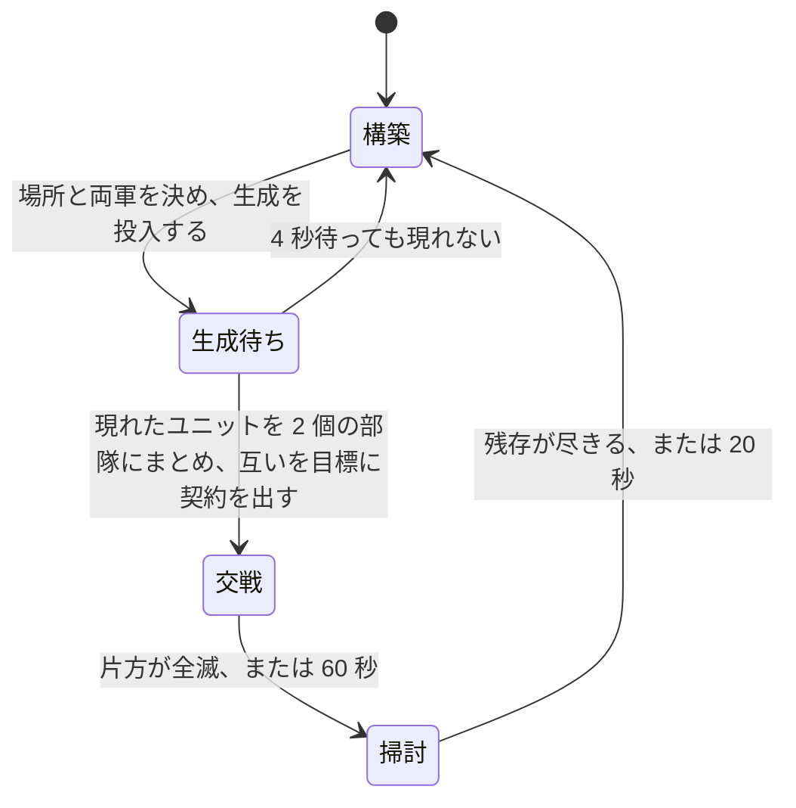

# 学習環境

[04-model-design.md](04-model-design.md) が指す「具体の形式と値」の四つ目である。[05-interface.md](05-interface.md) が観測と行動の運び方を、[06-script-policy.md](06-script-policy.md) が契約と全層のスクリプトを、[07-evaluation.md](07-evaluation.md) が二つの方策の比べ方を決めた。この文書は、**学習させる 2 層を実際に当てはめるために先に存在していなければならなかったもの**を書く。符号化、行動空間、報酬、交戦アリーナ、推論の集約、軌跡の収集、最適化である。

**環境は実装済みである。** 実物は `rwintel/learn` にあり、`python -m rwintel.learn` で動く。性質は `tests/test_learning.py` で固定してある。

**ただし学習は一度も回していない。** この文書に方策の強さに関する主張は一つもない。何が確かめてあり何が確かめてないかは [未検証のもの](#未検証のもの) に正確に書く。

## 学習方策はスクリプト方策の 1 メソッド置換である

先にこの一点を置く。以降のすべてがここに依存する。

学習する層は、スクリプト層を継承し、**決定を下す一つのメソッドだけを差し替えたもの**である。戦術層なら「5 つの逸脱のどれか」、作戦層なら「どの領域へ、どのタスクで」だけが置き換わる。任務状況の報告、実損害の切り出し、契約を出し直す条件、期限の付け方、許容損害の見積もりは、いずれも継承したスクリプトのコードがそのまま動く。

こうする理由は [04-model-design.md](04-model-design.md) の「凍結した相手に対して独立に学習・評価できること」である。学習層とスクリプト層が決定以外でも違っていたら、多数エピソード平均でスクリプトを上回ったという結果が「決定が良くなった」ことを意味しない。**再実装ではなく継承にしてあるのは、規則の写しが二つに増えて片方だけ動くことを構造で禁じるためである。**

副産物が一つある。**決定器を渡さない**と、その層は継承した規則にそのまま落ち、選ばれた行動を観測とともに書き出すだけになる。スクリプトがそのまま教師になり、出てくるのは学習層が出すのと同一形式の「状態と行動」の対である。人間のリプレイからは状態を復元できない([04-model-design.md](04-model-design.md))が、スクリプトからは無制限に取れる。

## 観測の符号化

層ごとに別の抽象度で切り出す。戦術層は担当部隊の交戦だけを、作戦層は盤面と領域と部隊だけを見る。規則は二つで、どちらも設計上の要求から来ている。

**すべての特徴は比か、明示した尺度で割った長さである。** 生のクレジット残高も生のワールド座標も一つも入れない。これは学習したい性質ではなく、成立の条件である。座標を入れればマップ寸法に方策が縛られ、クレジットの絶対値を入れれば「序盤の 2000」と「終盤の 2000」を別物として扱えない。**別のマップで読める方策**であることは [04-model-design.md](04-model-design.md) が領域を離散 ID にした理由そのものであり、符号化の側で崩したら意味がない。

**すべてのブロックは有効フラグ付きの固定長で、詰めた並びにしない。** 領域は 24 スロット、部隊は 8 スロットで、実在しないスロットは全ゼロになる。理由は [05-interface.md](05-interface.md) の観測ブロックと同じで、**スロット番号が決定をまたいで同じ場所を指すこと**が、方策が決定をまたいで状態を持てる条件だからである。詰めた並びにすると、部隊が 1 つ死んだ瞬間に残り全部の番号がずれる。

### 尺度

| 量 | 尺度 | 根拠 |
| --- | --- | --- |
| 距離(部隊から目標領域へ) | 2000 | 領域の融合距離が 400、試合の盤面は数千。普通の行軍が 1 の近くに来る |
| 距離(本拠地から) | 4000 | 上の 2 倍。盤面の端まで含める |
| 射程 | 400 | 組み込みの武装可動ユニットの射程の最大値([../game/06-content.md](../game/06-content.md)) |
| 散らばり | 400 | ゲーム側が部隊を散開させる距離 |
| 部隊の人数 | 12 | ドクトリンの定数は最大で 10([06-script-policy.md](06-script-policy.md))。満員が 1 の手前に来て、増援で膨らんだ部隊がその上に出る |
| 時間(期限・任務の経過) | 60000ms | 戦術の報酬地平が 10 秒から 60 秒([04-model-design.md](04-model-design.md))、作戦の任務が数分。両方にとって 1 分が自然な単位 |
| 試合時間 | 1200000ms | 「どれだけ遅いか」を言う 1 個の特徴のためだけの尺度 |
| クレジット | 5000 | 開始クレジットが 4000。回っている経済はここから大きく上へは行かない |
| 収入 | 100/秒 | 十分に拡張した側が届くあたり |

二つの戦力を比べる特徴はすべて `自 / (自 + 敵)` の形にしてある。**どちらが上かは言うが、何クレジット上かは言わない。** 両方が 0 のときは 0.5 を返し、盤面が空でも符号化が壊れないようにしてある。アリーナのエピソードは第 1 フレームがまさに空の盤面なので、ここで 0 除算すると最初の交戦を組む前に実行が終わる。

### 戦術の切り出し: 58 次元

継承したスクリプト戦術層が逸脱を選ぶときに手元に持っているものと、**厳密に同じ材料**である。学習層が余分に見ていたら、それはスクリプトの置換ではなく別の層であり、[07-evaluation.md](07-evaluation.md) の比較が「同じ仕事をしている二つ」の比較にならない。

| 区分 | 幅 | 中身 |
| --- | --- | --- |
| 部隊の状態 | 9 | 人数、健全度、散らばり、平均体力、直近 2 秒以内に被弾した割合、予算の消化率、許容損害と現有価値の比、期限までの残り、任務の経過 |
| 任務状況 | 5 | 進行中 / 膠着 / 劣勢 / 完了 / 期限切れ の one-hot |
| 任務種別 | 6 | 攻撃 / 防衛 / 襲撃 / 後退 / 護衛 / 包囲 の one-hot |
| 交戦スタンス | 7 | `game.units.a` の 7 種の one-hot |
| 目標領域 | 5 | 距離、単位方向ベクトル 2、領域内の勢力比、敵価値と自部隊価値の比 |
| 交戦の規模 | 2 | 近傍の敵の数、敵と自軍の価値比 |
| 敵の構成 | 7 | 役割別の価値シェア |
| 自軍の構成 | 7 | 同じ役割別の価値シェア |
| 射程 | 3 | 自軍の最短射程、敵の最長射程、その差 |
| 交戦の形 | 3 | 自軍射程内にいる敵の割合、敵射程内にいる自軍の割合、砲兵の有無 |
| 残り | 4 | 交換比、被弾中か、接敵中か、バイアス項 |

近傍の敵は半径 400 で切られたものが渡ってくる。切るのは継承したスクリプト戦術層であり、符号化はそれを受け取るだけである。役割は装甲・砲・対空・高速・建設・建物・その他の 7 種で、**種別の属性から機械的に分類する**([06-script-policy.md](06-script-policy.md))。名前では分類しない。

**特徴には名前が付けてある。** 数えるだけにしないのは、1 つずれた特徴ベクトルは落ちずに学習し、別のマップで無価値になるからである。落ちるなら気付く。落ちないから名前で固定し、名前の数とベクトルの長さが一致することを試験で押さえている。

### 作戦の切り出し: 400 次元

| ブロック | 1 スロットの幅 | スロット数 | 計 |
| --- | --- | --- | --- |
| 全体 | 16 | 1 | 16 |
| 領域 | 10 | 24 | 240 |
| 部隊 | 18 | 8 | 144 |

全体ブロックは資金、収入、ユニット上限に対する余裕、建造中の数、戦略層の姿勢 5 種の one-hot、攻勢か守勢か、許容総損害と自軍価値の比、軍事価値の優劣、領域支配の優劣、経過時間、部隊数、バイアス項である。

領域ブロックは有効フラグ、資源地点の数、自軍が押さえた数、敵が押さえた数、勢力比、敵価値と自軍総価値の比、本拠地からの距離、直近 60 秒に敵を見たか、戦略層が付けた優先度、出撃地点か。

部隊ブロックは有効フラグ、ドクトリン 4 種の one-hot、自軍全体に対する価値シェア、健全度、散らばり、本拠地からの距離、任務状況 5 種の one-hot、他の指揮者が保持しているか、この層が任務を出せるか、予算の消化率、任務の経過である。

**出撃地点かどうかだけは観測から来ない。** 線上の領域行にその欄がないためで、値はマップファイルから作った領域表([05-interface.md](05-interface.md))を持つ制御プロセス側で埋める。「資源のある場所」と「敵が湧いてきた場所」の違いは他のどの特徴も言わないので、落とせない。

## 行動空間とマスク

**戦術層は 5 つの逸脱から 1 つを選ぶ。** `hold` `withdraw` `focus` `spread` `kite` であり、[06-script-policy.md](06-script-policy.md) が決めた集合そのままである。部隊単位で 1 つで、ユニット単位では選ばない。

**作戦層は領域 24 とタスク 6 を選ぶ。** 144 通りの積として出さず、二つの頭に分ける。理由は二つある。**問われている質問が別だから**である。どこへ行く価値があるかと、着いたら何をするかは、別の理由で決まる。そして**合法集合が二つの小さなマスクの積だから**である。積空間の上のマスクは疎になり、144 個の出力の大半が常に死んでいる形になる。

マスクは三つあり、出所がそれぞれ違う。

| マスク | 何を落とすか | 出所 |
| --- | --- | --- |
| 領域 | このマップに実在しない領域スロット | 制御プロセスが作った領域表。実在する ID の集合 |
| タスク | そのドクトリンに許されていないタスク | スクリプト方策のドクトリン表。前衛は攻撃と包囲、守備は防衛と護衛、襲撃は襲撃と後退、工作は空 |
| 部隊 | 存在しない、空、他者が保持中、ドクトリンにタスクがない部隊のスロット | 部隊の記録そのもの |

**戦術層にはマスクがない。5 つは常にすべて合法である。** 順調な戦闘から後退するのは悪手であって違法ではなく、「妥当な逸脱」だけを通すマスクを書いたら、それは規則の梯子をマスクの姿で書き直したものになる。判定させたいものを環境の側で先に判定してしまっては、何も学習しない。

**工作ドクトリンのタスク集合が空**なのは、建設機に契約が落ちないようにするためである。落ちると、建物を建てに歩いている最中の建設機が引き剥がされ、建てかけの建物がまるごと損失になる。

部隊マスクは、決定の経路では実際には参照されない。継承した作戦層が決定に入るより前に、ドクトリンにタスクの無い部隊と他者が保持している部隊を落としているためである。マスクの実装は同じ規則を独立に書き下したもので、試験がその一致を押さえている。**将来この層をスクリプトから切り離すときに必要になるものを、先に置いてある。**

マスクの掛け方は、ロジットに大きな負の下駄を履かせる形にしてある。あとから正規化し直す形は採らない。**下駄なら違法な行動に勾配が一切行かず、正規化だと消えかけの勾配が行く。**

## 報酬

一般則は [04-model-design.md](04-model-design.md) が既に述べている。**各層は、上位から受け取った契約の達成度で払われる。試合の勝敗を受け取るのは最上位の戦略層だけである。** これを具体にする。

**下位層は上位層の報酬を一切見ない。** これが層をまたいだ信用割り当てを不要にし、同時に戦術の報酬地平を任務の長さ、すなわち 10 秒から 60 秒に閉じる。この予算で学習できる地平はその長さだけである。

### 連続量はすべてポテンシャル整形に入れる

整形項を `γ × 後のポテンシャル - 前のポテンシャル` の形にすると、**ポテンシャルが何であっても最適方策が変わらない**。これが決定的な性質である。ポテンシャルの選び方を間違えても、失うのはサンプル効率だけで、正しさは失わない。逆に、この形でない連続報酬を足すと、間違ったときに「最適な方策そのものが変わる」という直しようのない壊れ方をする。

したがって、**連続なものはすべてポテンシャルに入れ、直接払うのは任務の離散的な結末だけ**にした。

整形の割引と収益の割引は同じ 0.99 にしてある。**ここがずれると整形が伸縮せず、残差が最適方策を動かす。** ポテンシャル整形を選んだ唯一の理由が消えるので、二箇所に同じ値を置いてある。

ポテンシャルも比で書く。戦車 4 両を巡る任務と 40 両を巡る任務は同じ任務であり、軍の大きさとともに報酬が育つと、同じ振る舞いが試合の後半ほど高く売れることになる。

### 戦術層

ポテンシャルは二つの和である。目標領域に立てているか(重み 0.7)と、許容損害をまだ使っていないか(重み 0.3)。**確保の方を重く置くのは、任務とは領域を取ることであって、予算はその「取り方」に対する制約にすぎないからである。**

契約が新しく出された周期は何も払わない。ポテンシャルをそこで取り、次の周期から差分を払う。**契約を受け取っただけの一歩に、部隊がたまたま立っていた場所の分を払わない**ためである。

終端は 4 種類ある。

| 結末 | 支払い | 何のためか |
| --- | --- | --- |
| 完了 | +1.0 | 領域を取って居座った。任務の達成そのもの |
| 期限切れ | -0.5 | 失敗ではあるが、特に何かを失ったわけではない |
| 劣勢 | -1.0 | 予算は消え領域は来なかった。`cost_budget` の仕組みが高く付かせたい結末そのもの |
| 全滅 | -1.0 | 契約中に部隊が消えた |

**全滅を劣勢と分けてあるのは、消えた部隊はもう後退できないからである。** 戦術層にはそこに至るまでの全周期、後退という選択肢があった。同じ -1.0 だが別の事象として記録する。

完了には超過の減点が乗る。実損害が許容損害を超えていたら、超過分に比例して最大 0.5 を引く(2 倍で満額)。**発注された値段で取られなかった領域は、発注された値段で取られた領域と同じではない。**

### 作戦層

ポテンシャルは三つの和である。戦略層が価値ありと言った領域をどれだけ押さえているか(重み 0.5)、軍事価値でどれだけ前に出ているか(0.4)、許容総損害をどれだけ使ったか(0.1)。

**試合の勝敗は入っていない。** 04 が終端の勝敗を戦略層だけのものと決めており、それを見られる層は「命令を遂行すること」ではなく「勝つこと」を学ぶ。一見改善に見えるが、戦略層を差し替えた瞬間にその下が全部学習し直しになる。ここに入れてあるのは戦略層自身の要求の記述、すなわちどの領域を価値ありと言ったか、である。

**1 周期の 1 つの数字が、その周期のすべての決定を払う。** 戦略層の要求は盤面全体についての言明であって、どの部隊についての言明でもない。部隊ごとに切り分けるには観測が支えていない帰属推定が要り、でっち上げれば計測が支えられる以上のことを主張することになる。

### 定数

| 定数 | 値 |
| --- | --- |
| 戦術ポテンシャル: 確保の重み / 予算の重み | 0.7 / 0.3 |
| 戦術終端: 完了 / 期限切れ / 劣勢 / 全滅 | +1.0 / -0.5 / -1.0 / -1.0 |
| 超過の減点(許容損害の 2 倍で満額) | 0.5 |
| 作戦ポテンシャル: 優先度 / 軍事価値差 / 許容損害 | 0.5 / 0.4 / 0.1 |
| 割引(整形と収益で共通) | 0.99 |

いずれも初期値である。ポテンシャルの重みは最適方策を動かさないので、外して測る価値が最も低い数値でもある。終端の比だけは方策を動かすため、調整するならそちらから始める。

## 交戦アリーナ

**戦術層は試合の中で学習させない。** 任務は 10 秒から 60 秒、試合は 15 分である。試合の中で戦術層を学習させると、実時間の圧倒的大部分が、その決定と何の関係もない経済・ビルドオーダ・行軍のシミュレーションに消える。[04-model-design.md](04-model-design.md) が「戦術の学習には試合を回す必要がない」と書いたのはこのことで、これはその実装である。

材料は既に揃っていた。ユニットの即時生成が正規のコマンド経路を通ること(**実行時確認**、[../game/04-actions.md](../game/04-actions.md))、試合設定で開始ユニットを持たない盤面から始められること([../game/05-match-control.md](../game/05-match-control.md))、サンドボックスのフラグ `l.bv` が立つと全プレイヤーのユニットを操作できること(**逆アセンブル確認**、[../game/05-match-control.md](../game/05-match-control.md))である。三つを合わせると、**交戦を組んでは戦わせ、片付けてはまた組む、1 本の長いエピソード**になる。

### 消す命令がないので、片付けるのではなく終わらせる

**ユニットを取り除くコマンドはゲームに存在しない。** システム命令は生成・降参・再同期の三つしかない(**逆アセンブル確認**、[../game/04-actions.md](../game/04-actions.md))。体力への代入で消すのはロックステップを壊す近道そのものであり、[04-model-design.md](04-model-design.md) が最初に締め出したものである。

したがって交戦は**片付けられない。終わらせる**。制限時間が来たら、両軍の生き残りを互いにぶつけ直し、居なくなるまで待つ。削除するより遅く、**すべての変更をコマンド経路に載せたままにする唯一の方法**である。この性質は方式全体が依存しているもので、速度と引き換えにできるものではない。

盤面が完全に空にならないことは前提にしてある。次の交戦の場所は、立っているものから最も遠い領域を選ぶ。前の交戦の残りが次の交戦に紛れ込むと、層が払われている戦闘が層に与えられた戦闘でなくなる。

### 一つのエピソードの流れ



生成に待ちが要るのは、生成もコマンドキューを通るため即時ではないからである。

### 両側とも同じプロセスから動かす

サンドボックスのフラグが立っているので、1 プロセスで交戦の両側を操作できる。**相手側は同じ戦術層に、左右を入れ替えた盤面を読ませて動かす。**

入れ替えは敵味方のフラグを反転するだけで済む。位置、体力、射程、誰が誰を撃っているかは、いずれも元から対称だからである。観測に敵味方が入っているのはこのプロセスから見た記録という一点だけであり、そこを反転すれば相手側から見た同じフレームになる。**元のフレームは書き換えない。** 同じ周期に両側がそれを読むためである。

これで自己対戦がネットワーク構成なしで組める。既定では学習中の方策どうしを戦わせ、`--script-opponent` を渡すと相手をスクリプト戦術層に固定できる。**測りたいのはスクリプトが同じ仕事をしたときとの差**([07-evaluation.md](07-evaluation.md))なので、固定できることが要る。

### 交戦の作り方

| 項目 | 値 |
| --- | --- |
| 片側の予算 | 1200 から 5000 クレジットの一様分布 |
| 戦力比(弱い側の強い側に対する比) | 0.5 から 1.0 の一様分布 |
| 片側の最大ユニット数 | 14 |
| 両軍の間隔 | 700 |
| 交戦の制限時間 | ゲーム内 60 秒 |
| 掃討の制限時間 | ゲーム内 20 秒 |
| 生成待ち | ゲーム内 4 秒 |
| エピソードの既定の長さ | ゲーム内 1800 秒 |

**間隔 700 は、どちらも相手の射程の内側から始めないための値である。** 内側から始めると、どちらの層が何を選ぶより前に戦闘が決まる。同時に、数秒で接触する程度には近い。

**戦力比を 1 に固定しない**のは、五分の戦いしか見たことのない層は「引くべき戦いがある」ことを学べないためである。`withdraw` は 5 つの逸脱の 1 つであり、それが正解になる盤面が訓練に無ければ、選ばれる理由もない。

編成する種別は、地上を動いて地上を撃てるものに限ってある。航空機と対空できないユニットの組み合わせは戦闘にならず、**届かない相手との交戦から層が学ぶのは「何をしても関係ない」だけ**である。

## 推論の集約

**推論はインスタンスごとに持たせず、1 個のサーバに集約する。** [04-model-design.md](04-model-design.md) が制御の周期と計算量の節で決めてあり、[05-interface.md](05-interface.md) が制御プロセス 1・ゲームプロセス 8 の非対称をその帰結として置いている。

数の見当はこうである。倍率 10 では戦術周期は実時間 20 ミリ秒であり、8 インスタンスで毎秒 400 の「インスタンスと周期の組」になる。04 の毎秒 400 回はこの数え方の値である。**実装は部隊ごとに要求を出す**ので、生の要求数は部隊数の分だけこれより多い。どちらにせよ、1 回ずつ答えれば大半が起動のオーバヘッドになる。予算に収まるだけ小さくした網ほど、この比率は悪くなる。

集約が無償で成立するのは、[05-interface.md](05-interface.md) が**決定の遅延を 1 周期に固定してある**からである。周期の内側で誰も答えを待っていないので、数ミリ秒のうちに届いた要求はまとめて 1 回で答えてよい。インスタンスから見えるものは何も変わらない。

**窓は 4 ミリ秒である。周期の 20 ミリ秒に対して 5 分の 1 に置いてある。**

短くしてあるのは意図的で、これは待ち行列の深さでも throughput のつまみでもない。**窓が周期に近づいた瞬間、答えはそれが対象としていた周期より後に届くようになり、決定の遅延が「1 周期」であることをやめて「機材の混み具合」になる。** それは 05 が正面から拒否したものである。待つ設計を採らないのは、実時間の負荷によって有効な方策が変わり、学習時と運用時で環境そのものが変わるからである。窓を伸ばすのは、その拒否した設計へ裏口から戻る操作にあたる。

上限は 1 回 64 件である。インスタンス数を超えて束ねても得るものがなく、上限があれば一度の詰まりが際限なく大きな呼び出しに化けない。

**待つのは制御プロセスのインスタンス別スレッドだけである。** ゲームスレッドは決定を待たない([05-interface.md](05-interface.md))。ここで待つのは、既に読み終えた観測と、まだ送っていない行動の間である。

サーバは呼び出し回数と処理件数を数えており、平均バッチ長を実行の最後に報告する。**束ねが効いている窓と、単に遅延を足しているだけの窓は、それでしか区別できない。**

## 軌跡の収集

**1 本の軌跡は 1 つの任務であり、1 エピソードではない。** [04-model-design.md](04-model-design.md) の報酬地平の規則を具体にすると、こうなる。

戦術層では、部隊に新しい契約が出た時点で前の軌跡が閉じ、新しい軌跡が始まる。試合はまだ終わっていない。部隊が全滅したらそこで 1 本閉じる。他の部隊は続いている。**境界を引くのが別の層の決定であることは、解くべき問題ではなく取り決めそのものである。** 契約が仕事の単位である以上、契約が支払いの単位になる。

作戦層では、部隊ごとに 1 本を、その部隊が盤面から消えるか試合が打ち切られるまで伸ばす。

### 打ち切られた軌跡は終端ではない

試合が打ち切られたときに走っていた任務は、**失敗していない。観測されなくなっただけである。** これを終端として扱うと、方策は「試合を終わらせること」に価値があると学ぶ。したがって打ち切られた軌跡は最後の状態の値推定でブートストラップし、自力で終わった軌跡だけを終端 0 で閉じる。二つの場合の違いはその一点だけであり、それを試験で固定してある。

値推定は層が明示的に渡すのではなく、渡されなければ**その軌跡の最後の決定に付いていた値ヘッドの推定**が使われる。方策が答えるたびに保存されている値であり、次の状態の推定の代わりとしては十分に近い。0 で代用すると「観測されなくなった時点から先は無価値である」と主張することになり、それはまさに教えたくないことである。スクリプトを教師として記録するときだけは値ヘッドが無いので実効値が 0 になるが、そこでは勾配を取らないので影響しない。

### 乱入された部隊の決定は、後から印を付けて落とす

[04-model-design.md](04-model-design.md) の規則である。指揮系統が制御していない部隊の戦果で褒めたり罰したりすると、間違ったことを教える。

**印付けは遅い。乱入が判明するのが遅いからである。** 人が部隊からユニットを抜くのは、その部隊についての決定が下されてから数周期あとかもしれない。しかも任務の途中の介入は、**その後の決定だけでなく前の決定も無効にする**。任務全体の帰結で払っている以上、その帰結はもうこの層が選んだことの帰結ではない。

したがって、決定は収集の時点では落とさず全部貯め、エピソードの終わりに、乱入者が触った部隊の一覧を受け取ってから、開いている軌跡と閉じた軌跡の両方に遡って印を付ける。取り出すときに印の付いたものを外す。**遅く印を付けて最後に濾すのが、成立する唯一の順序である。**

`collect` の実行では印を残したまま書き出す。教師データとして使うときに何を落とすかは、そちらの判断だからである。

### 報酬は 1 周期遅れて着く

決定は、盤面がその下で動くまで払えない。したがって各周期は、届いた盤面から前の周期の決定を払い、それから新しい決定を下す。これは行動について [05-interface.md](05-interface.md) が既に持っている 1 周期の構造と同じものであり、揃えてあるので**バッファの 1 ステップがちょうど 1 周期のゲーム内時間を覆う**。

## 最適化

**環境は止められない。** ゲームは自分のプロセスで倍率 10 で走っており、こちらが更新を計算している間も止まらない。差し止められる step 関数が存在しない。教科書の方策勾配が前提にする「固定パラメータで集める、更新する、また集める」という交替が、ここでは組めない。

したがって収集は連続で、更新は十分に溜まった時点で別スレッドが行う。**バッチは常に、その収集中に既に動いているパラメータの下で集められる。**

これが耐えられるのは理由が一つあるからで、それがこの方法をクリップ比のものにしている理由でもある。**各ステップは、その行動を実際に取った方策が割り当てた対数確率を持ち歩いている。** 目的関数はそれに対する比であり、クリップされている。行動したパラメータと更新されるパラメータの間の小さな遅れは、重要度比がそのために存在する状況そのものである。耐えられないのは大きな遅れなので、**バッチは実時間で 1 分を大きく下回って集まる大きさに保ち、更新は短く保つ。**

重みは、こちらが書いている間に他のスレッドの推論経路が読む。両者は同じロックを取る。推論は既に毎秒数回から数十回の呼び出しに束ねてあり、更新は数ミリ秒なので、競合は避ける価値がない。**避ける価値があるのは重み行列の途中読みの方で**、それは「たまに何でもないような振る舞いをする方策」として現れる。

### 網の大きさ

[04-model-design.md](04-model-design.md) は「戦術側は共有パラメータの軽量なモデルにする」という制約を、毎秒 400 という要求と 6GB の GPU から先に導いてあった。その具体である。

| 層 | 入力 | 隠れ層 | 出力 | パラメータ数 |
| --- | --- | --- | --- | --- |
| 戦術 | 58 | 64 × 2 | 逸脱 5 + 価値 1 | 8,326 |
| 作戦 | 400 + 部隊スロット 8 | 192 × 2 | 領域 24 + タスク 6 + 価値 1 | 121,567 |

単精度で戦術が約 33KB、作戦が約 487KB である。**この大きさは好みではなく、毎秒 400 という要求の帰結である。** 作戦層は 10 分の 1 の頻度で盤面全体を読むので広くしてよいが、深くはしない。同じカードだからである。

どちらも actor-critic を 1 本の胴体と 2 つの頭にしてある。胴体を共有すると価値推定が追加費用なしで手に入り、この頻度ではそれが効く。**価値ヘッドが存在するのは優位推定がそれを要るからで、他に読むものはない。**

作戦層には、どの部隊についての決定かを one-hot のスロットとして盤面と一緒に渡す。部隊行だけを別に渡す形は採らない。**部隊 3 をどこへやるかは、部隊 1 と 2 をどこへやったかに依存する。** 他を見られない網は、独立でない 8 個の問題を独立に解くことになる。

### 定数

| 定数 | 値 | 役割 |
| --- | --- | --- |
| クリップ | 0.2 | 1 回の更新が行動確率を動かせる幅。上の遅れに対する安全弁そのもの |
| 価値損失の重み | 0.5 | 胴体を共有した価値ヘッドの誤差の効き |
| エントロピー | 0.01 | 小さいが 0 ではない。最初の数百ステップで 1 つの行動に潰れた方策は、それを覆す証拠を出すのをやめるので二度と戻らない |
| 勾配ノルム上限 | 0.5 | 部隊が全滅した 1 エピソードが 1 時間を消す一歩を作らないため |
| 学習率 | 3e-4 | |
| エポック | 4 | 1 回では比の仕組みが割に合わず、この大きさのバッチで多すぎると過適合する |
| ミニバッチ | 256 | |
| 更新するバッチ | 1024 ステップ(`--batch`) | 実時間で 1 分を大きく下回って集まる大きさ |
| GAE の trace | 0.95 | 常套の出発点。ここを動かすべきという計測はまだ無い |

優位は取り出す時点で中心化・正規化する。しないと、勾配の一歩の大きさが「そのバッチのエピソードがたまたまどれだけ波乱含みだったか」で決まり、一度うまくいった学習率が次のバッチで方策と無関係な理由で壊れる。

**最適化器は 1 本で両層を賄う。** 作戦層は 2 つを同時に選ぶので対数確率が 2 つの和、エントロピーも 2 つの和になる。それ以外、比・クリップ・価値の目標・勾配クリップは同一であり、二度書けば揃え続ける対象が 2 つに増えるだけである。

実行を止めるときは、残っている軌跡を切って最後の半端なバッチも消化する。**捨てる方が惜しい。** 実行中で最も新しく最も関係のある経験だからである。

## 手順

制御プロセスを先に起動し、そこへゲームを接続するのは他の実行と同じである([05-interface.md](05-interface.md))。

戦術層の学習である。アリーナのエピソードは開始ユニットを持たず、霧は無効に固定される。

```powershell
python -m rwintel.learn tactics --instances 4 --max-seconds 1800 --save local\tactics.pt
.\tools\Start-RwAgents.ps1 -Count 4 -Speed 10
```

作戦層の学習である。通常のスキルミッシュであり、`--intruder` でスクリプト乱入者を注入する。**[04-model-design.md](04-model-design.md) が学習と評価の両方に乱入を要求している**ので、これを付けないのは既定ではなく手抜きである。

```powershell
python -m rwintel.learn operations --instances 4 --episodes 6 --map Lake --max-seconds 300 --intruder --save local\operations.pt
```

スクリプトの決定を教師データとして書き出す実行である。決定器を渡さない層が継承した規則に落ち、選んだ行動を観測とともに記録する。

```powershell
python -m rwintel.learn collect --layer tactics --instances 4 --record local\teacher.jsonl
python -m rwintel.learn collect --layer operations --instances 4 --episodes 4 --record local\teacher-ops.jsonl
```

主な引数である。`--max-seconds` を省いた場合の既定は、`operations` が 300 秒、それ以外がアリーナの 1800 秒になる。

| 引数 | 意味 |
| --- | --- |
| `--instances` / `--episodes` | 接続するゲームの数と、1 インスタンスあたりのエピソード数 |
| `--load` / `--save` | 開始時に読むパラメータと、終了時に書くパラメータ。読み先が無ければ新しい方策から始める |
| `--device` | torch のデバイス。省略するとカードがあればカード |
| `--batch` | 1 回の更新に使うステップ数 |
| `--intruder` | スクリプト乱入者を注入する |
| `--script-opponent` | アリーナの相手を、学習中の方策ではなくスクリプト戦術層に固定する |
| `--layer` | `collect` でどちらの層を記録するか |
| `--record` | 学習実行ではエピソード記録の書き出し先、`collect` では決定列の書き出し先 |
| `--record-episodes` | `collect` でのエピソード記録の書き出し先 |

**`--record` の意味が実行の種類で変わる**点だけ注意が要る。学習実行にはエピソード記録しか出るものがなく、`collect` には両方あるためである。

性質の試験はゲームを起動せずに走る。

```powershell
python tests\test_learning.py
```

## 未検証のもの

正確に書く。

**学習は一度も回していない。** 環境を通す確認として、アリーナと通常のスキルミッシュのそれぞれで数百の決定を集めて更新を数回走らせ、パラメータを書き出すところまでは動かした。しかしそれは配管の確認であって学習ではない。この文書のどこにも、学習した方策の強さについての主張はなく、[07-evaluation.md](07-evaluation.md) の比較にかけた結果も存在しない。**学習した方策がスクリプトを上回るかどうかは、まったく分かっていない。**

確かめてあるのは次である。

- **全モジュールが読み込める。** `rwintel.learn` を読み込むだけではテンソル library が読み込まれないことも含む。符号化・報酬・軌跡はそれ無しで有用であり、スクリプトだけを走らせる制御プロセスがその費用を払わない。
- **符号化と報酬が、試験の言うとおりに振る舞う。** 特徴名とベクトル長の一致、全特徴が `-1` から `+1` に収まること、空の盤面でも符号化できること、領域ブロックがマップによらず 24 行であること、マスクが実在する領域とドクトリンの許すタスクだけを通すこと、整形が伸縮すること、完了・劣勢・全滅がそれぞれの符号で払われること、打ち切られた軌跡と終わった軌跡が別に採点されること、印の付いた決定が取り出しから外れること、鏡像が敵味方だけを入れ替えること。16 件が通る。
- **最適化の一歩が走る。** 合成したステップから、戦術網と作戦網の両方について更新が 1 回完走することを確認した。**これは形の確認であって、学習が進むことの確認ではない。**

確かめていないのは次である。

- **アリーナが良い交戦を組むかどうか。** 組んで戦わせて掃討することは実物で動いている(ゲーム内 300 秒の 1 エピソードで 5 交戦、うち 1 交戦は生成が現れず組み直しになった)。分かっていないのは中身の質である。戦力の抽選は価格だけを見ており、相性も地形も見ていない。掃討が残した生存者は次の交戦地点を選ぶ材料にしか使われておらず、盤面は少しずつ埋まる。
- **推論の集約が実際にどれだけ束ねるか。** 報告される平均バッチ長は、いま走らせているインスタンス 1 個の実行ではどちらの層でも 1.0 である。**束ねる利益が出るのは 8 並列のときであり、その測定はまだ無い。** 窓 4 ミリ秒に対する呼び出し回数の上限が毎秒 250 回であることは導けるが、それは計測ではない。
- **並列実行そのもの。** アリーナも作戦の学習もインスタンス 1 個でしか回していない。[03-throughput.md](03-throughput.md) の 8 並列が学習の実行でも成り立つかは確かめていない。
- **すべての定数。** 報酬の重み、終端の比、アリーナの予算と戦力比、最適化の各値は、いずれも根拠のある初期値であって計測で選ばれた値ではない。ポテンシャルの重みだけは最適方策を動かさないので、調整の優先度が最も低い。
- **凍結して交互に学習させる一巡。** [04-model-design.md](04-model-design.md) の学習の順序は、戦術を先に固めてから作戦を凍結した戦術に対して学習させる、である。片方だけを動かす仕掛けは実装にあるが、一巡は回していない。
