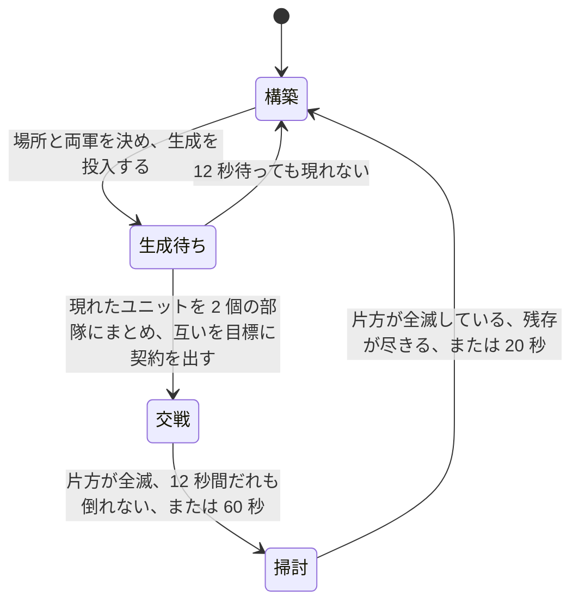

# 学習環境

[04-model-design.md](04-model-design.md) が指す「具体の形式と値」の四つ目である。[05-interface.md](05-interface.md) が観測と行動の運び方を、[06-script-policy.md](06-script-policy.md) が契約と全層のスクリプトを、[07-evaluation.md](07-evaluation.md) が二つの方策の比べ方を決めた。この文書は、**学習させる 2 層を実際に当てはめるために先に存在していなければならなかったもの**を書く。符号化、行動空間、報酬、交戦アリーナ、推論の集約、軌跡の収集、最適化、そしてスクリプトを写して出発点にする仕掛けである。

**環境は実装済みである。** 実物は `rwintel/learn` にあり、`python -m rwintel.learn` で動く。性質は `tests/test_learning.py` で固定してある。

**ただし学習は一度も回していない。** この文書に方策の強さに関する主張は一つもない。何が確かめてあり何が確かめてないかは [未検証のもの](#未検証のもの) に正確に書く。

## 学習方策はスクリプト方策の 1 メソッド置換である

先にこの一点を置く。以降のすべてがここに依存する。

学習する層は、スクリプト層を継承し、**決定を下す一つのメソッドだけを差し替えたもの**である。戦術層なら「5 つの逸脱のどれか」、作戦層なら「どの領域へ、どのタスクで」だけが置き換わる。任務状況の報告、実損害の切り出し、契約を出し直す条件、期限の付け方、許容損害の見積もりは、いずれも継承したスクリプトのコードがそのまま動く。

こうする理由は [04-model-design.md](04-model-design.md) の「凍結した相手に対して独立に学習・評価できること」である。学習層とスクリプト層が決定以外でも違っていたら、多数エピソード平均でスクリプトを上回ったという結果が「決定が良くなった」ことを意味しない。**再実装ではなく継承にしてあるのは、規則の写しが二つに増えて片方だけ動くことを構造で禁じるためである。**

副産物が一つある。**決定器を渡さない**と、その層は継承した規則にそのまま落ち、選ばれた行動を観測とともに書き出すだけになる。スクリプトがそのまま教師になり、出てくるのは学習層が出すのと同一形式の「状態と行動」の対である。人間のリプレイからは状態を復元できない([04-model-design.md](04-model-design.md))が、スクリプトからは無制限に取れる。

## 観測の符号化

層ごとに別の抽象度で切り出す。戦術層は担当部隊の交戦だけを、作戦層は盤面と領域と部隊だけを見る。規則は二つで、どちらも設計上の要求から来ている。

**すべての特徴は比か、明示した尺度で割った長さである。** 生のクレジット残高も生のワールド座標も一つも入れない。これは学習したい性質ではなく、成立の条件である。座標を入れればマップ寸法に方策が縛られ、クレジットの絶対値を入れれば「序盤の 2000」と「終盤の 2000」を別物として扱えない。**別のマップで読める方策**であることは [04-model-design.md](04-model-design.md) が領域を離散 ID にした理由そのものであり、符号化の側で崩したら意味がない。

**すべてのブロックは有効フラグ付きの固定長で、詰めた並びにしない。** 領域は 24 スロット、部隊は 8 スロットで、実在しないスロットは全ゼロになる。理由は [05-interface.md](05-interface.md) の観測ブロックと同じで、**スロット番号が決定をまたいで同じ場所を指すこと**が、方策が決定をまたいで状態を持てる条件だからである。詰めた並びにすると、部隊が 1 つ死んだ瞬間に残り全部の番号がずれる。

### 尺度

| 量 | 尺度 | 根拠 |
| --- | --- | --- |
| 距離(部隊から目標領域へ) | 2000 | 領域の融合距離が 400、試合の盤面は数千。普通の行軍が 1 の近くに来る |
| 距離(本拠地から) | 4000 | 上の 2 倍。盤面の端まで含める |
| 射程 | 400 | 組み込みの武装可動ユニットの射程の最大値([../game/06-content.md](../game/06-content.md)) |
| 散らばり | 400 | ゲーム側が部隊を散開させる距離 |
| 部隊の人数 | 12 | ドクトリンの定数は最大で 10([06-script-policy.md](06-script-policy.md))。満員が 1 の手前に来て、増援で膨らんだ部隊がその上に出る |
| 時間(期限・任務の経過) | 60000ms | 戦術の報酬地平が 10 秒から 60 秒([04-model-design.md](04-model-design.md))、作戦の任務が数分。両方にとって 1 分が自然な単位 |
| 試合時間 | 1200000ms | 「どれだけ遅いか」を言う 1 個の特徴のためだけの尺度 |
| クレジット | 5000 | 開始クレジットが 4000。回っている経済はここから大きく上へは行かない |
| 収入 | 100/秒 | 十分に拡張した側が届くあたり |

二つの戦力を比べる特徴はすべて `自 / (自 + 敵)` の形にしてある。**どちらが上かは言うが、何クレジット上かは言わない。** 両方が 0 のときは 0.5 を返し、盤面が空でも符号化が壊れないようにしてある。アリーナのエピソードは第 1 フレームがまさに空の盤面なので、ここで 0 除算すると最初の交戦を組む前に実行が終わる。

### 戦術の切り出し: 58 次元

継承したスクリプト戦術層が逸脱を選ぶときに手元に持っているものと、**厳密に同じ材料**である。学習層が余分に見ていたら、それはスクリプトの置換ではなく別の層であり、[07-evaluation.md](07-evaluation.md) の比較が「同じ仕事をしている二つ」の比較にならない。

| 区分 | 幅 | 中身 |
| --- | --- | --- |
| 部隊の状態 | 9 | 人数、健全度、散らばり、平均体力、直近 2 秒以内に被弾した割合、予算の消化率、許容損害と現有価値の比、期限までの残り、任務の経過 |
| 任務状況 | 5 | 進行中 / 膠着 / 劣勢 / 完了 / 期限切れ の one-hot |
| 任務種別 | 6 | 攻撃 / 防衛 / 襲撃 / 後退 / 護衛 / 包囲 の one-hot |
| 交戦スタンス | 7 | `game.units.a` の 7 種の one-hot |
| 目標領域 | 5 | 距離、単位方向ベクトル 2、領域内の勢力比、敵価値と自部隊価値の比 |
| 交戦の規模 | 2 | 近傍の敵の数、敵と自軍の価値比 |
| 敵の構成 | 7 | 役割別の価値シェア |
| 自軍の構成 | 7 | 同じ役割別の価値シェア |
| 射程 | 3 | 自軍の最短射程、敵の最長射程、その差 |
| 交戦の形 | 3 | 自軍射程内にいる敵の割合、敵射程内にいる自軍の割合、砲兵の有無 |
| 残り | 4 | 交換比、被弾中か、接敵中か、バイアス項 |

近傍の敵は半径 400 で切られたものが渡ってくる。切るのは継承したスクリプト戦術層であり、符号化はそれを受け取るだけである。役割は装甲・砲・対空・高速・建設・建物・その他の 7 種で、**種別の属性から機械的に分類する**([06-script-policy.md](06-script-policy.md))。名前では分類しない。

**特徴には名前が付けてある。** 数えるだけにしないのは、1 つずれた特徴ベクトルは落ちずに学習し、別のマップで無価値になるからである。落ちるなら気付く。落ちないから名前で固定し、名前の数とベクトルの長さが一致することを試験で押さえている。

### 作戦の切り出し: 400 次元

| ブロック | 1 スロットの幅 | スロット数 | 計 |
| --- | --- | --- | --- |
| 全体 | 16 | 1 | 16 |
| 領域 | 10 | 24 | 240 |
| 部隊 | 18 | 8 | 144 |

全体ブロックは資金、収入、ユニット上限に対する余裕、建造中の数、戦略層の姿勢 5 種の one-hot、攻勢か守勢か、許容総損害と自軍価値の比、軍事価値の優劣、領域支配の優劣、経過時間、部隊数、バイアス項である。

領域ブロックは有効フラグ、資源地点の数、自軍が押さえた数、敵が押さえた数、勢力比、敵価値と自軍総価値の比、本拠地からの距離、直近 60 秒に敵を見たか、戦略層が付けた優先度、出撃地点か。

部隊ブロックは有効フラグ、ドクトリン 4 種の one-hot、自軍全体に対する価値シェア、健全度、散らばり、本拠地からの距離、任務状況 5 種の one-hot、他の指揮者が保持しているか、この層が任務を出せるか、予算の消化率、任務の経過である。

**出撃地点かどうかだけは観測から来ない。** 線上の領域行にその欄がないためで、値はマップファイルから作った領域表([05-interface.md](05-interface.md))を持つ制御プロセス側で埋める。「資源のある場所」と「敵が湧いてきた場所」の違いは他のどの特徴も言わないので、落とせない。

## 行動空間とマスク

**戦術層は 5 つの逸脱から 1 つを選ぶ。** `hold` `withdraw` `focus` `spread` `kite` であり、[06-script-policy.md](06-script-policy.md) が決めた集合そのままである。部隊単位で 1 つで、ユニット単位では選ばない。

**作戦層は領域 24 とタスク 6 を選ぶ。** 144 通りの積として出さず、二つの頭に分ける。理由は二つある。**問われている質問が別だから**である。どこへ行く価値があるかと、着いたら何をするかは、別の理由で決まる。そして**合法集合が二つの小さなマスクの積だから**である。積空間の上のマスクは疎になり、144 個の出力の大半が常に死んでいる形になる。

マスクは三つあり、出所がそれぞれ違う。

| マスク | 何を落とすか | 出所 |
| --- | --- | --- |
| 領域 | このマップに実在しない領域スロット | 制御プロセスが作った領域表。実在する ID の集合 |
| タスク | そのドクトリンに許されていないタスク | スクリプト方策のドクトリン表。前衛は攻撃と包囲、守備は防衛と護衛、襲撃は襲撃と後退、工作は空 |
| 部隊 | 存在しない、空、他者が保持中、ドクトリンにタスクがない部隊のスロット | 部隊の記録そのもの |

**戦術層にはマスクがない。5 つは常にすべて合法である。** 順調な戦闘から後退するのは悪手であって違法ではなく、「妥当な逸脱」だけを通すマスクを書いたら、それは規則の梯子をマスクの姿で書き直したものになる。判定させたいものを環境の側で先に判定してしまっては、何も学習しない。

**工作ドクトリンのタスク集合が空**なのは、建設機に契約が落ちないようにするためである。落ちると、建物を建てに歩いている最中の建設機が引き剥がされ、建てかけの建物がまるごと損失になる。

部隊マスクは、決定の経路では実際には参照されない。継承した作戦層が決定に入るより前に、ドクトリンにタスクの無い部隊と他者が保持している部隊を落としているためである。マスクの実装は同じ規則を独立に書き下したもので、試験がその一致を押さえている。**将来この層をスクリプトから切り離すときに必要になるものを、先に置いてある。**

マスクの掛け方は、ロジットに大きな負の下駄を履かせる形にしてある。あとから正規化し直す形は採らない。**下駄なら違法な行動に勾配が一切行かず、正規化だと消えかけの勾配が行く。**

## 報酬

一般則は [04-model-design.md](04-model-design.md) が既に述べている。**各層は、上位から受け取った契約の達成度で払われる。試合の勝敗を受け取るのは最上位の戦略層だけである。** これを具体にする。

**下位層は上位層の報酬を一切見ない。** これが層をまたいだ信用割り当てを不要にし、同時に戦術の報酬地平を任務の長さ、すなわち 10 秒から 60 秒に閉じる。この予算で学習できる地平はその長さだけである。

### 周期ごとの連続量はすべてポテンシャル整形に入れる

整形項を `γ × 後のポテンシャル - 前のポテンシャル` の形にすると、**終端状態のポテンシャルを 0 とみなす限り、ポテンシャルが何であっても最適方策が変わらない**。これが決定的な性質である。ポテンシャルの選び方を間違えても、失うのはサンプル効率だけで、正しさは失わない。逆に、この形でない周期ごとの連続報酬を足すと、間違ったときに「最適な方策そのものが変わる」という直しようのない壊れ方をする。

したがって、**周期ごとに動く連続量はすべてポテンシャルに入れ、直接払うのは任務が終わったときの一度きりの支払いだけ**にした。終端の支払いが連続量であっても構わない。整形の議論が禁じているのは各周期に足される連続報酬であって、軌跡に一度だけ乗る終端は報酬関数そのものの定義であり、伸縮する項ではないからである。

**Φ(終端)=0 は規約であって観測ではない。** 整形が無害なのは、1 本の軌跡にわたって和が伸縮して消えるからである。最後の一項が `γ × 0 - Φ(最後の状態)` でなければ和は `Φ(最後の状態)` の残差を残し、残差は最後の状態に依存するので**まさに最適方策を動かす**。終端状態のポテンシャルは定義されていない量なので、0 と決めるのはこちらの仕事である。整形の割引と収益の割引を同じ 0.99 にしてあるのも同じ議論の一部で、**ここがずれると整形が伸縮せず、残差が最適方策を動かす。** ポテンシャル整形を選んだ唯一の理由が消えるので、二箇所に同じ値を置いてある。

**規約は軌跡が閉じるすべての経路で守る。** 契約自身の結末(完了・期限切れ・劣勢・全滅)が発火した周期も、アリーナが交戦を打ち切って外から閉じる周期も、その周期に払う整形項は `0 - 保持していた Φ` であって、実際の `γΦ(s')` ではない。効き方が最も大きいのは完了で、領域を取った盤面はポテンシャルの上端に近く 0.65 前後になるから、`γΦ(s')` を残すと完了が定義より 0.64 相当だけ高く見え、しかも**予算をどれだけ使ったかによってその上乗せ額が変わる**。終端によって上乗せが変わるというのは、整形が持ってはならない性質そのものである。

ポテンシャルも比で書く。戦車 4 両を巡る任務と 40 両を巡る任務は同じ任務であり、軍の大きさとともに報酬が育つと、同じ振る舞いが試合の後半ほど高く売れることになる。

### 戦術層

ポテンシャルは二つの和である。目標領域に立てているか(重み 0.7)と、許容損害をまだ使っていないか(重み 0.3)。**確保の方を重く置くのは、任務とは領域を取ることであって、予算はその「取り方」に対する制約にすぎないからである。**

契約が新しく出された周期は何も払わない。ポテンシャルをそこで取り、次の周期から差分を払う。**契約を受け取っただけの一歩に、部隊がたまたま立っていた場所の分を払わない**ためである。

終端は 4 種類ある。

| 結末 | 支払い | 何のためか |
| --- | --- | --- |
| 完了 | +1.0 | 領域を取って居座った。任務の達成そのもの |
| 期限切れ | -0.5 | 失敗ではあるが、特に何かを失ったわけではない |
| 劣勢 | -1.0 | 予算は消え領域は来なかった。`cost_budget` の仕組みが高く付かせたい結末そのもの |
| 全滅 | -1.0 | 契約中に部隊が消えた |

**全滅を劣勢と分けてあるのは、消えた部隊はもう後退できないからである。** 戦術層にはそこに至るまでの全周期、後退という選択肢があった。同じ -1.0 だが別の事象として記録する。

完了には超過の減点が乗る。実損害が許容損害を超えていたら、超過分に比例して最大 0.5 を引く(2 倍で満額)。**発注された値段で取られなかった領域は、発注された値段で取られた領域と同じではない。**

#### 契約が結末に達しないまま終わる交戦がある

4 つはどれも契約の結末である。ところが交戦は、契約がそのどれにも達しないまま終わることがあり、**アリーナで実測するとそれが最多である**。記録済みの交戦 549 件の内訳は次のとおりだった。この測定を取った時点では、契約の側の終端をアリーナでも発火させていた。右の列はそのとき実際に払われていたものである。

| 終わり方 | 件数 | 割合 | 当時、契約の側で発火した終端 |
| --- | --- | --- | --- |
| 片方全滅 | 133 | 24% | 消えた側に全滅 -1.0、相手側に完了 +1.0(自己対戦では相殺して平均 0) |
| 膠着打ち切り(12 秒無死) | 294 | 54% | なし |
| 60 秒到達 | 122 | 22% | 期限切れ -0.5 |

**半分以上の交戦が、終端を一つも払わずに終わっていた。** そのうえ膠着打ち切りでは軌跡すら閉じず、未清算の決定が次の交戦の最初の周期に持ち越されて、1 本の軌跡が複数の交戦の決定を連結したものになっていた。整形は伸縮して消えるので、方策が受け取る系統的な信号は期限切れの -0.5 だけであり、**膠着したまま何もしないことが報酬上の最善**という、アリーナが教えたいことのちょうど逆の誘因が立っていた。乱数から始めた方策を 8 並列で回した実行では、交戦 45 件のうち 40 件(89%)が引き分けであった。

#### 交戦の成績を五つ目の終端として払う

交戦が終わったとき、**その交戦がどう転んだかを連続量で採点し、それを終端として払う**。定義は失った価値の割合の差である。

```
自分が失った割合 = clamp((開始時の価値 - 終了時の価値) / 開始時の価値, 0, 1)
成績 = 相手が失った割合 - 自分が失った割合
```

値域は `[-1, +1]` で、分母が 0 のときは該当する割合を 0 とする。重みは 1.0、すなわち**無傷で相手を全滅させることが、契約の完了と同じ +1.0 になる大きさ**に置いてある。これ以上にすると、与えられた任務を果たすより敵を殲滅する方が高く売れることになる。

**開始時の価値は、生成を注文した分ではなく実際に盤面に現れて部隊になった分である。** 生成はユニットごとに位置を指定して置くので、エンジンが受け付けない地面に当たった分だけが現れないということが起こる。注文した額を分母にすると、現れなかったユニットが最初から失われていたことになり、**誰も被っていない損害を払う**。注文した額は別の欄として記録に残してあり、交戦が薄いのか小さいのかはそれで区別する。

**割合で書くのは、戦力比の抽選を成績に混ぜないためである。** アリーナは弱い側を強い側の 0.5 から 1.0 で引く([交戦の作り方](#交戦の作り方))。絶対の価値差で採点すると、強い側を引いたこと自体が得点になり、方策は一度も戦い方を変えずにその点数を改善できる。

**反対称であることがこの定義の要点である。** 相手側にはちょうど符号を反転した値を払う。したがって自己対戦の平均はぴたり 0 でなければならず、スクリプト相手の平均が正であることは「スクリプトを上回った」ことと同値になる。**学習信号と評価指標が同一の量になる**ので、決闘([手順](#手順))が測るものと訓練が最大化するものの間に翻訳が要らない。

**一つの用務に払われる終端は、必ず一つだけである。** 用務は契約が出された時刻で覚えてあり、終端を払った時点で「払い済み」の印が付く。印の付いた用務についてその後に下された決定は、どの用務にも属さないものとして何も払わない。外から交戦の終わりを告げられたときも、印が付いていれば未清算の決定は清算せずに切る(切るとは、終端ではなく最後の値推定でブートストラップすることである)。**印を付けずに用務を忘れる方式は取らない。** 終端の条件は盤面から読むもので、盤面がそのままなら次の周期も同じ条件が成立するから、忘れた用務は次の周期に作り直されて同じ終端をもう一度払う。実測では、劣勢と報告された部隊が交戦の終わりまで一周期おきに -1.0 を払い続けており、交戦 383 件の実行で劣勢の終端が 4349 回発火していた。

**アリーナでは、契約自身の結末を終端にしない。** 試合では作戦層が契約を出し直すので、契約の条件が用務の境界であり、それが用務を終わらせるのが正しい。アリーナでは 1 つの契約が交戦の全体を表し、それを出し直すものが無いので、契約の条件で用務を終わらせると、部隊が同じ契約の下で戦い続ける残りの数十秒がまるごと「誰にも払われない決定」になる。したがって**アリーナで発火しうる終端は、全滅(部隊が消えた)と打ち切り(交戦が終わった)の二つだけ**であり、完了・期限切れ・劣勢は層が読んで行動するための特徴として残る。層を組み立てるときの切り替えが、その二つの場のどちらであるかを指定する。**離散の 4 つは契約の意味を表すものとしてそのまま残し、連続量はそれらの隙間を埋めるものとして足してある。**

終端は理由の名前とともに数えられ、エピソード記録に内訳が出る。名前は契約の結末が `complete` `expired` `losing` `wiped` の 4 つ、交戦の打ち切りが `called` である。**アリーナの記録に出るのは `wiped` と `called` の 2 つだけ**で、残りの 3 つは試合の中で戦術層を動かしたときに出る。**この計測が入っていること自体が目的の一つである。** 終端が発火しているかどうかを、コードを読んで推測するしかない状態が上の 549 件を生んだ。

### 作戦層

ポテンシャルは三つの和である。戦略層が価値ありと言った領域をどれだけ押さえているか(重み 0.5)、軍事価値でどれだけ前に出ているか(0.4)、許容総損害をどれだけ使ったか(0.1)。

**試合の勝敗は入っていない。** 04 が終端の勝敗を戦略層だけのものと決めており、それを見られる層は「命令を遂行すること」ではなく「勝つこと」を学ぶ。一見改善に見えるが、戦略層を差し替えた瞬間にその下が全部学習し直しになる。ここに入れてあるのは戦略層自身の要求の記述、すなわちどの領域を価値ありと言ったか、である。

**1 周期の 1 つの数字が、その周期のすべての決定を払う。** 戦略層の要求は盤面全体についての言明であって、どの部隊についての言明でもない。部隊ごとに切り分けるには観測が支えていない帰属推定が要り、でっち上げれば計測が支えられる以上のことを主張することになる。

### 定数

| 定数 | 値 |
| --- | --- |
| 戦術ポテンシャル: 確保の重み / 予算の重み | 0.7 / 0.3 |
| 戦術終端: 完了 / 期限切れ / 劣勢 / 全滅 | +1.0 / -0.5 / -1.0 / -1.0 |
| 交戦の成績の重み(打ち切られた交戦の終端) | 1.0 |
| 超過の減点(許容損害の 2 倍で満額) | 0.5 |
| 作戦ポテンシャル: 優先度 / 軍事価値差 / 許容損害 | 0.5 / 0.4 / 0.1 |
| 割引(整形と収益で共通) | 0.99 |

いずれも初期値である。ポテンシャルの重みは最適方策を動かさないので、外して測る価値が最も低い数値でもある。終端の比だけは方策を動かすため、調整するならそちらから始める。

## 交戦アリーナ

**戦術層は試合の中で学習させない。** 任務は 10 秒から 60 秒、試合は 15 分である。試合の中で戦術層を学習させると、実時間の圧倒的大部分が、その決定と何の関係もない経済・ビルドオーダ・行軍のシミュレーションに消える。[04-model-design.md](04-model-design.md) が「戦術の学習には試合を回す必要がない」と書いたのはこのことで、これはその実装である。

材料は既に揃っていた。ユニットの即時生成が正規のコマンド経路を通ること(**実行時確認**、[../game/04-actions.md](../game/04-actions.md))、試合設定で開始ユニットを持たない盤面から始められること([../game/05-match-control.md](../game/05-match-control.md))、サンドボックスのフラグ `l.bv` が立つと全プレイヤーのユニットを操作できること(**逆アセンブル確認**、[../game/05-match-control.md](../game/05-match-control.md))である。三つを合わせると、**交戦を組んでは戦わせ、片付けてはまた組む、1 本の長いエピソード**になる。

### 消す命令がないので、片付けるのではなく終わらせる

**ユニットを取り除くコマンドはゲームに存在しない。** システム命令は生成・降参・再同期の三つしかない(**逆アセンブル確認**、[../game/04-actions.md](../game/04-actions.md))。体力への代入で消すのはロックステップを壊す近道そのものであり、[04-model-design.md](04-model-design.md) が最初に締め出したものである。

したがって交戦は**片付けられない。終わらせる**。制限時間が来たら、両軍の生き残りを互いにぶつけ直し、居なくなるまで待つ。削除するより遅く、**すべての変更をコマンド経路に載せたままにする唯一の方法**である。この性質は方式全体が依存しているもので、速度と引き換えにできるものではない。

盤面が完全に空にならないことは前提にしてある。次の交戦の場所は、**領域の中心と資源地点をあわせた候補**から、立っているものからの距離が最も遠いものの 9 割以上あるものを無作為に引く。前の交戦の残りが次の交戦に紛れ込むと、層が払われている戦闘が層に与えられた戦闘でなくなる。

**資源地点も候補に入れるのは、領域の中心が水や崖の上に落ちうるからである。** 領域の中心はそれを構成した地点の平均であって、地面である保証がない。エンジンはそこへの生成を拒み、交戦は組んだ瞬間に死産になる。資源地点は何かを建てられる地面であることが定義から分かっているので、ユニットを置ける地面でもある。領域の中心だけで回していたときは、8 並列の 1 インスタンスが 22 交戦のうち 14 を死産で失った。**生成が一度も現れなかった地点は候補から外す。** 地面がユニットを受け付けるかどうかはこちら側から問い合わせられないので、試して覚える以外に方法がない。

### 一つのエピソードの流れ



生成に待ちが要るのは、生成もコマンドキューを通るため即時ではないからである。

### 両側とも同じプロセスから動かす

サンドボックスのフラグが立っているので、1 プロセスで交戦の両側を操作できる。**相手側は同じ戦術層に、左右を入れ替えた盤面を読ませて動かす。**

入れ替えは敵味方のフラグを反転するだけで済む。位置、体力、射程、誰が誰を撃っているかは、いずれも元から対称だからである。観測に敵味方が入っているのはこのプロセスから見た記録という一点だけであり、そこを反転すれば相手側から見た同じフレームになる。**元のフレームは書き換えない。** 同じ周期に両側がそれを読むためである。

これで自己対戦がネットワーク構成なしで組める。既定では学習中の方策どうしを戦わせ、`--script-opponent` を渡すと相手をスクリプト戦術層に固定できる。**測りたいのはスクリプトが同じ仕事をしたときとの差**([07-evaluation.md](07-evaluation.md))なので、固定できることが要る。

### 交戦の作り方

| 項目 | 値 |
| --- | --- |
| 片側の予算 | 1200 から 5000 クレジットの一様分布 |
| 片側の許容損害 | 部隊の現有価値の 0.3 倍から 1.2 倍の一様分布(下限 200 クレジット)。両側で独立に引く |
| 戦力比(弱い側の強い側に対する比) | 0.5 から 1.0 の一様分布 |
| 片側の最大ユニット数 | 14 |
| 片側の最小編成数 | 3。その種別 3 両で片側の予算に収まらない種別は抽選から外す |
| 両軍の間隔 | 250 |
| 交戦の制限時間 | ゲーム内 60 秒 |
| 膠着とみなす無死時間 | ゲーム内 12 秒 |
| 掃討の制限時間 | ゲーム内 20 秒 |
| 生成待ち | ゲーム内 12 秒 |
| エピソードの既定の長さ | ゲーム内 240 秒 |

**間隔 250 は計測で決めた。** 当初は 700 で、「どちらも相手の射程の内側から始めない」ためとしていた。実際に測ると、両軍は中央値 163 まで近づいてそこで止まり、8 割の交戦がほとんど死者を出さないまま制限時間を使い切っていた。原因はエンジンの `attackMove` にある。ユニットは索敵範囲で対象を捕捉すると停止するが、射程は索敵範囲より短いので、歩み寄る二つの戦力は「見えるが届かない」隙間で向かい合って止まる。**その隙間の内側から始めることが、交戦を交戦にする。** 250 は戦車の射程 130 の外であり砲の射程 320 の内であるから、どちらが先に撃てるかは依然として層の選択が左右する。

**膠着したら打ち切る。** 決着する交戦は 20 秒から 30 秒で終わり、決着しない交戦は 1 分をほぼ無傷のまま使う。互いに損害を与えなくなった戦力が再び戦い始めることはないので、12 秒だれも倒れなければ交戦を終える。これでアリーナの時間の 3 分の 1 が戻る。

**交戦の終わりは、どう終わったかによらず軌跡の終わりでもある。** 打ち切られた交戦にも成績が付き、両側の層はそれを終端として受け取って未清算の決定を清算する([契約が結末に達しないまま終わる交戦がある](#契約が結末に達しないまま終わる交戦がある))。**ここが境界になっていなければ、部隊番号はアリーナでは 0 と 1 しかないので、未清算の決定はそのまま次の交戦の最初の周期に繰り越される。** そうなると 1 本の軌跡が複数の交戦の決定を連結したものになり、優位推定が交戦 N+1 の結果を交戦 N の決定へ逆流させる。層が払われている戦闘を層に与えられた戦闘に一致させるのは、[場所を離すこと](#消す命令がないので片付けるのではなく終わらせる)だけでは足りない。

**掃討は片方が全滅していれば行わない。** 掃討は生存者を互いにぶつける仕掛けであり、片方しかいなければぶつける相手がいない。それでも 20 秒待っていたのがアリーナの最大の浪費で、勝った側が何もせず立っている間、次の交戦(どのみち別の場所に組まれる)が何も測っていない時計を待っていた。

**生成待ち 12 秒も計測で決めた。** 4 秒では、8 並列のときに組んだ交戦の 57 パーセントが「現れなかった」として捨てられていた。地形のせいではなく待ち足りないためで、12 秒にすると 20 パーセントに落ち、同じ時間でより多くの交戦が成立した。

**エピソードを 240 秒と短くしてあるのも計測である。** 直感に反する設定である。アリーナが避けようとしている費用は試合を起動する費用なのだから、エピソードは長いほど得に見える。見落としているのは、**交戦は片付けられない**ことである。生き残りは盤面に溜まり続け、n 番目の交戦は n が大きいほど混んだ盤面の上で組まれ、しかも溜まった生き残りは動く。両側スクリプト、すなわち成績が反対称である以上どの区間の平均も 0 でなければならない条件で測ると、エピソードの最初の 5 交戦は平均 -1/6、10 番目から 20 番目は +1/7、40 番目より後は +0.4 であった。**長いエピソードは多くの交戦を安く得る方法ではなく、公平でなくなった盤面の上で多くの交戦を得る方法であり、その上で比べた二つの方策の差は方策の差ではない。** 240 秒では同じ測定が交戦 338 件で 0.02 に収まる。試合を組み直す回数が増える分 throughput は 2 割ほど落ち、それがアリーナを買い戻す代金である。

**戦力比を 1 に固定しない**のは、五分の戦いしか見たことのない層は「引くべき戦いがある」ことを学べないためである。`withdraw` は 5 つの逸脱の 1 つであり、それが正解になる盤面が訓練に無ければ、選ばれる理由もない。

**許容損害も同じ理由で抽選する。** 当初は部隊の現有価値そのものを契約の許容損害に置いていた。そうすると、劣勢の報告(実損害が許容損害の 7 割)が全滅寸前と同義になり、事実上一度も間に合わない。アリーナで劣勢は終端ではないが、**許容損害と現有価値の比は戦術の 58 特徴の 1 つであり、任務状況の one-hot もそうである**。固定すると、層はその二つが動く盤面を訓練中に一度も見ないことになり、劣勢の報告を受けて引くという判断が正解になる盤面そのものが訓練に存在しないことになる。しかも**試合の作戦層は部隊の全価値よりはるかに絞った予算を出し、試合では劣勢が契約の結末の 1 つでもある**ので、アリーナで `比 ≒ 1.0` しか見なかった層は、試合に出た瞬間その特徴が未知の領域に入る。0.3 から 1.2 は、予算が先に尽きる交戦と最後まで持つ交戦の両方が出る幅として置いた初期値であって、計測で選んだ値ではない。

編成する種別は、地上を動いて地上を撃てるものに限ってある。航空機と対空できないユニットの組み合わせは戦闘にならず、**届かない相手との交戦から層が学ぶのは「何をしても関係ない」だけ**である。加えて、**その種別だけで最低 3 両を組めない種別は抽選から外す**。種別表は 300 クレジットの戦車から、その数百倍する実験機までを含んでいる。予算が尽きるまで買い足すだけの規則では、実験機 1 両と戦車十数両が向かい合う盤面が「交戦」として出てくる。5 つの逸脱が答えようとしている問題は編成どうしの戦闘であって、それではない。

## 推論の集約

**推論はインスタンスごとに持たせず、1 個のサーバに集約する。** [04-model-design.md](04-model-design.md) が制御の周期と計算量の節で決めてあり、[05-interface.md](05-interface.md) が制御プロセス 1・ゲームプロセス 8 の非対称をその帰結として置いている。

数の見当はこうである。倍率 10 では戦術周期は実時間 20 ミリ秒であり、8 インスタンスで毎秒 400 の「インスタンスと周期の組」になる。04 の毎秒 400 回はこの数え方の値である。**実装は部隊ごとに要求を出す**ので、生の要求数は部隊数の分だけこれより多い。どちらにせよ、1 回ずつ答えれば大半が起動のオーバヘッドになる。予算に収まるだけ小さくした網ほど、この比率は悪くなる。

集約が無償で成立するのは、[05-interface.md](05-interface.md) が**決定の遅延を 1 周期に固定してある**からである。周期の内側で誰も答えを待っていないので、数ミリ秒のうちに届いた要求はまとめて 1 回で答えてよい。インスタンスから見えるものは何も変わらない。

**窓は 4 ミリ秒である。周期の 20 ミリ秒に対して 5 分の 1 に置いてある。**

短くしてあるのは意図的で、これは待ち行列の深さでも throughput のつまみでもない。**窓が周期に近づいた瞬間、答えはそれが対象としていた周期より後に届くようになり、決定の遅延が「1 周期」であることをやめて「機材の混み具合」になる。** それは 05 が正面から拒否したものである。待つ設計を採らないのは、実時間の負荷によって有効な方策が変わり、学習時と運用時で環境そのものが変わるからである。窓を伸ばすのは、その拒否した設計へ裏口から戻る操作にあたる。

上限は 1 回 64 件である。インスタンス数を超えて束ねても得るものがなく、上限があれば一度の詰まりが際限なく大きな呼び出しに化けない。

**待つのは制御プロセスのインスタンス別スレッドだけである。** ゲームスレッドは決定を待たない([05-interface.md](05-interface.md))。ここで待つのは、既に読み終えた観測と、まだ送っていない行動の間である。

サーバは呼び出し回数と処理件数を数えており、平均バッチ長を実行の最後に報告する。**束ねが効いている窓と、単に遅延を足しているだけの窓は、それでしか区別できない。**

## 軌跡の収集

**1 本の軌跡は 1 つの任務であり、1 エピソードではない。** [04-model-design.md](04-model-design.md) の報酬地平の規則を具体にすると、こうなる。

戦術層では、部隊に新しい契約が出た時点で前の軌跡が切れ、新しい軌跡が始まる。試合はまだ終わっていない。部隊が全滅したらそこで 1 本閉じる。他の部隊は続いている。**境界を引くのが別の層の決定であることは、解くべき問題ではなく取り決めそのものである。** 契約が仕事の単位である以上、契約が支払いの単位になる。

**契約の切り替わりでは、閉じるのではなく切る。** 差し替えられた用務は失敗も完了もしておらず、観測されなくなっただけなので、最後の決定はその値推定でブートストラップする([打ち切られた軌跡は終端ではない](#打ち切られた軌跡は終端ではない))。その決定に払う報酬は 0 である。二つの契約のポテンシャルは別の地面と別の予算に対して測ったものであり、その差は整形項ではないからである。切らずに 1 本のまま伸ばすと、新しい用務が稼いだ優位が古い用務の決定へ逆流する。

アリーナではこれに**交戦の終わりが加わる**。契約がどの結末にも達しないまま交戦が打ち切られることがあり、そのときは外から軌跡を閉じる。**閉じる側は、未清算の決定に交戦の成績と最後の整形項を払い、それを軌跡の終端として積む。** その用務が既に終端を払い済みなら、未清算の決定は払わずに切る。一つの用務に二つの終端を払わないためである。

作戦層では、部隊ごとに 1 本を、その部隊が盤面から消えるか試合が打ち切られるまで伸ばす。

### 打ち切られた軌跡は終端ではない

試合が打ち切られたときに走っていた任務は、**失敗していない。観測されなくなっただけである。** これを終端として扱うと、方策は「試合を終わらせること」に価値があると学ぶ。したがって打ち切られた軌跡は最後の状態の値推定でブートストラップし、自力で終わった軌跡だけを終端 0 で閉じる。二つの場合の違いはその一点だけであり、それを試験で固定してある。

値推定は層が明示的に渡すのではなく、渡されなければ**その軌跡の最後の決定に付いていた値ヘッドの推定**が使われる。方策が答えるたびに保存されている値であり、次の状態の推定の代わりとしては十分に近い。0 で代用すると「観測されなくなった時点から先は無価値である」と主張することになり、それはまさに教えたくないことである。スクリプトを教師として記録するときだけは値ヘッドが無いので実効値が 0 になるが、そこでは勾配を取らないので影響しない。

### 乱入された部隊の決定は、後から印を付けて落とす

[04-model-design.md](04-model-design.md) の規則である。指揮系統が制御していない部隊の戦果で褒めたり罰したりすると、間違ったことを教える。

**印付けは遅い。乱入が判明するのが遅いからである。** 人が部隊からユニットを抜くのは、その部隊についての決定が下されてから数周期あとかもしれない。しかも任務の途中の介入は、**その後の決定だけでなく前の決定も無効にする**。任務全体の帰結で払っている以上、その帰結はもうこの層が選んだことの帰結ではない。

したがって、決定は収集の時点では落とさず全部貯め、エピソードの終わりに、乱入者が触った部隊の一覧を受け取ってから、開いている軌跡と閉じた軌跡の両方に遡って印を付ける。取り出すときに印の付いたものを外す。**遅く印を付けて最後に濾すのが、成立する唯一の順序である。**

`collect` の実行では印を残したまま書き出す。教師データとして使うときに何を落とすかは、そちらの判断だからである。

### 報酬は 1 周期遅れて着く

決定は、盤面がその下で動くまで払えない。したがって各周期は、届いた盤面から前の周期の決定を払い、それから新しい決定を下す。これは行動について [05-interface.md](05-interface.md) が既に持っている 1 周期の構造と同じものであり、揃えてあるので**バッファの 1 ステップがちょうど 1 周期のゲーム内時間を覆う**。

## 最適化

**環境は止められない。** ゲームは自分のプロセスで倍率 10 で走っており、こちらが更新を計算している間も止まらない。差し止められる step 関数が存在しない。教科書の方策勾配が前提にする「固定パラメータで集める、更新する、また集める」という交替が、ここでは組めない。

したがって収集は連続で、更新は十分に溜まった時点で別スレッドが行う。**バッチは常に、その収集中に既に動いているパラメータの下で集められる。**

これが耐えられるのは理由が一つあるからで、それがこの方法をクリップ比のものにしている理由でもある。**各ステップは、その行動を実際に取った方策が割り当てた対数確率を持ち歩いている。** 目的関数はそれに対する比であり、クリップされている。行動したパラメータと更新されるパラメータの間の小さな遅れは、重要度比がそのために存在する状況そのものである。耐えられないのは大きな遅れなので、**バッチは実時間で 1 分を大きく下回って集まる大きさに保ち、更新は短く保つ。**

重みは、こちらが書いている間に他のスレッドの推論経路が読む。両者は同じロックを取る。推論は既に毎秒数回から数十回の呼び出しに束ねてあり、更新は数ミリ秒なので、競合は避ける価値がない。**避ける価値があるのは重み行列の途中読みの方で**、それは「たまに何でもないような振る舞いをする方策」として現れる。

### 網の大きさ

[04-model-design.md](04-model-design.md) は「戦術側は共有パラメータの軽量なモデルにする」という制約を、毎秒 400 という要求と 6GB の GPU から先に導いてあった。その具体である。

| 層 | 入力 | 隠れ層 | 出力 | パラメータ数 |
| --- | --- | --- | --- | --- |
| 戦術 | 58 | 64 × 2 | 逸脱 5 + 価値 1 | 8,326 |
| 作戦 | 400 + 部隊スロット 8 | 192 × 2 | 領域 24 + タスク 6 + 価値 1 | 121,567 |

単精度で戦術が約 33KB、作戦が約 487KB である。**この大きさは好みではなく、毎秒 400 という要求の帰結である。** 作戦層は 10 分の 1 の頻度で盤面全体を読むので広くしてよいが、深くはしない。

**ただしその要求の当て先は GPU ではなかった。** この大きさでは 1 回の呼び出しが演算ではなく呼び出しの手間で決まる。実測(RTX 4050、6GB)では戦術 64 件の束ねが CPU 2.4 ミリ秒に対しカード 8.1 ミリ秒、1 件が 1.0 に対し 7.0、1024 ステップの更新が 186 に対し 352 で、**どの条件でも CPU が 3 倍から 7 倍速い。** 既定を CPU にしてある。網が桁で大きくなるまでカードは費用に見合わない。[04-model-design.md](04-model-design.md) が「6GB の GPU では小規模な網しか許さない」と書いた制約は正しかったが、その帰結として小さくした網は、もはやカードに載せる理由が無い。

どちらも actor-critic を 1 本の胴体と 2 つの頭にしてある。胴体を共有すると価値推定が追加費用なしで手に入り、この頻度ではそれが効く。**価値ヘッドが存在するのは優位推定がそれを要るからで、他に読むものはない。**

作戦層には、どの部隊についての決定かを one-hot のスロットとして盤面と一緒に渡す。部隊行だけを別に渡す形は採らない。**部隊 3 をどこへやるかは、部隊 1 と 2 をどこへやったかに依存する。** 他を見られない網は、独立でない 8 個の問題を独立に解くことになる。

### 定数

| 定数 | 値 | 役割 |
| --- | --- | --- |
| クリップ | 0.2 | 1 回の更新が行動確率を動かせる幅。上の遅れに対する安全弁そのもの |
| 価値損失の重み | 0.5 | 胴体を共有した価値ヘッドの誤差の効き |
| エントロピー | 0.01 | 小さいが 0 ではない。最初の数百ステップで 1 つの行動に潰れた方策は、それを覆す証拠を出すのをやめるので二度と戻らない |
| 勾配ノルム上限 | 0.5 | 部隊が全滅した 1 エピソードが 1 時間を消す一歩を作らないため |
| 学習率 | 3e-4 | |
| エポック | 4 | 1 回では比の仕組みが割に合わず、この大きさのバッチで多すぎると過適合する |
| ミニバッチ | 256 | |
| 更新するバッチ | 1024 ステップ(`--batch`) | 実時間で 1 分を大きく下回って集まる大きさ |
| GAE の trace | 0.95 | 常套の出発点。ここを動かすべきという計測はまだ無い |

優位は取り出す時点で中心化・正規化する。しないと、勾配の一歩の大きさが「そのバッチのエピソードがたまたまどれだけ波乱含みだったか」で決まり、一度うまくいった学習率が次のバッチで方策と無関係な理由で壊れる。

**最適化器は 1 本で両層を賄う。** 作戦層は 2 つを同時に選ぶので対数確率が 2 つの和、エントロピーも 2 つの和になる。それ以外、比・クリップ・価値の目標・勾配クリップは同一であり、二度書けば揃え続ける対象が 2 つに増えるだけである。

実行を止めるときは、残っている軌跡を切って最後の半端なバッチも消化する。**捨てる方が惜しい。** 実行中で最も新しく最も関係のある経験だからである。

## 模倣からの初期化

乱数から始めた方策は、規則の梯子が最初から知っていることを数万の決定をかけて見つけ直す。しかも見つけ直す元手は、大半が伸縮して消える整形項である。**その分を飛ばす材料はこの文書の冒頭の副産物として既にある。** 決定器を渡さない層はスクリプトの規則に落ち、見た状態と選んだ行動を対にして書き出す。当てはめは教師あり学習のごく普通の形であり、費用はファイル 1 本に対する数分の演算で、出てくるのは**最初から測る価値のある方策**である。

損失は交差エントロピーで、作戦層は頭が二つなので両方の和を取る。**価値ヘッドはここでは学習しない。** 教師にリターンが無い、すなわちスクリプトの決定には「その任務がいくらの価値だったか」の見積もりが付いていないからである。それは次の準備運動が受け持つ。

**ラベル平滑化を既定 0.05 で入れる。これは飾りではない。** スクリプトは分布ではなく関数であり、同じ盤面に必ず同じ答えを返す。平滑化なしの当てはめは数エポックでほぼ one-hot に達し、そうして強化学習に入った方策はエントロピーを持たない。**一つの行動に潰れた方策は、それを覆す証拠を出すことをやめるので二度と戻らない**([定数](#定数-1) のエントロピー項と同じ議論である)。

**平滑化で分ける質量は、合法な行動にだけ配る。** マスクは大きな負の下駄で掛けてある([行動空間とマスク](#行動空間とマスク))。24 領域の大半はその盤面に実在せずロジットは潰されているので、そこへラベルの一部を置くことは、次の前進でまた潰されるロジットを上げ続けろと要求することにあたり、損失はどんな学習率でも収まらないところへ行く。

**状態ベクトルの長さが現在の符号化と一致しない行が一つでもあれば、その場で異常終了する。** 書き出された 1 行には符号化の版が入っていない。特徴を 1 つ足す前に集めた教師データは、何の文句も出さずに読み込まれ、何の文句も出さずに当てはまり、**全特徴が 1 つずれた網**を出す。長さの不一致は、その事故を検出できる唯一の証拠である。該当行だけ落として続ける方式を採らないのは、落とすということはその教師が現在の符号化で書かれていないと認めることであり、残りの行も同じ理由で信用できないからである。

教師は 9:1 に分け、検証損失が 5 エポック改善しなければ止めて、**最後のエポックではなく最良のエポックのパラメータを残す**。最後に、学習集合と検証集合それぞれの正解率・エントロピーと、**教師の行動分布と網の行動分布を並べて**報告する。並べるのは、何を見せても同じ答えを返す網(当てはめの失敗)と、何を見ても同じ答えを返す教師(規則の梯子の性質であり、`hold` がまさにそれである)が、網の分布だけを見ても区別できないからである。

| 定数 | 値 | 役割 |
| --- | --- | --- |
| ラベル平滑化 | 0.05 | 合法な行動に配る質量。強化学習に入る方策にエントロピーを残すため |
| エポック上限 | 50 | 検証損失が先に止まらなかった場合の打ち切り |
| 打ち切りまでの猶予 | 5 エポック | 網は教師をかなり暗記できる大きさなので、学習集合だけが良くなり始める点を見る |
| ミニバッチ | 256(`--batch`) | |
| 学習率 | 1e-3 | 強化学習の 3e-4 の 3 倍強。固定したラベルへの当てはめは、方策とともに動く目標に対する方策勾配よりはるかに条件が良い |
| 検証の取り分 | 0.1 | |

### 価値ヘッドの準備運動

模倣は方策だけを写す。価値ヘッドは乱数のままなので、そのまま強化学習を始めると**最初の数千歩の優位推定が壊滅的に雑になり、写したばかりの方策をその雑音で壊す**。

`--warmup N` は、最初の N 回の更新で価値損失だけを計上し、**胴体と方策ヘッドの勾配を止める**。その間の方策損失とエントロピー項は 0 として記録し、ログにその印が出る。0 が並ぶログを「方策が動かなくなった」と読み違えないためである。

**胴体を止めるのが要点であって、方策ヘッドを止めるのはその帰結にすぎない。** 胴体は共有されている([網の大きさ](#網の大きさ))ので、止めなければ価値損失が胴体を動かし、方策ヘッドが読む特徴がその下で変わる。**方策が自分の批評家の当てはめによって解体される**ことになり、それは準備運動が防ごうとしているものそのものである。準備運動が終わったら凍結は戻す。更新が例外で終わった場合も戻す。凍結したまま走り続ける実行は、集め続け、報告し続け、二度と方策を動かさない。

既定は 0 である。乱数から始める実行では方策も価値ヘッドも同じだけ的外れなので、片方を先に合わせる理由がない。

## 手順

制御プロセスを先に起動し、そこへゲームを接続するのは他の実行と同じである([05-interface.md](05-interface.md))。

戦術層の学習である。アリーナのエピソードは開始ユニットを持たず、霧は無効に固定される。

```powershell
python -m rwintel.learn tactics --instances 4 --save local\tactics.pt
.\tools\Start-RwAgents.ps1 -Count 4 -Speed 10
```

作戦層の学習である。通常のスキルミッシュであり、`--intruder` でスクリプト乱入者を注入する。**[04-model-design.md](04-model-design.md) が学習と評価の両方に乱入を要求している**ので、これを付けないのは既定ではなく手抜きである。

```powershell
python -m rwintel.learn operations --instances 4 --episodes 6 --map Lake --max-seconds 300 --intruder --save local\operations.pt
```

スクリプトの決定を教師データとして書き出す実行である。決定器を渡さない層が継承した規則に落ち、選んだ行動を観測とともに記録する。

```powershell
python -m rwintel.learn collect --layer tactics --instances 4 --record local\teacher.jsonl
python -m rwintel.learn collect --layer operations --instances 4 --episodes 4 --record local\teacher-ops.jsonl
```

模倣の実行である。**これだけはゲームに触れない。** 教師はファイルであり、制御プロセスもゲームプロセスも起動しない。

```powershell
python -m rwintel.learn clone --layer tactics --teacher local\teacher.jsonl --save local\tactics-bc.pt
```

写した重みから強化学習を始めるときは、価値ヘッドの準備運動を付ける。付けないと、乱数のままの価値ヘッドが出す優位推定が、写したばかりの方策を最初の数回の更新で壊す。

```powershell
python -m rwintel.learn tactics --instances 8 --load local\tactics-bc.pt --warmup 5 --save local\tactics.pt
```

決闘、すなわち評価の実行である。**学習はしない。** 最適化器も rollout も作らず、層には記録先を渡さないので決定は一つも書き出されない。こちら側に読み込んだ網、相手側にスクリプト戦術層を固定して、交戦の成績だけを取る。2 行目は `--load` を省いた基準線で、両側がスクリプトになる。

```powershell
python -m rwintel.learn duel --load local\tactics.pt --instances 8 --max-seconds 600
python -m rwintel.learn duel --instances 8 --max-seconds 600
```

**基準線は比較のたびに走らせる。** 成績は反対称なので、両側が同じスクリプトなら平均は 0 でなければならない。0 から有意に離れていたら**アリーナが盤面の片側に有利**ということであり、そのアリーナで測った二つの方策の差は方策の差ではない。決闘の報告は、交戦ごとの成績の平均・標準偏差・件数に加えて、[07-evaluation.md](07-evaluation.md) の必要数の計算をその標準偏差に当てて「その平均を主張するのに何交戦要り、何交戦戦ったか」を出す。基準線の実行はそれを「0 と区別が付かないと言えるだけ戦ったか」の判定に使う。**散らばりが測れていない実行は、その判定に達したことにしない。** 交戦 1 件の実行や全交戦が同じ成績になった実行の標準偏差は 0 であり、必要数の式に 0 を入れれば必要な交戦数も 0 になるので、放っておくと**交戦 1 件でアリーナが偏っていると宣言する**ことになる。

基準線は別の名前で記録される。既定の書き出し先は `duel` と `duel-baseline` に分かれており、**方策の成績と基準線は違う量であって、片方がたまたま 0 に出た実行ではない。** 一つの名前で journal に混ぜることが、その二つを取り違える最も手近な方法である。

戦術層についての四つの実行は、この順で 1 本の作業をなす。`collect` がスクリプトを決定の列に変え、`clone` がそれに網を当てはめ、`tactics` が価値ヘッドを温めてからアリーナで改善し、`duel` が出てきたものを出発点だったスクリプトと比べる。**どれも他のどれかを要求はしない**(乱数から学習して測ることもできる)が、最初の二つを飛ばすことは、既に書き下してある規則の梯子を実行の序盤で見つけ直させることを意味する。

主な引数である。`--max-seconds` を省いた場合の既定は、`operations` が 300 秒、それ以外がアリーナの 240 秒になる。**アリーナのエピソードを長くするのは、throughput のつまみではなく測定を壊す操作である**([交戦の作り方](#交戦の作り方))。

| 引数 | 意味 |
| --- | --- |
| `--instances` / `--episodes` | 接続するゲームの数と、1 インスタンスあたりのエピソード数 |
| `--load` / `--save` | 開始時に読むパラメータと、終了時に書くパラメータ。読み先が無ければ新しい方策から始める |
| `--device` | torch のデバイス。既定は CPU で、この大きさの網ではカードより速い |
| `--batch` | 1 回の勾配の一歩に載せる行数。学習の実行では 1 回の更新に使うステップ数、`clone` では 1 ミニバッチの教師の決定数。省略すると、それぞれの節の定数表の値が使われる |
| `--warmup` | 最初の何回の更新を価値ヘッドだけに使うか。既定 0。`--load` で模倣の重みを読んだときに使う |
| `--intruder` | スクリプト乱入者を注入する |
| `--script` | アリーナの両側をスクリプトにする。アリーナ自体を測るための設定 |
| `--script-opponent` | アリーナの相手を、学習中の方策ではなくスクリプト戦術層に固定する |
| `--layer` | `collect` でどちらの層を記録するか、`clone` でどちらの層を写すか |
| `--teacher` | `clone` が読む教師データ。既定は `local/teacher.jsonl` |
| `--smoothing` / `--epochs` / `--patience` | 模倣のラベル平滑化、エポック上限、検証損失が改善しないまま許す猶予 |
| `--keep-tainted` | 乱入者が触った部隊についての決定も教師として使う |
| `--greedy` | 決闘で確率最大の行動に固定する。既定は運用時と同じ抽選 |
| `--record` | 学習実行と決闘ではエピソード記録の書き出し先、`collect` では決定列の書き出し先 |
| `--record-episodes` | `collect` でのエピソード記録の書き出し先 |

**`--record` の意味が実行の種類で変わる**点だけ注意が要る。学習実行と決闘にはエピソード記録しか出るものがなく、`collect` には両方あるためである。

**`--smoothing` `--epochs` `--patience` `--batch` の四つは、`--help` に既定値を書いていない。** 数値を助けの文面に写せば、[模倣からの初期化](#模倣からの初期化) と [最適化](#最適化) の定数表と二箇所で同じ値を保守することになり、片方が古びる。省略されたものはそれを所有する側の定数がそのまま使われ、**模倣の三つについては何が使われたかが実行の最初の行に出る。** `--batch` が二つの節の定数表を指すのは、1 回の勾配の一歩に載せる行数という同じ意味の量が、強化学習と当てはめとで別の値だからである。

**`--load` の扱いは決闘だけ違い、読み先が無ければ異常終了する。** 学習の実行が新しい方策から始めるのと同じ振る舞いをすると、誰も頼んでいない初期化直後の方策について、まったくもっともらしい数字が出てくるからである。

性質の試験はゲームを起動せずに走る。

```powershell
python tests\test_learning.py
```

## 未検証のもの

正確に書く。

**学習は一度も回していない。** 環境を通す確認として、アリーナと通常のスキルミッシュのそれぞれで数百の決定を集めて更新を数回走らせ、パラメータを書き出すところまでは動かした。しかしそれは配管の確認であって学習ではない。この文書のどこにも、学習した方策の強さについての主張はなく、[07-evaluation.md](07-evaluation.md) の比較にかけた結果も存在しない。**学習した方策がスクリプトを上回るかどうかは、まったく分かっていない。**

確かめてあるのは次である。

- **全モジュールが読み込める。** `rwintel.learn` を読み込むだけではテンソル library が読み込まれないことも含む。符号化・報酬・軌跡はそれ無しで有用であり、スクリプトだけを走らせる制御プロセスがその費用を払わない。
- **符号化と報酬が、試験の言うとおりに振る舞う。** 特徴名とベクトル長の一致、全特徴が `-1` から `+1` に収まること、空の盤面でも符号化できること、領域ブロックがマップによらず 24 行であること、マスクが実在する領域とドクトリンの許すタスクだけを通すこと、整形が伸縮すること、完了が `+1.0 - 保持していた Φ` ちょうどで払われること(Φ(終端)=0 の規約)、劣勢・全滅がそれぞれの符号で払われること、打ち切られた軌跡と終わった軌跡が別に採点されること、印の付いた決定が取り出しから外れること、鏡像が敵味方だけを入れ替えること。
- **交戦の成績と、軌跡の境界が、試験の言うとおりに振る舞う。** 両側から読んだ成績の和が 0 になること(反対称性)、片方全滅で他方無傷なら `+1` / `-1` になること、交戦の打ち切りが未清算の決定を `終端 - 保持していた Φ` で払って軌跡を閉じること、閉じたあとの同じ部隊番号の決定が**別の軌跡**になること、新しい契約が出た時点で前の軌跡が切れて次の決定が別の軌跡に入ることの 5 件である。後ろの 2 件は、1 本の軌跡が複数の交戦・複数の契約をまたいで連結されていた状態への回帰試験である。
- **模倣と準備運動が、試験の言うとおりに振る舞う。** 状態から行動が一意に決まる人工の教師を正解率 0.9 超で写すこと(実際には 1.0 で、エントロピーは 0 より上に残る)、長さの違う状態ベクトルを渡されたら当てはめずに拒むこと、準備運動中の更新が動かすパラメータが価値ヘッドの重みとバイアスちょうどその 2 個であり、次の更新では全パラメータが動くことの 3 件である。ゲームは起動しないが、**この 3 件のために試験ファイル全体がテンソル library を要求するようになった。** 上二つの項目はそれ無しでも成り立つ性質であり、要求しているのは書き方であって性質ではない。
- 以上を合わせて `tests/test_learning.py` は 24 件が通る。
- **最適化の一歩が走る。** 合成したステップから、戦術網と作戦網の両方について更新が 1 回完走することを確認した。**これは形の確認であって、学習が進むことの確認ではない。**
- **アリーナの実測(8 並列、両側スクリプト、ゲーム内 2400 秒)。** 交戦 73 件、生成失敗 0、決着 37、引き分け 36。1 インスタンスあたり 9.2 倍速、合計 74 倍、毎ゲーム分 1.8 交戦、毎実時間秒 207 決定。**調整前の同条件は交戦 15 件、引き分け 8 割、決着 3、毎ゲーム分 0.8 交戦であった。**
- **交戦がどう終わっているかの内訳。** 記録済みの交戦 549 件のうち、片方全滅が 133 件(24%)、膠着打ち切りが 294 件(54%)、60 秒到達が 122 件(22%)であった。乱数から始めた方策では引き分けが 89%(交戦 45 件中 40 件)に達する。**これは終端がほとんど発火しないまま学習が回っていたことの証拠であり**、交戦の成績を終端として払う仕掛けと、終端の理由をエピソード記録に出す仕掛けは、どちらもこの測定から出ている([契約が結末に達しないまま終わる交戦がある](#契約が結末に達しないまま終わる交戦がある))。引き分けが半分を占めること自体も、勝敗で数えるより連続量で採点する方が安いという [07-evaluation.md](07-evaluation.md) の結論を交戦にも当てはめる理由になっている。
- **終端が実際に発火していること、そして一つの用務に一つだけであること。** 交戦の成績を終端として払うようにしたあとのアリーナを回し、終端の内訳を読んだ。そこで見つかったのは、**劣勢の終端が同じ用務に対して繰り返し発火していること**である。交戦 383 件の実行で劣勢が 4349 回発火していた。用務に「終端を払い済み」の印を付けて二度払わないようにしたのは、この測定から出ている([交戦の成績を五つ目の終端として払う](#交戦の成績を五つ目の終端として払う))。
- **アリーナの左右の公平さと、エピソード長がそれに効くこと。** 両側スクリプト(平均は 0 でなければならない)で、既定の 240 秒のエピソードにわたる交戦 338 件の平均成績は 0.02 であり、雑音の内側である。同じ条件でエピソードを長くすると偏る:最初の 5 交戦が -1/6、10 番目から 20 番目が +1/7、40 番目より後が +0.4 で、**溜まった生き残りが盤面を公平でなくする**([交戦の作り方](#交戦の作り方))。
- **推論の集約。** 8 並列で 1 呼び出しあたり 4.2 から 4.7 件を束ねる(1 並列では 1.0)。推論そのものは 1 コアの数パーセントであり、**律速はシミュレーションであって方策ではない。**
- **8 並列が学習の実行でも成り立つこと。** [03-throughput.md](03-throughput.md) の並列数がそのまま出る。

確かめていないのは次である。

- **終端を足したあとのアリーナが、方策の振る舞いをどう変えるか。** 549 件の内訳は交戦の成績を払うようにする**前**の記録であり、そのあとのアリーナは終端の内訳と左右の公平さを見るために回してある。しかし**方策を学習させていない以上、膠着打ち切りの割合が減るのかどうかは測りようがない**。膠着に 0 ではない点が付くようになったことが振る舞いを変えるかどうかは、学習を回してはじめて分かる。
- **模倣が実際の教師で効くこと。** 当てはめは人工の教師でしか通していない。実際に `collect` が書いた戦術・作戦の教師データに対して何の正解率が出るか、写した方策が強化学習の最初の更新を生き延びるか、準備運動の回数として 5 が足りるかは、いずれも未測定である。
- **基準線が 0 であることの、必要交戦数まで踏まえた確認。** 上の 338 交戦で平均 0.02 という測定は取ってあるが、それを**その散らばりで 0 と区別が付かないと言えるだけ戦ったか**という判定にかけた記録は残していない。決闘の実行はその判定を報告するので、次に基準線を走らせたときに読む。既定より長いエピソードや別のマップについては、そもそも測っていない。
- **戦力の抽選の質。** 価格だけを見ており、相性も地形も見ていない。同じ予算で編成がどれだけ偏るかは測っていない。
- **盤面が埋まること。** 掃討は片方が全滅した交戦の生存者を消せない。エンジンにユニットを取り除く命令が無く、味方どうしは撃ち合えないためである。決着しない交戦が続くと生存者が溜まり、地点が塞がって生成が失敗し始める。両側スクリプトなら 8 並列で失敗 0 パーセントだが、無作為な方策では 28 パーセントに達した。**方策が弱いほどアリーナが劣化する**ので、模倣からの初期化を用意した理由の一つはこれでもある。効くかどうかは上のとおり測っていない。
- **すべての定数。** 報酬の重み、終端の比、交戦の成績の重み、アリーナの予算・許容損害の抽選幅・戦力比、模倣と最適化の各値は、いずれも根拠のある初期値であって計測で選ばれた値ではない。アリーナの間隔・膠着・生成待ち・エピソード長の四つだけは計測で決めた。
- **凍結して交互に学習させる一巡。** [04-model-design.md](04-model-design.md) の学習の順序は、戦術を先に固めてから作戦を凍結した戦術に対して学習させる、である。片方だけを動かす仕掛けは実装にあるが、一巡は回していない。
