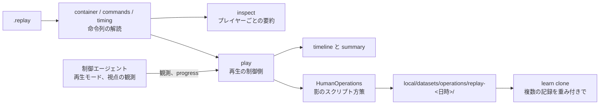

# リプレイの利用

**リプレイを再生すると、記録した試合がそのまま再現される**([../game/05-match-control.md](../game/05-match-control.md) のリプレイ)。したがってリプレイは、試合を読み解く材料であると同時に、各時点の盤面を取り直せる記録でもある。この文書は、それを使う三つの仕組みを書く。実装は `rwintel/replay` にあり、`python -m rwintel.replay` で動く。性質は `tests/test_replay.py` で固定してある。

| 用途 | 実行 | ゲーム |
| --- | --- | --- |
| ゲームを起動しない解析 | `inspect` | 使わない |
| 解読の照合 | `verify` | 再生したゲームのログを読む |
| 観測しながらの再生 | `play` | インスタンスで再生する |
| 人間のプレイからの模倣 | `play --imitate` | インスタンスで再生する |



## ゲームを起動しない解析

```bash
python -m rwintel.replay inspect "local/replays/Lake (2p) [v1.15] (30 Sep 2026 05.10.55).replay"
python -m rwintel.replay inspect <file> --json summary.json
```

ファイルの形はゲームの側の文書にある([../game/05-match-control.md](../game/05-match-control.md) のファイルの形と命令の形)。`rwintel/replay/stream.py` がエンジンの直列化を、`container.py` がヘッダと記録の列を、`commands.py` が命令とウェイポイントを読む。降ろしは、`units` の輸送に対する特殊行動 `"109"` の命令であり、降ろしの取り消しは `"110"` である(`Command.unloads`、`Command.cancels_unload`)。**命令のブロックは長さどおりに読み切れなければ異常終了する。** 読み残しを黙って許すと、版で条件付きのフィールドを一つ読み違えたまま後ろのすべてを誤読するからである。未知の名前のブロックは数えて読み飛ばす。

`analysis.py` がプレイヤーごとに次をまとめる。

- 命令の数と、ゲーム内の 1 分ごとの数
- 命令の種別ごとの数と、1 命令が指すユニットの平均の数
- 生産と建物の配置の要求。種別ごとの数、種別ごとの初出(ビルドオーダ)、定義の価格で数えた総額。取り消しは別に数える
- 段階の引き上げなど、それ以外の特殊行動
- スロットごとのクレジットの推移。補助のチェックサムの記録から読む

**試合の終わりは、記録に敗北のシステムメッセージがあればその最初のフレーム、無ければ最後の記録のフレームとする。** 記録は試合の後も続きうるので、終わりより後の命令は数えない。ゲーム内時刻は、命令列にあるステップ率の変更から復元する(`timing.py`)。

**ここで分かるのは要求であって結果ではない。** 生産を要求したユニットが完成したか、どこへ行って何を壊したかは、シミュレーションが決めることで、再生しなければ分からない。

### 解読の照合

```bash
python -m rwintel.replay verify <file> --log local/logs/run/<stamp>/00.out
```

エンジンはリプレイを再生するとき、流した命令を 1 つずつログに書く。出したプレイヤーの名前とスロット、動かせたユニットの数、命令の種別、建てる種別、特殊行動、スタンス、取り消し、ステップ率、システム命令である。`verify` は同じリプレイを解読し、命令ごとにこれと突き合わせ、食い違いを列挙する。食い違いが 1 つでもあれば終了コードは 1 になる。再生が途中で止まっていれば、ログにある分だけを比べる。

## 観測しながらの再生

```bash
python -m rwintel.runtime run --count 2 -- replay play local/replays/*.replay --journal local/episodes/control-<stamp>.jsonl
python -m rwintel.runtime run --count 1 -- replay play <file> --viewpoint 1 --until 900
```

`play` は制御側であり、ゲームのインスタンスがこれにつながる。各セッションは、手が空くたびに待ち行列から次のリプレイを取る。リプレイはインスタンスの作業ディレクトリの `replays/` へ複製され(エンジンはそこから読む)、制御フレーム `replay` で読み込みが指示される([05-interface.md](05-interface.md))。

### ゲームの側で起きること

制御エージェントは、試合を始める代わりにリプレイを読み込み、メニューを閉じ、再生速度 `ba.v` を設定し、エピソードの開始を報告する。その後は通常のエピソードと同じ周期で観測を送る。

- **何も試合に届かない。** 制御プロセスの応答は帳簿としてだけ受け取る(影の適用)。部隊の編成と契約は記録するので、観測は部隊を通常どおり報告するが、エンジンへの命令は一つも出さない。記録された命令が試合の受け取るすべてであり、1 つでも足せば別の試合になる
- **時計は再生用の時計である。** 倍率を 1 に留め、毎フレーム同じ経過時間を与え、フレーム率の上限を外す([02-runtime.md](02-runtime.md))。早送りは `--steps`(`ba.v`、既定 4)で、1 フレームあたりのステップ数を増やして行う。ステップの長さは変わらない
- 戦術周期ごとに、全陣営の最終状況と、その時点の世界のチェックサムを `progress` 事象で送る。一方の側の観測では他の側の集計が分からないからである
- 終わりは、再生が止まったときか、制御側が指定したゲーム内時刻である。ファイルを読み切っても世界は進み続けるので、読み切ったことでは終えない

### どの側から見るか

**再生中はどの側も内蔵 AI として扱われない**ので、見る側は名指す。`--viewpoint` でスロットを指定するか、記録した試合のエピソード記録を `--journal` で与える。後者のとき、記録の `team`(方策が戦ったチーム)でない唯一の側、すなわち人間の側から見る。どちらも無ければ実行を拒む。

既定は全知の観測である。`--fog` を付けると、見る側のプレイヤーに見えるものだけを報告する。可視判定は名指したプレイヤーについてそのまま効く([../game/05-match-control.md](../game/05-match-control.md) の再生中のプレイヤー)。

### どこまで再生するか

優先順は次のとおりである。

1. `--until` で与えたゲーム内の秒
2. エピソード記録の `seconds` の次の秒。記録は秒を切り捨てているので、試合はその 1 秒の中で決着している
3. リプレイ自身が記録する試合の終わり([ゲームを起動しない解析](#ゲームを起動しない解析))

### エピソード記録との対応

エピソード記録は、記録したリプレイのファイル名を `replay.file` に持つ(下記)。名前で見つからない記録は、**最後のチェックサムのフレームで**対応させる。記録した側はチェックサムを取るフレームごとに補助のチェックサムを書き、エピソード記録はその最後のフレームを持つ。チェックサムはどの試合でも同じ間隔のフレームで取られるのでフレームだけでは区別できず、そのフレームが、リプレイの記録する試合の終わりから 1 間隔以内にあることを合わせて条件にする。当てはまる記録が 2 つ以上あれば、どれも採らない。

### 書き出すもの

再生ごとに、`local/replays/<リプレイの名前>/` へ次を書く(`--output` で変えられる)。

| ファイル | 中身 |
| --- | --- |
| `timeline-slot<N>.jsonl` | 戦術周期ごとの行。ゲーム内時刻、フレーム、全陣営の最終状況、見る側の資金・収入・ユニット数・見えている敵の数 |
| `summary-slot<N>.json` | 試合に加わった陣営ごとの推移(秒、ユニット数、価値、収入、撃破、損失、未使用のクレジット)、領域ごとの交戦の収支、最後の最終状況、照合の結果 |

**交戦の収支は、盤面から消えたユニットの価格を、最後に見えた位置に最も近い領域と、持ち主の側へ積んだものである。** 全知の観測では消えることがそのまま失われることなので正確である。霧の観測では敵は視界から外れても消えるので、敵の損失は数えない。

エピソードとしては通常どおりエピソード記録に書かれ、`replay` に再生したファイル、エンジンの照合の食い違いの数、終わった理由、ファイルを読み切ったか、見た側が入る。

### 照合

記録した試合のエピソード記録があれば、再生をそれと突き合わせる。

- **エンジンの照合の食い違い。** 再生中、エンジンは記録されたチェックサムと自分の値を照合する。1 つでも食い違えば、そこから先の盤面は記録した試合ではない
- **記録した側の最後のチェックサム。** エピソード記録のフレームで再生が取ったチェックサムと、記録の値を比べる
- **最終状況。** 記録の秒から後に再生が報告した最終状況のどれかが、記録の最終状況と一致するか

いずれかが合わない再生は、実行の終わりに問題として報告され、終了コードが 1 になる。**速度を上げて遊んだ試合の記録は、倍率が記録に入っていないので倍率 1 では再現せず、ここで食い違いとして現れる。** 人が遊ぶ試合は等速である。

### 対戦の記録を残す

制御エージェントは、試合のエピソードの終わりにエンジンの記録を閉じ、ファイル名を終了の事象に載せる。記録は試合で終わり、`end` のブロックを持つ。エピソード記録の `replay.file` がその名前である。人間との対戦(`control --versus`)では、実行の終わりに、記録されたリプレイをインスタンスのディレクトリから `local/replays/` へ複製する。インスタンスを作り直すと `replays/` は消えるが、人間との試合は模倣の材料として希少だからである。

## 人間のプレイからの模倣

```bash
python -m rwintel.runtime run --count 2 -- replay play local/replays/*.replay --journal local/episodes/control-<stamp>.jsonl --imitate
python -m rwintel.learn clone --layer operations --dataset local/datasets/operations/collect-<stamp> --dataset local/datasets/operations/replay-<stamp>:0.2 --save local/models/ops-bc.pt
```

人間が出すのはユニット単位の命令であり、作戦層の決定(この部隊を、あの領域へ、このタスクで、歩いてか運ばれて)ではない。`--imitate` は再生の中でそれを読み戻す。

### 仕組み

**スクリプト方策を人間の側で影として走らせ、作戦層だけを人間の命令で答えさせる。** 作戦層は学習層(`LearningPolicy` の作戦層)であり、決定器が `HumanOperations`(`rwintel/replay/human.py`)である。スクリプトの教師を作る `collect` と同じ形で、違うのは決定器だけである([08-learning.md](08-learning.md) の学習方策はスクリプト方策の 1 メソッド置換である)。

- 編成層が人間のユニットから部隊を組む。部隊とドクトリンは、学習層が実戦で見るものと同じ規則で決まる
- 作戦層は実戦と同じ契機で決定を求める。契約なし、膠着・劣勢・完了・期限切れ、見直しの間隔である
- 状態の符号化、マスク、決定の時点は、継承したコードがそのまま動くので、学習層が実戦で出すものと完全に同じである
- 決まった契約は影として記録され、ゲームの側が任務状況を計算するので、次の決定の契機も実戦と同じ仕組みで立つ

盤面を読む決定器は `choose_on_board`(盤面、部隊、状態、マスク、時刻、移送の層)で問われる。そうでない決定器は従来どおり状態だけを渡される。

推定は `infer_decision`(`rwintel/replay/human.py`)にまとまっており、命令を時刻つきで索引する `OrderBook` の上で動く。時刻の単位は呼び出し側が決める(リプレイはフレーム、内蔵 AI はゲーム内ミリ秒)。内蔵 AI の教師([08-learning.md](08-learning.md) の教師の出どころ)も同じ推定を使う。違いは窓だけである。試合の最中には先が読めないので、決定の時点ではそれまでの見直しの間隔の命令で仮に答え、その決定の記録が閉じるときに、決定から見直しの間隔の終わり(試合がそこまで進んでいなければ、進んだところ)までの命令で推定し直してラベルを書き換える。推定し直して記録できない決定は、軌跡に残したまま 2 つのラベルを -1 にし、模倣はそれを読み飛ばす。

### 領域の推定

部隊の各構成員について、**いまから見直しの間隔の終わりまでに人間が最後に出した移動の命令**の行き先を取る。移動の命令とは、移動、攻撃、攻撃移動、巡回、護衛、地点の護衛、追従である。行き先が座標ならその座標、ユニットならそのユニットのいまの位置である。一度も命令されていない構成員は、いま立っている場所を行き先とする。

構成員は行き先に最も近い領域へ、自分の価値の重みで投票する。**最も価値の集まった領域が決定であり、その価値の割合が一致度である。** 一致度が 0.5 に届かなければ、人間の命令は部隊について一貫したことを言っていないので、決定を記録しない。

決定の根拠は 4 通りに分けて記録する。

| 根拠 | 意味 |
| --- | --- |
| `lift` | 構成員が輸送に積まれた。領域と手段は手段の推定で決まる |
| `orders` | 間隔の中で命令された構成員がいる |
| `standing` | 間隔より前に命令された行き先へ向かっている |
| `idle` | どの構成員も一度も命令されていない |

### タスクの推定

ドクトリンが許すタスクの中から、行き先の地面で選ぶ。

1. 撤退を許すドクトリンで、部隊がいま劣勢の領域にいて(敵の価値が上回るか、任務状況が劣勢)、行き先がいまより本拠地に近いなら、撤退
2. 行き先に敵がおらず、こちらが資源地点を押さえているか価値を置いているか本拠地なら、保持。防衛、護衛の順に許されるものを取り、無ければ攻撃、襲撃、包囲の順
3. それ以外は、取りに行くこと。攻撃と包囲はスクリプトの前衛と同じ規則で選ぶ(部隊とこちらの価値が敵の 2 倍以上なら包囲)。無ければ襲撃、防衛、護衛の順

### 手段の推定

**構成員が輸送に積まれていれば、決定は移送である。** 積み込みは、乗客を `units` に、輸送を対象に持つ `loadInto` と、輸送を `units` に、乗客を対象に持つ `loadUp` の 2 つの形で読む(`loadUp` に輸送が複数あれば先頭の 1 台)。盤面にいる各構成員について、窓の終わりまでの最後の積み込みが次のどちらかなら、その輸送に運ばれているとみなす。

- 窓の中(始まりより後、終わり以前)に積まれた
- 窓の始まり以前に積まれ、積まれてから窓の始まりまでにその輸送が降ろしていない(まだ乗っている)

構成員を輸送ごとにまとめ、領域の推定と同じ価値の重み(1 未満は 1)で数える。**最も多くの価値を運ぶ輸送が手段であり、部隊の価値に対するその割合が一致度である。** 一致度が 0.5 に届かなければ移送とはみなさない。

降ろした先は、積み込み(その輸送に積まれた構成員の最後の積み込み)より後で窓の終わりまでの、その輸送の最初の降ろしの時点での、その輸送の最後の移動の命令の行き先である。降ろしの後に取り消しがあれば、その降ろしは無かったものとし、次の降ろしを見る。窓の終わりまでに降ろしが無ければ、積み込みより後のその輸送の最後の移動の命令の行き先とする。どちらも無ければ移送とはみなさない。地点を指す降ろしの命令(`unloadAt`)は、その地点への移動と降ろしを同時に出したものとして読む。

領域は降ろした先に最も近い領域、タスクはタスクの推定のとおり、手段はその輸送を預かる移送の層の枠(`Logistics.slots` のうち `unit` がその輸送であるもの、決定の時点のもの)である。枠は、すでに預かっている輸送はそのまま、新しい輸送には ID の小さい順に空いた枠を与える規則で決まるので、ID から順位を数え直すのではなく、その時点の枠をそのまま引く。計画は (タスク、その枠) である。次のときは決定を記録しない。

| 理由 | 場合 |
| --- | --- |
| `lift_unslotted` | 輸送がどの枠にも預けられていない |
| `lift_masked` | 降ろした先の領域か、その計画がマスクで閉じている |

移送でなければ手段は歩きである。行き先の領域へ部隊が歩いて行けない(その領域の計画のマスクで歩きが閉じている)なら、決定を記録しない。移動の命令だけでは、部隊を輸送に載せて渡したのかどうかが言えないからである。建設機は部隊の構成員にならないので、建設機の移送は作戦層の決定にならない。建設機の移送は内政層の決定である。

### 重み

各決定は重みを持って記録される。`lift`、`orders`、`standing` は一致度、`idle` は 0.5 である。命令されていない部隊を立たせておくことも判断だが、命令より弱い言明だからである。`--weight` はすべての重みに掛かる。

記録は作戦層のデータセットとして `local/datasets/operations/replay-<日時>/` に書く(`--dataset` で変えられる)。形式はスクリプトの決定の記録と同じである([08-learning.md](08-learning.md) の記録)。人間が打った行動がそのまま判断器の答えの欄(`label`)にも入り、模倣はそれを写す。打った方策の分布は分からないので空のまま記録する。各決定に `source`(`human`)、`weight`、`agreement`、`basis`(根拠)が加わる。

### 観測は全知を既定にする

**状態は、学習層が実行時に見るのと同じ観測で符号化する。** 学習層は全知の観測で動くので、既定は全知である。人間の判断は霧の中で下されているが、符号化の分布を実行時とずらした教師は、網が実際に読む盤面について何も教えない。`--fog` を付ければ人間の視界で符号化する。

### 教師を混ぜる

`python -m rwintel.learn clone` は `--dataset` を何度でも受け付け、`path:weight` の重みはその記録の全決定の重みに掛かる。交差エントロピーは各決定の重みで平均する。報告は、全体に加えて出どころ(`source`)ごとの一致率を分けて出す。豊富な教師に合って希少な教師に合わない当てはめは、全体の数字からは見分けられないからである。

位置づけは [04-model-design.md](04-model-design.md) のとおり、**スクリプトの教師に混ぜる初期化・正則化の材料**である。戦術層の逸脱への変換は行わない。

### 推定できないプレイ

**作戦層の決定が生じるのは、編成層が部隊を組んだときだけである。** 砲台と防御施設で守り、ドクトリンの最小構成に届く機動戦力を持たない試合からは、作戦層の決定は 1 つも出ない。建設機の部隊は作戦層が任務を出さないドクトリンなので、決定の対象にならない。出てくるのは誤った教師ではなく、空の教師である。
