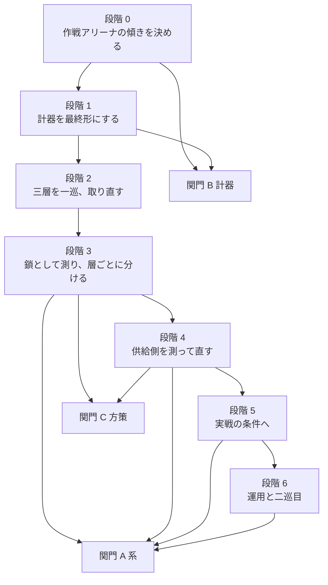

# 完成までの順序

**この文書は「何をもって完成とするか」を三つの関門として定義し、そこへ至る順序を測定から導く。** 測ってあることは [03-tactics.md](03-tactics.md)、[04-operations.md](04-operations.md)、[05-strategy.md](05-strategy.md) にあり、分かっていないことの一覧は [06-open-questions.md](06-open-questions.md) にある。**この文書が足すのは順序と費用だけであり、新しい主張は一つも足さない。** 順序の根拠はすべて、既に取ってある数字か、既に書いてある設計の要求である。

## 完成の定義

**三つの関門を置く。上から順に、系が揃っていること、計器が信用できること、方策が強いことである。**

| 関門 | 内容 | いまの状態 |
| --- | --- | --- |
| A 系 | 骨格([../system/01-architecture.md](../system/01-architecture.md))が並べたものがすべて実装され、設計が「計測で決める」と書いた定数が実際に計測で決まっていること | 介入の窓 UI、霧の切り替え、採点の重み `w_e`・`w_t`、戦線報告の所有者分離が未了。報酬と経済の定数は開始値のまま |
| B 計器 | 二つのアリーナが自己対戦ゼロを複数の種で通り、測定の床が現行の計器の上で取り直され、下に凍結する層の選び方が規則として書かれていること | 構築作戦アリーナが自分の関門を落としている(35 盤面で +0.0438 ± 0.0369、種 880001)。床は旧い計器の上の ±0.02。凍結層の選び方は測定であって規則ではない |
| C 方策 | 学習した鎖が手書きの鎖を複数の条件で上回り、三層それぞれの単独の寄与が区間つきで分解し、そのうえで鎖が内蔵 AI を上回ること | 手書きの鎖に対する +0.053 は取ってあるが退役した計器の上である。層ごとの分解は一つも足りていない。内蔵 AI に対しては -0.78 |

**段階 0 から 3 までを一度回した結果、関門 B は通り、関門 A は残り二つ、関門 C は道具だけが揃った。** 各段階の見出しがその状態を持つ。**この文書の以下の記述で「以下はこの段階を始める前に書いた項である」と断ってあるところは、計画として書いた時点の文であり、取り下げてはいない。**

**C の三つ目だけが桁で遠い。** 関門 C の最初の二つは「もう一度、正しい計器で取り直す」ことであり、費用は見積もれる。三つ目は違う。**下の節がその理由を数字で書く。**

## 残っている距離は、三層の外にある

**三層すべてを学習に置き換えて買った差は +0.053 であり、内蔵 AI までの距離は 0.78 である。** そして各層で動かせる幅そのものが測ってある——戦術は行動空間を 8 つに広げて 0.125、作戦は 0.065 から 0.095、戦略の姿勢は 300 秒の試合で 0.11 である。**三つを足しても 0.3 に届かない。三層を完璧に学習させることは、この鎖を内蔵 AI と並ばせない。**

**では距離はどこにあるか。経済である。** 480 試合の集計で、こちらの収入は 35.5、相手は 77.9、立っている価値は 9,157 対 25,662 であった([04-operations.md](04-operations.md))。**そして相手の 77.9 のうち 4 割は規則である**——`game.n.E()` が難易度から返す収入倍率は AI プレイヤーにだけ掛かり、難易度 1 では 1.4 倍である([../game/08-builtin-ai.md](../game/08-builtin-ai.md))。**倍率を割り戻しても 35.5 対 55.6 で、こちらは相手の 6 割強しか集めていない。** 残りは倍率ではなく建設順である。

**その建設順を書いている内政層は、コード自身が「開始値」と断ってある定数を 13 個持ち、そのどれも一度も掃かれていない。そして掃いた先を測る口も無い**——評価のアームは `script`・姿勢固定・`ops-pin`・`ops-concentrate`・学習済み層の五種類で、内政層を差し替えて比べるアームは一つも無い(`rwintel/eval/arms.py`)。**すなわち、鎖が負けている当の場所には、計器も掃引も存在しない。**

**したがって完成の道は「三層をもっと鍛える」ではない。** 三層は関門 C の前二つを満たすために取り直す。内蔵 AI を上回るための距離は、供給側——内政と編成——にある。

**そして関門 C の三つ目は難易度 0 で置く。** 難易度 1 以上の内蔵 AI は倍率つきの資源で走っており、その建設順の時刻はこちらの経済が再現できるものではないと [../game/08-builtin-ai.md](../game/08-builtin-ai.md) が書いている。**同じ足場に乗るのは難易度 0 だけである。** 難易度 1 以上に対する採点は、倍率を明記したうえで別に報告する。**これは基準を甘くする決定ではなく、比べているものを言い直す決定である**——難易度 1 に対する -0.78 のうち、どれだけが方策の差でどれだけが資源の差なのかを、いまの記録は一つも分けていない。

## 順序を決めているもの

**三つある。どれも好みではない。**

**一つ、刻印が退役させる範囲である。** 符号化か規則の digest が動くと、それ以前のパラメータと教師はすべて拒まれる([../system/04-learning.md](../system/04-learning.md))。**いまは三層とも退役した直後であり、鍛え直しの費用がまだ払われていない。計器を動かすなら、いまが最も安い。** 後で動かせば、取り直しは二度になる。

**二つ、凍結の順序である。** 設計は戦術→作戦→戦略の順に、他層を凍結して交互に学習させることを要求している([../system/01-architecture.md](../system/01-architecture.md))。**そしてそれが効いていることは仮定ではなく測定である**——同じ設定・同じ長さを手書きの戦術層の下で鍛えると、作戦層は集中アームに区間つきで負ける([04-operations.md](04-operations.md))。

**三つ、費用である。** 試合単位の測定は打ち切り時間が直接決める。25 分打ち切りの実測でエピソードの周期は 211 秒(シミュレーション 165 秒、切り替え 46 秒)であった([../system/05-evaluation.md](../system/05-evaluation.md))。

## 段階 0 — 場が傾いているのかを決める。**答が出た**

**答:傾きは標本ではなく、出所は自由な基地だった。** 同じ種 880001 の 75 盤面で取り直すと **+0.0456 ± 0.0341** と再現し、開始盤面を反射して相手側にも置くと **-0.0200 ± 0.0298** で通る。**同じ盤面で対にした差は +0.0656 ± 0.0477 で 0 を外す。** 機序は「出撃地点を持つプレイヤーが必ず与えられる司令部と建設機がこの側にしか無く、梯子の vanguard は敵の戦力が立つ領域を候補にするので、その領域は相手側の席にとってだけ候補である」ことであり、**部隊の状況を折り返す直しが傾きを作ったのではなく、再タスク付けを始めさせて傾きを表に出した。** 席ごとの診断も揃う(用務の長さ 9.0 対 17.7 → 12.8 対 12.9)。詳細は [04-operations.md](04-operations.md)。**この段階は閉じた。**

**以下はこの答が出る前に書いた項である。**

**構築作戦アリーナは自分の関門を落としており、その上で測った層についての数字は読めない。** 手書きの梯子を両側に置いたアームのプールした side score が 35 盤面で +0.0438 ± 0.0369 と 0 を外している(種 880001、[04-operations.md](04-operations.md))。**候補は二つあり、この実行では分けられない**——盤面が 35 枚しかないことと、部隊の折り返しを直したこと自体が場を変えたことである(梯子が 7.8 決定ごとに再タスク付けを始め、部隊行の散らばり・損害・状況が定数でなくなった)。

やること。

- **盤面を増やした実行を一本**(同じ種 880001、100 盤面以上、`--our script` のみ)。標本の問題なら、ここで区間が縮んで 0 を含む。
- **種を変えた実行を二本**(80001 と 90001 は旧い計器で読みが残っており、比較の足場になる)。三つの種のうち二つ以上が 0 を外すなら、傾きは標本ではなく場である。
- **場が傾いていた場合は、折り返しの前後で `script` アームだけを同じ種で並べる。** 傾きの出所を再タスク付けに名指しできるかどうかがこの一本で決まる。

**出口条件。三つの種で `ops-script` のプールした side score が 0 を含むこと。** 落ちたままなら、段階 2 の作戦層はこの場では測れないので、傾きを消すまで進めない。

## 段階 1 — 計器を最終形にする。**六つのうち五つが済んだ**

**済んだこと。** 交戦アリーナに契約の抽選を入れた(取り直した教師の決定 12,669 件が六通りに散る。以前は attack が 100 パーセント)。任務状況を席ごとに書くようにした(完了が相手側で構造的に発火しえなかった)。抽選を交戦を引く時点へ移した(死産で片方のアームだけが引きを飛ばしていた)。相手側の生成の散らばりを反射した。交戦の記録が種を書くようになった。構築作戦アリーナは開始盤面を反射し、所有を場の構成から書き、両側が合同に編成できたことを確かめ、先手の交替を**作戦の決定について**行うようになり(周期の parity は戦術フレームで進むので、10 フレームに一度の作戦決定では一度も交替していなかった)、席ごとの用務・優先地・massing を記録するようになった。視界の距離は与えられた地点から測るようになった(自陣の**領域の中心**から測っていたので、鏡像の二席は同じ地面を違う費用で並べていた)。凍結する層の選び方を規則として書いた([../system/04-learning.md](../system/04-learning.md))。**そして直した場は、選択に使っていない種 881001 の 59 盤面で関門を通る**(-0.0149 ± 0.0299、保持時間で -0.0070 ± 0.0192)。

**切り替えの 46 秒は、既に詰まっていた。** あの数字は計測エージェントのものであって、評価と学習が通る制御エージェントのものではない。**実測すると 8 並列・ゲーム内 360 秒のエピソードの周期は 36.6 実秒**、すなわち切り替えは約 0.6 秒である。**[../system/05-evaluation.md](../system/05-evaluation.md) の費用の節と、この文書の費用の表を実測に合わせて書き直した。**

**残っていること。** **交戦アリーナの関門を、契約を引くようになった場で十分な大きさで取り直すこと**——短い決闘で取った基準線は交戦 156 件(24 エピソード)で -0.1085 であり、実行器の基準では足りないが、この場のこれまでの読み(+0.0194 ± 0.031)より 0 から遠い点推定である。**構築作戦アリーナの関門は二つの未使用の種で取り直して通っており、交戦アリーナのそれは取り直していない。** それと、測定の床の取り直し(同じ重みの複製を二アームとして回す実行)と、戦線報告を所有者ごとに分けること。**後者は相手 1 体の条件では何も変えないので、相手を増やす段階まで持ち越した**——[この文書が決めていないこと](#この文書が決めていないこと) の二つ目に関わる判断である。

**以下はこの段階を始める前に書いた項である。**

**ここが順序の要である。** 下の六つはどれも計器か費用を動かす変更であり、どれも「後でやると鍛え直しが二度になる」ものである。**いまは全パラメータが退役した直後なので、二度目の費用がまだ発生していない。** 06-open-questions が「作戦層の測定が一段落してから着手する順序になる」と書いていたのは、当時まだ生きている測定があったからである。**その前提はもう無い。**

やること。

- **交戦アリーナに契約の抽選を入れる。** いまアリーナは全ての契約を `Task.ATTACK` / `Stance.AGGRESSIVE` で出すので、戦術の 58 特徴のうちタスクと stance の one-hot 13 個が訓練中ずっと定数である(11 個が常に 0、2 個が常に 1)。**試合ではどちらも動くので、戦術層は訓練の分布に一度も現れなかった 13 個の入力を試合で読む。** これは構築作戦アリーナで見つかった欠陥(staged 部隊の半分が garrison と記録され ATTACK を一度も出されなかったこと)とちょうど同じ形であり、**そちらは実際に大きかった。** 手書きの作戦層が持つタスクごとの stance の表を、そのままアリーナの抽選に使う。
- **構築作戦アリーナの経済側の定数を決着させる。** 領域行の `held_by_us`・`held_by_enemy`、全体ブロックの資金、建造中がこの場では全て 0 である。**取り除いたのはこの場の存在理由そのものなので、直しは「その特徴を層に見せない」か「この場でも動かす」かのどちらかである。** どちらを採るかを決め、決めた側を実装する。`global.squads` が常に 4 であることも同じ判断の中に入れる。
- **戦線報告が敵を所有者ごとに分けて運ぶようにする。** 試合の採点は最強の相手一人と比べるのに、戦略層のポテンシャルは「見えている敵の総和」しか読めないため、いまこの層の学習実行は `--opponents 1` 以外を拒む。**相手を増やした条件で完成を名乗るつもりなら、この分離は段階 2 より前に要る**——後から入れると戦略層の特徴が動き、鍛え直しになる。
- **測定の床を現行の計器の上で取り直す。** ±0.02 という値は、同じ重みの複製を二つのアームとして同じ実行に入れて取ったものだが、その道筋には後に直した乱数列の分岐が挟まっている。**床はこの計画のすべての読み方を縛る値なので、直した計器の上の値でなければならない。**
- **下に凍結する戦術層の選び方を規則として書く。** 要る性質は二つ測ってある——戦いを解決すること(送られた先で撃ち合いが終わらなければ、どこへ送ったかは盤面に現れない)と、鏡像の下で反対称であること(壊れていれば測っているのは方策ではない)である。**いまの根拠は「四つ比べて一つだけが両方を満たした」という測定であって、次の世代に適用できる基準ではない。** [../system/04-learning.md](../system/04-learning.md) に手順として書く。
- **エピソードの切り替え 46 秒と、終了検出の超過を詰める。** 進行制御が計測エージェントの監視スレッドの 15 秒周期から駆動されており、終了検出・サーバ組み直し・開始の三段でその周期を三度またぐ。**エンジン側の実費用ではなく、制御プロセスから駆動する実装なら詰められると [../system/05-evaluation.md](../system/05-evaluation.md) が書いている。** 600 秒打ち切りの試合では周期 121 秒のうち 61 秒がこの二つであり、**詰めれば周期は 60 秒になって、試合単位の測定がそのまま 2 倍速くなる。** 段階 3 と段階 4 は合わせて数万試合を要求するので、ここで払う工数は必ず返る。

**出口条件。両アリーナが複数の種で自己対戦ゼロを通り、床の値が現行の計器の上で出ていること。** ここを通れば関門 B である。

## 段階 2 — 三層を一巡、取り直す。**短い一巡を回した**

**直した計器の上で、三層とも教師から組み直して短く鍛える一巡を回した。長さは強さを何も言わない大きさである**——戦術は 8 並列 × 20 エピソード、作戦は 16 盤面、戦略は 4 試合である。**回した目的は二つで、どちらも強さではない。** 一つ、**経路が端から端まで通ることを確かめること**(収集 → 模倣 → 強化 → 凍結して次の層 → 鎖として測る)。二つ、**直した計器が何を変えたかを、教師の分布と場の統計で確かめること。**

**確かめたこと。** 交戦アリーナの教師は決定 12,669 件が六通りの契約に散り(以前は attack が 100 パーセント)、模倣した網は教師の分布に一致する。**契約を引いても場は交戦を作り続ける**——1,204 件組んで死産 0、膠着打ち切り 66.1 パーセントで、引く前の 64.7 パーセントと同じ帯である。作戦の教師は決定 2,471 件で、模倣の領域正解率は 0.822(前回の一巡は 0.738)。**構築作戦アリーナの拒否率は 5 枚に 1 枚に戻した。** 係争点を集結点から離すという最初の直し方は、盤面の 39 パーセント(96 枚中 37 枚)を拒否させた——係争点は両方の集結点と両方の基地と先の対と自分自身の鏡像を同時に避けなければならなくなるからである。**garrison を位置で除く形に変えると、同じ危険を塞いだまま 21 パーセント(72 枚中 15 枚)に戻る。**

**以下はこの一巡を回す前に書いた項である。**

**設計の順序どおり、戦術→作戦→戦略で回す。** 一巡目は既に回してあるが、どの実行も 3 から 6 エピソードなので強さについては何も言っていない([03-tactics.md](03-tactics.md)、[04-operations.md](04-operations.md)、[05-strategy.md](05-strategy.md))。**ここで取り直すのは新しい問いではなく、答えたと書いてある問いを、答えられる計器の上で訊き直すことである。**

戦術層。**教師を集め直し、模倣し、長さの梯子を並べる。** 旧い計器では 320・960・2,560・5,120 エピソードの四世代で登ることを示してあり、5,120 より長い実行は無い。**取り直しでは、まず旧い計器で 0 を外した三つの主張——梯子に対する優位、長さの段、最良の定数(常に `hold`)に対する優位——を、選択に使った種と確認の種の二つで取る。** 契約の抽選を入れた場は別の場なので、`close` の値付けと帯の上端も取り直しになる。

作戦層。**段階 1 で選び方を書いた規則に従って戦術層を凍結し、その下で鍛える。** 旧い計器では 150・300・600 で単調に上がり、900 は 600 と区別が付かず、別系統の 150 が 900 に並んだ。**すなわち掃くべきは長さではなく起点(教師と模倣)である。** 取り直しでは長さを 150 と 600 の二点に留め、起点を二つ以上振る。**代金を「この側の配備がその円板を動かした分の按分」に直してから鍛え直した世代はまだ一つも無い**ので、この一巡がその最初になる。

戦略層。**戦術層と作戦層を凍結した下で、試合の中で鍛える。** 旧い計器では 240・480・960 試合の三世代が手書きの梯子を +0.028 / +0.036 / +0.053 上回った。**取り直しでは 600 秒で回す**——300 秒の試合はほぼ経済だけで決まり、軍隊が報われる時間が無いからである。

**出口条件。三層それぞれについて、手書きの層に対する優位が確認の種の上で区間つきで出ていること。** 出なければ、出ない層をそう書く。**この計画では、出なかったことを書き残すことが二度目の誤りを防いでいる。**

## 段階 3 — 鎖として測り、層ごとに分ける。**道具は揃い、測定は短い一本だけ**

**この段階が要求していた三つの道具のうち、二つを作った。** 一つ、**終局の一定時間前の盤面を記録するようにした**——計測エージェントが 5 秒ごとに陣営ごとの現有価値・収入・撃破喪失を控え、終局の 30 秒前にあたる一枚を `before` として finished の報告に載せる。**重みの当てはめはその盤面を使う**(決着した試合の終局盤面は敗者が消えた後なので、どの重みでも正解する問題である)。**どちらの盤面で当てはめたかは報告が枚数で言う。** 二つ、**当てはめた重みで journal を読み直す口を作った**(`--weights military,economy,record`)——これが無ければ当てはめた重みは報告されて捨てられるだけだった。

**三つ目——層ごとの寄与を分けるだけの試合数——は回していない。** 要る 4,756 対は 600 秒・8 並列で約 20 時間であり、この一巡で回したのは鎖どうしの短い一本だけである:**手書きの鎖 -0.827 に対し三層とも学習した鎖が -0.856、差 +0.029 に対して要る 85 試合のうち 48 試合で、分解しない。決着 0 本なので重みは当てはまらず開始の選択のままである。** **したがってこの段階の出口条件は満たしていない。道具の側だけが揃い、経路が端から端まで通ることは確かめた。**

**以下はこの段階を始める前に書いた項である。**

**鎖が手書きの鎖を上回ることと、その中のどの層が上回らせているかは別の測定である。** 旧い計器では前者は取れていて(+0.053、要 70 試合に対して 256)、後者は三層とも足りていない——戦略層の寄与は -0.010 で片側 4,756 試合、戦術層は +0.011 で片側 1,916 試合を要求する。

やること。

- **`tactics:<パス>+ops:<パス>+strategy:<パス>` の鎖アームと、一層ずつ手書きに落としたアームを、同じ実行に並べる。** 差し引きではなく同一実行の対にする。別々の実行で取った生値を引き算する読み方は、この計画で実際に三度誤った読みを生んでいる。
- **必要試合数を先に見積もり、それを打てる長さの実行を組む。** 4,756 対は両アームで 9,512 試合であり、600 秒打ち切り・8 並列なら現状の周期で約 40 時間、段階 1 で切り替えと超過を詰めれば約 20 時間である。**一晩では終わらないが、一週末では終わる。**
- **採点の重み `w_e` と `w_t` を決着したエピソードから合わせる。** 設計は「机上で決めず、決着したエピソードで打ち切り直前の採点の符号が勝者と一致すること」を条件にしている。**そのために、終局の一定時間前の盤面を残す記録を足す**——いま残しているのは終局時の盤面だけで、そこで合わせると実際に採点を使う場面より易しい問題に合わせることになる。**素材は残してあるので、重みが決まれば過去の実行は回し直さずに採点し直せる。**

**出口条件。三層それぞれの単独の寄与について、区間つきで上か下か 0 かが言えること。** 0 を含むなら、それが答えである。**「鎖が上回る」だけでは関門 C の二つ目は通らない。**

## 段階 4 — 供給側。残りの桁はここにある

**内蔵 AI までの 0.78 は、三層の幅を全部足しても届かない。** ここが完成の本体である。そして**この層には計器も掃引も無い**ので、段階の最初は測定ではなく道具になる。

やること。

- **内政層のアームを作る。** 評価の側に、内政層を差し替えて比べる経路を足す。上位層に `ops:<パス>` があるのと同じ形で、規則の版を名前で選べるアームがあればよい。**アブレーションが要る**——最初の工場の前に立てる採掘施設の数、建設機の目標数、二基目の工場に要る収入、砲台を建てる条件を一つずつ動かしたアームである。
- **低分散の指標で掃く。** 試合の採点は散らばり 0.11 から 0.24 だが、**収入と立っている価値はそれより素直に動く量である**([04-operations.md](04-operations.md) の経済成分)。ゲーム内 5 分・10 分時点の収入と立っている価値を主指標にすれば、採点で掃くより桁で安い。
- **時刻の基準線を内蔵 AI から取る。** 内政層は順序と条件を決めていて時刻を決めていない。**二基目の採掘施設・最初の工場・二基目の工場にゲーム内何分で到達するかは、内蔵 AI を観測すれば基準線が取れる。取るのは難易度 0 である**——そこだけが収入倍率 1.0 でこちらと同じ足場に乗る([../game/08-builtin-ai.md](../game/08-builtin-ai.md))。
- **13 個の開始値を、掃いた値に置き換える。** `FACTORY_EXTRACTORS`、`BUILDER_TARGET`、三つの share の閾値、`SECOND_FACTORY_INCOME` あたりが先である。**どれも「根拠のある初期値であって計測で選ばれた値ではない」と設計自身が書いている。**
- **それでも届かないなら、供給側を学習させない決定を開き直す。** 骨格は「学習させる層は指揮の階梯の三段すべて、戦力供給の二機能はスクリプト」と決めており、その根拠は費用の順序であって内政が重要でないことではない。**掃いても届かないという測定が出た時点で、これは開き直してよい決定になる。開き直すなら、その測定を根拠として書く。**

**出口条件。難易度 0 の内蔵 AI に対する採点が 0 を上回ること。** 途中の目盛りとしては、収入比が 0.64(倍率を割り戻した現状)から 1.0 へ寄ることを読む。

## 段階 5 — 実戦の条件へ

**ここまでは全知・一つの地図・一つの長さ・一体の相手の上の話である。** 完成を名乗るには、そこを出る。

- **霧を入れる。書く場所はここだが、実行の順序は最後の学び直しより前である。** 設計は「全知の観測で学習させれば速く進むが、そのまま実戦に出すと成立しない」と書いており、切り替えは可視判定を通す一箇所である。**完成品が霧つきで打つのなら、霧を入れてから最後の一巡を回す。全知で鍛えた層を霧で出した測定は、この計画に一つも無い。** 入れた日から、構築作戦アリーナと試合の観測の食い違いは一つ増える(この場に内蔵 AI はいないので、動くのは相手の見え方である)。
- **地図・長さ・難易度・相手の数の格子を回す。** いまの主結果はどれも Lake か Hills の一枚、300 秒か 600 秒の一つ、難易度 1、相手一体の上のものである。**最小の格子は地図二枚 × 長さ二つ × 難易度二つで、どれも同じ実行に並べられる。**
- **相手を二体以上にする。** 段階 1 で戦線報告が所有者を分けていれば、ここは実行だけである。

**出口条件。鎖が手書きの鎖を上回ることが、少なくとも二つの地図と二つの長さで再現すること。**

## 段階 6 — 運用と二巡目

- **介入の窓 UI。** 四操作の経路は揃っていて、人間が打つ側は行入力まで来ている。残っているのは窓としての UI——部隊一覧、契約の編集、編成の組み替え、権限の切り替えである([../system/01-architecture.md](../system/01-architecture.md))。**これは強さに効かないが、関門 A の最後の一つである。**
- **二巡目。** 設計が要求する交互学習は「作戦層を凍結して戦術層を鍛え直す」向きを含むが、**戦術の学習を試合の中で行う経路が無い。** 交戦アリーナが存在する理由そのものが「戦術は試合を回さずに学習できる」ことなので、これは配線の不足ではなく設計の問いである。**二巡目を回すなら、戦術の学習をどの場で行うかから決め直す。** 全滅の終端が試合で発火するようになったことで、必要な性質は一つ満たされている。
- **報酬と最適化の残る定数。** エントロピー賞与は構築作戦アリーナでは既定の 10 分の 1 が良いという測定があるが、その場でしか取っておらず既定は書き換えていない。歩幅も三点のうちどれが良いかを比べた実行が無い。**どちらも段階 2 の一巡の中で掃いてよいが、掃かないなら「掃いていない」と書く。**

## 費用

**試合単位の測定は打ち切り時間で決まる。** 実測は 25 分打ち切りで周期 211 秒、8 並列で毎時 136 エピソードである([../system/05-evaluation.md](../system/05-evaluation.md))。**内訳は、打ち切りぶんのシミュレーション、終了検出が 15 秒周期であることによる超過(実時間でおよそ 15 秒)、そして切り替えの 46 秒である。下の表はこの内訳を別の打ち切りへ当てた見積りであり、25 分の行以外は実測ではない。**

| 打ち切り | 周期 | 8 並列・毎時 | 12 並列・毎時 |
| --- | --- | --- | --- |
| 300 秒 | 31 秒 | 929 | 1394 |
| 600 秒 | 61 秒 | 472 | 708 |
| 1500 秒 | 151 秒 | 191 | 286 |

**この表は書き直してある。** 最初に書いたときは [../system/05-evaluation.md](../system/05-evaluation.md) の 211 秒(切り替え 46 秒)から引いていたが、**その数字は計測エージェントのものであって、評価と学習が通る制御エージェントのものではない。** 実測——構築作戦アリーナの 8 並列・倍率 10・ゲーム内 360 秒のエピソードで、80 エピソードの周期は平均 36.6 実秒であり、**切り替えは約 0.6 秒である。** 上の表は打ち切りの長さに切り替え 1 秒を足して引いた。

**したがって段階 3 の分解に要る 9,512 試合(600 秒)は、8 並列で約 20 時間、12 並列で約 13 時間である。** 戦術層の寄与を分ける 3,832 試合は 8 時間と 5 時間である。**8 並列は Intel 機で測った最適点であり、M5 は 12 並列でも崩れない**([02-throughput.md](02-throughput.md))。**アリーナの実行はこれより桁で安い**——交戦は 1 件がゲーム内 10 秒から 60 秒で閉じ、12 並列で毎実時間秒 363 決定を出す。**そして段階 1 の「切り替えを詰める」工事は要らなかった。既に詰まっていたのを、文書が知らなかっただけである。**

**網の大きさはもう制約ではない。** 幅を絞った理由は毎秒 400 決定という要求だったが、実測では推論は 1 コアの数パーセントしか使わず、律速はシミュレーションである。**上げて良くなるという測定も無いので、これは「上を試すときに幅を理由に諦めなくてよい」という但し書きである。**

## 完成を早めないもの

**掃いて外れた道を、順序の中に戻さないために書き留める。**

- **三層をさらに長く鍛えること。** 作戦の場では 600 から 900 へ延ばした世代が 600 と区別が付かず、別系統の 150 エピソードがその 900 に並んだ。**掃くべきは長さではなく起点である。**
- **抽選の税・エントロピー・GAE の trace。** 戦術層で三本掃いて、どれも現行設定より下の点推定で区間はすべて重なった。**学習は分布の質量を動かし、採点される argmax を動かしていない。**
- **手書きの作戦梯子の指す先を動かすこと。** 候補を絞る版・加入の版・尺度の版と三つ試して、梯子の行き先は三つとも動かなかった。
- **網の幅を上げること。** 制約ではなくなったが、上げて良くなるという測定も無い。
- **交換のポテンシャルをアリーナから外す実行。** 割引 1・trace 1 では行動に依らない量なので方策勾配に寄与せず、外して比べる実行は差を測れない。**算術で閉じている。**

## この文書が決めていないこと

**三つある。どれも、決めれば残りの規模が変わる。**

**一つ、関門 C の三つ目をどの難易度で置くか。** この文書は難易度 0 を提案している——そこだけが収入倍率 1.0 で、こちらと同じ足場に乗るからである。**難易度 1 以上を関門にするなら、倍率つきの相手を倍率無しで上回ることを求めることになり、段階 4 の目標は大きく上がる。**

**二つ、霧つきで完成とするかどうか。** つけるなら段階 5 の霧は最後の学び直しより前に来て、段階 2 をもう一度回すことになる。**つけないなら、完成した系は全知の観測でしか成立しないと書くことになる。**

**三つ、供給側を学習させるかどうか。** 段階 4 が掃いても届かなかった場合にだけ開く問いだが、開けば学習させる層が四つになり、交互学習の一巡がもう一段増える。**いま決める必要は無い。決める材料が段階 4 で出る。**
