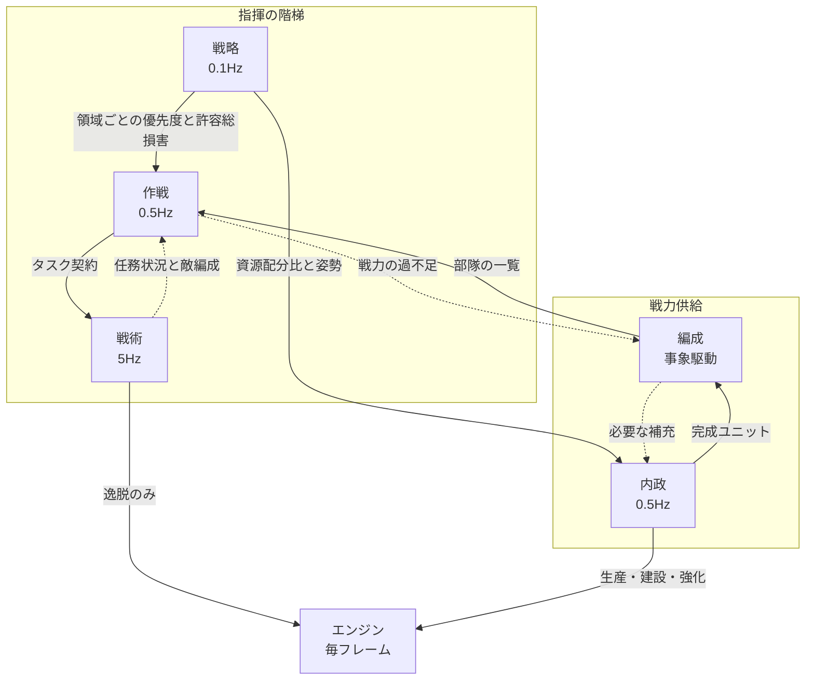

# システムの骨格

**この文書は、システムが何の層でできていて、層の間に何が流れるかを書く。** 骨格に沿った実装は、観測と行動の経路、五層のスクリプト方策、介入の経路とスクリプト乱入者、方策の評価、そして学習環境まで揃っている。**学習した方策の強さについての主張は、この文書にも `system/` の他のどの文書にも一つもない。** それは記録の側が持つ([../record/](../record/))。

**具体的な形式と値は四つの文書に分けてある。**

| 文書 | 内容 |
| --- | --- |
| [02-interface.md](02-interface.md) | 観測と行動を外へ渡す形式、通信、周期、領域の切り出し |
| [03-script-policy.md](03-script-policy.md) | 契約の項目と値域、部隊管理の規則、行動の集合、スクリプト方策、スクリプト乱入者 |
| [04-learning.md](04-learning.md) | 符号化、行動空間、報酬、交戦アリーナ、構築作戦アリーナ、推論の集約、軌跡の収集、最適化 |
| [05-evaluation.md](05-evaluation.md) | 二つの方策を比べる手順と、必要なエピソード数 |

方針を書き留める意味は、[../record/02-throughput.md](../record/02-throughput.md) とゲーム側の解析で判明した制約が、設計の選択肢をかなり絞り込むからである。何を選べるかより先に、**何が選べないか**が分かっている。実際、以下の決定はほとんどが選好ではなく、制約によって選択肢が一つに潰れた結果である。

## 決まっていること

| 項目 | 決定 | 理由 |
| --- | --- | --- |
| 構成 | 指揮の階梯を三段に分け、これに戦力供給の二機能を添える。層の間は意味の固定された契約で結ぶ | 層の境界を切る費用は安く、介入点と学習の切り分けを同時に得られる |
| 学習させる層 | 指揮の階梯の三段すべて。戦力供給の二機能はスクリプト | 学習する層を 1 つ増やすたびに交互学習と評価の一巡が乗るので、順序は費用の安い順に固定する |
| 自律度 | 学習時は完全自律。運用時は人間が層と部隊の単位で指揮を引き取れる | 学習に人間を挟むとサンプル予算が消える。運用時の介入はそれとは別の問題 |
| 学習の立ち上げ | 手書きのスクリプト方策を先に作り、骨格と教師と評価基準に使う | ゼロからの強化学習も人間リプレイからの模倣も成立しない |
| 対戦相手 | 内蔵 AI の 6 段階とスクリプト方策の集団。自己対戦は後 | 自己対戦はサンプル単価が倍で、評価をさらに不安定にする |

各決定の根拠は、いずれも [制約が締め出すもの](#制約が締め出すもの) に帰着する。

対戦相手については実測で見立てが崩れた点がある。**内蔵 AI の難易度は対戦者ごとに指定できない。** 部屋の設定は追加する全 AI に同じ値を与え、後から書き換えても効果が確認できなかった([05-evaluation.md](05-evaluation.md))。難易度を並べた物差しは作れないため、**対戦相手の集団はスクリプト方策の側で用意する**。

## 層の構成

出発点は「マクロとミクロの二層」だったが、マクロに詰め込んでいた判断は時定数も観測範囲も報酬も異なる。一つの方策にまとめると内政判断の信用割り当てが戦術結果に汚染されるため、分割する。

分割した先は一本の梯子ではない。**指揮の階梯と、そこへ戦力を供給する機能は別の軸である。**

### 指揮の階梯

上から下へ、判断の粒度が細かくなり周期が速くなる。軍事の階梯の呼称をそのまま使う。

| 層 | 周期 | 決めること | 観測 | 初期実装 | 人間の介入 |
| --- | --- | --- | --- | --- | --- |
| 戦略 | 0.1Hz | 方針(拡張 / 技術 / 軍拡 / 防衛 / 決戦)と資源配分比 | 集計のみ | **学習** | 方針の指定 |
| 作戦 | 0.5Hz | 各部隊へのタスク契約。どの部隊をどの領域へ | 領域特徴と部隊状況 | **学習** | 契約の書き換え |
| 戦術 | 5Hz | エンジン既定挙動からの逸脱 | 部隊周辺 | **学習** | 直接操作 |

### 戦力供給

階梯の段ではなく、階梯に戦力を供給する機能である。戦略の配下に置かれ、作戦へ部隊を渡す。

| 層 | 周期 | 決めること | 観測 | 初期実装 | 人間の介入 |
| --- | --- | --- | --- | --- | --- |
| 内政 | 0.5Hz | 何を生産・建設・強化するか | 自軍集計と配分比 | スクリプト(ビルドオーダ) | 生産キューの手動指定 |
| 編成 | 事象駆動 | 部隊の生成・解散・合流・増援配属 | 部隊一覧と領域勢力 | スクリプト(ドクトリン) | 編成の組み替え |

その下でエンジンが毎フレーム、経路探索・自動索敵・自動交戦を担う。これは既存の実装であり、こちらが設計する層ではないが、戦術層の既定挙動そのものである。

人間はいずれの層の指揮も引き取れる([人間の介入](#人間の介入))。

なお RTS で言う「マクロ」は戦略・内政・編成・作戦にまたがり、「ミクロ」は戦術にあたる。粗い対応として述べるにとどめ、層の名前としては使わない。

### 層を増やす費用と、学習させる層を増やす費用は別物

**層の境界を切ること自体はほぼ無償である。** 契約を一つ定義してスクリプトを一つ書けば、介入点が一つ増え、報酬の切り分けが一つ細かくなる。

**一方、学習する層を一つ増やすと、交互学習の一巡と多数エピソード評価の一巡がまるごと乗る。** 毎時 200 試合から 480 試合という予算([../record/02-throughput.md](../record/02-throughput.md))では、これが実質的な上限を決める。

したがって「層を細かく切るか」と「各層を学習させるか」は直交する軸として扱う。**層は細かく切り、学習は指揮の階梯の三段に置く。戦力供給の二機能(内政・編成)はスクリプトのままである。**

**この費用は消えていない。順序に変わっただけである。** 戦略層は行動空間が小さく、信用割り当ての地平が試合全体で、**1 決定あたりの単価が全層で最も高い**——戦術層が 1 秒に 5 回決めるところを 10 秒に 1 回しか決めず、その 1 回が報われるのは数分後だからである。だから**学習の順序では最後に置く**([学習の順序](#学習の順序))。同時に、人間が最も得意とし、最も指示したい層でもある。**学習させる費用が最も高い層が、人間に渡す価値も最も高い層である**という対応は、そのまま設計に使える——学習した戦略層があっても、人間が姿勢を固定する経路は消えない。

**そして戦略層には構築した場が無く、作れない。** 戦術層に交戦アリーナを、作戦層に構築作戦アリーナを与えられたのは、どちらの決定も試合から切り出して組めるからである。戦略層が決めているのは**試合そのものをどう使うか**であり、経済を取り除いた場を組めばその決定は残らない。したがって戦略層は通常の試合の中で学習し、試合の採点をそのまま終端に受け取る。**この設計で層が試合の結果を見るのはここだけである。**

## 部隊

部隊は契約のフィールドではなく、**名前と生存期間を持つ第一級の実体**とする。生成されてから解散されるまで同一性を保ち、複数の任務をまたいで存続する。

こうする理由は三つある。

**作戦層の行動空間が小さくなる。** 「数百体の部分集合を選ぶ」という組み合わせ問題が「部隊 3 を領域 7 へ」という小さな離散割り当てになる。これは指揮側の行動空間で最も学習しづらい部分であり、構造で消せるなら消すべきである。

**戦術層の内部状態の置き場所が定まる。** 隊形や交戦の記憶は任務ではなく部隊に属する。任務が切り替わっても連続する。

**人間への指揮権移譲の単位が自然に決まる。** 部隊を丸ごと渡す、という操作が意味を持つ([人間の介入](#人間の介入))。

代償として、部隊の生存期間の管理が新たに必要になる。消耗した部隊の統合、増援の配属先の決定、目的を失った部隊の解散である。これを担うのが編成層であり、放置すると部隊が際限なく増える。

## 制約が締め出すもの

実測から、次は成立しないと判断できる。設計の骨格はほぼこの一覧で決まっている。

### スクラッチからの強化学習だけで方策を得ること

サンプル収集は 8 並列で実時間の 60 倍から 80 倍が上限である。1 時間の実行でおよそ 200 から 480 試合にしかならない。RTS の強化学習研究が前提にする規模には二桁足りない。

これは機材を増やせば緩む制約だが、緩め方は台数に比例するだけである。設計としては、**学習を一から始めない方向**、つまり既に妥当に動く方策を出発点にする方向へ寄せる必要がある。

### 人間のリプレイからの模倣で立ち上げること

ロックステップのリプレイに記録されているのはコマンド列だけであり、状態は含まれない。模倣学習に必要な「状態と行動の対」を作るには、リプレイを再シミュレートして各コマンド時点の状態を復元する必要がある。

ところが同一の設定でも試合は再現しない([../game/05-match-control.md](../game/05-match-control.md))。**したがって、そのコマンドが条件付けられていた状態を復元できない。** リプレイは再生するたびに別の展開になる。

この選択肢を開くには、フレームの delta を実経過時間から固定値へ差し替えるバイトコード改変を先に行い、かつその状態で再現性が実際に回復することを検証する必要がある。回復するかどうかは未検証である。

ただし**リプレイ以外に人間のデータを取る道はある**。介入 UI 経由の操作はプロセス内でその瞬間の状態とともに記録できる([介入の記録は模倣学習を開き直す](#介入の記録は模倣学習を開き直す))。

### 人間を挟んだまま学習させること

学習中に人間の入力を必要とする構成は採れない。1 試合ごとに人間が張り付く形は `-nodisplay` での 8 並列 10 倍速という実行基盤([06-runtime.md](06-runtime.md))と正面から衝突し、サンプル収集の予算がまるごと消える。

**閉じているのは「学習時に人間を挟むこと」だけであり、運用時の介入ではない。** 運用時の介入は throughput とは無関係であり、[人間の介入](#人間の介入) のとおり設計に組み込む。

なお、副官型で従来問題とされる「人間の意図の推定」と「人間の命令を上書きしない仕組み」は、いずれも別途は不要になった。**意図は契約として明示的に書かれるため推定が要らず、上書きの防止は単一指揮者の所有権モデルに帰着する。** 層間を契約にした設計の副産物である。

### 層間インタフェースを学習させること

上位層が下位層へ渡す情報を潜在ベクトルとして学習させる構成は採らない。この構成では片方を変えるともう片方が無効化されるため、層をまたいだ信用割り当てが必要になる。階層強化学習がしばしば平坦な強化学習よりサンプル効率で劣るのはこのためであり、この予算では最初に捨てる構成である。

**層間の受け渡しは、意味の固定された契約とする。** 各層を、凍結した相手に対して独立に学習・評価できることを設計目標に置く。

この決定は介入機能の前提でもある。潜在ベクトルには人間が編集できる意味がなく、**契約であることが介入面をそのまま作っている**。

### 複数の層を同時に学習させること

学習中の層の報酬信号はもともと多数エピソードの平均でしか読めない。そこへ非定常な他層が加わると、観測された差がどの層の変化によるものか原理的に切り分けられない。**この予算では一度に一つしか変えられない。** 学習は必ず他層を凍結した交互で行う。

### 二つの方策を同じ試合で比較すること

同一の乱数種と設定を与えても試合は再現しない([../game/05-match-control.md](../game/05-match-control.md))。したがって、片方の方策を差し替えて同じ展開で比べる、という評価はできない。

**評価は最初から多数エピソードの平均として設計する。** 差を検出したい効果量に対して何試合必要かを見積もる手順を、評価の仕組みに組み込む。

### 状態を直接書き換える近道

報酬の整形やカリキュラムのために資金や体力を直接操作したくなるが、これはロックステップの同期を壊す([../game/03-observation.md](../game/03-observation.md))。単独プレイでは動いてしまうため、自己対戦を導入した時点で原因不明の分岐として現れる。

**観測層は読み取り専用と決めておく。** 状況の設定が必要なら、試合開始時のルーム設定([../game/05-match-control.md](../game/05-match-control.md))か、正規のコマンド経路を使う。後者を使った状況構築は [学習環境の作り分け](#学習環境の作り分け) に記す。

## 制御の周期と計算量

倍率 10、300fps で 1 ステップは 33 ミリ秒である。これが制御周期の下限を決める。

| 層 | ゲーム内周期 | 8 並列 10 倍での実時間あたり推論回数 |
| --- | --- | --- |
| 戦術 | 5Hz(6 ステップに 1 回) | 毎秒 400 回 |
| 作戦 | 0.5Hz(60 ステップに 1 回) | 毎秒 40 回 |
| 内政 | 0.5Hz | 毎秒 40 回。当面はスクリプトで GPU を使わない |
| 戦略 | 0.1Hz | 毎秒 8 回。当面はスクリプトで GPU を使わない |
| 編成 | 事象駆動 | 生産完了と部隊消耗の頻度に依存する |

GPU に載るのは戦術と作戦と戦略の合計 448 回である。**戦略層は毎秒 8 回で、三つのうち費用は無視できる**——載る量ではなく、1 決定が報われるまでの長さが高い層である。

戦術の 1 回は部隊単位のバッチで処理する。**毎秒 400 バッチという要求は、6GB の GPU では小規模なネットワークしか許さない。** 戦術側は共有パラメータの軽量なモデルにする、という設計上の制約がここから出る。

この数字を下げる手が二つある。

**推論の対象を絞る。** 毎秒 400 バッチは全部隊を毎周期推論する前提の値である。戦術を介入として設計すれば([戦術は介入として設計する](#戦術は介入として設計する))、対象は交戦中および交戦近傍の部隊だけでよい。被弾時刻 `am.bs` が安価な起動条件になる。移動中や待機中の部隊はエンジン既定の挙動に任せ、推論に載せない。

**推論をプロセス横断でまとめる。** 8 インスタンスがそれぞれ毎秒 50 回投げると合計 400 回になるが、数ミリ秒の窓で束ねる推論サーバを 1 つ立てれば、GPU の呼び出し回数は 8 分の 1、バッチは 8 倍になる。**推論はインスタンスごとに持たせず、集約する。**

**観測の取り出しは安いことが実測で分かった。** ユニットの列挙はプレイヤー別の索引が存在せず全件走査になるが([../game/03-observation.md](../game/03-observation.md))、実行時コンパイルが効いた後は 1 体あたり 0.4 から 0.6 マイクロ秒であり、120 体で 0.05 ミリ秒である([02-interface.md](02-interface.md))。差分の送出や間引きを設計する必要はない。集計値を `n.T` から O(1) で読む利点は残るが、それは費用ではなく**指揮下の戦力を正しく定義するため**の話になる。

## 観測の設計

層ごとに見るものを分ける。同じ盤面から別々の抽象度で切り出す。

**戦略と内政**は全体の集計を見る。ユニット種別ごとの数、資金と収入、ユニット上限に対する余裕、建造中の数、経過時間。ほとんどが `n.T` と累積戦績 `bo` から直接取れる。

**編成と作戦**は部隊の一覧と領域ごとの勢力を見る。

**戦術**は担当部隊の周辺だけを見る。各ユニットの体力と種別と状態、近傍の味方と敵の相対位置、体力、種別、そして現在の命令。

### 観測は「指揮下の戦力」で定義する

**`n.T` をそのまま自軍戦力として使ってはいけない。**

人間が部隊の指揮を引き取っても、そのユニットの所有プレイヤーは変わらない。したがって `n.T` の集計に残り続け、**指揮系統は使えない戦力を勘定して作戦を立てる**。内政層についても同じで、工場の指揮を人間が取ったなら生産能力から外さなければならない。

観測層は、集計値から**他の指揮者が保持している分を差し引いた値**を各層に渡す。人間保持分の集合は小さいので、その集合だけを走査して差し引けば O(1) の利点は概ね保たれる。

これは介入機能を足すときに後付けするものではなく、**観測の定義そのもの**として最初から入れる。後から入れると、介入していない試合では正しく動き、介入した試合だけ静かに劣化する。

### 上位層は敵の編成を自力では観測できない

`n.T` と `bo` から O(1) で取れるのは**自軍側の集計だけ**である。敵の編成を知るには全ユニットを走査し、そのうえで可視判定を通す必要がある。

したがって霧を有効にした時点で、指揮の階梯は敵の編成に関する入力を持たない。**盤面に接触している戦術層が唯一のセンサである。** これが [層間の連携](#層間の連携) に上り方向の経路を置く理由であり、連携を上から下への一方向として設計すると、霧を入れた瞬間に上位層の入力が消える。

### 霧の扱い

**霧を考慮するかは明示的に決める。** ゲームには視界を考慮した可視判定 API があり、あるプレイヤーからユニットが見えるかを `am.d(n)` で、タイルが探索済みかを `b.b.a(n,x,y)` で判定できる。全知の観測で学習させれば速く進むが、そのまま実戦に出すと成立しない。**当面は全知で足場を作り、切り替えられる構造にしておく**のが妥当と考える。

ただし前項のとおり、切り替えを後回しにできるのは観測の**内容**だけである。戦術層から上へ敵情を返す**経路**は、全知の段階で通しておく必要がある。全知のうちは同じ値が上位層でも直接取れるので、経路が正しく機能しているかを突き合わせで検証できるという利点もある。

観測はゲームスレッド上で組み立てる。監視スレッドから読むとシミュレーションの途中の状態を拾い、ユニットごとに時刻の揃わない断片的な観測になる。ゲームへの介入経路([../game/04-actions.md](../game/04-actions.md))はもともとゲームスレッドを通るので、観測もそこに載せる。

## 行動の設計

生産と建設は特殊アクションとして発行する仕組みが判明している([../game/04-actions.md](../game/04-actions.md))。戦術層の行動はユニット単位で、移動先か攻撃対象の選択になる。命令はコマンド 1 つに複数ユニットをまとめられるため、同じ命令を出すユニットは束ねて発行の回数を減らせる。

### 領域は座標ではなく離散 ID とする

上位層が指す場所を生の座標にすると、行動空間がマップ寸法に依存し、マップを変えるたびに学習し直しになる。

資源はゲームオブジェクトではなくマップタイルの属性であり、位置はマップファイルから読める([../game/03-observation.md](../game/03-observation.md))。したがって**資源地点と出撃地点のクラスタリングで、マップごとに領域を機械的に切り出せる**。これで上位層の行動空間はマップ非依存の小さな離散集合になり、領域の特徴量(資源数、自軍と敵軍の勢力、距離)だけがマップごとに変わる形になる。

切り出しの規則、スロット数、組み込み 48 マップでの実測は [02-interface.md](02-interface.md) にある。**領域の数を固定せず融合距離を固定する**という結論だけここに記す。数を固定すると、大きなマップで領域が盤面の 3 分の 1 を覆うまで育つ。

## 層間の連携

設計目標は「層をうまく協調させること」ではない。**各層を、凍結した相手に対して独立に学習・評価できるようにすることである。** 予算がこれを要求する。同時にこれが、人間が任意の層に割り込める構造をそのまま与える。

### 契約の一覧

| 経路 | 渡すもの |
| --- | --- |
| 戦略 → 内政 | 姿勢、資源配分比、技術投資の上限、軍備の目標構成 |
| 戦略 → 作戦 | 領域ごとの優先度、攻勢か守勢か、許容する総損害 |
| 内政 → 編成 | 完成したユニットの引き渡し |
| 編成 → 作戦 | 部隊の一覧。各部隊の構成、所在、健全度 |
| 作戦 → 戦術 | タスク契約(下表) |

### 作戦から戦術へ: タスク契約

潜在ベクトルではなく、意味の固定された構造体を渡す。

| 項目 | 内容 |
| --- | --- |
| `squad` | 対象部隊の識別子 |
| `task_type` | 攻撃 / 防衛 / 襲撃 / 後退 / 護衛 / 包囲 |
| `target` | 領域 ID |
| `stance` | 交戦スタンス `game.units.a` へ直接写像する |
| `cost_budget` | この任務で失って構わない自軍価値 |
| `deadline` | 完了を期待するゲーム内時刻 |

要点は `cost_budget` である。これは**価値判断を契約に載せる**ための項目であり、「戦術の局所最適が全体の不利につながる場合をどう扱うか」という問題をここで解く。

交換比を最大化する戦術は、自軍を全滅させてでも敵の経済を潰すべき局面で必ず退く。しかしその判断に必要な情報(経済差、残り時間、代替手段の有無)を持っているのは上位層だけである。戦術に全体報酬を渡して察してもらうのではなく、「この任務は自軍価値 X まで払ってよい」と明示的に渡す。**戦術層は理由を知る必要がない。**

### 下から上へ返すもの

連携は双方向である。[上位層は敵の編成を自力では観測できない](#上位層は敵の編成を自力では観測できない)ため、次を返す経路が必須である。

| 経路 | 返すもの |
| --- | --- |
| 戦術 → 作戦 | 任務状況(進行中 / 膠着 / losing / 完了 / 期限切れ)、接触した敵編成、実損害 |
| 作戦 → 編成 | 戦力の過不足、消耗して任務に耐えない部隊 |
| 編成 → 内政 | 必要な補充の種別と量 |
| 全層 → 戦略 | 戦線の状況と経済の推移 |

任務状況は上位層の行動の帰結を短い遅延で返す信号でもあり、上位層の学習が試合終了の勝敗だけに依存しないための素材になる。

### 戦術は介入として設計する

**戦術層をゼロからのユニット操作として設計しない。**

エンジンは既に、経路探索、自動索敵、交戦スタンス、`attackMove` / `patrol` / `guard`、容量 30 のウェイポイントキューを持っている([../game/04-actions.md](../game/04-actions.md))。これは無償で手に入る、そこそこ有能な戦術のベースラインである。

したがって戦術層の既定挙動は「割り当てられた目標へ、指定されたスタンスで `attackMove`」とし、学習するのは**そこから逸脱すべき場面の判定と逸脱の内容**だけにする。被弾ユニットの後退、集中砲火、カイト、範囲攻撃に対する散開などである。

この設計には三つの利点がある。学習問題が小さくなること。推論の対象が交戦近傍に絞られ、[制御の周期と計算量](#制御の周期と計算量)の要求が緩むこと。そして**すべての層が沈黙しても、ユニットはスタンスに従って戦い続ける**ことである。最後の点は運用時の縮退先として効く。

### 報酬の分け方

一般則は一つである。**各層の報酬は、上位から受け取った契約の達成度で測る。** 最上位の戦略層だけが試合の勝敗を受け取る。

指揮の階梯の三段を学習させるので、定義が要るのは次の三つである。

| 層 | 報酬 | 地平 |
| --- | --- | --- |
| 戦略 | 試合の採点そのもの([05-evaluation.md](05-evaluation.md))。加えて軍事価値差のポテンシャル整形 | 試合 1 本 |
| 作戦 | 戦略から受けた領域優先度と総損害枠に対する達成度。加えて軍事価値差のポテンシャル整形 | 数分 |
| 戦術 | タスク契約の達成度。目標の確保と維持、`cost_budget` 内に収まったか | 10 秒から 60 秒 |

**戦略層だけが試合の結果を受け取る**のは一般則の言い換えである。上位から契約を受け取っていない唯一の層なので、達成度を測る相手が試合しかない。整形に使う量は試合の採点の**進行中の形**、すなわち軍事価値差そのものであり、終端が指す先と密な項が指す先を一致させてある(戦術層の交換比と同じ形の議論である)。

整形はポテンシャルベースにして最適方策を歪めないようにする。素材は [報酬に使える素材](#報酬に使える素材) で足りる。

**下位層は上位層の報酬を一切見ない。** これが層をまたいだ信用割り当てを不要にする。同時に、戦術の報酬地平が任務境界で閉じることで 10 秒から 60 秒になる。この予算で学習可能な地平はこの長さだけである。

### 学習の順序

**交互に学習させる。他層は必ず凍結する。** 同時学習を採らない理由は [複数の層を同時に学習させること](#複数の層を同時に学習させること) に記した。

順序は戦術が先である。理由は決定的で、**戦術は試合を回さずに学習できる**からである([学習環境の作り分け](#学習環境の作り分け))。作戦の学習は全試合を回す必要があるため単価が高く、凍結対象が安いうちに固めるのが順序として正しい。

作戦は凍結した戦術に対して学習させる。0.5Hz で 20 分の試合なら 1 試合あたり約 600 回の決定であり、実測の毎時 136 エピソード([05-evaluation.md](05-evaluation.md))なら毎時 8 万回の決定が集まる。部隊が第一級の実体であるおかげで行動空間が小さな離散割り当てに収まり、スクリプト方策から初期化するなら、この規模は現実的である。

**戦略は最後で、凍結した下二層に対して全試合で学習させる。** 順序が最後なのは単価であり、それは決定の数ではなく**独立な結果の数**で決まる。0.1Hz なので 5 分の試合で 30 回しか決めず、しかもその 30 回が受け取る終端は**試合 1 本につき 1 つ**である。戦術層が交戦 1 件ごとに独立な成績を受け取るのと比べて、同じ実時間から取れる独立な観測が桁で少ない。**構築した場でこれを安くする道は無い**——戦略層が決めているのは試合そのものの使い方だからである([層を増やす費用と、学習させる層を増やす費用は別物](#層を増やす費用と学習させる層を増やす費用は別物))。

### スクリプト方策が契約の定義を兼ねる

手書きのスクリプト方策には、教師と評価基準以上の役割を持たせる。**全層をスクリプトで先に書き、その間の受け渡しをそのまま契約の定義とする。**

こうすると、常に動くシステムが最初から存在し、各層を一つずつ学習方策へ差し替えて多数エピソード平均でスクリプト版と比較でき、契約の粒度が議論ではなく計測で決まる。渡す情報の粒度がそのまま層の分担を決める以上、机上で詰めるより一度通してから測る方が速い。

## 人間の介入

運用時に、人間が指揮系統へ割り込めるようにする。全部渡すか全部渡さないかではなく、**層と部隊の二次元で権限を切り替える**。

### 層 × 部隊

部隊ごとに、どの層まで人間が持つかを選べる。

| 人間が持つ層 | 結果 |
| --- | --- |
| なし | 完全自律 |
| 作戦のみ | 人間が目標と許容損害を決め、戦術層が操作する |
| 戦術のみ | 指揮系統が目標を決め、人間が直接操作する |
| 両方 | 完全手動 |

**作戦だけを取る形が最も有用である。** 人間は「領域 7 を攻めろ、損害は 2000 まで、スタンスは aggressive」と契約を書くだけでよく、実行の巧拙は学習済みの戦術層が担う。作戦レベルの操作性と、機械の実行品質を同時に得られる。

部隊に紐づかない層、すなわち戦略と内政についても同様に人間が引き取れる。戦略層は[学習の費用が最も高く、人間に渡す価値も最も高い層](#層を増やす費用と学習させる層を増やす費用は別物)である。**学習した戦略層を置いてもこの経路は消えない**——姿勢を固定すればその試合の姿勢は人間のものになり、学習層はその周期に決定を下さず、下していない決定は学習信号にも入らない([04-learning.md](04-learning.md))。

### 所有権

**あるユニットの指揮者は常に一人である。** 共有制御は作らない。指揮権の移動は明示的な一方向の操作としてのみ起こる。

これで副官型の難所とされてきた「人間の命令を上書きしない仕組み」は所有権の問題に落ち、「人間の意図の推定」は不要になる。**意図は契約として明示的に書かれる。**

指揮権を返すときは、返却時点の配置と部隊構成を編成層が受け取り直す。人間が動かした結果は指揮系統にとって未知の状態なので、返却は「新しい部隊の受け入れ」と同じ扱いにするのが素直である。

### UI

UI は制御の別経路ではなく、**契約の表示と編集**として作る。人間が行う操作はすべて、指揮系統が発行するのと同一形式の契約になる。

- 部隊一覧。各部隊の構成、現在の契約、任務状況、指揮者
- 契約の編集。生きている部隊の目標領域、スタンス、許容損害、期限を書き換える
- 編成の組み替え。部隊間でユニットを移す、部隊を分割・統合する
- 権限の切り替え。部隊ごと層ごとの指揮者を選ぶ

### 介入の記録は模倣学習を開き直す

人間のリプレイからの模倣は状態を復元できないため閉じている。しかし**介入 UI 経由の操作は、その瞬間の観測とともにプロセス内で記録できる**。人間が発行するのは指揮系統と同一形式の契約なので、得られるのはそのまま使える「状態と行動」の対である。再シミュレーションが要らず、決定性の問題を迂回する。

ただし量は正直に見積もる。人間が等倍速で 1 試合遊んで得られる契約編集はせいぜい数十から 200 程度であり、行動クローンを一から回す規模ではない。**初期化・正則化・選好データとしての利用**が現実的な位置づけで、スクリプト方策が出す同形式のデータと混ぜて使う。それでも 1 サンプルあたりの質は、リプレイから取れるはずだったものより高い。

### 介入が学習側に課す要件

**乱入への頑健性は訓練で担保する。** 人間が任務の途中で部隊からユニットを抜けば、契約の前提が崩れる。学習中に**部隊の増減と契約の外部キャンセルをランダムに注入する**。作戦層を学習させる際は、たまに部隊を奪って妥当だったり妥当でなかったりする行動を取る「スクリプト乱入者」を環境側に置く。

**介入された部隊の結果を学習信号から除外する。** 実戦のログから学習させる場合、指揮系統が制御していない部隊の戦果で褒めたり罰したりすることになる。

**評価は乱入込みで行う。** ただし人間を入れると多数エピソード平均が取れないため、大部分はスクリプト乱入者で評価し、実際の人間は最終確認だけに使う。

## 学習環境の作り分け

層ごとに必要な環境の形が違う。**戦術の学習には試合を回す必要がない。**

`04-actions.md` のシステム命令 `u=5`(ユニットの即時生成)は、状態の直接書き換えではなく正規のコマンド経路を通る。これに試合設定の開始クレジット、収入倍率、霧([../game/05-match-control.md](../game/05-match-control.md))を組み合わせれば、**任意の交戦状況を正規の経路だけで構築できる。**

これが予算に効く。30 秒の交戦を繰り返すのと 15 分の試合を回すのとでは、同じ実時間から取れる戦術のサンプル数が桁で違う。試合単位のサンプル予算([../record/02-throughput.md](../record/02-throughput.md))は戦術より上の層の制約であって、**戦術層の制約ではない**。

さらにサンドボックスのフラグ `l.bv` は全プレイヤーのユニットを操作可能にする。1 プロセス内で交戦の両側を動かせるため、戦術の自己対戦がネットワーク構成なしで組める。霧が強制的に無効化される点は、戦術の学習を全知から始める方針と整合する。

| 層 | 環境 | エピソード長 |
| --- | --- | --- |
| 戦術 | 構築した交戦状況。サンドボックスで両側を操作 | ゲーム内 10 秒から 60 秒 |
| 作戦 | 構築した領域支配の盤面、または通常のスキルミッシュ。他層は凍結、乱入者を注入 | 構築で 300 秒、試合で 10 分から 25 分 |
| 戦略 | 通常のスキルミッシュのみ。他層は凍結、乱入者を注入 | ゲーム内 5 分から 25 分 |

**`u=5` が実際にユニットを生成することは実行時に確認した**([../game/04-actions.md](../game/04-actions.md))。状態への直接代入ではなく正規のコマンド経路を通っている。

### `u=5` はロックステップの同期を壊さない

**2 プロセスを 1 つの試合に入れて実行時に確認した。** 単独プレイで動くことと、複数プロセスを接続した状態で同期が保たれることは別であり、後者を確かめない限りアリーナは砂上にある。

条件は次のとおりである。マップ Lake、一方のプロセスがポート 5123 でホストし、もう一方がそこへ参加する。両者とも五層のスクリプト方策を走らせ、速度倍率 10、打ち切りはゲーム内 180 秒。内蔵 AI は置かず、参加した側が対戦相手である。試合が走っている間、ホスト側のプロセスに 20 ゲーム秒おきに 6 回、自分のプレイヤーへ戦車 3 体ずつを作らせた。**生きた共有セッションの中で、システム命令により 18 体を生成したことになる。**

**結果は、どちらのプロセスもチェックサムの不一致も desync も一度も記録しなかった。** エピソードの終わりに、ホストはチェックサムの照合 2 回がいずれも一致し、クライアントの接続に対して desync の記録は無いと報告した。参加した側も同じ 2 回の一致を報告した。加えて両プロセスは最終局面を独立に同一に報告した。チーム 0 がユニット 22、価値 11400、収入 34。チーム 1 がユニット 11、価値 8600、収入 26。撃破 1、喪失 1 が双方である。**これは二つの世界が分岐していなかったという、第二の独立した言明である。**

この確認の限界も書いておく。**エンジンのチェックサム照合は 300 フレームごとであり、180 秒のエピソードでは照合が 2 回しか起きない。** そして 1 回の実行であって分布ではない。生成したのはホスト自身のプレイヤーのユニットであり、参加した側のプレイヤーのものではない。確かめたのは通常の生成命令であって、アリーナの構築と掃討の一巡ではない。

### 部屋の開始ユニット数では空の盤面を作れない

**部屋の開始ユニット数には効果がないことを実行時に確認した。** 本プロジェクトの開始手順が `config.g` へ書き込む値を 0、1、9 と変えても、出撃地点を持つプレイヤーはいずれも司令部 1 と建設機 1 で始まった(Lake、ゲーム内 15 秒で確認)。**この設定で空の盤面は要求できない。** ユニットを取り除くコマンドは存在しないので、交戦を組むための空の盤面は「後から空にする」ことでは得られない。

代わりに用意できるのは相手の側である。**アリーナのエピソードは、対戦相手としてマップが出撃地点を与えていないプレイヤーだけを残す。** 部屋は空きスロットを AI で埋めるが、二人用のマップで三番目以降のスロットに作られたプレイヤーは、現れる場所が無いためその場で消える。拠点も収入も持たず、考えることも何も無い。二つ目の拠点を持つプレイヤーを含む残り全員は観戦者へ移し、背景で第二の試合が進まないようにする。この段取りは計測エージェント側の試合開始手順にある。

## 報酬に使える素材

ゲーム側から直接取れるものを挙げる。いずれも [../game/03-observation.md](../game/03-observation.md) に対応がある。

| 素材 | 取得元 | 主な用途 |
| --- | --- | --- |
| 撃破したユニット数と建物数 | 累積戦績 `bo.c` `bo.d` | 全層 |
| 失ったユニット数と建物数 | 累積戦績 `bo.f` `bo.g` | 全層。戦術では契約の実損害 |
| 資金と収入 | `n.o` と `n.T.g` | 戦略と内政の経済差 |
| ユニット数と建造中の数 | `n.T` | 軍事価値差。指揮下の分だけに補正する |
| ユニットの価格 | `am.cL()` | 価値の重み付け |
| 勝敗 | `l.dq` と `l.dt`、および生存チームの集計 | 戦略の終端報酬 |

戦術の報酬は、これらのうち担当部隊に関わる分の差分を任務の開始時刻と終了時刻で切って求める。累積戦績はプレイヤー単位であるため、部隊単位の切り出しには所属ユニットの生死と撃破数 `am.cU` を併用する必要がある。

**軍事価値は価格の総和とする。** 実測で価格が耐久をよく代理することを確認した([03-script-policy.md](03-script-policy.md))。

**勝敗を終端報酬の唯一の素材にはできない。** 実測では、同じ難易度の内蔵 AI 同士がゲーム内 25 分でも決着しなかった([05-evaluation.md](05-evaluation.md))。打ち切り時の盤面を採点する仕組みが要る。

## 決まったこと

骨格を決めた過程で潰した未決事項である。詳細はそれぞれの文書にある。

| 項目 | 決定 | 文書 |
| --- | --- | --- |
| `cost_budget` の渡し方 | クレジットの絶対値。比は分母が任務中に動き、契約が意味を変える | [03](03-script-policy.md) |
| 部隊の生存期間管理 | 生成・増援・統合・解散の規則を編成層が持つ。同時部隊数の上限は 8 | [03](03-script-policy.md) |
| 戦略層の出力形式 | 離散の姿勢 5 種。資源配分比は姿勢からの表引き | [03](03-script-policy.md) |
| 指揮権の返却 | 部隊は保持せず未配属プールへ戻し、通常の増援規則を適用する | [03](03-script-policy.md) |
| 領域の切り出し | 融合距離 400 の単連結。出撃地点は融合しない。スロット 24 | [02](02-interface.md) |
| 戦術の逸脱の集合 | もとは `hold` `withdraw` `focus` `spread` `kite` の 5 つ。のち行動空間を広げて `withdraw_far`(完全離脱)と `focus_threat`(最も射程の長い在射程敵に集中)を足し 7 つ。部隊単位で選ぶ | [03](03-script-policy.md) |
| 軍事価値 | 価格の総和 | [03](03-script-policy.md) |
| 観測と行動の伝送 | TCP ループバック。制御プロセスが 1、ゲームが 8 | [02](02-interface.md) |
| 決定の遅延 | 1 周期の固定遅れ。ゲームスレッドは通信を待たない | [02](02-interface.md) |
| 評価の指標 | 勝敗だけでは決着しない試合が多すぎる。打ち切り時の盤面を採点する | [05](05-evaluation.md) |
| `u=5` の同期安全性 | 壊さない。2 プロセスの共有試合で 18 体を生成しても、チェックサムは一致し desync も出なかった | 本文書の[`u=5` はロックステップの同期を壊さない](#u5-はロックステップの同期を壊さない) |
| 空の盤面の作り方 | 部屋の開始ユニット数では作れない。アリーナは相手を、出撃地点を持たないプレイヤーにする | 本文書の[部屋の開始ユニット数では空の盤面を作れない](#部屋の開始ユニット数では空の盤面を作れない) |
| 学習アルゴリズム | クリップ比の近接方策最適化。環境を止められないので収集は連続、更新は別スレッド。各ステップが行動時の対数確率を持ち歩き、比をクリップすることが唯一の安全弁である | [04](04-learning.md) |
| 網の大きさ | 戦術は 58 入力・隠れ 64 × 2・出力 8(逸脱 7 + 価値 1)で 8,456 パラメータ。作戦は 400 + 部隊スロット 8 入力・隠れ 192 × 2・出力 31 で 121,567 パラメータ。どちらも胴体 1 本に頭 2 つ | [04](04-learning.md) |

**まだ決めていないことと、残っている作業の順序は記録の側にある**([../record/06-open-questions.md](../record/06-open-questions.md))。この文書は、決まって実装に入ったものだけを書く。
