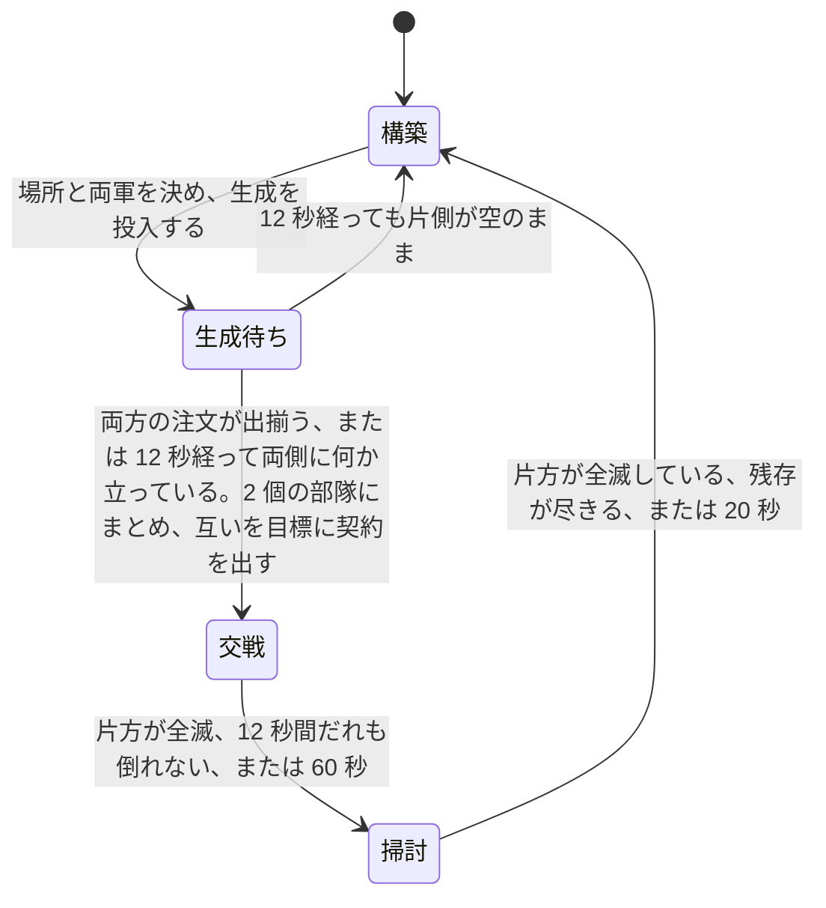
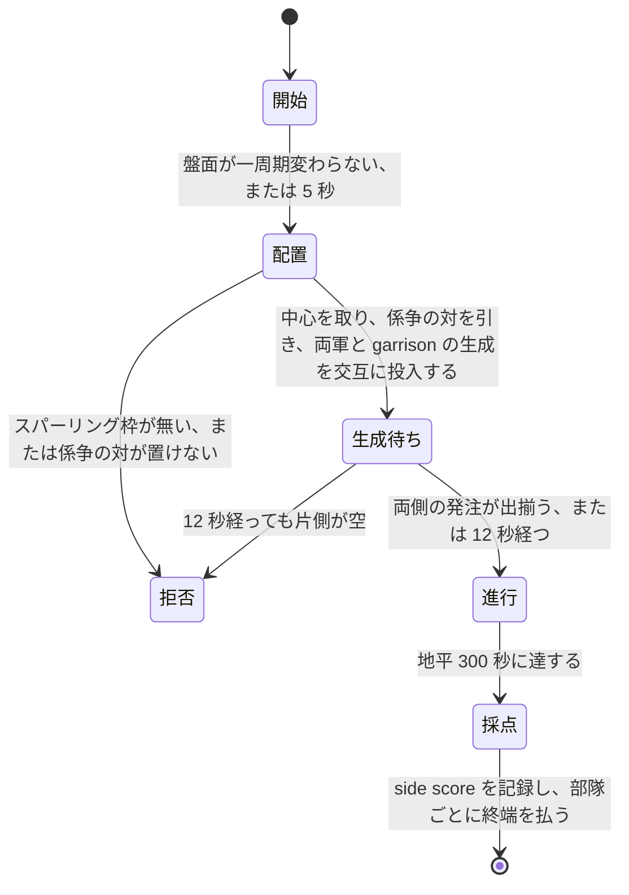

# 学習環境

[01-architecture.md](01-architecture.md) が指す「具体の形式と値」の四つ目である。[02-interface.md](02-interface.md) が観測と行動の運び方を、[03-script-policy.md](03-script-policy.md) が契約と全層のスクリプトを、[05-evaluation.md](05-evaluation.md) が二つの方策の比べ方を決めた。この文書は、**学習させる 2 層を実際に当てはめるために先に存在していなければならなかったもの**を書く。符号化、行動空間、報酬、交戦アリーナ、構築作戦アリーナ、推論の集約、軌跡の収集、最適化、そしてスクリプトを写して出発点にする仕掛けである。

**環境は実装済みである。** 実物は `rwintel/learn` にあり、`python -m rwintel.learn` で動く。性質は `tests/test_learning.py` と `tests/test_ops_arena.py`、`tests/test_ops_compare.py` で固定してある。

**この文書は環境が何をするかだけを書き、学習の成果は書かない。** これまでに何を測り、何を測り直して取り下げ、いま何が分かっていないかは記録の側にある——戦術層と交戦アリーナが [../record/03-tactics.md](../record/03-tactics.md)、作戦層と構築作戦アリーナが [../record/04-operations.md](../record/04-operations.md)、未解決の問いが [../record/05-open-questions.md](../record/05-open-questions.md) である。**要点だけ引くと、手書きの梯子を上回ったと示された戦術層の方策は一つも無く(既定の自己対戦で鍛えた層は梯子より下にあることが区間つきで示された)、作戦層は構築作戦アリーナの上でだけ梯子を区間つきで上回っている。**

**以下に出てくる定数と仕掛けの多くは、その記録が見つけた欠陥への応答である。** どの節も「なぜこの形なのか」を自分で述べるが、それを見つけた測定そのものは記録の側にしか無い。


## 学習方策はスクリプト方策の 1 メソッド置換である

先にこの一点を置く。以降のすべてがここに依存する。

学習する層は、スクリプト層を継承し、**決定を下す一つのメソッドだけを差し替えたもの**である。戦術層なら「逸脱のどれか」、作戦層なら「どの領域へ、どのタスクで」だけが置き換わる。任務状況の報告、実損害の切り出し、契約を出し直す条件、期限の付け方、許容損害の見積もりは、いずれも継承したスクリプトのコードがそのまま動く。

こうする理由は [01-architecture.md](01-architecture.md) の「凍結した相手に対して独立に学習・評価できること」である。学習層とスクリプト層が決定以外でも違っていたら、多数エピソード平均でスクリプトを上回ったという結果が「決定が良くなった」ことを意味しない。**再実装ではなく継承にしてあるのは、規則の写しが二つに増えて片方だけ動くことを構造で禁じるためである。**

副産物が一つある。**決定器を渡さない**と、その層は継承した規則にそのまま落ち、選ばれた行動を観測とともに書き出すだけになる。スクリプトがそのまま教師になり、出てくるのは学習層が出すのと同一形式の「状態と行動」の対である。人間のリプレイからは状態を復元できない([01-architecture.md](01-architecture.md))が、スクリプトからは無制限に取れる。

## 観測の符号化

層ごとに別の抽象度で切り出す。戦術層は担当部隊の交戦だけを、作戦層は盤面と領域と部隊だけを見る。規則は二つで、どちらも設計上の要求から来ている。

**すべての特徴は比か、明示した尺度で割った長さである。** 生のクレジット残高も生のワールド座標も一つも入れない。これは学習したい性質ではなく、成立の条件である。座標を入れればマップ寸法に方策が縛られ、クレジットの絶対値を入れれば「序盤の 2000」と「終盤の 2000」を別物として扱えない。**別のマップで読める方策**であることは [01-architecture.md](01-architecture.md) が領域を離散 ID にした理由そのものであり、符号化の側で崩したら意味がない。

**すべてのブロックは有効フラグ付きの固定長で、詰めた並びにしない。** 領域は 24 スロット、部隊は 8 スロットで、実在しないスロットは全ゼロになる。理由は [02-interface.md](02-interface.md) の観測ブロックと同じで、**スロット番号が決定をまたいで同じ場所を指すこと**が、方策が決定をまたいで状態を持てる条件だからである。詰めた並びにすると、部隊が 1 つ死んだ瞬間に残り全部の番号がずれる。

### 尺度

| 量 | 尺度 | 根拠 |
| --- | --- | --- |
| 距離(部隊から目標領域へ) | 2000 | 領域の融合距離が 400、試合の盤面は数千。普通の行軍が 1 の近くに来る |
| 距離(本拠地から) | 4000 | 上の 2 倍。盤面の端まで含める |
| 射程 | 400 | 組み込みの武装可動ユニットの射程の最大値([../game/06-content.md](../game/06-content.md)) |
| 散らばり | 400 | 交戦の近傍を切る半径と同じ(下記の 58 次元)。ゲーム側が散開させる距離は 140 だが、そこへ尺度を合わせると散開しただけの部隊がちょうど 1 に来て頭打ちになり、それより崩れた部隊と区別が付かなくなる |
| 部隊の人数 | 12 | ドクトリンの定数は最大で 10([03-script-policy.md](03-script-policy.md))。満員が 1 の手前に来て、増援で膨らんだ部隊がその上に出る |
| 時間(期限・任務の経過) | 60000ms | 戦術の報酬地平が 10 秒から 60 秒([01-architecture.md](01-architecture.md))、作戦の任務が数分。両方にとって 1 分が自然な単位 |
| 試合時間 | 1200000ms | 「どれだけ遅いか」を言う 1 個の特徴のためだけの尺度 |
| クレジット | 5000 | 開始クレジットが 4000。回っている経済はここから大きく上へは行かない |
| 収入 | 100/秒 | 十分に拡張した側が届くあたり |

二つの戦力を比べる特徴はすべて `自 / (自 + 敵)` の形にしてある。**どちらが上かは言うが、何クレジット上かは言わない。** 両方が 0 のときは 0.5 を返し、盤面が空でも符号化が壊れないようにしてある。アリーナのエピソードは第 1 フレームがまさに空の盤面なので、ここで 0 除算すると最初の交戦を組む前に実行が終わる。

### 戦術の切り出し: 58 次元

継承したスクリプト戦術層が逸脱を選ぶときに手元に持っているものと、**厳密に同じ材料**である。学習層が余分に見ていたら、それはスクリプトの置換ではなく別の層であり、[05-evaluation.md](05-evaluation.md) の比較が「同じ仕事をしている二つ」の比較にならない。

| 区分 | 幅 | 中身 |
| --- | --- | --- |
| 部隊の状態 | 9 | 人数、健全度、散らばり、平均体力、直近 2 秒以内に被弾した割合、予算の消化率、許容損害と現有価値の比、期限までの残り、任務の経過 |
| 任務状況 | 5 | 進行中 / 膠着 / 劣勢 / 完了 / 期限切れ の one-hot |
| 任務種別 | 6 | 攻撃 / 防衛 / 襲撃 / 後退 / 護衛 / 包囲 の one-hot |
| 交戦スタンス | 7 | `game.units.a` の 7 種の one-hot |
| 目標領域 | 5 | 距離、単位方向ベクトル 2、領域内の勢力比、敵価値と自部隊価値の比 |
| 交戦の規模 | 2 | 近傍の敵の数、敵と自軍の価値比 |
| 敵の構成 | 7 | 役割別の価値シェア |
| 自軍の構成 | 7 | 同じ役割別の価値シェア |
| 射程 | 3 | 自軍の最短射程、敵の最長射程、その差 |
| 交戦の形 | 3 | 自軍射程内にいる敵の割合、敵射程内にいる自軍の割合、砲兵の有無 |
| 残り | 4 | 交換比、被弾中か、接敵中か、バイアス項 |

近傍の敵は半径 400 で切られたものが渡ってくる。切るのは継承したスクリプト戦術層であり、符号化はそれを受け取るだけである。役割は装甲・砲・対空・高速・建設・建物・その他の 7 種で、**種別の属性から機械的に分類する**([03-script-policy.md](03-script-policy.md))。名前では分類しない。

**特徴には名前が付けてある。** 数えるだけにしないのは、1 つずれた特徴ベクトルは落ちずに学習し、別のマップで無価値になるからである。落ちるなら気付く。落ちないから名前で固定し、名前の数とベクトルの長さが一致することを試験で押さえている。

### 作戦の切り出し: 400 次元

| ブロック | 1 スロットの幅 | スロット数 | 計 |
| --- | --- | --- | --- |
| 全体 | 16 | 1 | 16 |
| 領域 | 10 | 24 | 240 |
| 部隊 | 18 | 8 | 144 |

全体ブロックは資金、収入、ユニット上限に対する余裕、建造中の数、戦略層の姿勢 5 種の one-hot、攻勢か守勢か、許容総損害と自軍価値の比、軍事価値の優劣、領域支配の優劣、経過時間、部隊数、バイアス項である。

領域ブロックは有効フラグ、資源地点の数、自軍が押さえた数、敵が押さえた数、勢力比、敵価値と自軍総価値の比、本拠地からの距離、直近 60 秒に敵を見たか、戦略層が付けた優先度、出撃地点か。

部隊ブロックは有効フラグ、ドクトリン 4 種の one-hot、自軍全体に対する価値シェア、健全度、散らばり、本拠地からの距離、任務状況 5 種の one-hot、他の指揮者が保持しているか、この層が任務を出せるか、予算の消化率、任務の経過である。

**出撃地点かどうかだけは観測から来ない。** 線上の領域行にその欄がないためで、値はマップファイルから作った領域表([02-interface.md](02-interface.md))を持つ制御プロセス側で埋める。「資源のある場所」と「敵が湧いてきた場所」の違いは他のどの特徴も言わないので、落とせない。

## 行動空間とマスク

**戦術層は逸脱から 1 つを選ぶ。** もとは 5 つ、`hold` `withdraw` `focus` `spread` `kite` で、いまは 2 つ足して 7 つである:完全に離脱する `withdraw_far` と、最弱でなく最も射程の長い在射程敵に集中する `focus_threat`。[03-script-policy.md](03-script-policy.md) が決めた集合であり、足した 2 つは、既にスクリプトが行っていた種類の動きに、規則が決めていたパラメータ(どれだけ引くか・誰に集中するか)を層に渡したものである。部隊単位で 1 つで、ユニット単位では選ばない。

**作戦層は領域 24 とタスク 6 を選ぶ。** 144 通りの積として出さず、二つの頭に分ける。理由は二つある。**問われている質問が別だから**である。どこへ行く価値があるかと、着いたら何をするかは、別の理由で決まる。そして**合法集合が二つの小さなマスクの積だから**である。積空間の上のマスクは疎になり、144 個の出力の大半が常に死んでいる形になる。

マスクは三つあり、出所がそれぞれ違う。

| マスク | 何を落とすか | 出所 |
| --- | --- | --- |
| 領域 | このマップに実在しない領域スロット | 制御プロセスが作った領域表。実在する ID の集合 |
| タスク | そのドクトリンに許されていないタスク | スクリプト方策のドクトリン表。前衛は攻撃と包囲、守備は防衛と護衛、襲撃は襲撃と後退、工作は空 |
| 部隊 | 存在しない、空、他者が保持中、ドクトリンにタスクがない部隊のスロット | 部隊の記録そのもの |

**戦術層にはマスクがない。7 つは常にすべて合法である。** 順調な戦闘から後退するのは悪手であって違法ではなく、「妥当な逸脱」だけを通すマスクを書いたら、それは規則の梯子をマスクの姿で書き直したものになる。判定させたいものを環境の側で先に判定してしまっては、何も学習しない。

**工作ドクトリンのタスク集合が空**なのは、建設機に契約が落ちないようにするためである。落ちると、建物を建てに歩いている最中の建設機が引き剥がされ、建てかけの建物がまるごと損失になる。

部隊マスクは、決定の経路では実際には参照されない。継承した作戦層が決定に入るより前に、ドクトリンにタスクの無い部隊と他者が保持している部隊を落としているためである。マスクの実装は同じ規則を独立に書き下したもので、試験がその一致を押さえている。**将来この層をスクリプトから切り離すときに必要になるものを、先に置いてある。**

マスクの掛け方は、ロジットに大きな負の下駄を履かせる形にしてある。あとから正規化し直す形は採らない。**下駄なら違法な行動に勾配が一切行かず、正規化だと消えかけの勾配が行く。**

## 報酬

一般則は [01-architecture.md](01-architecture.md) が既に述べている。**各層は、上位から受け取った契約の達成度で払われる。試合の勝敗を受け取るのは最上位の戦略層だけである。** これを具体にする。

**下位層は上位層の報酬を一切見ない。** これが層をまたいだ信用割り当てを不要にし、同時に戦術の報酬地平を任務の長さ、すなわち 10 秒から 60 秒に閉じる。この予算で学習できる地平はその長さだけである。

### 周期ごとの連続量はすべてポテンシャル整形に入れる

整形項を `γ × 後のポテンシャル - 前のポテンシャル` の形にすると、**終端状態のポテンシャルを 0 とみなす限り、ポテンシャルが何であっても最適方策が変わらない**。これが決定的な性質である。ポテンシャルの選び方を間違えても、失うのはサンプル効率だけで、正しさは失わない。逆に、この形でない周期ごとの連続報酬を足すと、間違ったときに「最適な方策そのものが変わる」という直しようのない壊れ方をする。

したがって、**周期ごとに動く連続量はすべてポテンシャルに入れ、直接払うのは任務が終わったときの一度きりの支払いだけ**にした。終端の支払いが連続量であっても構わない。整形の議論が禁じているのは各周期に足される連続報酬であって、軌跡に一度だけ乗る終端は報酬関数そのものの定義であり、伸縮する項ではないからである。

**Φ(終端)=0 は規約であって観測ではない。** 整形が無害なのは、1 本の軌跡にわたって和が伸縮して消えるからである。最後の一項が `γ × 0 - Φ(最後の状態)` でなければ和は `Φ(最後の状態)` の残差を残し、残差は最後の状態に依存するので**まさに最適方策を動かす**。終端状態のポテンシャルは定義されていない量なので、0 と決めるのはこちらの仕事である。整形の割引と収益の割引が同じ値でなければならないのも同じ議論の一部で、**ここがずれると整形が伸縮せず、残差が最適方策を動かす。** ポテンシャル整形を選んだ唯一の理由が消えるので、**二つを別々の定数に置かず、実行が 1 個の数字を決めて整形と収益の両方へ渡す**([アリーナの用務は割り引かない](#アリーナの用務は割り引かない))。試験は、渡された割引が何であっても整形が伸縮することを 0.99 と 1.0 の両方で押さえている。

**規約は軌跡が閉じるすべての経路で守る。** 契約自身の結末(完了・期限切れ・劣勢・全滅)が発火した周期も、アリーナが交戦を打ち切って外から閉じる周期も、その周期に払う整形項は `0 - 保持していた Φ` であって、実際の `γΦ(s')` ではない。効き方が最も大きいのは完了で、領域を取った盤面はポテンシャルの上端に近いから、`γΦ(s')` を残すと完了が定義より 0.67 ポイントほど高く見え、しかも**予算をどれだけ使ったかによってその上乗せ額が変わる**。終端によって上乗せが変わるというのは、整形が持ってはならない性質そのものである。

ポテンシャルも比で書く。戦車 4 両を巡る任務と 40 両を巡る任務は同じ任務であり、軍の大きさとともに報酬が育つと、同じ振る舞いが試合の後半ほど高く売れることになる。

### 決定を下さなかった周期の整形は、次に払う決定へ繰り越す

**層は、すべての部隊についてすべての周期に決定を下すわけではない。** 継承した戦術層は、人が戦術指揮を握っている部隊と、メンバーが一体も見えていない部隊について逸脱を選ばない。継承した作戦層は、健全度が `WORN_OUT_HEALTH`(0.4)を割った部隊、他者が保持している部隊、直前に編成が動いて落ち着いていない部隊について契約を出さない——**いずれも契約はそのまま立っている。** ところが報酬の側はその周期もその部隊のポテンシャルを進めるので、**差分は計算され、払う先が無いまま捨てられていた。**

**捨てると、伸縮する和に穴が開く。** 整形が無害なのは 1 本の軌跡にわたって和が伸縮するからであり、用務が返すのが「終端から開始ポテンシャルを引いたものちょうど」になるのは、**途中のすべての増分がどれかのステップに届いた場合だけ**である。届かなかった周期のある用務の収益は、その周期に盤面が動いたぶんだけ違う値になる。落ちるものは何も無く、ログにも出ない。

**したがって学習する二つの層は、部隊ごとに「未払い」の帳面(`owed`)を持つ。** 決定の待っていない周期に生じた整形はそこへ積まれ、次に払われる決定へ、そこまで無ければ終端の支払いへ繰り越される。**契約が差し替えられた用務と、盤面から消えた部隊については、繰り越しも一緒に捨てる。** 積んであったのは切られる用務のものであり、別の地面に対して測ったポテンシャルの差は、それを置き換えた用務の整形項ではないからである。**効きが大きいのは作戦層の側である。** 消耗で決定から外す規則を持っているのがそちらであり、アリーナは構造上、部隊を削りながら地平まで戦わせるためである。**これが成績を動かしたという測定は無い**([分かっていないこと](../record/05-open-questions.md))。直した根拠は、伸縮の算術が要求する形にコードがなっていなかったという一点である。

### アリーナの用務は割り引かない

**用務がどれだけ長いかは、それが試合の断片であるかアリーナの交戦 1 件であるかで違う。** 割引はその長さに対して選ぶものなので、定数ではなく引数にしてある。層を組み立てる側が場を知っているので、層を組み立てる側が整形の割引と収益の割引の両方を持つ。

**アリーナで 0.99 と 0.95 を使っていたのは間違いだった。算術で分かる。** 決定は毎秒 5 回下るので、アリーナの 1 用務は平均 113 決定、制限時間まで戦えば 300 決定になる。割引 0.99 だけでも、終端が交戦の最初の決定に届く重みは `0.99^300 ≒ 20 分の 1` である。そして**終端がどこまで届くかを実際に決めているのは trace の方である**。終端は n 歩前の決定へ `(割引 × trace)^n` で届くので、trace 0.95 のもとで優位推定が届く距離は `1/(1 - 0.99 × 0.95) ≒ 17 決定`、すなわち**20 秒の交戦のうち最後の 3 秒半**でしかない。**それより前に下した決定を教えていたのは整形項だけであり、整形項は定義により、どの方策が最適かを変えられない唯一の部分である。** 層は、効かないことが証明されている項だけで訓練されていた。

**割引を 1 にするだけでは直らない。trace も 1 にしなければならない。** 上の積がそのまま言っていることで、割引を 1 にしても trace が 1 未満なら、打ち切りが割引から trace へ移るだけである。**そのうえ、trace を 1 未満にして買えるもの、すなわち批評家を通した分散削減は、ここではほとんど買うものが無い。** 交戦の途中の報酬はすべて整形の差分であり、整形はそれを学んだ批評家に対して相殺するので、最初の決定と最後の決定の間の差分はほとんど何も運んでいない。

**割引と trace をともに 1 に置くと、決定の収益はその交戦の成績からその決定で保持していたポテンシャルを引いたものちょうどになり、優位はさらに批評家の見積もりを引いたものになる。** すなわち**「この交戦は、ここから見込まれていたよりどれだけ良く転んだか」**である。交戦は有限で、本物の終端を持って終わるので、割り引かずに済ませられる。整形の保証は何も手放していない。**整形はどの割引でも伸縮し、1 でも伸縮する。**

既定は、アリーナの学習実行が割引 1.0・trace 1.0、それ以外が 0.99・0.95 である。前者は `--discount` と `--trace` で動かせる。**この算術は、交換のポテンシャルを最も重くした理由でもあった。1.0・1.0 ではその理由が消えるだけでなく、密な項の重みそのものが方策に届かなくなる**([戦術層](#戦術層))。

**直したことが成績を良くしたという測定は無い。** 1.0 で回した実行と 0.99・0.95 で回した実行を並べて比べていない([分かっていないこと](../record/05-open-questions.md))。ここにあるのは算術だけである。

### 戦術層

ポテンシャルは三つの和である。目標領域に立てているか(重み 0.35)、許容損害をまだ使っていないか(0.15)、そして**契約が出てから壊した価値と失った価値の比**(0.5)である。三つ目が最も重い理由は重要さではなく信用割り当てであり、**その信用割り当ては、用務が試合の断片である場のものである。**

戦術速度で 1 つの用務はおよそ 125 決定の長さになる(毎秒 5 決定で 25 秒)。割引 0.99 と GAE の trace 0.95 のもとで、交戦の終わりに払われる終端が最初の決定に届く重みは `(0.99 × 0.95)^125 ≒ 4 × 10^-4` である。**交戦の序盤に下した決定を教えるものは、終端ではなく整形項しかない。** したがって整形項は終端の指す向きを指していなければならない。終端は交換そのもの(失った価値の割合の差)なので、密な項の側も交換でなければならない。**これは「交換比が大事だ」という主張ではなく、「交戦の最初の百決定に届く信号がそれしかない」という算術である。**

**ただしこの算術は、アリーナでは成り立たない。** 交戦 1 件は 1 本の有限な用務なので、そこでは割引も trace も 1 にしてあり、終端は交戦の最初の決定にそのままの重みで届く([アリーナの用務は割り引かない](#アリーナの用務は割り引かない))。**そのうえ割引 1・trace 1 では、密な項はそもそも方策に届かない。** 整形は用務の中で伸縮するので、決定の収益は「その交戦の成績 − その決定で保持していたポテンシャル」ちょうどになり、優位はそこから批評家の見積もりを引いたものになる。**そしてそのポテンシャルは、周期の頭で、逸脱が選ばれる前に読まれる**——学習する戦術層は、継承した層に選ばせる前に前周期の支払いを済ませるからである。すなわち三つの重みは、行動が決まる前に定まっている量として全部の収益に足されるだけであり、**行動に依らない量は方策勾配に寄与しない。批評家がそれを学び取れば、優位は整形を外したときとちょうど同じ数になる。**

**したがって「交換の項がアリーナでまだ要るか」は、実行ではなく算術で閉じている。** 外して比べる実行は差を測れない——動くのは批評家の当てる先が「成績 − ポテンシャル」か「成績」かという一点だけで、方策が何を好むように教えられるかは動かない。**これは交換の項に限らず、確保・未消費・交換の三つとも同じである。** 上の議論がそのまま生きているのは用務が試合の断片である場、すなわち割引 0.99 で回す場だけであり、**戦術層をその場で訓練する実行はいまのコードに無い**(戦術層の学習実行はアリーナだけで、`--discount` と `--trace` に別の値を渡さないかぎり 1.0・1.0 である)。

**古い二項は逆を向いていた。** 確保と未消費だけのポテンシャルでは、密な報酬が出るのは**許容損害を使っていないこと**に対してである。それしか密な信号を持たない層は、あらゆる交戦を最も静かに通り抜ける道を探す。すなわち戦わないことが報われる。**実測では、この二項のまま 200 更新を回してリターンはまったく動かず、方策のエントロピーだけが 0.4 から 0.9 へ登り続けた。** 一貫した勾配を持っていたのはエントロピー項だけであり、方策勾配の側は雑音だったということである。この同じ測定は[エントロピーの重み](#定数-1)も動かしている。

交換比は両辺に 300 クレジットを足してから取る。**何も起きていない交戦が 0.5 と読まれる**ようにするためで、足さないと最初の 1 両で項が端まで振れる。300 は安い 1 両ぶんの値段のあたりであり(アリーナが引ける最安の種別が 200、`tank` が 350)、最初の撃破がこの項の全部ではなく 3 分の 2 ほどを動かす大きさである。

壊した価値を数えているのは継承したスクリプト戦術層で、**1 周期遅れて届く。** 整形は差分なので、前後の両端に同じ遅れが乗って相殺する。

契約が新しく出された周期は何も払わない。ポテンシャルをそこで取り、次の周期から差分を払う。**契約を受け取っただけの一歩に、部隊がたまたま立っていた場所の分を払わない**ためである。

終端は 4 種類ある。

| 結末 | 支払い | 何のためか |
| --- | --- | --- |
| 完了 | +1.0 | 領域を取って居座った。任務の達成そのもの |
| 期限切れ | -0.5 | 失敗ではあるが、特に何かを失ったわけではない |
| 劣勢 | -1.0 | 予算は消え領域は来なかった。`cost_budget` の仕組みが高く付かせたい結末そのもの |
| 全滅 | -1.0 | 契約中に部隊が消えた |

**全滅を劣勢と分けてあるのは、消えた部隊はもう後退できないからである。** 戦術層にはそこに至るまでの全周期、後退という選択肢があった。同じ -1.0 だが別の事象として記録する。

完了には超過の減点が乗る。実損害が許容損害を超えていたら、超過分に比例して最大 0.5 を引く(2 倍で満額)。**発注された値段で取られなかった領域は、発注された値段で取られた領域と同じではない。**

#### 開始ポテンシャルはその契約の撃破だけで取る

**壊した価値の集計は、それがどの契約の下で取られたものかを見てから使う。** 継承したスクリプト戦術層は契約が出るたびに集計を取り直すが、それを行うのは 1 周期の処理の後半であり、報酬を払うのは前半である。**したがって、契約が新しく出た周期の開始ポテンシャルは、まだ前の契約ぶんの集計を読んでいた。**

**アリーナではそれが毎交戦である。** 部隊番号は 0 と 1 しかなく交戦ごとに再利用されるので、新しい交戦の開始ポテンシャルは前の交戦の撃破を丸ごと抱えていた。**実測では、0.575 であるべき開始ポテンシャルが、前の交戦の 3000 クレジットぶんの撃破を載せたまま 0.78 と読まれていた。** 開始ポテンシャルは最初の支払いにそのまま差として現れるので、その差ぶんが最初の支払いの全部である。

**直し方は、集計がどの契約の下で始められたかを見て、手元の契約と一致しなければ壊した価値を 0 として読むことである。** 一致しない周期はまさに契約が出たばかりの周期であり、そこでその契約の下に壊した価値は定義上まだ 0 だからである。**これは黙って効いていた。** 何も落ちず、何もログに出ず、実行はもっともらしい数字を報告していた。**これが成績を動かしたという測定は無い**([分かっていないこと](../record/05-open-questions.md))。

#### 契約が結末に達しないまま終わる交戦がある

4 つはどれも契約の結末である。ところが交戦は、契約がそのどれにも達しないまま終わることがあり、**アリーナで実測するとそれが最多である**。記録済みの交戦 549 件の内訳は次のとおりだった。この測定を取った時点では、契約の側の終端をアリーナでも発火させていた。右の列はそのとき実際に払われていたものである。

| 終わり方 | 件数 | 割合 | 当時、契約の側で発火した終端 |
| --- | --- | --- | --- |
| 片方全滅 | 133 | 24% | 消えた側に全滅 -1.0、相手側に完了 +1.0(自己対戦では相殺して平均 0) |
| 膠着打ち切り(12 秒無死) | 294 | 54% | なし |
| 60 秒到達 | 122 | 22% | 期限切れ -0.5 |

**この内訳はアリーナを直す前のものだが、比率の側は変わっていない。** 直したあとの実行でも交戦のおよそ 3 分の 2 が引き分けで、そのほとんどが膠着打ち切りである(件数は下の段落、[測定の記録](../record/03-tactics.md))。**半分以上の交戦が、終端を一つも払わずに終わっていた。** そのうえ膠着打ち切りでは軌跡すら閉じず、未清算の決定が次の交戦の最初の周期に持ち越されて、1 本の軌跡が複数の交戦の決定を連結したものになっていた。整形は伸縮して消えるので、方策が受け取る系統的な信号は期限切れの -0.5 だけであり、**膠着したまま何もしないことが報酬上の最善**という、アリーナが教えたいことのちょうど逆の誘因が立っていた。

**比率はいまも同じ側にある。** 記録の残っている全アリーナ実行の交戦 21,212 件では 13,748 件(64.8 パーセント)が引き分けで、そのうち 13,733 件が膠着打ち切り、15 件が 60 秒到達である([測定の記録](../record/03-tactics.md))。**この 3 分の 2 も終端は受け取っている。** 交戦の成績を五つ目の終端として払うようにしたのがその手当てであり、**膠着打ち切りが 1 点も払わなかったのは、この終端を入れる前の話である。**

**「疎な読みではその 3 分の 2 が全部ちょうど 0 点である」という読みは取り下げてある。** 打ち切りの条件は「12 秒だれも死なない」であって「だれも死んでいない」ではないので、疎な読みは静かな 12 秒より前の戦死をそのまま数える——膠着打ち切り 13,733 件のうち、ちょうど 0 点になったのは 33 件(0.24 パーセント)である([交戦の成績は二通りに読める](#交戦の成績は二通りに読める))。

#### 交戦の成績を五つ目の終端として払う

交戦が終わったとき、**その交戦がどう転んだかを連続量で採点し、それを終端として払う**。定義は失った価値の割合の差である。

```
自分が失った割合 = clamp((開始時の価値 - 終了時の価値) / 開始時の価値, 0, 1)
自分の戦力シェア = 開始時の自分の価値 / 両側の開始時の価値の和
成績 = 相手が失った割合 - 自分が失った割合 - 戦力シェアの倍率 × (自分の戦力シェア - 0.5)   # 倍率は読みごとに 3.96(疎な読み)/ 3.68(体力の読み)
```

戦力シェアの倍率は読みごとに別で、疎な読みが `STRENGTH_SLOPE_KILLS` = 3.96、体力の読みが `STRENGTH_SLOPE_HEALTH` = 3.68 である([戦力シェアの補正](#戦力シェアの補正))。**記録に載っている成績の数字は、断りのない限りこの項を戻す前(倍率 0)に取ったものである**([../record/03-tactics.md](../record/03-tactics.md))。

値域はおおむね `[-1, +1]` で、分母が 0 のときは該当する割合を 0、シェアを 0.5 とする。重みは 1.0、すなわち**無傷で相手を全滅させることが、契約の完了と同じ +1.0 になる大きさ**に置いてある。これ以上にすると、与えられた任務を果たすより敵を殲滅する方が高く売れることになる。

**開始時の価値は、生成を注文した分ではなく実際に盤面に現れて部隊になった分であり、その数字は両側の部隊を組んだ瞬間に取る。** 生成はユニットごとに位置を指定して置くので、エンジンが受け付けない地面に当たった分だけが現れないということが起こる。注文した額を分母にすると、現れなかったユニットが最初から失われていたことになり、**誰も被っていない損害を払う**。注文した額は別の欄として記録に残してあり、交戦が薄いのか小さいのかはそれで区別する。終了時の価値はゲーム側が毎周期報告する部隊の現有価値そのものなので、分子の両端が同じ足場に乗る([両軍が揃うまで部隊を組まない](#両軍が揃うまで部隊を組まない))。

**割合で書くのは、戦力比の抽選を成績に混ぜないためである。** アリーナは弱い側を強い側の 0.5 から 1.0 で引く([交戦の作り方](#交戦の作り方))。絶対の価値差で採点すると、強い側を引いたこと自体が得点になり、方策は一度も戦い方を変えずにその点数を改善できる。

**割合で書いても抽選は完全には消えない。** 強い側は失うクレジットが少ないだけでなく、自分の**割合**も小さく失う。実測すると、交戦 900 件から 1100 件の実行で成績と自側の戦力シェアの相関は 0.59 から 0.65 ある。三項目はその分を引くために足したものであり、**いったん測って 0 に落としたのち、原因を直して測り直し、戻してある**。

**反対称であることがこの定義の要点である。** 相手側にはちょうど符号を反転した値を払う。したがって自己対戦の平均はぴたり 0 でなければならず、スクリプト相手の平均が正であることは「スクリプトを上回った」ことと同値になる。**学習信号と評価指標が同一の量になる**ので、決闘([手順](#手順))が測るものと訓練が最大化するものの間に翻訳が要らない。**この性質は補正項の可否を判定する道具でもある。** 下の三項目は、まずこの自己対戦の平均によって否決され、原因を直したうえで測り直して同じ検査に通り、戻された。

**一つの用務に払われる終端は、必ず一つだけである。** 用務は契約が出された時刻で覚えてあり、終端を払った時点で「払い済み」の印が付く。印の付いた用務についてその後に下された決定は、どの用務にも属さないものとして何も払わない。外から交戦の終わりを告げられたときも、印が付いていれば未清算の決定は清算せずに切る(切るとは、終端ではなく最後の値推定でブートストラップすることである)。**印を付けずに用務を忘れる方式は取らない。** 終端の条件は盤面から読むもので、盤面がそのままなら次の周期も同じ条件が成立するから、忘れた用務は次の周期に作り直されて同じ終端をもう一度払う。実測では、劣勢と報告された部隊が交戦の終わりまで一周期おきに -1.0 を払い続けており、交戦 440 件の実行で劣勢の終端が 4349 回発火していた。**印を付けたあとの実行は、交戦 2197 件に対して終端がちょうど 2197 回である**([測定の記録](../record/03-tactics.md))。

**アリーナでは、契約自身の結末を終端にしない。** 試合では作戦層が契約を出し直すので、契約の条件が用務の境界であり、それが用務を終わらせるのが正しい。アリーナでは 1 つの契約が交戦の全体を表し、それを出し直すものが無いので、契約の条件で用務を終わらせると、部隊が同じ契約の下で戦い続ける残りの数十秒がまるごと「誰にも払われない決定」になる。したがって**アリーナで発火する終端は、交戦の打ち切りただ一つ**であり、完了・期限切れ・劣勢は層が読んで行動するための特徴として残る。**全滅も例外にしない。** 部隊が消えれば用務が終わっているのは確かだが、それがどれだけの失敗であったかは**どれだけ道連れにしたか**で決まり、その数字を持っているのは外から手渡される交戦の成績だけである。層を組み立てるときの切り替えが、その二つの場のどちらであるかを指定する。**離散の 4 つは契約の意味を表すものとしてそのまま残し、連続量はそれらの隙間を埋めるものとして足してある。**

終端は理由の名前とともに数えられ、エピソード記録に内訳が出る。名前は契約の結末が `complete` `expired` `losing` `wiped` の 4 つ、交戦の打ち切りが `called` である。**アリーナの記録に出るのは `called` だけ**で、残りの 4 つは試合の中で戦術層を動かしたときに出る。**この計測が入っていること自体が目的の一つである。** 終端が発火しているかどうかを、コードを読んで推測するしかない状態が上の 549 件を生んだ。

#### 交戦の成績は二通りに読める

**上の式の「終了時の価値」には二つの読み方があり、実装は両方を持ち、両方を必ず報告する。**

| 読み | 生き残り 1 体をいくらと数えるか | 定数 | `--score` |
| --- | --- | --- | --- |
| 疎な読み(撃破で採る) | 死ぬまで値段まるごと、死んだら 0 | `BY_KILLS` | `kills` |
| 体力の読み | 値段 × 残り体力 ÷ 最大体力 | `BY_HEALTH` | `health`(既定) |

**足した理由は、疎な読みが生き残ったユニットに立っている損害を一切見ないからである。** アリーナは最後の戦死から 12 秒で交戦を打ち切るので、交戦のおよそ 3 分の 2 は**どちらも全滅しないまま**終わる([契約が結末に達しないまま終わる交戦がある](#契約が結末に達しないまま終わる交戦がある))。**その交戦が 0 点になるわけではない。** 打ち切りの条件は「12 秒だれも死なない」であって「だれも死んでいない」ではないので、疎な読みは静かな 12 秒より前の戦死をそのまま数える——交戦 21,212 件のうち膠着打ち切りは 13,733 件で、そのうちちょうど 0 点になったのは 33 件(0.24 パーセント)、両軍とも 1 体も失わなかったのは 13 件(0.09 パーセント)である([測定の記録](../record/03-tactics.md))。**疎な読みが取りこぼすのは、生き残った側の損害の方である。** 片方が無傷でもう片方が 1 割まで削られていても、どちらにも戦死者が無ければ両側 0 点であり、二つは区別されない。

**買えるのは分散である。** 同じ 21,212 件を戦力シェアの倍率 0 で読み直すと、交戦あたりの散らばりは疎な読みで 0.585、体力の読みで 0.518 であり、**体力の読みは交戦あたりの分散を 22 パーセント落とす。** 膠着打ち切りの交戦では二つの読みが平均 0.101 ± 0.002(2 標準誤差)食い違い、9.5 パーセントでは符号まで違う。**この量は訓練の終端であると同時に評価指標でもある**([実行を何で判定するか](#実行を何で判定するか))ので、落ちた分散はそのまま、層が払われる額の分散であり、実行を判定するのに要る交戦数である。

**二つの読みが一致するのは、勝った側まで無傷で終わった交戦だけである。** 死んだユニットはどちらの読みでも 0 だが、生き残った側に立っている損害は疎な読みに映らないので、**片側全滅で終わった交戦 7,464 件でも 89.2 パーセントで二つは別の値になる**(食い違いは同じ 7,464 件の平均で 0.135、最大 0.713)。交戦 21,212 件で見ると 89.8 パーセントである。**したがって、この文書が引用している天井の数字は、疎な読みの上のものとしてしか読めない。** 平均を取っている交戦のほぼ全部が二つの読みで別の値になるのだから、同じ天井が体力の読みでいくらになるかは測り直すまで分からない([分かっていないこと](../record/05-open-questions.md))。

**反対称性はどちらの読みでも保たれる。** どちらも同じ引き算の両辺を入れ替えたものであり、体力で割り引くのは引き算に入る量を変えるだけで形を変えない。**両側手書き層の平均が 0 でなければならないという自己検査は、どちらの読みでも同じように効く。** 試験が両方について反対称性を押さえている。

**体力での価値は部隊ブロックではなくユニット行から取る。** 部隊ブロックは立っているものの値段しか持たず、そのうちどれだけが残っているかを持たないためである。数えるのはその部隊の在籍であり、かつ盤面がまだ報告しているユニットだけである(在籍は毎周期盤面に照らして刈られるので、在籍にあるものは盤面にあるものである)。**最大体力が記録されていない種別は値段まるごとで数える。** 疎な読みがその種別について言うことと同じであり、二つの読みが交戦と関係のない理由で食い違わない唯一の答えだからである。

**`--score` が決めるのは、どちらを終端として払うかだけである。** 二つはどちらの設定でも交戦が終わるたびに計算され、どちらもエピソード記録の交戦ごとの行(`outcome` と `outcome_health`)と統計欄(`outcome_mean` / `outcome_sd` と `health_outcome_mean` / `health_outcome_sd`)に入り、決闘も学習実行も**全アームと全対差を二つの読みの両方で報告する**。既定は体力の読みである。**名前を知らない値を渡された場合は異常終了する。** 綴りを取りこぼすと、報告は両方出るのに払われていたのは頼んだ側でない読み、という実行になり、ログのどこにもそれと分かるものが出ないためである。

**買えるものは測ってある。同じ交戦 2992 件で、散らばりは体力の読みで 0.4839、疎な読みで 0.5501 である。** 必要な交戦数は散らばりの二乗で効くので、**同じ大きさの主張に要る交戦は 4 分の 1 ほど少ない**([実行を何で判定するか](#実行を何で判定するか))。**それ以上のことは分かっていない。** 逸脱を一つに固定した方策が体力の読みでいくらになるか、すなわち**この読みでの幅**は測っていない([分かっていないこと](../record/05-open-questions.md))。

#### 戦力シェアの補正

**成績は自側の戦力シェアと 0.6 近い相関を持ち、そのシェアは両側の層が何かを決めるより前に抽選で決まっている。** だからシェアの固定倍率を引くのは、方策と無関係な分散をただで落とす操作である。**倍率は読みごとに別で、`rwintel/learn/arena.py` の `STRENGTH_SLOPE_KILLS`(疎な読み、3.96)と `STRENGTH_SLOPE_HEALTH`(体力の読み、3.68)である。** 五つの乱数種から引いた自己対戦 3329 件に最小二乗で当てはめた値で、一つの記録を抜く交差検証でも 0.05 未満しか動かない。

**この項は制御変数であって、方策を選び直させない。** シェアは決定より前の抽選で固定されるので、その固定倍率を引いても最適な方策は変わらず(方策不変)、片側のシェアは他方を 1 から引いたものだから自己対戦の平均はどの倍率でも 0 のまま(反対称)である。**したがって測定にも、アリーナが戦術層に払う終端の報酬にも、同じように適用する。** どちらでも報酬の分散だけが下がり、方策には偏りが入らない。

**買えるのは分散だけで、しかも買える場所は限られている。** 交戦あたりの散らばりは疎な読みで 41 パーセント、体力の読みで 47 パーセント落ちる。**これは自己対戦の自己検査や単一アームの成績に要る交戦を半分にし、戦術層が受け取る終端の分散を下げるが、方策と基準線の決闘は狭めない**——決闘は同じ抽選で対にするので、シェア(項はシェアだけの関数)は両アームに共通で、差の中で相殺する。**この項が消すのは、対にできない場所だけである。**

**倍率は測定に属する。** 抽選の広げ方が違うアリーナ(別の許容損害の下限や戦力比)は倍率を当て直すべきで、抽選の分散を均す倍率は抽選の散り方に依るからである。

**この項は一度入れ、自己対戦の自己検査に否決されて 0 に戻し、否決の原因(組成の左右非対称)を直したうえで測り直して戻してある。** その経緯と数字は [測定の記録](../record/03-tactics.md) にある。**否決したのは反対称性そのもの**——両側手書き層の平均が 0 から離れることは、その量が制御変数として使えないことの証明である。

### 作戦層

**試合の場合である。** 採点する盤面では払う量そのものが違い、それは下の小節に分けて書く([一つの周期が払われる量は二つあり、盤面がどちらかを決める](#一つの周期が払われる量は二つあり盤面がどちらかを決める))。ポテンシャルは部隊ごとに、その部隊が契約している一つの領域について取る。**戦略層がその領域に置いた優先度と、その領域の支配(自軍シェアから半分を引いたもの)の積である。** シェアそのものではなく支配である理由は下に書く([ポテンシャルは支配で取る——シェアで取っていたぶんだけ残差が立っていた](#ポテンシャルは支配で取るシェアで取っていたぶんだけ残差が立っていた))。値域は優先度を 1 とすれば −0.5 から +0.5 で、アリーナが地平で払う終端とちょうど同じ量である。戦略層が要求しなかった領域は優先度が 0 なので整形も 0 で、それでよい——層は命令を遂行したことに対して払われるのであって、誰も欲しがらなかった地面を押さえたことに対してではない。契約が出された時刻で覚え、部隊が新しい領域を渡されれば新しい用務が始まる。戦術層の用務とちょうど同じ構造である。

**試合の勝敗は入っていない。** 04 が終端の勝敗を戦略層だけのものと決めており、それを見られる層は「命令を遂行すること」ではなく「勝つこと」を学ぶ。一見改善に見えるが、戦略層を差し替えた瞬間にその下が全部学習し直しになる。ここに入れてあるのは戦略層自身の要求の記述、すなわちどの領域を価値ありと言ったか、である。

**部隊ごとにするのが要点で、以前の「一つの数字がすべての決定を払う」形が病だった。** 盤面全体の一つの図(確保+軍事価値差+許容損害)を各部隊のステップに同じだけ書き込むと、決定ごとの優位はどの領域を選んだかにほとんど依らず、一貫した勾配を持つのはエントロピー項だけになって、方策は一様へ広がりリターンは動かない——死んだ勾配である([作戦層の記録](../record/04-operations.md))。領域固有にすれば、密な整形 `γ×Φ後 − Φ前` でさえどの領域へ送ったかに依り、取った領域へ送った部隊と失った領域へ送った部隊は違う額を受け取る。整形の指す先が選択の指す先と揃う。

**終端はここでは盤面から読まない。** 戦術層は領域を取った・期限が過ぎたを盤面から読んで終端を払うが、作戦層の終端は、この部隊ごとの形が存在する理由である構築作戦アリーナが、外から `finish` を通して領域支配の終端を払う([構築作戦アリーナ](#構築作戦アリーナ))。試合は終端を一つも払わない(勝敗は戦略層のもの)。したがって `step` が状態から終端を読むことは決してなく、`close`/`ended` は外の終端が終端ポテンシャル 0 に対して伸縮して消えるための足場である。**既定の読みでのこの帰属は領域の結果の帰属であって、部隊の限界寄与ではない**——一つの領域へ集まった複数の部隊は同じ額を受け取り、難しい領域を正しく攻めて落とした部隊はその領域を失ったことで罰される——が、盤面全体の一つの図よりは確かに行動依存であり、これが死んだ勾配を動かす前提の変更である。

#### 一つの周期が払われる量は二つあり、盤面がどちらかを決める

**一つの周期が払われる量は二つあり、盤面がどちらかを決める。決して両方ではない。**

**試合では領域ブロックが信号の全部である。** 作戦の終端は一つも無く、外に読める良いものも無いので、ブロック自身の動きで教えるほかにない。新しい契約は新しい地面に対して用務を開き直し、`step` は `Outcome.renewed` を立てる。

**採点する盤面(構築作戦アリーナ)では、アリーナが毎周期その部隊のぶんの図を手渡し、`step` はその図の動きを払う**(`figure` を渡された周期は `_scored` に入る)。**領域ブロックはそれに足さない。** 一つの目的の二つの密度は足し合わせられるが、別々の二つの量は足し合わせられない。**二つは同じ地面ですらない**——片方は係争点を中心とする固定半径の体力加重円板、もう片方はゲームの領域セル(自陣の無償の基地が入る)である。

**切り替えが部隊ごとではなく盤面ごとなのは、一部の段を一方で、残りを他方で払われた軌跡が、どちらの量にも和が合わないからである。**

**採点する盤面の台帳は 0 で開き、再基準化しない。** 契約の発行時刻をここでは見ないので、部隊が別の領域を渡された周期は「新しい領域の図 − 古い領域の図」を払い、**離れる地面に積んだものを丸ごと返す。** 再基準化すれば、部隊は上がったところで持ち逃げし、下がったところを引き受け直さずに済む——目的の変更が密度の変更の服を着ることになり、方策はそれを好きなだけ利用できる。**返させることで支払いが伸縮し、エピソードの和は最後の図ちょうど、すなわちアリーナが地平で払う終端そのものになる。**

**契約を持たない周期も払う。** 部隊は地面を何も動かしていないので図は 0 であり、正直な支払いは「0 − 台帳が持っていた額」、すなわち再契約と同じ返却である。**そこで用務を忘れると、台帳が返却を払わないまま 0 から開き直し、その部隊が空白より前に積んだぶんをエピソードが二度払う。**

**`close` の説明は二つの盤面のどちらでも一つの言明で足りる。** 領域ブロックでは開始が用務の開いた値で差が用務自身の動き、採点する盤面では開始が 0 で差が最後の図であり、**どちらも「既に払った額」である。** したがって外から足すのは、払っていない分だけになる。

#### ポテンシャルは支配で取る——シェアで取っていたぶんだけ残差が立っていた

**ポテンシャルは、それが伸縮して消える相手である終端と同じ量で書かれていなければならない。書かれていなかった。**

**ポテンシャルは `優先度 × シェア`(0 から 1)で、アリーナの終端は `優先度 × (シェア − 半分)`(−0.5 から +0.5)だった。** 整形は伸縮するので、用務が返すのは終端からその用務が開いた時点のポテンシャルを引いたものである。二つが別の量であれば、その差はどの軌跡にも残る。**残っていたのは `− 0.5 × 優先度` の一定量であり、盤面が一つも入っていない。** 各部隊は、送られた領域がどれだけ欲しがられているかにちょうど比例して、それを払わされていた。**盤面で最も欲しがられている領域へ送られた部隊は、戦闘が採点されるより前にその領域の優先度の半分を払い、取り返せる地面はせいぜい同じ優先度ぶんである。** すなわち**層は、価値のある地面には近寄らないことを教えられていた。**

**支配で書くと、その下駄は 0 になる。** 用務が返すのはちょうど `優先度 × (地平でのシェア − 契約時のシェア)` になる。

**だが、それでもまだ足りない。開始時点のポテンシャルが残っていること自体が誤りである。** 残差が `− 0.5 × 優先度` でなくなっても、`− 優先度 × 契約時のシェア` は残る。**そしてその項は、行動の関数である**——開始ポテンシャルは、その決定が名指した領域から読むからである。敵が押さえている地面へ送られた部隊は開始が下にあるので終端をまるごと受け取り、既に自軍のものである地面を保たせに送られた部隊は開始が上にあるのでそのぶんを引かれる。**すなわち「0 の領域を半分まで取り返す」ことが `+0.5 × 優先度` を払い、「1 の領域を 1 のまま保つ」ことが 0 を払っていた。アリーナの採点はその二つを逆に評価する**——前者の side score への寄与は 0 で、後者は `+0.5 × 優先度` である。**信号は、測られている量と反対を向いていた。**

**したがって開始ポテンシャルも打ち消す。** `OperationalReward.close` が返すのは最後のポテンシャルではなく**最後から開始を引いたもの**であり、外から終端を払う側はそれを差し引くので、**用務が返すのは終端ちょうど**、すなわち送られた領域の side score への寄与そのものになる。整形は用務の中で密な手掛かりを与えたうえで、丸ごと打ち消えて消える——文書がもともと整形について主張していたことが、これで実際に成り立つ。**打ち消しが厳密なのは割引 1 のときであり、終端が届くのは構築作戦アリーナだけで、そこの用務は割引 1 である。** 試合は作戦の終端を一つも払わないので、この経路は試合では走らない。

**これがどれだけの値打ちかは、まだ測っていない。** 直す前と直した後を同じ種で並べた比較は無い([分かっていないこと](../record/05-open-questions.md))。直した根拠は算術である:整形は方策を変えてはならず、変えていた。**種 80001 の同じ 49 盤面に三つの学習層を並べた測定は、この書き直しの前後ではない**——あれが分けたのは終端の基準点と支払いの密度であり、支配への書き直しと開始ポテンシャルの打ち消しはその三つすべてに入っている([作戦層の記録](../record/04-operations.md))。

### 定数

| 定数 | 値 |
| --- | --- |
| 戦術ポテンシャル: 確保 / 未消費 / 交換 の重み | 0.35 / 0.15 / 0.5 |
| 交換比の両辺に足す事前値 | 300 クレジット |
| 戦術終端: 完了 / 期限切れ / 劣勢 / 全滅 | +1.0 / -0.5 / -1.0 / -1.0 |
| 交戦の成績の重み(打ち切られた交戦の終端、`--outcome-weight`) | 1.0 |
| 交戦の成績のうち終端として払う読み(`--score`) | 体力の読み(`health`)。疎な読み(`kills`)も常に併せて報告する |
| 成績から引く戦力シェアの倍率(`STRENGTH_SLOPE_KILLS` / `STRENGTH_SLOPE_HEALTH`) | 3.96(疎な読み)/ 3.68(体力の読み) |
| 超過の減点(許容損害の 2 倍で満額) | 0.5 |
| 作戦ポテンシャル(部隊ごと) | 契約領域の優先度 × その領域の支配(自軍シェア − 半分)。別の重みは無く、重みは戦略層が置いた優先度そのもの。**アリーナが払う終端と同じ量で書く**([ポテンシャルは支配で取る](#ポテンシャルは支配で取るシェアで取っていたぶんだけ残差が立っていた)) |
| 割引(整形と収益で共通、`--discount`) | 交戦アリーナの交戦と構築作戦アリーナの用務で 1.0、試合の断片である用務で 0.99 |

**いずれも初期値である。** 戦力シェアの倍率だけは計測で選ばれた値で、いったん計測で 0 に落とし、原因を直したうえで計測で当て直して戻した([戦力シェアの補正](#戦力シェアの補正))。割引の 1.0 は好みでも計測でもなく**算術で決まった値**である([アリーナの用務は割り引かない](#アリーナの用務は割り引かない))。**ポテンシャルの重みは最適方策を動かさず、アリーナの割引 1・trace 1 では学習の進み方にも届かない**——収益に入るのは行動が決まる前に読まれたポテンシャルだけなので、重みを変えても方策勾配は変わらず、変わるのは批評家の当てる先だけである([戦術層](#戦術層))。**上の 200 更新が潰れたのは割引 0.99・trace 0.95 の場であり、その場では「最適方策を動かさない」ことと「学習の進み方を動かさない」ことは別だった。** 終端の比は最適方策そのものを動かすため、調整するならそちらから始める。

## 交戦アリーナ

**戦術層は試合の中で学習させない。** 任務は 10 秒から 60 秒、試合は 15 分である。試合の中で戦術層を学習させると、実時間の圧倒的大部分が、その決定と何の関係もない経済・ビルドオーダ・行軍のシミュレーションに消える。[01-architecture.md](01-architecture.md) が「戦術の学習には試合を回す必要がない」と書いたのはこのことで、これはその実装である。

材料は既に揃っていた。ユニットの即時生成が正規のコマンド経路を通ること(**実行時確認**、[../game/04-actions.md](../game/04-actions.md))、試合設定で開始ユニットを持たない盤面から始められること([../game/05-match-control.md](../game/05-match-control.md))、サンドボックスのフラグ `l.bv` が立つと全プレイヤーのユニットを操作できること(**逆アセンブル確認**、[../game/05-match-control.md](../game/05-match-control.md))である。三つを合わせると、**交戦を組んでは戦わせ、片付けてはまた組む、1 本の長いエピソード**になる。

### 消す命令がないので、片付けるのではなく終わらせる

**ユニットを取り除くコマンドはゲームに存在しない。** システム命令は生成・降参・再同期の三つしかない(**逆アセンブル確認**、[../game/04-actions.md](../game/04-actions.md))。体力への代入で消すのはロックステップを壊す近道そのものであり、[01-architecture.md](01-architecture.md) が最初に締め出したものである。

したがって交戦は**片付けられない。終わらせる**。制限時間が来たら、両軍の生き残りを互いにぶつけ直し、居なくなるまで待つ。削除するより遅く、**すべての変更をコマンド経路に載せたままにする唯一の方法**である。この性質は方式全体が依存しているもので、速度と引き換えにできるものではない。

盤面が完全に空にならないことは前提にしてある。次の交戦の場所は、**領域の中心と資源地点をあわせた候補**から、立っているものからの距離が最も遠いものの 9 割以上あるものを無作為に引く。前の交戦の残りが次の交戦に紛れ込むと、層が払われている戦闘が層に与えられた戦闘でなくなる。

**資源地点も候補に入れるのは、領域の中心が水や崖の上に落ちうるからである。** 領域の中心はそれを構成した地点の平均であって、地面である保証がない。エンジンはそこへの生成を拒み、交戦は組んだ瞬間に死産になる。資源地点は何かを建てられる地面であることが定義から分かっているので、ユニットを置ける地面でもある。領域の中心だけで回していたときは、8 並列の 1 インスタンスが 22 交戦のうち 14 を死産で失った。**生成が一度も現れなかった地点は候補から外す。** 地面がユニットを受け付けるかどうかはこちら側から問い合わせられないので、試して覚える以外に方法がない。**この二つを入れたあとに残っている死産は、記録の残っている全実行の組んだ交戦 26,420 件のうち 2 件、0.008 パーセント(95 パーセント区間 0.0009 から 0.027 パーセント)であり、2 件ともエピソードの 1 件目で、同じ地点が生成を受け付けなかったものである**([測定の記録](../record/03-tactics.md))。

### 一つのエピソードの流れ



生成に待ちが要るのは、生成もコマンドキューを通るため即時ではないからである。

### 両軍が揃うまで部隊を組まない

待つのは**両方の注文の全部**についてであって、片側に 1 体ずつ現れた時点ではない。注文は数周期にわたって届く。両側の注文はユニット単位で交互に投入してあり([生成命令の投入を左右で交互にする](#生成命令の投入を左右で交互にする))どちらも相手より先には出ないが、それでもある瞬間には片側が 1 体だけ先んじていることはあり、**両側に誰かが立った瞬間に部隊を組むと、まだ届いていない分が部隊の外へ取り残される。** 取り残されたユニットは盤面に立って戦闘には加わるのに、部隊がいくらだったかにも、いくら残ったかにも数えられない。出てくるのは、どちらの方策とも関係のない理由で盤面の片側に偏った成績である。**成績が反対称であることに寄りかかっている以上、左右の非対称は方策の差と区別が付かない。**

待ち切れなかったときは、現れた分だけで戦わせる。それは正直な処理である。交互投入が両側を同じ深さで切っているうえ、**成績が割る二つの数字は、そのとき組んだ部隊そのものから取る**ので、遅れて現れなかったユニットは分母にも分子にも入らない。

### 生成命令の投入を左右で交互にする

生成はコマンドキューを通り、キューは積まれた順に流れる。片側の注文を全部投入してから相手側を投入すると、先に積んだ側の方が、待ちが尽きた時点でより多く盤面に立ちうる。遅れて届く分がキューの前方に居るからである。**そこで両側の注文をユニット単位で交互に投入する。** 自軍 1 体・敵軍 1 体と交互に積むので、キューはどの深さでも左右がほぼ揃い、待ちが尽きても両側が同じ深さで切られる。ペアの中でどちらが半歩先んじるかはペアごとに入れ替えるので、その半歩は force 全体で左右に等しく散る。片側の注文が長いときはその余りが末尾に続くが、余りが付くのは多く抽選された側であって固定の側ではない([交戦の作り方](#交戦の作り方))。

**ただし、測ると基準線は動かなかった。** 交互投入を入れた状態で、打ち切りを外し(交戦を最後まで戦わせて)両側手書き層を回すと、基準線は交戦 1330 件で +0.153 で、投入順を直す前の +0.155 と変わらなかった([測定の記録](../record/03-tactics.md))。**当初、組まれる部隊のシェアが 53.1 対 50.0 に偏るのを投入順のせいと見ていた**([戦力シェアの補正](#戦力シェアの補正))**が、その帰属は誤りだった。** シェアの偏りの正体は投入順ではなく、エピソードの最初の交戦で自陣の司令部と建設機が部隊に紛れ込むことだった([開始盤面が落ち着くまで待つ](#開始盤面が落ち着くまで待つ))。交互投入は投入順そのものを左右対称にする正しい整えではあり残してあるが、**基準線に効く量は測った限りでは無い。**

### 開始盤面が落ち着くまで待つ

打ち切りを外して両側手書き層を回すと、基準線は交戦 1330 件で +0.153 になる。0 でなければならないところで片側に大きく偏っている。**測って分けると、偏りはエピソードの最初の交戦にほぼ全部あった。** 最初の交戦だけ、組まれた自軍部隊が発注額の 1.35 倍の価値を持ち(敵軍はちょうど 1.00 倍)、その差ぶんの価値は 2500 から 3400 に密集していた。これは司令部一つ分である。最初の交戦の成績は +0.287、二番目以降は +0.105 であった([測定の記録](../record/03-tactics.md))。

**原因は、開始時のユニットを「既に立っていたもの」の記録が取りこぼすことである。** 出撃地点を持つプレイヤーは司令部と建設機で始まり([アリーナのエピソードは空の盤面ではない](#アリーナのエピソードは空の盤面ではない))、エンジンに削除命令が無いので消せない。それらは盤面が最初に読まれる瞬間には出そろっておらず、一歩あとに現れる。ところが「既に立っていたもの」の記録は最初の交戦を組む直前に取られるので、最初の交戦ではその記録が司令部たちを取りこぼし、部隊を組むときに新しく現れた自軍のユニットとして司令部を数えて部隊に入れてしまう。敵側は基地を持たないスロットなので、これは決して起きない。最初の交戦だけで起き二番目以降は起きないのは、二番目以降では記録を取り直す時点で司令部が既に立っているからである。

**そこで、盤面のユニットの集合が一周期のあいだ変わらなくなるまで最初の交戦を待つ。** 待つあいだ記録を毎周期取り直すので、遅れて現れた司令部たちも記録に入り、部隊に紛れ込まなくなる。待つのは一度だけ、エピソードの頭でだけである。これを入れると、最初の交戦の自軍部隊は発注どおり(1.00 倍)になり、最初の交戦の成績は +0.287 から +0.012 に落ち、基準線は +0.153 から +0.0945 に下がった([測定の記録](../record/03-tactics.md))。**距離で切る方式も測ったが、正当な戦闘ユニットまで削って別の非対称を作ったので採らない。** 盤面が落ち着くのを待つ方は何も削らない。

**この直しが正しいことは、成績ではなく組成が言っている。** 上の成績の数字は、当時のアリーナがエピソードごとに同じ交戦を引き直していたので区間が狭すぎる([エピソードごとに交戦を引き直す](#エピソードごとに交戦を引き直す))。**しかし「最初の交戦の自軍部隊が発注額の 1.35 倍あり、待つと 1.00 倍になる」のは統計ではなく組成の事実であり、司令部一つ分という差の大きさまで一致している。** 直す理由はそちらにある。

**ただしこの直しは、司令部だけを直して建設機を残した。** 待ちが 1.00 倍と読んだのは 3000 クレジットの司令部が消えた後の値であり、500 クレジットの建設機はその測定の分解能の下にあった([部隊は、現れたものではなく発注したもので組む](#部隊は現れたものではなく発注したもので組む))。

### 部隊は、現れたものではなく発注したもので組む

**待ちを入れた後も、エピソードの最初の交戦には自陣の建設機が入り続けていた。** 上の直しの残りかすである。

**仕掛けは待ちの通し方にある。** 待ちは、立っているものの集合が**一周期**変わらなければ通る。出撃地点を持つプレイヤーの司令部と建設機は一歩か二歩ずれて現れるので、その隙間でちょうど待ちが通る。通った瞬間に取られる「既に立っていたもの」の記録には司令部が入り、建設機は入らない。そこへ建設機が現れると、部隊を組む側はそれを**この交戦のために新しく湧いたユニット**と数え、自軍の部隊に入れる。相手側は基地を持たないスロットなので、そこでは決して起きない。

**測ってある。二つの学習実行のエピソード 1140 本で、最初の交戦の 793 件(エピソードの 70 パーセント)が、自軍側だけ発注額のちょうど 500 クレジット上で組まれていた。** 500 以外の値は一度も出ておらず、相手側は 1140 本のうち 0 件である。全交戦に対する割合は 11.2 パーセントである。

**その 11.2 パーセントは、他の交戦とは別の量になっていた。**

| 量 | 建設機が入った交戦 | 残りの交戦 |
| --- | --- | --- |
| 体力の読みでの成績 | +0.1019 | -0.0105 |
| 自軍の勝敗 | 176 勝 0 敗 | — |
| 両部隊が最も近づいた距離の中央値 | 528 | 104 |

**成績の差は +0.1124、2 標準誤差 0.0379 である。** 内訳の三つは、それぞれ別のことを言っている。**負けが 0 なのは構造である。** 敗北が記録されるのは部隊の在籍が空になったときだけで、基地に停めたままの建設機は死なないので、**この側は負けようがなかった。** **距離が 5 倍あるのは、部隊の中心が基地へ引かれるからである。** 部隊の重心は在籍の平均であり、戦場から遠い建設機がそれを持って行く。**そして部隊の役割別の価値シェアには、建設の役割が平均で 5 分の 1 ほど立っていた。** アリーナが編成する種別は地上を動いて地上を撃てるものに限ってあるので([交戦の作り方](#交戦の作り方))、**建設の役割はアリーナの部隊には本来一度も現れない。** 役割別の価値シェアは戦術の 58 特徴の 7 つを占める([戦術の切り出し: 58 次元](#戦術の切り出し-58-次元))から、層は交戦の 1 割で、訓練の他のどこにも存在しない入力を読まされていたことになる。

**直し方は、部隊を「現れたもの」で組むのをやめて、実際に出した注文に照らして組むことである。** 種別ごとに数え、その種別について頼んだ数を超えた分は取らない(`rwintel/learn/arena.py` の `Arena._commissioned` と `Engagement.our_wanted` / `their_wanted`)。**これは建設機と同時に、もう一つの部外者も締め出す。** 死産として捨てた交戦の生成命令は取り消されないので、そのユニットは後から盤面に現れる([測定の記録](../record/03-tactics.md))。現れる先は、次の交戦を組んでいる最中の窓である。**どちらも発注されていない。交戦とは発注したものどうしの戦いである。**

**直したあとの実行で確かめてある。最初の交戦は発注額ちょうどで組まれる。**

### 部隊の健全度は、その交戦で組んだ価値で割る

**ゲーム側は部隊の「組まれたときの価値」を、下げない最大値として持っている。** 試合の中で増援を受け取り続ける部隊にとってはそれが正しい。**アリーナでは正しくない。** アリーナは部隊番号を 0 と 1 の二つしか持たず、エピソードの全交戦がその二つを使い回すので、**その最大値は「この部隊番号がエピソード中に持った最大の戦力」になる。**

`Arena._fold` は、毎周期ゲーム側の部隊ブロックを写すときに、その数字をアリーナが自分で置いた「組んだときの価値」の上に上書きしていた。**健全度は現有価値をその値で割ったものであり、戦術の 58 特徴の 1 つである**([戦術の切り出し: 58 次元](#戦術の切り出し-58-次元))。分母が古ければ、**無傷の部隊が既に削られていると読まれる。**

**測ってある。交戦のおよそ 63 パーセントが、部隊が満員のまま健全度を満たない値で始めていた。** 足りない量の平均は **0.415** で、この特徴の値域は 0 から 1 である。

**直し方は上書きをやめることである。** 部隊が組まれたときの価値は、アリーナが置いたものがそのまま残る。ゲーム側から写すのは現有価値・位置・散らばり・損害・任務状況であって、組まれたときの価値ではない。

### 生存者は溜まるが、盤面を傾けてはいなかった

交戦に勝った側の生存者は消せないので盤面に溜まる。次の交戦は立っているものから離して組むが([交戦の作り方](#交戦の作り方))、溜まった生存者は古い命令で動き、後続の交戦の敵を、組まれた部隊が接敵する前に撃ちうる。**これは仕掛けとして本当にある**([消す命令がないので片付けるのではなく終わらせる](#消す命令がないので片付けるのではなく終わらせる))。打ち切りを外すと殲滅が増えるので、生存者もそのぶん増える。実測でも、打ち切りを外したエピソードの終わりに立っているユニットは自軍が平均 17.9、敵軍が 10.4 であった。

**そこから「打ち切りを外した盤面は公平でない」と結論していたが、それは成立していなかった。** 根拠は、司令部の紛れ込みを直したあとに残った基準線 +0.0945(交戦 1475 件)と、それがエピソードの中で後の交戦ほど大きいという内訳(+0.01、+0.10、後半 +0.36)だった。**しかしその実行はエピソードごとに同じ交戦を引き直しており、引かれた交戦は 35 種類しかない。** その数で割った 2 標準誤差は **±0.195** で、+0.0945 はその内側である([エピソードごとに交戦を引き直す](#エピソードごとに交戦を引き直す))。位置ごとの内訳も、位置ごとに別の交戦を 40 回ずつ繰り返した値であって、位置の効果と抽選の効果が分かれていない。

**引き直すようにしてから測り直すと、打ち切りの有無は基準線を動かさない。** 種 4242・12 並列・216 エピソードずつで、無死 12 秒で打ち切る側が交戦 1380 件の +0.0194、打ち切らない側が交戦 894 件の +0.0555 であり、**同じ抽選の上で対にした差は -0.022、2 標準誤差 0.031 で 0 を含む。** 生存者は確かに溜まるが、**溜まったことが成績の左右を動かしているという測定は無い。**

**打ち切りは残す。** 理由は公平さではなく throughput である。決着する交戦は 20 秒から 30 秒で終わり、決着しない交戦は 1 分をほぼ無傷で使い切るので、打ち切りを外すと同じ実時間で得られる交戦が 3 分の 2 になる(上の実行で 1380 対 894)。**その代わりに得られるものは測ってある:片側全滅で終わる交戦が 31 パーセントから 49 パーセントに増え、成績の散らばりは 0.569 から 0.643 に広がる。** 決着が増えることと散らばりが広がることのどちらが勝つかは、[分かっていないこと](../record/05-open-questions.md)で決まる。

### エピソードごとに交戦を引き直す

**アリーナはエピソードごとに作り直される。** その乱数種を**インスタンス番号だけ**から作っていたので、あるインスタンスの 2 本目のエピソードは 1 本目とまったく同じ列を引いていた。同じ場所、同じ二つの予算、同じ戦力比、同じ角度、同じ二つの編成が、同じ順序で出てくる。**50 エピソードの実行は交戦 2000 件ではなく、およそ 50 種類の交戦を 40 回ずつ戦ったものだった。**

**記録から測れる。** エピソード記録の交戦ごとの行には両側の発注額が入っている。(インスタンス, エピソード内の何件目) で束ねると、**束の中の発注額の組は 50 エピソードにわたって 1.2 から 1.7 種類しかない。** 1 件目はどの実行でも例外なく 1 種類である。エピソードの頭では盤面が毎回同じ(自陣の司令部と建設機だけ)なので場所の選び方まで一致し、後の交戦だけが盤面の食い違いでわずかに散る。

**これが効くのは標本の大きさである。** 平均の 2 標準誤差を交戦の件数で割って出していたが、独立に引かれていたのは束の方だから、正しい割り算は束の数で行う。同じ記録で両方を計算すると、**交戦の件数で割ると ±0.02 から ±0.03、束で割ると ±0.10 から ±0.20** になる。**30 倍から 50 倍である。**

| 実行 | 交戦 | 平均 | 交戦で割った 2 標準誤差 | 束(=引かれた交戦)で割った 2 標準誤差 |
| --- | --- | --- | --- | --- |
| 基準線(打ち切りあり、種 20260722) | 2247 | -0.0168 | 0.024 | 0.135 |
| 基準線(打ち切りあり、種 4242) | 2180 | +0.0601 | 0.024 | 0.136 |
| 基準線(戦力比の下限 0.3、種 20260722) | 2394 | -0.0732 | 0.026 | 0.155 |
| 基準線(打ち切りなし、種 20260722) | 1475 | +0.0944 | 0.034 | 0.195 |
| 常に hold | 2519 | -0.0555 | 0.025 | 0.156 |
| 常に withdraw | 2248 | -0.0418 | 0.019 | 0.106 |
| 乱数のままの網 | 856 | -0.1253 | 0.031 | 0.124 |

**この一覧のどの平均も、正しい方の区間の内側にある。** すなわち、**アリーナが左右に傾いているという測定は一つも成立していなかった。** 種によって傾きの向きが変わるという所見も、**50 個の抽選が種ごとに違うというだけのこと**である。実際、傾きはエピソードの 1 件目に集中しており(種 4242 で 1 件目が +0.3045、2 件目以降が +0.0134)、その 1 件目こそがインスタンスあたり 1 種類しかない交戦を 50 回繰り返したものだった。

**直し方は、種にエピソードを織り込むことである。** ただし**アームの周回数で織り込む**。比較の二つのアームは同じ周回で同じ種を受け取るので、**方策のアームと基準線のアームは同じ交戦を戦い**、エピソードが進むごとに双方が新しい交戦へ移る。対にして差を取れることは、この織り込み方の帰結である([手順](#手順))。

**直したあとに測り直した。** 種 4242・12 並列・216 エピソード、既定の設定(戦力比の下限 0.5、無死 12 秒で打ち切り)で、**基準線は交戦 1380 件の +0.0194、2 標準誤差 0.031 で 0 を含む。** 同じ種の同じ設定は、引き直す前は交戦 2180 件の +0.0601 だった。**束ねごとの引かれた交戦は 18 エピソードにわたって 13.8 種類**、すなわちほぼ全部が別の交戦であり、エピソードで束ねた区間(±0.029)と件数で割った区間(±0.031)がほぼ一致する。**件数がそのまま標本の大きさになったということである。**

**疑われていた「決定の左右順」は、原因ではなかった。** 1 周期の中で自軍の逸脱を先に決めて先に送っていることが、左右で対称でない唯一の点として残っていたので、順序を入れ替えたアームと入れ替えないアームを同じ実行の中で回した(`--decision-order ours,theirs`)。順序が原因なら、傾きは符号ごと反転しなければならない。**戦力比の下限 0.3・種 20260722・7 並列・交戦 3819 件で、自軍先が -0.0581(1913 件)、敵軍先が -0.0557(1906 件)である。** 二つのアームはどちらも同じ側へ同じだけ傾いており、**同じ抽選の上で交戦ごとに対にした差は -0.0012、2 標準誤差 0.020 で 0 を含む。** 傾き自体が -0.058 あるのに、順序を反転しても ±0.02 の内側でしか動かない。**順序は関係がない。** `alternate`(周期ごとに先手を入れ替える)は残してある。順序が原因であった場合の直し方であって、いま既定にする理由は無い。

### 両側とも同じプロセスから動かす

サンドボックスのフラグが立っているので、1 プロセスで交戦の両側を操作できる。**相手側は同じ戦術層に、左右を入れ替えた盤面を読ませて動かす。**

入れ替えは敵味方のフラグを反転するだけで済む。位置、体力、射程、誰が誰を撃っているかは、いずれも元から対称だからである。観測に敵味方が入っているのはこのプロセスから見た記録という一点だけであり、そこを反転すれば相手側から見た同じフレームになる。**元のフレームは書き換えない。** 同じ周期に両側がそれを読むためである。

これで自己対戦がネットワーク構成なしで組める。既定では学習中の方策どうしを戦わせ、`--script-opponent` を渡すと相手をスクリプト戦術層に固定できる。**測りたいのはスクリプトが同じ仕事をしたときとの差**([05-evaluation.md](05-evaluation.md))なので、固定できることが要る。

### アリーナのエピソードは空の盤面ではない

上の「両側」は誰のものでもない駒ではない。**生成したユニットには持ち主が要る。** アリーナは相手側の部隊にその持ち主を明示して渡し、ゲーム側はそれを見て誰の名前で命令を出すかを決める。そして部屋は、要求した対戦相手の数によらず**枠を 9 個埋める**([../game/05-match-control.md](../game/05-match-control.md))。開始ユニットの設定でそれを空にすることもできない。設定値を変えて実測したとおり、出撃地点を持つプレイヤーは必ず司令部 1 と建設機 1 で始まる([03-script-policy.md](03-script-policy.md))。**アリーナのエピソードは、こちらが交戦を組む盤面であると同時に、誰かがふつうに試合をしている盤面でもありうる。**

ゲーム側が試合を組み立てるときに次を行う。詳細は [../game/05-match-control.md](../game/05-match-control.md) にある。

- 相手側の持ち主(**スパーリング枠**)を 1 つ選ぶ。選び方は、枠を番号の大きい方から見て、空でもローカルでもない最初のものである。どの枠が埋まりどれをマップが置けなかったかはゲーム側にしか分からないので、選ぶのもゲーム側であり、番号は開始の事象に載せて制御プロセスへ渡される。
- それ以外のローカルでないプレイヤーを**観戦者(チーム -3)へ移す**。背後で第二の試合が進むのを止めるためである。
- スパーリング枠を含む**部屋の全ての内蔵 AI を停止する**。停止はそのプレイヤー自身の更新が先頭で読むフラグを立てることで行い、ユニットにも体力にもクレジットにも触れない。

**枠を選ぶだけでは足りない、というのがここで計測が教えたことである。** 出撃地点を持たないプレイヤーもプレイヤーであり、考える。手元にあるものから攻撃隊を組み、自分の判断で命令を出し、経済を見つける。停止を入れる前に 8 並列・ゲーム内 10 分で測ると、相手側は**毎秒 116 クレジットの収入と 47,000 クレジットぶんのユニット**を持って終わり、アリーナが生成した分しか与えられていないこちら側に対して、**同じ開始戦力から 2 倍の頻度で勝った**。それまでにアリーナが出したすべての数字は、誰も打つつもりのなかった試合についての数字だったということである。停止を入れたあとは、相手側は収入ゼロで終わり、立っている価値は平均 14,256 とこちらの 15,850 に対して 10.06 パーセントの差まで縮み、両側を手書き層にしたときの勝敗数が揃った。

**このフラグへの代入は、本リポジトリでコマンド経路の外に書き込む唯一の箇所である。** それが許されるのは、書く先がシミュレーションではなくプレイヤーの判断する側であること、そして**同じフレームを回している第二のプロセスが存在しないこと**の二つによる。ロックステップの相手は同じ内蔵 AI を同じフレームにわたって走らせて同じコマンドに到達するので、片側だけを黙らせることは設計全体が避けている desync そのものである([../game/07-multiplayer.md](../game/07-multiplayer.md))。**したがって停止はアリーナのエピソードに限る。** アリーナのエピソードが対戦組にならないのは制御プロセス側の性質で、`rwintel.learn` はアリーナのエピソードに対を組ませない。通常の試合は、評価の相手である内蔵 AI をそのまま持つ。

### 交戦の作り方

| 項目 | 値 |
| --- | --- |
| 片側の予算 | 1200 から 5000 クレジットの一様分布 |
| 片側の許容損害 | 部隊の現有価値の 0.3 倍から 1.2 倍の一様分布(下限 200 クレジット)。両側で独立に引く |
| 戦力比(弱い側の強い側に対する比) | 0.5 から 1.0 の一様分布 |
| 片側の最大ユニット数 | 14 |
| 片側の最小編成数 | 3。その種別 3 両で片側の予算に収まらない種別は抽選から外す |
| 両軍の間隔 | 250 |
| 交戦の制限時間 | ゲーム内 60 秒 |
| 膠着とみなす無死時間 | ゲーム内 12 秒 |
| 掃討の制限時間 | ゲーム内 20 秒 |
| 生成待ち | ゲーム内 12 秒 |
| エピソードの既定の長さ | ゲーム内 240 秒 |

**間隔 250 は計測で決めた。** 当初は 700 で、「どちらも相手の射程の内側から始めない」ためとしていた。実際に測ると、両軍は中央値 163 まで近づいてそこで止まり、4 分の 3 の交戦がほとんど死者を出さないまま制限時間を使い切っていた。**この中央値を出した実行はエピソード記録を残していないので、163 の出所は `local/` の実行ログである。** 距離の欄を持つ最も古いエピソード記録で取り直すと交戦 446 件の中央値が 156 であり、4 分の 3 の側は同じ記録の交戦 549 件のうち片方全滅に至らなかった 416 件、75.8 パーセントとして確かめられる。原因はエンジンの `attackMove` にある。ユニットは索敵範囲で対象を捕捉すると停止するが、射程は索敵範囲より短いので、歩み寄る二つの戦力は「見えるが届かない」隙間で向かい合って止まる。**その隙間の内側から始めることが、交戦を交戦にする。** 250 は戦車の射程 130 の外であり、アリーナが引ける種別のうち最も遠くまで届く砲(`artillery`、射程 290)の内であるから、どちらが先に撃てるかは依然として層の選択が左右する。

**膠着したら打ち切る。** 決着する交戦は 20 秒から 30 秒で終わり、決着しない交戦は 1 分をほぼ無傷のまま使う。互いに損害を与えなくなった戦力が再び戦い始めることはないので、12 秒だれも倒れなければ交戦を終える。これでアリーナの時間の 3 分の 1 が戻る。**外したときに何が変わるかは測ってある**([生存者は溜まるが、盤面を傾けてはいなかった](#生存者は溜まるが盤面を傾けてはいなかった)):同じ実時間で得られる交戦が 3 分の 2 になり、片側全滅で終わる交戦が 31 から 49 パーセントに増え、散らばりが 0.569 から 0.643 に広がる。基準線は動かない。

**交戦の終わりは、どう終わったかによらず軌跡の終わりでもある。** 打ち切られた交戦にも成績が付き、両側の層はそれを終端として受け取って未清算の決定を清算する([契約が結末に達しないまま終わる交戦がある](#契約が結末に達しないまま終わる交戦がある))。**ここが境界になっていなければ、部隊番号はアリーナでは 0 と 1 しかないので、未清算の決定はそのまま次の交戦の最初の周期に繰り越される。** そうなると 1 本の軌跡が複数の交戦の決定を連結したものになり、優位推定が交戦 N+1 の結果を交戦 N の決定へ逆流させる。層が払われている戦闘を層に与えられた戦闘に一致させるのは、[場所を離すこと](#消す命令がないので片付けるのではなく終わらせる)だけでは足りない。

**掃討は片方が全滅していれば行わない。** 掃討は生存者を互いにぶつける仕掛けであり、片方しかいなければぶつける相手がいない。それでも 20 秒待っていたのがアリーナの最大の浪費で、勝った側が何もせず立っている間、次の交戦(どのみち別の場所に組まれる)が何も測っていない時計を待っていた。

**生成待ち 12 秒も計測で決めた。** 4 秒では、8 並列のときに組んだ交戦の 57 パーセントが「現れなかった」として捨てられていた。地形のせいではなく待ち足りないためで、12 秒にすると 20 パーセントに落ち、同じ時間でより多くの交戦が成立した。**この二つを出した実行はどちらもエピソード記録を残していないので、出所は `local/` の実行ログである**([測定の記録](../record/03-tactics.md))。

**エピソードを 240 秒と短くしてあるのも計測に由来する。** 直感に反する設定である。アリーナが避けようとしている費用は試合を起動する費用なのだから、エピソードは長いほど得に見える。見落としているのは、**交戦は片付けられない**ことである。生き残りは盤面に溜まり続け、n 番目の交戦は n が大きいほど混んだ盤面の上で組まれ、しかも溜まった生き残りは動く。両側手書き層で 1200 秒のエピソードを測ると、**交戦 480 件の平均が +0.134** で、当時はこれを「標準誤差の 4.2 倍」と読んだ。**偏りはエピソードの中で単調に見えた。** そのエピソードで既に何件目かで区切ると、0 件目から 5 件目が -0.164、5 から 10 が -0.022、10 から 20 が +0.138、20 から 40 が +0.153、40 より後が +0.407 である。

**ただし、その「4.2 倍」は交戦 480 件を独立と数えた値であり、その実行はエピソード 12 本(1 インスタンス 1 本)しか回していない。** 1 本のエピソードの中の 30 件は、まさに生き残りが溜まっていく同じ盤面の上の 30 件であって、独立ではない。エピソードで割り直すと 2 標準誤差は **±0.28** であり、+0.134 はその内側である([エピソードごとに交戦を引き直す](#エピソードごとに交戦を引き直す) と同じ数え方の誤りである)。**内訳の単調さは残るが、区間は主張を支えていない。**

**それでも 240 秒のままにしてある。** 理由は公平さの測定ではなく、**エピソードの中で交戦が同じ盤面を共有すること自体**である。溜まった生き残りが後続の交戦に紛れ込む仕掛けは実在し([生存者は溜まるが、盤面を傾けてはいなかった](#生存者は溜まるが盤面を傾けてはいなかった))、長いエピソードほど 1 件の独立な観測に含まれる交戦が増えて、**件数のわりに標本が痩せる。** 240 秒なら 1 エピソードが 5 件から 8 件で、交戦ごとの行も欠けない。試合を組み直す回数が増える分 throughput は 2 割ほど落ち、それがアリーナを買い戻す代金である。**1200 秒が公平かどうかは、引き直すようにしたアリーナでは測り直していない。**

**戦力比を 1 に固定しない**のは、五分の戦いしか見たことのない層は「引くべき戦いがある」ことを学べないためである。`withdraw` は逸脱の 1 つであり、それが正解になる盤面が訓練に無ければ、選ばれる理由もない。

**許容損害も同じ理由で抽選する。** 当初は部隊の現有価値そのものを契約の許容損害に置いていた。そうすると、劣勢の報告(実損害が許容損害の 7 割)が全滅寸前と同義になり、事実上一度も間に合わない。アリーナで劣勢は終端ではないが、**許容損害と現有価値の比は戦術の 58 特徴の 1 つであり、任務状況の one-hot もそうである**。固定すると、層はその二つが動く盤面を訓練中に一度も見ないことになり、劣勢の報告を受けて引くという判断が正解になる盤面そのものが訓練に存在しないことになる。しかも**試合の作戦層は部隊の全価値よりはるかに絞った予算を出し、試合では劣勢が契約の結末の 1 つでもある**ので、アリーナで `比 ≒ 1.0` しか見なかった層は、試合に出た瞬間その特徴が未知の領域に入る。0.3 から 1.2 は、予算が先に尽きる交戦と最後まで持つ交戦の両方が出る幅として置いた初期値であって、計測で選んだ値ではない。

編成する種別は、地上を動いて地上を撃てるものに限ってある。航空機と対空できないユニットの組み合わせは戦闘にならず、**届かない相手との交戦から層が学ぶのは「何をしても関係ない」だけ**である。加えて、**その種別だけで最低 3 両を組めない種別は抽選から外す**。種別表は 300 クレジットの戦車から、その数百倍する実験機までを含んでいる。予算が尽きるまで買い足すだけの規則では、実験機 1 両と戦車十数両が向かい合う盤面が「交戦」として出てくる。逸脱が答えようとしている問題は編成どうしの戦闘であって、それではない。

## 構築作戦アリーナ

**作戦層も試合の中では測れない。** 領域とタスクの選択が試合の軍事価値差を動かす幅は点推定でおよそ 0.04 であり、フル試合ではそれが経済と生産のレース、そして 9 枠を埋める内蔵 AI の数が作る散らばり(0.11 から 0.24)の内側に埋もれる([作戦層の記録](../record/04-operations.md))。**戦術層に交戦アリーナを与えたのとまったく同じ理由で、作戦層には経済を構造で取り除いた場が要る。** 実物は `rwintel/learn/ops_arena.py` の `OpsArena` で、**交戦アリーナ `Arena` を継承している**。場所の候補、生成行の組み立て、左右交互の投入、発注に照らした編成、体力加重の価値、種付き乱数——盤面を置き読む道具は一つも書き直さず、二つのアリーナが盤面の扱いで食い違えないようにしてある。

**この場では、経済は存在しない。** ランナーはクレジット 0 で部屋を開き、経済層も生産の注文を出すものも走らないので、**盤面に増える戦力が無い。** 両側には点反射で等しい戦力が配られ、**残っているレバーは「どの部隊をどの領域へ、どのタスクで」だけである。** 各係争領域はゼロ和の勝負として反対称に採点されるので、手書きの鎖を自分自身と戦わせた実行の平均は 0 でなければならない——交戦アリーナの成績が持っているのと同じ性質であり、同じ関門である。

### 盤面は一つの中心についての点反射で組む

**中心は一つだけである。** 交戦を組める場所(領域の中心と資源地点)の平均を取り、以後のすべて——自陣の集結点、部隊の生成行、係争点、garrison——をその一点について反射させる。自陣の集結点は交戦アリーナと同じ規則(立っているものから最も遠い候補)で選び、相手側の集結点はその鏡像である。**部隊の生成行は 1 行ずつ反射して相手側のスロットに付け替えるので、両軍はユニット単位で合同である。** 1 側あたり `OUR_SQUADS` 個の部隊を、前衛・守備・襲撃の三ドクトリンから引いた編成で組み、同じ編成表(発注)を鏡像側にも使う。1 側の部隊が同じ点に重ならないよう、集結点のまわりに `SQUAD_STAGGER` だけ等間隔にずらして置き、そのずらしも反射される。

**優先度は盤面の言明であって、片側の言明ではない。** 戦略層は走らないので、優先度は係争の**対ごとに一度だけ**引いて対の両方の領域に同じ値を置く。領域ごとに引くと二つ目の領域が引き直され、盤面が左右非対称な言明になる。実装は走らせる前に、優先度が鏡像写像の下で不変であることを表明で確かめる。

**生成の待ちと開始盤面の落ち着きは交戦アリーナのものをそのまま使う。** 出撃地点を持つプレイヤーが必ず持つ司令部と建設機は消せないので([アリーナのエピソードは空の盤面ではない](#アリーナのエピソードは空の盤面ではない))、立っているものの集合が一周期変わらなくなるまで待ってから盤面を置き、部隊は現れたものではなく**発注したもので組む**([部隊は、現れたものではなく発注したもので組む](#部隊は現れたものではなく発注したもので組む))。加えて、部隊に取るのは**自陣の集結点から `STAGING_REACH` 以内に現れたユニットだけ**である。garrison は係争点に湧くので、この距離の条件だけで部隊への紛れ込みが構造的に塞がれる。



### garrison は所有で鏡像対にする

**各係争の対には守備側が置いてある。** 引くのは対ごとに一度、`GARRISON_VALUE × GARRISON_SCALE`(1200 から 3600 クレジット)の守備ドクトリン編成であり、**同じ編成を所有だけ変えて対の両方に置く。** 自陣の garrison は対の「守る側」に立ち、その反射である相手側の garrison が「攻める側」に立つ。したがって**各側は対の一方を攻め、その反射を守り、盤面上の garrison の総戦力は左右で等しい。**

**garrison は指揮層に一度も渡らない。** 部隊の辞書に入れず、別のリストで持つ。守備ドクトリンには本物のタスクがあるので、garrison を `Operations` に渡せばそれも任務を与えられて終端を払われ、**片側だけ部隊が多い盤面**になる。渡さないことでそれを構造で禁じている。

### 領域支配は領域ブロックではなくユニット行から読む

**採点は、係争点を中心とする固定半径の円板である。** 半径 `CATCHMENT_RADIUS` の内側にいるユニットについて `種別の値段 × min(1, 体力 ÷ 最大体力)` を敵味方で別々に足し、`自軍の価値 ÷ 両者の和` をシェアとする。円板が空なら 0.5 とする。**最大体力が記録されていない種別は値段まるごとで数える**——疎な読みがその種別について言うことと同じであり、交戦アリーナの体力加重と同じ規則である([交戦の成績は二通りに読める](#交戦の成績は二通りに読める))。

**side score は、係争領域の支配(シェア − 半分)を優先度で加重した平均である。** 割るのは優先度の和であって、クレジットでも部隊数でも領域数でもない。したがって軍の大きさにも、何部隊をどこへ送ったかにも依らない比になる。

**ゲームの領域ブロック表は使わない。これは選択ではなく必要である。** 領域ブロックは自陣の基地を自軍価値に数え、最後の一体が死んだ瞬間に符号が反転する。**どちらもこの側にしか起こらない**——相手側は基地を持たないスロットである。ユニットの位置と体力から読めば、自陣の基地も観戦者も迷い込んだ生存者も定義から外れる。

**反対称であることがこの採点の要点である。** 相手側の価値はこの計算の敵味方を入れ替えたものなので、そのシェアは 1 からこちらのシェアを引いたもの、支配はちょうど符号を反転したものになり、優先度は両側に共通の盤面の言明である。**したがって両側の side score は毎エピソード和が 0 になる。** ゲームを起動しない試験が、**2000 枚の合成盤を掃いて `|S_ours + S_theirs|` の最悪が 1.1e-16** であることを押さえている(`tests/test_ops_arena.py`)。係争が誰にも届かなかった盤、優先度が 0 の領域、片側しかいない円板、最大体力を持たない種別、係争が一つも無い盤を含む掃引である。

### 抽選が守る不変量と、守れないときの拒否

係争の対は、中心のまわりに角度と距離を引いて `(中心 + u, 中心 − u)` として置く。**採用されるのは次の全部を満たしたときだけである。**

| 条件 | なぜ |
| --- | --- |
| 対の二点が別の領域に落ちる | 一つの領域を二度採点しないため。対の二点は引いた距離の 2 倍だけ離れており、その最小は領域の融合距離 400 より上にある |
| その領域を前の対が取っていない | 同上 |
| 既に置いた点から catchment の直径だけ離れている | 円板が重なれば同じユニットが二つの係争に数えられ、採点が独立でなくなる |
| **対の自分自身の二点も、その直径だけ離れている** | 対の二点は中心についての反射なので離れは引いた距離の 2 倍であり、既に置いた点だけを見ていると**盤面に必ず一つある対が自分自身と重なりうる。** 実装は距離を `max(CONTEST_MIN, catchment 半径)` から上で引くことでこれを保証する |
| **既に立っていたものから catchment 半径だけ離れている** | 立っているものとは、出撃地点を持つプレイヤーが必ず与えられる司令部と建設機である。数千クレジットの価値があり、敵対でなく、**スパーリング側には対応物が無い。** 円板がそこへ届けば、その値打ちがこちら側にだけ、鏡像が決して答えられない形で乗る |

**満たす引きが `MAX_PAIR_ATTEMPTS` 回で見つからなければ、そのエピソードは拒否する。** 対は丸ごと採否を決めるので、鏡像写像も優先度の不変性も garrison の均衡も、二つの検査のどちらにも触られない。**拒否されたエピソードは採点されず、プールにも入らない。** 半径 400・2 対はコンパクトなマップでは相当数が置けない——**いまの抽選(半径を下限にした引きと、既に立っていたものからの間合い)で測ると、Hills・種 70001 で 1 アームあたり 64 エピソード中 13 が拒否である**——が、それは標準半径の調整費用であって偏りではない。**拒否は種だけで決まるので、あるアームで拒否された盤面はその実行の全アームで拒否される。****部屋がスパーリング枠(空でもローカルでもない枠)を一つも見せない場合と、生成待ちが尽きても片側に何も現れなかった場合も、同じく拒否する。** 相手側の駒に持ち主が付けられない盤面は、相手が自分の経済で試合をしている盤面であり、そこで採った数字はすべて汚染されている。

### 部隊ごとの支払いは周期ごとで、地平がその最後の一項である

**アリーナは毎周期、自分の disc を一枚の盤から読み、各側の各部隊について「その部隊の契約した領域がいま何になっているか」の図を層へ渡す**(`standing()`)。**層はその図の動きを払う。** 地平に達すると、盤面を採点したうえで部隊ごとに `finish` を呼び、**同じ図をもう一度渡す。層は既に払った分を差し引くので、エピソードの和は地平の図ちょうどになる。**

**すなわち地平の支払いは、一連の最後の一項である。** 周期の読みと地平の読みは `OpsArena._standing` という**一つの式**であり、周期のループと地平の両方がそれを呼ぶ。**伸縮はコードについての事実であって、二つの式を揃え続けるという約束ではない。** 地平が自分で図を組み立てていたら、その同一性は意図に過ぎなくなる。

**目的も side score も反対称性も変わらない。変わるのは密度だけである。** 一度だけ払っていたときは、終端は部隊の最後の用務にしか届かず、毎周期領域を引き直す層はほとんどの決定を何にも支えられないまま残していた([作戦層の記録](../record/04-operations.md))。

**盤面から消えた部隊の図は凍結する。** 何も残っていない部隊は disc を動かせないので、最後の生存者が置いていった値のまま以後の差を払わない。**凍結しなければ、消えた部隊が味方の戦果を周期ごとに集め続け、地平でその全部を受け取る。** 0 ではなく凍結なのは、garrison を倒して自分も倒れた部隊は disc を「敵の手から誰の手でもないところへ」動かしており、その移動は side score に入っているからである。**凍結は契約より先に読むので、死んだ部隊に層が別の領域を書き続けても図は動かない。**

**作戦層の報酬は盤面から終端を読まない**([作戦層](#作戦層))**ので、外から告げるものがここである。** 手書き層は軌跡を持たず `finish` を持たないので、自己対戦の基準線ではこの呼び出しは何もしない。学習層では、その用務がまだ待たせている決定に終端が乗って軌跡が閉じる。相手側には同じ額に符号を反転したものを払う——交戦アリーナが成績と −成績を払うのとちょうど同じである。

**一つの部隊の終端をどう読むかは二通りあり、構築の引数で選ぶ**(`CREDITS` と `CREDIT`、`ops_train` の `--credit`)。

| 読み | 一部隊が受け取るもの | 何を教え、何を落とすか |
| --- | --- | --- |
| `region`(既定) | その部隊の契約が名指した領域の支配、まるごと | 「ここへ送られ、ここはこう転んだ」という最も素直な読み。**同じ領域へ集まった複数の部隊が各自まるごと受け取る**ので、既に取れていた領域に乗っただけの部隊も満額を取る——ただ乗り項である |
| `marginal` | その領域の支配から、**その部隊の生存者を円板から抜いて採り直した支配**を引いたもの | 複数の部隊は共同で作った分を分け合い、既に勝っていた領域に何も足さなかった部隊は何も受け取らない。**その部隊自身が優先度加重和に起こした変化そのもの**である(他の領域の項は抜いても同じなので、一領域の差が全体の差になる)。加重和というのは side score から最後の優先度の和による割り算だけを外した尺度で、終端が払われるのはその尺度の上である。**代償は、地平で全滅した部隊が円板に何も残していないので、どれだけ道連れにしても 0 になること**である。計算できる反実仮想は「これらのユニットがここに立っていなかったら」であって「この部隊が送られていなかったら」ではない |

**`marginal` は両側の和が 0 にならない。そしてそれでよい。** 係争の円板について、両側の部隊が「自分がいなければ落としていた」と同時に真実を言えるからである。**報酬は成績ではない。** どちらの読みも、エピソードが測られる side score には触れない。**既定が `region` なのは、これまでのすべての測定がその下で取られたからである。同じ盤面の上で `marginal` と並べた測定はまだ無い**([分かっていないこと](../record/05-open-questions.md))。

#### 終端は、その地面がどこから始まったかに対して読む

**一部隊の終端は `符号 × 優先度 × (シェア − opening)` であり、`opening = 0.5 + OPENING_BASELINE × (その領域の開始 garrison シェア − 0.5)`、`OPENING_BASELINE` の既定は 1.0 である**(`ops_train --opening`)。**1 なら送られた disc の開始所有、0 なら中立の半分から読む。** 基準点は優先度の内側にある——それは一つの領域の結果を測る起点であって、結果に足す別の項ではない。

**旧い読み(基準点 0.5、すなわち絶対の支配)は、その地面がどう立っているかに対して払うのであって、その用務が地面に何をしたかに対しては払わない。** この場の実測の二つの率がその違いを符号にまで拡大する:**手書きの梯子の自陣 garrison は、部隊を送られようが送られまいが、地平まで自分の disc の約 88 パーセントを保つ。一方、全部隊を一つの係争点へ送る集中アームでも、その 1 枚を取れるのは 49 盤面のうち 18 枚(約 4 割)で、梯子は取りに行くべき 98 本のうち 7 本(約 7 パーセント)しか取らない**([作戦層の記録](../record/04-operations.md))。

**そこから出る期待値が、絶対の支配では突撃 `p × 0.5 × (0.40 − 0.60) = −0.10p`、守備 `p × 0.5 × (0.88 − 0.12) = +0.38p` になる**(p はその領域の優先度)。**方策は「行くな」と言う報酬を正しく最大化していた。** 直した読みでは、同じ率で突撃が `+0.40p`、余分な守備が `−0.12p` になる。

**これは交戦アリーナの戦力シェアの倍率と違い、policy-invariant ではなく統制変量でもない。** 戦力シェアは決定より前の抽選で固定されるが、**部隊はどの領域で測られるかを自分で選ぶので、基準点も自分で選ぶ。** それは欠陥ではなく定義である——用務はそれが動かしたぶんの値打ちであって、地面がどこから始まったかを知らずには読めない。

**反対称性はどの値でも保たれる。** 一つの disc の両側の開始シェアは、終わりのシェアと同じく和が 1 だからである。**したがって自己対戦ゼロはこの量について何も言わない。** それは盤面についての言明である。

**`--opening 0` で旧い読みを残してあるのは、実行がどちらで取られたかを言えるようにするためである。**

### 自己対戦ゼロが、この場を信じる前に通す関門である

**手書きの `Operations` を鏡像の両側に置くと、二つの side score は毎エピソード厳密に符号違いになる。だからエピソード内の符号検査は何も検査していない。** 意味があるのは、**新しい盤面を多数引いてプールした平均**の方である。0 から外れていれば、鏡像の抽選が取り除いたはずの盤面の傾きが残っているということであり、その上で測った方策の数字は傾きを読んでいる。**エピソード内の検査では見えず、この平均だけが見える傾き**は具体的にある:garrison が全部敵側に立つ引き、自陣の基地が領域ブロックに乗ること、反射しても合同にならない配置、届き方の非対称な空の領域が 0.5 と読まれること。**どれも交換の対称性の破れであり、この平均だけがそれを見る。**

**測ってある。** Hills・半径 400・2 対・地平 300 秒、種 70001 の 51 盤面で、手書き対手書きは **-0.0034、2 標準誤差 0.0049 で 0 を含む**。**採点 disc から自陣の無償の基地を外す前**の同じ設定は、種 40001 の 66 盤面で +0.017 ± 0.013 であり、0 を外していた。Lake は同じ設定で **+0.06** 出て 0 を外れる——**配線の非対称ではない**(それなら Hills でも同じだけ傾く)。**点反射が Lake の地形を保存しないことである。** ops アリーナは局所の交戦と違って盤面を横断行軍させるので、マップの大域的な非対称に強く晒される。**したがって既定のマップは Hills である。**

**この関門を通っていないアリーナで測った作戦層の数字は読まない。** 交戦アリーナが自分の script 対 script の基準線に対して持っているのとまったく同じ規律である([実行を何で判定するか](#実行を何で判定するか))。**そしてこの関門は、その実行が回した戦術層についての言明でしかない。** 統計的な主張であって構造の保証ではないので、**下で戦う層を差し替えた実行は関門を取り直す。**

### 凍結した戦術層

**`ops_run` と `ops_train` の `--tactics` は、訓練済みの戦術パラメータを盤面の両側の下に凍結して置く。** 層は確率最大で読まれ、rollout を渡されないので何も記録しない。

**両側である。アリーナは一つの工場から二つの戦術層を作り、二つを別々に渡す道はわざと無い。** 片側だけを訓練済みにすれば二つの側は交換可能でなくなり、script アームのプールした自己対戦平均が 0 でなければならない理由そのものが消える。**そしてそれが、この計画の学習順序が「凍結した戦術層に対して作戦層を学習させる」と言っていることの意味である**——凍結した層は環境全体の戦闘であって、こちら側の戦闘ではない。

**層の実体は 1 側 1 エピソードにつき一つ作る**(戦術層は側ごとの記憶——各部隊が何を壊したか、最後に見た盤面——を持つ)**が、網と束ね器は実行に一つである。** 一つの網であることが束ねの前提そのもので、二つ持てば同じ窓に集まる要求が半分になって何も買わない。

**rollout を渡さないのは倹約ではない。** アリーナの作戦層はまさに同じ部隊 ID に対して自分の決定を記録しているので、訓練実行のバッファを渡された戦術層は、**作戦の軌跡に戦術の決定を継ぎ足す**ことになる。別の状態を読み別の問いに答える網へ、それが流れ込む。

**受け付けない場合は異常終了する。** パスが無ければ落とす——**訓練する層に対する寛容な読み込みと違い、計器が乱数のままになる実行に意味は無い。** 最初の層が読む特徴の幅が戦術層のものでなければ落とす——**作戦層のパラメータのファイルも `body.0.weight` を持つので、別の層を渡されたことを捕まえるのはこの幅である。** 幅は旗ではなくファイルから読む。ここには新しい網を作る道が無いので、旗と食い違うことがそもそも起こらないほうがよい。

**journal にはパラメータ本体の SHA-256(先頭 16 桁)を書く。** パスは自分の下で中身が変わる渾名である——戦術の学習実行は `--save` の指すファイルを走るたびに書き潰すので、一週間離れた二つの実行が同じ計器を名乗り、盤面ごとに対にされ、**戦う相手の違いを作戦アームの違いとして報告する。** 既定の名前は `script` で、これは手書きの梯子の下で取ったことを意味する。**`ops_compare` は戦術層の違う二つを対にしない。**

**同じ層を両側に置くことは鏡が要求する最低限であって、保証ではない。** 相手側の盤面は所有の旗を裏返して作るのであって座標を反射して作るのではないので、二つの側には「意味は合同だが場所は合同でない」入力に同じ関数が当たる。距離と強さを読む手書きの梯子はどちらでも同じ答えを返すが、網はそうである必要が無い。**したがって凍結した戦術層の下では、その下で測ったどのアームを信じる前にも、script アームの自己対戦ゼロを取り直さなければならない。**

**訓練済みパラメータの下で走った実行は別のファイルへ書く。** journal は追記なので、二つの実行が一つの盤面を二度書くと、後から落とすしかなくなる。

**この経路の下で走った実行は、まだ一つも無い**([作戦層の記録](../record/04-operations.md))。

### 記録

**エピソード記録には、side score と、その盤面がどう引かれたかが入る。** `board`(その盤面を引いたアリーナ種、すなわち盤面の名前)、`horizon_ms`・`radius`・`squads`・`pairs`・`garrison`(引きの設定)、`contests`・`garrison_value`・`shares`、`refused`、そして**staged 部隊が実際に円板へ届いたかどうかの診断**(`our_alive`・`our_in_catchment`・`our_reach`)である。**併せて、各係争領域が何として始まったか**——`held`(その領域の開始 garrison がこちらのものなら 1、敵のものなら 0)と `priorities`(抽選が置いた重み)——**も書き出す。**

**盤面の下で戦った戦術層の名前(`tactics`)も書く。** 手書きの梯子なら `script`、凍結した網ならその内容の SHA-256 である。**これは引きの設定の欄と同じ試験を一語一語満たす**——エピソード設定には届かず、違う値で取られた二つは違う計器である。**garrison の値打ちより強い場合ですらある**:作戦の選択が disc のシェアに化けるまでの全部が戦闘なので、戦う者が変われば disc の内訳も、garrison が地平まで自分の地面を保つ率も、部隊の最接近も動き、**地平と catchment 半径はどちらもその最接近に合わせて掃引で選んだ値である。**

**そして層自身が数え直した三つを書く。** `terminals` は地平の支払いのうち実際に決定へ着地した数である——**アリーナが差し出した数ではない。** 差し出す数は構造上 staged 部隊数ちょうどで、何も言わない。`periods` はこの側の部隊が受けた作戦決定の数、`errands` はそれが分かれた契約の数で、**比が用務の長さである。** 用務の長さは**アームがどれだけ決断的かの記述であって、信号がどこまで届くかの上限ではもう無い**——毎周期が自分の動きを払うので、比がいくつであっても決定の全体に支払いが届く。**アームごとに違う量なので、アリーナについて一度書くことはできない。**

**盤面の名前を書き出すのは、後から対にするためである。** 派生で復元する(種 + インスタンス + エピソード番号)ことはできるが、それはアームが 1 本の実行でしか正しくなく、実行の組み方を変えた瞬間に**黙って違うエピソードを対にする**([手順](#手順))。**開始の状態を書き出すのは、終わりの share だけでは「取りに行かなければならなかった disc」と「保てばよかった disc」を区別できないからである。** あるアームの優位が「攻めなかったこと」でありうる場では、その区別が問いそのものになる——固定配置アームの優位がまさにそれだった。**引きの設定を書き出すのは、別の道具で採った二つを対にすることを拒めるようにするためである。** 半径や地平が違う二つの実行を盤面ごとに突き合わせれば、報告される差は道具の違いであって、アームの違いではない。

**診断を書き出すのは、この場が自明なゼロを返しうるからである。** staged 部隊が円板に一度も登録されなければ、鏡像の garrison だけが採点され、平均は構造で 0 になる。**それは「傾いていない」ではなく「何も測っていない」である**([作戦層の記録](../record/04-operations.md))。

### 盤面の作り方

| 項目 | 値 |
| --- | --- |
| 地平(`HORIZON_MS`、`--horizon`) | ゲーム内 300 秒 |
| 1 側の staged 部隊数(`OUR_SQUADS`、`--squads`) | 4 |
| 係争の対の数(`CONTEST_PAIRS`、`--pairs`) | 2。採点される領域はその 2 倍 |
| 1 部隊の予算(`SQUAD_VALUE`) | 1500 から 4500 クレジットの一様分布 |
| garrison の値打ち(`GARRISON_VALUE` × `GARRISON_SCALE`(`--garrison`)) | 3000 クレジットの 0.4 倍から 1.2 倍の一様分布。対ごとに一度引き、所有で鏡像対にして置く |
| catchment の半径(`CATCHMENT_RADIUS`、`--radius`) | 400。交戦の standoff の帯に合わせてある(攻める部隊が garrison に対して止まる距離は、Lake で約 490、Hills で約 280 と実測) |
| 係争点の中心からの距離(`CONTEST_MIN` / `CONTEST_MAX`) | 350 から 700 の一様分布。ただし**実際に使う下限は catchment 半径と大きい方**で、対が自分自身と重ならないため |
| 部隊ごとの生成点のずらし(`SQUAD_STAGGER`) | 120。反射も同じ |
| 集結点から部隊に取る距離(`STAGING_REACH`) | 800。garrison を部隊に入れないための距離でもある |
| 対を置く試行の上限(`MAX_PAIR_ATTEMPTS`) | 400。尽きたエピソードは拒否する |
| 優先度 | 対ごとに 0.3 から 1.0 の一様分布を一度引き、対の両方の領域に置く |
| 終端の読み(`CREDITS` / `CREDIT`、`--credit`) | `region`(既定)/ `marginal` |
| 終端の基準点(`OPENING_BASELINE`、`--opening`) | 1.0、すなわち送られた disc の開始所有。0 は領域の絶対支配で、**それが「価値のある地面に近寄らない層」を作った読みである** |
| 下で戦う戦術層(`--tactics`) | 手書きの梯子(journal では `script`)。訓練済みパラメータを渡すと両側の下に凍結して置かれ、**その実行は別の計器になる** |
| 割引と GAE の trace(`ops_train` が置く) | どちらも 1.0。1 エピソードが 1 本の有限な用務であり、割り引く理由が無い([アリーナの用務は割り引かない](#アリーナの用務は割り引かない)) |
| 既定のマップ | Hills。Lake は自己対戦が +0.06 傾く |
| 拒否の条件 | スパーリング枠が無い、係争の対が置けない、生成待ちが尽きても片側が空 |

**いずれも初期値である。** 計測で選ばれたのは半径 400・地平 300 秒・マップ Hills の三つで、いずれも「作戦選択がスコアを動かしながら自己対戦の平均がゼロを保つ」ことを基準に掃引して選んだ([作戦層の記録](../record/04-operations.md))。残りは根拠のある初期値であって、動かして測った実行は無い。**`OPENING_BASELINE` だけは掃引の産物ではなく、実測された二つの率——garrison が自分の disc を約 88 パーセント保つこと、集中しても 49 盤面のうち 18 枚しか取れないこと——から出た値である。**

**なお作戦の決定周期そのものはアリーナの引数ではなく、エージェントに渡す `operational=<ms>` である**(既定 2000。`tools/macos/learn-run.sh --operational`、`tools/windows/Start-RwAgents.ps1 -OperationalMs`、[02-interface.md](02-interface.md))。**地平・半径・マップと同じく掃引で選べる量であり、粗い側へ一度だけ掃いた。10000 ミリ秒で鍛えた層は梯子と区別が付かないところまで落ちたので既定は 2000 のままだが、その実行は更新回数が半分になる交絡を抱えていて周期そのものを責められない**([作戦層の記録](../record/04-operations.md))。**周期の値そのものは journal にも実行の log にも書かれない。** 記録に残るのは `statistics.periods`、すなわちこの側の部隊が 1 エピソードに受けた作戦決定の総数だけで、**どの周期で回した実行かはそれを既定の実行と比べてしか読めない。**

## 推論の集約

**推論はインスタンスごとに持たせず、1 個のサーバに集約する。** [01-architecture.md](01-architecture.md) が制御の周期と計算量の節で決めてあり、[02-interface.md](02-interface.md) が制御プロセス 1・ゲームプロセス 8 の非対称をその帰結として置いている。

数の見当はこうである。倍率 10 では戦術周期は実時間 20 ミリ秒であり、8 インスタンスで毎秒 400 の「インスタンスと周期の組」になる。04 の毎秒 400 回はこの数え方の値である。**一側の部隊はまとめて 1 回で訊く**ので、生の要求数はその組の数と同じ桁に留まる。どちらにせよ、1 回ずつ答えれば大半が起動のオーバヘッドになる。予算に収まるだけ小さくした網ほど、この比率は悪くなる。

### 一側の部隊はまとめて 1 回で訊く

**継承した戦術層は 1 周期を「読む段」と「答える段」に分けてある。** 読むことだけが各部隊の記憶を進め、逸脱を選ぶことは何も書かないので、**読みを全部済ませてから選択を全部あとに回しても、何が選ばれるかは変わらない。** 学習層は全部隊の状態を組んでから `choose_many` を 1 回呼び、束ね器はその群れを**錠を一度取って待ち行列へ入れる。**

**1 部隊ずつ訊くと、片側 n 部隊の 1 フレームが n 個の窓を待ち、決定の遅延が「1 周期」であることをやめて「部隊が何個あるか」になる。** それはこの節が窓を 4 ミリ秒に留めている理由そのものである。**単数の入口ではこれが直せない**——入れることと待つことが溶接されていて、最初の答えが返るまで二つ目が列に入れない。

**束ね器の側の性質。** 一群は錠を 1 回取って待ち行列へ入るので、**サーバは群れの全部を見るか一つも見ないかである。** 上限 64 を超える群れは拒まずに続けて答え、切符ごとの同一性は保たれる。失敗は群れの全部を待ってから投げるので、**一つの呼び出しの失敗が群れの全呼び出し元へ届く。**

**空の群れは待ち行列に触れずに返る。** サーバの無い経路では網へ直接渡るので、0 行の前向き計算は形の誤りになる。「この周期に注文するものが無い」は早期に返さなければならない。

**戦術の決定器は複数形しか持たない。** 単数を広げた形にしないのは、**古い 1 部隊用の決定器が対の並びを状態として黙って受け取って無意味を答えるより、持っていないメソッドを訊かれて即座に落ちる方が良いからである。**

**買ったのは束ねの大きさではなく待ち時間である。** ベンチ(実網、窓 4 ミリ秒)では片側のフレームが 1・2・4・8 部隊で 5.4・10.8・21.6・43.2 ミリ秒だったものが一律 5.4 ミリ秒になり、**構築作戦アリーナの既定である片側 4 部隊 × 2 側は 43 から 11 ミリ秒へ落ちた。周期は 20 ミリ秒である。** **束ねの大きさをこの変更の後に測った実行は無い**——記録にある数字はすべて変更前のものである([測定の記録](../record/03-tactics.md))。

**手書きの梯子は、一側をまとめて決めても 1 部隊ずつと同じ決定を下す。** 二つの独立な差分試験(800 盤面と 2000 盤面、各 4 フレーム)が、逸脱も報告も追跡も一つも食い違わないことを確かめている。

集約が無償で成立するのは、[02-interface.md](02-interface.md) が**決定の遅延を 1 周期に固定してある**からである。周期の内側で誰も答えを待っていないので、数ミリ秒のうちに届いた要求はまとめて 1 回で答えてよい。インスタンスから見えるものは何も変わらない。

**学習実行では、束ね器は最適化器の錠を渡されて前向き計算をその内側で行う。** 束ね器が読む重みは、その実行の最適化器が書いている重みそのものである。最適化器はミニバッチ 1 歩のあいだ錠を取るが、**読む側がそれを取っていなければ錠ではない**——半分だけ更新された網から 1 バッチが答えられうる。**それが下流から見えないことが厄介なところである**:行動とその対数確率は同じ 1 回の前向き計算から出るので、更新が要求する比は自己整合のままであり、実行は何も異常を報告しない。錠は前向き計算だけに掛け、待ち行列の処理には掛けない——1 歩が走っているあいだも窓は到着を集め続けるべきだからである。**最適化器を持たない実行(測定・決闘・模倣)は何も渡さず、何も取らない。**

**窓は 4 ミリ秒である。周期の 20 ミリ秒に対して 5 分の 1 に置いてある。**

短くしてあるのは意図的で、これは待ち行列の深さでも throughput のつまみでもない。**窓が周期に近づいた瞬間、答えはそれが対象としていた周期より後に届くようになり、決定の遅延が「1 周期」であることをやめて「機材の混み具合」になる。** それは 05 が正面から拒否したものである。待つ設計を採らないのは、実時間の負荷によって有効な方策が変わり、学習時と運用時で環境そのものが変わるからである。窓を伸ばすのは、その拒否した設計へ裏口から戻る操作にあたる。

上限は 1 回 64 件である。インスタンス数を超えて束ねても得るものがなく、上限があれば一度の詰まりが際限なく大きな呼び出しに化けない。

**待つのは制御プロセスのインスタンス別スレッドだけである。** ゲームスレッドは決定を待たない([02-interface.md](02-interface.md))。ここで待つのは、既に読み終えた観測と、まだ送っていない行動の間である。

サーバは呼び出し回数と処理件数を数えており、平均バッチ長を実行の最後に報告する。**束ねが効いている窓と、単に遅延を足しているだけの窓は、それでしか区別できない。**

## 軌跡の収集

**1 本の軌跡は 1 つの任務であり、1 エピソードではない。** [01-architecture.md](01-architecture.md) の報酬地平の規則を具体にすると、こうなる。

戦術層では、部隊に新しい契約が出た時点で前の軌跡が切れ、新しい軌跡が始まる。試合はまだ終わっていない。部隊が全滅したらそこで 1 本閉じる。他の部隊は続いている。**境界を引くのが別の層の決定であることは、解くべき問題ではなく取り決めそのものである。** 契約が仕事の単位である以上、契約が支払いの単位になる。

**契約の切り替わりでは、閉じるのではなく切る。** 差し替えられた用務は失敗も完了もしておらず、観測されなくなっただけなので、最後の決定はその値推定でブートストラップする([打ち切られた軌跡は終端ではない](#打ち切られた軌跡は終端ではない))。その決定に払う報酬は 0 である。二つの契約のポテンシャルは別の地面と別の予算に対して測ったものであり、その差は整形項ではないからである。切らずに 1 本のまま伸ばすと、新しい用務が稼いだ優位が古い用務の決定へ逆流する。

アリーナではこれに**交戦の終わりが加わる**。契約がどの結末にも達しないまま交戦が打ち切られることがあり、そのときは外から軌跡を閉じる。**閉じる側は、未清算の決定に交戦の成績と最後の整形項を払い、それを軌跡の終端として積む。** その用務が既に終端を払い済みなら、未清算の決定は払わずに切る。一つの用務に二つの終端を払わないためである。**部隊が消えていて未清算の決定が無い場合は、既に積んである最後の決定に終端を足してそこで閉じる。** 部隊が消えた周期には決定を下す部隊がもう無いので待っている決定も無く、そのまま切ると「用務は観測されなくなっただけ」と主張することになって、全滅が層にとって何も高く付かなくなる。

**試合では、作戦層でも 1 本の軌跡は 1 つの契約であり、戦術層とちょうど同じ構造である。** 部隊が新しい契約を渡されればそこで前の軌跡が切れて新しい軌跡が始まり(`LearntOperations._settle` が `Outcome.renewed` を受けて `cut` する。報酬側は `OperationalReward.step` が契約の発行時刻で用務を覚えており、時刻が変われば別の用務としてポテンシャルを取り直す)、**部隊ごとに 1 本を試合の終わりまで伸ばす形ではない。** 二つの契約のポテンシャルは別の領域について測ったものなので、その差は整形項ではなく、繋いだままにすれば新しい用務が稼いだ優位が古い用務の決定へ逆流する。**部隊が盤面から消えたときは閉じるのではなく切る。** 組織層に畳まれた・解散した・全滅した、のどれであるかを作戦層は区別できず、最後の決定はその値推定でブートストラップする([打ち切られた軌跡は終端ではない](#打ち切られた軌跡は終端ではない))。終端として印を付けてしまうと、**健全な部隊がふつうに併合された状態まで「ここから先は無価値」と批評家に教える**ことになり、他のすべての部隊の優位が取られる基準線が壊れる。**終端は外からしか来ない。** 構築作戦アリーナが地平で `finish` を呼び、その用務が待たせている決定に領域支配の終端を払って軌跡を閉じる([構築作戦アリーナ](#構築作戦アリーナ))。試合では終端が一つも発火せず、軌跡はエピソードの終わりにすべて切られる。

**採点する盤面では、契約の境界に切るところが無い。** `_scored` は用務を開き直さないので `Outcome.renewed` が立たず、**再契約の周期は「古い地面を返し、新しい地面を引き受ける」一回の支払いになる。** 二つの契約のポテンシャルが比べられないという試合の側の理由は、そこでは成り立たない——**払われているのは二つのポテンシャルの差ではなく、一つの量(その部隊の図)の差だからである。** したがって**軌跡はエピソードの終わりまで走って地平の終端を取り**、切断として残るのは、部隊が盤面から消えたとき(`left`)と、既に終端を払った用務の以後の決定(`spent`)だけである。

### バッチが何でできているかを数える

**drain のたびに、そのバッチが何でできているかを数える**(`Rollout.census`)。数えるのは、段数、終端の届いた用務にある段、終わった軌跡と切断された軌跡(理由別)、**優位がちょうど 0 の段**、相異なる優位の数である。**更新のたびにログへ出る。**

**数えるのは優位を作った後、正規化の前である。それが厳密な相殺の見える唯一の瞬間である。** 正規化は中心化と尺度合わせなので、**同一の 0 の塊は同一の非ゼロ値の塊になり、何かを学んだバッチと区別が付かなくなる。**

**「ちょうど 0」を数えるのは、その数が小さい量ではなく厳密な相殺から出るからである。** 割引 1・trace 1 では、切断された軌跡の最後の段の優位は `報酬 + V − V`、すなわちその段の報酬ちょうどであり、**何も払わない周期がそれを恒等的に 0 にする。** その塊は、正規化のあと、**いま引いている行動を根拠なく一様に強化する定数になる。**

**切断の理由は四つ名指しする。** `renewed`(新しい契約が用務を置き換えた)、`left`(部隊が盤面から消えた)、`episode`(エピソードが周りで閉じた)、`spent`(用務が既に終端を取っており、以後の決定はどの用務にも属さない)である。名前を付けない切断は `unobserved` として記録する。**理由を読んで何かを決めるものは無い。存在理由は、学ばない層に最初に問うべき「バッチのどれだけに終端が届いていないか」が、このバッファから出せなかったことである。**

**勾配を取らない実行(`collect`)では意味を持たない。** そこでは軌跡が更新へ入らない。**測定そのものは記録の側にある**——戦術層が [../record/03-tactics.md](../record/03-tactics.md)、作戦層が [../record/04-operations.md](../record/04-operations.md) で、**作戦層の死んだ勾配はこの計器で初めて見えた。**

### 一つのインスタンスの終了で他のインスタンスの軌跡を切らない

**バッファは実行に 1 個で、12 インスタンス全部がそこへ書く。** 軌跡の鍵は「どのインスタンスの、どの部隊か」の組であり、鍵にインスタンスが入っているのはこのためである。

**エピソードの終わりに開いている軌跡を切るとき、切ってよいのは自分のインスタンスのものだけである。** 以前は全部を切っていた。**したがって、あるインスタンスがエピソードを終えるたびに、残り 11 インスタンスが戦っている最中の交戦の軌跡がまとめて切られていた。** 切られた軌跡は終端ではなく値推定でブートストラップされる([打ち切られた軌跡は終端ではない](#打ち切られた軌跡は終端ではない))ので、**それらの交戦は、これから受け取るはずだった交戦の成績を受け取らなかった。** アリーナが存在する理由であるその 1 個の支払いが、落ちていたということである。

**頻度で言うと、大半である。** 12 インスタンスがそれぞれ 30 秒に 1 本ほどエピソードを終え、交戦は 20 秒ほど続くので、**進行中の交戦の大半がその巻き添えに遭っていた。** **したがっていま切るのは自分のインスタンスの軌跡だけで、バッファ全体を切るのは実行そのものを畳むときだけである。**

**これも黙って効いていた。** 何も落ちず、何もログに出ず、実行はもっともらしい数字を報告していた。**これが成績を動かしたという測定は無い**([分かっていないこと](../record/05-open-questions.md))。

### 打ち切られた軌跡は終端ではない

試合が打ち切られたときに走っていた任務は、**失敗していない。観測されなくなっただけである。** これを終端として扱うと、方策は「試合を終わらせること」に価値があると学ぶ。したがって打ち切られた軌跡は最後の状態の値推定でブートストラップし、自力で終わった軌跡だけを終端 0 で閉じる。二つの場合の違いはその一点だけであり、それを試験で固定してある。

値推定は層が明示的に渡すのではなく、渡されなければ**その軌跡の最後の決定に付いていた値ヘッドの推定**が使われる。方策が答えるたびに保存されている値であり、次の状態の推定の代わりとしては十分に近い。0 で代用すると「観測されなくなった時点から先は無価値である」と主張することになり、それはまさに教えたくないことである。スクリプトを教師として記録するときだけは値ヘッドが無いので実効値が 0 になるが、そこでは勾配を取らないので影響しない。

### 乱入された部隊の決定は、後から印を付けて落とす

[01-architecture.md](01-architecture.md) の規則である。指揮系統が制御していない部隊の戦果で褒めたり罰したりすると、間違ったことを教える。

**印付けは遅い。乱入が判明するのが遅いからである。** 人が部隊からユニットを抜くのは、その部隊についての決定が下されてから数周期あとかもしれない。しかも任務の途中の介入は、**その後の決定だけでなく前の決定も無効にする**。任務全体の帰結で払っている以上、その帰結はもうこの層が選んだことの帰結ではない。

したがって、決定は収集の時点では落とさず全部貯め、エピソードの終わりに、乱入者が触った部隊の一覧を受け取ってから、開いている軌跡と閉じた軌跡の両方に遡って印を付ける。取り出すときに印の付いたものを外す。**遅く印を付けて最後に濾すのが、成立する唯一の順序である。**

**印を付けるまでは、閉じた軌跡も取り出させない。** 収集は連続で、更新は別スレッドが十分に溜まった時点で行う([最適化](#最適化))。ところが任務はエピソードの途中でも閉じる——部隊が全滅した、契約が更新された、部隊が盤を離れた——から、閉じた軌跡はエピソードが終わって乱入の一覧が確定するより何周期も前に取り出し待ちの列へ入る。乱入の印はエピソードの終わりにしか付かないので、その隙にトレーナーがその軌跡を引くと、**乱入者が触った決定が、印を付けられる前に更新へ入ってしまう。** そこで、閉じた軌跡はエピソードが閉じて印付けが済むまで**封をせず**、トレーナーは封をした軌跡しか引かない。エピソードの `close` は、まず未払いの決定をバッファへ流し込み(この順序は前からある)、次に触られた部隊へ印を付け、**最後に封をする**、の三段である。乱入者のいない実行(戦術アリーナや、乱入を付けない試合)でも封はする——しなければトレーナーが何も引けず方策が動かないからで、そこでは印付けが空振りするだけである。実行を止めるときの最後の半端なバッチと、`collect` の一括の取り出しは、先に全部へ封をしてから濾すので、この関所を通らない。

`collect` の実行では印を残したまま書き出す。教師データとして使うときに何を落とすかは、そちらの判断だからである。

### 報酬は 1 周期遅れて着く

決定は、盤面がその下で動くまで払えない。したがって各周期は、届いた盤面から前の周期の決定を払い、それから新しい決定を下す。これは行動について [02-interface.md](02-interface.md) が既に持っている 1 周期の構造と同じものであり、揃えてあるので**バッファの 1 ステップがちょうど 1 周期のゲーム内時間を覆う**。

## 最適化

**環境は止められない。** ゲームは自分のプロセスで倍率 10 で走っており、こちらが更新を計算している間も止まらない。差し止められる step 関数が存在しない。教科書の方策勾配が前提にする「固定パラメータで集める、更新する、また集める」という交替が、ここでは組めない。

したがって収集は連続で、更新は十分に溜まった時点で別スレッドが行う。**バッチは常に、その収集中に既に動いているパラメータの下で集められる。**

これが耐えられるのは理由が一つあるからで、それがこの方法をクリップ比のものにしている理由でもある。**各ステップは、その行動を実際に取った方策が割り当てた対数確率を持ち歩いている。** 目的関数はそれに対する比であり、クリップされている。行動したパラメータと更新されるパラメータの間の小さな遅れは、重要度比がそのために存在する状況そのものである。耐えられないのは大きな遅れなので、**バッチは実時間で 1 分を大きく下回って集まる大きさに保ち、更新は短く保つ。**

重みは、こちらが書いている間に他のスレッドの推論経路が読む。両者は同じロックを取る。推論は既に毎秒数回から数十回の呼び出しに束ねてあり、更新は数ミリ秒なので、競合は避ける価値がない。**避ける価値があるのは重み行列の途中読みの方で**、それは「たまに何でもないような振る舞いをする方策」として現れる。

### 網の大きさ

[01-architecture.md](01-architecture.md) は「戦術側は共有パラメータの軽量なモデルにする」という制約を、毎秒 400 という要求と 6GB の GPU から先に導いてあった。その具体である。

| 層 | 入力 | 隠れ層 | 出力 | パラメータ数 |
| --- | --- | --- | --- | --- |
| 戦術 | 58 | 64 × 2 | 逸脱 7 + 価値 1 | 8,456 |
| 作戦 | 400 + 部隊スロット 8 | 192 × 2 | 領域 24 + タスク 6 + 価値 1 | 121,567 |

単精度で戦術が約 33KB、作戦が約 487KB である。**この大きさは好みではなく、毎秒 400 という要求の帰結である。** 作戦層は 10 分の 1 の頻度で盤面全体を読むので広くしてよいが、深くはしない。

**ただしその要求の当て先は GPU ではなかった。** この大きさでは 1 回の呼び出しが演算ではなく呼び出しの手間で決まる。実測(RTX 4050、6GB)では戦術 64 件の束ねが CPU 2.4 ミリ秒に対しカード 8.1 ミリ秒、1 件が 1.0 に対し 7.0、1024 ステップの更新が 186 に対し 352 で、**どの条件でも CPU が 3 倍から 7 倍速い。** 既定を CPU にしてある。網が桁で大きくなるまでカードは費用に見合わない。[01-architecture.md](01-architecture.md) が「6GB の GPU では小規模な網しか許さない」と書いた制約は正しかったが、その帰結として小さくした網は、もはやカードに載せる理由が無い。

**同じことが幅そのものにも言える。** 大きさを決めたのは throughput の要求であり、その要求が当てていたのはカードだった。実際に測ると推論は 1 コアの数パーセントしか使わず、**律速はシミュレーションであって方策ではない**([測定の記録](../record/03-tactics.md))。したがって戦術網の幅を 64 に留める費用側の理由はもう無く、`--width` で上げられるようにしてある。**上げた方が良いという計測は無い。** あるのは「上げてはならない理由がもう無い」ことだけであり、**手書き層の模倣では幅 128 が幅 64 と同じ正解率で止まる**([測定の記録](../record/03-tactics.md))。**その模倣を測ったのは逸脱が 5 つだったころで、当時の幅 64 は 8,326、幅 128 は 24,838 パラメータである。逸脱が 7 つになったいまは 8,456 と 25,096 であり、上の表は後者を書いている。**

どちらも actor-critic を 1 本の胴体と 2 つの頭にしてある。胴体を共有すると価値推定が追加費用なしで手に入り、この頻度ではそれが効く。**価値ヘッドが存在するのは優位推定がそれを要るからで、他に読むものはない。**

作戦層には、どの部隊についての決定かを one-hot のスロットとして盤面と一緒に渡す。部隊行だけを別に渡す形は採らない。**部隊 3 をどこへやるかは、部隊 1 と 2 をどこへやったかに依存する。** 他を見られない網は、独立でない 8 個の問題を独立に解くことになる。

### 定数

| 定数 | 値 | 役割 |
| --- | --- | --- |
| クリップ | 0.2 | 1 回の更新が行動確率を動かせる幅。上の遅れに対する安全弁そのもの |
| 価値損失の重み | 0.5 | 胴体を共有した価値ヘッドの誤差の効き |
| エントロピー(`--entropy`) | 0.002 | 小さいが 0 ではない。最初の数百ステップで 1 つの行動に潰れた方策は、それを覆す証拠を出すのをやめるので二度と戻らない。**構築作戦アリーナの最良の実行はこれを 10 分の 1 の 0.0002 で回している**([作戦層の記録](../record/04-operations.md)) |
| 勾配ノルム上限 | 0.5 | 部隊が全滅した 1 エピソードが 1 時間を消す一歩を作らないため |
| 学習率(`--learning-rate`) | 3e-4 | |
| エポック | 4 | 1 回では比の仕組みが割に合わず、この大きさのバッチで多すぎると過適合する |
| ミニバッチ | 256 | |
| 更新するバッチ | 1024 ステップ(`--batch`) | 実時間で 1 分を大きく下回って集まる大きさ |
| GAE の trace(`--trace`) | アリーナの交戦で 1.0、試合の断片である用務で 0.95 | 終端がどこまで届くかを実際に決めているのはここである。交戦 1 件ぶんの用務では 0.95 が終端の到達を最後の 3 秒半に切り詰めていた([アリーナの用務は割り引かない](#アリーナの用務は割り引かない)) |

**エントロピーを 0.01 から 0.002 へ下げたのは、[戦術層](#戦術層) の 200 更新と同じ測定による。** 想定している出発点は手書き層の模倣([模倣からの初期化](#模倣からの初期化))であり、**その方策は意図して狭い。** 規則の梯子を写したものなので 9 割方は自分の答えを確信しており、エントロピーは一様な方策の 4 分の 1 ほどしかない。0.01 はその狭さを保存する大きさではなく、取り除く大きさだった。実測では 200 更新でエントロピーが 0.4 から 0.9 へ上がり、その間リターンは一度も動かなかった。**方策は改善されていたのではなく、溶かされていた。** 残した 0.002 は、行動を完全に閉ざさせないだけの量であって、出発点を書き換えるには足りない量である。**0.002 が良い値であるという測定はない。** 0.01 が悪いことの測定があるだけである。

**構築作戦アリーナでは、そこからさらに 10 分の 1 の 0.0002 に置いた実行が最も良い。** 他をすべて同じにして賞与だけを下げた二本(訓練種 51001 と 52001)が、手書きの梯子を区間つきで上回り、全部隊を一点へ送る集中アームと区別が付かなくなった。**この計画で学習した層が手書きの層を上回ったのは、いまもこの場の上だけであり、その中で最も良いのがこの設定である**([作戦層の記録](../record/04-operations.md))。**それでも既定は 0.002 のままにしてある。理由は二つある。** 一つは適用範囲で、**この測定は作戦層のこの場でしか取っておらず、戦術層で同じ下げ方をした実行では最終エントロピーが 0.443 から 0.578 へむしろ上がっている**([分かっていないこと](../record/05-open-questions.md))。もう一つは機序で、**下げた二本の測ったエントロピーは平均で 1.5 から 1.8 の帯にあって、既定で回した実行とまったく同じところにいる。** 賞与の重みが結果を動かしたことは測ってあるが、**それが「方策の分布を締めた」からだという説明は実測に否定されている。何を通じて効いたのかは分かっていない。**

優位は取り出す時点で中心化・正規化する。しないと、勾配の一歩の大きさが「そのバッチのエピソードがたまたまどれだけ波乱含みだったか」で決まり、一度うまくいった学習率が次のバッチで方策と無関係な理由で壊れる。

**最適化器は 1 本で両層を賄う。** 作戦層は 2 つを同時に選ぶので対数確率が 2 つの和、エントロピーも 2 つの和になる。それ以外、比・クリップ・価値の目標・勾配クリップは同一であり、二度書けば揃え続ける対象が 2 つに増えるだけである。

実行を止めるときは、残っている軌跡を切って最後の半端なバッチも消化する。**捨てる方が惜しい。** 実行中で最も新しく最も関係のある経験だからである。

## 模倣からの初期化

乱数から始めた方策は、規則の梯子が最初から知っていることを数万の決定をかけて見つけ直す。しかも見つけ直す元手は、大半が伸縮して消える整形項である。**その分を飛ばす材料はこの文書の冒頭の副産物として既にある。** 決定器を渡さない層はスクリプトの規則に落ち、見た状態と選んだ行動を対にして書き出す。当てはめは教師あり学習のごく普通の形であり、費用はファイル 1 本に対する数分の演算で、出てくるのは**最初から測る価値のある方策**である。

損失は交差エントロピーで、作戦層は頭が二つなので両方の和を取る。**価値ヘッドはここでは学習しない。** 教師にリターンが無い、すなわちスクリプトの決定には「その任務がいくらの価値だったか」の見積もりが付いていないからである。それは次の準備運動が受け持つ。

**ラベル平滑化を既定 0.05 で入れる。これは飾りではない。** スクリプトは分布ではなく関数であり、同じ盤面に必ず同じ答えを返す。平滑化なしの当てはめは数エポックでほぼ one-hot に達し、そうして強化学習に入った方策はエントロピーを持たない。**一つの行動に潰れた方策は、それを覆す証拠を出すことをやめるので二度と戻らない**([定数](#定数-1) のエントロピー項と同じ議論である)。

**平滑化で分ける質量は、合法な行動にだけ配る。** マスクは大きな負の下駄で掛けてある([行動空間とマスク](#行動空間とマスク))。24 領域の大半はその盤面に実在せずロジットは潰されているので、そこへラベルの一部を置くことは、次の前進でまた潰されるロジットを上げ続けろと要求することにあたり、損失はどんな学習率でも収まらないところへ行く。

**状態ベクトルの長さが現在の符号化と一致しない行が一つでもあれば、その場で異常終了する。** 書き出された 1 行には符号化の版が入っていない。特徴を 1 つ足す前に集めた教師データは、何の文句も出さずに読み込まれ、何の文句も出さずに当てはまり、**全特徴が 1 つずれた網**を出す。長さの不一致は、その事故を検出できる唯一の証拠である。該当行だけ落として続ける方式を採らないのは、落とすということはその教師が現在の符号化で書かれていないと認めることであり、残りの行も同じ理由で信用できないからである。

教師は 9:1 に分け、検証損失が 5 エポック改善しなければ止めて、**最後のエポックではなく最良のエポックのパラメータを残す**。最後に、学習集合と検証集合それぞれの正解率・エントロピーと、**教師の行動分布と網の行動分布を並べて**報告する。並べるのは、何を見せても同じ答えを返す網(当てはめの失敗)と、何を見ても同じ答えを返す教師(規則の梯子の性質であり、`hold` がまさにそれである)が、網の分布だけを見ても区別できないからである。

| 定数 | 値 | 役割 |
| --- | --- | --- |
| ラベル平滑化 | 0.05 | 合法な行動に配る質量。強化学習に入る方策にエントロピーを残すため。**実際の教師に当てはめた実行はここに 0.1 を渡している**([測定の記録](../record/03-tactics.md)) |
| エポック上限 | 50 | 検証損失が先に止まらなかった場合の打ち切り |
| 打ち切りまでの猶予 | 5 エポック | 網は教師をかなり暗記できる大きさなので、学習集合だけが良くなり始める点を見る |
| ミニバッチ | 256(`--batch`) | |
| 学習率 | 1e-3 | 強化学習の 3e-4 の 3 倍強。固定したラベルへの当てはめは、方策とともに動く目標に対する方策勾配よりはるかに条件が良い |
| 検証の取り分 | 0.1 | |

### 価値ヘッドの準備運動

模倣は方策だけを写す。価値ヘッドは乱数のままなので、そのまま強化学習を始めると**最初の数千歩の優位推定が壊滅的に雑になり、写したばかりの方策をその雑音で壊す**。

`--warmup N` は、最初の N 回の更新で価値損失だけを計上し、**胴体と方策ヘッドの勾配を止める**。その間の方策損失とエントロピー項は 0 として記録し、ログにその印が出る。0 が並ぶログを「方策が動かなくなった」と読み違えないためである。

**胴体を止めるのが要点であって、方策ヘッドを止めるのはその帰結にすぎない。** 胴体は共有されている([網の大きさ](#網の大きさ))ので、止めなければ価値損失が胴体を動かし、方策ヘッドが読む特徴がその下で変わる。**方策が自分の批評家の当てはめによって解体される**ことになり、それは準備運動が防ごうとしているものそのものである。準備運動が終わったら凍結は戻す。更新が例外で終わった場合も戻す。凍結したまま走り続ける実行は、集め続け、報告し続け、二度と方策を動かさない。

指定しなければ、`--load` で重みを読み込んだ実行は価値ヘッドを短く(既定で 5 回)先に合わせ、乱数から始める実行は 0 になる。読み込んだ重みには批評家が付いてこないので価値ヘッドが乱数のままであり、一方で乱数から始める実行では方策も価値ヘッドも同じだけ的外れで先に合わせる理由がないからである。忘れると乱数の批評家から強化して実行を丸ごと失いかねず、しかもそれを告げるものが何もない。**明示した値は 0 を含めてそのまま従う**ので、読み込んだ批評家からいきなり強化したい実行は `--warmup 0` と言える。

## 手順

制御プロセスを先に起動し、そこへゲームを接続するのは他の実行と同じである([02-interface.md](02-interface.md))。

戦術層の学習である。アリーナのエピソードは開始ユニット 0 を要求し、霧を無効に固定し、部屋の内蔵 AI を停止させる。**開始ユニット 0 は実際には効かない**ので、出撃地点を持つプレイヤーの司令部と建設機は盤面に立つ。それが害にならないのは、交戦が立っているものから離れた場所に組まれ、その持ち主が何も考えないからである([アリーナのエピソードは空の盤面ではない](#アリーナのエピソードは空の盤面ではない))。

```powershell
python -m rwintel.learn tactics --instances 4 --save local\tactics.pt
.\tools\windows\Start-RwAgents.ps1 -Count 4 -Speed 10
```

**戦術層の学習実行は、始まってすぐに「どちらの読みで払い、割引と trace をいくつで回すか」をログに出す。** 三つとも実行ごとに変えられるものなので、後からログだけを見る者がそれを推測することにならないようにしてある。**割引と trace は 1 個の数字ずつが rollout と整形の両方へ渡る**([アリーナの用務は割り引かない](#アリーナの用務は割り引かない))ので、二つがずれる経路そのものが無い。

**`-Offset` は、既に走っている実行が使っていないインスタンスディレクトリの上に小さな実行を載せるためのものである。** 制御プロセスは自分のインスタンスを常に 0 から番号付けるので、ずれるのはディレクトリとログだけで、実行がインスタンスを呼ぶ番号は動かない。測定を止めずに変更の煙試験をするための道具であって、並列数を増やす道具ではない。

```powershell
.\tools\windows\Start-RwAgents.ps1 -Count 2 -Offset 12 -Speed 10
```

作戦層の学習である。通常のスキルミッシュであり、`--intruder` でスクリプト乱入者を注入する。**[01-architecture.md](01-architecture.md) が学習と評価の両方に乱入を要求している**ので、これを付けないのは既定ではなく手抜きである。

```powershell
python -m rwintel.learn operations --instances 4 --episodes 6 --map Lake --max-seconds 300 --intruder --save local\operations.pt
```

**出てきた作戦層は、決闘ではなく `rwintel.eval` で梯子と比べる。** 戦術層はアリーナの交戦の上で測るが、作戦層は盤面全体の領域とタスクの選択なので、断片ではなく試合単位でしか測れない([05-evaluation.md](05-evaluation.md))。`--arm ops:<パス>` が学習済み作戦層を読み、鎖の残りをスクリプトに固定したアームになる。**`--arm script` を同じ実行に並べて基準線とし**、二つを同じ相手(既定は組み込み AI)の上で交互に回して差を読む。**ここでの基準線はアリーナの決闘のように 0 ではない。** アリーナの成績は自己対戦で反対称だから両側スクリプトの平均が 0 でなければならなかったが、試合評価は自己対戦ではなく、`script` アームも相手の AI に対する自分の軍事価値差(0 でない値)を持つ。**測るのはその差、`ops` アームから `script` アームを引いたものである**。二つが同じ相手・同じ抽選・同じ機材の上で交互に回るので、残るのは作戦層の違いだけになる([05-evaluation.md](05-evaluation.md) の [両方の方策は交互に回す](05-evaluation.md#両方の方策は交互に回す))。乱入は `--intrude` が全アームへ一様に付ける。

```powershell
python -m rwintel.eval --instances 4 --episodes 6 --map Lake --max-seconds 300 --intrude --arm script --arm ops:local\operations.pt
```

**構築作戦アリーナの実行は三つある。** 場を測る `rwintel.learn.ops_run`、その上で作戦層を学習させる `rwintel.learn.ops_train`、そして書かれた journal を盤面ごとに突き合わせる `rwintel.learn.ops_compare` である。**前の二つは `python -m rwintel.learn` のサブコマンドではなく独立したモジュールで、他の実行と同じく先に起動してからゲームを繋ぐ。** 三つ目はゲームを起動しない。

まず場を測る。**`--our` は繰り返せて、渡した数だけアームが立つ。**

```powershell
python -m rwintel.learn.ops_run --instances 4 --episodes 50 --map Hills
python -m rwintel.learn.ops_run --instances 8 --episodes 10 --our script --our pin --our massed --our learnt --load local\ops-arena.pt
```

| アーム | 自陣に置くもの | 何を測るか |
| --- | --- | --- |
| `script`(既定) | 手書きの `Operations` | **自己対戦ゼロ。** 鏡像の両側が同じ鎖なので、プールした平均は 0 でなければならない。これがこの場を信じる前に通す関門である([自己対戦ゼロが、この場を信じる前に通す関門である](#自己対戦ゼロがこの場を信じる前に通す関門である)) |
| `pin` | `PinnedRegion`——全部隊を**最小番号の合法領域と合法タスク**へ送り、選択を一切しない層 | 選択を全部取り上げたときの床。**集中のアームではない。** 最小番号の領域は係争点とは何の関係も無いので、部隊は採点される盤面の外へ行進する。それは「地面を捨てること」の床であって、別の量である |
| `massed` | `Operations(crowding=0.0)`——同じ梯子から、**自軍の戦力が既に立っている領域を割り引く項だけ**を外したもの | **測ると、このアームはこの場で梯子と同じ決定を下す**——外した項はその領域に自軍がすでに立っているぶんの割引であり、部隊は集結点から選ぶのでもともとほぼ 0 だからである。**集中のアームではなく、梯子の一項のアブレーションとして読む** |
| `concentrate` | `Concentrated`——ドクトリンが選んだタスクは残し、**行き先だけを戦略層が最も欲しがる領域へ上書き**したもの | 選択を一項ではなく丸ごと置き換えるので、これが本物の集中である。アリーナの優先度は係争領域にしか置かれないので、全部隊が一つの係争点へ向かう |
| `learnt` | `--load` から読んだ網を、確率最大で打たせたもの | 学習した層。**`--load` を渡さない `--our learnt` は異常終了する。** 初期化直後の網を、学習済みの層の名前で journal に書いてしまわないためである |

**アームが複数あるとき、実行はそれ自身が対にした比較になる。** アームはインスタンスの中で交互に回り、**すべてのアームがその盤面を戦い終えるまで盤面が進まない**(`_arena_seed` が `records // アーム数` で盤面を数える)ので、**どのアームもすべての盤面に出会う。** 実行の最後に、アームのすべての組について盤面ごとの差が報告される。`--episodes` は**アーム 1 本あたり**である。

次にその上で学習させる。相手は手書きに固定され、**周期ごとに払われる領域支配の図の動きに対して強化する。地平の終端はその級数の最後の一項である**([部隊ごとの支払いは周期ごとで、地平がその最後の一項である](#部隊ごとの支払いは周期ごとで地平がその最後の一項である))。

```powershell
python -m rwintel.learn.ops_train --instances 8 --episodes 40 --map Hills --load local\operations-bc.pt --warmup 5 --save local\ops-arena.pt
python -m rwintel.learn.ops_train --instances 8 --episodes 40 --map Hills --tactics local\tactics.pt --load local\operations-bc.pt --warmup 5 --save local\ops-under-tactics.pt
```

**二行目が `--tactics` を渡した形である。** 訓練済みの戦術層が盤面の両側の下に凍結して置かれ、**その実行は別の計器になる**([凍結した戦術層](#凍結した戦術層))。

**出てきたものは、学習に使っていない種で `ops_run` に並べて測る。** 候補を選んだ標本と確かめる標本を分ける規律は、ここでも同じように効く([05-evaluation.md](05-evaluation.md))。

最後に、書かれた journal を盤面ごとに突き合わせる。**ゲームを起動しない。**

```powershell
python -m rwintel.learn.ops_compare local\ops-eval-learnt.jsonl local\ops-eval-pin.jsonl
python -m rwintel.learn.ops_compare local\ops-script-pin.jsonl --first-arm ops-script --second-arm ops-pin
```

**対にする鍵は盤面である。** エピソード記録に書かれた `board`(その盤面を引いたアリーナ種)で突き合わせ、両側の記録が持っている盤面だけを使う。**道具が違えば拒否する。** マップ・地平・catchment 半径・staged 部隊数・係争の対・**守備側を引く元のクレジット**・**下で戦った戦術層**のどれかが食い違う二つを対にすれば、報告される差はアリーナの違いであってアームの違いではない。**戦術層を名指ししていない古い journal は手書きの層として読む**——そうしなければ、この経路が入る前に書かれた journal が全部ペアを失う。**同じ盤面が二度書かれていても拒否する**——一つの journal に二つの実行を追記すると起こることで、どちらのエピソードを取るべきかを後から言えないので、両方落として声に出す。報告は、**各アームがそれ自身でいくらだったか、盤面ごとに対にした差と 2 標準誤差、三つの散らばり(両アームと差)、二つのアームの相関、そしてその差が要る対の数**である。

スクリプトの決定を教師データとして書き出す実行である。決定器を渡さない層が継承した規則に落ち、選んだ行動を観測とともに記録する。

```powershell
python -m rwintel.learn collect --layer tactics --instances 4 --record local\teacher.jsonl
python -m rwintel.learn collect --layer operations --instances 4 --episodes 4 --record local\teacher-ops.jsonl
```

模倣の実行である。**`ops_compare` と並んで、ゲームに触れない二つの実行の一つである。** 教師はファイルであり、制御プロセスもゲームプロセスも起動しない。

```powershell
python -m rwintel.learn clone --layer tactics --teacher local\teacher.jsonl --save local\tactics-bc.pt
```

写した重みから強化学習を始めるときは、価値ヘッドの準備運動を付ける。付けないと、乱数のままの価値ヘッドが出す優位推定が、写したばかりの方策を最初の数回の更新で壊す。

```powershell
python -m rwintel.learn tactics --instances 8 --load local\tactics-bc.pt --warmup 5 --save local\tactics.pt
```

決闘、すなわち評価の実行である。**学習はしない。** 最適化器も rollout も作らず、層には記録先を渡さないので決定は一つも書き出されない。こちら側に読み込んだ網、相手側にスクリプト戦術層を固定して、交戦の成績だけを取る。

```powershell
python -m rwintel.learn duel --load local\tactics.pt --instances 12 --episodes 30 --seed 4242
python -m rwintel.learn duel --instances 12 --episodes 30 --seed 4242
```

**1 行目は基準線を同時に取る。** `--load` を渡した決闘は既定で二つのアームを組み、方策のアーム(`duel`)と両側手書き層のアーム(`duel-baseline`)をインスタンスの中で交互に回す。`--episodes` はアーム 1 本あたりの本数なので、実時間は 2 倍になる。**別々の実行にしない理由は測ってある。** アリーナがどちらへ傾くかは種の性質であって、同じ種の基準線を引かずに方策の生値を読むのは、この計画が実際に三度間違えたやり方である([測定の記録](../record/03-tactics.md))。2 行目は基準線だけの実行で、アリーナ自身を測るとき(あるいは `--no-baseline` を付けて方策だけを測るとき)に使う。

**二つのアームは同じ交戦を戦う。** アリーナの乱数種は「インスタンス番号とアームの周回数」から作られるので、方策のアームの k 回目のエピソードと基準線のアームの k 回目は、同じ場所・同じ予算・同じ戦力比・同じ編成を引く([エピソードごとに交戦を引き直す](#エピソードごとに交戦を引き直す))。だから決闘は**交戦ごとに対にして差を取る**ことができ、報告はその対の差と 2 標準誤差を出す。**対にすると、成績が散らばる最大の原因である「どう引かれたか」が消え、残るのは「どう戦ったか」だけになる。** 対にしない差も並べて出すが、狭いのは対にした方である。

**基準線は比較のたびに走らせる。** 成績は反対称なので、両側が同じスクリプトなら平均は 0 でなければならない。0 から有意に離れていたら**アリーナが盤面の片側に有利**ということであり、そのアリーナで測った二つの方策の差は方策の差ではない。決闘の報告は、アームごとの成績の平均・標準偏差・件数に加えて、[05-evaluation.md](05-evaluation.md) の必要数の計算をその標準偏差に当てて「その平均を主張するのに何交戦要り、何交戦戦ったか」を出す。基準線のアームはそれを「0 と区別が付かないと言えるだけ戦ったか」の判定に使う。**散らばりが測れていない実行は、その判定に達したことにしない。** 交戦 1 件の実行や全交戦が同じ成績になった実行の標準偏差は 0 であり、必要数の式に 0 を入れれば必要な交戦数も 0 になるので、放っておくと**交戦 1 件でアリーナが偏っていると宣言する**ことになる。

基準線は別の名前で記録される。エピソード記録の `arm` 欄が `duel` と `duel-baseline` に分かれており、**方策の成績と基準線は違う量であって、片方がたまたま 0 に出た実行ではない。** 一つの名前で journal に混ぜることが、その二つを取り違える最も手近な方法である。**同じ名前の二つのアームは組ませない。** `--load` に同じファイルを二度渡した決闘は異常終了する。名前が同じ二つは journal でも報告でも 1 本に混ざり、実行は頼まれたものの半分を黙って測ったことになるからである。

**`--greedy` はアームを足すものであって、実行を切り替えるものではない。** 渡すと方策 1 本につき「抽選で打つアーム」と「確率最大の行動で打つアーム」の二つが組まれ、名前は後者に `-greedy` が付く。抽選の側は運用時に方策がすることそのものなので消さない。**二つを同じ実行の中で回すのは、両者が同じ交戦を戦うからである。** 別々の実行で取った生値を引き算すると、抽選が課している税と、交戦がどう引かれたかの違いが分けられない。

**その税は測ってある。六つの測定が同じ符号に並び、大きさは 1 点の 150 分の 1 から 27 分の 1 である**([測定の記録](../record/03-tactics.md))。比べる相手は、逸脱の選び方が取り合っている幅そのもの、すなわち **0.05 ほどしかない帯**である([実行を何で判定するか](#実行を何で判定するか))。**方策の側で測れた効果としては、これが最大である。**

**したがって「方策がいくらか」は、どちらで打つかを言わなければ決まらない。** **それでも抽選のアームを消さないのは、運用時に方策がするのが抽選だからである。** 訓練中の成績も抽選の値なので、**訓練中の成績が下がっていくことは、確率最大で打つ方策が悪くなったことを意味しない。** 税を払わずに済ませる道は三つあり、そのうち一つは走らせて閉じた([分かっていないこと](../record/05-open-questions.md))。

**アブレーションは実装であってファイルではない。** 逸脱を一つに固定した層は `--pin hold` のように決闘のアームとして足す。以前は手で作ったパラメータファイル(最終層の重みを 0 に、選ぶ逸脱のバイアスを +20 に置いたもの)で同じことをしていたが、**行動空間が 5 逸脱から 7 逸脱になった日に読めなくなった。** この文書が引用している測定が、そういう壊れ方をしてはならない。

```powershell
python -m rwintel.learn duel --pin hold,withdraw --instances 12 --episodes 20 --seed 20260722
```

**学習の実行も、自分が採点した交戦を報告する。** 訓練中のアリーナは決闘とまったく同じように全交戦に成績を付けており、その件数は同じ方策を測った決闘の数倍ある。実行の最後に、全体と**後半だけ**の平均・散らばり・必要数が出る。凍結した方策の測定ではない(パラメータは動き続けていた)ので、**改善していた実行では全体が下限、後半がそれより現在に近い値**という読み方をする。相手が学習中の方策自身であるとき、成績は定義により反対称なので平均は方策について何も言わず、**アリーナが公平かどうかの自己検査**になる。どちらであるかは報告の側が名指しする。

**決闘も学習実行も、二つの読みの両方で報告する。** 決闘は、アームごとの平均・散らばり・必要数も、アームどうしの差も、交戦ごとに対にした差も、疎な読みと体力の読みの二段で出す。学習実行は、全体と後半それぞれの平均・散らばり・必要数を同じ二段で出す([交戦の成績は二通りに読める](#交戦の成績は二通りに読める))。**どちらを終端として払ったかは報告を変えない。** **体力の読みを持たない古いエピソード記録に当てたときは、その段そのものを出さない。** 誰も取っていない測定を 0 として報告しないためである。

戦術層についての四つの実行は、この順で 1 本の作業をなす。`collect` がスクリプトを決定の列に変え、`clone` がそれに網を当てはめ、`tactics` が価値ヘッドを温めてからアリーナで改善し、`duel` が出てきたものを出発点だったスクリプトと比べる。**どれも他のどれかを要求はしない**(乱数から学習して測ることもできる)が、最初の二つを飛ばすことは、既に書き下してある規則の梯子を実行の序盤で見つけ直させることを意味する。

主な引数である。`--max-seconds` を省いた場合の既定は、`operations` が 300 秒、それ以外がアリーナの 240 秒になる。**構築作戦アリーナの二つのランナーだけは違い、`地平 + 60 秒` になる。** 盤面が採点されるのは地平であり、その前に落ち着きの待ちと生成待ちが入るので、エピソードは地平より長くなければならない。**アリーナのエピソードを長くするのは、throughput のつまみではなく測定を壊す操作である**([交戦の作り方](#交戦の作り方))。

| 引数 | 意味 |
| --- | --- |
| `--instances` / `--episodes` | 接続するゲームの数と、1 インスタンスあたりのエピソード数 |
| `--load` / `--save` | 開始時に読むパラメータと、終了時に書くパラメータ。読み先が無ければ新しい方策から始める。**決闘だけはカンマ区切りで複数渡せ、それぞれが一つのアームになる**(同じ基準線に対して、同じ交戦の上で比べられる)。同じファイルを二度渡すと、アームが名前を共有できないので異常終了する |
| `--pin` | 決闘で、層を一つの逸脱に固定したアームを足す(`hold` `withdraw` など、カンマ区切り可)。**逸脱の選び方が取り合っている幅を測るアブレーションであり、手作りのパラメータファイルではなく実装として持つ**([測定の記録](../record/03-tactics.md)) |
| `--device` | torch のデバイス。既定は CPU で、この大きさの網ではカードより速い |
| `--batch` | 1 回の勾配の一歩に載せる行数。学習の実行では 1 回の更新に使うステップ数、`clone` では 1 ミニバッチの教師の決定数。省略すると、それぞれの節の定数表の値が使われる |
| `--width` | 戦術網の 1 層あたりの隠れユニット数。**推論の費用がこれを縛っていないことは計測済みだが、上げて良くなるという計測は無い**([網の大きさ](#網の大きさ)) |
| `--entropy` | 目的関数が方策をどれだけ一様さへ押すか。**模倣から始める実行は、乱数から始める実行よりはるかに小さい値を要る**([定数](#定数-1)) |
| `--learning-rate` | 最適化器の学習率 |
| `--outcome-weight` | アリーナで交戦の成績を終端としてどれだけの重みで払うか。省略すると 1.0、すなわち無傷で相手を全滅させることが契約の完了と同じ大きさになる |
| `--score` | 交戦の成績のどちらの読みを終端として払うか(`health` / `kills`)。既定は `health`。**決めるのは払う側だけで、報告はどちらの設定でも両方の読みで出る**([交戦の成績は二通りに読める](#交戦の成績は二通りに読める))。知らない名前は異常終了 |
| `--discount` | 1 決定あたりどれだけ先を割り引くか。`tactics` の既定は 1.0、すなわち割り引かない。**同じ 1 個の値が収益と整形の両方へ渡る**([アリーナの用務は割り引かない](#アリーナの用務は割り引かない))。`operations` は 0.99 固定である |
| `--trace` | GAE がどれだけバイアスと分散を交換するか。`tactics` の既定は 1.0。**終端がどこまで届くかを実際に決めているのはこちらであり、割引だけを 1 にしても直らない。** `operations` は 0.95 固定である |
| `--warmup` | 最初の何回の更新を価値ヘッドだけに使うか。指定しなければ `--load` で重みを読んだとき短く(5 回)先に合わせ、乱数から始めるときは 0。明示すれば 0 を含めそのまま従う |
| `--intruder` | スクリプト乱入者を注入する |
| `--script` | アリーナの両側をスクリプトにする。アリーナ自体を測るための設定 |
| `--script-opponent` | アリーナの相手を、学習中の方策ではなくスクリプト戦術層に固定する |
| `--no-baseline` | 決闘で基準線のアームを取らない。既定は取る |
| `--stall-seconds` | 無死のまま交戦を続けてよいゲーム内秒数。伸ばすと交戦は決着まで戦い、決着する割合と散らばりがともに上がり、同じ実時間で得られる交戦は減る([生存者は溜まるが、盤面を傾けてはいなかった](#生存者は溜まるが盤面を傾けてはいなかった))。カンマ区切りで複数渡すとアームになる |
| `--imbalance-floor` | 弱い側の強い側に対する比の下限。カンマ区切りで複数渡すと、それぞれをアームにして一度に比べる |
| `--decision-order` | 1 周期の中でどちらの側の逸脱を先に決めて先に送るか(`ours` / `theirs` / `alternate`)。カンマ区切りで複数渡すとアームになる |
| `--layer` | `collect` でどちらの層を記録するか、`clone` でどちらの層を写すか |
| `--teacher` | `clone` が読む教師データ。既定は `local/teacher.jsonl` |
| `--smoothing` / `--epochs` / `--patience` | 模倣のラベル平滑化、エポック上限、検証損失が改善しないまま許す猶予 |
| `--keep-tainted` | 乱入者が触った部隊についての決定も教師として使う |
| `--greedy` | 決闘で、方策 1 本につき「確率最大の行動で打つアーム」を**足す**。抽選のアームは運用時と同じものなので消えない。二つは同じ実行の中で同じ交戦を戦うので、抽選が課している税だけを切り出せる |
| `--record` | 学習実行と決闘ではエピソード記録の書き出し先、`collect` では決定列の書き出し先 |
| `--record-episodes` | `collect` でのエピソード記録の書き出し先 |

構築作戦アリーナの三つのランナーの引数である。上の表と名前が同じものは同じ意味であり、ここには重ねない。

| 引数 | どのランナー | 意味 |
| --- | --- | --- |
| `--our` | `ops_run` | 自陣に置く作戦層。**繰り返せる。** `script` / `pin` / `massed` / `concentrate` / `learnt` から選び、渡した数だけアームが立ってすべてが同じ盤面を戦う。省略すると `script` 一本。**同じアームを二度渡すと異常終了する**(一つの名前で二度書かれ、自分自身と対になる)。`--episodes` はアーム 1 本あたり |
| `--load` | `ops_run` / `ops_train` | `ops_run` では `learnt` アームが読む網。**`--our learnt` に対して省略された場合と、ファイルが無い場合は異常終了する。** `ops_train` では出発点の網(梯子の模倣や前の実行) |
| `--horizon` | `ops_run` / `ops_train` | 盤面を採点するまでのゲーム内秒数。既定 300 |
| `--radius` | `ops_run` / `ops_train` | catchment の円板が届く距離。既定 400 |
| `--squads` / `--pairs` | `ops_run` / `ops_train` | 1 側の staged 部隊数(既定 4)と係争の対の数(既定 2、採点される領域はその 2 倍) |
| `--garrison` | `ops_run` / `ops_train` | 係争領域の守備側を引く元のクレジット。既定 3000 で、対ごとにその 0.4 から 1.2 倍を引く。**取りに行くことが割に合うかどうかを決めるのはこの定数である**([盤面の作り方](#盤面の作り方)) |
| `--credit` | `ops_train` | 一部隊の終端の読み。`region`(既定、契約領域の支配をまるごと)/ `marginal`(その部隊の生存者を抜いて採り直した差だけ)([部隊ごとの支払いは周期ごとで、地平がその最後の一項である](#部隊ごとの支払いは周期ごとで地平がその最後の一項である)) |
| `--opening` | `ops_train` | 終端をどこから読むか。既定 1 が送られた disc の開始所有、0 が中立の半分([終端は、その地面がどこから始まったかに対して読む](#終端はその地面がどこから始まったかに対して読む)) |
| `--tactics` | `ops_run` / `ops_train` | 盤面の**両側の下**に凍結して置く訓練済み戦術層。確率最大で読み、何も記録しない。**渡した実行は別の計器であり、journal がその層を名乗る**([凍結した戦術層](#凍結した戦術層))。パラメータが無い場合と、別の層のパラメータを渡した場合は異常終了する |
| `--map` | `ops_run` / `ops_train` | 既定は Hills。**点反射が保存する地形を持つマップでなければ、自己対戦が傾く**(Lake は +0.06) |
| `--device` | `ops_run` / `ops_train` | torch のデバイス。既定は CPU([網の大きさ](#網の大きさ)) |
| `first` / `second` | `ops_compare` | 突き合わせる journal。同じ実行の二つのアームを比べるときは二つ目を省く |
| `--first-arm` / `--second-arm` | `ops_compare` | 何本ものアームを持つ journal の、どのアームか。**名指ししないと、一つのアームが同じ盤面を何度も戦ったものと読まれ、対の拒否に掛かる** |
| `--name-first` / `--name-second` | `ops_compare` | 報告での呼び名 |

**`--credit` と `--opening` は `ops_run` に無い。** 測る実行は終端を一つも払わないので、払い方を選ぶ引数を持つ理由が無い。

**`--record` の意味が実行の種類で変わる**点だけ注意が要る。学習実行と決闘にはエピソード記録しか出るものがなく、`collect` には両方あるためである。

**`--smoothing` `--epochs` `--patience` `--batch` の四つは、`--help` に既定値を書いていない。** 数値を助けの文面に写せば、[模倣からの初期化](#模倣からの初期化) と [最適化](#最適化) の定数表と二箇所で同じ値を保守することになり、片方が古びる。省略されたものはそれを所有する側の定数がそのまま使われ、**模倣の三つについては何が使われたかが実行の最初の行に出る。** `--batch` が二つの節の定数表を指すのは、1 回の勾配の一歩に載せる行数という同じ意味の量が、強化学習と当てはめとで別の値だからである。

**`--load` の扱いは決闘だけ違い、読み先が無ければ異常終了する。** 学習の実行が新しい方策から始めるのと同じ振る舞いをすると、誰も頼んでいない初期化直後の方策について、まったくもっともらしい数字が出てくるからである。

性質の試験はゲームを起動せずに走る。

```powershell
python tests\test_learning.py
```

## 実行を何で判定するか

**学習の実行を判定するのは決闘の成績ただ一つである。** リターン・エントロピー・損失・クリップ率は、実行が壊れていないことしか言わない。壊れを見せることはある([戦術層](#戦術層) の 200 更新がそれである)が、**リターンが動いた実行が強い方策を出したという対応は一度も観測されていない**。成績は反対称なので、手書き層を相手にした平均が 0 から上に離れていることは「手書き層を上回った」ことと同じ言明であり、翻訳が要らない([交戦の成績を五つ目の終端として払う](#交戦の成績を五つ目の終端として払う))。**基準線は毎回並べて取る。** 両側を手書き層にした実行の平均が 0 でなければ、同じアリーナで取った方策の数字も読めない。

判定の単位は交戦 1 件であってエピソードではない。差 δ を散らばり σ の量の上で **2 標準誤差**、すなわち平均の区間が 0 を含まなくなるところまで示すには、片側で `n = (2σ/δ)²` 交戦が要る。

**ただし n に入れてよいのは、独立に引かれた交戦だけである。** アリーナがエピソードごとに同じ列を引き直していた間、この式に入れていた件数は引かれた交戦の 40 倍ほどであり、出てくる区間は 30 倍から 50 倍狭かった([エピソードごとに交戦を引き直す](#エピソードごとに交戦を引き直す))。**この文書が「区間が 0 を含まない」と書いていた測定のうち、アリーナの傾きに関するものは一つも成立していなかった。** 種を織り込んで引き直すようにしたので以降の実行では件数がそのまま使えるが、**過去の数字を読むときは、その実行が何種類の交戦を引いたかを先に見る。**

**そして、対にできるなら対にする。** 二つのアームは同じ交戦を引くので、交戦ごとに差を取れば「どう引かれたか」の散らばりが丸ごと消える。実測では、同じ実行の二つのアームの差の区間は、対にすると対にしないときの半分になる(決定の左右順の比較で ±0.041 が ±0.020)。**成績の散らばり 0.55 の大半は方策ではなく抽選であり、対にするとはそれを引き算することである。**

σ は補正なしの成績で測ってある。240 秒エピソードの基準線 338 件で 0.480、交戦 1100 件規模の二つの実行で 0.547 と 0.556、引き直すようにしたあとの基準線で 0.570、種 31337 の基準線 1852 件で 0.5741 である([../record/03-tactics.md](../record/03-tactics.md))。**大きい方を計画に使う。ただし対にした差の散らばりは 0.49 で、そちらが二つのアームを比べるときに実際に効く値である。**

**体力の読みでは σ が小さい。** 同じ交戦 2992 件で、疎な読みの 0.5501 に対し体力の読みは 0.4839 である([交戦の成績は二通りに読める](#交戦の成績は二通りに読める))。**下の表の σ = 0.48 の列がおよそその大きさであり、同じ主張に要る交戦は 4 分の 1 ほど少ない。**

**そして、二つのアームを比べるときに実際に効く値、すなわち対にした差の散らばりも測った。** 二つの決闘の全アームで、**同じ交戦を対にした差の散らばりは体力の読みで 0.34 から 0.41、疎な読みで 0.43 から 0.51 である**(種 31337 と種 20260723)。**同じ主張に要る交戦は 5 分の 1 から 4 分の 1 少ない。** これが読みを二つに増やして実際に買ったものである。**下の表の対の列は疎な読みの 0.49 のままにしてある。** 体力の読みで計画するなら、要る件数はその列より少ない。

| 示したい差 | 交戦数(σ = 0.48) | 交戦数(σ = 0.55) | 対にした交戦数(σ = 0.49) |
| --- | --- | --- | --- |
| 0.02 | 2304 | 3025 | 2401 |
| 0.03 | 1024 | 1344 | 1068 |
| 0.05 | 369 | 484 | 385 |
| 0.10 | 92 | 121 | 97 |

**2 標準誤差は、[05-evaluation.md](05-evaluation.md) が試合の比較に使っている基準より緩い。** あちらは有意水準 5 パーセント・検出力 80 パーセントの二標本の式 `7.85 × 2σ² / δ²` であり、同じ σ と δ に対して 3.9 倍を要求する(σ = 0.55、δ = 0.03 なら片側 5277 交戦)。決闘が報告する必要数はその厳しい方であり、上の表は「区間が 0 を含まなくなる大きさ」、すなわち**それを下回っていたら何も言えない下限**として読む。

**この見積もりが実際に必要になる大きさは 0.03 のあたりである。** 逸脱を一つも使わない方策が手書き層より 0.055 下、乱数のままの網が 0.15 下であり([../record/03-tactics.md](../record/03-tactics.md))、**逸脱の選び方で動く幅はその内側である。** 主張したい改善は数百分の数であり、片側で数千交戦が要る。幸い交戦は安い。240 秒のエピソードが平均 5.5 交戦を生み、1 エピソードが実時間 25 秒ほどなので、**12 並列で 30 分の実行 1 本が、対にした交戦を 1500 件、区間 ±0.025 を出す。** これは天井の 0.055 の半分を分解できる大きさである。**交戦数が足りないことは、引き直すようにしたいま、この環境では言い訳にならない。**

### 測定の床は ±0.02 である

**上の式は、区間が正しく標本の大きさだけで決まるなら、という前提の上にある。それを直接測った。** 同じ重みとそのバイト単位の複製を二つのアームとして同じ実行に入れ、どちらも確率最大で打たせると、**対にした差が +0.0079 ± 0.0200 出る。** 同じ実行の中で、その二つが同じ基準線に対して +0.0180 と +0.0066 を出す——差がちょうど 0 でなければならない比較で 0.011 開くということである。出所はエンジンの非再現性しかない。同じ命令を同じ盤面へ出しても試合は分岐するので([../game/05-match-control.md](../game/05-match-control.md))、**対にした「同じ交戦」は同じ抽選から始まる交戦であって、同じ経過をたどる交戦ではない。** 測定そのものは [../record/03-tactics.md](../record/03-tactics.md) にある。

**したがって、交戦 1300 件の決闘 1 本が分解できるのは ±0.02 ほどである。** 上の表が「0.02 を示すには 2400 件」と言うのは正しいが、それは 2400 件で 0.02 の差が見えるという意味ではなく、**2400 件でようやく区間が 0.02 を切るという意味であり、同じ重みを二度測っても 0.008 から 0.011 出る床の上での話である。**

**床を下げる道は二つあり、どちらも件数ではない。** 一つは同じ比較を複数の実行にわたって繰り返して実行間の散らばりで区間を引くこと、もう一つは分散の出所である交戦の抽選そのものを対にしきることである。後者は既に対にしてあり、それでもこの床が残る。**したがって、単一の実行の数字で 0.02 未満の改善を主張してはならない。** これは要件であって助言ではない。

## 試験が固定している性質

ゲームを起動せずに走る。押さえてあるのは配管であって、学習が進むことではない。

| 試験 | 押さえている性質 |
| --- | --- |
| `tests/test_learning.py` | 全モジュールがテンソル library 無しで読み込めること(符号化・報酬・軌跡はそれ無しで有用であり、スクリプトだけを走らせる制御プロセスがその費用を払わない)。特徴名とベクトル長の一致、全特徴が `-1` から `+1` に収まること、空の盤面でも符号化できること、領域ブロックがマップによらず 24 行であること、マスクが実在する領域とドクトリンの許すタスクだけを通すこと。**整形が、渡された割引ちょうどで伸縮すること**(0.99 と 1.0 の両方で、支払いを割り引いて足したものが終端から開始ポテンシャルを引いたものちょうどになること。層に渡した割引が整形へ届いていることも別に押さえる)。四つの離散終端が `終端 - 保持していた Φ` で払われること。**交戦の成績の反対称性と二つの読み**(和が 0、片方全滅なら `+1` / `-1`、片方だけ削られた交戦で二つの読みが 0 と 0.5 に分かれること、体力での価値が在籍かつ盤面が報告するユニットだけを数え、最大体力の記録が無い種別を値段まるごとで数えること、知らない読みの名前を拒むこと)。**軌跡の境界**(交戦の打ち切りが未清算の決定を清算して閉じること、閉じたあとの同じ部隊番号の決定が別の軌跡になること、新しい契約で前の軌跡が切れること、打ち切られた軌跡と終わった軌跡が別に採点されること)。**部隊が発注した種別と数で組まれること**と、**`_fold` が組んだときの価値を上書きしないこと**。**両側の生成命令が交互に投入されること**(どの深さでも左右の差が 1 以下、余りは尽きなかった側に付き、先頭はペアごとに入れ替わる)。**封が、印付けの前に閉じた軌跡を取り出させないこと**。**決定を下さなかった周期の整形が繰り越されること**。**作戦報酬が部隊ごとに契約領域について払われ、外からの `finish` が最後のポテンシャルを差し引いた額ちょうどを払うこと**。模倣が人工の教師を写すこと、長さの違う状態ベクトルを拒むこと、準備運動が動かすのは価値ヘッドの 2 個ちょうどであること。最適化の一歩が両層について完走すること。**採点する盤面について**:部隊にその図の動きを払うこと、二度の再契約をまたいでも支払いが終端へ伸縮すること、切る用務の境界が残らないこと、採点する図が領域ブロックに足されるのではなく置き換えること、層が飛ばした周期の credit が繰り越されること、契約の無い周期が地面を返すこと、部隊がユニットを失うにつれて課金されること。**バッチの census について**:drain されたバッチが自分の何割に支払いが届いたかを言えること、切断された用務の決定が批評家だけに支えられていること。**まとめて訊くことについて**:一側の部隊が推論サーバへの 1 回の問いになること、周期の段が部隊ごとに読まれた順で記録されること、まとめて入った群れが 1 回の呼び出しで答えられること、失敗が群れの全員に届くこと、手書きの梯子が一側をまとめて決めても 1 部隊ずつと同じ決定を下すこと。**凍結した戦術層について**:名指ししなければ手書きが残ること、確率最大で読み何も記録せず網を共有すること、無いパスが推論スレッドの立つ前に拒まれること、別の層のパラメータが名前で拒まれること、幅がファイルから読まれること。 |
| `tests/test_ops_arena.py` | **2000 枚の合成盤を掃いた side score の反対称性(最悪残差 1.1e-16)**、鏡像配置と garrison の左右均衡、優先度の鏡像不変、garrison が指揮層の部隊辞書に一度も入らないこと、スパーリング枠が無いエピソードが拒否されること、**引かれた係争が互いにも自分自身とも重ならず、既に立っていたものに届かないこと**、二つの終端の読み(`region` と `marginal`)が一つの領域に集まった部隊に何を払うか。**終端が経路ではなく開始所有に対する到達点であること**、終端の数が申し出ではなく着地した支払いであること、エピソードが決定数と用務数を数えること、周期の読みと地平の読みが一つの式であること、部隊の standing が両側で反対称であること、1 周期が全 disc を一つの盤面から読むこと、アリーナが層の決定より前に standing を渡すこと、地平が周期の払っていない分だけを払うこと、鏡の両側が一つの戦術工場から作られること、エピソードが採点の前にどの戦術層の下かを言うこと、凍結した戦術層に rollout が渡らないこと。 |
| `tests/test_ops_compare.py` | 盤面の鍵がランナーの引く種と一致すること、一つの実行の複数アームが同じ盤面に出会うこと、採点されなかったエピソードが盤面にならないこと、**同じ盤面が二度書かれた journal がその盤面を落とすこと**、**道具の違う二つと種の違う二つが対にされないこと**、区間が 0 を外したときだけ分解したと言うこと、**対にした必要数が対にしない場合の半分になること**、**戦術層を名指ししない journal が手書きの層として読まれること**。 |
| `tests/test_console.py` / `tests/test_intervention.py` | 編成の統合(`merge N into M`)について、統合が空にした部隊を解散して枠を返すこと、他者が保持する部隊を統合しないこと・統合先にしないこと、同一周期の二度目の統合が一度目の宣言した名簿を読むこと、解散したばかりの番号がその周期に再び使われないこと、統合が実際に動いたユニットとして記録されること、部隊を空にする移送が統合を指し示すこと、行き先や畳む側を欠いた統合が文で拒まれること。 |
| `tests/test_eval.py` | 学習済み作戦層を試合の評価アームとして組み立てられること(`ops:<パス>` が網を 1 度読んで鎖の残りをスクリプトに固定すること、居ないパラメータを拒むこと、同名のアームを拒むこと、後のアームが失敗しても束ね器を止めてから投げること)。`ops-pin` が網も後始末も要らずに組めること。 |

**回帰試験として置いてあるものが多いのは、ここに並ぶ欠陥がどれも黙って効いていたからである。** 何も落ちず、何もログに出ず、実行はもっともらしい数字を報告し続けた。経緯は [../record/03-tactics.md](../record/03-tactics.md) と [../record/04-operations.md](../record/04-operations.md) にある。
